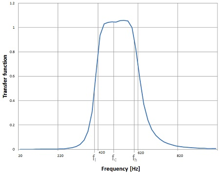
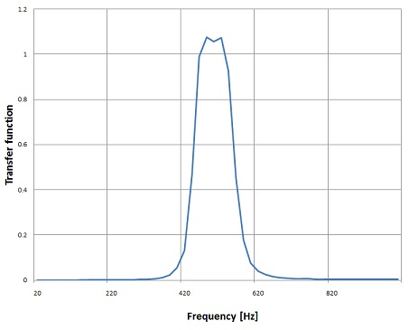
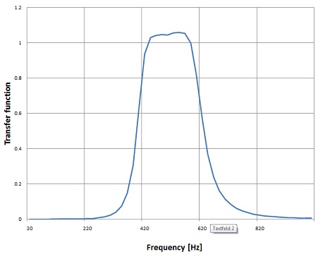
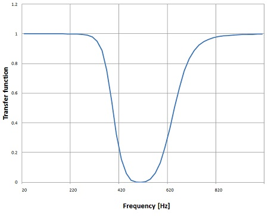
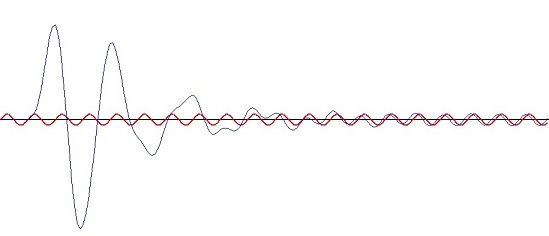

# Digital band pass and band stop filter

A band filter can be derived from a low pass filter by a so called low pass to band pass or band stop transformation. In this article I did this transformations with the filter algorithm of the [Butterworth filter](https://www.mosismath.com/DigitalSignal/Butterworth.html)

## Low pass to band pass transformation

The low pass to band pass transformation is quite similar to a low pass to high pass transformation. In the transfer function of the low pass filter:

$$H(s) = \frac{1}{a_0 s^M + a_1 s^{M-1} + \cdots + a_M}$$

The Laplace variable s must be substituted:

$$s_{lp} = \frac{1}{4\Omega} \cdot \frac{s_{bp}^2 + 1}{s_{bp}}$$

With $\Delta\Omega$ the normalized frequency gap of the band, $s_{lp}$ is s of the origin low pass filter and $s_{bp}$ is the s of the band pass filter:

$$\Delta\Omega = \frac{f_h - f_l}{\sqrt{f_h \cdot f_l}}$$



In this graph $f_c$ is the cut off frequency of the origin low pass filter. The pass band filter transformation mirrors the low pass filter to an additional high pass filter and shifts the frequency of both filters by the half of the filter band.

That means in the transfer function:

$$H(s) = \frac{1}{a_0 s^M + a_1 s^{M-1} + \cdots + a_M}$$

Every s must be replaced by:

$$s \rightarrow \frac{1}{4\Omega} \cdot \frac{s^2 + 1}{s}$$

Written in a generalized form that's:

$$\frac{1}{a_0 \left(\frac{1}{4\Omega} \cdot \frac{s^2 + 1}{s}\right)^M + a_1 \left(\frac{1}{4\Omega} \cdot \frac{s^2 + 1}{s}\right)^{M-1} + \cdots + a_M}$$

The fraction in the denominator must be eliminated:

$$\frac{s^M}{a_0 \left(\frac{1}{4\Omega}\right)^M (s^2 + 1)^M + a_1 \left(\frac{1}{4\Omega}\right)^{M-1} (s^2 + 1)^{M-1} s + \cdots + a_M s^M}$$

That would look like:

```csharp
public void BandFilterTransformation()
{
    int i, j;
    double[] tempA = { 1.0, 0, 1.0 }; // s^2 + 1
    double[] tempB = { deltaOmega, 0 }; // s * deltaOmega
    List<double[]> bandPar = new List<double[]>();
    
    for (i = 0; i <= order; i++)
    {
        double[] tempEl = Poly.Mult(Poly.Power(tempA, order - i), Poly.Power(tempB, i));
        tempEl = Poly.Mult(tempEl, a_s[i]);
        bandPar.Insert(i, tempEl);
    }
    Array.Resize(ref a_s, bandPar.ElementAt(0).Length);
    for (i = 0; i < a_s.Length; i++)
    {
        a_s[a_s.Length - 1 - i] = 0;
        for (j = 0; j < bandPar.Count; j++)
        {
            if (i < bandPar.ElementAt(j).Length)
                a_s[a_s.Length - 1 - i] = a_s[a_s.Length - 1 - i] + 
                    bandPar.ElementAt(j)[bandPar.ElementAt(j).Length - 1 - i];
        }
    }
    b_s = Poly.Mult(b_s, tempB);
    b_s = Poly.Power(b_s, order);
}
```

This function converts a given transfer function of a low pass filter, which is in the arrays a_s and b_s into a transfer function of a band pass filter and puts it back into the arrays a_s and b_s. In the complete algorithm first the Butterworth filter parameters must be computed and then these parameter are transformed into the band pass parameters.

In the graph of the transfer function further above one can see that the curve is not symmetrical to $f_c$. I regard this as a weakness of this algorithm. It's not symmetrical to $f_c$ and the wider the band $f_h - f_l$ the more asymmetrical it becomes. That means the less steep the slope on the side of $f_h$ will be. The algorithm works quite well for very narrow pass bands. For wider pass bands its smarter to combine a ordinary low pass filter with a high pass filter to implement the band pass filter.

With this we get the transfer function for the band pass filter in the Laplace domain. An important detail is that, if we start with a low pass filter of the order = N, the band pass filter gets the order = 2N.

This transfer function must be transferred to the z-domain now. That's similar to how I did it in [Butterworth filter](https://www.mosismath.com/DigitalSignal/Butterworth.html)

```csharp
public void TransformToZPlane()
{
    int i, j;
    double[] tempA = new double[2];
    List<double[]> aa = new List<double[]>();
    List<double[]> bb = new List<double[]>();
    
    for (i = 0; i < a_s.Length; i++)
    {
        aa.Add(new double[] { 1, -1 });
    }
    for (i = 0; i < b_s.Length; i++)
    {
        bb.Add(new double[] { 1, -1 });
    }
    tempA[0] = 1;
    tempA[1] = 1;
    for (i = 0; i < a_s.Length; i++)
    {
        double[] tempEl = aa.ElementAt(i);
        tempEl = Poly.Mult(Poly.Power(tempA, i), Poly.Power(tempEl, a_s.Length - 1 - i));
        tempEl = Poly.Mult(tempEl, a_s[i] * Math.Pow(2.0 / tc, a_s.Length - 1 - i));
        aa.RemoveAt(i);
        aa.Insert(i, tempEl);
    }
    
    for (i = 0; i < b_s.Length; i++)
    {
        double[] tempEl = bb.ElementAt(i);
        tempEl = Poly.Mult(Poly.Power(tempA, i), Poly.Power(tempEl, b_s.Length - 1 - i));
        tempEl = Poly.Mult(tempEl, b_s[i] * Math.Pow(2.0 / tc, b_s.Length - 1 - i));
        bb.RemoveAt(i);
        bb.Insert(i, tempEl);
    }
    
    a_z = new double[aa.Count];
    for (i = 0; i < a_z.Length; i++)
    {
        a_z[i] = 0;
        for (j = 0; j < aa.Count; j++)
            a_z[i] = a_z[i] + aa.ElementAt(j)[i];
    }
    
    b_z = new double[bb.Count];
    for (i = 0; i < b_z.Length; i++)
    {
        b_z[i] = 0;
        for (j = 0; j < bb.Count; j++)
            b_z[i] = b_z[i] + bb.ElementAt(j)[i];
    }
    
    for (i = 0; i < b_z.Length; i++)
    {
        b_z[i] = b_z[i] / a_z[0];
    }
    for (i = a_z.Length - 1; i >= 0; i--)
    {
        a_z[i] = a_z[i] / a_z[0];
    }
}
```

It becomes a bit longer than the one in [Butterworth filter](https://www.mosismath.com/DigitalSignal/Butterworth.html) because b_z is not just a number but a polynomial here. But that's now big deal.

I initialize $\Delta\Omega$ with:

```csharp
deltaOmega = dFgap / Math.Sqrt((dFcut - dFgap / 2) * (dFcut + dFgap / 2));
```

With this implementation order = 2 and a frequency gap of $f_h - f_l$ = 100 Hz at $f_c$ = 500 Hz the filter gets the transfer function:



And with a frequency gap of $f_h - f_l$ = 200 Hz at $f_c$ = 500 Hz:



It's quite good visible how much more asymmetrical the transfer function becomes already with the gap of 200 Hz.

## Low pass to band stop transformation

The low pass to band stop transformation is similar to a low pass to band pass transformation. In some descriptions they say you have to perform a low pass to high pass transformation first and do a high pass to band stop transformation with the same substitution as done for the low pass to band pass transformation:

$$H(s) = \frac{1}{a_0 s^M + a_1 s^{M-1} + \cdots + a_M}$$

As the low pass to high pass transformation (see [Butterworth filter](https://www.mosismath.com/DigitalSignal/Butterworth.html)) is done by the substitution:

$$s \rightarrow \frac{1}{s}$$

The low pass to band stop filter transformation can be done by just invert the substitution of the low pass to band pass transformation:

$$s_{lp} = \frac{1}{4\Omega} \cdot \frac{s_{bp}^2 + 1}{s_{bp}}$$

Which means:

$$s \rightarrow \frac{4\Omega \cdot s}{s^2 + 1}$$

The fraction in the denominator must be eliminated again:

$$\frac{(s^2 + 1)^M}{a_0 (4\Omega)^M s^M + a_1 (4\Omega)^{M-1} s^{M-1} (s^2 + 1) + \cdots + a_M (s^2 + 1)^M}$$

Or in the C# function:

```csharp
public void BandFilterTransformation()
{
    int i, j;
    double[] tempA = { 1.0, 0.0, 1.0 }; // s^2 + 1
    double[] tempB = { deltaOmega, 0.0 }; // s * deltaQ
    
    List<double[]> bandPar = new List<double[]>();
    for (i = 0; i <= order; i++)
    {
        double[] tempEl = Poly.Mult(Poly.Power(tempA, i), Poly.Power(tempB, order - i));
        tempEl = Poly.Mult(tempEl, a_s[i]);
        bandPar.Insert(i, tempEl);
    }
    Array.Resize(ref a_s, bandPar.ElementAt(bandPar.Count-1).Length);
    for (i = 0; i < a_s.Length; i++)
    {
        a_s[a_s.Length - 1 - i] = 0;
        for (j = 0; j < bandPar.Count; j++)
        {
            if(i < bandPar.ElementAt(j).Length)
                a_s[a_s.Length - 1 - i] = a_s[a_s.Length - 1 - i] + 
                    bandPar.ElementAt(j)[bandPar.ElementAt(j).Length - 1 - i];
        }
    }
    
    b_s = Poly.Power(tempA, order);
}
```

That creates the transfer function:



For the order = 3 and a frequency gap of $f_h - f_l$ = 200 Hz at $f_c$ = 500 Hz. Its slopes are principally less steep than the ones of the band pass filter. The band pass filter is already quite useful with the order = 2 whereas the band stop is still not too selective at the order = 3 and it shows an awful transient response for higher frequencies.



This is the transient response for the same filter at 1000 Hz. It takes 13 cycles to settle. That's not too nice I think. But that seems to be the way it is.

## C# Demo Project Butterworth band pass and band stop filter

- [Butterworth_Band_pass.zip](https://www.mosismath.com/downloads/DigitalFilter/Butterworth_Band_pass.zip)
- [Butterworth_Band_stop.zip](https://www.mosismath.com/downloads/DigitalFilter/Butterworth_Band_stop.zip)

## BibTeX

```bibtex
@article{moser2024band,
  author = {Moser, H.P.},
  title = {Digital band pass and band stop filter},
  year = {2024},
  url = {https://www.mosismath.com/DigitalSignal/ButterwordBand.html}
}
```