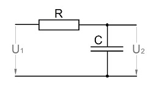
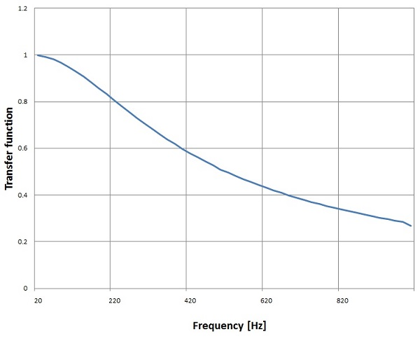
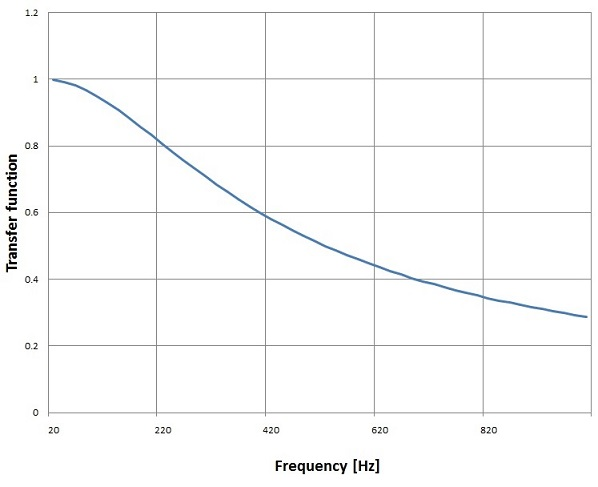
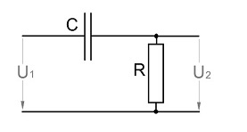
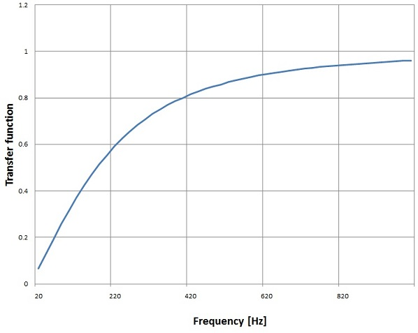
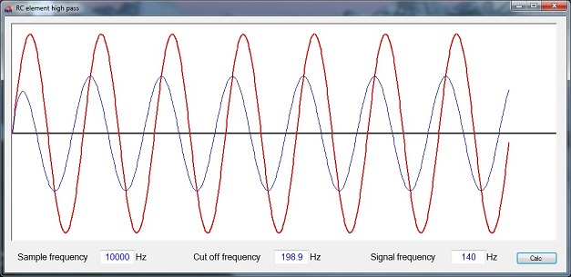

# Digital Filter Design

- **Author:** H.P. Moser
- **Source:** [https://www.mosismath.com/DigitalSignal/BasicFilter.html](https://www.mosismath.com/DigitalSignal/BasicFilter.html)

---

## Introduction

When the topic digital filters came to me for the first time I asked myself: How is the bridge between an analogue filter with its transfer function in frequency domain and a digital filter with its broken rational function?

A digital filter is defined by its broken rational function in the z-domain:

$$H(z) = \frac{b_0 + b_1 z^{-1}}{a_0 + a_1 z^{-1}}$$

With the formulation for the online calculation:

$$y\_out_n = y\_in_n \cdot b_0 + y\_in_{n-1} \cdot b_1 - y\_out_{n-1} \cdot a_1$$

## Low Pass Filter

An analogue filter is usually defined by its transfer function in the frequency domain like for instance a simple low pass RC element:



Has the transfer function:

$$H(j\omega) = \frac{1}{1 + j\omega RC}$$

This RC element has a transfer function in the Laplace domain like:

$$H(s) = \frac{1}{1 + sRC}$$

To get there we simply have to replace the $j\omega$ by $s$. That's it. (To get the behaviour like inrush output this equation would have to be multiplied by the Laplace transformed unit step and the resulting equation would have to be transformed back into time domain. Just to be mentioned)

To get the formulation for the digital implementation of such a filter is a bit a different story. Therefore the transfer function in the Laplace domain must be transformed into the transfer function in the z domain. That sounds quite frightening: Huuu... z transformation. But in fact it does not have too much to do with z transformations.

There is just a substitution called bilinear transformation. It substitutes $s$ like:

$$s = \frac{2}{T} \cdot \frac{z - 1}{z + 1}$$

With $T$ as the sampling time which is $1 / f_s$.

With this substitution the transfer function $H(z)$ becomes:

$$H(z) = \frac{1 + z^{-1}}{(1 + 2RC/T) + (1 - 2RC/T) z^{-1}}$$

Or a bit rearranged:

$$H(z) = \frac{1 + z^{-1}}{(1 + 1/T^*) + (1 - 1/T^*) z^{-1}}$$

and as the cut off frequency is:

$$f_c = \frac{1}{2\pi RC}$$

or:

$$RC = \frac{1}{2\pi f_c}$$

and:

$$T^* = \frac{2RC}{T} = 2RC \cdot f_s = \frac{2 f_s}{2\pi f_c} = \frac{f_s}{\pi f_c}$$

We can say:

$$T^* = \frac{f_s}{\pi f_c}$$

And our transfer function becomes:

$$H(z) = \frac{1 + z^{-1}}{(1 + 1/T^*) + (1 - 1/T^*) z^{-1}}$$

The value $T^*$ is quite an important value in digital filtering and we will meet it again with the other filters. It is the relation between sampling frequency and cut off frequency of a digital filter. So never forget that.

In the literature they usually work with $T^*$. But that's not too clearly mentioned. In this case the transfer function in $s$ would be:

$$H(s) = \frac{1}{1 + s/(2\pi f_c)}$$

and:

$$H(z) = \frac{1 + z^{-1}}{(1 + 1/T^*) + (1 - 1/T^*) z^{-1}}$$

Now. At the end we need a transfer function looking like:

$$H(z) = \frac{b_0 + b_1 z^{-1}}{a_0 + a_1 z^{-1}}$$

So our transfer function must be divided by $z^{-1}$:

$$H(z) = \frac{z^{-1} + z^{-2}}{(1 + 1/T^*) z^{-1} + (1 - 1/T^*) z^{-2}}$$

and:

$$H(z) = \frac{b_0 + b_1 z^{-1}}{a_0 + a_1 z^{-1}}$$

So we get:

$$H(z) = \frac{1 + z^{-1}}{(1 + 1/T^*) + (1 - 1/T^*) z^{-1}}$$

and have our digital filter parameters:

$$b_0 = \frac{1}{1 + 1/T^*}$$

$$b_1 = b_0$$

$$a_0 = 1$$

$$a_1 = \frac{1 - 1/T^*}{1 + 1/T^*}$$

And the online calculation would be like:

$$y\_out_n = y\_in_n \cdot b_0 + y\_in_{n-1} \cdot b_1 - y\_out_{n-1} \cdot a_1$$

The parameter $a_0$ is not mentioned. It is mathematically on the left side of the equation.

This formulation means: I have an input signal $y\_in$ which can be a signal that is read new in each iteration or it can be a sequence of a signal in form of a list or array. For the processing I need the actual signal $y\_in_n$ and the one of the last iteration $y\_in_{n-1}$. Additionally the output signal that has been computed in the last iteration $y\_out_{n-1}$ is needed. This signal and $y\_in_{n-1}$ must be stored from one iteration to next. If the input is a list, I can use the last index for $y\_in_{n-1}$ and just have to store $y\_out_{n-1}$. In my sample project I put the output signal into an array too and so I can use the last index of this output too.

To put that into code is not too complicated:

```csharp
// Calculate T
t = 1.0 * Math.PI * fc / fs;

// Create an input signal
for (i = 0; i < datapoints; i++)
{
    t_in[i] = i / fs;
    y_in[i] = 20.0 * Math.Sin(2.0 * Math.PI * t_in[i] * f);
}

// Build filter parameters
b[0] = 1 / (1.0 + 1.0 / t);
b[1] = b[0];
a[0] = 1.0;
a[1] = (1.0 - 1.0 / t) / (1.0 + 1.0 / t);

// Process the signal and compute the output
y_out[0] = 0;
for (i = 1; i < datapoints; i++)
{
    t_in[i] = i / fs;
    y_out[i] = y_in[i] * b[0] + y_in[i-1] * b[1] - y_out[i-1] * a[1];
}
```

This short sequence builds a sample signal with the frequency $f$ and a sample frequency $f_s$ and filters it with the cut off frequency $f_c$. The variable datapoints is the number of samples and y_in, y_out and t_in are arrays with the length datapoints.

O.k. it's probably not too interesting to build a filter of just the first order. But it's a good way to understand how things work.

With a sampling frequency of 10 kHz and a cut off frequency of 300 Hz this filter creates this transfer function between 20 Hz and 1000 Hz:



The transfer function of the real RC element in the frequency domain is:



Almost no difference. That's very close.

## High Pass Filter

The next step would be a high pass filter. In analogue technique that would look like:



Its transfer function:

$$H(j\omega) = \frac{j\omega RC}{1 + j\omega RC}$$

Or in the Laplace domain:

$$H(s) = \frac{sRC}{1 + sRC}$$

The transformation into the z domain is similar to the above one:

$$s = \frac{2}{T^*}\cdot \frac{z-1}{z+1} $$

Now digital filter parameters are:

$$b_0 = \frac{1/T^*}{1 + 1/T^*}$$

$$b_1 = -b_0$$

$$a_0 = 1$$

$$a_1 = \frac{1 - 1/T^*}{1 + 1/T^*}$$

If you compare these parameters with the parameters of the low pass filter, you might be astonished. There is no big difference. Only the enumerator is slightly different. Both values are additionally divided by $T^*$ and the sign of $b_1$ is opposite to the sign of $b_0$. That's really no big difference. But the filter behaves completely different. It's a high pass filter now and with a sampling frequency of 10 kHz and a cut off frequency of 300 Hz this filter creates this transfer function between 20 Hz and 1000 Hz:



## Sample Project

The demo project consists of one main window. It processes a short sample signal (red curve) and displays the filtered signal (blue curve). The cut off frequency, sampling frequency and signal frequency can be set.



---

## C# Demo Project RC Element Filter

- [RC_element_low.zip](RC_element_low/)
- [RC_element_high.zip](RC_element_high/)

---

## Source Information

- **Source URL:** <https://www.mosismath.com/DigitalSignal/BasicFilter.html>

---

## BibTeX

```bibtex
@misc{moser_basicfilter_mosismath,
  author       = {{H.P. Moser}},
  title        = {Digital Filter Design},
  year         = {2013},
  howpublished = {mosismath.com},
  url          = {https://www.mosismath.com/DigitalSignal/BasicFilter.html}
}
```
