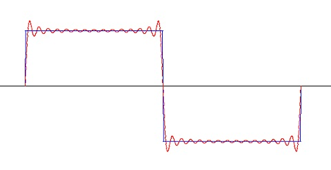
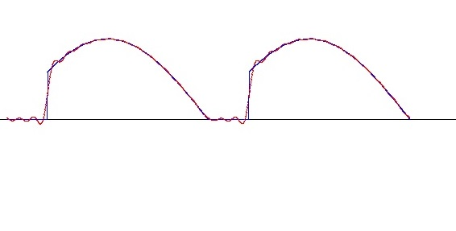
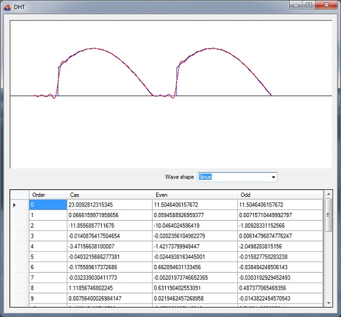

# Discrete Hartley Transformation

- **Author:** H.P. Moser
- **Source:** [https://www.mosismath.com/DigitalSignal/DHT.html](https://www.mosismath.com/DigitalSignal/DHT.html)

---

## Basic DHT Algorithm

It is said that the Fourier transformation must be computed with complex numbers and that would be a disadvantage. That's not fully true. To compute the discrete Fourier transformation there are no complex numbers required (see [Fourier transformation](https://www.mosismath.com/DigitalSignal/DFT.html)). Only the fast Fourier transformation must be computed completely with complex numbers. But o.k. the Hartley transformation (by Ralph Hartley, 1888 – 1970) is another approach to compute the frequency spectrum of a digitized signal. It is not that far away from the discrete Fourier transformation. It's basic function is to transform a digitized signal that consists of the sequence of points $x_0, \ldots, x_{N-1}$ into the spectrum $H_0, \ldots, H_{N-1}$.

In the literature the formulation for this is:

$$H_k = \sum_{n=0}^{N-1} x_n \cdot \text{cas}\left(\frac{2\pi kn}{N}\right)$$

I add a multiplication by $2/N$ to get the spectrum comparable to the one of the Fourier transformation. I don't understand why the most descriptions in the net do not have this. In the above formulation the magnitudes of the spectrum are depending on $N$, the number of data points and I regard this as wrong.

So my formulation looks like:

$$H_k = \frac{2}{N} \sum_{n=0}^{N-1} x_n \cdot \text{cas}\left(\frac{2\pi kn}{N}\right)$$

With:

$$\text{cas}(x) = \cos(x) + \sin(x)$$

For the inverse transformation from frequency spectrum back to the function in the time domain in some descriptions they say:

$$x_n = \sum_{k=0}^{N-1} H_k \cdot \text{cas}\left(\frac{2\pi kn}{N}\right)$$

Using the same cas function as is used for the transformation into the frequency domain. Which (I would say) is not really correct.

In the Fourier transformation there is a real parameter that represents the even part of the transformed function and an imaginary parameter that represents the odd part of the transformed function and for the inverse transformation both of these two parts are used. The same is valid for the Hartley transformation. There is an even part:

$$H_k^{\text{even}} = \frac{H_k + H_{N-k}}{2}$$

And an odd part:

$$H_k^{\text{odd}} = \frac{H_k - H_{N-k}}{2}$$

And the inverse transformation is:

$$x_n = \sum_{k=0}^{N-1} \left[ H_k^{\text{even}} \cdot \cos\left(\frac{2\pi kn}{N}\right) + H_k^{\text{odd}} \cdot \sin\left(\frac{2\pi kn}{N}\right) \right]$$

## DHT Algorithm Without Sinus

The cosine function is shifted by 90° against the sinus function. That means:

$$\cos(x) = \sin\left(x + \frac{\pi}{2}\right)$$

And with the addition theorem:

$$\sin(a + b) = \sin(a)\cos(b) + \cos(a)\sin(b)$$

We can write:

$$\cos\left(\frac{2\pi kn}{N}\right) = \sin\left(\frac{2\pi kn}{N} + \frac{\pi}{2}\right)$$

Or a bit simplified:

$$\cos\left(\frac{2\pi kn}{N}\right) = \sin\left(\frac{2\pi kn}{N}\right)\cos\left(\frac{\pi}{2}\right) + \cos\left(\frac{2\pi kn}{N}\right)\sin\left(\frac{\pi}{2}\right)$$

And as:

$$\cos\left(\frac{\pi}{2}\right) = 0 \quad \text{and} \quad \sin\left(\frac{\pi}{2}\right) = 1$$

We get:

$$\cos\left(\frac{2\pi kn}{N}\right) = \cos\left(\frac{2\pi kn}{N}\right)$$

With this the formulation for the Hartley transformation becomes:

$$H_k = \frac{2}{N} \sum_{n=0}^{N-1} x_n \cdot \left[\cos\left(\frac{2\pi kn}{N}\right) + \sin\left(\frac{2\pi kn}{N}\right)\right]$$

With this a function for the Hartley transformation becomes:

```csharp
public void CalcDHT()
{
    int k, n;
    if (N > 0)
    {
        for (k = 0; k < N; k++)
        {
            hk[k] = 0;
            for (n = 0; n < N; n++)
            {
                hk[k] += y[n] * Math.Cos((double)(2 * Math.PI * n * k / N - Math.PI / 4));
            }
            hk[k] *= 2.0 * Math.Sqrt(2.0)/N;
        }
    }
}
```

It uses the array of y as input signal and puts the $H_k$ values into the array of hk.

The inverse Hartley transformation is:

```csharp
public void InvDHT()
{
    int t, n;
    for (n = 0; n <= N; n++)
    {
        xw[n] = 0;
        for (t = 0; t < 30; t++)    // we only take the first 30 harmonics
        {
            xw[n] = xw[n] +
            (hk[t] + hk[N - t]) / 2 * Math.Cos(2.0 * Math.PI * t * n / N) +    //even part
            (hk[t] - hk[N - t]) / 2 * Math.Sin(2.0 * Math.PI * t * n / N);    // odd part
        }
    }
}
```

It rebuilds the signal in the array of xw for interpolation.

## Example Transformations

With these functions the Hartley transformation transforms a rectangle signal like:



Into the first 15 harmonics of the spectrum:

| Order | Hk |
| --- | --- |
| 0 | 3.21554935538437E-16 |
| 1 | 25.464707118844 |
| 2 | 7.23498604961448E-16 |
| 3 | 8.48801230266716 |
| 4 | 4.49172050580254E-15 |
| 5 | 5.09253929302974 |
| 6 | 2.11020426447099E-15 |
| 7 | 3.63724082113542 |
| 8 | -1.67811481984122E-15 |
| 9 | 2.828667181809853 |
| 10 | -1.6027503818244E-15 |
| 11 | 2.31405938320642 |
| 12 | -4.59220642315831E-15 |
| 13 | 1.95774086224722 |
| 14 | 1.24100107934366E-15 |

Whereas the discrete Fourier transformation yields:

| Order | Real | Imaginary |
| --- | --- | --- |
| 0 | 0.02 | 0 |
| 1 | 0.0399992104342477 | 25.4644557930854 |
| 2 | 0.039996841768152 | -0.000502641595333941 |
| 3 | 0.0399928940952303 | 8.48725836507854 |
| 4 | 0.0399873675713312 | -0.00100520381773272 |
| 5 | 0.0399802624146294 | 5.0912828626666 |
| 6 | 0.0399715789056238 | -0.00150760730679708 |
| 7 | 0.0399613173871263 | 3.6354820964027 |
| 8 | 0.0399494782642402 | -0.00200977272719102 |
| 9 | 0.0399360620043601 | 2.82640644671925 |
| 10 | 0.0399210691371318 | -0.00251162078117247 |
| 11 | 0.0399045002544494 | 2.31129698217785 |
| 12 | 0.0398863560104238 | -0.00301307222111737 |
| 13 | 0.0398666371213615 | 1.95447723778449 |
| 14 | 0.0398453443657271 | -0.00351404786202968 |

In the spectrum of the Fourier transformation the even and odd part are separated whereas in the Hartley spectrum they are in one value. Therefore the values of the Hartley spectrum are a little bigger.

In the spectrum of a cut sinus like:



that can be seen even better:

For this signal the Hartley spectrum is:

| Order | Hk |
| --- | --- |
| 0 | 23.0092812315345 |
| 1 | 0.0666159971958656 |
| 2 | -11.8556857711675 |
| 3 | -0.0140876417504654 |
| 4 | -3.47156638100007 |
| 5 | -0.0403215666277381 |
| 6 | -0.175589617372686 |
| 7 | -0.032339030411773 |
| 8 | 1.11856746802245 |
| 9 | 0.0075640026894147 |
| 10 | 0.466945198748732 |
| 11 | 0.0301195494298126 |
| 12 | -0.642755825680048 |
| 13 | 0.00627260112132765 |
| 14 | -0.790144420636424 |

And the Fourier spectrum:

| Order | Real | Imaginary |
| --- | --- | --- |
| 0 | 11.5043892949696 | 0 |
| 1 | 0.0589562610230698 | 0.00716026266867593 |
| 2 | -10.469050615505 | -1.80927699531154 |
| 3 | -0.0207381628005556 | 0.00615744275765244 |
| 4 | -1.42224048234037 | -2.04981575008416 |
| 5 | -0.0249962099155785 | -0.0158119619301591 |
| 6 | 0.662392346678507 | -0.838465303852372 |
| 7 | -0.0025218929746284 | -0.0302971927400855 |
| 8 | 0.63068839581609 | 0.487402320353414 |
| 9 | 0.021444075787817 | -0.0143538368905351 |
| 10 | -0.280470676893791 | 0.74694578702247 |
| 11 | 0.0157238428152612 | 0.0139289775143281 |
| 12 | -0.719235410663813 | 0.076016233829041 |
| 13 | -0.0120887408606778 | 0.017901387065085 |
| 14 | -0.298251742859625 | -0.492349218297676 |

There is one big difference: The first value of the Hartley spectrum is doubled as big as the same one of the Fourier spectrum. The reason for that is that this first value is a special case in the Fourier transformation and is multiplied by 2 in the inverse transformation.

## Sample Project

The sample project consists of one main window:



---

## C# Demo Project Hartley Transformation

- [Hartley.zip](./DHT/c#/)

---

## Source Information

- **Source URL:** <https://www.mosismath.com/DigitalSignal/DHT.html>

---

## BibTeX

```bibtex
@misc{moser_dht_mosismath,
  author       = {{H.P. Moser}},
  title        = {Discrete Hartley Transformation},
  year         = {2013},
  howpublished = {mosismath.com},
  url          = {https://www.mosismath.com/DigitalSignal/DHT.html}
}
```
