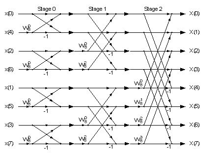
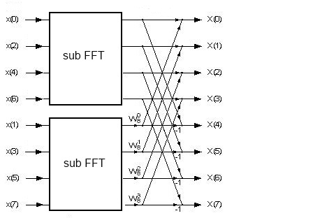
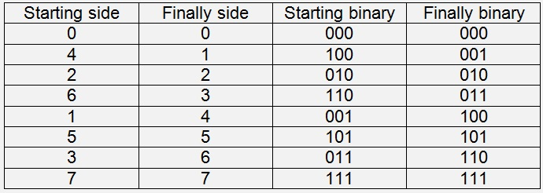

# Fast Fourier Transformation

- **Author:** H.P. Moser
- **Source:** [https://www.mosismath.com/DigitalSignal/fft.html](https://www.mosismath.com/DigitalSignal/fft.html)

---

## Basic Radix-2-FFT algorithm

The Radix-2-FFT algorithm for $N = 2^j$ samples splits the formula for the basic Fourier factors into 2 sums:

$$X(k) = \sum_{n=0}^{N-1} \left( x[n] * w_N^{n*k} \right) = \sum_{n=0,2,4,...}^{N-2} \left( x[n] * w_N^{n*k} \right) + \sum_{n=1,3,5,...}^{N-1} \left( x[n] * w_N^{n*k} \right)$$

Now there comes a substitution:

$n = 2m$ if $n$ is even

$n = 2m + 1$ if $n$ is odd.

With this substitution the above formula becomes:

$$X(k) = \sum_{m=0}^{M-1} \left( x[2m] * w_M^{m*k} \right) + w_N^k * \sum_{m=0}^{M-1} \left( x[2m + 1] * w_M^{m*k} \right)$$

with $M = N/2$

With the next substitution $u[m] = x[2m]$ and $v[m] = x[2m + 1]$:

$$X(k) = \sum_{m=0}^{M-1} \left( u[m] * w_M^{m*k} \right) + w_N^k * \sum_{m=0}^{M-1} \left( v[m] * w_M^{m*k} \right)$$

In this formula the two sub-DFT's:

$$\sum_{m=0}^{M-1} \left( u[m] * w_M^{m*k} \right) = u(k)$$

and

$$\sum_{m=0}^{M-1} \left( v[m] * w_M^{m*k} \right) = v(k)$$

are visible and that means the basic Fourier transformation can be split in two sub transformations and these two each can be split in two sub-sub transformations again and so on till we have only two samples left per transformation.

If we start with 8 samples this looks like that:



On the first glance it looks quite complicate. The input data is mixed up and there are many arrows in all directions. But if we just look at the last stage:



We get a simple system. In the formula above we see $[2m]$-elements are even and $[2m+1]$-elements are odd elements. That's why the odd elements are separated from the even ones here. If we look at the first formula and say we leave the output of one sub transformation in the input variables of it. We have to perform the sub transformations and just have to calculate the complex sums after that (given that $x[k]$ is the output of the sub transformation and $X[k]$ the output of this one):

$$X[0] = x[0] + x[1] * w_8^0$$
$$X[1] = x[2] + x[3] * w_8^1$$
$$X[2] = x[4] + x[5] * w_8^2$$
$$X[3] = x[6] + x[7] * w_8^3$$
$$X[4] = x[0] + x[1] * w_8^4$$
$$X[5] = x[2] + x[3] * w_8^5$$
$$X[6] = x[4] + x[5] * w_8^6$$
$$X[7] = x[6] + x[7] * w_8^7$$

And with:

$$w_8^4 = -w_8^0 \qquad w_8^5 = -w_8^1$$
$$w_8^6 = -w_8^2 \qquad w_8^7 = -w_8^3$$

We can replace:

$$X[4] = x[0] - x[1] * w_8^0$$
$$X[5] = x[2] - x[3] * w_8^1$$
$$X[6] = x[4] - x[5] * w_8^2$$
$$X[7] = x[6] - x[7] * w_8^3$$

And that's what the above graphic shows.

---

## Recursive algorithm

With a recursive approach this can be put into a quite small algorithm that is a bit easier to be understood than a none recursive one. An important detail to recognize here is possibly that we don't need the so called bit-reversal in this case. In most descriptions about the Radix-2 algorithm this bit-reversal is mentioned (we were tortured by it during studying). But there's no need for that here. We just have to separate the odd from the even samples in each recursion as can be seen in the graphic. Quite often that's not mentioned in descriptions of the Radix-2 algorithm. Of course the bit-reversal can be done here as well. It would have to be done in the beginning of the algorithm. There are many different ways to implement this transformation.

```csharp
public void CalcSubFFT(TComplex[] a, int n, int lo)
{
    int i, m;
    TComplex w;
    TComplex v;
    TComplex h;
    if (n > 1)
    {
        Shuffle(a, n, lo);
        m = n / 2;
        CalcSubFFT(a, m, lo);
        CalcSubFFT(a, m, lo + m);
        for (i = lo; i < lo + m; i++)
        {
            w.real = Math.Cos(2.0 * Math.PI * (double)(i - lo) / (double)(n));
            w.imag = Math.Sin(2.0 * Math.PI * (double)(i - lo) / (double)(n));
            h = kprod(a[i + m], w);
            v = a[i];
            a[i] = ksum(a[i], h);
            a[i + m] = kdiff(v, h);
        }
    }
}
```

With the separation of the odd and even samples:

```csharp
public void Shuffle(TComplex[] a, int n, int lo)
{
    if (n > 2)
    {
        int i, m = n / 2;
        TComplex[] b = new TComplex[m];
        for (i = 0; i < m; i++)
            b[i] = a[i * 2 + lo + 1];
        for (i = 0; i < m; i++)
            a[i + lo] = a[i * 2 + lo];
        for (i = 0; i < m; i++)
            a[i + lo + m] = b[i];
    }
}
```

At the end we have to put that all in one function and divide every element by $2N$:

```csharp
public void CalcFFT()
{
    int i;
    CalcSubFFT(y, N, 0);
    for (i = 0; i < N; i++)
    {
        y[i].imag = y[i].imag / (double)N * 2;
        y[i].real = y[i].real / (double)N * 2;
    }
}
```

As I already found in my article about the quick DFT, we have to calculate many sine and cosine values in these algorithms too. If we want to do a FFT repeatedly, it makes some sense to put all the sine and cosine values into a look up table and just get them from there. That speeds the calculation up quite well.

We create the look up table like:

```csharp
for (i = 0; i < (N / 2); i++)
{
    we[i].real = Math.Cos(2.0 * Math.PI * (double)(i) / (double)(N));
    we[i].imag = Math.Sin(2.0 * Math.PI * (double)(i) / (double)(N));
}
```

And replace the lines:

```csharp
w.real = Math.Cos(2.0 * Math.PI * (double)(i - lo) / (double)(n));
w.imag = Math.Sin(2.0 * Math.PI * (double)(i - lo) / (double)(n));
```

by:

```csharp
w.real = we[(i - lo)*N/n].real;
w.imag = we[(i - lo)*N/n].imag;
```

That reduced the calculation time for 4096 samples from 5 ms to 3 ms on my computer.

---

## None recursive algorithm

The disadvantage of the easy to be understood recursive approach is a bit higher time consumption. All together there are more operations to be done with these shuffles and recursions.

To get a quicker FFT we have to implement it none recursive. That looks a bit more complicate but it's worthwhile.

Here we need the "Bit-reversal" function:

If we have another look at the graph for the splitting:


We have to start on the very left side now and start with the four transformations with $N = 2$, put them together and calculate the two transformations with $N = 4$ and end up at the final transformation with $N = 8$. On the starting side we have a different order for the $x$ values from the ascending order we finally want.



If we look at the binary values of these two orders, the bits are exactly inverted. This is the so called "Bit-reversal" that has to be implemented here. This is my `BitInvert` function:

```csharp
public void BitInvert(TComplex[] a, int n)
{
    int i, j, mv = n/2;
    int k, rev = 0;
    TComplex b;
    for (i = 1; i < n; i++)
    {   // run through all the indexes from 1 to n
        k = i;
        mv = n / 2;
        rev = 0;
        while (k > 0) // invert the actual index
        {
            if ((k % 2) > 0)
                rev = rev + mv;
            k = k / 2;
            mv = mv / 2;
        }
        // switch the actual sample and the bitinverted one
        if (i < rev)
        {
            b = a[rev];
            a[rev] = a[i];
            a[i] = b;
        }
    }
}
```

For each index "i" I run through all the bits by "k" and invert them. The modulo division `k % 2` tells me whether the least significant bit is 1 or 0 and has to be put in reversed index or not. Starting at the most significant bit. Dividing k by 2 moves the second least significant bit one position to the right. In this way we get all the bits from least significant through most significant and have the reversal in "rev". Now we just have to switch the index "i" and "rev".

After this bit reversal we can calculate the sub FFT by:

```csharp
public void CalcSubFFT(TComplex[] a, int n)
{
    int i, k, m;
    TComplex w;
    TComplex v;
    TComplex h;
    k = 1;
    while (k <= n/2)
    {
        m = 0;
        while (m <= (n-2*k))
        {
            for (i = m; i < m + k; i++)
            {
                w.real = Math.Cos(Math.PI * (double)(i-m)/(double)(k));
                w.imag = Math.Sin(Math.PI * (double)(i-m)/(double)(k));
                h = kprod(a[i + k], w);
                v = a[i];
                a[i] = ksum(a[i], h);
                a[i + k] = kdiff(v, h);
            }
            m = m + 2 * k;
        }
        k = k * 2;
    }
}
```

These 2 functions have to be put in main call and all the elements have to be divided by $2N$:

```csharp
public void CalcFFT()
{
    int i;
    BitInvert(y, N);
    CalcSubFFT(y, N);
    for (i = 0; i < N; i++)
    {
        y[i].imag = y[i].imag / (double)N * 2;
        y[i].real = y[i].real / (double)N * 2;
    }
}
```

And if we finally put the sine and cosine values into a look up table:

```csharp
we = new TComplex[N / 2];
for (i = 0; i < (N / 2); i++)  // Init look up table for sine and cosine values
{
    we[i].real = Math.Cos(2* Math.PI * (double)(i) / (double)(N));
    we[i].imag = Math.Sin(2* Math.PI * (double)(i) / (double)(N));
}
```

And replace:

```csharp
w.real = Math.Cos(Math.PI * (double)(i-m)/(double)(k));
w.imag = Math.Sin(Math.PI * (double)(i-m)/(double)(k));
```

by:

```csharp
w.real = we[((i-m)*N / k/ 2)].real;
w.imag = we[((i-m)*N / k / 2)].imag;
```

That reduces the calculation time for the transformation by approx. 30% as well.

---

## C++ and C# specialities

C++ and C# provide the possibility to overload the operators `+`, `-`, `*` and `/`. That offers a very elegant way to extend the class `TComplex`:

```csharp
public struct TComplex
{
    public double real;
    public double imag;

    // operator overloads for complex numbers
    public static TComplex operator +(TComplex a, TComplex b)
    {
        TComplex res;
        res.real = a.real + b.real;
        res.imag = a.imag + b.imag;
        return (res);
    }

    public static TComplex operator -(TComplex a, TComplex b)
    {
        TComplex res;
        res.real = a.real - b.real;
        res.imag = a.imag - b.imag;
        return (res);
    }

    public static TComplex operator *(TComplex a, TComplex b)
    {
        TComplex res;
        res.real = a.real * b.real - a.imag * b.imag;
        res.imag = a.real * b.imag + a.imag * b.real;
        return (res);
    }

    public static TComplex operator /(TComplex a, TComplex b)
    {
        TComplex res;
        double l = b.imag * b.imag + b.real * b.real;
        if (l > 0.0)
        {
            res.real = (a.real * b.real + a.imag * b.imag) / l;
            res.imag = (-a.real * b.imag + a.imag * b.real) / l;
        }
        else
        {
            res.real = 1E300;
            res.imag = 0;
        }
        return (res);
    }
}
```

And with this the multiplications, additions, subtractions and divisions of complex numbers can be implemented like standard operations. That's quite handy.

For the analytic Fourier transformation of the used sample signals see [Fourier transformation](https://www.mosismath.com/Fourier/Fourier.html).

---

## C# Demo Projects FFT

- [FFT_rekursiv_std.zip](FFT_rekursiv_std.zip)
- [FFT_recursive.zip](FFT_recursive.zip)
- [FFT_not_recursive.zip](FFT_not_recursive.zip)
- [FFT_recursive_operator_ovl.zip](FFT_recursive_operator_ovl.zip)

## Java Demo Project FFT

- [FFT_recursive.zip](FFT_recursive.zip)
- [FFT_not_recursive.zip](FFT_not_recursive.zip)

---

## Source Information

- **Source URL:** <https://www.mosismath.com/DigitalSignal/fft.html>

---

## BibTeX

```bibtex
@misc{moser_fft_mosismath,
  author       = {{H.P. Moser}},
  title        = {Fast Fourier Transformation},
  year         = {2013},
  howpublished = {mosismath.com},
  url          = {https://www.mosismath.com/DigitalSignal/fft.html}
}
```
