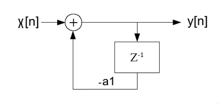

# First order Goertzel algorithm

- **Author:** H.P. Moser
- **Source:** [https://www.mosismath.com/DigitalSignal/Goertzel_1.html](https://www.mosismath.com/DigitalSignal/Goertzel_1.html)

---

## Another approach

The first order Goertzel algorithm is a faster way to perform a Discrete Fourier Transformation. Its disadvantage is a higher inaccuracy than the classical DFT algorithm has. That's the price for the speed.

Based on the equation of the Fourier transformation:

$$y_k = \frac{1}{N} \sum_{n=0}^{N-1} \left( x(n) e^{\frac{-j2\pi kn}{N}} \right)$$

The first order Goertzel algorithm is built on the convolution of $x[n]$ and an additional signal $h[n]$ and ends, after a hell of a complicated explanation, in the simple formula:

$$y(n) = b_0 * x(n) - a_1 * y(n-1)$$

with:

$$a_1 = -w^{\frac{-k}{N}}$$

and

$$b_0 = 1$$

The implementation of this into a Fourier transformation I first time found in a very interesting book about Matlab. It basically looked like:

```
a1 = -exp(1i*2*pi*k/N);
y = x(1);
for n = 2:N
    y = x(n) - a1*y;
end
y = -a1*y;
```

The signal path to this algorithm looks like:



Principally that's a system of first order containing a delayed feedback loop. The same algorithm in C looks like this:

```csharp
for (k = 0; k < N; k++)
{
    c[k].real = y[0].real;
    c[k].imag = y[0].imag;
    w.real = -Math.Cos((double)(2.0 * Math.PI * (double)(k) / (double)(N)));
    w.imag = Math.Sin((double)(2.0 * Math.PI * (double)(k) / (double)(N)));
    for (n = 1; n <= N; n++)
        c[k] = kdiff(y[n], kprod(c[k], w));
    c[k] = kprod(c[k], w);
    c[k].real = -c[k].real / (double)(N) * 2.0;
    c[k].imag = -c[k].imag / (double)(N) * 2.0;
}
```

With the complex operations:

```csharp
public TKomplex kdiff(TKomplex a, TKomplex b)
{
    TKomplex res;
    res.real = a.real - b.real;
    res.imag = a.imag - b.imag;
    return (res);
}

public TKomplex kprod(TKomplex a, TKomplex b)
{
    TKomplex res;
    res.real = a.real * b.real - a.imag * b.imag;
    res.imag = a.real * b.imag + a.imag * b.real;
    return (res);
}
```

---

## A first step to approach

Somehow I had the feeling that I have seen something like:

$$y(n) = b_0 * x(n) - a_1 * y(n-1)$$

already somewhere else… There is this thing about the polynomial:

$$y = a_1*x + a_2*x^2 + a_3*x^3 + a_4*x^4...$$

and its calculation like:

$$y = x * (a_1 + x*(a_2 + x*(a_3 + x*(a_4 ...))))$$

If I implement this in a small loop, it almost looks like the formula above already. But a Fourier transformation does not look like this polynomial. The formula of the Fourier transformation is:

$$y_k = \frac{1}{N} \sum_{n=0}^{N-1} \left( x(n) e^{\frac{-j2\pi kn}{N}} \right)$$

But there is a way to bring this into a polynomial. The expression:

$$e^{\frac{-j2\pi kn}{N}}$$

is a complex vector of the length 1 that spins around the unit circle. In the complex calculation we can say:

$$e^{\frac{-j2\pi kn}{N}} = \left(e^{\frac{-j2\pi k}{N}}\right)^n$$

And the Fourier transformation can be written like:

$$y_k = \frac{1}{N} \sum_{n=0}^{N-1} \left( f(n) \left(e^{\frac{-j2\pi k}{N}}\right)^n \right)$$

And that can be written as a polynomial:

$$y_k = \frac{1}{N} \left( f(0) \left(e^{\frac{-j2\pi k}{N}}\right)^0 + f(1) \left(e^{\frac{-j2\pi k}{N}}\right)^1 + f(2) \left(e^{\frac{-j2\pi k}{N}}\right)^2 + \cdots + f(n) \left(e^{\frac{-j2\pi k}{N}}\right)^n \right)$$

If I put this into a loop it starts like:

$$y_k = f(n)$$

and goes on like:

$$y_k = \left( f(n-1) + y_k * e^{\frac{-j2\pi k}{N}} \right)$$

and:

$$y_k = \left( f(n-2) + y_k * e^{\frac{-j2\pi k}{N}} \right)$$

and:

$$y_k = \left( f(n-3) + y_k * e^{\frac{-j2\pi k}{N}} \right)$$

Till we are at $f(0)$:

$$y_k = \left( f(0) + y_k * e^{\frac{-j2\pi k}{N}} \right)$$

And theoretically:

$$y_k = y_k * e^{\frac{-j0}{N}}$$

to finish this polynomial.

In the special case of the Fourier components this last term can be skipped as $e^0 = 1$.

Implemented in C this looks like:

```csharp
for (k = 0; k < N; k++)
{
    c[k].real = y[N].real;
    c[k].imag = y[N].imag;
    w.real = Math.Cos((double)(2.0 * Math.PI * (double)(k) / (double)(N)));
    w.imag = -Math.Sin((double)(2.0 * Math.PI * (double)(k) / (double)(N)));
    for (n = N - 1; n > 0; n--)
        c[k] = ksum(y[n], kprod(c[k], w));
    c[k].real = c[k].real / (double)(N) * 2.0;
    c[k].imag = -c[k].imag / (double)(N) * 2.0;
}
```

---

## Getting closer

That looks quite similar to the Goertzel algorithm already. But there are 3 points that differ:

1. $w$ is of opposite sign
2. in the inner loop the indexing $n$ starts at $N-1$ instead of $1$. That means we work from the backside.
3. In the loop we have an addition instead of a subtraction.

Now the big question is: What does that mean? If I run into the other direction in my loop, that's no difference for the addressing of the samples $y[n]$. They are still the same. But $w$ is a complex vector. If we start at $0$ with $n$ and increase it till $N$, $w$ will spin counter clockwise. If we run into the other direction starting at $N-1$ and decreasing $n$ till $1$, $w$ will spin clockwise. And that has some impact. Additionally we do not start at the same value of $w$. We start at:

$$e^{\frac{-j2\pi k(N-1)}{N}}$$

Instead of:

$$e^{\frac{-j2\pi kn}{N}}$$

This is basically the conjugate-complex value of $w$. Fortunately with this starting value $w$ will spin clockwise automatically as it has a negative imaginary part.

And finally: As we run into the other direction, the loop does not end at $e^0$ and we cannot just skip the last term. With this modification the algorithm becomes like this:

```csharp
for (k = 0; k < N; k++)
{
    c[k].real = y[0].real;
    c[k].imag = y[0].imag;
    w.real = Math.Cos((double)(2.0 * Math.PI * (double)(k) / (double)(N)));
    w.imag = Math.Sin((double)(2.0 * Math.PI * (double)(k) / (double)(N)));
    for (n = 1; n <= N; n++)
        c[k] = ksum(y[n], kprod(c[k], w));
    c[k] = kprod(c[k], w);
    c[k].real = c[k].real / (double)(N) * 2.0;
    c[k].imag = -c[k].imag / (double)(N) * 2.0;
}
```

---

## And closer

But still: The Goertzel algorithm does not work with the conjugate-complex of $e^{-jx}$. It uses the negative value of it and subtracts this instead of adding it. Because of this finally the real part of the Fourier components becomes negative and has to be negated at the end of the loop. Now the algorithm looks like this:

```csharp
for (k = 0; k < N; k++)
{
    c[k].real = y[0].real;
    c[k].imag = y[0].imag;
    w.real = -Math.Cos((double)(2.0 * Math.PI * (double)(k) / (double)(N)));
    w.imag = Math.Sin((double)(2.0 * Math.PI * (double)(k) / (double)(N)));
    for (n = 1; n <= N; n++)
        c[k] = kdiff(y[n], kprod(c[k], w));
    c[k] = kprod(c[k], w);
    c[k].real = -c[k].real / (double)(N) * 2.0;
    c[k].imag = -c[k].imag / (double)(N) * 2.0;
}
```

And this is the Goertzel algorithm. Derived from a polynomial calculation with some small modifications we got the same algorithm.

---

## Advantage and disadvantage of the Goertzel algorithm

The main goal of the Goertzel algorithm is the calculation speed. It has to calculate much less sine and cosine values than the standard implementation of the DFT and therefore it works quite a bit faster.

And there is a disadvantage: If we have a big amount of samples $N$ will be big as well and due to that $w$ will have a very small angle that has to be multiplied many, many times. A very small imaginary part has to be processed with a, compared to the imaginary part, big real part many times. That can cause a loss of accuracy of this calculation.

Run on a 32 bit system with less accuracy in the floating point numbers it even can become unstable and crash at a high amount of samples because the sine value of $w$ will become $0$.

For the analytic Fourier transformation of the used sample signals see [Fourier transformation](https://www.mosismath.com/Fourier/Fourier.html).

---

## C# Demo Project Goertzel 1

- [DFT_Goerzel_1.zip](./DFT_Goerzel_1/c#/)

## Java Demo Project Goertzel 1

- [DFT_Goertzel_1.zip](./DFT_Goertzel_1/java/)

---

## Source Information

- **Source URL:** <https://www.mosismath.com/DigitalSignal/Goertzel_1.html>

---

## BibTeX

```bibtex
@misc{moser_goertzel1_mosismath,
  author       = {{H.P. Moser}},
  title        = {First order Goertzel algorithm},
  year         = {2013},
  howpublished = {mosismath.com},
  url          = {https://www.mosismath.com/DigitalSignal/Goertzel_1.html}
}
```
