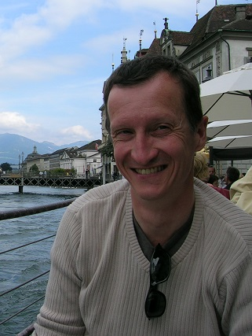

# Hans-Peter Moser

[www.mosismath.com](https://www.mosismath.com)

saved from [www.mosismath.com/about](https://www.mosismath.com/about/about.html)

[Digital signal processing](https://www.mosismath.com/DigitalSignal/DigitalSignal.html)

- [Digital filter design](https://www.mosismath.com/DigitalSignal/BasicFilter.html)
- [Bessel low pass filter](https://www.mosismath.com/DigitalSignal/Bessel.html)
- [Butterworth filter](https://www.mosismath.com/DigitalSignal/Butterworth.html)
- [Chebychev filter](https://www.mosis-math.com/DigitalSignal/Chebychev.html)
- [Shelving filter](https://www.mosismath.com/DigitalSignal/Shelving.html)
- [Digital band pass and band stop filter](https://www.mosismath.com/DigitalSignal/ButterwordBand.html)

- [Discrete Fourier Transformation](https://www.mosismath.com/DigitalSignal/DFT.html)
- [Fast Fourier Transformation](https://www.mosismath.com/DigitalSignal/fft.html)
- [First order Goertzel algorithm](https://www.mosismath.com/DigitalSignal/Goertzel_1.html)
- [Second order Goertzel algorithm](https://www.mosismath.com/DigitalSignal/Goertzel_2.html)
- [Reinsch Algorithm](https://www.mosismath.com/DigitalSignal/Reinsch.html)
- [Discrete Hartley transformation](https://www.mosismath.com/DigitalSignal/DHT.html)

hans-peter-moser
discrete-fourier-transformation
fast-fourier-transformation
first-order-goertzel-algorithm
second-order-goertzel-algorithm
reinsch-algorithm
discrete-hartley-transformation
digital-filter-design
bessel-low-pass-filter
butterworth-filter
chebychev-filter
shelving-filter
digital-band-pass-and-band-stop-filter
