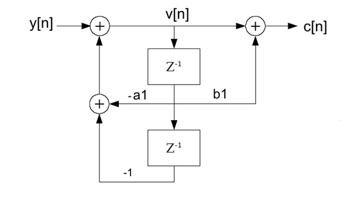

# Reinsch Algorithm

- **Author:** H.P. Moser
- **Source:** [https://www.mosismath.com/DigitalSignal/Reinsch.html](https://www.mosismath.com/DigitalSignal/Reinsch.html)

---

## Algorithm Description

In the 2nd order Goertzel algorithm the factor $a_1 = -2\cos(2k\pi/N)$ is used in the main loop in every cycle. With a great number of data samples $N$ becomes quite great and therefore $a_1$ quite close to $-2$. On a computer this can lead to round off errors and due to that to instability of the algorithm.

The Reinsch algorithm is a modified Goertzel algorithm that should run more stable than the 2nd order Goertzel algorithm.

In the description to the [2nd order Goertzel Algorithm](https://www.mosismath.com/DigitalSignal/Goertzel_2.html) we found the signal path:



And the formula to implement it as:

$$v[n] = y[n] - a_1 \cdot v[n-1] - v[n-2]$$

for the feedback part and:

$$c[n] = v[n] + b_1 \cdot v[n-1]$$

for the feed forward part with:

$$a_1 = -2\cos(2k\pi/N) \quad \text{and} \quad b_1 = -\exp(-j2k\pi/N)$$

Reinsch took these formulas and distinguished 2 cases:

- $\cos(2\pi k/N) > 0$
- $\cos(2\pi k/N) \geq 0$

## Case cos(2πk/N) > 0

For $\cos(2\pi k/N) > 0$ Reinsch takes the part:

$$v[n] = y[n] - a_1 \cdot v[n-1] - v[n-2]$$

Reinsch just extends both sides of this equation by $-v[n-1]$ and says for the difference between $v[n] - v[n-1]$:

$$v[n] - v[n-1] = y[n] - a_1 \cdot v[n-1] - v[n-2] - v[n-1]$$

Then he expands this equation by $+2 \cdot v[n-1]$ and $-2 \cdot v[n-1]$, and as $a_1 = -2\cos(2\pi k/N)$, he gets:

$$v[n] - v[n-1] = y[n] + (2\cos(2\pi k/N) - 2) \cdot v[n-1] + v[n-1] - v[n-2]$$

Now there are two substitutions:

$$(2\cos(2\pi k/N) - 2) = -4\sin(\pi k/N)^2$$

And with $v[n] - v[n-1] = dv[n]$, the last two terms $v[n-1] - v[n-2] = dv[n-1]$, we get:

$$dv[n] = y[n] - 4\sin(\pi k/N)^2 \cdot v[n-1] + dv[n-1]$$

And finally for $v[n]$:

$$v[n] = dv[n] + v[n-1]$$

This is a loop with $dv[n]$ as feedback part and looks like:

```csharp
a1.real = -4 * Math.Pow(Math.Sin((double)(Math.PI * (double)(k) / (double)(N))), 2.0);
a1.imag = 0;
we[k].real = a1.real;
for (n = 0; n < N; n++)
{
    dW = y[n].real + a1.real * v1.real + dW;
    v0.real = dW + v1.real;
    v1 = v0;
}
c[k].real = (dW - a1.real / 2.0 * v0.real) / (double)(N) * 2.0;
c[k].imag = (b1.imag * v1.real) / (double)(N) * 2.0;
```

## Case cos(2πk/N) ≥ 0

For $\cos(2\pi k/N) \geq 0$ Reinsch takes the sum instead of the difference:

$$v[n] + v[n-1] = y[n] - a_1 \cdot v[n-1] - v[n-2] + v[n-1]$$

And gets:

$$(2\cos(2\pi k/N) + 2) = 4\cos(\pi k/N)^2$$

And:

$$v[n] = dv[n] - v[n-1]$$

And that's like:

```csharp
a1.real = 4 * Math.Pow(Math.Cos((double)(Math.PI * (double)(k) / (double)(N))), 2.0);
a1.imag = 0;
we[k].real = a1.real;
for (n = 0; n < N; n++)
{
    dW = y[n].real + a1.real * v1.real - dW;
    v0.real = dW - v1.real;
    v1 = v0;
}
c[k].real = (dW - a1.real / 2.0 * v0.real) / (double)(N) * 2.0;
c[k].imag = (b1.imag * v1.real) / (double)(N) * 2.0;
```

## Stability Note

The instability of the Goertzel algorithm was caused by extinction of numbers after floating point in earlier time. That could have happened if the whole algorithm was implemented with float variables which had a precision of 7 digits after floating point. Implemented like this with more than 28000 samples $\cos(2\pi k/N)$ got 1.0 with $k = 1$.

But nowadays with double values, this does not happen anymore. So the two algorithms behave the same still with 100000 samples. That means there is no need for a Reinsch algorithm as long as the DFT is performed on a modern 64 Bit computer and is implemented in a modern language like C#.

---

## C# Demo Project DFT Reinsch Algorithm

- [DFT_Reinsch.zip](./DFT_Reinsch/c#/)

## Java Demo Project DFT Reinsch Algorithm

- [DFT_Reinsch.zip](./DFT_Reinsch/java/)

---

## Source Information

- **Source URL:** <https://www.mosismath.com/DigitalSignal/Reinsch.html>

---

## BibTeX

```bibtex
@misc{moser_reinsch_mosismath,
  author       = {{H.P. Moser}},
  title        = {Reinsch Algorithm},
  year         = {2013},
  howpublished = {mosismath.com},
  url          = {https://www.mosismath.com/DigitalSignal/Reinsch.html}
}
```
