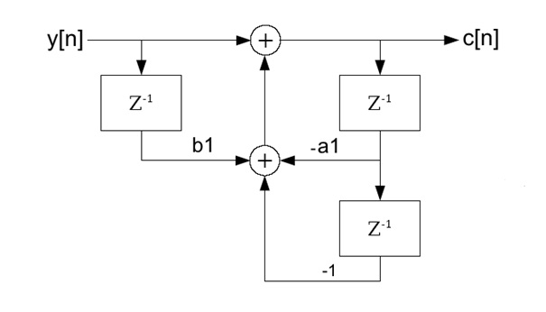
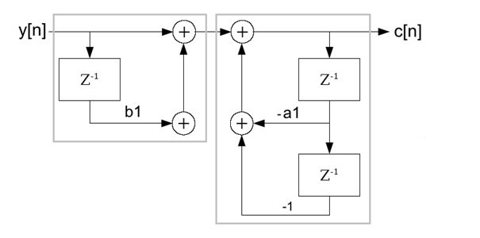
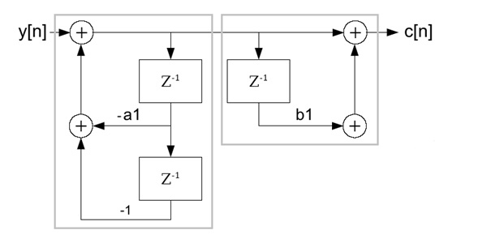

# Second order Goertzel algorithm

- **Author:** H.P. Moser
- **Source:** [https://www.mosismath.com/DigitalSignal/Goertzel_2.html](https://www.mosismath.com/DigitalSignal/Goertzel_2.html)

---

## Basic algorithm

There are many descriptions about the second order Goertzel algorithm to be found in the net. But most of them do not explain its derivation in fully. There is always the same part missing. So I try to fill this gap.

The second order Goertzel algorithm is an advancement of the first order Goertzel algorithm (for the entire description see [first order Goertzel algorithm](https://www.mosismath.com/DigitalSignal/Goertzel_1.html)). It is used to perform a Discrete Fourier Transformation and it's quite a bit faster than the basic DFT algorithm. But it is less accurate and can be unstable in certain cases. But let's start with the first order Goertzel algorithm first.

The first order Goertzel algorithm has the following simple form:

$$y(n) = b_0 * x(n) - a_1 * y(n-1)$$

For $n = 1$ to $N$.

In the digital signal processing this formula corresponds to the signal path:


and the transfer function:

$$H(z) = \frac{1}{1 + a_{1*} z^{-1}}$$

with:

$$a_1 = -e^{\frac{j2k\pi}{N}}$$

Now the big issue here is the complex denominator in the transfer function. To simplify the transfer function Goertzel multiplied the numerator and denominator by $1 + \overline{a_1} * z^{-1}$. That makes the denominator a real value and leads to:

$$H(z) = \frac{1 - e^{\frac{-j2k\pi}{N}} * z^{-1}}{1 - 2 * \cos\left(\frac{2k\pi}{N}\right) * z^{-1} + z^{-2}}$$

And this corresponds to the difference equation:

$$c[n] + a_1 * c[n-1] + c[n-2] = y[n] + b_1 * y[n-1]$$

with the substitution:

$$a_1 = -2\cos(2k\pi/N) \qquad \text{and} \qquad b_1 = -\exp(-j2k\pi/N)$$

For a long time I was wondering why they are doing this. The difference equation looks much more complicated now. But there is some advantage at the end.

Here most of the explanations now say: "As we are only interested in $c[n]$, we can leave the complex multiplication $b_1 * y[n-1]$ till the end of the calculation and have to carry it out only once at the end"… That's not the whole truth. We are interested in $c[n]$ and the complex calculation can be put to the end of the calculations. But there is no relation between these two things. It took me a deep look into the theories of digital signal processing to find out why.

The big step lays in the signal path. The signal path to the difference equation further above looks like:



If we would implement this, it would be something like:

$$c[n] = y[n] + b_1 * y[n-1] - a_1 * c[n-1] - c[n-2]$$

put into a loop. In each cycle we had the complex multiplication $b_1 * x[n-1]$ and due to that the whole calculation had to be carried out complex. Much more calculation effort than required in the first order Goertzel algorithm. That's not what we want.

But the signal path can as well be drawn like this:



Now we have two independent transfer functions and these two functions can be switched without influencing the resulting transfer function.



And we even can put them together again. This form is called the direct form II of the signal path and looks much better. The feedback part is now at the beginning of the function.


This put into code we get:

$$v[n] = y[n] – a_1 * v[n-1] – v[n-2]$$

for the left feedback part and:

$$c[n] = v[n] + b_1 * v[n-1]$$

for the right feed forward part.

And still:

$$a_1 = -2\cos(2k\pi/N) \qquad \text{and} \qquad b_1 = -\exp(-j2k\pi/N)$$

That's the big benefit. The feedback part, that has to be programmed in a loop, is fully real. Only in the feed forward part, that can be done at the end, we have just one complex multiplication. The rather complicated difference equation leads to a very short and quick algorithm just by changing the drawing of the signal path. A very impressive interaction of Mathematics and pure theories of digital signal processing (and the guy who did this, Gerald Goertzel, is really admirable).

The feedback part has to be implemented in a loop running through all the samples of $y$. That means from $0$ to $N-1$.

```csharp
for (n = 0; n < N; n++)
{
    v0.real = y[n].real - a1.real * v1.real - v2.real;
    v2 = v1;
    v1 = v0;
}
```

I used complex data types because at the end we have complex numbers.

The right part needs to be calculated only once at the end of the calculation (and it has nothing to do with the fact that we are looking for $c[n]$ only). Basically the right part contains the complex multiplication $v[n-1] * b_1$. So far we only had real values to deal with. That means $v[n-1]$ is real and has no imaginary part. Therefore the following complex multiplication becomes not very complicated. The real part becomes $v[n-1].real * b_1.real$ and the imaginary part becomes $v[n-1].real * b_1.imag$. Finally we are looking for the Fourier components:

$$a[n] = c[n].real*2 \qquad \text{and} \qquad b[n] = -c[n].imag*2$$

Both values should be calculated as:

$$c[n] = v[n] + b_1 * v[n-1]$$

Now for the real part that's:

$$c[k].real = (v0.real + b1.real * v2.real)$$

As $v[n]$ is a real value and has no imaginary part. The calculation for the imaginary part $c[k].imag$ becomes a bit shorter:

$$c[k].imag = -(b1.imag * v1.real)$$

And finally both values have to be divided by $N$ because of:

$$c_k = \frac{1}{N} \sum_{n=0}^{N-1} \left( f(n) e^{\frac{-j2\pi kn}{N}} \right)$$

With this the sequence for all the Fourier components $a[0]$ to $a[N-1]$ and $b[0]$ to $b[N-1]$ is:

```csharp
for (k = 0; k < N; k++)
{
    v0.real = 0;
    v0.imag = 0;
    v1.real = y[1].real;
    v1.imag = y[1].imag;
    v2.real = y[0].real;
    v2.imag = y[0].imag;
    b1.real = -Math.Cos((double)(2.0 * Math.PI * (double)(k) / (double)(N)));
    b1.imag = Math.Sin((double)(2.0 * Math.PI * (double)(k) / (double)(N)));
    a1.real = -2 * Math.Cos((double)(2.0 * Math.PI * (double)(k) / (double)(N)));
    a1.imag = 0;
    for (n = 0; n < N; n++)
    {
        v0.real = y[n].real - a1.real * v1.real - v2.real;
        v2 = v1;
        v1 = v0;
    }
    c[k].real = (v0.real + b1.real * v2.real) / (double)(N) * 2.0;
    c[k].imag = -(b1.imag * v1.real) / (double)(N) * 2.0;
}
```

Implemented like this the second order Goertzel algorithm is a very fast way to carry out a Discrete Fourier transformation. On my computer the test application with 1000 samples takes 8 ms. A standard implementation of the Discrete Fourier transformation takes 120 ms for the same calculation. But this increase of calculation speed costs some accuracy and the Goertzel algorithm is not stable in any case. Already in my test application some inaccuracy is visible. For the rectangle signal all the real parts should become $0$. But $a[1] = -0.12$, $a[2] = 0.04$, $a[3] = -0.11$ and so on. In the standard implementation $a[1] = 0.04$, $a[2] = 0.04$, $a[3] = 0.04$ for the phase shift of the harmonics that can make quite a difference.

The second order Goertzel algorithm is a very quick thing but it has its disadvantages. I made a bit a quicker implementation of the Discrete Fourier transformation by putting the calculations of all the used $\exp(j2k\pi/N)$ values into an array and picking them from there. With this algorithm the same transformation runs in 20 ms and is as accurate as the standard implementation. See [Discrete Fourier Transformation](https://www.mosismath.com/DigitalSignal/DFT.html) that could be a good alternative.

For the analytic Fourier transformation of the used sample signals see [Fourier transformation](https://www.mosismath.com/Fourier/Fourier.html).

---

## C# Demo Project Goertzel 2

- [DFT_Goerzel_2.zip](./DFT_Goerzel_2/c#/)

## Java Demo Project Goertzel 2

- [DFT_Goerzel_2.zip](./DFT_Goerzel_2/java/)

---

## Source Information

- **Source URL:** <https://www.mosismath.com/DigitalSignal/Goertzel_2.html>

---

## BibTeX

```bibtex
@misc{moser_goertzel2_mosismath,
  author       = {{H.P. Moser}},
  title        = {Second order Goertzel algorithm},
  year         = {2013},
  howpublished = {mosismath.com},
  url          = {https://www.mosismath.com/DigitalSignal/Goertzel_2.html}
}
```
