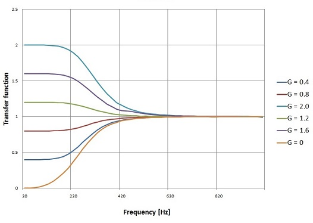
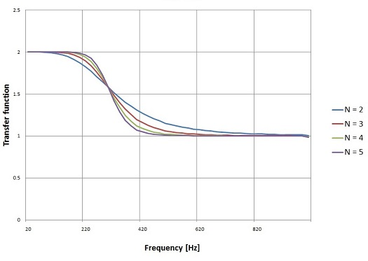
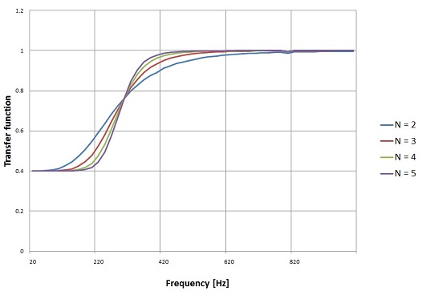
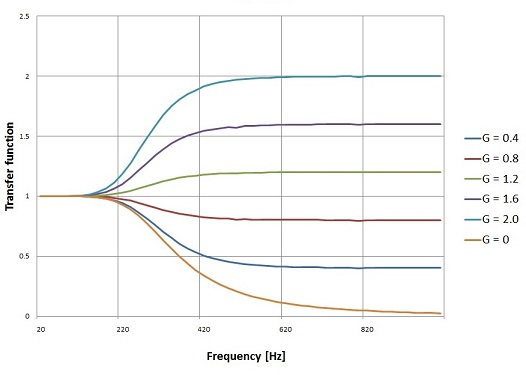
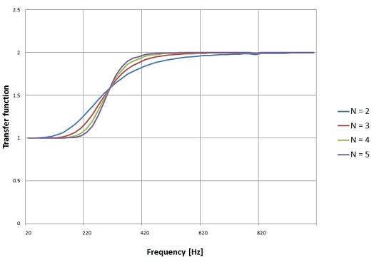
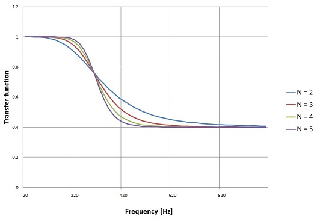

# Shelving filter

Digital filters like the Bessel, Butterworth or Chebychev filter cut down the output signal to 0 in the blocking band. This is not always wanted. In digital equalizing for instance we just want to reduce or boost the output signal by a certain amount in the blocking band. This can be done by the Shelving filter. The shelving filter uses an amplification factor G that increases the output signal if bigger than 1 or decreases it if smaller than 1.

Drawing the transfer function for different values of G gives the specific image that gives the filter its name:



It looks like (with some fantasy) a continental shelf ([https://en.wikipedia.org/wiki/Continental_shelf](https://en.wikipedia.org/wiki/Continental_shelf)). In the German speaking areas it's even better. There they call "Kuhschwanz Filter" ([https://de.wikipedia.org/wiki/Kuhschwanzfilter](https://de.wikipedia.org/wiki/Kuhschwanzfilter)) what means exactly translated "cow tail filter", because the transfer function would look like a waving cow tail. I think they have no idea about cows.


Cows don't care for digital filtering.

## High pass Shelving filter

As the Shelving filter uses an amplification factor which can be bigger or smaller than 1, it is not that easy to distinguish a high pass from a low pass filter. Usually a high pass filter affects the low frequencies of a signal and leave the high frequency's untouched. The same is here: At the high pass Shelving filter the transfer ration at high frequency's is 1.

The transfer ration for lower frequencies depends on the amplification G. The transfer function of the Shelving filter in the Laplace domain is:

$$H(s) = \prod_{n=1}^{N} \frac{s + \sqrt[N]{G} \cdot e^{-j a_n}}{s + e^{-j a_n}}$$

with

$$a_n = \left(\frac{1}{2} - \frac{2n-1}{2N}\right) \cdot \pi$$

and G as the amplification.

On the first glimpse that looks quite strange. Complex numbers in the s domain are rather unusual. But if we spend the effort and do some calculations, we get for N = 2:

$$\frac{(s + \sqrt{G} \cdot e^{-j a_1})(s + \sqrt{G} \cdot e^{-j a_2})}{(s + e^{-j a_1})(s + e^{-j a_2})}$$

and the enumerator:

$$s^2 + \sqrt{G} \cdot (e^{-j a_1} + e^{-j a_2}) \cdot s + G \cdot e^{-j(a_1+a_2)}$$

and denominator:

$$s^2 + (e^{-j a_1} + e^{-j a_2}) \cdot s + e^{-j(a_1+a_2)}$$

the transfer function becomes:

$$H(s) = \frac{s^2 + \sqrt{G} \cdot (e^{-j a_1} + e^{-j a_2}) \cdot s + G \cdot e^{-j(a_1+a_2)}}{s^2 + (e^{-j a_1} + e^{-j a_2}) \cdot s + e^{-j(a_1+a_2)}}$$

which is similar to

$$H(s) = \frac{s^2 + 2 \cdot \cos(a_1) \cdot \sqrt{G} \cdot s + G}{s^2 + 2 \cdot \cos(a_1) \cdot s + 1}$$

As it is usually written in the literature.

(See [Complex numbers](https://www.mosismath.com/Basics/Complex.html) for the math with complex numbers)

For N = 3:

$$\frac{(s + \sqrt[3]{G} \cdot e^{-j a_1})(s + \sqrt[3]{G} \cdot e^{-j a_2})(s + \sqrt[3]{G} \cdot e^{-j a_3})}{(s + e^{-j a_1})(s + e^{-j a_2})(s + e^{-j a_3})}$$

And, similar to above, the transfer function becomes:

$$H(s) = \frac{s^3 + \sqrt[3]{G} \cdot (e^{-j a_1} + e^{-j a_2} + e^{-j a_3}) \cdot s^2 + \sqrt[3]{G}^2 \cdot (e^{-j(a_1+a_2)} + e^{-j(a_1+a_3)} + e^{-j(a_2+a_3)}) \cdot s + G \cdot e^{-j(a_1+a_2+a_3)}}{s^3 + (e^{-j a_1} + e^{-j a_2} + e^{-j a_3}) \cdot s^2 + (e^{-j(a_1+a_2)} + e^{-j(a_1+a_3)} + e^{-j(a_2+a_3)}) \cdot s + e^{-j(a_1+a_2+a_3)}}$$

For N = 4:

$$\frac{(s + \sqrt[4]{G} \cdot e^{-j a_1})(s + \sqrt[4]{G} \cdot e^{-j a_2})(s + \sqrt[4]{G} \cdot e^{-j a_3})(s + \sqrt[4]{G} \cdot e^{-j a_4})}{(s + e^{-j a_1})(s + e^{-j a_2})(s + e^{-j a_3})(s + e^{-j a_4})}$$

The transfer function becomes a bit bigger:

$$H(s) = \frac{s^4 + \sqrt[4]{G} \cdot (e^{-j a_1} + e^{-j a_2} + e^{-j a_3} + e^{-j a_4}) \cdot s^3 + \sqrt[4]{G}^2 \cdot (e^{-j(a_1+a_2)} + e^{-j(a_1+a_3)} + e^{-j(a_1+a_4)} + e^{-j(a_2+a_3)} + e^{-j(a_2+a_4)} + e^{-j(a_3+a_4)}) \cdot s^2 + \sqrt[4]{G}^3 \cdot (e^{-j(a_1+a_2+a_3)} + e^{-j(a_1+a_2+a_4)} + e^{-j(a_1+a_3+a_4)} + e^{-j(a_2+a_3+a_4)}) \cdot s + G \cdot e^{-j(a_1+a_2+a_3+a_4)}}{s^4 + (e^{-j a_1} + e^{-j a_2} + e^{-j a_3} + e^{-j a_4}) \cdot s^3 + (e^{-j(a_1+a_2)} + e^{-j(a_1+a_3)} + e^{-j(a_1+a_4)} + e^{-j(a_2+a_3)} + e^{-j(a_2+a_4)} + e^{-j(a_3+a_4)}) \cdot s^2 + (e^{-j(a_1+a_2+a_3)} + e^{-j(a_1+a_2+a_4)} + e^{-j(a_1+a_3+a_4)} + e^{-j(a_2+a_3+a_4)}) \cdot s + e^{-j(a_1+a_2+a_3+a_4)}}$$

And for N = 5:

$$\frac{(s + \sqrt[5]{G} \cdot e^{-j a_1})(s + \sqrt[5]{G} \cdot e^{-j a_2})(s + \sqrt[5]{G} \cdot e^{-j a_3})(s + \sqrt[5]{G} \cdot e^{-j a_4})(s + \sqrt[5]{G} \cdot e^{-j a_5})}{(s + e^{-j a_1})(s + e^{-j a_2})(s + e^{-j a_3})(s + e^{-j a_4})(s + e^{-j a_5})}$$

A kind of an order becomes visible for the transfer function:

$$H(s) = \frac{s^N + G^{1/N} \cdot \sum_{i} e^{-j a_i} \cdot s^{N-1} + G^{2/N} \cdot \sum_{i<j} e^{-j(a_i+a_j)} \cdot s^{N-2} + \cdots + G \cdot e^{-j \sum a_n}}{s^N + \sum_{i} e^{-j a_i} \cdot s^{N-1} + \sum_{i<j} e^{-j(a_i+a_j)} \cdot s^{N-2} + \cdots + e^{-j \sum a_n}}$$

These transfer functions can be written in general formulations:

For N is even we get:

$$H(s) = \frac{\prod_{n=1,3,5,...}^{N-1} (s^2 + 2 \cdot \cos(a_n) \cdot \sqrt[N]{G} \cdot s + \sqrt[N]{G}^2)}{\prod_{n=1,3,5,...}^{N-1} (s^2 + 2 \cdot \cos(a_n) \cdot s + 1)}$$

Only odd n's.

For N is odd we get:

$$H(s) = \frac{(s + \sqrt[N]{G}) \cdot \prod_{n=2,4,6,...}^{N-1} (s^2 + 2 \cdot \cos(a_n) \cdot \sqrt[N]{G} \cdot s + \sqrt[N]{G}^2)}{(s + 1) \cdot \prod_{n=2,4,6,...}^{N-1} (s^2 + 2 \cdot \cos(a_n) \cdot s + 1)}$$

Only even n's.

And that's quite easy to be implemented in a C# function:

```csharp
public void CalcShelving(double amp)
{
    int i = 1;
    a_s = new double[1];
    b_s = new double[1];
    double[] poly = new double[3];
    double gl = Math.Pow(amp, 1.0 / order);
    double tempD;
    
    if (order % 2 == 0) // order is even
    {
        a_s = new double[1];
        b_s = new double[1];
        b_s[0] = 1.0;
        a_s[0] = 1.0;
        for (i = 1; i < order; i += 2)
        {
            poly[0] = 1.0;
            poly[1] = 2.0 * Math.Cos(Math.PI * i / 2.0 / order) * gl;
            poly[2] = gl * gl;
            b_s = Poly.Mult(b_s, poly);
            poly[0] = 1.0;
            poly[1] = 2.0 * Math.Cos(Math.PI * i / 2.0 / order);
            poly[2] = 1.0;
            a_s = Poly.Mult(a_s, poly);
        }
    }
    else // order is odd
    {
        a_s = new double[2];
        b_s = new double[2];
        b_s[0] = 1.0;
        b_s[1] = gl;
        a_s[0] = 1.0;
        a_s[1] = 1.0;
        for (i = 2; i < order; i += 2)
        {
            poly[0] = 1.0;
            poly[1] = 2.0 * Math.Cos(Math.PI * i / 2.0 / order) * gl;
            poly[2] = gl * gl;
            b_s = Poly.Mult(b_s, poly);
            poly[0] = 1.0;
            poly[1] = 2.0 * Math.Cos(Math.PI * i / 2.0 / order);
            poly[2] = 1.0;
            a_s = Poly.Mult(a_s, poly);
        }
    }
}
```

With N = 3, cut off frequency = 300 Hz and sampling frequency = 10 kHz that creates the following transfer functions for different G's:


And with a fixed G = 2.0 and N = 2 to 5:



Looks possibly a bit confusing as it is a high pass filter and it increases the output at low frequencies. But high pass means the filter affects to low frequencies and leaves the high frequencies untouched.

Or for G = 0.4:



## Low pass Shelving filter

To get the same functionality on the high frequency side we have to do a high pass to low pass transformation. This is done by the substitution of s by 1/s in the Laplace domain.

For a transfer function like:

$$H(s) = \frac{b_N s^N + b_{N-1} s^{N-1} + \cdots + b_1 s + b_0}{a_N s^N + a_{N-1} s^{N-1} + \cdots + a_1 s + a_0}$$

that is:

$$H(1/s) = \frac{b_N (1/s)^N + b_{N-1} (1/s)^{N-1} + \cdots + b_1 (1/s) + b_0}{a_N (1/s)^N + a_{N-1} (1/s)^{N-1} + \cdots + a_1 (1/s) + a_0}$$

If we remove the compound fractions, that just switches the order of the a_i and the b_i values what can be done in the function:

```csharp
public void CalcShelving(double amp, bool bHighPass)
```

by adding the parameter bHighPass and modifying the lines at the end of the function to:

```csharp
if(!bHighPass)
{
    for(i=0; i < a_s.Length / 2; i++)
    {
        tempD = a_s[i];
        a_s[i] = a_s[a_s.Length - 1 - i];
        a_s[a_s.Length - 1 - i] = tempD;
    }
    
    for (i = 0; i < b_s.Length / 2; i++)
    {
        tempD = b_s[i];
        b_s[i] = b_s[b_s.Length - 1 - i];
        b_s[a_s.Length - 1 - i] = tempD;
    }
}
```

That's all.

With this we get the graphs:

For N = 3 and various G's:



With fixed G = 2.0 and various N's:



With fixed G = 0.4 and various N's:



The Shelving filter could easily be transformed into a band block filter as I did it in [Digital band pass and band stop filter](https://www.mosismath.com/DigitalSignal/ButterwordBand.html). But I think that does not make too much sense as this filter would have the same G on the high and low frequency side. That wouldn't be that cool.

A online solver in JavaScript, that returns the filter parameters, can be found on [Shelving filter](https://www.mosismath.com/Solver/Shelving.html)

## C# Demo Project Shelving filter

- [Shelving.zip](https://www.mosismath.com/downloads/DigitalFilter/Shelving.zip)

## BibTeX

```bibtex
@article{moser2024shelving,
  author = {Moser, H.P.},
  title = {Shelving filter},
  year = {2024},
  url = {https://www.mosismath.com/DigitalSignal/Shelving.html}
}
```