# Estimating the Hurst Exponent

| Contents |
| --- |
| [Why is the Hurst Exponent Interesting](http://www.bearcave.com/misl/misl_tech/wavelets/hurst/index.html#Why) |
| [White Noise and Long Memory](http://www.bearcave.com/misl/misl_tech/wavelets/hurst/index.html#WhiteNoise) |
| [The Hurst Exponent and Fractional Brownian Motion](http://www.bearcave.com/misl/misl_tech/wavelets/hurst/index.html#fBm) |
| [The Hurst Exponent and Finance](http://www.bearcave.com/misl/misl_tech/wavelets/hurst/index.html#HurstAndFinance) |
| [The Hurst Exponent, Long Memory Processes and Power Laws](http://www.bearcave.com/misl/misl_tech/wavelets/hurst/index.html#HurstPowerLaws) |
| [So who is this guy Hurst?](http://www.bearcave.com/misl/misl_tech/wavelets/hurst/index.html#WhoIsHurst) |
| [The Hurst Exponent, Wavelets and the Rescaled Range Calculation](http://www.bearcave.com/misl/misl_tech/wavelets/hurst/index.html#WaveletsAndRS) |
| [Understanding the Rescaled Range (R/S) Calculation](http://www.bearcave.com/misl/misl_tech/wavelets/hurst/index.html#RSEstimation) |
| [Reservoir Modeling](http://www.bearcave.com/misl/misl_tech/wavelets/hurst/index.html#ReservoirModeling) |
| [Estimating the Hurst Exponent from the Rescaled Range](http://www.bearcave.com/misl/misl_tech/wavelets/hurst/index.html#EstimatingHurstWithRs) |
| [Basic Variations on the Rescaled Range Algorithm](http://www.bearcave.com/misl/misl_tech/wavelets/hurst/index.html#RSVariations) |
| [Applying the R/S Calculation to Financial Data](http://www.bearcave.com/misl/misl_tech/wavelets/hurst/index.html#RSAndFinance) |
| [Estimating the Hurst Exponent using Wavelet Spectral Density](http://www.bearcave.com/misl/misl_tech/wavelets/hurst/index.html#EstimatingWithWavelets) |
| [Wavelet Packets](http://www.bearcave.com/misl/misl_tech/wavelets/hurst/index.html#WaveletPackets) |
| [Other Paths Not Taken](http://www.bearcave.com/misl/misl_tech/wavelets/hurst/index.html#OtherPaths) |
| [Retrospective: the Hurst Exponent and Financial Time Series](http://www.bearcave.com/misl/misl_tech/wavelets/hurst/index.html#Retrospective) |
| [C++ Software Source](http://www.bearcave.com/misl/misl_tech/wavelets/hurst/index.html#SoftwareSource) |
| [Books](http://www.bearcave.com/misl/misl_tech/wavelets/hurst/index.html#Books) |
| [Web References](http://www.bearcave.com/misl/misl_tech/wavelets/hurst/index.html#WebRefs) |
| [Related Web pages on www.bearcave.com](http://www.bearcave.com/misl/misl_tech/wavelets/hurst/index.html#RelatedPages) |
| [Acknowledgments](http://www.bearcave.com/misl/misl_tech/wavelets/hurst/index.html#Acknowledgments) |

### Why is the Hurst Exponent Interesting?

The Hurst exponent occurs in several areas of applied mathematics, including fractals and chaos theory, long memory processes and spectral analysis. Hurst exponent estimation has been applied in areas ranging from biophysics to computer networking. Estimation of the Hurst exponent was originally developed in hydrology. However, the modern techniques for estimating the Hurst exponent comes from fractal mathematics.

The mathematics and images derived from fractal geometry exploded into the world the 1970s and 1980s. It is difficult to think of an area of science that has not been influenced by fractal geometry. Along with providing new insight in mathematics and science, fractal geometry helped us see the world around us in a different way. Nature is full of self-similar fractal shapes like the fern leaf. A self-similar shape is a shape composed of a basic pattern which is repeated at multiple (or infinite) scale. An example of an artificial self-similar shape is the Sierpinski pyramid shown in Figure 1.

**Figure 1**, a self-similar four sided Sierpinski pyramid
  [](http://www.bearcave.com/images/sierbig.jpg)
 (Click on the image for a larger version) From the [Sierpinski Pyramid](http://www.bearcave.com/dxf/sier.htm) web page on bearcave.com.

More examples of self-similar fractal shapes, including the fern leaf, can be found on the [The Dynamical Systems and Technology Project](http://math.bu.edu/DYSYS/index.html) web page at Boston University.

The Hurst exponent is also directly related to the "fractal dimension", which gives a measure of the roughness of a surface. The fractal dimension has been used to measure the roughness of coastlines, for example. The relationship between the fractal dimension, *D*, and the Hurst exponent, *H*, is

**Equation 1**
$$D = 2 - H$$

There is also a form of self-similarity called *statistical self-similarity*. Assuming that we had one of those imaginary infinite self-similar data sets, any section of the data set would have the same statistical properties as any other. Statistical self-similarity occurs in a surprising number of areas in engineering. Computer network traffic traces are self-similar (as shown in Figure 2)

**Figure 2**, a self-similar network traffic
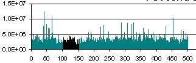
 This is an edited image that I borrowed from a page on network traffic simulation. I've misplaced the reference and I apologize to the author.

Self-similarity has also been found in memory reference traces. Congested networks, where TCP/IP buffers start to fill, can show self-similar chaotic behavior. The self-similar structure observed in real systems has made the measurement and simulation of self-similar data an active topic in the last few years.

Other examples of statistical self-similarity exist in cartography (the measurement of coast lines), computer graphics (the simulation of mountains and hills), biology (measurement of the boundary of a mold colony) and medicine (measurement of neuronal growth).

### White Noise and Long Memory

**Figure 3**, A White Noise Process
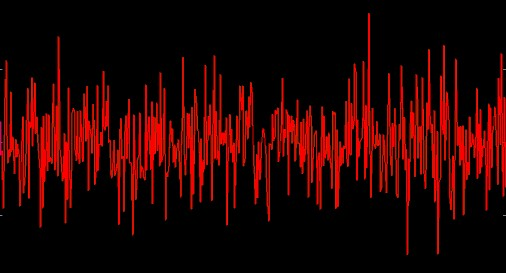

Estimating the Hurst exponent for a data set provides a measure of whether the data is a pure white noise random process or has underlying trends. Another way to state this is that a random process with an underlying trend has some degree of autocorrelation (more on this below). When the autocorrelation has a very long (or mathematically infinite) decay this kind of Gaussian process is sometimes referred to as a *long memory process*.

Processes that we might naively assume are purely white noise sometimes turn out to exhibit Hurst exponent statistics for long memory processes (they are "colored" noise). One example is seen in computer network traffic. We might expect that network traffic would be best simulated by having some number of random sources send random sized packets into the network. Following this line of thinking, the distribution might be Poisson (an example of Poisson distribution is the number of people randomly arriving at a resturant for a given time period). As it turns out, the naive model for network traffic seems to be wrong. Network traffic is best modeled by a process which displays a non-random Hurst exponent.

### The Hurst Exponent and Fractional Brownian Motion

Brownian walks can be generated from a defined Hurst exponent. If the Hurst exponent is 0.5 < H < 1.0, the random process will be a long memory process. Data sets like this are sometimes referred to as fractional Brownian motion (abbreviated fBm). Fractional Brownian motion can be generated by a variety of methods, including spectral synthesis using either the Fourier tranform or the wavelet transform. Here the spectral density is proportional to Equation 2 (at least for the Fourier transform):

**Equation 2**
$$\text{spectral density} \propto \frac{1}{f^{\beta}} \quad \text{where } \beta = 2H + 1$$

Fractional Brownian motion is sometimes referred to as 1/f noise. Since these random processes are generated from Gaussian random variables (sets of numbers), they are also referred to as fractional Gaussian noise (or fGn).

The fractal dimension provides an indication of how rough a surface is. As Equation 1 shows, the fractal dimension is directly related to the Hurst exponent for a statistically self-similar data set. A small Hurst exponent has a higher fractal dimension and a rougher surface. A larger Hurst exponent has a smaller fractional dimension and a smoother surface. This is shown in Figure 4.

**Figure 4**, Fractional Brownian Motion and the Hurst exponent
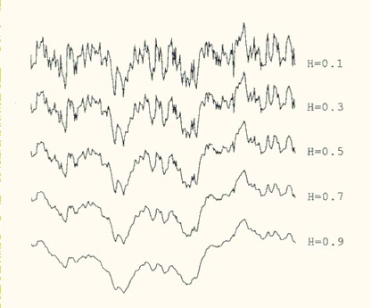
From *Algorithms for random fractals*, by Dietmar Saupe, Chapter 2 of *The Science of Fractal Images* by Barnsley et al, Springer-Verlag, 1988

### The Hurst Exponent and Finance

**Stock Prices and Returns**

Random Walks and Stock Prices A simplified view of the way stock prices evolve over time is that they follow a random walk.  A one dimensional random walk can be generated by starting at zero and selecting a [Gaussian random number](http://www.bearcave.com/misl/misl_tech/wavelets/hurst/random.html). In the next step (in this case 1), add the Gaussian random number to the previous value (0). Then select another Gaussian random number and in the next time step (2) add it to the previous position, etc...

```
    step   value
     0       0
     1       0 + R0
     1       R0 + R1
     2       R0 + R1 + R2
     etc...
 ```

 This model, that asset prices follow a random walk or Gaussian Brownian Motion, underlies the Black-Scholes model for pricing stock options (see Chapter 14, Wiener Processes and Ito's Lemma, Options, Futures and Other Derivatives, Eighth Edition, John C. Hull, 2012). Stock Returns One way to calculate stock returns is to use continuously compounded returns: $r_t = log(P_t) - log(P_{t-1})$. If the prices that the return is calculated from follow Gaussian Brownian Motion, the the returns will be normally distributed. Returns that are derived from prices that follow Gaussian Brownian Motion will have a Hurst exponent of zero. Stock Prices and Returns in the Wild Actual stock prices do not follow a purely Gaussian Brownian Motion process. They have dependence (autocorrelation) where the change at time t has some dependence on the change at time $t-1$.  Actual stock returns, especially daily returns, usually do not have a normal distribution. The curve of the distribution will have fatter tails than a normal distribution. The curve will also tend to be more "peaked" and be thinner in the middle (these differences are sometimes described as the "stylized facts of asset distribution"). |

My interest in the Hurst exponent was motivated by financial data sets (time series) like the daily close price or the 5-day return for a stock. I originally delved into Hurst exponent estimation because I experimenting with wavelet compression as a method for estimating predictability in a financial time series (see [Wavelet compression, determinism and time series forecasting](http://www.bearcave.com/misl/misl_tech/wavelets/forecast/index.html)).

My view of financial time series, at the time, was noise mixed with predictability. I read about the Hurst exponent and it seemed to provide some estimate of the amount of predictability in a noisy data set (e.g., a random process). If the estimation of the Hurst exponent confirmed the wavelet compression result, then there might be some reason to believe that the wavelet compression technique was reliable.

I also read that the Hurst exponent could be calculated using a wavelet scalogram (e.g., a plot of the frequency spectrum). I knew how to use [wavelets for spectral analysis](http://www.bearcave.com/misl/misl_tech/wavelets/freq/index.html), so I though that the Hurst exponent calculation would be easy. I could simply reuse the wavelet code I had developed for spectrual analysis.

Sadly things frequently are not as simple as they seem. Looking back, there are a number of things that I did not understand:

1. The Hurst exponent is not so much calculated as estimated. A variety of techniques exist for doing this and the accuracy of the estimation can be a complicated issue.
2. Testing software to estimate the Hurst exponent can be difficult. The best way to test algorithms to estimate the Hurst exponent is to use a data set that has a known Hurst exponent value. Such a data set is frequently referred to as *fractional brownian motion* (or fractal gaussian noise). As I learned, generating fractional brownian motion data sets is a complex issue. At least as complex as estimating the Hurst exponent.
3. The evidence that financial time series are examples of long memory processes is mixed. When the hurst exponent is estimated, does the result reflect a long memory process or a short memory process, like autocorrelation? Since autocorrelation is related to the Hurst exponent (see Equation 3, below), is this really an issue or not?

I found that I was not alone in thinking that the Hurst exponent might provide interesting results when applied to financial data. The intuitively fractal nature of financial data (for example, the 5-day return time series in Figure 5) has lead a number of people to apply the mathematics of fractals and chaos analyzing these time series.

**Figure 5**
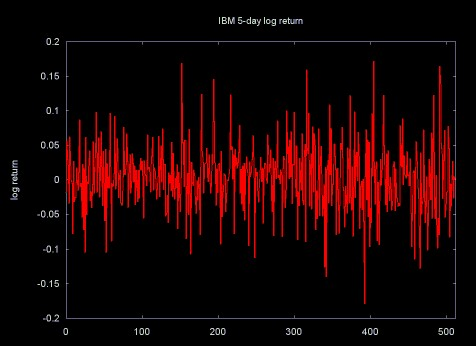

Before I started working on Hurst exponent software I read a few papers on the application of Hurst exponent calculation to financial time series, I did not realize how much work had been done in this area. A few references are listed below.

* Benoit Mandelbrot, who later became famous for his work on fractals, wrote the early papers on the application of the Hurst exponent to financial time series. Many of these papers are collected in Mandelbrot's book *Fractals and Scaling in Finance*, Springer Verlag, 1997.
* Edgar Peters' book [*Chaos and Order in the Capital markets*, Second Edition](http://www.bearcave.com/bookrev/chaos_and_order.html) spends two chapters discussing the Hurst exponent and its calculation using the the rescaled range (RS) technique. Unfortunately, Peters only applies Hurst exponent estimation to a few time series and provides little solid detail on the accuracy of Hurst exponent calculation for data sets of various sizes.
* *Long-Term Memory in Stock Market Prices*, Chapter 6 in *A Non-Random Walk Down Wall Street* by Andrew W. Lo and A. Craig MacKinlay, Princeton University Press, 1999.

  This chapter provides a detailed discussion of some statistical techniques to estimate the Hurst exponent (long-term memory is another name for a long memory process). Lo and MacKinlay do not find long-term memory in stock market return data sets they examined.
* In the paper [*Evidence
  of Predictability in Hedge Fund Returns and Multi-Style Multi-Class Tactical Style Allocation Decisions*](http://homegwuedu~alexbaptHFpdf#search=3D%22Evidence%20of%20Predictability%20in%20Hedge%20Fund%20Returns%20and%20Multi-Style%20Multi-Class%20Tactical%20Style%20Allocation%20Deciions%20by%20Amenc%2C%20El%20Bied%20and%20Martelli%2C%20April%202002%22) by Amenc, El Bied and Martelli, April 2002) the authors use the Hurst exponent as one method to analyze the predictability of hedge funds returns.
* John Conover applies the Hurst exponent (along with other statistical techniques) to the analysis of corporate profits. See [Notes on the Fractal Analysis of Various Market Segments in the North American Electronics Industry (PDF format) by John Conover, August 12, 2002.](http://www.johncon.com/ndustrix/archive/fractal.pdf) This is an 804 page (!) missive on fractal analysis of financial data, including the application of the Hurst exponent (R/S analysis).

  John Conover has an associated root web page [Software for Industrial Market Metrics](http://www.johncon.com/ndustrix/) which has links to *Notes on the Fractal Analysis...* and associated software source code (along with documentation for the source code).

### The Hurst Exponent, Long Memory Processes and Power Laws

> That economic time series can exhibit long-range dependence has been a hypothesis of many early theories of the trade and business cycles. Such theories were often motivated by the distinct but nonperiodic cyclical patterns, some that seem nearly as long as the entire span of the sample. In the frequency domain such time series are said to have power at low frequencies. So common was this particular feature of the data that Granger (1966) considered it the "typical spectral shape of an economic variable." It has also been called the "Joseph Effect" by Mandelbrot and Wallis (1968), a playful but not inappropriate biblical reference to the Old Testament prophet who foretold of the seven years of plenty followed by the seven years of famine that Egypt was to experience. Indeed, Nature's predilection toward long-range dependence has been well-documented in hydrology, meteorology, and geophysics...
>
> Introduction to Chapter 6, *A Non-Random Walk Down Wall Street* by Andrew W. Lo and A. Craig MacKinlay, Princeton University Press, 1999.
>
> Here long-range dependence is the same as a long memory process.

Modern economics relies heavily on statistics. Most of statistics is based on the normal Gaussian distribution. This kind of distribution does occur in financial data. For example, the 1-day return on stocks does closely  conform to a Gaussian curve. In this case, the return yesterday has nothing to do with the return today. However, as the return period moves out, to 5-day, 10-day and 20-day returns, the distribution changes to a log-normal distribution. Here the "tails" of the curve follow a power law. These longer return time series have some amount of autocorrelation and a non-random Hurst exponent. This has suggested to many people that these longer return time series are long memory processes.

I have had a hard time finding an intuitive definition for the term *long memory process*, so I'll give my definition: a long memory process is a process with a random component, where a past event has a decaying effect on future events. The process has some memory of past events, which is "forgotten" as time moves forward. For example, large trades in a market will move the market price (e.g., a large purchase order will tend to move the price up, a large sell order will tend to move the price downward). This effect is referred to as *market impact* (see [*The Market Impact Model*](http://www.barra.com/Newsletter/nl165/MIMNL165.asp) by Nicolo Torre, BARRA Newsletter, Winter 1998). When an order has measurable market impact, the market price does not immediately rebound to the previous price after the order is filled. The market acts as if it has some "memory" of what took place and the effect of the order decays over time. Similar processes allow momentum trading to have some value.

The mathematical definition of long memory processes is given in terms of autocorrelation. When a data set exhibits autocorrelation, a value xi at time ti is correlated with a value xi+d at time ti+d, where *d* is some time increment in the future. In a long memory process autocorrelation decays over time and the decay follows a [power law](http://www.bearcave.com/bookrev/linked/index.html#PowerLaws). A time series constructed from 30-day returns of stock prices tends to show this behavior.

In a long memory process the decay of the autocorrelation function for a time series is a power law:

**Equation 3**
$$p(k) = C k^{-\alpha}$$

In Equation 3, *C* is a constant and *p(k)* is the autocorrelation function with lag *k*. The Hurst exponent is related to the exponent alpha in the equation by

**Equation 4**
$$H = 1 - \frac{\alpha}{2}$$

The values of the Hurst exponent range between 0 and 1. A value of 0.5 indicates a true random process (a Brownian time series). In a random process there is no correlation between any element and a future element. A Hurst exponent value *H*, 0.5 < *H* < 1 indicates "persistent behavior" (e.g., a positive autocorrelation). If there is an increase from time step $t_i-1$ to $t_i$ there will probably be an increase from $t_i$ to $t_i+1$. The same is true of decreases, where a decrease will tend to follow a decrease. A Hurst exponet value 0 < H < 0.5 will exist for a time series with "anti-persistent behavior" (or negative autocorrelation). Here an increase will tend to be followed by a decrease. Or a decrease will be followed by an increase. This behavior is sometimes called "mean reversion".

### So who is this guy Hurst?

> Hurst spent a lifetime studying the Nile and the problems related to water storage. He invented a new statistical method -- the *rescaled range analysis* (R/S analysis) -- which he described in detail in an interesting book, *Long-Term Storage: An Experimental Study* (Hurst et al., 1965).
>
> *Fractals* by Jens Feder, Plenum, 1988

One of the problems Hurst studied was the size of reservoir construction. If a perfect reservoir is constructed, it will store enough water during the dry season so that it never runs out. The amount of water that flows into and out of the reservoir is a random process. In the case of inflow, the random process is driven by rainfall. In the case of outflow, the process is driven by demand for water.

### The Hurst Exponent, Wavelets and the Rescaled Range Calculation

As I've mentioned [elsewhere](http://www.bearcave.com/misl/misl_tech/wavelets/histo/index.html), when it comes to wavelets, I'm the guy with a hammer to whom all problems are a nail. One of the fascinating things about the wavelet transform is the number of areas where it can be used. As it turns out, one of these applications includes estimating the Hurst exponent. (I've referred to the calculation of the Hurst exponent as an estimate because value of the Hurst exponent cannot be exactly calculated, since it is a measurement applied to a data set. This measurement will always have a certain error.)

One of the first references I used was [Wavelet Packet Computation of the Hurst Exponent](http://www.swin.edu.au/chem/bio/fractals/jonesdoc.pdf) by C.L. Jones, C.T. Lonergan and D.E. Mainwaring (originally published in the Journal of Physics A: Math. Gen., **29** (1996) 2509-2527). Since I had already developed wavelet packet software, I thought that it would be a simple task to calculate the Hurst exponent. However, I did not fully understand the method used in this paper, so I decided to implement software to calculate Hurst's classic rescaled range. I could then use the rescaled range calculation to verify the result returned by my wavelet software.

### Understanding the Rescaled Range (R/S) Calculation

I had no problem finding references on the rescaled range statistic. A [*Google*](http://www.google.com/) search for **"rescaled range" hurst** returned over 700 references. What I had difficulty finding were references that were correct and that I could understand well enough to implement the rescaled range algorithm.

One of the sources I turned to was the book [*Chaos and Order in the Capital Markets*](http://www.bearcave.com/bookrev/chaos_and_order.html), Second Edition, Edgar E. Peters, (1996). This book provided a good high level overview of the Hurst exponent, but did not provide enough detail to allow me to implement the algorithm. Peters bases his discussion of the Hurst exponent on Chapters 8 and 9 of the book *Fractals* by Jens Feder (1988). Using Feder's book, and a little extra illumination from some research papers, I was able to implement software for the classic rescaled range algorithm proposed by Hurst.

The description of the rescaled range statistic on this web page borrows heavily from Jens Feder's book *Fractals*. Plenum Press, the publisher, seems to have been purchased by Kluwer, a press notorious for their high prices. *Fractals* is listed on Amazon for $86. For a book published in 1988, which does not include later work on fractional brownian motion and long memory processes, this is a pretty steep price (I was fortunate to purchase a used copy on [ABE Books](http://www.abebooks.com/)). Since the price and the age of this book makes Prof. Feder's material relatively inaccessable, I've done more than simply summarize the equations and included some of Feder's diagrams. If by some chance Prof. Feder stumbles on this web page, I hope that he will forgive this stretch of the "fair use" doctrine.

### Reservoir Modeling

The rescaled range calculation makes the most sense to me in the context in which it was developed: reservoir modeling. This description and the equations mirror Jens Feder's *Fractals*. Of course any errors in this translation are mine.

Water from the California Sierras runs through hundreds of miles of pipes to the Crystal Springs reservoir, about thirty miles south of San Francisco. Equation 5 shows the average (mean) inflow of water through those pipes over a time period $\tau$.

**Equation 5**, average (mean) inflow over time $\tau$

$$\langle \xi \rangle_\tau = \frac{1}{\tau} \sum_{t=1}^{\tau} \xi(t)$$

The water in the Crystal Springs reservior comes from the Sierra snow pack. Some years there is a heavy snow pack and lots of water flows into the Crystal Springs reservoir. Other years, the snow pack is thin and the inflow to Crystal Springs does not match the water use by the thirsty communities of Silicon Valley area and San Francisco. We can represent the water inflow for one year as $\xi(u)$. The deviation from the mean for that year is $\xi(u) - \langle \xi \rangle_\tau$ (the inflow for year *u* minus the mean). Note that the mean is calculated over some multi-year period $\tau$. Equation 6 is a running sum of the accululated deviation from the mean, for years 1 to $\tau$.

**Equation 6**
$$X(t, \tau) = \sum_{u=1}^{t} \left[ \xi(u) - \langle \xi \rangle_\tau \right]$$

I don't find this notation all that clear. So I've re-expressed equations 5 and 6 in pseudo-code below:

```
sum = 0;
for (t = 0; t < τ; t++) {
    sum = sum + ξ(t);
}
mean = sum / τ
X(0) = 0;
for (t = 1; t ≤ τ; t++) {
    X(t) = X(t-1) + (ξ(t-1) - mean);
}
```

Figure 6 shows a plot of the points X(t).

**Figure 6**
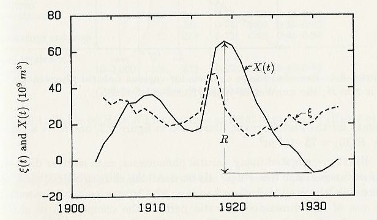

Graph by Liv Feder from *Fractals* by Jens Feder, 1988

The range, $R(\tau)$ is the difference between the maximum value X(tb) and the minimum value of X(ta), over the time period $\tau$. This is summarized in equation 7.

**Equation 7**
$$R(\tau) = \text{Max}(X(t, \tau)) - \text{Min}(X(t, \tau)) \quad \text{for the range } 1 \le t \le \tau$$

Figure 7 shows Xmax the maximum of the sum of the deviation from the mean, and Xmin, the minimum of the sum of the deviation from the mean. X(t) is the sum of the deviation from the mean at time *t*.

**Figure 7**
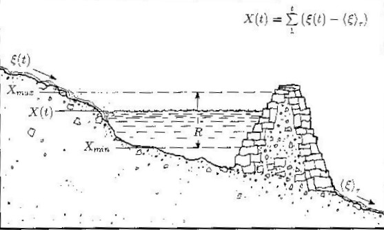

Illustration by Liv Feder from *Fractals* by Jens Feder, 1988

The rescaled range is calculated by dividing the range $R(\tau)$ by the standard deviation:

**Equation 8**, rescaled range

$$R/S = \frac{R(\tau)}{S(\tau)}$$

Equation 9 shows the calculation of the standard deviation.

**Equation 9**, standard deviation over the range 1 to $\tau$

$$S(\tau) = \sqrt{\frac{1}{\tau} \sum_{t=1}^{\tau} \left( \xi(t) - \langle \xi \rangle_\tau \right)^2}$$

### Estimating the Hurst Exponent from the Rescaled Range

The Hurst exponent is estimated by calculating the average rescaled range over multiple regions of the data. In statistics, the average (mean) of a data set **X** is sometimes written as the expected value, E[X]. Using this notation, the expected value of R/S, calculated over a set of regions (starting with a region size of 8 or 10) converges on the Hurst exponent power function, shown in Equation 10.

**Equation 10**
$$E\left[\frac{R(n)}{S(n)}\right] = Cn^H \quad \text{as } n \to \infty$$

If the data set is a random process, the expected value will be described by a power function with an exponent of 0.5.

**Equation 11**
$$E\left[\frac{R(n)}{S(n)}\right] = Cn^{0.5} \quad \text{as } n \to \infty$$

I have sometimes seen Equation 11 referred to as "short range dependence". This seems incorrect to me. Short range dependence should have some autocorrelation (indicating some dependence between value xi and value xi+1). If there is a Hurst exponent of 0.5, it is a white noise random process and there is no autocorrelation and no dependence between sequential values.

A linear regression line through a set of points, composed of the log of *n* (the size of the areas on which the average rescaled range is calculated) and the log of the average rescaled range over a set of revions of size *n*, is calculated. The slope of regression line is the estimate of the Hurst exponent. This method for estimating the Hurst exponent was developed and analyzed by Benoit Mandelbrot and his co-authors in papers published between 1968 and 1979.

The Hurst exponent applies to data sets that are statistically self-similar. Statistically self-similar means that the statistical properties for the entire data set are the same for sub-sections of the data set. For example, the two halves of the data set have the same statistical properties as the entire data set. This is applied to estimating the Hurst exponent, where the rescaled range is estimated over sections of different size.

As shown in Figure 8, the rescaled range is calculated for the entire data set (here RSave0 = RS0). Then the rescaled range is calculated for the two halves of the data set, resulting in RS0 and RS1. These two values are averaged, resulting in RSave1. In this case the process continues by dividing each of the previous sections in half and calculating the rescaled range for each new section. The rescaled range values for each section are then averaged. At some point the subdivision stops, since the regions get too small. Usually regions will have at least 8 data points.

**Figure 8**, Estimating the Hurst Exponent

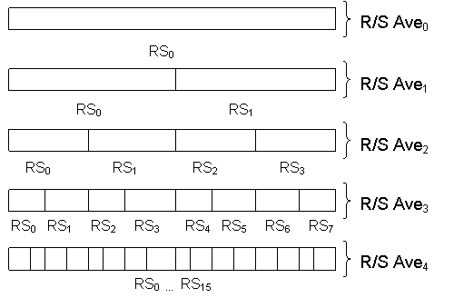

To estimate the Hurst exponent using the rescaled range algorithm, a vector of points is created, where $x_i$ is the $log2$ of the size of the data region used to calculate $RSave_i$ and $y_i$ is the $log2$ of the $RSave_i$ value. This is shown in Table 1.

**Table 1**

| $region\ size$ | $RS\ ave.$ | $X_i$ : $log2(region\ size)$ | $Y_i$ : $log2(RS\ ave.)$ |
| --- | --- | --- | --- |
| 1024 | 96.4451 | 10.0 | 6.5916 |
| 512 | 55.7367 | 9.0 | 5.8006 |
| 256 | 30.2581 | 8.0 | 4.9193 |
| 128 | 20.9820 | 7.0 | 4.3911 |
| 64 | 12.6513 | 6.0 | 3.6612 |
| 32 | 7.2883 | 5.0 | 2.8656 |
| 16 | 4.4608 | 4.0 | 2.1573 |
| 8.0 | 2.7399 | 3.0 | 1.4541 |

The Hurst exponent is estimated by a linear regression line through these points. A line has the form y = a + bx, where **a** is the y-intercept and **b** is the slope of the line. A linear regression line calculated through the points in Table 1 results in a y-intercept of -0.7455 and a slope of 0.7270. This is shown in Figure 9, below. The slope is the estimate for the Hurst exponent. In this case, the Hurst exponent was calculated for a synthetic data set with a Hurst exponent of 0.72. This data set is from *Chaos and Order in the Capital markets*, Second Edition, by Edgar Peters. The synthetic data set can be downloaded here, as a C/C++ include file [brown72.h](http://www.bearcave.com/misl/misl_tech/wavelets/hurst/brown72.h) (e.g., it has commas after the numbers).

**Figure 9**

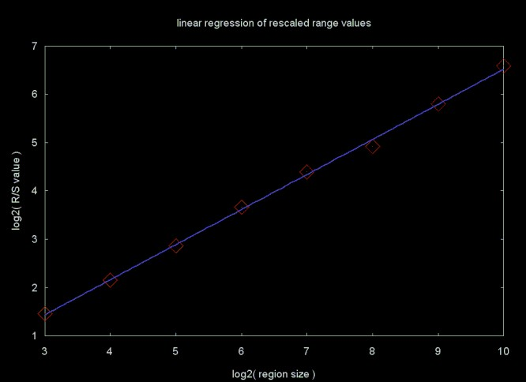

Figure 10 shows an autocorrelation plot for this data set. The blue line is the approximate power curve. The equations for calculating the autocorrelation function are summarized on my web page [Basic Statistics](http://www.bearcave.com/misl/misl_tech/wavelets/stat/index.html)

**Figure 10**

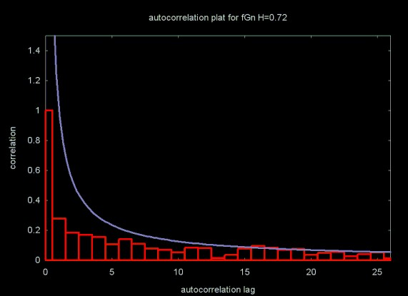

### Basic Variations on the Rescaled Range Algorithm

The algorithm outlined here uses non-overlapping data regions where the size of the data set is a power of two. Each sub-region is a component power of two. Other versions of the rescaled range algorithm use overlapping regions and are not limited to data sizes that are a power of two. In my tests I did not find that overlapping regions produced a more accurate result. I chose a power of two data size algorithm because I wanted to compare the rescaled range statistic to Hurst exponent calculation using the wavelet transform. The wavelet transform is limited to data sets where the size is a power of two.

### Applying the R/S Calculation to Financial Data

The rescaled range and other methods for estimating the Hurst exponent have been applied to data sets from a wide range of areas. While I am interested in a number of these areas, especially network traffic analysis and simulation, my original motivation was inspired by my interest in financial modeling. When I first started [applying wavelets to financial time series](http://www.bearcave.com/misl/misl_tech/wavelets/haar.html), I applied the wavelet filters to the daily close price time series. As I discuss in a moment, this is not a good way to do financial modeling. In the case of the Hurst exponent estimation and the related autocorrelation function, using the close price does yield an interesting result. Figures 11 and 12 show the daily close price for Alcoa and the autocorrelation function applied to the close price time series.

**Figure 11**, Daily Close Price for Alcoa (ticker: AA)

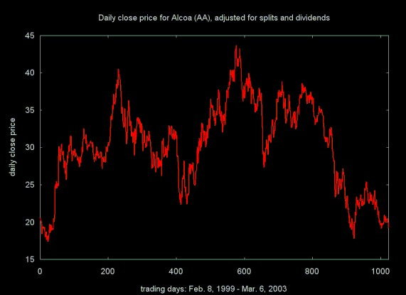

**Figure 12**, Autocorrelation function for Alcoa (ticker: AA) close price

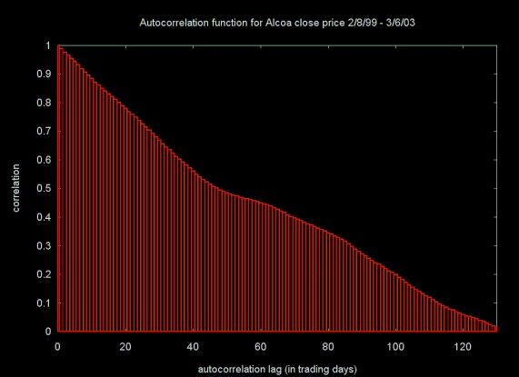

The autocorrelation function shows that the autocorrelation in the close price time series takes almost 120 days to decay below ten percent.

The Hurst exponent value for the daily close price also shows an extremely strong trend, where **H** = 0.9681 0.0123. For practical purposes, this is a Hurst exponent of 1.0.

I'm not sure what the "deeper meaning" is for this result, but I did not expect such a long decay in the autocorrelation, nor did I expect a Hurst exponent estimate so close to 1.0.

Most financial models do not attempt to model close prices, but instead deal with returns on the instrument (a stock, for example). This is heavily reflected in the literature of finance and economics (see, for example, *A Non-Random Walk Down Wall Street*). The return is the profit or loss in buying a share of stock (or some other traded item), holding it for some period of time and then selling it. The most common way to calculate a return is the *log return*. This is shown in Equation 12, which calculates the log return for a share of stock that is purchased and held delta days and then sold. Here Pt and Pt-delta are the prices at time *t* (when we sell the stock) and *t-delta* (when we purchased the stock, *delta* days ago). Taking the log of the price removes most of the market trend from the return calculation.

**Equation 12**

$$ret_{t-\Delta, t} = \log(P_t) - \log(P_{t-\Delta})$$

Another way to calculate the return is to use the percentage return, which is shown in Equation 13.

**Equation 13**

$$ret_{t-\Delta, t} = \frac{P_t - P_{t-\Delta}}{P_{t-\Delta}}$$

Equations 12 and 13 yield similar results. I use log return (Equation 12), since this is used in most of the economics and finance literature.

An *n*-day return time series is created by dividing the time series (daily close price for a stock, for example) into a set of blocks and calculating the log return (Equation 12) for $P_t$-delta, the price at the start of the block and $P_t$, the price at the end of the block. The simplest case is a 1-day return time series:

```
   x0 = log(P1) - log(P0)
   x1 = log(P2) - log(P1)
   x2 = log(P3) - log(P2)
   ...
   xn = log(Pt) - log(Pt-1)
```

Table 2, below, shows the Hurst exponent estimate for the 1-day return time series generated for 11 stocks from various industries. A total of 1024 returns was calculated for each stock. In all cases the Hurst exponent is close to 0.5, meaning that there is no long term dependence for the 1-day return time series. I have also verified that there is no autocorrelation for these time series either.

**Table 2**, 1-day return, over 1024 trading days

| Company | Hurst Est. | Est. Error |
| --- | --- | --- |
| Alcoa | 0.5363 | 0.0157 |
| Applied Mat. | 0.5307 | 0.0105 |
| Boeing | 0.5358 | 0.0077 |
| Capital One | 0.5177 | 0.0104 |
| GE | 0.5129 | 0.0096 |
| General Mills | 0.5183 | 0.0095 |
| IBM Corp. | 0.5202 | 0.0088 |
| Intel | 0.5212 | 0.0078 |
| 3M Corp. | 0.5145 | 0.0081 |
| Merck | 0.5162 | 0.0075 |
| Wal-Mart | 0.5103 | 0.0078 |

The values of the Hurst exponent for the 1-day return time series suggest something close to a random walk. The return for a given day has no relation to the return on the following day. The distribution for this data set should be a normal Gaussian curve, which is characteristic of a random process.

Figure 13 plots the estimated Hurst exponent (on the y-axis) for a set of return time series, where the return period ranges from 1 to 30 trading days. These return time series were calculated for IBM, using 8192 close prices. Note that the Hurst exponent for the 1-day return shown on this curve differs from the Hurst exponent calculated for IBM in Table 2, since the return time series covers a much longer period.

**Figure 13**, Hurst exponent for 1 - 30 day returns for IBM close price

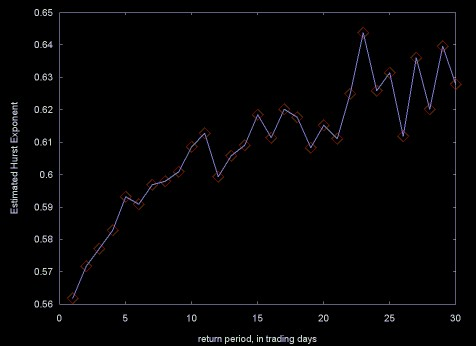

Figure 13 shows that as the return period increases, the return time series have an increasing long memory character. This may be a result of longer return periods picking up trends in the stock price.

The distribution of values in the 1-day return time series should be close go a Gaussian normal curve. Does the distribution change as the return period gets longer and the long memory character of the return time series increases?

The standard deviation provides one measure for a Gaussian curve. In this case the standard deviations cannot be compared, since the data sets have different scales (the return period) and the standard deviation will be relative to the data. One way to compare Gaussian curves is to compare their probability density functions (PDF). The PDF is the probabilty that a set of values will fall into a particular range. The probability is stated as a fraction between 0 and 1.

The probability density function can be calculated by calculating the histogram for the data set. A histogram calculates the frequency of the data values that fall into a set of evenly sized bins. To calculate the PDF these frequency values are divided by the total number of values. The PDF is normalized, so that it has a mean of zero. The PDF for the 4-day and 30-day return time series for IBM are shown in Figures 14 and 15.

**Figure 14**

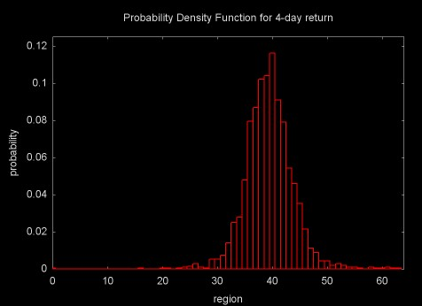

**Figure 15**

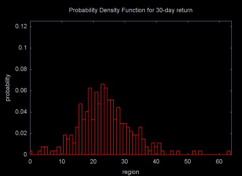

When expressed as PDFs, the distributions for the return time series are in the same units and can be meaningfully compared. Figure 16 shows a plot of the standard deviations for the 1 through 30 day return time series.

**Figure 16**

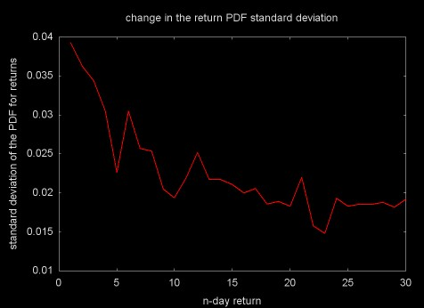

As Figures 14, 15, and 16 show, as the return period increases and the time series gains long memory character, the distributions move away from the Gaussian normal and get "fatter" (this is referred to as kurtosis).

### Estimating the Hurst Exponent using Wavelet Spectral Density

As I've noted above, wavelet estimation of the Hurst exponent is what started me on my Hurst exponent adventure. My initial attempts at using the wavelet transform to calculate the Hurst exponent failed, for a variety of reasons. Now that the classical R/S method has been covered, it is time to discuss the wavelet methods.

The Hurst exponent for a set of data is calculated from the wavelet spectral density, which is sometimes referred to as the scalogram. I have covered wavelet spectral techniques on a related web page [*Spectral Analysis and Filtering with the Wavelet Transform*](http://www.bearcave.com/misl/misl_tech/wavelets/freq/index.html). This web page describes the wavelet "octave" structure, which applies in the Hurst exponent calculation. The wavelet spectral density plot is generated from the wavelet power spectrum. The equation for calculating the normalized power for octave *j* is shown in Equation 14.

**Equation 14**

$$P_j = \frac{1}{2^j} \sum_{i=0}^{2^j - 1} C_i^2$$

Here, the power is calculated from the sum of the squares of the wavelet coefficients (the result of the forward wavelet transform) for octave *j*. A wavelet octave contains 2j wavelet coefficients. The sum of the squares is normalized by dividing by 2j, giving the normalized power. In spectral analysis it is not always necessary to use the normalized power. In practice the Hurst exponent calculation requries normalized power.

Figure 17 shows the normalized power density plot for for the wavelet transform of 1024 data points with a Hurst exponent of 0.72. In this case the [Daubechies D4 wavelet](http://www.bearcave.com/misl/misl_tech/wavelets/daubechies/index.html) was used. Since this wavelet octave number is the $log2$ of the number of wavelet coefficients, the x-axis is a log scale.

**Figure 17**

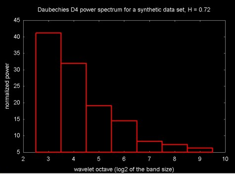

The Hurst exponent is calculated from the wavelet spectral density by calculating a linear regression line through the a set of {$x_j$, $y_j$} points, where $x_j$ is the octave and $y_j$ is the $log2$ of the normalized power. The slope of this regression line is proportional to the estimate for the Hurst exponent. A regression plot for the Daubechies D4 power spectrum in Figure 17 is shown in Figure 18.

**Figure 18**

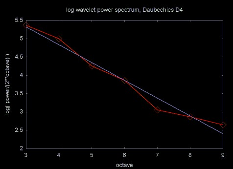

When you want a real answer, rather than a feeling for how change in one thing causes change in something else, the statement that something is *proportional* to something else is not very useful. The equation for calculating the Hurst exponent from the slope of the regression line through the normalized spectral density is shown in Equation 15.

**Equation 15**

$$H = \left| \frac{slope - 1}{2} \right|$$

Table 3 compares Hurst exponent estimation with three wavelet transform to the Hurst exponent estimated via the R/S method. The Daubechies D4 is an "energy normalized" wavelet transform. Energy normalized forms of the Haar and linear interpolation wavelet are used here as well. An energy normalized wavelet seems to be required in estimating the Hurst exponent.

**Table 3** Estimating the Hurst Exponent for 1024 point synthetic data sets.

| Wavelet Function | H=0.5 | Error | H=0.72 | Error | H=0.8 | Error |
| --- | --- | --- | --- | --- | --- | --- |
| Haar | 0.5602 | 0.0339 | 0.6961 | 0.0650 | 0.6959 | 0.1079 |
| Linear Interp. | 0.5319 | 0.1396 | 0.8170 | 0.0449 | 0.9203 | 0.0587 |
| Daubechies D4 | 0.5006 | 0.0510 | 0.7431 | 0.0379 | 0.8331 | 0.0745 |
| R/S | 0.5791 | 0.0193 | 0.7246 | 0.0149 | 0.5973 | 0.0170 |

The error of the linear regression varies a great deal for the various wavelet functions. Although the linear interpolation wavelet seems to be a good filter for sawtooth wave forms, like financial time series, it does not seem to perform well for estimating the Hurst exponent. The Daubechies D4 wavelet is not as good a filter for sawtooth wave forms, but seems to give a more accurate estimate of the Hurst exponent.

I have not discovered a way to determine  *priori* whether a given wavelet function will be a good Hurst exponent estimator, although experimentally this can be determined from the regression error. In some cases it also depends on the data set.
In Table 4 the Hurst exponent is estimated from the Haar spectral density plot and via the R/S technique. In this case the Haar wavelet had a lower regression error than the Daubechies D4 wavelet.

**Table 4** Normalized Haar Wavelet and R/S calculation for 1, 2, 4, 8, 16 and 32 day returns for IBM, calculated from 8192 daily close prices (split adjusted), Sept. 25, 1970 to March 11, 2003. Data from [finance.yahoo.com](http://finance.yahoo.com/).

| Number of return values | Return period (days) | Haar estimate | Haar error | R/S estimate | R/S error |
| --- | --- | --- | --- | --- | --- |
| 8192 | 1 | 0.4997 | 0.0255 | 0.5637 | 0.0039 |
| 4096 | 2 | 0.5021 | 0.0318 | 0.5747 | 0.0043 |
| 2048 | 4 | 0.5045 | 0.0409 | 0.5857 | 0.0057 |
| 1024 | 8 | 0.5100 | 0.0543 | 0.5972 | 0.0084 |
| 512 | 16 | 0.5268 | 0.0717 | 0.6129 | 0.0115 |
| 256 | 32 | 0.5597 | 0.0929 | 0.6395 | 0.0166 |

Note that in all cases the R/S estimate for the Hurst exponent has a lower linear regression error than the wavelet estimate.

Figure 19 shows the plot of the normalized Haar estimated Hurst exponent and the R/S estimated Hurst exponent.

**Figure 19**, Top line, R/S estimated Hurst exponent (magenta), bottom line, Haar wavelet estimated Hurst (blue), 1, 2, 4, 8, 16, 32 day returns for IBM

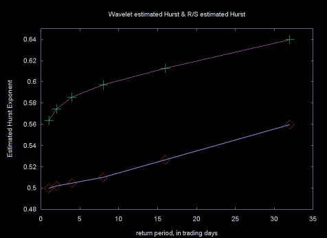

### Wavelet Packets

Measuring the quality of the Hurst estimation is no easy task. A given method can be accurate within a particular range and less accurate outside that range. Testing Hurst exponent estimation code can also be difficult, since the creation of synthetic data sets with a known accurate Hurst exponent value is a complicated topic by itself.

Wavelet methods give more accurate results than the R/S method in some cases, but not others. At least for the wavelet functions I have tested here, the results are not radically better. In many cases the regression error of the wavelet result is worse than the error using the R/S method, which does not lead to high confidence.

There are many wavelet functions, in particular wavelets which have longer filters (e.g., Daubechies D8) than I have used here. So the conclustions that can be drawn from these results are limited.

The [wavelet packet algorithm](http://www.bearcave.com/misl/misl_tech/wavelets/packet/index.html) applies the standard wavelet function in a more complicated context. Viewed in terms of the [wavelet lifting scheme](http://www.bearcave.com/misl/misl_tech/wavelets/lifting/index.html), the result of the wavelet packet function can be a better fit of the wavelet function. The wavelet packet algorithm produces better results for [compression algorithms](http://www.bearcave.com/misl/misl_tech/wavelets/compression/index.html) and a better estimate might be produced for the Hurst exponent. Although I have written and published C++ code for the wavelet packet algorithm, I ran out of time and did not perform any experiments with in Hurst estimation using this software.

### Other Paths Not Taken

The literature on the estimation of the Hurst exponent for long memory processes, also referred to as fractional Brownian motion (fBm) is amazingly large. I have used a simple recursively decomposable version of the R/S statistic. There are variations on this algorithm that use overlapping blocks. Extensions to improve the accuracy of the classical R/S calculation have been proposed by Andrew Lo (see *A Non-Random Walk*). Lo's method has been critically analyzed in [*A critical look at Lo's modified R/S statistic*](http://math.bu.edu/people/murad/pub/lo16-posted.ps) by V. Teverovsky, M. Taqqu and W. Willinger, May 1998 (postscript format)

Some techniques build on the wavelet transform and reportedly yield more accurate results. For example, in *Fractal Estimaton from Noisy Data via Discrete Fractional Gaussian Noise (DFGN) and the Haar Basis*, by L.M. Kaplan and C.-C. Jay Kuo, IEEE Trans. on Signal Proc. Vol. 41, No 12, Dec. 1993 developes a technique based on the Haar wavelet and maximum likelyhood estimation. The results reported in this paper are more accurate than the Haar wavelet estimate I've used.

Another method for calculating the Hurst exponent is referred to as the Whittle estimator, which has some similarity to the method proposed by Kaplan and Kuo listed above.

I am sure that there are other techniques that I have not listed. I've found this a fascinating area to visit, but sadly I am not an academic with freedom to persue what ever avenues I please. It is time to put wavelets and related topics, like the estimation of the Hurst exponent, aside and return to compiler design and implementation.

### Retrospective: the Hurst Exponent and Financial Time Series

This is one of the longest single web pages I've written. If you have followed me this far, it is only reasonable to look back and ask how useful the Hurst exponent is for the analysis and modeling of financial data (the original motivation for wandering into this particular swamp).

Looking back over the results, it can be seen that the Hurst exponent of 1-day returns is very near 0.5, which indicates a white noise random process. This corresponds with results reported in the finace literature (e.g., 1-day returns have an approximately Gaussian normal random distribution). As the return period gets longer, the Hurst exponent moves toward 1.0, indicating increasing long memory character.

In his book *Chaos and Order in the Capital Markets*, Edgar Peters suggests that a hurst exponent value H (0.5 < H < 1.0) shows that the efficient market hypothesis is incorrect. Returns are not randomly distributed, there is some underlying predictability. Is this conclusion necessarily true?

As the return period increases, the return values reflect longer trends in the time series (even though I have used the log return). Perhaps the higher Hurst exponent value is actually showing the increasing upward or downward trends. This does not, by itself, show that the efficient market hypothesis is incorrect. Even the most fanatic theorist at the University of Chicago will admit that there are market trends produced by economic expansion or contraction.

Even if we accept the idea that a non-random Hurst exponent value does damage to the efficient market hypothesis, estimation of the Hurst exponent seems of little use when it comes to time series forecasting. At best, the Hurst exponent tells us that there is a long memory process. The Hurst exponent does not provide the local information needed for forecasting. Nor can the Hurst exponent provide much of a tool for estimating periods that are less random, since a relatively large number of data points are needed to estimate the Hurst exponent.

The Hurst exponent is fascinating because it relates to a several different areas of mathematics (e.g., fractals, the Fourier transform, autocorrelation, and wavelets, to name a few). I have to conclude that the practical value of the Hurst exponent is less compelling. At best the Hurst exponent provides a broad measure of whether a time series has a long memory character or not. This has been useful in research on computer network traffic analysis and modeling. The application of the Hurst exponent to finance seems more tenuous.

### Afterward to the Afterward

I get email every once-in-a-while from people who want to use the Hurst exponent for building predictive trading models. Perhaps I have not been clear enough or direct enough in what I've written above. I've included an edited version of a recent response to one of these emails here.

Years ago I read a computer science paper on a topic that I now only vaguely remember. As is common with computer science papers, the author included his email address along with his name in the paper title. I wrote to him that his technique seemed impractical because it would take so long to calculate relative to other techniques. The author wrote back: "I never claimed it was fast". This disconnect can be summed up as the difference between the theorist and the practitioner.

There was a popular theoretical view that was promoted strongly by the economist Eugene Fama that financial markets are random walks. It is from this view that the book by Burton G. Malkiel, *A Random Walk on Wall Street*, takes its title. Malkiel's book and the work of the Fama school also inspired the title of Andrew Lo and Criag MacKinlay's book *A Non-Random Walk Down Wall Street* which provides strong statistical evidence that the market is not, in fact a Gaussian random walk. Peters' book *Chaos and Order in Financial Markets* make this case as well. As does the paper by Amenc et al ([*Evidence of Predictability in Hedge Fund Teturns and Multi-Style Multi-Class Tactical Style Allocation Decisions*](http://papers.ssrn.com/sol3/papers.cfm?abstract_id=305008)) In fact, I'd say that the evidence against purely Gaussian market behavior is now so strong that fewer and fewer people hold this view. The non-Gaussian behavior of markets is, in fact, a criticism of the Black-Scholes equation for options pricing.

These are all academic arguments that that there is predictability in the markets, which goes against what Fama wrote through most of his career. But there is a difference between saying that there is predictability and the ability to predict.

The Hurst exponent, among other statistics, shows that there is predictability in financial time series. In an applied sense it can be useful if you have some transform on a time series and you want to see if you've increased or decreased the amount of predictive information. But the Hurst exponent is not useful for prediction in any direct way. Any more than the statistics for the distribution of returns is useful for predictability, although these statistics can be useful in analzying the behavior of market models.

The problems of the Hurst exponent include accurate calculation. Andrew Lo spills a lot of ink describing problems in accurately calculating the Hurst exponent and then spills more ink describing a techique that he believes is better (a conclusion that other authors questioned). No one that I've read has ever been able to state how large a data set you need to calculate the Hurst exponent the Hurst exponent accurately (although I did see a paper on using "bootstrap" methods for calculating the Hurst exponent with smaller data sets).

Again, the Hurst exponent can be a useful part of the practitioners statistical toolbox. But I do not believe that the Hurst exponent is a useful predictor by itself.

### C++ Software Source

The C++ source code to estimate the Hurst exponent and to generate the data that was used for the plots on this Web page can be downloaded by clicking [here](http://www.bearcave.com/misl/misl_tech/wavelets/hurst/hurst.tar.gz). This file is a GNU zipped (gzip) tar file. For wierd Windows reasons this file gets downloaded as hurst.tar.gz.tar. To unpack it you need to change its name to hurst.tar.gz, unzip it (with the command gzip -d hurst.tar.gz) and then untar it (with the command tar xf hurst.tar).

The [Doxygen](http://www.doxygen.org/) generated documentation can be found [here](http://www.bearcave.com/misl/misl_tech/wavelets/hurst/doc/index.html).

If you are using a Windows system and you don't have these tools you can down load them here. This code is courtesy of [Cygnus](http://www.cygnus.com/) and is free software.

* [gzip.exe](http://www.bearcave.com/software/btp/gzip.exe)
* [tar.exe](http://www.bearcave.com/software/btp/tar.exe)

The wavelet source code in the above *tar* file was developed before I started working on the Hurst exponent, as was the histogram code and the code for wavelet spectrum calculation. The statistics code was developed to support the Hurst exponent estimation code. The entire code base is a little over 4,000 lines. The actual code to estimate the Hurst exponent is a fraction of this.

Looking back over the months of nights and weekends that went into developing this code, it is odd that the final code is so small. This shows one difference between mathematics codes and data structure based codes (e.g., compilers, computer graphics, or other non-mathematical applications). In the case of non-mathematical applications large data structure based frameworks are constructed. In the case of a mathematics code, the effort goes into understanding and testing the algorithm, which may in the end not be that large.

### Books

* [*Chaos and Order in the Capital Markets*](http://www.bearcave.com/bookrev/chaos_and_order.html), Second Edition, Edgar E. Peters, John Wiley and Sons, 1996
* *Fractals* by Jens Feder, Plenum Press, 1988.
* *The Illustrated Wavelet Transform Handbook: Introductory Theory and Applications in Science, Engineering, Medicine and Finance*, by Paul S. Addison, Institute of Physics Publishing, 2002

Chapter 7 of Prof. Addison's book discusses Hurst exponent calculation via the wavelet transform.

* *Self-similar Network Traffic and Performance Evaluation* edited by Kihong Park and Walter Willinger.

Research on computer network trafic and analysis has resulted in a blossoming of techniques for Hurst exponent estimation and the simulation of long memory processes (which resemble computer network traffic traces). In the area of network modeling this has been radical, overturning older queuing models, which have been used for almost twenty years. This book includes chapters based on many of the core journal articles in this area. The book includes an introductory chapter, providing background information. For anyone working on network traffic modeling, this book is an important reference.

### Web References

A Google search on the Hurst exponent will yield a large body of material. Here are some references I found useful or interesting.

* Hurst, the discoverer of the exponent that bears his name, studied power laws as they related to Nile river floods. The Hurst exponent has been applied to a variety of other natural systems. A nice [definition of the Hurst Exponent](http://www.cbi.dongnocchi.it/glossary/Hurst.html) is published in a very good mathematics glossary titled  [Terms Used in Time Series Analysis of Cardiovascular Data](http://www.cbi.dongnocchi.it/glossary/) from the Working Group on Blood Pressure and Heart Rate Variability, European Society of Hypertension, Centro Di Bioingegneria, in Milan, Italy
* [Cameron L. Jones' Complex Systems Research Web Page](http://www.drcameronjones.com/index.html)

  Cameron Jones seems to be a true polymath. He is an prolific researcher, who has published on a range of topics from wearable computers to fractal mathematics. His work includes applications of fractal and wavelet mathematics to a variety of areas in biology.

  + [Wavelet Packet computation of the Hurst exponent](http://en.scientificcommons.org/42773726)

    From an implementation point of view, I found the description of thealgorithm to calculate the Hurst exponent in this paper somewhat murky. For a given wavelet and scaling function, the wavelet packet transform provides a closer approximation of the data set, compared to the wavelet transform. The authors do not state whether this results in a more accurate estimation of the Hurst exponent, compared to the wavelet transform. Since the wavelet transform is faster and simpler to calculate, the wavelet packet transform should only be used if it yields a significantly better result.
* [Scaling in the Market of Futures](http://citeseer.nj.nec.com/cache/papers/cs/20514/http%3AzSzzSzwww.ge.infm.itzSzeconophysicszSzpaperszSzgenoapaperszSzscalfutures.pdf/scaling-in-the-market.pdf) by Enrico Scalas, November 25, 1997
* [Software for Programmed Trading of Equities Over the Internet](http://www.johncon.com/ntropix/)

  This is the root page for a discussion on using fractal analysis and other techniques like classical information theory to analyze market information. John Conover also publishes source code and the associated documentation.

  Simply because one has an equation, or a mathematical technique, does not mean that the result is true and there are occasions where I find that John Conover's conclusions are overly broad. For example, in his analysis of the success of [Linux vs. Microsoft](http://www.johncon.com/john/correspondence/020217114704.27107.html#example-linux) or in his analysis of the [success of "IT" (software) projects](http://www.johncon.com/john/correspondence/020218165107.2891.html#example-project). The factors that influence the success of Linux and the timely completion of a software project are complex and cannot be described by simple equations. For example, no simple equation can predict that IBM would (or would not) adopt Linux or that Dell would adopt Linux for their cluster computers.
* [Fractal Analysis Programs of the National Simulation Resource](http://nsr.bioeng.washington.edu/Software/NSR_SW_fractal.html)

  This site publishes code for generating a gaussian random walk series and for calculating the Hurst exponent. These are Fortran codes.
* [Hurst's R/S-Analysis](http://www1.physik.tu-muenchen.de/~gammel/matpack/html/Mathematics/RSAnalysis.html)

  A mathematical summary of Hurst exponent calculation
* [A Procedure to Estimate the Fractal Dimension of Waveforms](http://journal-ci.csse.monash.edu.au/ci/vol05/sevcik/sevcik.html) by Carlos Sevcik, Complexity International, 1998

  This paper outlines a method for calculating the Hurst exponent which is rather unique. It is not the same as either the R/S method discussed in this paper or the spectral techniques (e.g., wavelets). I'm grateful to David Nicholls who pointed me toward Carlos Sevcik's work.

  The Hurst exponent seems to exert an attraction on people in a wide variety of fields. Prof. Sevcik is a neuropharmacologist. His research interests include arthropod toxins (e.g.,. scorpion venom).
* [*Self-similarity
  and long range dependence in Networks*](http://www.cs.bu.edu/pub/barford/ss_lrd.html), a brief annotated bibliography, by [Paul Barford](http://www.cs.wisc.edu/~pb/) and [Sally Floyd](http://www.icir.org/floyd/) (Dr. Floyd is at the [ICIR Network Research Center](http://www.icir.org/))
* [Long range order in network traffic dynamics](http://www.ee.surrey.ac.uk/Personal/D.Jefferies/Selfsim/htmlpaper.html) by J.H.B. Deane, C. Smythe and D.J. Jefferies, June 1996

  A definition for the autocorrelation function is remarkably difficult to find. Apparently it has primarily been used in econometrics. This 1996 paper provides a definition for the autocorrelation function, along with a set of basic statistics for calculating the Hurst exponent (e.g., the rescaled range, the Fourier transform periodogram (a.k.a., scalogram)).
* [*Empirical evidence of long-range correlations in stock returns*](http://www.elsevier.nl/gej-ng/10/36/21/83/29/31/article.pdf) by Pilar Grau-Carles, Physica A 287 (2000) 396-404
* [*Physics of fashion fluctuations*](http://www.elsevier.nl/gej-ng/10/36/21/83/29/44/article.pdf) by R. Donangelo, A. Hansen, K. Sneppen and S.R. Souza, Physica A 287 (2000) 539-545.

  There does not seem to be enough money to fund research work for all those who get Phd degrees in physics. So we see physicists doing work in an increasingly broad variety of areas from the [theory of self-organizing networks](http://www.bearcave.com/bookrev/linked/index.html) to quantitative finance. I looked at this article because I liked its title so much. As it turns out, the topic applies directly to Hurst exponent estimation. The authors apply Hurst exponent estimation to fashions. By fashion, the authors are not directly referring to skirt length or whether the double breasted suit is "in" this year, but to what are sometimes referred to as "fads": fashions - goods that become popular not due to any intrinsic value, but simply because "everybody wants it".

  The problem with this article is that fads are known to follow a power law (x-a). Whether the authors were measuring a long memory process or the power law nature of fads is not clear (perhaps fads *do* have a long memory character).
* [TISEAN Nonlinear Time Series Analysis](http://www.mpipks-dresden.mpg.de/~tisean/) Rainer Hegger, Holger Kantz, Thomas Schreiber

  Estimation of the Hurst exponent can be classified as a non-linear time series technique. TISEAN is a software package for non-linear time series analysis and includes software for a variety of fractal techniques. This software grew out of Holger Kantz and Thomas Schreiber's book *Non-linear Time Series Analysis*, Cambridge University Press, 1997. Considering the topic, this book is very readable. The authors attempt to cover a great deal of material and they gloss over some topics that have considerably more depth than the space given them.
* [*Volatility processes and volatility forecast with long memory*](http://www.olsen.ch/research/workingpapers/LMProcesses.pdf) by Gilles Zumbach. This paper is available on the [Olsen Research Library - Resources in high-frequency finance](http://www.olsen.ch/research/index.html) Olsen is a hedge fund manager and provider of quantitative finance software and data. The founder of Olsen is Richard Olsen, who is the author of an interesting book *Introduction to High Frequency Finance*

  The approach to long memory processes described here is not directly related to Hurst exponent estimation. The techniques are drawn from quantitative finance.
* Math and Statistics published on the Rice University [Connexions Project](http://cnx.rice.edu/)

  The Connexions Project at Rice University provides a set tools and a web site repository for publishing educational content, especially university courses. The Rice University [Signals and Systems](http://cnx.rice.edu/content/col10064/latest/contents/) course, taught by Richard Baraniuk, and published on the Connexions site, includes material on a variety of useful statistics (written by Michael Haag):

  + [Random Processes: Mean and Variance](http://cnx.rice.edu/content/m10656/latest/)
  + [Correlation and Covariance of a Random Signal](http://cnx.rice.edu/content/m10673/latest/)
  + [Autocorrelation of Random Processes](http://cnx.rice.edu/content/m10676/latest/)

    The definition for autocorrelation appears to be incorrect on this web page.
* [Chaos and Fractals in Financial Markets](http://orlingrabbe.com/chaos7.htm), Part 7, by J. Orlin Grabbe.

  This web page is the last of a readable multi-part collection titled [*Chaos & Fractals in Financial Markets*](http://orlingrabbe.com/chaos_index.htm) by Orlin Grabbe. Mr. Grabbe apparently is a person of varied interests. *Chaos & Fractals in Financial Markets* is a sub-section of [Mr. Grabbe's web site](http://orlingrabbe.com/homepage.html) (which is also mirrored in the Neatherlands on [www.xs4all.nl/~kalliste](http://www.xs4all.nl/~kalliste)). The site includes links to [The Laissez Faire Electronic Times](http://freedom.orlingrabbe.com/lfetimes/lfetimes_index.htm), which Mr. Grabbe publishes. After skimming some of the articles in this publication, I'm not quite sure how to characterize it. It seems to have a definite libertarian bent. Some of the articles are not particularly well written and can't be compared to Mr. Grabbe's writing. Mr. Grabbe's web site also includes what seem to be his own version of the British tabloid "page 3 girls". Given the style of photography, these look like they are "borrowed" from a publication like [Playboy](http://www.playboy.com/).

  Whether someone is a crank or not is probably a matter of opinion. As far as I'm concerned, one of the measures of "crankdom" is whether you believe (as the editoral page writers at the Wall Street Journal did) that Vince Foster was murdered. Vince Foster was a White House Counsel during the early part of the Clinton administration. In an interview with journalist Dan Moldea, who wrote the book *A Washington Tragedy*, Lori Leibovich writes in [Salon](http://www.salon.com/):

  > On July 20, 1993, Vincent Foster was found dead at Ft. Marcy Park in Northern Virginia with a .38-caliber revolver in his hand. An autopsy revealed that it was a straight-ahead suicide -- Foster had placed the gun in his mouth and fired one shot that blasted through his head. End of story? Not by a long shot. Nearly five years later, the Foster suicide lives on in the hearts and minds of right-wing Clintonphobes and conspiracy theorists who believe that Foster, a close friend and advisor of the president, was murdered because he knew too much.
  >
  > ...
  >
  > In the resulting book, "A Washington Tragedy: How the Death of Vincent Foster Ignited a Political Firestorm," Moldea confirms -- again that Foster's death was indeed a suicide and that a cabal of right-wing groups -- financed by banking heir Richard Mellon Scaife is responsible for keeping the case alive for years in an effort to tarnish the Clinton White House. Moldea also blasts the media particularly the Wall Street Journal op-ed page and reporter Christopher Ruddy for stoking the conspiracy fires with specious facts and inflammatory rhetoric.
  >
  > [Why Vincent Foster can't rest in peace](http://archive.salon.com/news/1998/05/28news.html), by Lori Leibovich, Salon, May 1998

  It would appear that Mr. Grabbe falls into this catagory of Vince Foster conspiracy theorists:

  > A series exploring the murder of Vince Foster, -- who among other duties -- was an overseer of an NSA project to spy on banking transactions. The series begins with a memo by Jim Norman, Senior Editor at Forbes, to Mike McCurry of the White House Press Office inquiring about the espionage activities of Vince Foster. Then (reflecting my own on-going investigation) it gradually branches out into relevant background issues necessary to understand pieces of the story. Finally, it converges back to Foster's final days.
  >
  > [Allegations Regarding Vince Foster, the NSA, and Banking Transactions Spying](http://orlingrabbe.com/vince_foster.htm) by J. Orlin Grabbe

  Mr. Grabbe has a strong taste for consipracy theory and conclusions that I regard as erroneous, so his work on chaos and finance deserves some level of skepticism. I have only carefully looked at the web page on the Hurst exponent, referenced above. The material does seem to be accurate.

### Related Web pages on www.bearcave.com

* [Basic Statistics](http://www.bearcave.com/misl/misl_tech/wavelets/stat/index.html)
* [Spectral Analysis and Filtering with the Wavelet Transform](http://www.bearcave.com/misl/misl_tech/wavelets/freq/index.html)

  This web page discusses wavelet spectral analysis and "scalograms" generated by the wavelet transform. Wavelet scaleograms form the basis for the wavelet method for calculating Hurst exponent.
* [*Pseudo-random Numbers*](http://www.bearcave.com/misl/misl_tech/wavelets/hurst/random.html)

  Random walk data sets (see below) require high quality Gaussian distributed random numbers.
* [*Simulating Fractional Brownian Motion*](http://www.bearcave.com/misl/misl_tech/wavelets/hurst/random_walk.html)

  This web page discussion the generation of random walk data sets which have a particular Hurst exponent. These data sets were used to test the Hurst exponent code published here.

### Acknowledgments

I am grateful to Eric Bennos who sent me a copy of [*Time Series Prediction Using Supervised Learning and Tools from Chaos Theory*](http://www.scientio.com/resources/thesis.pdf) (PDF) by [Andrew N. Edmonds](http://www.scientio com/about.aspx), Phd Thesis, Dec. 1996, University of Luton. It was this thesis that sparked my interest in using the Hurst exponent to estimate the predictability of a time series. The journey has been longer than I intended, but it has been interesting.

### Credits

The plots displayed on this web page were generated with GnuPlot. Equations were created using MathType.

Ian Kaplan
May 2003
Revised: May 2013

Back to [*Wavelets and Signal Processing*](http://www.bearcave.com/misl/misl_tech/wavelets/index.html)
