# Fractal Finance : Fractals, Technical Analysis and other things

**Author:** Jean-Philippe Poton  
**Blog:** [http://fractalfinance.blogspot.com/](http://fractalfinance.blogspot.com/)  
**Secondary blog:** [https://stochasticfractals.wordpress.com/](https://stochasticfractals.wordpress.com/)  
**MQL5 profile:** [https://www.mql5.com/en/users/jppoton](https://www.mql5.com/en/users/jppoton)

---

## Table of Contents

- [Fractal Finance : Fractals, Technical Analysis and other things](#fractal-finance--fractals-technical-analysis-and-other-things)
  - [Table of Contents](#table-of-contents)
  - [1. Foundations: Fractal Dimension](#1-foundations-fractal-dimension)
    - [1.1 Comments on some existing fractal-related tools](#11-comments-on-some-existing-fractal-related-tools)
    - [1.2 Fractal Dimension indicator](#12-fractal-dimension-indicator)
    - [1.3 Fractal Graph Dimension Indicator (FGDI)](#13-fractal-graph-dimension-indicator-fgdi)
  - [2. FRASMA: Fractal Moving Average](#2-frasma-fractal-moving-average)
    - [2.1 The speed of the FRAMA (Part 1)](#21-the-speed-of-the-frama-part-1)
    - [2.2 The speed of the FRAMA (Part 2): The FRASMA](#22-the-speed-of-the-frama-part-2-the-frasma)
      - [I -- Interpretation of the Trail Dimension](#i----interpretation-of-the-trail-dimension)
      - [II -- Slowing down the MA with the Trail Dimension](#ii----slowing-down-the-ma-with-the-trail-dimension)
      - [III -- Implementation of the FRASMA](#iii----implementation-of-the-frasma)
      - [IV -- Conclusion](#iv----conclusion)
    - [2.3 FRASMA indicator](#23-frasma-indicator)
    - [2.4 Fractal dimensions...And a Fractal Graph Dimension Indicator](#24-fractal-dimensionsand-a-fractal-graph-dimension-indicator)
    - [2.5 FRASMAv2](#25-frasmav2)
    - [2.6 FRASMAv2 indicator](#26-frasmav2-indicator)
    - [2.7 Some general updates and a comment on FRASMA](#27-some-general-updates-and-a-comment-on-frasma)
  - [3. FX Scaling Laws](#3-fx-scaling-laws)
  - [4. Fractal Bands \& Fractional Bands](#4-fractal-bands--fractional-bands)
    - [4.1 Maximum of Wiener Brownian Motion](#41-maximum-of-wiener-brownian-motion)
    - [4.2 Standard Deviation of Fractional Brownian Motion](#42-standard-deviation-of-fractional-brownian-motion)
    - [4.3 From Bollinger to Fractal Bands](#43-from-bollinger-to-fractal-bands)
      - [Implementation of Fractal Bands](#implementation-of-fractal-bands)
      - [Strategy](#strategy)
    - [4.4 Fractal Bands indicator](#44-fractal-bands-indicator)
    - [4.5 Fractional Bands](#45-fractional-bands)
    - [4.6 Fractional Bands indicator](#46-fractional-bands-indicator)
    - [4.7 Fractal Bands Hybride Adaptive](#47-fractal-bands-hybride-adaptive)
  - [5. Rescaled Range Analysis \& Hurst Exponent](#5-rescaled-range-analysis--hurst-exponent)
    - [5.1 R/S Analysis to estimate the Hurst exponent](#51-rs-analysis-to-estimate-the-hurst-exponent)
      - [Algorithm](#algorithm)
      - [Summary of Bear Cave article (Kaplan, 2003)](#summary-of-bear-cave-article-kaplan-2003)
    - [5.2 Rescaled Range Analysis](#52-rescaled-range-analysis)
    - [5.3 RS\_FRASMA indicator](#53-rs_frasma-indicator)
  - [6. Self-similarity \& Hurst Variations](#6-self-similarity--hurst-variations)
    - [6.1 Self-similarity and a measure of it](#61-self-similarity-and-a-measure-of-it)
      - [I -- General Remarks](#i----general-remarks)
      - [II -- Dispersion of the Fractal Dimension across timeframes](#ii----dispersion-of-the-fractal-dimension-across-timeframes)
      - [III -- Implementation](#iii----implementation)
    - [6.2 A measure of fractal self-similarity indicator](#62-a-measure-of-fractal-self-similarity-indicator)
    - [6.3 Variation of the Hurst Exponent](#63-variation-of-the-hurst-exponent)
    - [6.4 Variations of the Hurst Exponent over time indicator](#64-variations-of-the-hurst-exponent-over-time-indicator)
  - [7. Philosophy of Speculation](#7-philosophy-of-speculation)
    - [7.1 The Logic of Place](#71-the-logic-of-place)
      - [I -- Nishida's Logic of Basho (場所の論理)](#i----nishidas-logic-of-basho-場所の論理)
      - [II -- Nishida's Basho and Levinas' Illeity](#ii----nishidas-basho-and-levinas-illeity)
      - [III -- The Basho of the Market](#iii----the-basho-of-the-market)
    - [7.2 The possibility of cognition](#72-the-possibility-of-cognition)
      - [I -- Reading a book before it is written](#i----reading-a-book-before-it-is-written)
      - [II -- Action-like Intuition (行為的直感)](#ii----action-like-intuition-行為的直感)
      - [III -- The Grammar of the Market](#iii----the-grammar-of-the-market)
      - [IV -- Fractals and p-adic Fields](#iv----fractals-and-p-adic-fields)
    - [7.3 The Art of Speculation](#73-the-art-of-speculation)
      - [I -- Constraining the Art](#i----constraining-the-art)
      - [II -- The Beautiless Art](#ii----the-beautiless-art)
      - [III -- The Falsehood of Technical Analysis](#iii----the-falsehood-of-technical-analysis)
    - [7.4 The absent signal](#74-the-absent-signal)
  - [References](#references)

---

## 1. Foundations: Fractal Dimension

### 1.1 Comments on some existing fractal-related tools

**Date:** 2008-07-08  
**Source:** [http://fractalfinance.blogspot.com/2008/07/comments-on-some-existing-fractal.html](http://fractalfinance.blogspot.com/2008/07/comments-on-some-existing-fractal.html)

A few indicators, that relate to fractals (or seem to do so) are already easily available on several platforms.

The first, maybe the simplest is called "Fractals", and when you use it, it draws little arrows, some pointing up, others pointing down:

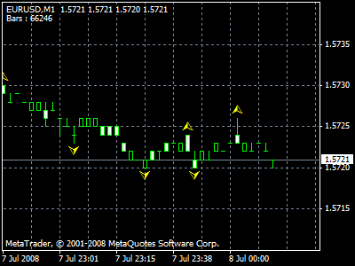

This indicator, however, has nothing to do with fractals, it relates to Elliot Wave Theory.

A derivation of this is called the "fractal channel" which links the little arrows; similarly, it has nothing to do with fractals.

More relevant then is the **Fractal Adaptive Moving Average (FRAMA)**, which relates to Kaufman's AMA, but uses fractal theory to determine the current volatility of the market in order to adjust the speed of the MA. The idea of the AMA is to slow down the MA when the market is moving sideways, and to speed it up when there is a trend. To achieve this objective, John Ehlers developed the FRAMA, using the Fractal Dimension as a direct measurement of Volatility.

On the following graph, a simple 16-MA (blue), an exponential 16-MA (yellow) and the FRAMA in red (with a reference period of 16). Below are the fractal dimension used by the FRAMA, as well as a more sophisticated fractal dimension (FDI):

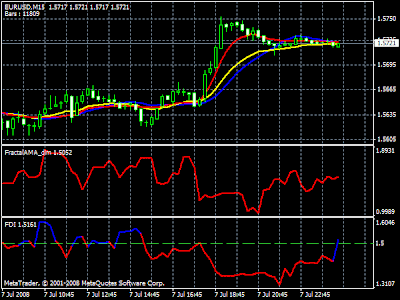

Clearly, during the sideways market (until about 16:45), the FRAMA is somewhat smoother than the two others, and when the trend goes on, it also reacts faster. Therefore, the FRAMA is a good AMA. However, it could be better; the computation of the fractal dimension is rough to say the least, it oscillates between extreme values (from 2 to below 1) that don't even make sense mathematically. The FDI plotted in the lowest window displays a more reasonable fractal dimension. Ehlers recommends:

$$\alpha = \exp(-4.6(D-1))$$

The fractal dimension $D_f$ in the FDI follows the following formula:

$$D_{f} = 1 + \frac{\log\left[2\sum_{i=1}^{N}\sqrt{\left(\frac{\text{close}(i)-\text{close}(i-1)}{\text{pricerange}}\right)^{2}+\frac{1}{N^{2}}}\right]}{\log(2N-2)}$$

Where $N$ is the number of periods (price valuations) considered. $D_f$ provides us with some idea of volatility: when $D_f$ gets close to 2, it means that we have very high volatility; the closer to 1 and we have low volatility or, in other terms, a well-defined trend.

Ehlers assumes that price movements follow a lognormal distribution (which is not the case) and, on this basis, comes to compute the value of $\alpha$ as an exponential.

The fractal dimension is an indicator of volatility; it does not inform on the direction of the market. To get direction, many analysts rely on MA or combinations of them (such as Ichimoku, Bands,...). Those indicators may be refined using fractal theory, but they then become hybrid indicators, mixing two diverging conceptions of what price movement is about.

As of now, the only technical tool fractal theory is providing is a measure of volatility, but volatility in itself may be an interesting information to set up one's stop and position size.

---

### 1.2 Fractal Dimension indicator

**Date:** 2008-01-23  
**Author:** iliko (arcsin5@netscape.net)  
**Source:** [https://www.mql5.com/en/code/7758](https://www.mql5.com/en/code/7758)  
**Code:** [downloaded/fractal-dimension/fractal_dimension.mq4](downloaded/fractal-dimension/fractal_dimension.mq4)

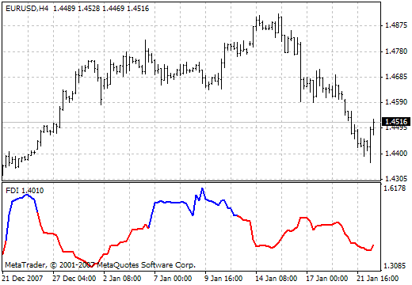

The Fractal Dimension Index (FDI) determines the amount of market volatility. A value of 1.5 suggests a completely random market. Deviation from 1.5 indicates increased profit opportunity:

- **RED** = the market is in a trend
- **BLUE** = the market is highly volatile/erratic
- Color change from red to blue signals that a trend is ending

**Parameters:**
- `e_period` (default 30) -- lookback period
- `e_type_data` (default PRICE_CLOSE) -- price type (0-6)
- `e_random_line` (default 1.5) -- threshold between trend and erratic

**Core algorithm** (from source code):

```
// Normalize prices to [0,1]
diff = (price[i] - priceMin) / (priceMax - priceMin)
// Cumulative path length
length += sqrt((diff - priorDiff)^2 + (1/period^2))
// Fractal dimension
fdi = 1 + (ln(length) + ln(2)) / ln(2*period)
```

---

### 1.3 Fractal Graph Dimension Indicator (FGDI)

**Date:** 2009-04-21  
**Author:** Jean-Philippe Poton  
**Source:** [https://www.mql5.com/en/code/8844](https://www.mql5.com/en/code/8844)  
**Code:** [downloaded/fractal-graph-dimension-indicator-fgdi/FGDI.mq4](downloaded/fractal-graph-dimension-indicator-fgdi/FGDI.mq4)

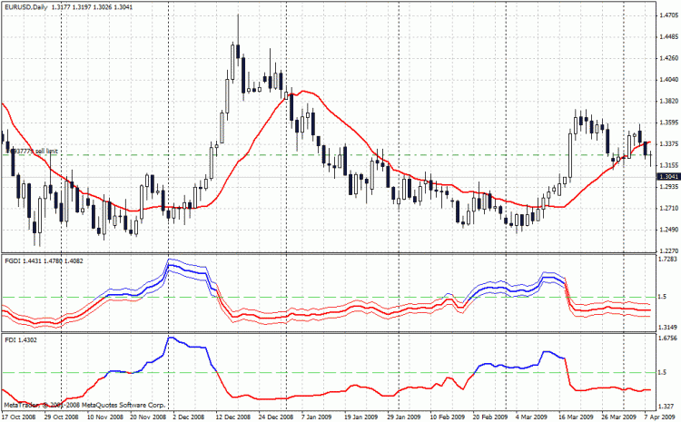

Rework of iliko's `fractal_dimension.mq4`. Corrected two errors:
1. Loop boundary: `iteration <= g_period_minus_1` instead of `<`
2. Denominator: `MathLog(2 * g_period_minus_1)` instead of `MathLog(2 * e_period)`

Additionally, **standard deviation bands** are computed around the FDI estimate, providing a confidence interval. The indicator uses 6 output buffers (FDI up/down + upper band up/down + lower band up/down), all color-coded red/blue relative to the random line (1.5).

**Variance of the FDI estimate** (from source):

```
variance = sum((delta_i - mean_delta)^2) / (length^2 * ln(2*(period-1))^2)
stddev = sqrt(variance)
// Bands: fdi +/- stddev, colored by position relative to e_random_line
```

---

## 2. FRASMA: Fractal Moving Average

### 2.1 The speed of the FRAMA (Part 1)

**Date:** 2009-01-23  
**Source:** [http://fractalfinance.blogspot.com/2009/01/speed-of-frama-1.html](http://fractalfinance.blogspot.com/2009/01/speed-of-frama-1.html)

John Ehlers recommends linking the speed of an exponential moving average to the fractal dimension by making the coefficient $\alpha$ a function of dimension via:

$$\alpha = \exp(-4.6(D-1))$$

Let's accept this formula to consider the question of whether to apply this modification on an EMA or on a SMA.

The purpose of the EMA is to give more weight to the most recent price variations -- a fair concern for the medium or long-term trader, but a much less interesting feature for the intraday trader, who has to cope with noisy, meaningless fluctuations and relies on the moving average precisely to avoid being distracted by noise.

Besides, if we look at what happens for a high fractal dimension (approaching 2), $\alpha$ is going to be very small (around 0.01), the EMA will then be slowed down. But we also know that such a high fractal dimension coincides with the wildest noise, and therefore very high variations of prices. What is the point of slowing down the EMA, while it puts higher weight on the most recent, wildest price variations, thereby reflecting the wildness?

The two ideas clearly conflict. The resulting signal appears to be an ambiguous compromise where the exponential endeavors to speed up the MA (by emphasizing recent variations) while the fractal dimension endeavors to slow it down.

**I therefore prefer, especially as an intraday trader, to fractalise directly a SMA**, and get a direct and readable translation of the information implicit in the fractal dimension. This can be easily achieved by simply dividing the period of the SMA by the coefficient $\alpha$.

**Complement:** Comparison of the original FRAMA (yellow) and FRAMA using more precise FDI calculation (red), both exponential MA with reference period of 10:

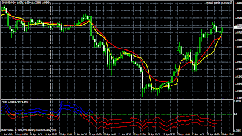

Yellow curve uses Ehlers' original dimension formula:

$$D = \frac{\log(N_1 + N_2) - \log(N_3)}{\log(2)}$$

where $N_1$, $N_2$, $N_3$ are (HighestPrice - LowestPrice)/T over half-intervals and full interval respectively.

Red curve uses the more precise FDI formula:

$$D = 1 + \frac{\log\left[2\sum_{i=1}^{N}\sqrt{\left(\frac{\text{close}(i)-\text{close}(i-1)}{\text{pricerange}}\right)^{2}+\frac{1}{N^{2}}}\right]}{\log(2N-2)}$$

---

### 2.2 The speed of the FRAMA (Part 2): The FRASMA

**Date:** 2009-02-15  
**Source:** [http://fractalfinance.blogspot.com/2009/02/speed-of-frama-part-2-frasma.html](http://fractalfinance.blogspot.com/2009/02/speed-of-frama-part-2-frasma.html)

Having explained the preference for fractalising a SMA rather than an EMA, let us discuss the exact form of this fractalisation.

A modification close to Ehlers' would be to divide the period of the SMA by $\alpha$, where:

$$\alpha = \exp(-4.6(D-1)) \quad (E1)$$

For a dimension $D$ varying between 1 and 2, such a division would be equivalent to a change of speed in a ratio of 100.

This dimension $D$ is a numerical approximation of the Box Dimension. There is however another dimension that Mandelbrot called the **Trail Dimension** [MAN97, pp.161&172]:

For a Fractional Brownian Motion:

$$D_G = 2 - \alpha$$

Where $D_G$ is the Graph Dimension, and $\alpha$ is the Hurst-Holder exponent (hereafter denoted $H$):

$$D_G = 2 - H$$

And the Trail Dimension:

$$D_T = 1/H$$

#### I -- Interpretation of the Trail Dimension

The Trail Dimension varies between 1 and $\infty$, for $H$ varying between 1 and 0. Mandelbrot [MAN97, p.161] explains:

> *"First consider a Wiener Brownian motion in the plane. Its coordinates X(t) and Y(t) are independent Brownian motions. Therefore, if a 1-dimensional Brownian motion X(t) is combined with another independent 1-dimensional Brownian motion Y(t), the process X(t) becomes "embedded" into a 2-dimensional Brownian motion {X(t),Y(t)}. The value of the trail dimension $D_T = 2 = 1/H$ is the fractal dimension of the three dimensional graph of coordinates t,X(t) and Y(t), and the projected "trail" of coordinates X(t) and Y(t). However, the dimension $D_G = 2-H$ applies to the projected graphs of coordinates t and X(t) or t and Y(t)."*

The Trail dimension must be seen as an approximation of the number of dimensions in which the "real" process takes place, under the assumption that all coordinates can be described as independent Fractional Brownian motions sharing the same Hurst exponent.

#### II -- Slowing down the MA with the Trail Dimension

The reference speed should be taken as the one used when price varies in a Gaussian way, that is when $H = 1/2$, so for that value $\alpha = 1$.

$$\alpha = D_T/2 = \frac{1}{2H} \quad (E2)$$

For a WBM, $\alpha = 1$. For $H \to 0$, $\alpha \to \infty$. For $H = 1$, $\alpha = 1/2$.

Comparing $\alpha$ from (E2) (red curve) with $1/\alpha$ from (E1) (black curve):

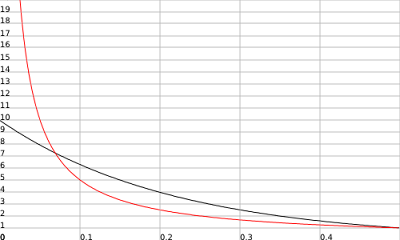

Detailed view below $H = 0.5$:

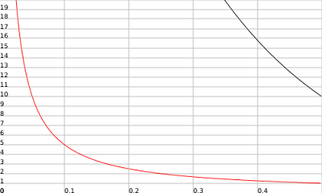

For $H$ varying from 0.5 to 0, the $\alpha$ from (E1) varies almost linearly, but randomness increases non-linearly. A linear slowing down does not reflect this properly. The $\alpha$ from (E2) is preferred (and much simpler).

#### III -- Implementation of the FRASMA

Three fractally modified MAs: Light Blue = FRAMA from Ehlers (modifying EMA), Yellow = SMA modification using $\alpha$ from Ehlers, Red = FRASMA using equation (E2):

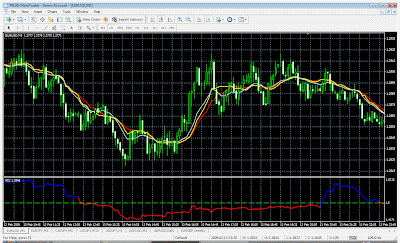

Below is the fractal Graph Dimension. Reference period for all MAs is 20.

#### IV -- Conclusion

There is no Grail to be found. Nonetheless, to understand the technical tools one is using can improve one's intuition, and the overall success of one's trading activity.

---

### 2.3 FRASMA indicator

**Date:** 2009-02-18  
**Author:** Jean-Philippe Poton (jppoton@yahoo.com)  
**Source:** [https://www.mql5.com/en/code/8718](https://www.mql5.com/en/code/8718)  
**Code:** [downloaded/frasma-fractally-modified-simple-moving-average/FRASMA.mq4](downloaded/frasma-fractally-modified-simple-moving-average/FRASMA.mq4)

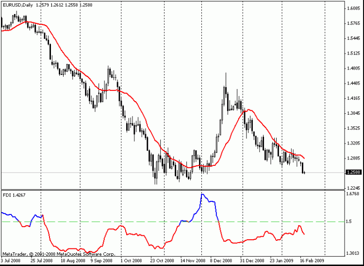

Fractally modified Simple Moving Average. Computes FDI, derives trail dimension and $\alpha$, then applies adaptive SMA speed.

**Parameters:**
- `e_period` (default 30) -- period for fractal dimension calculation
- `normal_speed` (default 20) -- base SMA period
- `e_type_data` (default PRICE_CLOSE) -- price type

**Core formula** (from source):

```
fdi = 1 + (ln(length) + ln(2)) / ln(2*period)
trail_dim = 1 / (2 - fdi)       // trail dimension
alpha = trail_dim / 2
speed = round(normal_speed * alpha)
output = iMA(speed)              // SMA with adaptive period
```

The indicator uses iliko's `fractal_dimension.mq4` for the FDI computation. In the MQL4 community thread, Poton credits iliko (arcsin5@netscape.net) as the original FDI author.

---

### 2.4 Fractal dimensions...And a Fractal Graph Dimension Indicator

**Date:** 2009-04-16  
**Source:** [http://fractalfinance.blogspot.com/2009/04/fractal-dimensionsand-fractal-graph.html](http://fractalfinance.blogspot.com/2009/04/fractal-dimensionsand-fractal-graph.html)

This post introduces the FGDI as a corrected and improved version of iliko's fractal dimension indicator. The original indicator had two bugs corrected in the FGDI (see [Section 1.3](#13-fractal-graph-dimension-indicator-fgdi) above for details).

The FGDI also adds standard deviation bands around the estimated fractal dimension, providing a measure of confidence in the current estimate. The FGDI is available at [https://www.mql5.com/en/code/8844](https://www.mql5.com/en/code/8844).

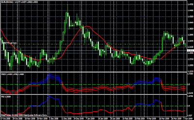

---

### 2.5 FRASMAv2

**Date:** 2009-04-26  
**Source:** [http://fractalfinance.blogspot.com/2009/04/frasmav2.html](http://fractalfinance.blogspot.com/2009/04/frasmav2.html)

Updated version of FRASMA. Original logic untouched; updated to use the corrected fractal dimension from FGDI. Added a `shift` parameter to translate the FRASMA right (positive shift) or left (negative shift).

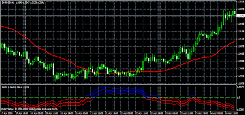

---

### 2.6 FRASMAv2 indicator

**Date:** 2009-04-26  
**Author:** Jean-Philippe Poton  
**Source:** [https://www.mql5.com/en/code/8866](https://www.mql5.com/en/code/8866)  
**Code:** [downloaded/frasma2/FRASMA_v2.mq4](downloaded/frasma2/FRASMA_v2.mq4)

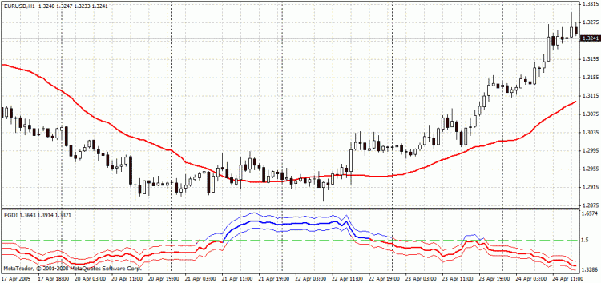

**Parameters:**
- `e_period` (default 30)
- `normal_speed` (default 20)
- `shift` (default 0) -- output shift
- `e_type_data` (default PRICE_CLOSE)

**Key difference from v1** (from source):

```
fdi = 1 + (ln(length) + ln(2)) / ln(2*(period-1))   // uses period-1
output[pos - shift] = iMA(speed)                      // shifted output
```

---

### 2.7 Some general updates and a comment on FRASMA

**Date:** 2009-07-22  
**Source:** [http://fractalfinance.blogspot.com/2009/07/some-general-updates-and-comment-on.html](http://fractalfinance.blogspot.com/2009/07/some-general-updates-and-comment-on.html)

Brief post noting ongoing study of fundamental mathematical problems. Points readers to discussions in the MQL4 community FRASMA thread. Comments discuss FGDI volatility spikes as resistance levels, Elliott wave patterns, Fibonacci arcs, and multifractal analysis.

---

## 3. FX Scaling Laws

**Date:** 2009-03-26  
**Source:** [http://fractalfinance.blogspot.com/2009/03/fx-scaling-laws.html](http://fractalfinance.blogspot.com/2009/03/fx-scaling-laws.html)

This post discusses an article by Glattfelder, Dupuis and Olsen [@GDO2009] proposing empirical FX scaling laws. One law (Law 12) gives the "coastline" (cumulative price movement) as a function of directional change threshold:

$$\Delta x_{cum}^{*} = \sum_{i=1}^{n}\left|\Delta x_i^{*}\right| = \left(\frac{\Delta x_{dc}}{C_{cum,*}}\right)^{E_{cum,*}}$$

For the time-mode:

$$\Delta x_{cum}^{tm} = \left(\frac{\Delta x_{dc}}{200.9}\right)^{-0.937}$$

Setting $\Delta x_{dc} = 0.001$ (1 PIP):

$$\Delta x_{cum}^{tm} = 93087.68$$

Annualized, per 15-minute bar: $93087.68 / (250 \times 24 \times 4) = 3.88$ (i.e., about 520 PIPs in a day for the directional-change mode with a 1 PIP threshold).

This gives an empirical measure of the "coastline length" of EUR/USD price movements.

---

## 4. Fractal Bands & Fractional Bands

### 4.1 Maximum of Wiener Brownian Motion

**Date:** 2009-05-04  
**Source:** [https://stochasticfractals.wordpress.com/2009/05/04/maximum-of-wiener-brownian-motion/](https://stochasticfractals.wordpress.com/2009/05/04/maximum-of-wiener-brownian-motion/)

Let $W_0$ be a standard Wiener Brownian Motion and define:

$$M(t) = \max_{0 \leq s \leq t} W_0(s)$$

Then:

$$P(M(t) \geq x) = 2\left(1 - \Phi\left(\frac{x}{\sqrt{t}}\right)\right)$$

where $\Phi$ is the standard normal CDF:

$$\Phi(z) = \frac{1}{\sqrt{2\pi}} \int_{-\infty}^{z} e^{-u^2/2}\,du$$

This is a direct application of a reflection principle result with $\alpha = 0$.

---

### 4.2 Standard Deviation of Fractional Brownian Motion

**Date:** 2009-05-05  
**Source:** [https://stochasticfractals.wordpress.com/2009/05/](https://stochasticfractals.wordpress.com/2009/05/)

A Fractional Brownian Motion $B_H(t)$ with Hurst parameter $H$ ($0 \leq H \leq 1$) has the covariance structure:

$$E[B_H(t) B_H(s)] = \frac{1}{2}\left(|t|^{2H} + |s|^{2H} - |t-s|^{2H}\right)$$

From this:

$$\text{Var}(B_H(t)) = E[B_H^2(t)] = |t|^{2H}$$

Therefore, the standard deviation is:

$$\sigma = |t|^H$$

which reduces to $\sqrt{t}$ for the Wiener case ($H = 1/2$).

---

### 4.3 From Bollinger to Fractal Bands

**Date:** 2009-05-06  
**Source:** [http://fractalfinance.blogspot.com/2009/05/from-bollinger-to-fractal-bands.html](http://fractalfinance.blogspot.com/2009/05/from-bollinger-to-fractal-bands.html)

Bollinger Bands consist of a MA and two bands at 2 standard deviations. Assuming price variations follow a normal distribution (WBM of $N(0,t)$), the probability of prices within the bands equals the probability of the maximum $M(t)$ being within them:

$$P(M(t) \leq x) = 1 - 2\left(1 - \Phi\left(\frac{x}{\sqrt{t}}\right)\right)$$

So:

$$P(M(t) \leq 2\sqrt{t}) = 2\Phi(2) - 1 = \text{erf}(\sqrt{2}) = 0.954$$

The empirical standard deviation:

$$\sigma = \sqrt{\frac{1}{N}\sum_{i=1}^{N}(x_i - \bar{x})^2}$$

Equating theoretical and practical values, and using the FBM standard deviation $|t|^H$, we get:

$$\sigma_{FBM} = |t|^H = \left(\frac{1}{N}\sum_{i=1}^{N}(x_i - \bar{x})^2\right)^H = \sigma_{WBM}^{2H} \quad (1)$$

#### Implementation of Fractal Bands

A naive application of equation (1) narrows the bands during trends (because FOREX standard deviations are much less than 1, raising to a higher power decreases them). Instead:

$$\sigma_{final} = \sigma_{WBM} \cdot \alpha^H \quad (2)$$

By taking $\alpha > 1$, the higher $H$, the wider the bands:

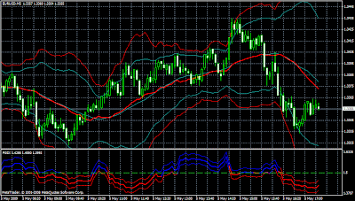

#### Strategy

- **BUY** after price rebounds from lower band and crosses FRASMA; SL at lower band touch, TP at upper band
- **SELL** after price falls from upper band and crosses FRASMA; SL at upper band touch, TP at lower band
- Used for EUR/USD on 5-minute timeframe with speed=30, $\alpha=2$

---

### 4.4 Fractal Bands indicator

**Date:** 2009-05-06  
**Author:** Jean-Philippe Poton  
**Source:** [https://www.mql5.com/en/code/8895](https://www.mql5.com/en/code/8895)  
**Code:** [downloaded/fractal-bands/fractal_bands.mq4](downloaded/fractal-bands/fractal_bands.mq4)

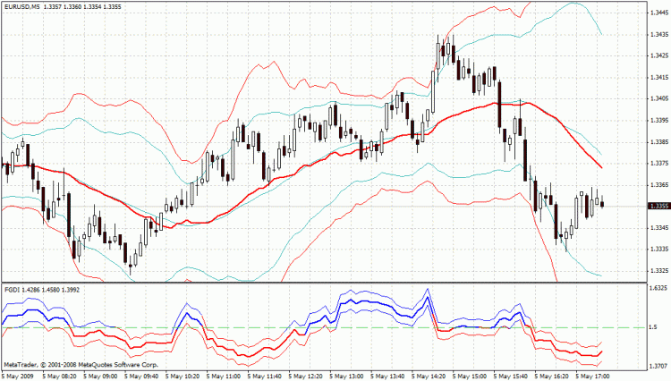

FRASMA center line with upper/lower bands based on standard deviation scaled by Hurst exponent.

**Parameters:**
- `e_period` (default 30)
- `normal_speed` (default 30)
- `alpha` (default 2.0) -- band width multiplier
- `shift` (default 0)
- `e_type_data` (default PRICE_CLOSE)

**Core formula** (from source):

```
hurst = 2 - fdi
trail_dim = 1/hurst
beta = trail_dim/2
speed = round(normal_speed * beta)
frasma = iMA(speed)
deviation = 2 * sqrt(sum((Close[k] - frasma)^2) / period)
Upper = frasma + deviation * alpha^hurst
Lower = frasma - deviation * alpha^hurst
```

---

### 4.5 Fractional Bands

**Date:** 2009-05-07  
**Source:** [http://fractalfinance.blogspot.com/2009/05/fractional-bands.html](http://fractalfinance.blogspot.com/2009/05/fractional-bands.html)

Consider again equation (1):

$$\sigma_{FBM} = \left(\frac{1}{N}\sum_{i=1}^{N}(x_i - \bar{x})^2\right)^H = \sigma_{WBM}^{2H}$$

The technical problem of very small real price variations can be solved by converting to PIPs (multiplying by 10000 for EUR/USD). Applying the equation in PIP space and converting back gives the **Fractional Bands** -- strictly obeying the FBM model.

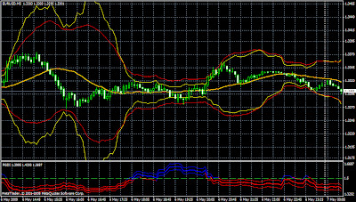

Comparison with Bollinger Bands (blue-green):

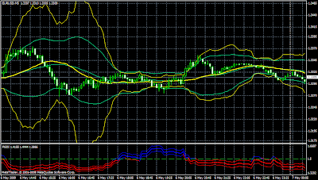

Whenever the Fractal Dimension crosses 1.5 (i.e. $H$ crosses 0.5), the respective bands cross as well. Fractional Bands are narrower for a sideways market and wider for a trending market.

---

### 4.6 Fractional Bands indicator

**Date:** 2009-05-07  
**Author:** Jean-Philippe Poton  
**Source:** [https://www.mql5.com/en/code/8900](https://www.mql5.com/en/code/8900)  
**Code:** [downloaded/fractional-bands-mq4/fractional_bands.mq4](downloaded/fractional-bands-mq4/fractional_bands.mq4)

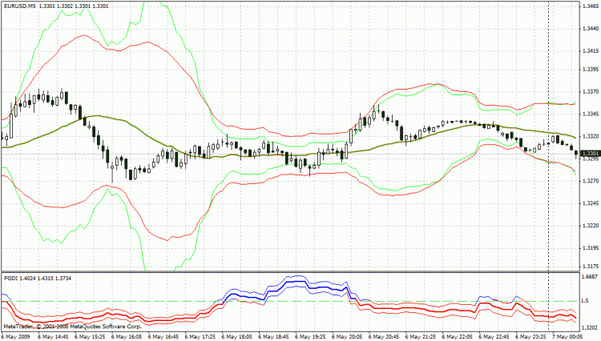

**Parameters:**
- `e_period` (default 30)
- `normal_speed` (default 30)
- `PIP_Convertor` (default 10000) -- converts price to PIPs
- `shift` (default 0)
- `e_type_data` (default PRICE_CLOSE)

**Core formula** (from source):

```
frasma_pips = PIP_Convertor * iMA(speed)
deviation = sqrt(sum((PIP_Convertor*Close[k] - frasma_pips)^2) / period)
Upper = (frasma_pips + 2 * deviation^(2*hurst)) / PIP_Convertor
Lower = (frasma_pips - 2 * deviation^(2*hurst)) / PIP_Convertor
```

---

### 4.7 Fractal Bands Hybride Adaptive

**Author:** Jean-Philippe Poton  
**Code:** [downloaded/fractal-bands-hybride-adaptive/Fractal_Bands_hybride_adaptive.mq4](downloaded/fractal-bands-hybride-adaptive/Fractal_Bands_hybride_adaptive.mq4)

This indicator is attributed to Poton in the source code but no corresponding blog post was found. It is the same as Fractal Bands but replaces the fixed `normal_speed` with an **adaptive cycle period** from John Ehlers' `CyclePeriod` indicator, multiplied by a Nyquist factor.

**Parameters:**
- `e_period` (default 30)
- `normal_speed` (default 30) -- overridden by CyclePeriod
- `alpha` (default 2.0)
- `shift` (default 0)
- `e_type_data` (default PRICE_CLOSE)
- `Nyquist` (default 0.5) -- Nyquist intervals (0.5, 1.0, 1.5, etc.)

**Key difference** (from source):

```
normal_speed = iCustom(Symbol(), Period(), "CyclePeriod", 0.07, 0, shift) * Nyquist
// Then same as Fractal Bands: speed = round(normal_speed * beta), etc.
```

---

## 5. Rescaled Range Analysis & Hurst Exponent

### 5.1 R/S Analysis to estimate the Hurst exponent

**Date:** 2009-10-14  
**Source:** [https://stochasticfractals.wordpress.com/2009/10/14/rs-analysis-to-estimate-the-hurst-exponent/](https://stochasticfractals.wordpress.com/2009/10/14/rs-analysis-to-estimate-the-hurst-exponent/)  
**Reference:** [downloaded/rs-analysis-to-estimate-the-hurst-exponent/tr137.pdf](downloaded/rs-analysis-to-estimate-the-hurst-exponent/tr137.pdf)

The Rescaled Range (R/S) statistic is a method to detect long-range dependence and estimate the Hurst exponent from a time series.

#### Algorithm

Given a sample $X_1, X_2, \ldots, X_n$:

$$R/S(n) = \frac{1}{s}\left[\max_k \sum_{i=1}^{k}(x_i - \bar{x}) - \min_k \sum_{i=1}^{k}(x_i - \bar{x})\right]$$

where $1 \leq k \leq n$, $\bar{x}$ is the sample mean, and $s = \sqrt{\frac{1}{n}\sum(x_i - \bar{x})^2}$.

The key relation is:

$$E[R/S(n)] = C \cdot n^H \text{ as } n \to \infty \quad (1)$$

**Practical procedure** (following Mills, 1988 [@Mills1988]):

1. Given $N$ observations $X_j$ ($j=1,\ldots,N$), partition into $K^u$ blocks of size $d^u = N/K^u$
2. For each block $i$, compute cumulative deviations from the block mean:
$$W(i,k) = \sum_{j=1}^{k}\left[X_{t_i+j-1} - \frac{1}{d^u}\sum_{v=1}^{d^u} X_{t_i+v-1}\right], \quad k=1,\ldots,d^u$$
3. Compute the rescaled range:
$$R/S(i,u) = \frac{R(i,d^u)}{s(i,d^u)}$$
where $R(i,d^u) = \max\{0, W(i,1),\ldots,W(i,d^u)\} - \min\{0, W(i,1),\ldots,W(i,d^u)\}$
4. Average over all blocks, take logarithm, and perform linear regression of $\ln(R/S)$ vs $\ln(d)$ -- the slope is $H$

#### Summary of Bear Cave article (Kaplan, 2003)

Ian Kaplan's "Estimating the Hurst Exponent" [@Kaplan2003] provides a detailed tutorial confirming:
- The fractal dimension relates to Hurst exponent: $D = 2 - H$
- For stock 1-day returns, $H \approx 0.5$ (random walk)
- Longer return periods show increasing $H$ toward 1.0
- R/S analysis and wavelet methods give comparable results
- $H$ is useful as a broad characterization but not directly exploitable for prediction

---

### 5.2 Rescaled Range Analysis

**Date:** 2009-10-16  
**Source:** [http://fractalfinance.blogspot.com/2009/10/rescaled-range-analysis.html](http://fractalfinance.blogspot.com/2009/10/rescaled-range-analysis.html)

Having estimated the Hurst Exponent via R/S analysis, Poton wrote a fractalised moving average (RS_FRASMA) using this estimation instead of the graph-dimension method. Unfortunately, R/S analysis is rather demanding in computing power and time; the estimation is not very good for small samples, and not good enough to be usable for a fractional bands type indicator.

Nevertheless, the RS_FRASMA may be of interest in comparison with other MAs. The logic is identical to the FRASMA:

$$\alpha = \frac{1}{2H}$$

Where $H$ is the Hurst Exponent estimated from R/S analysis.

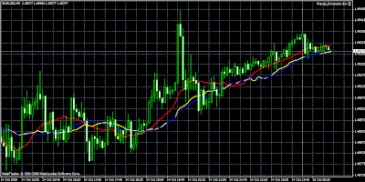

---

### 5.3 RS_FRASMA indicator

**Date:** 2009-10-21  
**Author:** Jean-Philippe Poton  
**Source:** [https://www.mql5.com/ru/code/9272](https://www.mql5.com/ru/code/9272)  
**Code:** [downloaded/rs-frama/RS_FRASMA.mq4](downloaded/rs-frama/RS_FRASMA.mq4)

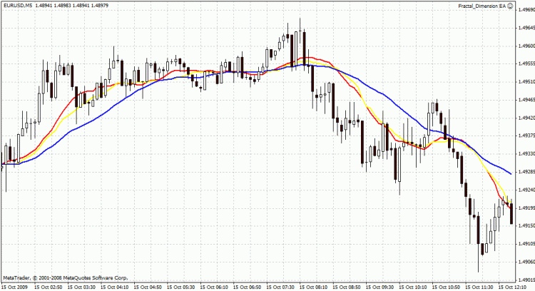

Fractal moving average using **Rescaled Range (R/S) analysis** to compute the Hurst exponent instead of the graph-dimension method. Warning: computationally expensive; keep period small.

**Parameters:**
- `period` (default 64) -- must be a power of 2
- `normal_speed` (default 30)
- `PIP_Convertor` (default 10000)
- `type_data` (default PRICE_CLOSE)

**Core formula** (from source):

```
// Partition data into blocks of size d[i] = 2^(i+1), for i=1..iter
// For each block: compute mean, std, cumulative deviations W
// R = max(W) - min(W), Rs = R/std, averaged over K blocks
// Log-log regression: ln(Rs[i]) vs ln(d[i]) => slope H (Hurst exponent)
H = (iter*sumxy - sumx*sumy) / (iter*sumx2 - sumx^2)
alpha = 1/(2*H)
speed = round(normal_speed * alpha)
output = iMA(speed)
```

---

## 6. Self-similarity & Hurst Variations

### 6.1 Self-similarity and a measure of it

**Date:** 2010-04-15  
**Source:** [http://fractalfinance.blogspot.com/2010/03/self-similarity-and-measure-of-it.html](http://fractalfinance.blogspot.com/2010/03/self-similarity-and-measure-of-it.html)

Following an exchange with fellow trader John Last about the interest of self-similarity, Poton conceived a new indicator to detect convergence of behaviour between different timescales.

#### I -- General Remarks

For financial markets (random fractals), self-similarity should not be taken as meaning a repetition of pattern. Rather, what is meant is **statistical self-similarity** -- a similarity of *behavior* between different timescales. What should be compared is whether volatility displays a level of self-similarity across timescales.

#### II -- Dispersion of the Fractal Dimension across timeframes

The dispersion between the FGDI of various timeframes around the longest timeframe's FGDI:

$$D = \sqrt{\frac{(fgdi(5)-fgdi(60))^2 + (fgdi(15)-fgdi(60))^2 + (fgdi(30)-fgdi(60))^2}{3}} \quad (1)$$

This is the standard deviation around the value of the longest timeframe. A technical issue arises with index alignment: the 30th bar back on the 5mn TF corresponds to 150mn ago, which on the 15mn TF corresponds to the 10th bar. The index transformation:

$$\text{newpos} = \text{pos} \times \frac{TF_{ref}}{TF}$$

#### III -- Implementation

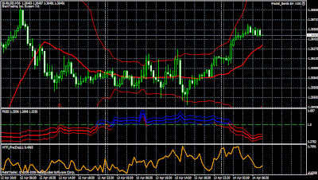

The dispersion value is multiplied by 10. A **low value** indicates **high self-similarity**. In case of a trendy market (FGDI below 1.5), low dispersion is a positive indicator to enter a trade in the direction of the trend, provided the trend is in the same direction on all timeframes considered.

**Important remark** (from John Last): The graphical representation is only temporally aligned with the price graph on the reference TimeFrame (longest TF selected). On shorter TFs, the representation appears contracted towards the right.

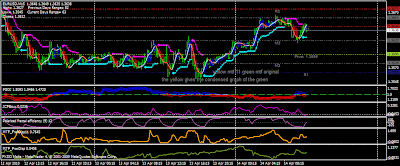

---

### 6.2 A measure of fractal self-similarity indicator

**Date:** 2010-04-05  
**Author:** Jean-Philippe Poton  
**Source:** [https://www.mql5.com/en/code/9604](https://www.mql5.com/en/code/9604)  
**Code:** [downloaded/a-measure-of-fractal-self-similarity/MTF_FractalDispersion11.mq4](downloaded/a-measure-of-fractal-self-similarity/MTF_FractalDispersion11.mq4)

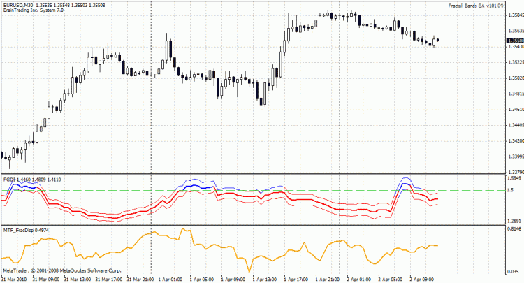

Multi-timeframe fractal dispersion indicator. Estimates dispersion of fractal dimensions across timeframes (5, 15, 30, 60, 240, 1440 min) around the longest timeframe's FDI value. Calls `iCustom("FGDI",...)` on each timeframe.

**Parameters:**
- `e_period` (default 30)
- `e_type_data` (default PRICE_CLOSE)
- `M5w`, `M15w`, `M30w`, `M60w` (default 1) -- timeframe weights
- `M240w`, `M1440w` (default 0) -- timeframe weights

**Core formula** (from source):

```
// For each TF, compute weighted squared deviation from longest active TF's FDI
sigma = sqrt(sum(weight_i * (FDI_i - FDI_longest)^2) / (N-1))
output = 10 * sigma
```

**Note:** This indicator requires `FGDI.mq4` to be present and compiled on the system.

---

### 6.3 Variation of the Hurst Exponent

**Date:** 2010-05-16  
**Source:** [http://fractalfinance.blogspot.com/2010/05/variation-of-hurst-exponent.html](http://fractalfinance.blogspot.com/2010/05/variation-of-hurst-exponent.html)

An interesting way to use the fractal dimension is to look at its **variations** rather than its absolute value. From equation (1) in [Section 4.3](#43-from-bollinger-to-fractal-bands), applying the functional power rule of derivation:

$$\frac{\partial \sigma}{\partial t} = \frac{\partial \left(t^{H(t)}\right)}{\partial t} = H t^{H-1} + \frac{\partial H}{\partial t} t^H \ln(t)$$

Rearranging:

$$\frac{\partial \sigma}{\partial t} = t^{H-1}\left[H + \frac{\partial H}{\partial t} \cdot t \ln(t)\right]$$

Asymptotically (for $t$ sufficiently high), the sign of $\partial H / \partial t$ gives the sign of the variation of variance over time. When this variation is **positive**, it indicates **increasing volatility** -- the best time to enter a trade. This indication does not say anything about the direction; it must be combined with a directional indicator.

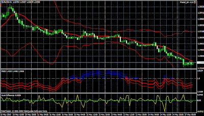

Whenever the indicator displays a value above 0, it indicates a potential entry for a trade.

---

### 6.4 Variations of the Hurst Exponent over time indicator

**Date:** 2010-05-17  
**Author:** Jean-Philippe Poton  
**Source:** [https://www.mql5.com/en/code/9676](https://www.mql5.com/en/code/9676)  
**Code:** [downloaded/variations-of-the-hurst-exponent-over-time/Hurst_Difference.mq4](downloaded/variations-of-the-hurst-exponent-over-time/Hurst_Difference.mq4)

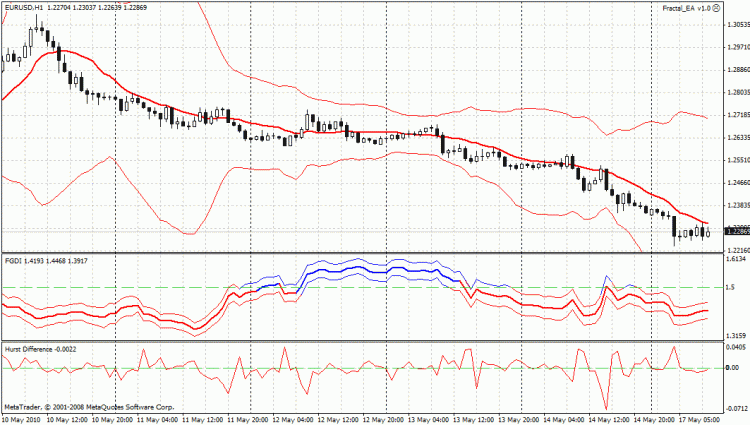

Computes the first difference of the Hurst exponent over time. Displayed in a separate window with a zero line.

**Parameters:**
- `f_period` (default 30)
- `type_data` (default PRICE_CLOSE)

**Core formula** (from source):

```
fdi[pos] = 1 + (ln(length) + ln(2)) / ln(2*(period-1))
Hurst_Diff[pos] = fdi[pos+1] - fdi[pos]    // first difference of FDI
```

**Color coding:** BLUE = not in trend (FDI > 1.5), RED = in trend (FDI < 1.5).

---

## 7. Philosophy of Speculation

### 7.1 The Logic of Place

**Date:** 2011-03-05  
**Source:** [https://fractalfinance.blogspot.com/2011/03/logic-of-place.html](https://fractalfinance.blogspot.com/2011/03/logic-of-place.html)

#### I -- Nishida's Logic of Basho (場所の論理)

Nishida's Logic of Basho presents an encompassing logic: a higher (more universal) category that encompasses a lower (more particular) one is said to be its *basho*. It formalizes the Buddhist logic of Nagarjuna: $A = A$; $A = \text{not-}A$; therefore $A = A$.

The basho logic is ultimately a logic of becoming: if we denote 'a' an entity and 'A' the basho within which it is located, then: $\text{not-not-}a = A$. And possibly: $A = \text{not-}A$ if $A$ is the basho of absolute nothingness -- leading to the constitution of the self-aware subject as an "absolutely contradictory self-identity" (絶対矛盾的自己同一).

#### II -- Nishida's Basho and Levinas' Illeity

While both Levinas' "Illeity" and Nishida's basho seem to fulfill similar formal roles in constituting relationality, there is a fundamental difference: Levinas' Illeity defines a continuum, an ether within which meeting takes place. Nishida's basho defines an absolute disconnectedness, an empty place within which meeting can never settle in anything but a tense and endless dynamics.

#### III -- The Basho of the Market

The market is a basho: price is the result of a meeting of offer and demand, taking place in an otherwise empty market. Following Nishida's logic, the dynamics of price is infinite, discontinuous and untotalizable.

What the comparison between Nishida and Levinas tells us is that **disconnectedness is a topological property of the market-place** and not a feature of price time-series. This invalidates the distinction between discrete and continuous models, as such models only address the price process and do not account for the topology of the market place.

---

### 7.2 The possibility of cognition

**Date:** 2011-04-18  
**Source:** [http://fractalfinance.blogspot.com/2011/04/possibility-of-cognition.html](http://fractalfinance.blogspot.com/2011/04/possibility-of-cognition.html)

#### I -- Reading a book before it is written

The untotalization of possibilities Ayache shows with regard to financial markets invalidates most attempts at thinking the market in explicit terms, as they are ultimately based on probability computation. The fractal analysis developed in this blog provides for an untotalization by means of an implicit multifractal model, where the Hurst exponent keeps being recomputed.

#### II -- Action-like Intuition (行為的直感)

Nishida's concept: cognition requires active participation, not passive observation. "Conceiving something through action-intuition means: seeing it through formation, comprehending it through poiesis." Applied to TA: we need a tool that is self-referential in the way the market is self-referential -- accounting for the grammar the market is writing itself in.

#### III -- The Grammar of the Market

The fractal features of the market represent a meta-grammar. Mandelbrot himself excluded the direct application of Fractal Theory to investing or trading; it only serves to invalidate probabilistic and statistical inference from the market. However, a partial reductionist approach may reveal something valuable.

#### IV -- Fractals and p-adic Fields

Self-similar fractals can be mapped homeomorphically to spaces of p-adic integers via:

$$\psi_b : \mathbb{Z}_p \to [0,1]$$

$$\psi_b\left(\sum_{i \geq 0} a_i p^i\right) = \frac{b-1}{p-1}\sum_{i \geq 0}\frac{a_i}{b^{i+1}}$$

Yielding fractal dimension:

$$D = \frac{\log(p)}{\log(b)}$$

For $b=3$, $p=2$, this maps 2-adic integers onto the Cantor Set:

$$\psi_3 : \sum_{i \geq 0} a_i 2^i \mapsto \sum_{i \geq 0}\frac{2a_i}{3^{i+1}}$$

P-adic fields also present an interesting ultrametric feature relevant to decision-making. While a metric satisfies: $d(x,z) \leq d(x,y) + d(y,z)$, an ultrametric satisfies:

$$d(x,z) \leq \max(d(x,y), d(y,z))$$

This leads to "**The strongest wins**":

$$|x| > |y| \Rightarrow |x+y| = |x|$$

In decision-making, we tend to ignore menial parameters and base decisions on the most relevant one -- closer to an "ultrametric mode" of thinking.

---

### 7.3 The Art of Speculation

**Date:** 2011-05-22  
**Source:** [http://fractalfinance.blogspot.com/2011/05/art-of-speculation.html](http://fractalfinance.blogspot.com/2011/05/art-of-speculation.html)

#### I -- Constraining the Art

Baudelaire (Salon de 1859): "Rhetorics and prosodies are not arbitrarily invented tyrannies but a collection of rules required by the very organization of the spiritual being. And never did prosodies and rhetorics prevent originality."

The Oulipo (1960, founded by Queneau and Le Lyonnais) asserts the necessity of constraints for imagination to be productive. Many Oulipo constraints are inspired from mathematics. The Oulipo's work may seem acquainted with what TA is doing in relation to speculation.

#### II -- The Beautiless Art

There is no beauty in speculation -- the speculator does not produce any masterpiece. Beauty has not the time to form in the market place. The closest to the art of the speculator is the performance of an amnesic improvisator with no public.

#### III -- The Falsehood of Technical Analysis

Baudelaire: "These things, because they are false, are infinitely closer to the truth."

The ideal TA tool is not one with no lag at all (that would destroy the market); it is one with lag adapted to the speculator's relation to market conditions. TA tools are not there to tell truth about the market but to "artistically express and tragically concentrate" the reality of a relationship between speculator and market.

Like an Oulipo constraint challenges the artist to create, TA challenges the speculator to speculate in order to be overcome. Speculation is the counter-proof of TA. Through double-negation (TA negating the market, speculation negating TA), the speculator becomes the market (see: $\text{not-not-}a = A$).

---

### 7.4 The absent signal

**Date:** 2012-04-16  
**Source:** [http://fractalfinance.blogspot.com/2012/04/absent-signal.html](http://fractalfinance.blogspot.com/2012/04/absent-signal.html)

All that Technical Analysis is about is to reveal the underlying signal nested in the time series. There is however a fundamental difference with classical signal processing: in TA, we assume the signal's existence while all the processing seems to reveal its absence.

The fractal analysis tells us that the time series keeps evading identification as a fractal, since the Hurst exponent keeps changing. The time series cannot be identified as a fractal -- we basically failed to detect the signal we intended to study. Nevertheless, we ignore this conclusion and proceed with our assumption to make trading decisions.

Ayache [@Ayache2010, p.295] shows that the fractal behaviour of the market is not to be identified with the time series as a fractal. Rather, the fractality applies to the existence of the market as a whole, including infinitely many virtual derivatives. The time series is at best a truncated version of the "fractal of the market."

> *"The abyss of differentiation, opening at every point, must not concern the price of the underlying alone but the price of any 'virtual' derivative that might be written, right there and right then... If there were a stage at which the coefficients settled, the price of the corresponding derivative would become a deterministic function of the preceding prices and would no longer admit a market."*

The classical approaches (TA or Mathematical Finance), by assuming a signal or stochastic process, assume we are exploring an unknown land by following an already built road. The fractal analysis keeps telling us there is no road. A **topological study** should not tell us about a road but may inform us of the topography -- helping us choose the direction of the next step.

---

## References

See [fractal-finance.bib](fractal-finance.bib) for the complete bibliography.

---

*Compiled from articles published between 2008 and 2012 on [fractalfinance.blogspot.com](http://fractalfinance.blogspot.com/), [stochasticfractals.wordpress.com](https://stochasticfractals.wordpress.com/), and [mql5.com](https://www.mql5.com/).*
