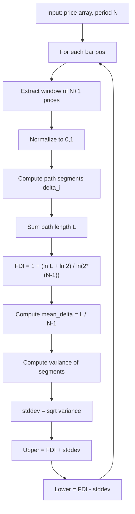

# Fractal Graph Dimension Indicator (FGDI)

**Mnemonic:** `fgdi`  
**Author:** Jean-Philippe Poton (jppoton@yahoo.com)  
**Reference MQ4:** `fractal_graph_dimension_indicator.mq4`  
**Source:** [https://www.mql5.com/en/code/8844](https://www.mql5.com/en/code/8844)  
**Blog:** [http://fractalfinance.blogspot.com/2009/04/fractal-dimensionsand-fractal-graph.html](http://fractalfinance.blogspot.com/2009/04/fractal-dimensionsand-fractal-graph.html)

## Overview

The FGDI is Poton's corrected and enhanced version of iliko's Fractal Dimension
Index (FDI). It fixes two bugs in the original and adds **standard deviation
bands** around the estimated dimension, providing a confidence interval.

## Corrections from the original FDI

1. **Loop boundary:** uses `i <= period-1` (inclusive) instead of `i < period-1`
2. **Denominator:** uses $\ln(2(N-1))$ instead of $\ln(2N)$

## Mathematical Foundation

### Fractal Dimension (corrected)

$$D_f = 1 + \frac{\ln(L) + \ln(2)}{\ln(2(N-1))}$$

where $L$ is the path length computed identically to the FDI (see `fractal_dimension/`).

### Standard Deviation Bands

The FGDI also estimates the **variance** of the dimension estimate by computing
the dispersion of individual path segments:

$$\text{mean\_delta} = \frac{L}{N-1}$$

$$\text{variance} = \frac{\sum_{i=1}^{N-1}(\delta_i - \text{mean\_delta})^2}{L^2 \cdot [\ln(2(N-1))]^2}$$

$$\text{stddev} = \sqrt{\text{variance}}$$

where $\delta_i = \sqrt{(\text{diff}_i - \text{diff}_{i-1})^2 + 1/N^2}$ is the
length of each path segment.

The bands are: $D_f \pm \text{stddev}$.

## Color Coding

- **FDI < random_line** → RED (trending)
- **FDI > random_line** → BLUE (erratic/volatile)
- Same color logic applies to the bands

## Configuration Parameters

| Parameter | Type | Default | Valid Range | Description |
|-----------|------|---------|-------------|-------------|
| `e_period` | int | 30 | ≥ 2 | Lookback period |
| `e_type_data` | int | 0 (CLOSE) | 0–6 | Price type |
| `e_random_line` | float | 1.5 | (1.0, 2.0) | Regime threshold |

## Algorithm Flow

## Variable Names

| Variable | Description |
|----------|-------------|
| `g_period_minus_1` | N-1, loop upper bound |
| `length` | Cumulative path length L |
| `fdi` | Computed fractal graph dimension |
| `variance` | Variance of the dimension estimate |
| `stddev` | Standard deviation (band width) |
| `upper_band` | FDI + stddev |
| `lower_band` | FDI - stddev |

## References

- Poton, J.-P. (2009). "Fractal dimensions...And a Fractal Graph Dimension Indicator." Fractal Finance blog.
- Poton, J.-P. (2009). FGDI indicator for MetaTrader 4. MQL5 Code Base #8844.
- iliko (2007). Fractal Dimension indicator. MQL5 Code Base #7758.
