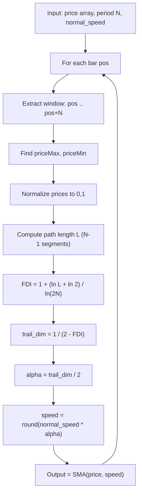

# Fractal Adaptive Simple Moving Average (FRASMA)

**Mnemonic:** `frasma`  
**Author:** Jean-Philippe Poton (jppoton@yahoo.com), Copyright 2008  
**Reference MQ4:** `fractal_adamtive_simple_moving_average.mq4`  
**Source:** [https://www.mql5.com/en/code/8718](https://www.mql5.com/en/code/8718)  
**Blog:** [http://fractalfinance.blogspot.com/2009/02/speed-of-frama-part-2-frasma.html](http://fractalfinance.blogspot.com/2009/02/speed-of-frama-part-2-frasma.html)

## Overview

FRASMA uses the Fractal Dimension Index (FDI) to adaptively modify the period
of a Simple Moving Average. Instead of applying exponential smoothing (as
FRAMA does), FRASMA directly adjusts the SMA window length based on the
current fractal dimension of the price series.

- In a **trending** market ($H > 0.5$), the SMA speeds up (shorter period)
  to follow the trend more closely.
- In a **random** market ($H = 0.5$), the SMA period equals `normal_speed`
  (unchanged).
- In an **erratic** market ($H < 0.5$), the SMA slows down (longer period)
  to filter out noise.

## Mathematical Foundation

### Step 1: Compute FDI (iliko's original formula)

For a lookback window of $N$ bars, normalize prices to $[0,1]$ and compute
the path length $L$:

$$L = \sum_{i=1}^{N-1} \sqrt{\left(\text{norm}_i - \text{norm}_{i-1}\right)^2 + \frac{1}{N^2}}$$

Then:

$$D_f = 1 + \frac{\ln(L) + \ln(2)}{\ln(2N)}$$

Note: this uses $\ln(2N)$ in the denominator (iliko's original), **not**
$\ln(2(N-1))$ as in the corrected FGDI formula.

### Step 2: Hurst exponent

$$H = 2 - D_f$$

### Step 3: Trail dimension

$$D_{\text{trail}} = \frac{1}{H} = \frac{1}{2 - D_f}$$

### Step 4: Alpha factor

$$\alpha = \frac{D_{\text{trail}}}{2}$$

### Step 5: Adaptive speed

$$\text{speed} = \text{round}\!\left(\text{normal\_speed} \times \alpha\right)$$

### Step 6: Output

$$\text{FRASMA}[i] = \text{SMA}(\text{price}, \text{speed})[i]$$

### Key Insight

| Regime | $H$ | $D_f$ | $\alpha$ | Effect |
|--------|-----|--------|----------|--------|
| Trending | $> 0.5$ | $< 1.5$ | $< 1$ | MA speeds up (shorter period) |
| Random | $= 0.5$ | $= 1.5$ | $= 1$ | MA unchanged |
| Erratic | $< 0.5$ | $> 1.5$ | $> 1$ | MA slows down (longer period) |

## Configuration Parameters

| Parameter | Type | Default | Valid Range | Description |
|-----------|------|---------|-------------|-------------|
| `e_period` | int | 30 | $\geq 2$ | Lookback period for FDI computation |
| `normal_speed` | int | 20 | $\geq 1$ | Base SMA period before fractal adaptation |
| `e_type_data` | int | 0 (CLOSE) | 0--6 | Price type: 0=Close, 1=Open, 2=High, 3=Low, 4=Median, 5=Typical, 6=Weighted |

## Algorithm Flow

## Variable Names (from MQ4 source)

| Variable | Description |
|----------|-------------|
| `e_period` | Lookback period $N$ for FDI |
| `normal_speed` | Base SMA period before adaptation |
| `g_period_minus_1` | $N - 1$, used as loop bound |
| `priceMax`, `priceMin` | Max/min price in the lookback window |
| `diff` | Normalized price at current step |
| `priorDiff` | Normalized price at previous step |
| `length` | Cumulative path length $L$ |
| `fdi` | Computed fractal dimension |
| `trail_dim` | Trail dimension $1/H$ |
| `alpha` | Scaling factor $D_{\text{trail}} / 2$ |
| `speed` | Adapted SMA period |
| `ExtOutputBuffer` | Output buffer (the adaptive SMA line) |
| `LOG_2` | Precomputed $\ln(2)$ constant |

## References

- Poton, J.-P. (2008). Fractal Adaptive Simple Moving Average (FRASMA). MQL5 Code Base #8718.
- Poton, J.-P. (2009). "Speed of FRAMA -- Part 2: FRASMA." Fractal Finance blog.
- iliko (2007). Fractal Dimension indicator for MetaTrader 4. MQL5 Code Base #7758.
- Mandelbrot, B. B. (1997). *Fractals and Scaling in Finance*. Springer.
