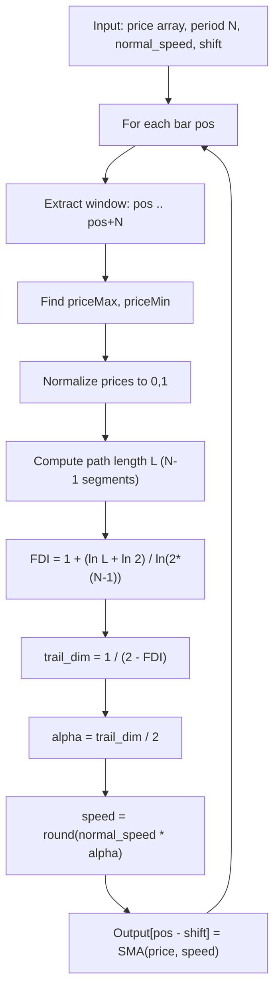

# Fractal Adaptive Simple Moving Average v2 (FRASMAv2)

**Mnemonic:** `frasma2`  
**Author:** Jean-Philippe Poton (jppoton@yahoo.com), Copyright 2008  
**Reference MQ4:** `fractal_adamtive_simple_moving_average_2.mq4`  
**Source:** [https://www.mql5.com/en/code/8866](https://www.mql5.com/en/code/8866)

## Overview

FRASMAv2 is an updated version of the Fractal Adaptive Simple Moving Average.
It differs from the original FRASMA in two ways:

1. **Corrected FDI formula** -- uses $\ln(2(N-1))$ in the denominator instead
   of $\ln(2N)$, matching the Fractal Graph Dimension Indicator (FGDI)
   correction.
2. **Shift parameter** -- allows the output to be displaced forward or
   backward in time.

The loop also iterates over $N$ points ($0 \ldots N-1$ inclusive, i.e.,
`iteration <= g_period_minus_1`), yielding $N-1$ path segments, compared to
FRASMA v1 which iterates `iteration < g_period_minus_1` ($N-2$ segments).

## Mathematical Foundation

### Step 1: Compute FDI (corrected FGDI formula)

Normalize prices in the lookback window and compute path length $L$ over
$N-1$ segments:

$$L = \sum_{i=1}^{N-1} \sqrt{\left(\text{norm}_i - \text{norm}_{i-1}\right)^2 + \frac{1}{N^2}}$$

$$D_f = 1 + \frac{\ln(L) + \ln(2)}{\ln\!\big(2(N-1)\big)}$$

### Step 2: Hurst exponent

$$H = 2 - D_f$$

### Step 3: Trail dimension

$$D_{\text{trail}} = \frac{1}{H} = \frac{1}{2 - D_f}$$

### Step 4: Alpha factor

$$\alpha = \frac{D_{\text{trail}}}{2}$$

### Step 5: Adaptive speed

$$\text{speed} = \text{round}\!\left(\text{normal\_speed} \times \alpha\right)$$

### Step 6: Output (with shift)

$$\text{FRASMAv2}[i - \text{shift}] = \text{SMA}(\text{price}, \text{speed})[i]$$

A positive shift moves the output to the right (future); a negative shift
moves it to the left (past).

## Configuration Parameters

| Parameter | Type | Default | Valid Range | Description |
|-----------|------|---------|-------------|-------------|
| `e_period` | int | 30 | $\geq 2$ | Lookback period for FDI computation |
| `normal_speed` | int | 20 | $\geq 1$ | Base SMA period before fractal adaptation |
| `shift` | int | 0 | any integer | Output displacement (positive = right/future) |
| `e_type_data` | int | 0 (CLOSE) | 0--6 | Price type: 0=Close, 1=Open, 2=High, 3=Low, 4=Median, 5=Typical, 6=Weighted |

## Algorithm Flow

## Variable Names (from MQ4 source)

| Variable | Description |
|----------|-------------|
| `e_period` | Lookback period $N$ for FDI |
| `normal_speed` | Base SMA period before adaptation |
| `shift` | Output buffer displacement |
| `g_period_minus_1` | $N - 1$, used as loop bound and in denominator |
| `priceMax`, `priceMin` | Max/min price in the lookback window |
| `diff` | Normalized price at current step |
| `priorDiff` | Normalized price at previous step |
| `length` | Cumulative path length $L$ |
| `fdi` | Computed fractal dimension |
| `trail_dim` | Trail dimension $1/H$ |
| `alpha` | Scaling factor $D_{\text{trail}} / 2$ |
| `speed` | Adapted SMA period |
| `ExtOutputBuffer` | Output buffer (the adaptive SMA line) |
| `LOG_2` | Precomputed $\ln(2)$ constant |

## Differences from FRASMA v1

| Aspect | FRASMA v1 | FRASMAv2 |
|--------|-----------|----------|
| FDI denominator | $\ln(2N)$ | $\ln(2(N-1))$ |
| Loop bound | `iteration < g_period_minus_1` ($N-2$ segments) | `iteration <= g_period_minus_1` ($N-1$ segments) |
| Shift parameter | absent | present |
| MQL5 code base | #8718 | #8866 |

## References

- Poton, J.-P. (2008). Fractal Adaptive Simple Moving Average v2 (FRASMAv2). MQL5 Code Base #8866.
- Poton, J.-P. (2009). "Speed of FRAMA -- Part 2: FRASMA." Fractal Finance blog.
- iliko (2007). Fractal Dimension indicator for MetaTrader 4. MQL5 Code Base #7758.
