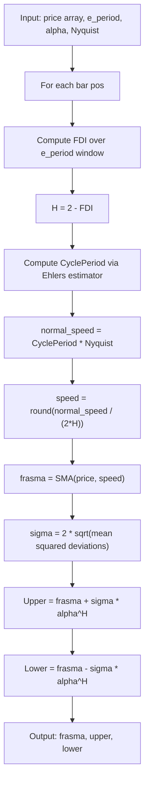

# Fractal Bands Hybride Adaptive

**Mnemonic:** `fbanha`  
**Original author:** Jean-Philippe Poton, Copyright 2008  
**Reference MQ4:** `fractal_bands_hybride_adaptive.mq4`  
**Source:** Unpublished (no public blog post found)

## Overview

A hybrid variant of Fractal Bands that replaces the fixed `normal_speed`
parameter with a dynamically estimated dominant cycle period from Ehlers'
CyclePeriod indicator, multiplied by a Nyquist factor. This makes the center
line doubly adaptive: the FRASMA speed responds both to the fractal dimension
(via the Hurst exponent) and to the dominant market cycle (via Ehlers' cycle
estimator).

## Mathematical Foundation

### Steps 1--2: FDI and Hurst exponent

Identical to Fractal Bands:

$$D_f = 1 + \frac{\ln(L) + \ln(2)}{\ln\bigl(2(N-1)\bigr)}$$

$$H = 2 - D_f$$

### Step 3: Adaptive normal speed via Ehlers CyclePeriod

Instead of a fixed `normal_speed`, compute:

$$\text{normal\_speed}(t) = \operatorname{CyclePeriod}(\text{price}, \alpha_{\text{hp}}) \cdot N_{\text{yquist}}$$

where `CyclePeriod` is Ehlers' dominant cycle estimator and $N_{\text{yquist}}$
is the Nyquist multiplier (default 0.5, meaning the sampling period is half the
dominant cycle).

### Ehlers CyclePeriod Algorithm

The estimator uses a high-pass filter and quadrature oscillator:

1. **Smooth:** $s_t = \tfrac{p_t + 2p_{t-1} + 2p_{t-2} + p_{t-3}}{6}$
2. **High-pass:** $\text{cycle}_t = (1 - 0.5\alpha)^2(s_t - 2s_{t-1} + s_{t-2}) + 2(1-\alpha)\,\text{cycle}_{t-1} - (1-\alpha)^2\,\text{cycle}_{t-2}$
3. **Quadrature:** $Q_t = (0.0962\,\text{cycle}_t + 0.5769\,\text{cycle}_{t-2} - 0.5769\,\text{cycle}_{t-4} - 0.0962\,\text{cycle}_{t-6}) \cdot (0.5 + 0.08\,\overline{I}_{t-1})$
4. **In-phase:** $I_t = \text{cycle}_{t-3}$
5. **Smooth** $I$ and $Q$ with exponential averaging, compute instantaneous period from $\arctan(Q/I)$, and smooth the period estimate.

### Steps 4--6: FRASMA, deviation, and bands

With the adaptive `normal_speed`:

$$\text{speed} = \operatorname{round}\!\bigl(\text{normal\_speed}(t) \cdot \beta\bigr)$$

The remainder (FRASMA, deviation, upper/lower bands with $\alpha^H$ scaling) is
identical to Fractal Bands.

## Configuration Parameters

| Parameter | Type | Default | Description |
|-----------|------|---------|-------------|
| `e_period` | int | 30 | Lookback period for FDI computation |
| `normal_speed` | int | 30 | Fallback SMA period (used if CyclePeriod unavailable) |
| `alpha` | float | 2.0 | Band width multiplier (raised to power $H$) |
| `shift` | int | 0 | Bar shift for the indicator buffers |
| `e_type_data` | int | 0 (CLOSE) | Price type |
| `Nyquist` | float | 0.5 | Nyquist multiplier applied to the estimated cycle period |

## Algorithm Flow

## Variable Names (from MQ4 source)

| Variable | Description |
|----------|-------------|
| `e_period` | Lookback period $N$ for FDI |
| `normal_speed` | Fallback base SMA speed |
| `alpha` | Band width scaling base |
| `Nyquist` | Nyquist multiplier for cycle period |
| `fdi` | Fractal Dimension Index value |
| `hurst` | Hurst exponent $H = 2 - D_f$ |
| `trail_dim` | Trail dimension $1/H$ |
| `beta` | Half of trail dimension |
| `speed` | Adaptive SMA period |
| `frasma` | Fractal Adaptive SMA value |
| `deviation` | Scaled standard deviation $\sigma$ |
| `cycle_period` | Ehlers' dominant cycle period estimate |

## References

- Poton, J.-P. (2008). Fractal Bands Hybride Adaptive indicator for MetaTrader 4. Unpublished.
- Ehlers, J. F. (2001). *Rocket Science for Traders*. Wiley. Chapter on CyclePeriod measurement.
- Ehlers, J. F. (2004). *Cybernetic Analysis for Stocks and Futures*. Wiley.
- Mandelbrot, B. B., & Van Ness, J. W. (1968). "Fractional Brownian motions, fractional noises and applications." *SIAM Review*, 10(4), 422--437.
