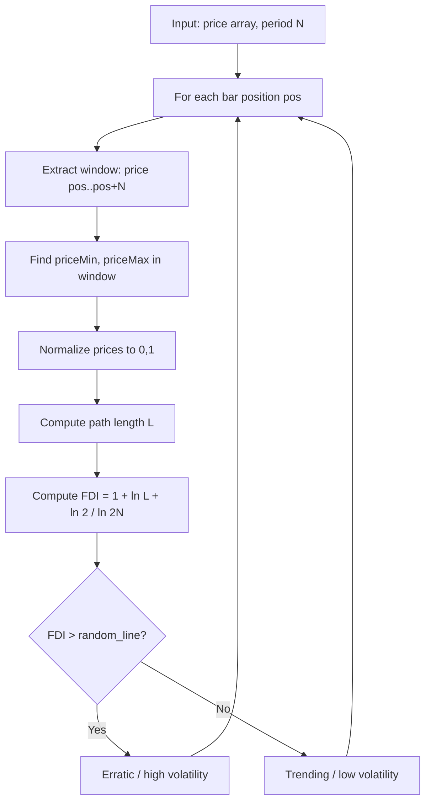

# Fractal Dimension Index (FDI)

**Mnemonic:** `fdi`  
**Original author:** iliko (arcsin5@netscape.net), v1.0 February 2007  
**Reference MQ4:** `fractal_dimension.mq4`  
**Source:** [https://www.mql5.com/en/code/7758](https://www.mql5.com/en/code/7758)

## Overview

The Fractal Dimension Index (FDI) measures the fractal dimension of a price
time series using a box-counting / graph-length method. It quantifies the
"roughness" of the price curve, providing a volatility measure that is
independent of price direction.

- $D_f = 1.5$ → completely random market (Brownian motion)
- $D_f \to 1.0$ → smooth, trending market (low volatility)
- $D_f \to 2.0$ → highly volatile, space-filling curve (erratic)

## Mathematical Foundation

The algorithm estimates the fractal (graph) dimension of the price curve by
computing the normalized path length over $N$ periods and applying the
Hausdorff–Besicovitch dimension formula.

### Step 1: Normalize prices to [0, 1]

For each bar $i$ in the lookback window $[1, N]$:

$$\text{diff}_i = \frac{\text{price}(i) - \text{price}_{\min}}{\text{price}_{\max} - \text{price}_{\min}}$$

### Step 2: Compute path length

$$L = \sum_{i=1}^{N} \sqrt{\left(\text{diff}_i - \text{diff}_{i-1}\right)^2 + \frac{1}{N^2}}$$

The term $1/N^2$ represents the horizontal step between bars (normalized to
$1/N$ in the x-axis, squared under the square root).

### Step 3: Compute fractal dimension

$$D_f = 1 + \frac{\ln(L) + \ln(2)}{\ln(2N)}$$

Where $\ln(2)$ accounts for the factor of 2 in the path length normalization
(the full box is $[0,1] \times [0,1]$, but the diagonal is $\sqrt{2}$ for a
straight line, giving dimension 1).

## Configuration Parameters

| Parameter | Type | Default | Valid Range | Description |
|-----------|------|---------|-------------|-------------|
| `e_period` | int | 30 | ≥ 2 | Lookback period for dimension computation |
| `e_type_data` | int | 0 (CLOSE) | 0–6 | Price type: 0=Close, 1=Open, 2=High, 3=Low, 4=Median, 5=Typical, 6=Weighted |
| `e_random_line` | float | 1.5 | (1.0, 2.0) | Threshold between trending and erratic regimes |

## Algorithm Flow

## Variable Names (from MQ4 source)

| Variable | Description |
|----------|-------------|
| `e_period` | Lookback period N |
| `g_period_minus_1` | N (used as loop bound in original; note: iliko uses `e_period` directly) |
| `priceMax`, `priceMin` | Max/min price in the window |
| `diff` | Normalized price at current step |
| `priorDiff` | Normalized price at previous step |
| `length` | Cumulative path length L |
| `fdi` | Computed fractal dimension |

## References

- iliko (2007). Fractal Dimension indicator for MetaTrader 4. MQL5 Code Base #7758.
- Mandelbrot, B. B. (1997). *Fractals and Scaling in Finance*. Springer.
- Falconer, K. (2003). *Fractal Geometry*. Wiley. Chapter on box-counting dimension.
- Poton, J.-P. (2008). "Comments on some existing fractal-related tools." Fractal Finance blog.
