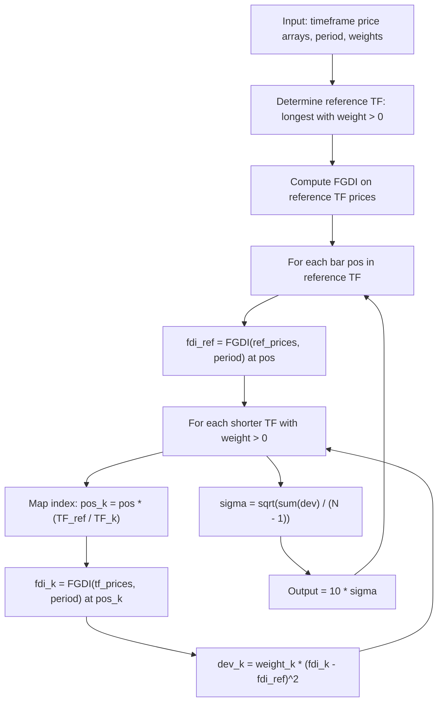

# Fractal Dispersion

**Mnemonic:** `fdisp`  
**Author:** Jean-Philippe Poton (jppoton@yahoo.com), v1.1 April 2010  
**Reference MQ4:** `fractal_dispersion.mq4`  
**Source:** [https://www.mql5.com/en/code/9604](https://www.mql5.com/en/code/9604)  
**Blog:** [http://fractalfinance.blogspot.com/2010/03/self-similarity-and-measure-of-it.html](http://fractalfinance.blogspot.com/2010/03/self-similarity-and-measure-of-it.html)

## Overview

Fractal Dispersion measures how similar the fractal dimension is across
different timeframes. It computes the FGDI (Fractal Graph Dimension Indicator)
on multiple timeframes and outputs the weighted standard deviation of their
values around the longest active timeframe's FDI.

- **Low dispersion** $\to$ high self-similarity across timeframes $\to$
  good entry signal when combined with directional information.
- **High dispersion** $\to$ timeframes disagree on the market regime.

The indicator uses bar-index mapping to align shorter timeframes to the
reference (longest active) timeframe.

## Mathematical Foundation

### Step 1: Determine reference timeframe

The reference timeframe $\text{TF}_{\text{ref}}$ is the longest timeframe with
weight $> 0$. Its FDI serves as the center of the dispersion calculation.

### Step 2: Compute FGDI on each timeframe

For each active timeframe $\text{TF}_k$ with weight $w_k > 0$, compute
the FGDI at the corresponding bar position. The bar index mapping from the
reference timeframe to a shorter timeframe is:

$$\text{pos}_k = \text{pos}_{\text{ref}} \times \frac{\text{TF}_{\text{ref}}}{\text{TF}_k}$$

### Step 3: Weighted squared deviations

For each shorter timeframe:

$$\text{dev}_k = w_k \cdot \left(\text{FDI}_k - \text{FDI}_{\text{ref}}\right)^2$$

### Step 4: Dispersion (weighted sample standard deviation)

$$\sigma = \sqrt{\frac{\sum_k \text{dev}_k}{N - 1}}$$

where $N = \sum_k w_k$ is the total weight count.

### Step 5: Output

$$\text{FracDisp} = 10 \cdot \sigma$$

The factor of 10 scales the output for readability.

## Configuration Parameters

| Parameter | Type | Default | Valid Range | Description |
|-----------|------|---------|-------------|-------------|
| `e_period` | int | 30 | $\geq 2$ | Lookback period for FGDI computation |
| `e_type_data` | int | 0 (CLOSE) | 0--6 | Price type |
| `M5w` | int | 1 | $\geq 0$ | Weight for 5-minute timeframe |
| `M15w` | int | 1 | $\geq 0$ | Weight for 15-minute timeframe |
| `M30w` | int | 1 | $\geq 0$ | Weight for 30-minute timeframe |
| `M60w` | int | 1 | $\geq 0$ | Weight for 60-minute (1 hour) timeframe |
| `M240w` | int | 0 | $\geq 0$ | Weight for 240-minute (4 hour) timeframe |
| `M1440w` | int | 0 | $\geq 0$ | Weight for 1440-minute (1 day) timeframe |

**Note:** At least two timeframes must have weight $> 0$.

## Algorithm Flow

## Variable Names (from MQ4 source)

| Variable | Description |
|----------|-------------|
| `e_period` | Lookback period for FGDI |
| `e_type_data` | Price type selector |
| `M5w` .. `M1440w` | Weights for each timeframe |
| `N` | Total weight count $\sum w_k$ |
| `M5fdi[]` .. `M1440fdi[]` | FGDI arrays for each timeframe |
| `M5dev` .. `M1440dev` | Weighted squared deviations |
| `sigma` | Standard deviation of FDI across timeframes |
| `OutputBuffer` | Output: $10 \times \sigma$ |

## Interpretation

| Dispersion | Meaning | Action |
|------------|---------|--------|
| Low ($< 0.5$) | Self-similar across timeframes | Look for entries (add directional filter) |
| High ($> 1.0$) | Timeframes disagree on regime | Caution, mixed signals |

## References

- Poton, J.-P. (2010). Multi-Timeframe Fractal Dispersion. MQL5 Code Base #9604.
- Poton, J.-P. (2010). "Self-similarity and a measure of it." Fractal Finance blog.
- Poton, J.-P. (2008). Fractal Graph Dimension Indicator (FGDI). MQL5 Code Base #8844.
- Mandelbrot, B. B. (1997). *Fractals and Scaling in Finance*. Springer.
