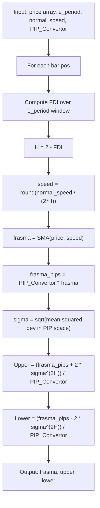

# Fractional Bands

**Mnemonic:** `fctban`  
**Original author:** Jean-Philippe Poton, Copyright 2009  
**Reference MQ4:** `fractional_bands.mq4`  
**Source:** [https://www.mql5.com/en/code/8900](https://www.mql5.com/en/code/8900)  
**Blog:** [http://fractalfinance.blogspot.com/2009/05/fractional-bands.html](http://fractalfinance.blogspot.com/2009/05/fractional-bands.html)

## Overview

Fractional Bands are a variant of Fractal Bands that operates in PIP space and
applies a fractional Brownian motion (FBM) scaling law to the deviation. Instead
of multiplying the standard deviation by $\alpha^H$, this indicator raises the
deviation itself to the power $2H$, which follows directly from the variance
scaling of fractional Brownian motion.

The conversion to PIP space (via `PIP_Convertor`) ensures the exponentiation
operates on meaningful numeric magnitudes, avoiding underflow when prices are
small decimals.

## Mathematical Foundation

### Steps 1--3: FDI, Hurst, and FRASMA

Identical to Fractal Bands:

$$D_f = 1 + \frac{\ln(L) + \ln(2)}{\ln\bigl(2(N-1)\bigr)}$$

$$H = 2 - D_f, \quad \beta = \frac{1}{2H}, \quad \text{speed} = \operatorname{round}\!\bigl(\text{normal\_speed} \cdot \beta\bigr)$$

$$\text{frasma} = \operatorname{SMA}(\text{price},\; \text{speed})$$

### Step 4: PIP-space deviation

Convert the FRASMA to PIP space:

$$\text{frasma}_{\text{pips}} = P \cdot \text{frasma}$$

where $P$ is the PIP convertor (e.g., 10000 for 4-digit pairs).

$$\sigma = \sqrt{\frac{1}{N}\sum_{k=0}^{N-1}\bigl(P \cdot C_k - \text{frasma}_{\text{pips}}\bigr)^2}$$

### Step 5: Fractional bands

$$\text{Upper} = \frac{\text{frasma}_{\text{pips}} + 2\,\sigma^{2H}}{P}$$

$$\text{Lower} = \frac{\text{frasma}_{\text{pips}} - 2\,\sigma^{2H}}{P}$$

### Key formula (from FBM theory)

$$\sigma_{\text{FBM}} = \sigma_{\text{WBM}}^{2H}$$

For $H = 0.5$, $\sigma^{2H} = \sigma^1 = \sigma$, recovering standard
Bollinger-like bands. For persistent series ($H > 0.5$), the exponent $2H > 1$
amplifies deviation; for anti-persistent ($H < 0.5$), it compresses it.

## Configuration Parameters

| Parameter | Type | Default | Description |
|-----------|------|---------|-------------|
| `e_period` | int | 30 | Lookback period for FDI computation |
| `normal_speed` | int | 30 | Base SMA period before fractal adaptation |
| `PIP_Convertor` | int | 10000 | Multiplier to convert price to PIP space |
| `shift` | int | 0 | Bar shift for the indicator buffers |
| `e_type_data` | int | 0 (CLOSE) | Price type: 0=Close, 1=Open, 2=High, 3=Low, 4=Median, 5=Typical, 6=Weighted |

## Algorithm Flow

## Variable Names (from MQ4 source)

| Variable | Description |
|----------|-------------|
| `e_period` | Lookback period $N$ for FDI |
| `normal_speed` | Base SMA speed before fractal scaling |
| `PIP_Convertor` | Price-to-PIP multiplier $P$ |
| `fdi` | Fractal Dimension Index value |
| `hurst` | Hurst exponent $H = 2 - D_f$ |
| `trail_dim` | Trail dimension $1/H$ |
| `beta` | Half of trail dimension |
| `speed` | Adaptive SMA period |
| `frasma` | Fractal Adaptive SMA value |
| `frasma_pips` | FRASMA in PIP space |
| `deviation` | Standard deviation in PIP space |

## References

- Poton, J.-P. (2009). Fractional Bands indicator for MetaTrader 4. MQL5 Code Base #8900.
- Poton, J.-P. (2009). "Fractional Bands." Fractal Finance blog.
- Mandelbrot, B. B., & Van Ness, J. W. (1968). "Fractional Brownian motions, fractional noises and applications." *SIAM Review*, 10(4), 422--437.
