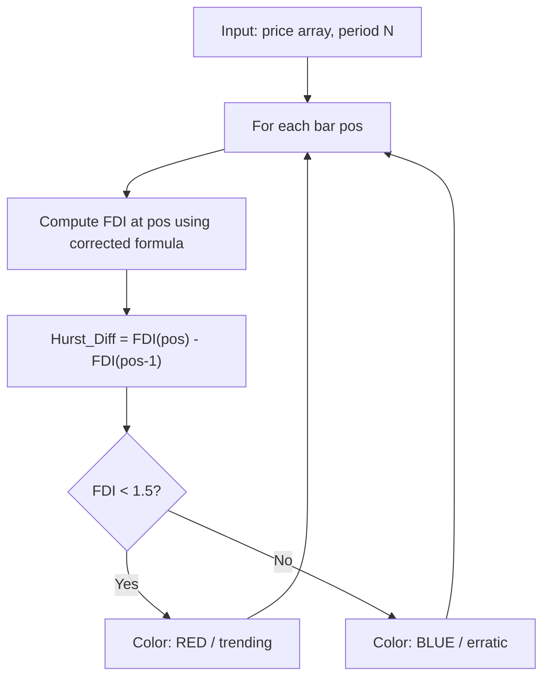

# Hurst Difference

**Mnemonic:** `hurdif`  
**Author:** Jean-Philippe Poton  
**Reference MQ4:** `hurst_difference.mq4`  
**Source:** [https://www.mql5.com/en/code/9676](https://www.mql5.com/en/code/9676)  
**Blog:** [http://fractalfinance.blogspot.com/2010/05/variation-of-hurst-exponent.html](http://fractalfinance.blogspot.com/2010/05/variation-of-hurst-exponent.html)

## Overview

The Hurst Difference indicator computes the first difference (discrete
derivative) of the Fractal Dimension Index over time. It captures how
rapidly the market's fractal character is changing, which relates to
whether volatility is increasing or decreasing.

Displayed in a separate window as an oscillator around zero.

## Mathematical Foundation

### Theoretical basis

The derivative of variance $\sigma$ with respect to time $t$ for a
fractional process with Hurst exponent $H(t)$:

$$\frac{\partial \sigma}{\partial t} = t^{H-1}\left[H + \frac{\partial H}{\partial t} \cdot t \ln(t)\right]$$

Asymptotically, the sign of $\frac{\partial H}{\partial t}$ determines
whether volatility is increasing or decreasing. The Hurst Difference
approximates this derivative using the first difference of FDI.

### Step 1: Compute FDI (corrected formula)

For each bar, using the corrected FGDI formula with $N-1$ segments:

$$D_f = 1 + \frac{\ln(L) + \ln(2)}{\ln\!\big(2(N-1)\big)}$$

### Step 2: First difference

$$\Delta D_f[i] = D_f[i-1] - D_f[i]$$

In the MQ4 source (where higher index = further past):
`Hurst_Diff[pos] = fdi[pos+1] - fdi[pos]`

Translated to Python (index 0 = oldest):
`hurst_diff[pos] = fdi[pos] - fdi[pos - 1]`

This gives positive values when FDI is increasing (volatility rising)
and negative values when FDI is decreasing.

### Interpretation

| Condition | Meaning | Action |
|-----------|---------|--------|
| $\Delta D_f > 0$ | FDI increasing, volatility rising | Potential trade entry |
| $\Delta D_f < 0$ | FDI decreasing, volatility falling | Caution |
| $D_f < 1.5$ | Trending market | Colored RED in MQ4 |
| $D_f \geq 1.5$ | Erratic market | Colored BLUE in MQ4 |

## Configuration Parameters

| Parameter | Type | Default | Valid Range | Description |
|-----------|------|---------|-------------|-------------|
| `f_period` | int | 30 | $\geq 2$ | Lookback period for FDI computation |
| `type_data` | int | 0 (CLOSE) | 0--6 | Price type: 0=Close, 1=Open, 2=High, 3=Low, 4=Median, 5=Typical, 6=Weighted |

## Algorithm Flow

## Variable Names (from MQ4 source)

| Variable | Description |
|----------|-------------|
| `f_period` | Lookback period $N$ |
| `g_period_minus_1` | $N - 1$, loop bound and denominator term |
| `priceMax`, `priceMin` | Max/min price in the lookback window |
| `diff` | Normalized price at current step |
| `priorDiff` | Normalized price at previous step |
| `length` | Cumulative path length $L$ |
| `fdi[]` | Array of computed fractal dimensions |
| `Hurst_Diff[]` | Output buffer: first difference of FDI |
| `InputBuffer` | Intermediate buffer for derived price types |
| `LOG_2` | Precomputed $\ln(2)$ constant |
| `zero_line` | Reference level at 0 |

## References

- Poton, J.-P. (2010). Hurst Difference indicator. MQL5 Code Base #9676.
- Poton, J.-P. (2010). "Variation of the Hurst Exponent." Fractal Finance blog.
- iliko (2007). Fractal Dimension indicator for MetaTrader 4. MQL5 Code Base #7758.
- Mandelbrot, B. B. & Van Ness, J. W. (1968). Fractional Brownian motions, fractional noises and applications. *SIAM Review*, 10(4), 422--437.
