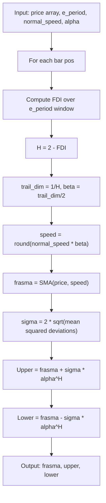

# Fractal Bands

**Mnemonic:** `fban`  
**Original author:** Jean-Philippe Poton, Copyright 2008  
**Reference MQ4:** `fractal_bands.mq4`  
**Source:** [https://www.mql5.com/en/code/8895](https://www.mql5.com/en/code/8895)  
**Blog:** [http://fractalfinance.blogspot.com/2009/05/from-bollinger-to-fractal-bands.html](http://fractalfinance.blogspot.com/2009/05/from-bollinger-to-fractal-bands.html)

## Overview

Fractal Bands replace Bollinger Bands' fixed standard-deviation multiplier with
a scaling law derived from the Hurst exponent. The center line is a FRASMA
(Fractal Adaptive SMA) whose speed adapts to the fractal dimension of the
price, and the band width is modulated by $\alpha^H$ where $H$ is the local
Hurst exponent.

When $H = 0.5$ (random walk), the bands behave like conventional Bollinger
Bands. When $H > 0.5$ (persistent/trending), bands widen; when $H < 0.5$
(anti-persistent/mean-reverting), bands narrow.

## Mathematical Foundation

### Step 1: Fractal Dimension Index (FDI)

Compute the FDI using the corrected path-length formula:

$$D_f = 1 + \frac{\ln(L) + \ln(2)}{\ln\bigl(2(N-1)\bigr)}$$

where $L$ is the normalized path length over $N$ bars and the denominator uses
$\ln(2(N-1))$ instead of $\ln(2N)$.

### Step 2: Hurst exponent and adaptive speed

$$H = 2 - D_f$$

$$d_{\text{trail}} = \frac{1}{H}$$

$$\beta = \frac{d_{\text{trail}}}{2}$$

$$\text{speed} = \operatorname{round}\!\bigl(\text{normal\_speed} \cdot \beta\bigr)$$

### Step 3: FRASMA center line

$$\text{frasma} = \operatorname{SMA}(\text{price},\; \text{speed})$$

### Step 4: Standard deviation

$$\sigma = 2\,\sqrt{\frac{1}{N}\sum_{k=0}^{N-1}\bigl(C_k - \text{frasma}\bigr)^2}$$

where $C_k$ are the close prices in the lookback window (MQ4 indexing: $k=0$
is the current bar, increasing $k$ moves into the past).

### Step 5: Fractal bands

$$\text{Upper} = \text{frasma} + \sigma \cdot \alpha^H$$

$$\text{Lower} = \text{frasma} - \sigma \cdot \alpha^H$$

### Key formula

$$\sigma_{\text{final}} = \sigma_{\text{WBM}} \cdot \alpha^H$$

This replaces the fixed multiplier in Bollinger Bands with a fractal scaling
factor. For standard Brownian motion ($H=0.5$) and $\alpha=2$, the multiplier
is $2^{0.5} \approx 1.414$, recovering approximately the usual 2-sigma bands.

## Configuration Parameters

| Parameter | Type | Default | Range | Description |
|-----------|------|---------|-------|-------------|
| `period` | int | 30 | 2..200 | Lookback period for FDI computation |
| `normal_speed` | int | 20 | 1..200 | Base SMA period before fractal adaptation |
| `alpha` | float | 2.0 | 0.1..10.0 | Band width multiplier (raised to power $H$) |

MQ4-only parameters (not used in conversion):

| Parameter | Type | Default | Description |
|-----------|------|---------|-------------|
| `shift` | int | 0 | Bar shift for the indicator buffers |
| `e_type_data` | int | 0 (CLOSE) | Price type: 0=Close, 1=Open, 2=High, 3=Low, 4=Median, 5=Typical, 6=Weighted |

## Outputs

Returns three arrays of equal length:

| Output | Description |
|--------|-------------|
| `frasma` | Fractal Adaptive SMA center line |
| `upper_band` | Upper volatility band |
| `lower_band` | Lower volatility band |

## Test Parameter Combinations (8 total)

| # | period | normal_speed | alpha | Varies |
|---|--------|-------------|-------|--------|
| 1 | 10 | 20 | 2.0 | period |
| 2 | 20 | 20 | 2.0 | period |
| 3 | 30 | 20 | 2.0 | period (default) |
| 4 | 50 | 20 | 2.0 | period |
| 5 | 30 | 10 | 2.0 | normal_speed |
| 6 | 30 | 40 | 2.0 | normal_speed |
| 7 | 30 | 20 | 1.0 | alpha |
| 8 | 30 | 20 | 3.0 | alpha |

## Algorithm Flow

## Variable Names (from MQ4 source)

| Variable | Description |
|----------|-------------|
| `e_period` | Lookback period $N$ for FDI |
| `normal_speed` | Base SMA speed before fractal scaling |
| `alpha` | Band width scaling base |
| `fdi` | Fractal Dimension Index value |
| `hurst` | Hurst exponent $H = 2 - D_f$ |
| `trail_dim` | Trail dimension $1/H$ |
| `beta` | Half of trail dimension |
| `speed` | Adaptive SMA period |
| `frasma` | Fractal Adaptive SMA value |
| `deviation` | Scaled standard deviation $\sigma$ |

## References

- Poton, J.-P. (2008). Fractal Bands indicator for MetaTrader 4. MQL5 Code Base #8895.
- Poton, J.-P. (2009). "From Bollinger to Fractal Bands." Fractal Finance blog.
- Mandelbrot, B. B., & Van Ness, J. W. (1968). "Fractional Brownian motions, fractional noises and applications." *SIAM Review*, 10(4), 422--437.
- Hurst, H. E. (1951). "Long-term storage capacity of reservoirs." *Transactions of the ASCE*, 116, 770--808.
