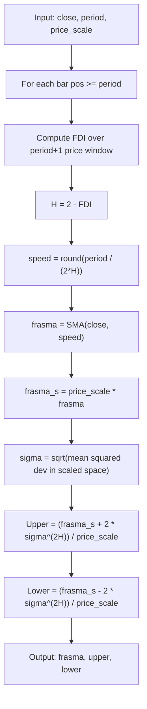

# Fractional Bands

**Mnemonic:** `fctban`  
**Original author:** Jean-Philippe Poton, Copyright 2009  
**Reference MQ4:** `fractional_bands.mq4`  
**Source:** [https://www.mql5.com/en/code/8900](https://www.mql5.com/en/code/8900)  
**Blog:** [http://fractalfinance.blogspot.com/2009/05/fractional-bands.html](http://fractalfinance.blogspot.com/2009/05/fractional-bands.html)

## Overview

Fractional Bands are a variant of Fractal Bands that operates in a scaled price
space and applies a fractional Brownian motion (FBM) scaling law to the
deviation. Instead of multiplying the standard deviation by $\alpha^H$, this
indicator raises the deviation itself to the power $2H$, which follows directly
from the variance scaling of fractional Brownian motion.

The `price_scale` parameter converts prices into a working numeric space so that
the exponentiation operates on meaningful magnitudes, avoiding underflow when
prices are small decimals.

## Parameter Rename: `PIP_Convertor` to `price_scale`

The original MQ4 parameter `PIP_Convertor` (default 10000) was renamed to
`price_scale` with a default of **1.0** for the following reasons:

1. **Generality.** The original name and default assumed 4-digit FX pairs.
   The indicator applies equally to equities, commodities, indices, and crypto
   where a pip-based scale factor is meaningless.
2. **Neutrality.** A default of 1.0 leaves prices unscaled, producing correct
   results for any instrument without requiring the caller to know the tick
   size convention. Users who need the original FX behaviour can pass
   `price_scale=10000.0`.
3. **Clarity.** The name `price_scale` describes the parameter's mathematical
   role (a multiplicative scale factor) rather than tying it to a specific
   market convention.

The original MQ4 `normal_speed` parameter was also removed; in the MQ4 source
it always equalled `e_period`, so the conversion uses `period` for both the FDI
window and the base SMA speed.

## Mathematical Foundation

### Steps 1--3: FDI, Hurst, and FRASMA

$$D_f = 1 + \frac{\ln(L) + \ln(2)}{\ln\bigl(2(N-1)\bigr)}$$

where $L$ is the normalised path length over $N-1$ segments in a window of
$N+1$ price points (indices $\text{pos}-N$ through $\text{pos}$).

$$H = 2 - D_f, \quad \beta = \frac{1}{2H}, \quad \text{speed} = \operatorname{round}\!\bigl(N \cdot \beta\bigr)$$

$$\text{frasma} = \operatorname{SMA}(\text{close},\; \text{speed})$$

### Step 4: Scaled-space deviation

$$\text{frasma}_s = S \cdot \text{frasma}$$

where $S$ is `price_scale`.

$$\sigma = \sqrt{\frac{1}{N}\sum_{k=0}^{N-1}\bigl(S \cdot C_k - \text{frasma}_s\bigr)^2}$$

### Step 5: Fractional bands

$$\text{Upper} = \frac{\text{frasma}_s + 2\,\sigma^{2H}}{S}$$

$$\text{Lower} = \frac{\text{frasma}_s - 2\,\sigma^{2H}}{S}$$

### Key formula (from FBM theory)

$$\sigma_{\text{FBM}} = \sigma_{\text{WBM}}^{2H}$$

For $H = 0.5$, $\sigma^{2H} = \sigma^1 = \sigma$, recovering standard
Bollinger-like bands. For persistent series ($H > 0.5$), the exponent $2H > 1$
amplifies deviation; for anti-persistent ($H < 0.5$), it compresses it.

## Configuration Parameters

| Parameter | Type | Default | Range | Description |
|-----------|------|---------|-------|-------------|
| `close` | list[float] | -- | len >= period+1 | Close prices, index 0 = oldest |
| `period` | int | 30 | 2..500 | Lookback period for FDI and base SMA speed |
| `price_scale` | float | 1.0 | > 0 | Multiplicative scale factor for deviation space |

## Algorithm Flow

## Variable Names

| Variable | Description |
|----------|-------------|
| `period` | Lookback period $N$ for FDI (replaces MQ4 `e_period` and `normal_speed`) |
| `price_scale` | Price-to-scaled-space multiplier $S$ (replaces MQ4 `PIP_Convertor`) |
| `fdi` | Fractal Dimension Index value |
| `hurst` | Hurst exponent $H = 2 - D_f$ |
| `trail_dim` | Trail dimension $1/H$ |
| `beta` | Half of trail dimension |
| `speed` | Adaptive SMA period |
| `frasma` | Fractal Adaptive SMA value |
| `frasma_scaled` | FRASMA in scaled space |
| `deviation` | Standard deviation in scaled space |

## References

- Poton, J.-P. (2009). Fractional Bands indicator for MetaTrader 4. MQL5 Code Base #8900.
- Poton, J.-P. (2009). "Fractional Bands." Fractal Finance blog.
- Mandelbrot, B. B., & Van Ness, J. W. (1968). "Fractional Brownian motions, fractional noises and applications." *SIAM Review*, 10(4), 422--437.
