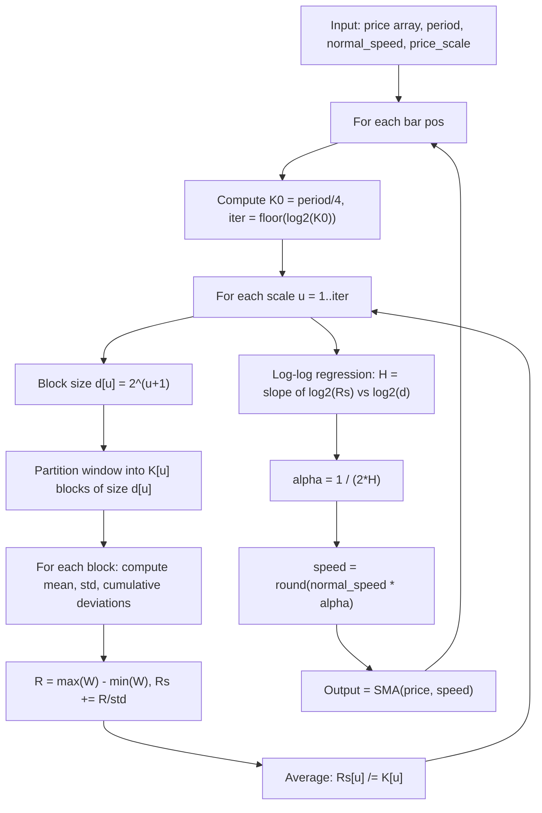

# Rescaled Fractal Adaptive Simple Moving Average (RS-FRASMA)

**Mnemonic:** `rsfrasma`  
**Author:** Jean-Philippe Poton (jppoton@yahoo.com), v1.0 October 2009  
**Reference MQ4:** `rescaled_fractal_adamtive_simple_moving_average.mq4`  
**Source:** [https://www.mql5.com/ru/code/9272](https://www.mql5.com/ru/code/9272)  
**Blog:** [http://fractalfinance.blogspot.com/2009/10/rescaled-range-analysis.html](http://fractalfinance.blogspot.com/2009/10/rescaled-range-analysis.html)

## Overview

RS-FRASMA is a fractal adaptive moving average similar to FRASMA, but estimates
the Hurst exponent via Rescaled Range (R/S) analysis instead of the graph
dimension method. The R/S-derived Hurst exponent is used to adapt the period of
a Simple Moving Average.

- In a **trending** market ($H > 0.5$), the SMA speeds up (shorter period).
- In a **random** market ($H = 0.5$), the SMA period equals `normal_speed`.
- In an **erratic** market ($H < 0.5$), the SMA slows down (longer period).

**Warning:** R/S analysis is computationally expensive. Keep `period` $\leq 256$.

## Mathematical Foundation

### Rescaled Range (R/S) Analysis

The R/S statistic scales as a power law with block size $n$:

$$E[R/S(n)] = C \cdot n^H \quad \text{as } n \to \infty$$

where $H$ is the Hurst exponent.

### Step 1: Partition into blocks

Given a window of `period` prices (must be a power of 2), compute:

$$K_0 = \left\lfloor \frac{\text{period}}{4} \right\rfloor, \qquad \text{iter} = \left\lfloor \frac{\ln K_0}{\ln 2} \right\rfloor$$

For each scale $u$ from 1 to iter:

$$d_u = 2^{u+1}, \qquad K_u = \left\lfloor \frac{\text{period}}{d_u} \right\rfloor$$

### Step 2: Compute R/S for each block

For each block $i$ of size $d_u$:

1. Block mean: $\mu = \frac{1}{d_u} \sum_{j=1}^{d_u} x_j$
2. Block standard deviation: $s = \sqrt{\frac{1}{d_u} \sum_{j=1}^{d_u} (x_j - \mu)^2}$
3. Cumulative deviations: $W_k = \sum_{z=1}^{k} (x_z - \mu)$ for $k = 1, \ldots, d_u$
4. Range: $R = \max(W) - \min(W)$
5. Rescaled range for block: $R/S = R / s$

Average over all $K_u$ blocks:

$$\overline{R/S}_u = \frac{1}{K_u} \sum_{i=1}^{K_u} (R/S)_i$$

### Step 3: Log-log regression for Hurst exponent

Perform linear regression of $\log_2(\overline{R/S}_u)$ vs $\log_2(d_u)$:

$$H = \frac{n \sum x_i y_i - \sum x_i \sum y_i}{n \sum x_i^2 - (\sum x_i)^2}$$

where $x_i = \log_2(d_i)$ and $y_i = \log_2(\overline{R/S}_i)$.

### Step 4: Adaptive speed

$$\alpha = \frac{1}{2H}$$

$$\text{speed} = \text{round}(\text{normal\_speed} \times \alpha)$$

### Step 5: Output

$$\text{RS-FRASMA}[i] = \text{SMA}(\text{price}, \text{speed})[i]$$

### Key Insight

| Regime | $H$ | $\alpha$ | Effect |
|--------|-----|----------|--------|
| Trending | $> 0.5$ | $< 1$ | MA speeds up (shorter period) |
| Random | $= 0.5$ | $= 1$ | MA unchanged |
| Erratic | $< 0.5$ | $> 1$ | MA slows down (longer period) |

## Configuration Parameters

| Parameter | Type | Default | Valid Range | Description |
|-----------|------|---------|-------------|-------------|
| `period` | int | 64 | Power of 2, $\geq 4$ | Lookback for R/S analysis |
| `normal_speed` | int | 30 | $\geq 1$ | Base SMA period before adaptation |
| `price_scale` | float | 1.0 | $> 0$ | Multiplier applied to prices before R/S calculation (originally `PIP_Convertor`). Note: R/S analysis is scale-invariant, so this parameter does not affect the output. |

## Algorithm Flow

## Variable Names (from MQ4 source)

| Variable | Description |
|----------|-------------|
| `period` | Lookback window size (power of 2) |
| `normal_speed` | Base SMA period |
| `price_scale` | Price multiplier (scale-invariant, does not affect output) |
| `K0` | $\lfloor \text{period}/4 \rfloor$ |
| `iter` | Number of subdivision scales |
| `d[i]` | Block size at scale $i$: $2^{i+1}$ |
| `K[i]` | Number of blocks at scale $i$ |
| `mu` | Block mean |
| `std` | Block standard deviation |
| `W[i,k]` | Cumulative deviation at position $k$ in block |
| `R[l]` | Range of cumulative deviations for block $l$ |
| `Rst[l]` | Rescaled range $R/s$ for block $l$ |
| `Rs[i]` | Average rescaled range at scale $i$ |
| `sumx`, `sumy`, `sumx2`, `sumxy` | Accumulators for log-log regression |
| `H` | Hurst exponent (regression slope) |
| `alpha` | Scaling factor $1/(2H)$ |
| `speed` | Adapted SMA period |
| `ExtOutputBuffer` | Output buffer (the adaptive SMA line) |

## References

- Poton, J.-P. (2009). Rescaled Fractal Adaptive Simple Moving Average. MQL5 Code Base #9272.
- Poton, J.-P. (2009). "Rescaled Range Analysis." Fractal Finance blog.
- Hurst, H. E. (1951). "Long-term storage capacity of reservoirs." *Transactions of the American Society of Civil Engineers*, 116, 770--808.
- Mandelbrot, B. B., & Wallis, J. R. (1969). "Robustness of the rescaled range R/S in the measurement of noncyclic long run statistical dependence." *Water Resources Research*, 5(5), 967--988.
- Mandelbrot, B. B. (1997). *Fractals and Scaling in Finance*. Springer.
