# Understanding Cycles

- **Author:** John F. Ehlers
- **Publication:** Technical Analysis of STOCKS & COMMODITIES, Volume 3, Number 7, pp. 242--246
- **Article URL:** [Article PDF](https://technical.traders.com/archive/article.asp?file=\V03\C07\UND.PDF)

---

## Introduction

The first thing we must recognize is that cycle analysis doesn't always work for profitable investment strategy. This is no great surprise, because cycles must be present in the data history for any analysis of them to be valid. Also, to be useful, we must assume that the cycles in the history will extend into the future so that a prediction can be made. This is sometimes impossible because of fundamental issues. For example, a freeze in Florida will probably swamp any technical factors on orange juice futures. Even within these constraints for technical analysis, cycles can still be difficult.

This is the first of a series of articles on cycle analysis. In this article, we will go back to basics and briefly review cycle theory to have a common basis for definitions. The program listing in the panel gives an ideal trading system for a perfectly cyclically varying price. More importantly, the program is interactive to show the impact of dominant cycle resolution and spectral purity on the accuracy of the trading system. In future articles, we will show how some of the traditional trading indicators can be optimized through the use of cycle analysis.

If you stop and think about it, you might ask "Why did Welles Wilder use 14 days in his RSI? Is there a better period to use?" It turns out that the best period to use is related to the dominant cycle of the data history. Future articles will have discussions and program listings for the Relative Strength Indicator (RSI), Daily Trend Indicator (DTI) and Commodity Channel Indicator (CCI).

After studying this article you should be able to recognize when cycles are present, how to estimate the dominant cycle without extensive analysis, and whether there is sufficient spectral purity to make cycle analysis useful.

## Cycle Basics

A cycle is a variation where a point of observation returns to its origin. For example, the locus of a point on an engine flywheel is a circle as the flywheel turns. Each rotation completes a cycle. If the engine turns at 600 rpm, its frequency is ten cycles per second (60 seconds per minute). The period of each cycle is the reciprocal of the frequency, or 0.1 seconds.

The position of the point at any distance of time is the phase of the cycle. There are 360 degrees of phase per cycle, just the same as the degrees around the wheel. If we define the horizontal position of the point to the right of center as zero degrees and allow the wheel to rotate counter-clockwise a quarter of a cycle to the vertical position, the point is then at 90 degrees in the cycle. Continuing on another quarter cycle to the opposite position, we reach 180 degrees in the cycle. Another quarter cycle at the lowest point is 270 degrees, and the final quarter brings us back to the starting point.

Sine waves are often used to describe the waves arising from oscillations. If we put a ball-point pen on a clock pendulum and moved chart paper vertically behind the clock, the pen would draw a sine wave. Another way to conceive a sine wave is the projection of light on the vertical axis from our spot on the flywheel. At zero degrees, the spot is at zero elevation. Then, as the wheel turns counter-clockwise, the magnitude increases until it reaches its maximum at 90 degrees. Continuing through the cycle the amplitude decreases to reach zero at 180 degrees, reaches its maximum negative value at 270 degrees, and then increases back to zero at the starting position.

A cosine wave has its maximum at zero degrees. It can be pictured as a spot on our wheel a quarter cycle counter-clockwise from the sine wave point. The projection from this new point portrays a cosine wave. So we see that a cosine wave behaves exactly like a sine wave except that it is 90 degrees out of phase. For those of you familiar with calculus, you will recall that the integral of a sine is a (negative) cosine. We will discover this in our perfect trading system.

Sines and cosines are "orthogonal" functions used to describe waves because their combinations (both at the same frequency) can completely describe the amplitude and phase of a wave. These are the components used for Fourier Analysis of waves. There are many other orthogonal functions used to describe waves. For example, LaGuerre Polynomials and Walsh Functions are used for specialized applications. Sine waves may not be the best tool for investment-type waves, but they certainly are the easiest to understand.

Now, let's examine what happens to sine waves when we use a moving average. Draw several cycles of a sine wave on a piece of paper. We take a moving average with the exact period of the sine wave (Figure 1). This is our moving average "window." When we put our window over the sine wave (window A), we find there are as many points above zero as below. This is true no matter where (such as window B) we place our window along the time base, and therefore the moving average taken over a full cycle is exactly zero. (Note that the moving average value is not centered in the window, but at the window's right edge.) If the cycle were superimposed on a trendline (Figure 2), the full cycle moving average would produce the trendline.

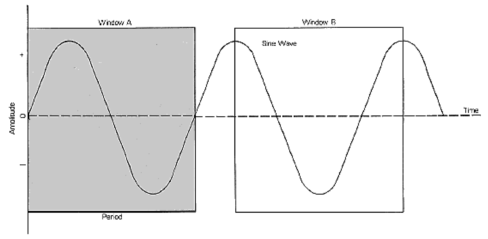

**FIGURE 1.** A moving average taken over a full cycle of the sine wave is exactly zero regardless of window position.

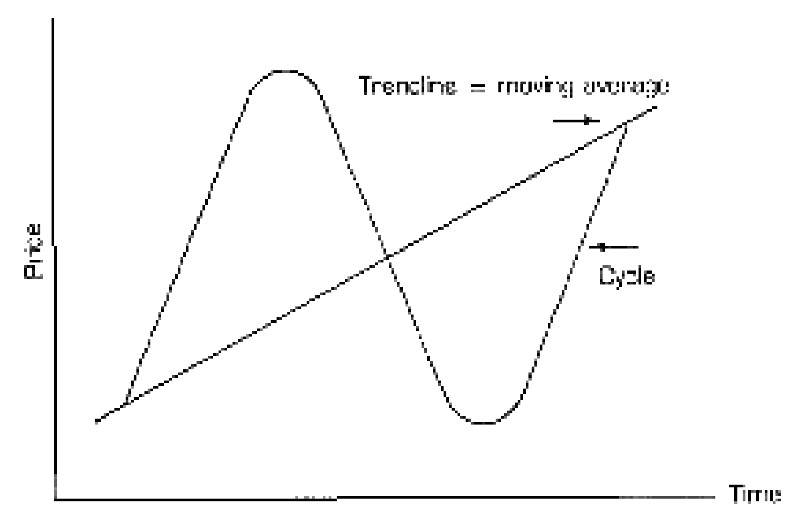

**FIGURE 2.** If the cycle is superimposed on a trendline, the full cycle moving average produces the trendline.

Let's also examine the special case where the moving average window is half the period of the cycle (Figure 3). We'll start by positioning this window (window A) over the positive portion of our sine wave so that all the positive values are encompassed. If we move the window either right or left, the moving average has a maximum value at the exact point where the original wave crosses through zero from positive to negative values.

If we move this window a quarter cycle to the right (window B), we see that there are as many positive points as negative points so that the value of the moving average is zero. This occurs when the sine wave is at its most negative value. Continuing, we find that a moving average taken over half the period of the sine wave is another sine wave delayed by 90 degrees, or a cosine wave.

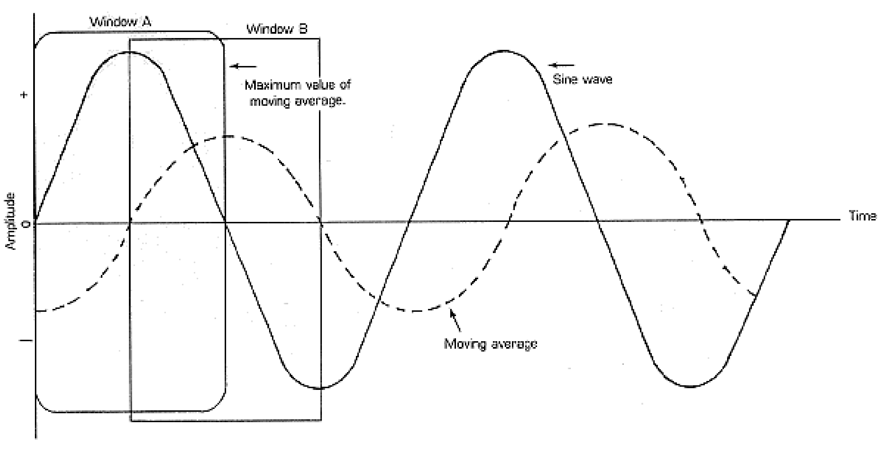

**FIGURE 3.** A moving average taken over half the period of the sine wave produces a cosine wave (90 degree lag).

The relationship of these moving averages to the sine wave cycle suggests a way to create a trading system.

> "A cycle is a variation where a point of observation returns to its origin."

## Perfect Trading System (in an ideal world)

The easiest way to see our trading system is to input the program in the listing. At line 90 our function is a pure sine wave. It has a period of 80 units because at line 80, when the variable reaches 80, the angle F will exactly reach $2\pi$ (360 degrees). Line 110 sets the initial condition and the half cycle moving average is calculated in line 120. In the same way, the initial condition is set at line 130 and the moving average over the dominant cycle is computed at line 140. The remaining code is for plotting with the trading signals being computed at lines 200 and 210. The program will recycle by pressing any key ("G" on an IBM). You must interrupt the program to stop it.

Let's run it. Input 80 when asked for the dominant cycle. A perfect trading system, just as advertised. SELL signals are given at the exact peaks and BUY signals are given at the exact valleys when the moving average crosses the horizontal trendline, just as shown in Figure 4. The dominant cycle moving average is the trendline (the horizontal line) and our trading signal is generated each time the half dominant cycle moving average crosses the full dominant cycle moving average.

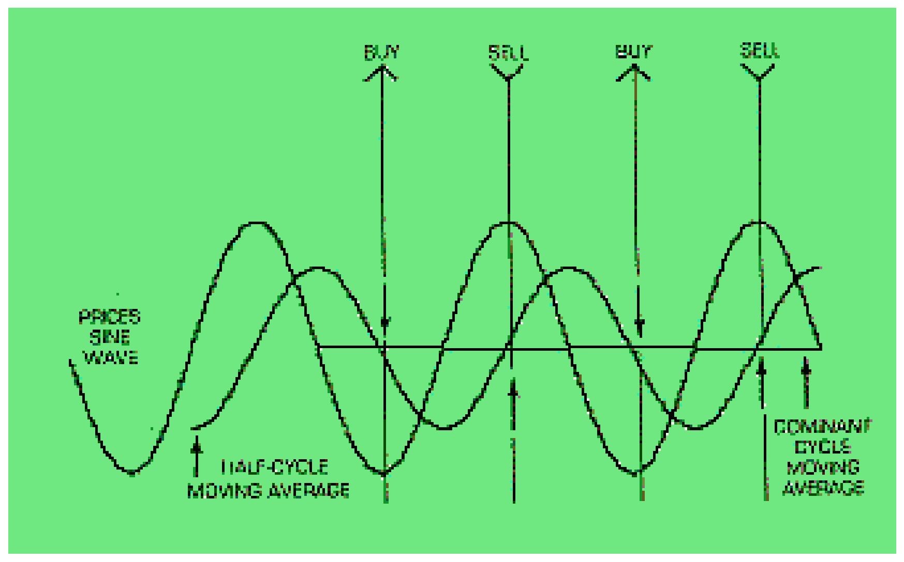

**FIGURE 4.** Perfect trading signals when the dominant cycle is known exactly. BUY at valleys, SELL at peaks.

To see the effects of the trendline, we can super-impose a trendline in our function by changing line 90 to be:

```basic
90 F(I) = 40 + .4*I + M*SIN(F)
```

We still have our perfect trading system. Life should be so easy! There are two clinkers that destroy this simple trading model (See Figure 5). The first is the accuracy of our estimate of the dominant cycle, and the second is the spectral purity (cycle content) of our price function.

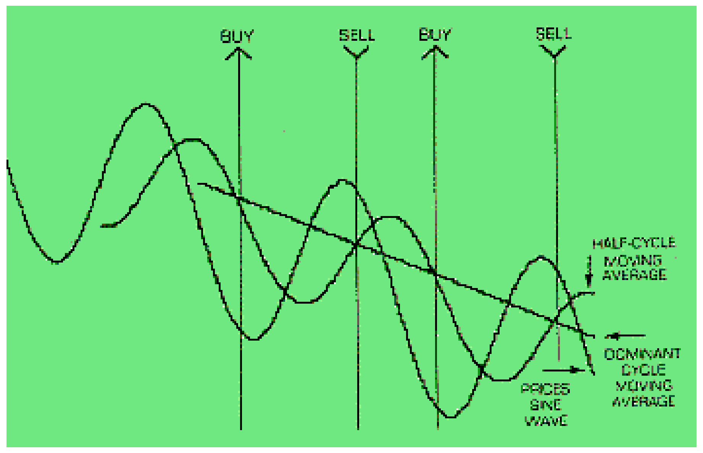

**FIGURE 5.** Trades are signaled when the half-cycle moving average crosses the dominant cycle moving average.

## Frequency Resolution

Since we knew the exact period of our function, we were able to input the correct value to calculate the moving averages. What happens if we were wrong in our estimate? Suppose we were off by a factor of two (Figure 6), and input 40 for the dominant cycle (using the original line 90). Now, the trading system is hardly recognizable because the trendline has a big cyclic variation. What's worse is that the trading signals are given very early and we would be killed by bumping into our stops.

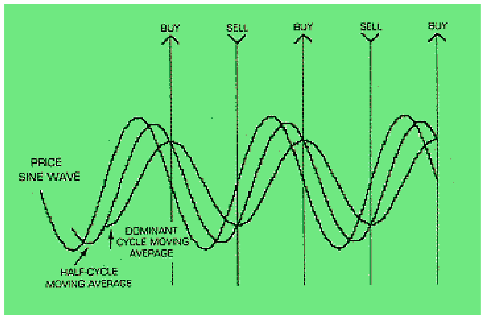

**FIGURE 6.** When the dominant cycle is underestimated by 50%, the trendline has large cyclic variation and signals are premature.

Now, let's go the other way and estimate 100 for the dominant cycle, a 25 percent error (Figure 7). In this case the buy and sell signals are very late, and the exit points would have to be expertly selected to realize a profit.

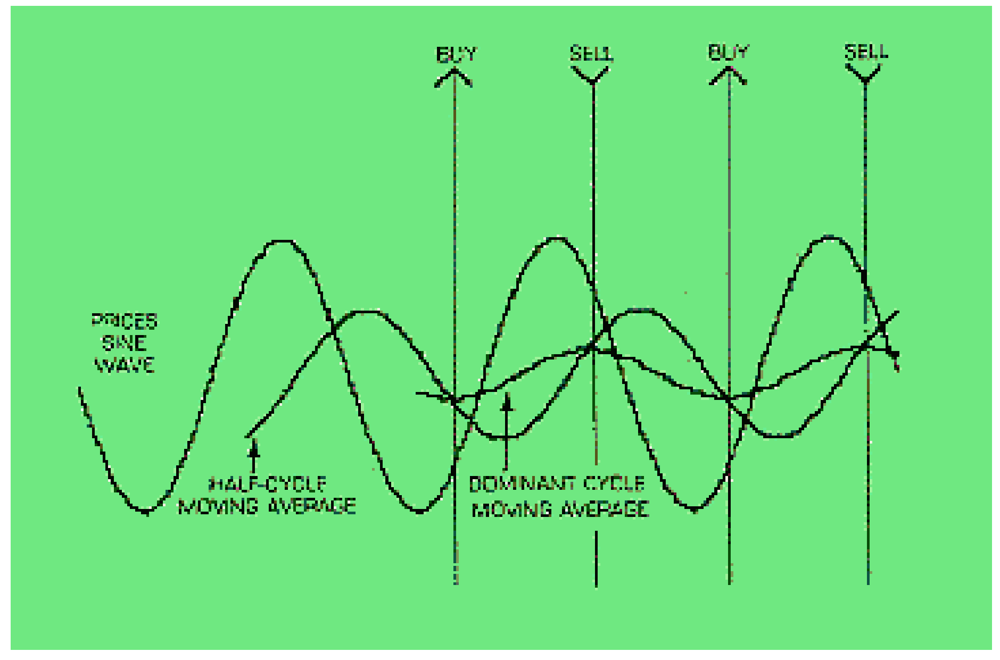

**FIGURE 7.** When the dominant cycle is overestimated by 25%, signals are late.

How can we make a better estimate of the dominant cycle? The key lies in observing how the trendline varies. Let's make a small 19 percent error by inputting 88 for the dominant cycle (Figure 8). This isn't too bad; the indicators are just a little late. Note that the trendline wiggles almost in phase (highs match highs and lows match lows) with the original function.

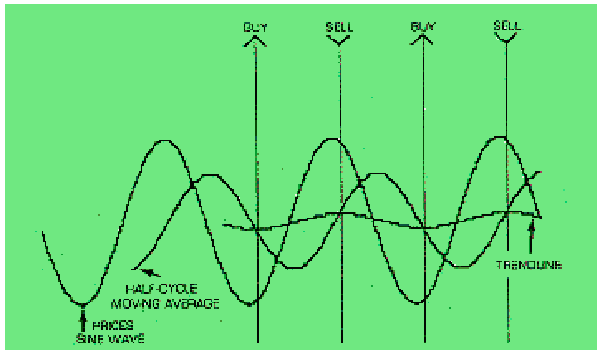

**FIGURE 8.** The "Trendline" is the dominant cycle moving average. Here the trendline is nearly in phase with the price's sine wave.

Now let's make a ten percent error the other way by inputting 72 for the dominant cycle. When we underestimate the length of the dominant cycle, the trendline wiggles nearly out of phase (Figure 9) with the original function. That is, lows match highs and highs match lows.

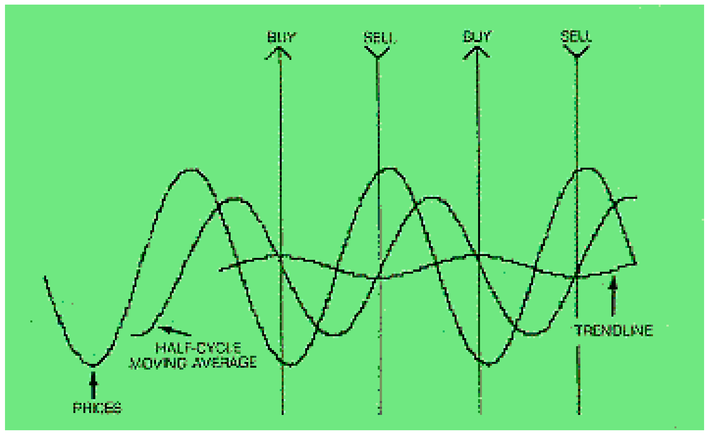

**FIGURE 9.** Here the trendline is nearly out of phase with the price's sine wave.

This gives us a way to estimate the dominant cycle without analysis. We simply iterate the moving average until the trendline has the least amount of wiggles around the point where the wiggles are in phase and out of phase with the price function. If this is successful (and if the cycle continues), the trading system will perform well.

Frequency resolution or accuracy is one reason why double moving average trading systems sometimes perform beautifully and sometimes perform abysmally. Another reason is that the wave shape is usually not a pure sine wave.

## Spectral Purity

The Fourier Theory of waves asserts that any continuous repetitive wave shape can be described in terms of a series of sine waves no matter how complex the wave form may be. The purpose of the Fourier analysis is to find the relative magnitude and phases of these harmonics. There are several ways to do this. Fast Fourier transformations are one method. In my judgment, the Maximum Entropy Method is superior for trading analysis because the relevance to current data through the use of a short database is crucial. Analysis tools are nice, but since we want to find the effects of wave shapes on our trading model, let's work backwards and synthesize a wave shape from its harmonic components.

A sawtooth wave shape (Figure 10) is theoretically one in which all harmonics are in phase with the amplitude of each harmonic inversely proportional to its harmonic number. We can get a reasonable approximation to a sawtooth wave shape if we change line 90 to:

```basic
90 F(I) = 90 + M*SIN(F) + (M/2)*SIN(2*F) + (M/3)*SIN(3*F) + (M/4)*SIN(4*F)
```

Store the whole program under a new program name and then let's run it. When we input 80 for the dominant cycle we now find that our BUY signal is too late and our SELL signal is too early even though we know the dominant cycle exactly. The problem gets worse when we input a frequency error. Our problem has arisen due to the spectrum content of the original function. There is very little to do about this except not to use the trading system on complex wave forms.

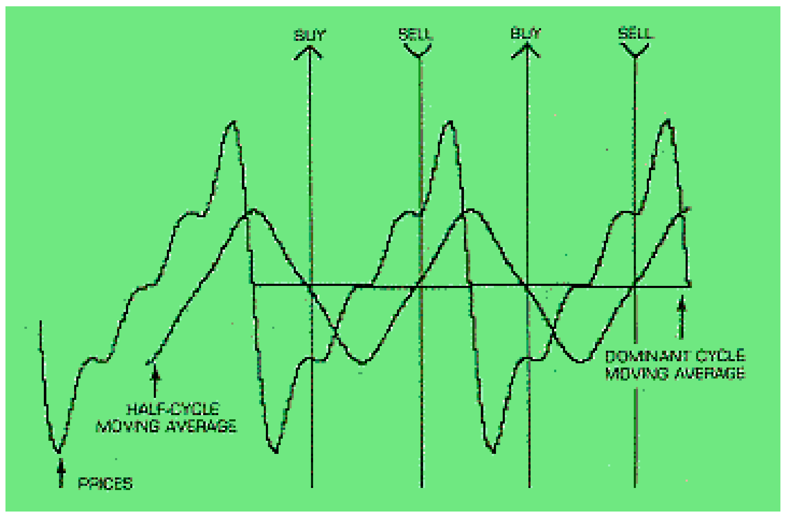

**FIGURE 10.** A sawtooth-shaped price function with harmonics causes timing errors even with the correct dominant cycle estimate.

Now the question is, "What constitutes a complex wave form?" The answer is bound to be muddy, but let's experiment a little with line 90. If we delete only the second harmonic term (the one at half magnitude), we find (Figure 11) that the trading signals are not all that bad if we use enough stops. On the basis of this and other experiments, I conclude that the trading systems should not be used when there are frequency components in the spectrum that are less than ten dB below the dominant cycle. Ten dB is about one-third amplitude. Unfortunately, the spectral content of the wave form can be obtained only by judging its smoothness relative to a sine wave by eyeball or through a spectrum analysis program such as MEM or MESA. The eyeball test can often be misleading and I recommend the use of one of the analysis programs.

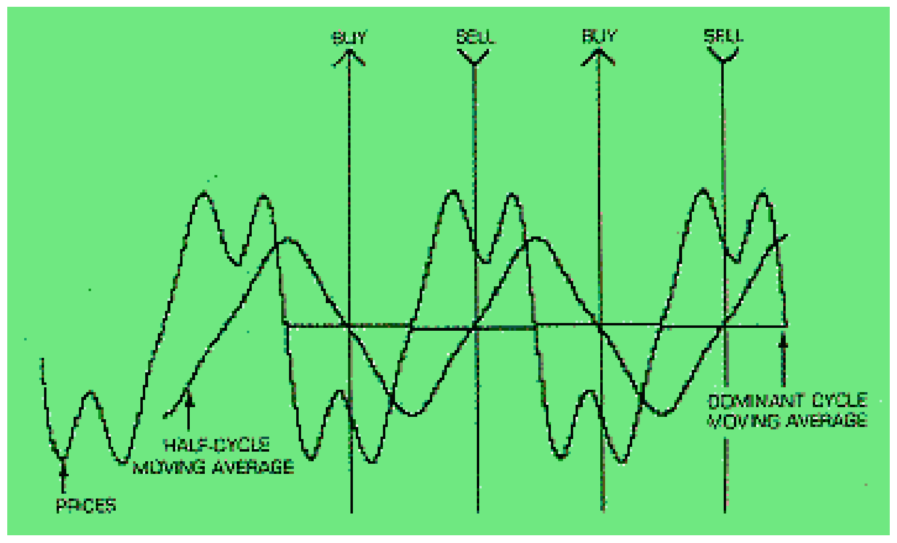

**FIGURE 11.** With the second harmonic removed (all components more than 10 dB below dominant), trading signals improve.

## Conclusion

Cycle analysis certainly doesn't work all the time. You can't fight fundamental events and force a cycle approach when there simply isn't any cycle content. Cycle analysis can be profitable using the double moving average where the averaging periods are the dominant cycle and the half dominant cycle. Even so, the dominant cycle can be accurately estimated by iteratively varying the longer moving average to minimize the wiggles around a point where a phase reversal is obtained. Spectral purity is best determined by a specialized computer analysis program.

---

**Appendix:** Spectral purity refers to how perfect a cycle is present in the data. In this example, a perfect cycle is present because we put it there. The frequency "spectrum" is sharp and clear ("pure") because the perfect cycle has only one frequency.

*John F. Ehlers is an electrical engineer working in electronic research and development and has been a private trader for about ten years. He discovered the maximum entropy method in his work and is a pioneer in introducing it to trading analysis by writing the MESA computer program. He has written a variety of other programs to optimize technical analysis methods with the aid of cycles. For relaxation, Ehlers is interested in archery and has invented a new type of bow.*

## Cycle Plot Program Listing

```basic
1   REM "Cycle Plot Program"
2   REM FOR APPLE ][ COMPUTER.
3   REM BY JOHN F. EHLERS
4   REM COPYRIGHT (C) 1985 BY TECHNICAL ANALYSIS, INC.
10  TEXT : HOME
20  DIM F(240), A(240), TL(240)
30  VTAB 10: INPUT "DOMINANT CYCLE ";DC
40  LET HC = DC / 2
50  LET PI = 3.14159
60  LET M = 40
70  FOR I = 0 TO 240
80  LET F = 2 * PI * I / 80
90  LET F(I) = 90 + M * SIN(F) + (M/2) * SIN(2*F) + (M/3) * SIN(3*F) + (M/4) * SIN(4*F)
100 NEXT I
110 FOR I = 1 TO HC: LET A(HC) = A(HC) + F(I) / HC: NEXT I
120 FOR I = HC + 1 TO 240: LET A(I) = A(I - 1) + (F(I) - F(I - HC)) / HC: NEXT I
130 FOR I = 1 TO DC: LET TL(DC) = TL(DC) + F(I) / DC: NEXT I
140 FOR I = DC + 1 TO 240: LET TL(I) = TL(I - 1) + (F(I) - F(I - DC)) / DC: NEXT I
150 HGR : HCOLOR= 3
160 FOR I = 2 TO 240: HPLOT I - 1,F(I - 1) TO I,F(I): NEXT I
170 FOR I = HC + 1 TO 240: HPLOT I - 1,A(I - 1) TO I,A(I): NEXT I
180 FOR I = DC + 1 TO 240: HPLOT I - 1,TL(I - 1) TO I,TL(I): NEXT I
190 FOR I = DC + 1 TO 240
200 IF A(I - 1) < TL(I - 1) AND A(I) >= TL(I) THEN HPLOT I - 5,5 TO I,0: HPLOT I,0 TO I + 5,5
210 IF A(I - 1) > TL(I - 1) AND A(I) <= TL(I) THEN HPLOT I - 5,0 TO I,5: HPLOT I,5 TO I + 5,0
220 NEXT I
230 POKE 49168,0: GET S$
240 TEXT : HOME
250 VTAB 10: INPUT "PRINT SCREEN WITH YOUR GRAPPLER+ CARD? 1:YES 2:NO ";YN
260 IF YN = 1 THEN PRINT CHR$(4) + "PR#1": PRINT CHR$(9) + "GD": PRINT CHR$(4) + "PR#0"
270 CLEAR : GOTO 10
```

---

## BibTeX

```bibtex
@article{ehlers_1985_understanding_cycles,
  author    = {John F. Ehlers},
  title     = {Understanding Cycles},
  journal   = {Technical Analysis of STOCKS \& COMMODITIES},
  volume    = {3},
  number    = {7},
  pages     = {242--246},
  year      = {1985},
  url       = {https://technical.traders.com/archive/article.asp?file=\V03\C07\UND.PDF}
}
```
