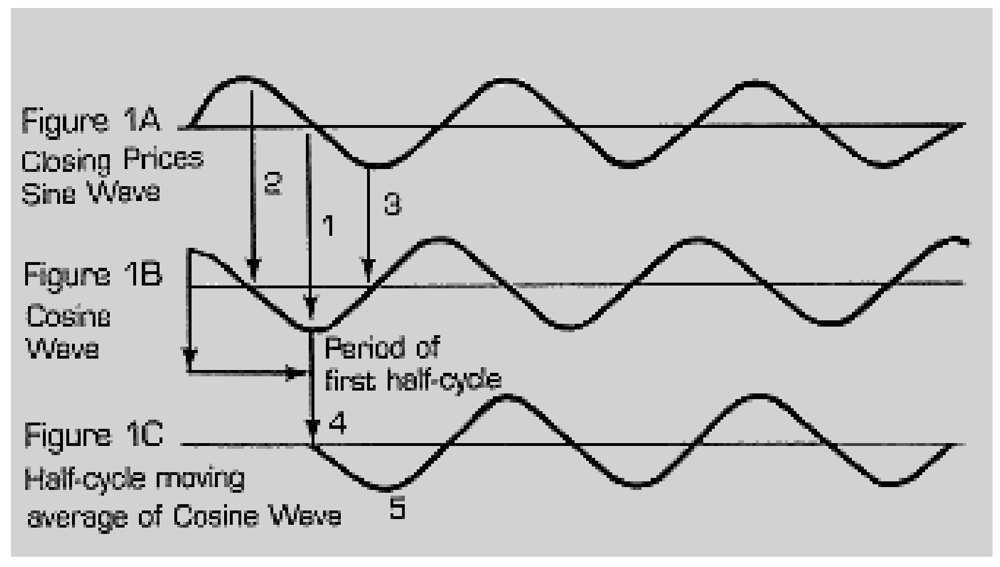
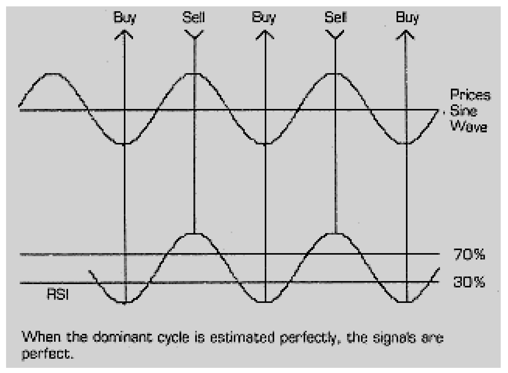
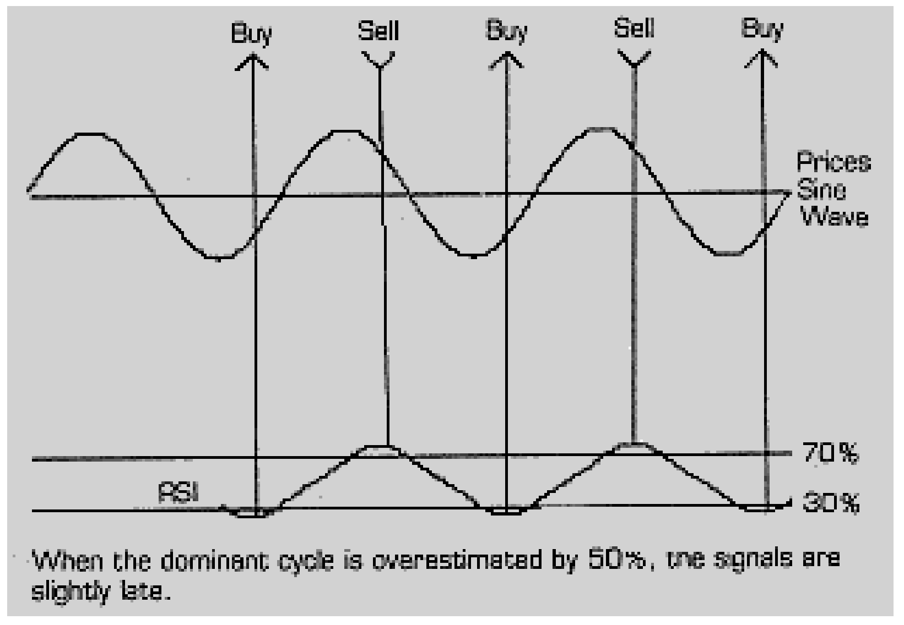
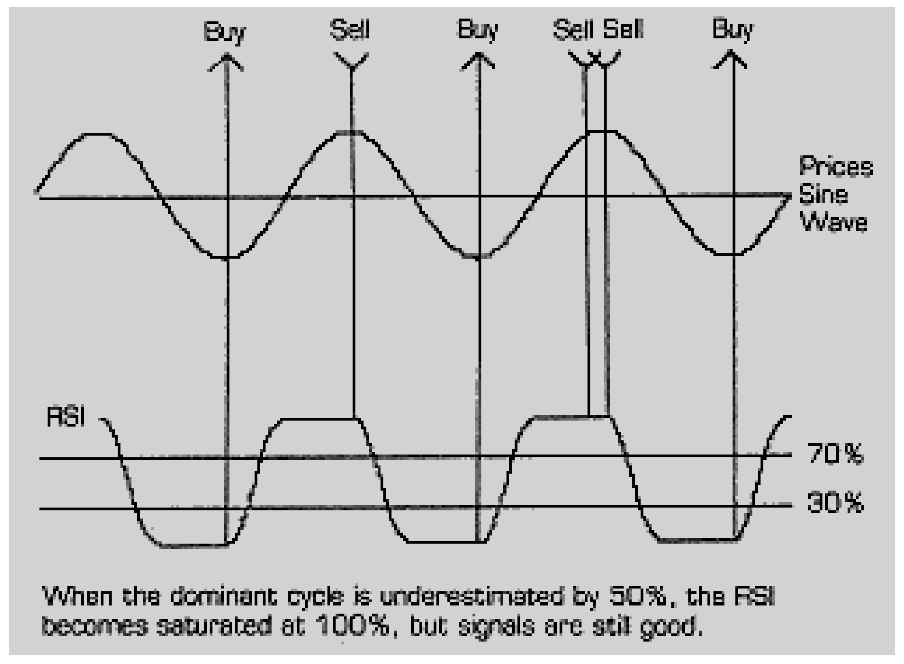
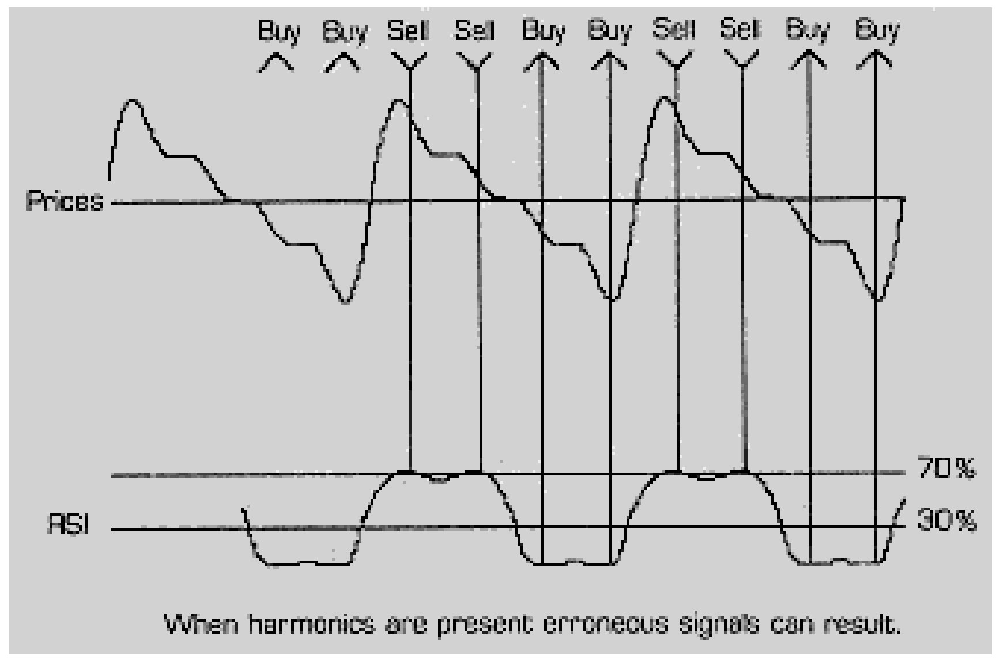
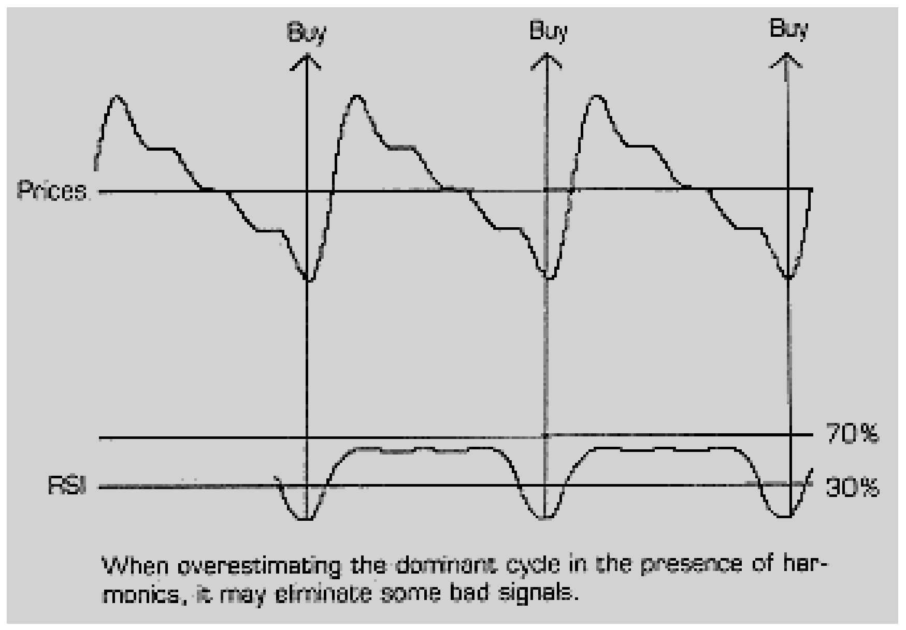
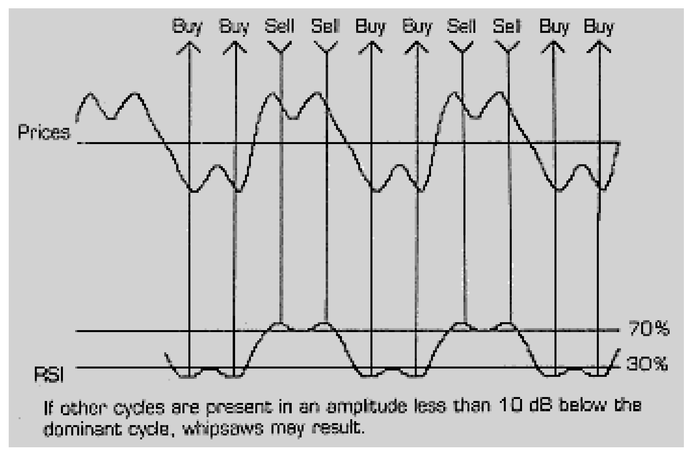
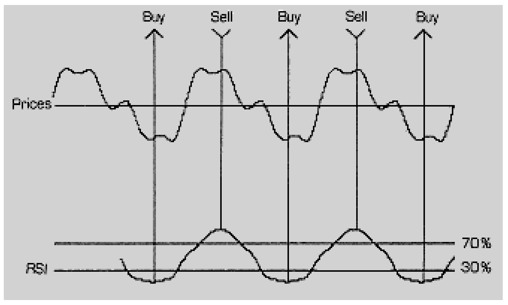
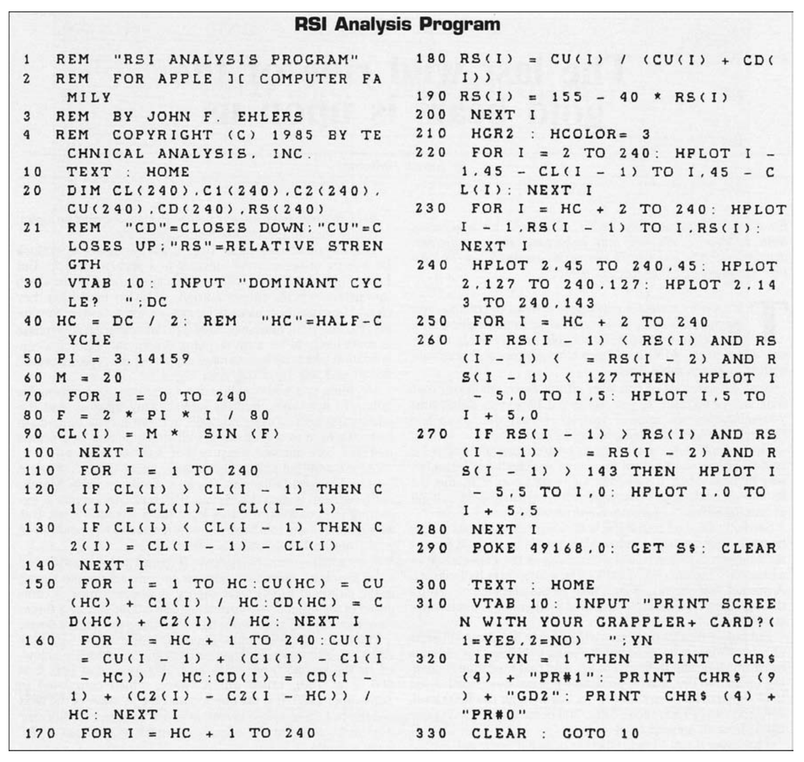

# Optimizing RSI with Cycles

- **Author:** John F. Ehlers
- **Publication:** Technical Analysis of STOCKS & COMMODITIES, Volume 4, Number 1, pp. 26--28
- **Article URL:** [Article PDF](https://technical.traders.com/archive/article.asp?file=\V04\C01\OPTI.PDF)

---

As an engineer I have often been puzzled by some of the terms used by investors. One example is the use of "oscillators" to form trading signals. I have always thought that an oscillator was a device that generated cycles. This caused my initial attraction to such indicators. I quickly learned that a trading oscillator had nothing to do with cycles.

Used in the trading context, an oscillator is the difference in price (or volume or open interest) on two separate days. If we create an oscillator for adjacent days, we have the discrete approximation to the derivative of the price function. The derivative of a sine wave (its rate of change, or "momentum") is a cosine wave. This is interesting because the phase of the cosine wave leads the phase of the sine wave by 90 degrees.

The phasing feature of an oscillator is interesting because it is exactly opposite to the phasing feature of a moving average. The moving average of a sine wave, averaged over the half-cycle of the sine wave, is a negative cosine wave. The negative cosine wave lags behind the sine wave by 90 degrees and is the reason traders lament that moving averages identify a move after it has occurred.

Since the phase of the oscillator leads the price function, we have the potential to create an indicator that can predict price turning points. Unfortunately, Mother Nature doesn't give us anything for free, and the predictors are far more complicated than oscillators. The reason for this is that, while moving averages smooth the function, oscillators produce a function that is more irregular than the price function. In fact, it is so irregular that trading signals can seldom be read from it.

Welles Wilder describes the Relative Strength Index (RSI) in his book *New Concepts in Technical Trading Systems* that uses the oscillator in a way that neatly sidesteps the problem of the irregular function. RSI is defined as follows:

$$RSI = 1 - \frac{1}{1 + RS}$$

where:

$$RS = \frac{CU}{CD} = \frac{\text{14 day average of closes up}}{\text{14 day average of closes down}}$$

With a little algebra this simplifies to:

$$RSI = \frac{CU}{CU + CD}$$

This index avoids the problem of the irregular function by averaging the oscillator. The result is that if the proper period is used, the oscillator will produce a function that leads price by 90 degrees. When this function is averaged, the average produces a lag of 90 degrees. The net result is that the index can be in exact phase with the price function. If this is true, the index will crest at exactly the same time the price crests, and we will have a sensitive entry indicator for a short position. Obviously, the same is true for the valleys as an entry indicator for long positions.

I part company with the conventional wisdom regarding RSI for two reasons. First, I question why the 14 day average is used. The index crests in phase with the price only if the moving average used is half the dominant cycle of the price function. Therefore, in my judgment, the oscillator should be averaged over this half dominant cycle period rather than a fixed 14 days.

Secondly, some of the advice for using RSI involves reading divergences between the index and the price. I must confess that I cannot read divergences in the heat of the trading battle, and the divergences are only apparent to me long after they would have been useful. On the other hand, I can easily train my computer to recognize a peak or a valley of a function.

These are the basic ingredients of the Optimized RSI. We will start with the basic definition of RSI, but will average over the dominant cycle of the price function. The BUY/SELL indicator is an automated recognition of the peaks or the valleys of the indicator.

## Applying Cycles to RSI

With reference to Figure 1, let's assume that the closing price varies from day to day as a discretely sampled sine wave as shown in Figure 1A. If we take the difference between these samples of the sine wave (1) we will obtain the cosine wave of Figure 1B. The scale of Figures 1A and 1B are different, but we are not concerned about the amplitude of the waves.

We can apply some simple tests to see that Figure 1B is the oscillator of Figure 1A. For example, the difference in amplitude of the two successive samples at the crest (2) is zero. This results in the oscillator being zero when the price function crests. In the same way, the difference in amplitude of the two successive samples at the valley (3) is also zero, with the result that the oscillator is also zero. Intermediate between those two zero points of the oscillator it is almost obvious that price has the highest rate of change at the midpoint (1). That is, the highest rate of change of the sine wave occurs when it crosses zero.

Now, let's take a moving average of the oscillator of Figure 1B. The result is shown as Figure 1C. When we take the average over the first half-cycle of Figure 1B we see that there are as many positive points as negative points, with the result that the first point in Figure 1C (4) is zero.

As we move the half-cycle moving average to the right we see that the negative values exceed the positive values and Figure 1C becomes increasingly more negative. This continues for a quarter-cycle until the half-cycle moving average encompasses only negative points (5) in Figure 1B, producing the most negative value in Figure 1C.

As we continue moving the average to the right, Figure 1C now becomes more positive for the next half-cycle. The net result is that Figure 1C is a sine wave that exactly replicates Figure 1A. Since Figure 1C is the same as the price function in Figure 1A, maybe we have created an index that has peaks and valleys at exactly the same time as our price function, enabling the selection of good entry and exit points. Now, let's examine the RSI.



**FIGURE 1.** (A) Closing prices as a sine wave. (B) The oscillator (cosine wave) leads by 90 degrees. (C) Half-cycle moving average of the oscillator restores phase alignment with price.

## The RSI Program

The RSI program listing is an interactive program so that you can see the effects of changing some of the parameters. At line 90 the function of closing prices is a pure sine wave at the beginning (we will change it later). It has a period of 80 units because, at line 80, when the variable reaches 80, the angle F will exactly reach $2\pi$ (360 degrees). Line 120 sets the value of the close up if it occurs and line 130 sets the value of the close down if it occurs. Then the closes up and closes down are averaged over the first half-cycle at line 150. Line 160 continues the half-cycle average of the closes up and the closes down over the half-cycle for the remaining part of the wave. Finally, the RSI is calculated at line 180 and scaled for painting onto the screen at line 190.

Regarding the screen presentation, the price function is plotted in line 220 centered 45 pixels from the top of the screen. RSI is plotted directly in line 230 because it was already scaled in line 190. The trading signals are given in lines 260 and 270. The sell signal is given in line 260. The sell signal occurs when yesterday's RSI is greater than either today's RSI or the RSI two days ago (We can't take a peak on today's RSI because we don't know what tomorrow will bring). In addition, the RSI must be greater than 70 percent of its maximum value. The "less than" signs are used in line 260 because the actual RSI has been inverted to plot it on the screen (zero is at the top of the screen). By the same token, the buy signals are given at line 270. In this case, the RSI must be less than 30 percent of its peak value in addition to having the valley.

After you save the program, let's run it. When asked for the dominant cycle, input 80 for the precisely correct value. After the program crunches the numbers, we get a display of Figure 2. The top sine wave is the price function with the center value shown. The bottom sine wave is the RSI, shown with the 30 percent and 70 percent peak value lines. The arrowheads at the top of the screen are the buy and sell indicators.



**FIGURE 2.** When the dominant cycle is estimated perfectly, the signals are perfect.

Now let's see what happens when we make an error in estimating the dominant cycle. Let's make a really big 50 percent error by inputting 120 for the dominant cycle. Your results will look like Figure 3. The RSI will be decreased in amplitude and delayed somewhat because the averaging period is too long. But other than having BUY/SELL indicators show up a little later, it isn't too bad.



**FIGURE 3.** When the dominant cycle is overestimated by 50%, the signals are slightly late.

Now let's make a 50 percent error the other way by inputting 40 for the dominant cycle. Figure 4 results. RSI has shifted to the left, giving a leading function and it is "saturated" by remaining at its 0 and 100 percent values over a portion of the cycle. The results, however, aren't all that bad.



**FIGURE 4.** When the dominant cycle is underestimated by 50%, the RSI becomes saturated at 100%, but signals are still good.

This is SUPER! We have a trading indicator that picks the peaks and valleys and is reasonably insensitive to errors in the estimation of the dominant cycles. Now we're ready to go out and make money, right? WRONG!

> "... RSI can be optimized using the concepts of cycle analysis."

## Synthesizing the Real World

Instead of using a pure sine wave for the price function let's synthesize a wave shape that might look more like a real price function. A sawtooth shape looks like many price variations. It can be synthesized as a sum of harmonics of the fundamental frequency with each harmonic having an amplitude inversely proportional to its harmonic number. We can approximate this function by changing line 90 to:

```basic
90 CL(I) = M*SIN(F) + (M/2)*SIN(2*F) + (M/3)*SIN(3*F) + (M/4)*SIN(4*F)
```

In this line the "M" component of each term controls amplitude and the "SIN" component controls frequency.

Store the whole program under a new program name and then let's run it. When we put 80 in for the dominant cycle we get the results in Figure 5. WHOOPS! What happened? Our estimate of the dominant cycle was perfect and we still got incorrect BUY signals!



**FIGURE 5.** When harmonics are present, erroneous signals can result.

We can experiment with the dominant cycle. In particular, if we input a value that is greater than the dominant cycle, the RSI tends to be pulled out of "saturation." For example, if we input the 50 percent too long error of 120, we get the results of Figure 6. We miss the sell signals, but the buy signals are reliable when the RSI curve is not saturated against one of the stops.



**FIGURE 6.** When overestimating the dominant cycle in the presence of harmonics, it may eliminate some bad signals.

The real problem, of course, is that our price function has cycles in it other than the dominant cycle. It has been my experience that if these other cycles are present in an amplitude less than 10 dB below the dominant cycle, there will be problems. Ten dB (10 decibels) is on a logarithmic scale and is approximately one-third of the wave amplitude of the dominant cycle. Let's test this proposition by deleting the second term in line 90 so that line 90 becomes:

```basic
90 CL(I) = M*SIN(F) + (M/3)*SIN(3*F) + (M/4)*SIN(4*F)
```

When we run this new line 90 for an 80 day dominant cycle, we get the results in Figure 7. The trading signals are not too bad if you had fairly tight stops or used a following parabolic curve to exit. Also, the whipsaw can be reduced by increasing our estimate of the dominant cycle to get a smoother RSI function.



**FIGURE 7.** If other cycles are present in an amplitude less than 10 dB below the dominant cycle, whipsaws may result.

We can test the 10 dB hypothesis again by changing the frequency of the second term of the revised line 90 to obtain:

```basic
90 CL(I) = M*SIN(F) + (M/3)*SIN(2*F) + (M/4)*SIN(4*F)
```

Running this price function and inputting 80 for the dominant cycle, we get the results in Figure 8. In this case the RSI function has a reasonable resemblance to a sine wave and the trading signals are good.



**FIGURE 8.** When the RSI function resembles a sine wave, the trading signals are good.

## Conclusions

From the experiments we have conducted, we have shown that RSI can be optimized using the concepts of cycle analysis. If there are no cycles in the data, the concept should be abandoned until the conditions fit the analysis technique. When cycles are present, we have found some interesting trends that allow us to use the RSI to possibly produce more profits.

We found that, in general, it is better to make our estimate of the dominant cycle too long rather than too short. The reason for this is that the long period tends to smooth the RSI function so that our entry indicators are more reliable.

We also found that the RSI indicator is reliable if the price function has spectral components more than 10 dB below the amplitude of the dominant cycle. Unfortunately, the spectral content of the price waveform can be obtained only through the use of a spectrum analysis program such as MEM or MESA.

On the other hand, we can be relatively confident that we have a sufficiently pure price function if we accurately estimate the dominant cycle (using moving averages techniques described in the last issue) and if the resulting RSI function has a reasonable approximation to a sine wave. Satisfying these conditions should allow you to profitably apply RSI to your trading methodology.

## RSI Analysis Program



```basic
1   REM "RSI ANALYSIS PROGRAM"
2   REM FOR APPLE ][ COMPUTER FAMILY
3   REM BY JOHN F. EHLERS
4   REM COPYRIGHT (C) 1985 BY TECHNICAL ANALYSIS, INC.
10  TEXT : HOME
20  DIM CL(240),C1(240),C2(240),CU(240),CD(240),RS(240)
21  REM "CD"=CLOSES DOWN:"CU"=CLOSES UP:"RS"=RELATIVE STRENGTH
30  VTAB 10: INPUT "DOMINANT CYCLE? ";DC
40  HC = DC / 2: REM "HC"=HALF-CYCLE
50  PI = 3.14159
60  M = 20
70  FOR I = 0 TO 240
80  F = 2 * PI * I / 80
90  CL(I) = M * SIN(F)
100 NEXT I
110 FOR I = 1 TO 240
120 IF CL(I) > CL(I - 1) THEN C1(I) = CL(I) - CL(I - 1)
130 IF CL(I) < CL(I - 1) THEN C2(I) = CL(I - 1) - CL(I)
140 NEXT I
150 FOR I = 1 TO HC: CU(HC) = CU(HC) + C1(I) / HC: CD(HC) = CD(HC) + C2(I) / HC: NEXT I
160 FOR I = HC + 1 TO 240: CU(I) = CU(I - 1) + (C1(I) - C1(I - HC)) / HC: CD(I) = CD(I - 1) + (C2(I) - C2(I - HC)) / HC: NEXT I
170 FOR I = HC + 1 TO 240
180 RS(I) = CU(I) / (CU(I) + CD(I))
190 RS(I) = 155 - 40 * RS(I)
200 NEXT I
210 HGR2 : HCOLOR= 3
220 FOR I = 2 TO 240: HPLOT I - 1,45 - CL(I - 1) TO I,45 - CL(I): NEXT I
230 FOR I = HC + 2 TO 240: HPLOT I - 1,RS(I - 1) TO I,RS(I): NEXT I
240 HPLOT 2,45 TO 240,45: HPLOT 2,127 TO 240,127: HPLOT 2,143 TO 240,143
250 FOR I = HC + 2 TO 240
260 IF RS(I - 1) < RS(I) AND RS(I - 1) < = RS(I - 2) AND RS(I - 1) < 127 THEN HPLOT I - 5,0 TO I,5: HPLOT I,5 TO I + 5,0
270 IF RS(I - 1) > RS(I) AND RS(I - 1) > = RS(I - 2) AND RS(I - 1) > 143 THEN HPLOT I - 5.5 TO I,0: HPLOT I,0 TO I + 5.5
280 NEXT I
290 POKE 49168,0: GET S$: CLEAR
300 TEXT : HOME
310 VTAB 10: INPUT "PRINT SCREEN WITH YOUR GRAPPLER+ CARD?(1=YES,2=NO) ";YN
320 IF YN = 1 THEN PRINT CHR$(4) + "PR#1": PRINT CHR$(9) + "GD2": PRINT CHR$(4) + "PR#0"
330 CLEAR : GOTO 10
```

---

## BibTeX

```bibtex
@article{ehlers_1986_optimizing_rsi,
  author    = {John F. Ehlers},
  title     = {Optimizing {RSI} with Cycles},
  journal   = {Technical Analysis of STOCKS \& COMMODITIES},
  volume    = {4},
  number    = {1},
  pages     = {26--28},
  year      = {1986},
  url       = {https://technical.traders.com/archive/article.asp?file=\V04\C01\OPTI.PDF}
}
```
