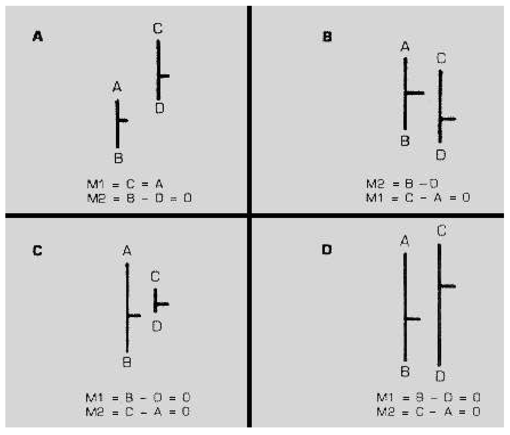
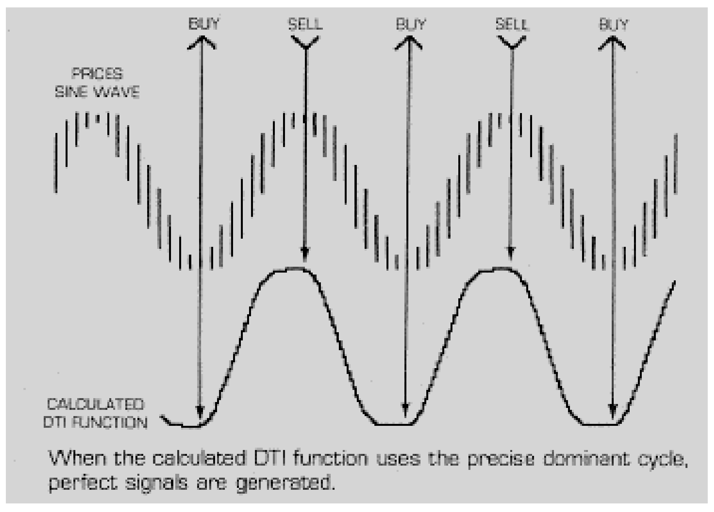
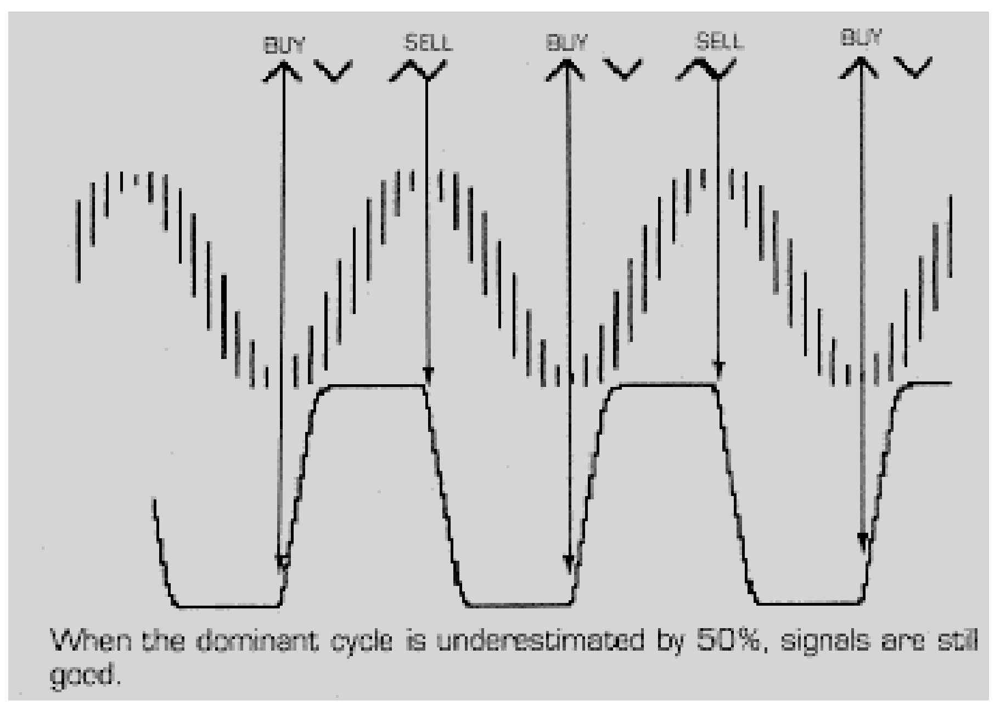
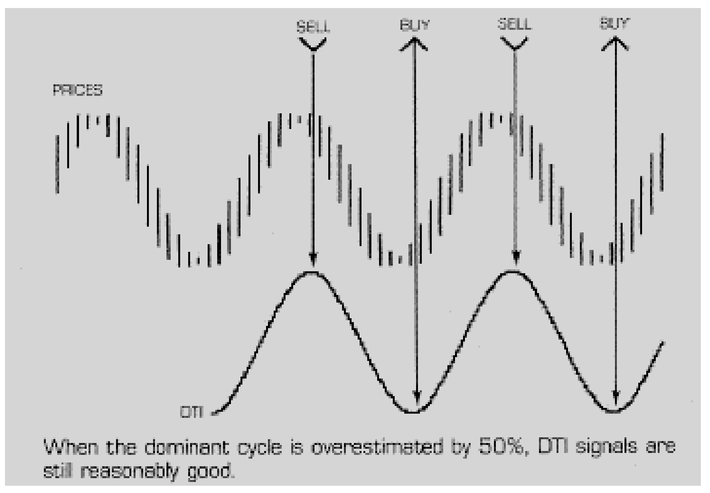
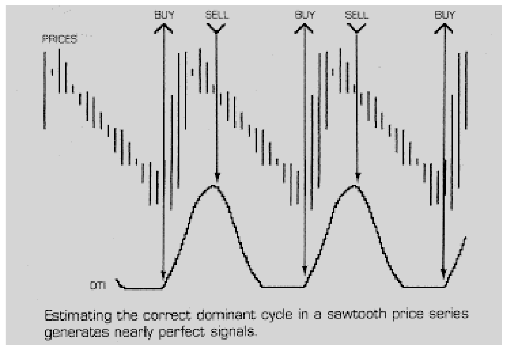
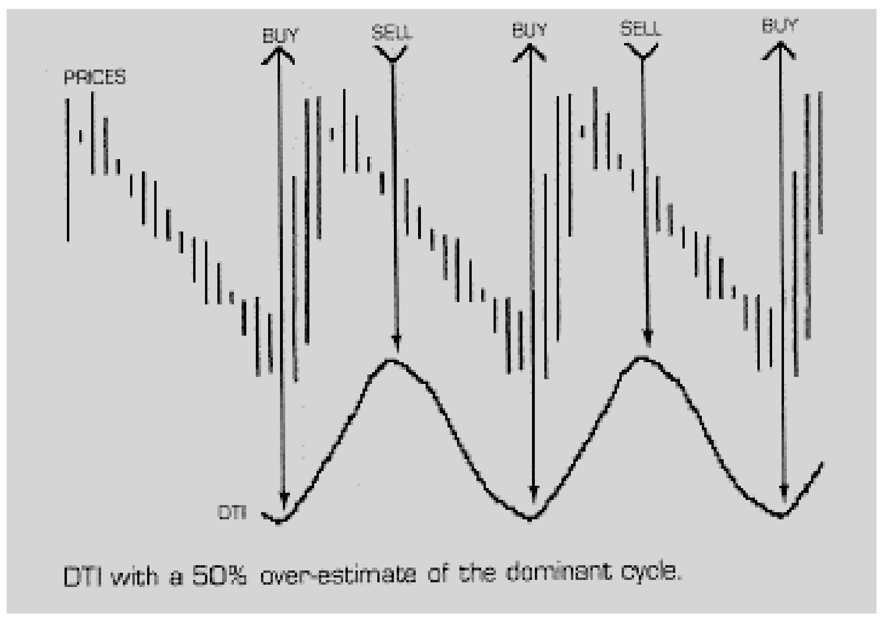
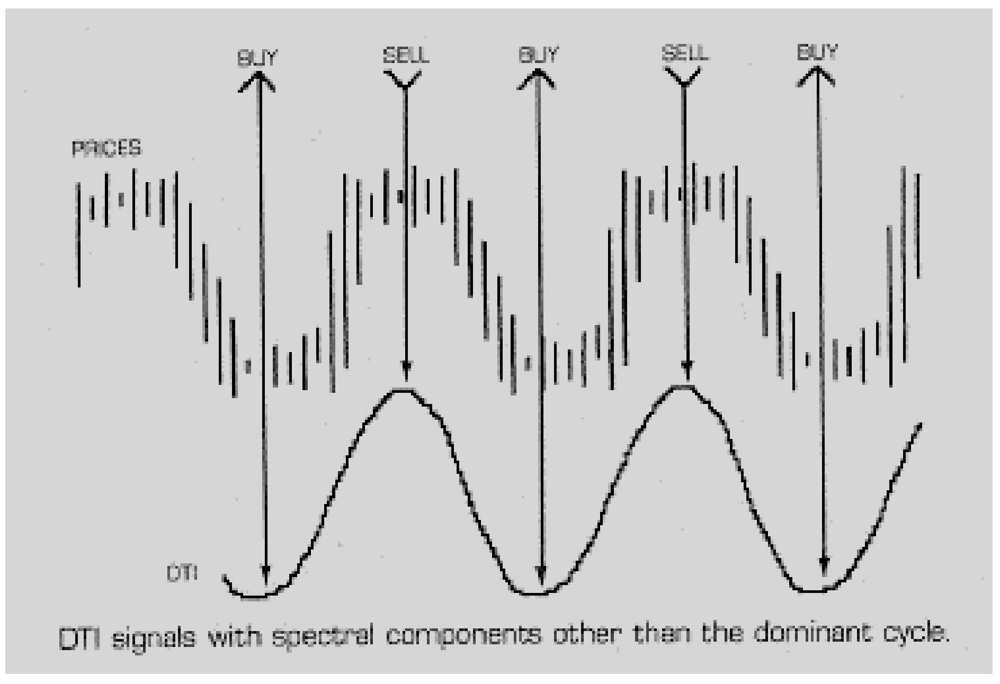
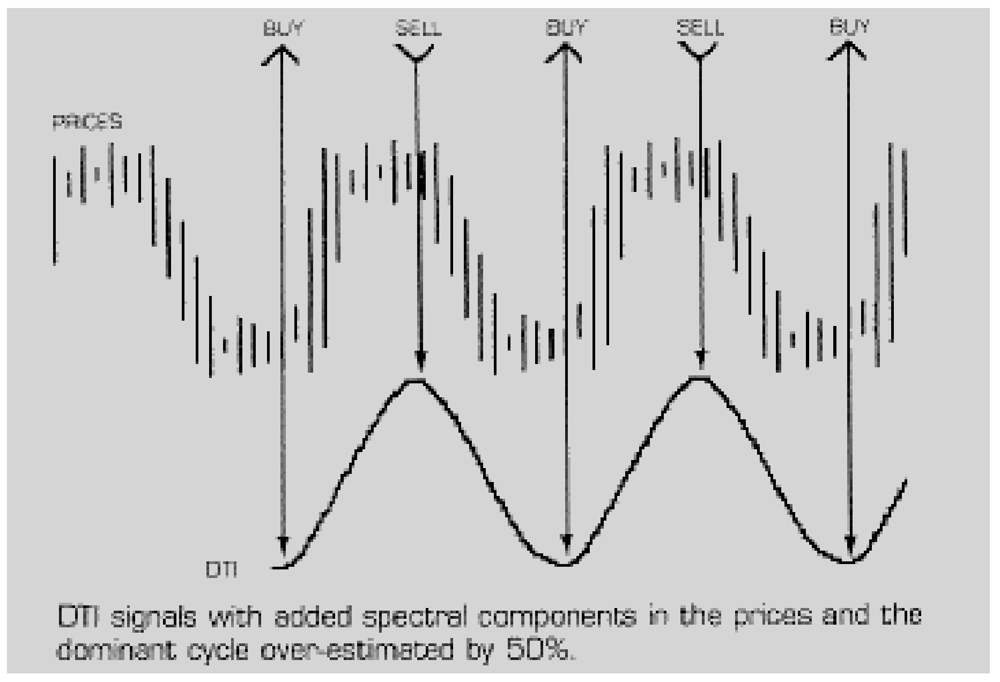
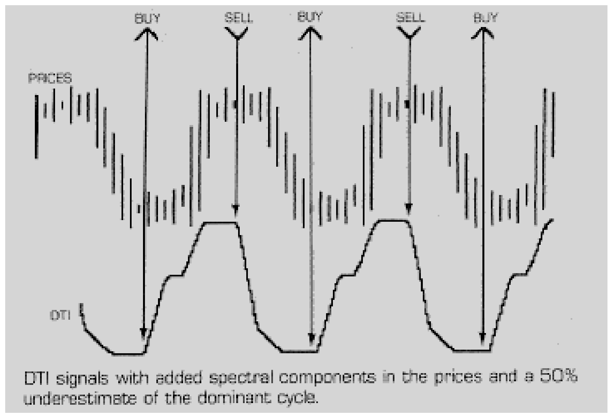
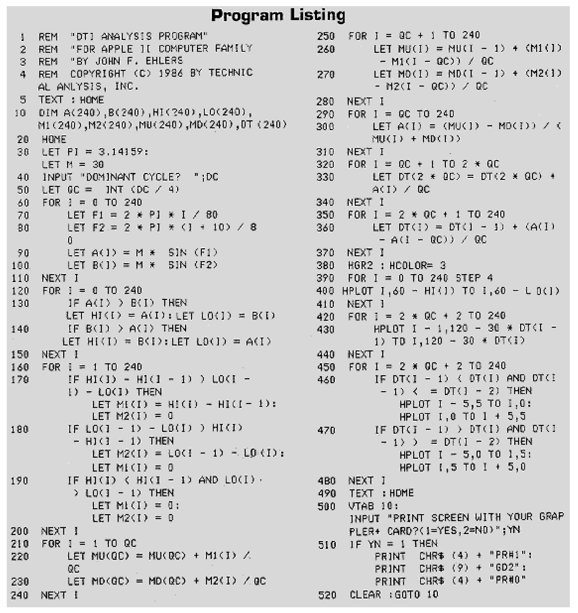

# Optimizing Directional Movement with Cycles

- **Author:** John F. Ehlers
- **Publication:** Technical Analysis of STOCKS & COMMODITIES, Volume 4, Number 2, pp. 77--80
- **Article URL:** [Article PDF](https://technical.traders.com/archive/article.asp?file=\V04\C02\OPTI.PDF)

---

Directional Movement is a technical analysis approach that weighs the daily difference between highs and the difference between lows. The principle of this approach is that the larger difference will influence the directional movement of the price. Welles Wilder was so enthusiastic about the approach that he begins Section IV of his book *New Concepts in Technical Trading Systems* with "Directional movement is the most fascinating concept I have studied."

While the approach isn't all that bad, I am a little more reserved in my assessment of it than Mr. Wilder. Since I am oriented toward the use of cycles, I immediately question why a 14-day averaging process is used not once, but twice in the calculation of his Directional Index. This article approaches Directional Movement from the perspective that there is perhaps an adaptive process to improve the indicator.

In the sections that follow, we briefly review Directional Movement in its classic form, review a few principles regarding cycles, and derive an optimized Directional Trend Indicator (DTI) when cycles are present in the data. An interactive computer program listing is given to allow you to experiment with the limitations of the optimized DTI and perhaps apply it to your trading system.

## Directional Movement Review

A full and complete coverage of Directional Movement is given in Section IV of *New Concepts in Technical Trading Systems*. I will briefly skim the subject and use a new notation for the components of the system. The new notation is used to correlate with variable names in a computer program.



**FIGURE 1.** (A) Upward directional movement: M1 = C - A, M2 = B - D (min 0). (B) Downward directional movement: M2 = B - D, M1 = C - A (min 0). (C) and (D) Both M1 and M2 are set to zero.

Figure 1A clearly depicts an upward directional movement. In this case the daily upward movement, M1, is C-A and the daily downward movement, M2, is B-D with a minimum of zero. Figure 1B depicts a downward directional movement. Here, the daily downward movement, M2, is B-D and M1 = C-A with a minimum of zero. Figures 1C and 1D display cases where both M1 and M2 are set at zero.

Classically, the daily movements are normalized to the daily true range. Although debatable, my experience is that this normalization is gilding the lily and I'll ignore it in this article. The daily directional indicators are averaged over 14 days because Mr. Wilder states that this is an average half-cycle period. Perhaps he is correct, but the wide variation in cycle length from contract to contract certainly leaves room for optimization. Let's name the average upward directional indicators "MU" and the average downward directional indicators "MD."

The Directional Movement Indicator (DX) is the difference between MU and MD divided by the sum of MU and MD. The sign of the difference is ignored so that DX varies between zero and one. The DX is zero when MU is equal to MD, and an equilibrium point is reached. The DX is again averaged over 14 days to produce an average directional indicator ADX. The trading rules are simple: reverse your position each time the MU and MD cross. ADX is used to signal a turning point.

In preparation for optimization I would like to introduce an interim indicator instead of DX. This interim indicator is the true difference between MU and MD divided by the sum of MU and MD. That is:

$$IN = \frac{MU - MD}{MU + MD}$$

This interim indicator will be averaged to find the optimized Directional Trend Indicator (DTI).

## A Review of Cycle Concepts

Moving averages always lag the generating function. If a cycle is present and is a pure sine wave, we have seen ("Understanding Cycles," *Technical Analysis of Stocks & Commodities*, December 1985) that a moving average taken over half a cycle delayed by 90 degrees generates a negative cosine wave. This is similar to the calculus function of integration. If the length of the moving average is extended to a full cycle, the average over one cycle of the sine wave is zero regardless of what position along the sine wave the average is begun. In this case, if the sine wave is superimposed on a trendline, the trendline is recovered by taking the moving average. We will apply these moving average results to Directional Movement.

> Directional Movement weighs the daily difference between highs and the difference between lows.

We have also seen ("Optimizing RSI with Cycles," *Stocks & Commodities*, February 1986) that taking the difference of prices from day to day is analogous to taking the derivative of a continuous function. If the price follows a pure sine wave, the difference will have the shape of a cosine wave. Differencing therefore generates a function that leads the cyclic price by 90 degrees. Differencing would create a predictive function except that the typical price function is so discontinuous that it has little practical merit.

Differencing systems are useful when the irregularities are smoothed by a moving average. When the moving averages are properly applied to the differences we can generate a trading function that is in phase with the price. That is, the phase lead accomplished by differencing can be removed by the phase lag of a moving average.

In anticipation of some comments on moving averages, I would like to observe that comparable moving averages have almost the same effect on phase lag as does a cyclic function. For example, the lag of a simple 14-day moving average is almost the same lag produced by an exponential average with 1/14th weighting. From my perspective, an average is an average is an average.

## Applying Cycles to Directional Movement

Taking the difference of successive highs or successive lows produces a 90 degree leading function in each if a cycle is present. Averaging these differences over a half-cycle would cause MU to be in phase with the price function and MD to be out of phase with it (because the sign of the difference is ignored). I part with the traditional Directional Movement at this point in the derivation because the trading indicators occur too late. While it is true that the equilibrium point occurs when MU is equal to MD, it is also necessarily true that the move is already half over for this portion of the cycle by the time this indicator is given. In addition, if the DX is again subjected to a half-cycle moving average, the resulting Average Directional Index (ADX) will be a simple trendline. The use of such a trendline of the indicator is not clear to me.

Instead of averaging the difference functions over a half-cycle to restore the phase, let's average them over a quarter-cycle. The result is that the interim function

$$IN = \frac{MU - MD}{MU + MD}$$

will still lead the price function in phase somewhat. Next, let's average the interim function, IN, using a quarter-cycle averaging period to form the Directional Trend Indicator, DT. The global effect of the two quarter-cycle averagings is that the Directional Trend Indicator has a net half-cycle moving average and that it will be in phase with the price function.

In principle, breaking the moving average into two pieces reduces the sensitivity of the DT to errors in our estimate of the cycle. If the Directional Movement Indicator, DT, is in phase with the price function, we have a simple way of selecting our entry points. These are: SELL when the DT passes a crest and BUY when the DT passes a valley. To eliminate extraneous signals, I also invoke the constraint that the absolute value of DT must be greater than 0.7.

We can test the conclusions and assertions of our derivation of the Directional Trend Indicator with the interactive computer program given in the listing.

## The DTI Program

The DTI program (Figure 10) is written for an Apple II such that it can be easily modified for other computers. The primary intent of the program is to be interactive to prove the derivation and validity of the trading system. It may be adapted to your own trading system by substituting your own data for the artificially created data. Key the program into your computer at this time so you can follow the discussion of the changes as we make them.

Line 30 establishes some constants. M is an amplitude constant to fit the data on the screen. The cycle we are synthesizing will be exactly 80 units long because when the variable reaches 80 in line 70, the angle F1 will reach exactly $2\pi$ (360 degrees). F2 in line 80 is exactly the same angle function but advanced in phase by 10 units. The result is that the function B(I) in line 100 will lead the function A(I) in line 90. The phase difference of the two functions is used to create price highs and lows in lines 130 and 140. This method of generating highs and lows using a phase lead is consistent with the theory of Directional Movement.

The daily differences of highs are called M1(I) and the daily differences of lows are called M2(I). These are calculated in lines 160 through 200. The initial quarter-cycle averages MU and MD are calculated in lines 210 through 240 and the moving averages are calculated over nearly three cycles in lines 250 through 280.

The interim function A(I) is computed at line 300, and is calculated for each day beyond the quarter-cycle point. (The variable A(I) is reused here simply to conserve memory space in the computer and, at this point in the program, we have passed the original usage of this variable name.) The initial average of the Daily Trend Indicator is done at line 330, and the average over the remainder of the three cycles is done at line 360.

The plotting function uses every four units to simulate the daily bar presentation of price. The price is plotted at line 400 and the DTI is scaled and plotted at line 430. The peaks and valleys of the DTI are sensed and trading indicators are plotted in lines 460 and 470. Any keystroke followed by RETURN will allow you to repeat the program.

Now let's see what happens when we run the DTI program. When first asked for the dominant cycle, we'll input 80 to insure that our estimate is exactly correct. The resulting output is shown in Figure 2. The top sine wave is our price function with bars plotted from high to low on every fourth increment. The bottom wave is our calculated DTI function. The BUY/SELL indicators computed from the DTI function are drawn at the top of your screen. Not bad! But we did make a correct estimate of the dominant cycle after all, and the indicator should be pretty good.



**FIGURE 2.** When the calculated DTI function uses the precise dominant cycle, perfect signals are generated.

Let's now try again. This time let's make a 50 percent error in the dominant cycle estimate by inputting 40. This time we get the display of Figure 3. The DTI function is "saturated" by being flattened on the top and bottom, but the amazing thing is that the BUY/SELL indicators are still pretty good.



**FIGURE 3.** When the dominant cycle is underestimated by 50%, signals are still good.

Let's try again, but this time make a 50 percent error in the dominant cycle estimate by inputting 120. The display of Figure 4 results. We have the truly amazing result that the indicators computed from the DTI are relatively insensitive to errors as much as +/-50% in the estimate of the dominant cycle.



**FIGURE 4.** When the dominant cycle is overestimated by 50%, DTI signals are still reasonably good.

Mother Nature is seldom so kind as to provide a pure tone variation in price from which we can calculate results. Another test for the DTI is how it performs with theoretically reproducible waveforms that simulate the real-world environment. We can synthesize a sawtooth-shaped waveform similar to some trading patterns by summing harmonics of the dominant cycle with amplitude coefficients inversely proportional to the harmonic number. To do this, we will change lines 90 and 100 to:

```basic
90 A(I) = M*SIN(F1) + (M/2)*SIN(2*F1) + (M/3)*SIN(3*F1) + (M/4)*SIN(4*F1)
100 B(I) = M*SIN(F2) + (M/2)*SIN(2*F2) + (M/3)*SIN(3*F2) + (M/4)*SIN(4*F2)
```

Now when we run the program and input 80 for our estimate of the dominant cycle, we get the display of Figure 5. This technique is starting to show some promise! The BUY/SELL indicators are almost perfectly placed.



**FIGURE 5.** Estimating the correct dominant cycle in a sawtooth price series generates nearly perfect signals.

If we are to make an error in estimating the dominant cycle we should be on the long side because the DTI function is already "saturated" on the bottom with the correct dominant cycle estimate. Let's make a 50 percent error in the dominant cycle by inputting 120. The display of Figure 6 results, with the DTI function nearly being a sine wave and the BUY/SELL indicators remaining almost perfectly placed.



**FIGURE 6.** DTI with a 50% over-estimate of the dominant cycle.

Cyclic indicators are often sensitive to the spectral purity of the price. That is, frequency components other than the dominant cycle cause errors in the indicator. When I use MESA to measure the spectral content, my rule of thumb is that all other spectral components must be 10 dB (about 1/3 amplitude) below the amplitude of the dominant cycle. We can test what happens with this kind of spectral purity by deleting the second terms in lines 90 and 100. These lines then become:

```basic
90 A(I) = M*SIN(F1) + (M/3)*SIN(3*F1) + (M/4)*SIN(4*F1)
100 B(I) = M*SIN(F2) + (M/3)*SIN(3*F2) + (M/4)*SIN(4*F2)
```

When we now input 80 for the dominant cycle, we get the results of Figure 7 and an estimate of 120 gives the results of Figure 8. In both cases the BUY/SELL indicators are ideally placed! A significant observation is that the DTI in both cases is nearly a sine wave. The shape of the DTI function is crucial to recognizing that a cycle is present and, if so, whether the spectral purity is adequate to produce reliable BUY/SELL indicators.



**FIGURE 7.** DTI signals with spectral components other than the dominant cycle.



**FIGURE 8.** DTI signals with added spectral components in the prices and the dominant cycle over-estimated by 50%.

Figure 9 shows the DTI signals with added spectral components and a 50% underestimate of the dominant cycle.



**FIGURE 9.** DTI signals with added spectral components in the prices and a 50% underestimate of the dominant cycle.

> The Directional Trend Indicator is a minor variation on the traditional Directional Movement concept.

## Conclusions

The Directional Trend Indicator (DTI) described is a minor variation on the traditional Directional Movement concept. The daily difference at the start of the calculation produces a 90 degree phase lead that is removed in the two-step moving average. The result is that the DTI yields reliable BUY/SELL indicators at its valleys and peaks that are in phase with the turning points in price. The DTI is relatively insensitive to errors in estimates of the dominant cycle. The DTI is most reliable when the amplitude of the dominant cycle is much larger than the amplitude of the other spectral components. This condition is found either by measuring the spectrum with a program like MESA or by observing the DTI function itself to be a sine wave.

## DTI Program Listing



```basic
1   REM "DTI ANALYSIS PROGRAM"
2   REM FOR APPLE ][ COMPUTER FAMILY
3   REM BY JOHN F. EHLERS
4   REM COPYRIGHT (C) 1986 BY TECHNICAL ANALYSIS, INC.
5   TEXT: HOME
10  DIM A(240),B(240),HI(240),LO(240),M1(240),M2(240),MU(240),MD(240),DT(240)
20  HOME
30  LET PI = 3.14159:
    LET M = 30
40  INPUT "DOMINANT CYCLE? ";DC
50  LET QC = INT(DC / 4)
60  FOR I = 0 TO 240
70  LET F1 = 2 * PI * I / 80
80  LET F2 = 2 * PI * (I + 10) / 80
90  LET A(I) = M * SIN(F1)
100 LET B(I) = M * SIN(F2)
110 NEXT I
120 FOR I = 0 TO 240
130 IF A(I) > B(I) THEN LET HI(I) = A(I): LET LO(I) = B(I)
140 IF B(I) > A(I) THEN LET HI(I) = B(I): LET LO(I) = A(I)
150 NEXT I
160 FOR I = 1 TO 240
170 IF HI(I) - HI(I - 1) > LO(I - 1) - LO(I) THEN
    LET M1(I) = HI(I) - HI(I - 1):
    LET M2(I) = 0
180 IF LO(I - 1) - LO(I) > HI(I) - HI(I - 1) THEN
    LET M2(I) = LO(I - 1) - LO(I):
    LET M1(I) = 0
190 IF HI(I) < HI(I - 1) AND LO(I) > LO(I - 1) THEN
    LET M1(I) = 0:
    LET M2(I) = 0
200 NEXT I
210 FOR I = 1 TO QC
220 LET MU(QC) = MU(QC) + M1(I) / QC
230 LET MD(QC) = MD(QC) + M2(I) / QC
240 NEXT I
250 FOR I = QC + 1 TO 240
260 LET MU(I) = MU(I - 1) + (M1(I) - M1(I - QC)) / QC
270 LET MD(I) = MD(I - 1) + (M2(I) - M2(I - QC)) / QC
280 NEXT I
290 FOR I = QC TO 240
300 LET A(I) = (MU(I) - MD(I)) / (MU(I) + MD(I))
310 NEXT I
320 FOR I = QC + 1 TO 2 * QC
330 LET DT(2 * QC) = DT(2 * QC) + A(I) / QC
340 NEXT I
350 FOR I = 2 * QC + 1 TO 240
360 LET DT(I) = DT(I - 1) + (A(I) - A(I - QC)) / QC
370 NEXT I
380 HGR2: HCOLOR= 3
390 FOR I = 0 TO 240 STEP 4
400 HPLOT I,60 - HI(I) TO I,60 - LO(I)
410 NEXT I
420 FOR I = 2 * QC + 2 TO 240
430 HPLOT I - 1,120 - 30 * DT(I - 1) TO I,120 - 30 * DT(I)
440 NEXT I
450 FOR I = 2 * QC + 2 TO 240
460 IF DT(I - 1) < DT(I) AND DT(I - 1) < = DT(I - 2) THEN
    HPLOT I - 5,5 TO I,0:
    HPLOT I,0 TO I + 5,5
470 IF DT(I - 1) > DT(I) AND DT(I - 1) > = DT(I - 2) THEN
    HPLOT I - 5,0 TO I,5:
    HPLOT I,5 TO I + 5,0
480 NEXT I
490 TEXT: HOME
500 VTAB 10:
    INPUT "PRINT SCREEN WITH YOUR GRAPPLER+ CARD?(1=YES,2=NO)";YN
510 IF YN = 1 THEN
    PRINT CHR$(4) + "PR#1":
    PRINT CHR$(9) + "GD2":
    PRINT CHR$(4) + "PR#0"
520 CLEAR: GOTO 10
```

---

## BibTeX

```bibtex
@article{ehlers_1986_optimizing_directional_movement,
  author    = {John F. Ehlers},
  title     = {Optimizing Directional Movement with Cycles},
  journal   = {Technical Analysis of STOCKS \& COMMODITIES},
  volume    = {4},
  number    = {2},
  pages     = {77--80},
  year      = {1986},
  url       = {https://technical.traders.com/archive/article.asp?file=\V04\C02\OPTI.PDF}
}
```
