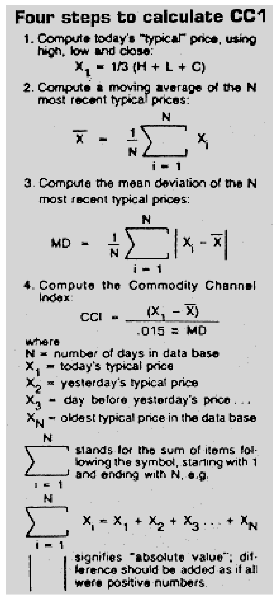
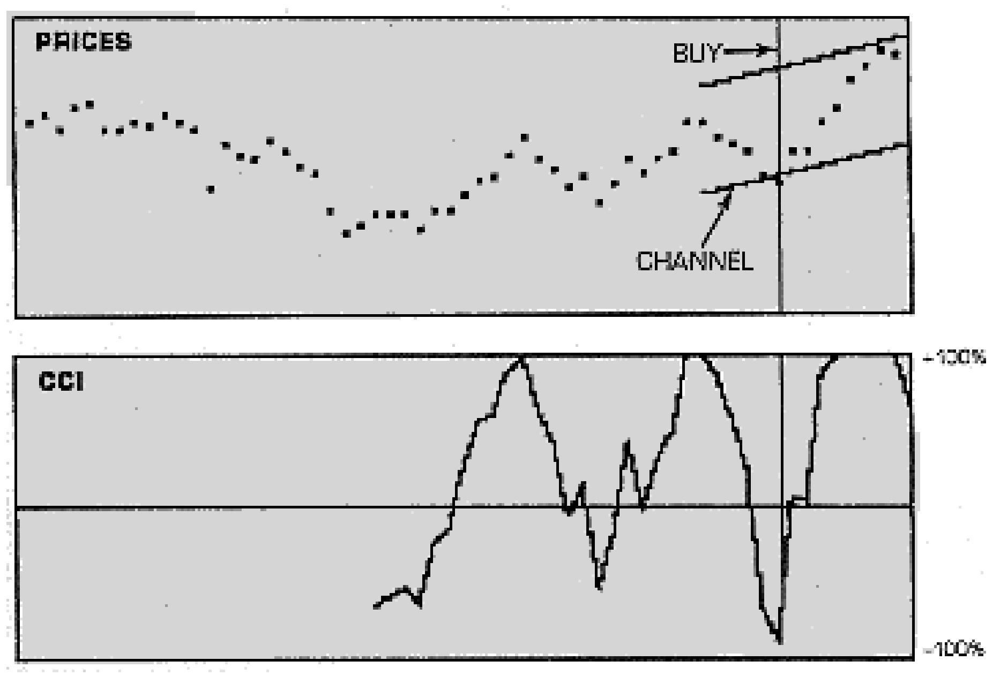
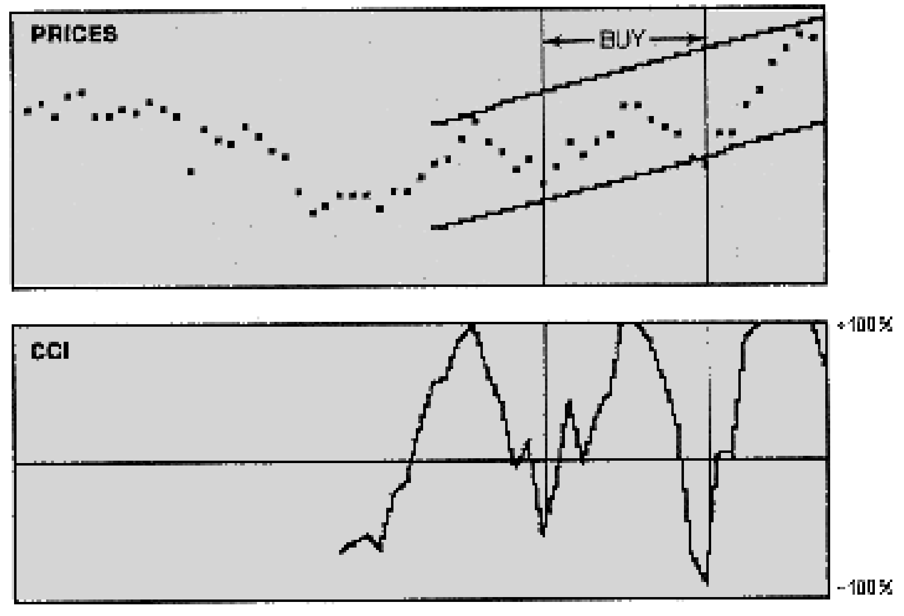
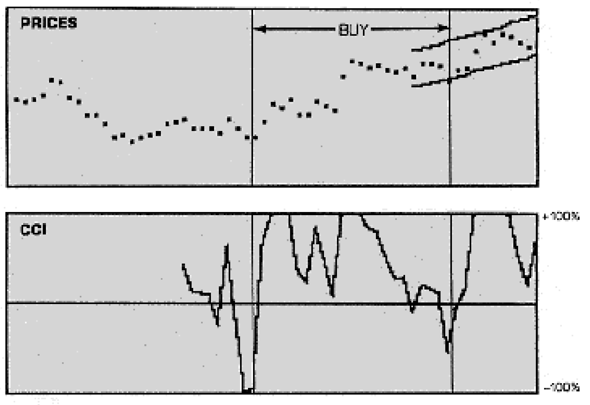
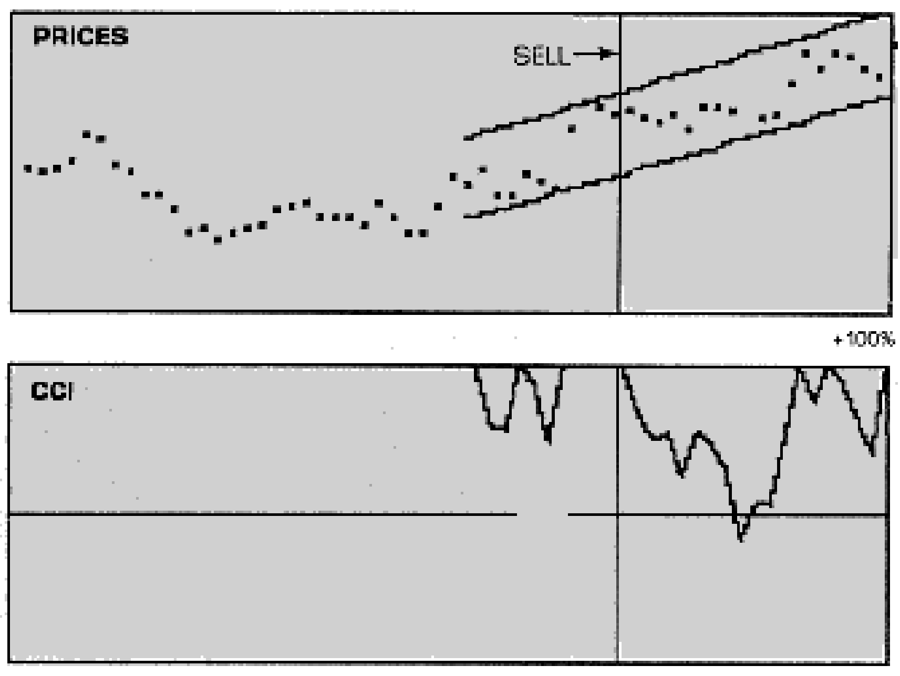

# Trading Channels

- **Author:** John F. Ehlers
- **Publication:** Technical Analysis of STOCKS & COMMODITIES, Volume 4, Number 3, pp. 93--97
- **Article URL:** [Article PDF](https://technical.traders.com/archive/article.asp?file=\V04\C03\TRAD.PDF)

---

## Introduction

You don't have to examine price charts very long before you can picture the prices varying around a trendline in a trading channel, having the trendline reverse, and the trading within the channel begin all over again. We will describe two methods that can help visualize the channels and identify the price turns that comprise the channel edges. The first of these is the Commodity Channel Index (CCI) that measures the price excursions from the mean as a statistical variation. The second method brackets the price trading channel that is centered on a best-fitting straight trendline. Both approaches are included in the BASIC program listing so that their effects can be compared (Figure 6). The program is usable for your daily trading with a simple conversion of daily prices into the program variable format.

## Commodity Channel Index (CCI)

The CCI was first described by Donald Lambert (*Commodities*, October 1980, pp. 39--40). He described the index to be like a "standard score" in statistics. The basic approach is first to calculate the average price value using a moving average. This establishes the center of a kind of trendline. Then, the mean deviation from the trendline is calculated. The final step computes the daily difference from the moving average as a ratio to the mean deviation. The ratio is divided by the constant .015 so that 70 to 80 percent of the variation falls within a +/- 100 percent channel index.

The first steps used to calculate the CCI are shown in Figure 1. Lambert allowed the number of points used in the calculation to be selected, and asserted that this number could be between five and 25 days. On the other hand, if the prices are varying sinusoidally with a pure tone, a moving average over the period of the tone will exactly produce the trendline. Therefore, a rational selection for the number of points used in the moving average would be the estimated dominant cycle of the price fluctuation. It is my experience that the dominant cycle falls within Lambert's five to 25 day guidelines.



**FIGURE 1.** Four steps to calculate CCI: (1) compute typical price $X_1 = \frac{1}{3}(H + L + C)$; (2) compute moving average $\bar{X} = \frac{1}{N}\sum_{i=1}^{N} X_i$; (3) compute mean deviation $MD = \frac{1}{N}\sum_{i=1}^{N}|X_i - \bar{X}|$; (4) compute CCI $= \frac{(X_1 - \bar{X})}{0.015 \times MD}$.

The calculation of the CCI in the computer program is accomplished in lines 200 through 260. Within these calculations we use the dominant cycle (DC) as the number of points to use. The data is assumed to be averaged over high, low, and close to be the "typical" price. So, the first step of the program is to calculate the moving average. The first moving average (AV) is calculated at line 210 in a straightforward manner. Then, the moving average is calculated for all subsequent days by updating the previously calculated moving average, adding the new contribution and discarding the oldest contribution. This method speeds the calculation.

The Mean Deviation (MD) is calculated in lines 230 through 250 for all the days that we have calculated a moving average. The mean deviation on any given day is the average of the difference between the price and the moving average over the previous dominant cycle, ignoring the algebraic sign of the difference.

The Commodity Channel Index (CCI) is computed at line 260 for each day that we have computed its components. The index is the difference between the price (P) and the moving average (AV) for that day, divided by the mean deviation (MD) and a constant. The .015 constant was selected so as to have most of the points fall within a +/- 100 percent channel.

## Channels

There is another way to calculate the trading channels and to visualize them by plotting the channel as a price overlay on your computer screen. Once the lines marking the channel boundaries are drawn, it is easy to see how the price fluctuates within the channel.

Calculation of the channel starts with finding how long the channel should be. Since the channel is assumed to be centered on a straight trendline, the correct length can be determined by maximizing the correlation between the price and a best-fitting straight line. The process is started by calculating a best-fitting straight line that is three weeks long and extends backward in time from the present. Then, the correlation between this line and the price is computed.

The next step is to make the best-fitting straight line longer and re-accomplish all the calculations. We could extend the line a day at a time if we wished, but the computation would be burdensome even for a computer. So, we extend the line by a week (five days) to reduce the calculations. We recalculate the correlation between this line and the price data.

If the correlation coefficient increases, we again lengthen the line by a week and recalculate all over again. On the other hand, if the correlation coefficient is smaller than the correlation with the previous line, we stop and use the previous length as the optimal period. The period is optimum because the price has the highest correlation to the trendline.

Our calculation is completed by examining the peak deviations from the best-fitting trendline using the average plus and minus peak deviation to establish the channel boundaries.

The rationale to establish the channel is straightforward by maximizing the correlation of the price to a straight trendline. Channel is used to estimate the relationship of the price to the channel boundaries. The proposition is that, if the price is approaching a channel boundary, it is likely to turn around in order to stay in the channel. This, of course, forms the basis of an entry and/or exit signal. The danger is that the price won't turn around to stay in the channel, but will break out and start a reverse trend. If this occurs, only your stop will save you.

Calculation for the channel is accomplished in lines 300 through 500 of the listing. An option has been added to allow manual selection of the channel length. The decision to use this option is made at line 310, causing the program to jump over length calculation if manual length is selected.

> Cyclic content of the price is one of the most significant factors in the successful use of channel indicators.

Automatic length calculation starts at line 320 by setting the initial conditions for the "trial length" (TL) at 10 and the last correlation coefficient (RL) at zero. The trial length is incremented by five at line 330, so that our first calculation really starts with a length of 15. Variables used in calculating the correlation coefficient are also initialized to zero at line 330. The actual calculation of the correlation coefficient (R) is accomplished in lines 340 and 350. The calculation is a direct application of equations that can be found in statistics handbooks.

The key to the calculation occurs at line 360. In this line, we jump out of our calculation loop if the correlation coefficient is smaller in amplitude and of the same sign as the previously calculated correlation coefficient. If not, the "previous" value is assigned to the correlation coefficient we have just calculated in line 380 and then we begin the loop all over again by the directive in line 390. This time period will be five days longer than previously.

When we exit the loop, we are directed to line 400 where five days are removed from the "trial length" (TL) to obtain the "final length" (FL). The reason for this is that the length that was five days shorter than the one that caused us to exit the loop must have been the one with the highest correlation coefficient.

Next, we want to calculate the best-fitting straight line over the period of the "final length." Variables are initialized at line 410 and the calculation is accomplished in lines 420 through 440 using equations similar to the correlation coefficient equations. The straight line is given the name SL in line 440.

The next step in the calculations is to find the maximum positive (RP) and negative (RM) price differences from the best-fitting straight trendline (SL). This is done in lines 460 through 490. Finally, the average maximum difference (RE) is calculated at line 500. The remainder of the program is involved with the plotting of the data on the screen of your computer.

## Computer Program

Before we continue describing the plotting routines, we need to return to the beginning of the program where the basis of the calculations are established. Line 10 primarily dimensions the array variables used in the calculations. The dominant cycle (DC) is requested as a keyboard input at line 20. The dominant cycle is used to calculate the length of the moving average in the CCI. The selection for the dominant cycle is constrained to be an integer between five and 60 days due to line 30.

The program gives you the option to select automatic calculation or manual setting of the length of the trading channel. If you select automatic calculation at line 50, then line 60 passes you directly to line 100 to read the data. On the other hand if you select manual setting of the channel length, you progress to line 70 where you input the length setting. Line 90 constrains this selection to be an integer between 10 and 60 days. In this case, you are passed to line 100 after you have successfully selected the channel length.

Line 100 reads in 60 data points from the data statements in lines 1000 through 1050. If you change the data, remember that you must have 60 points and the "typical" price must be normalized to fall between zero and 80.

The plotting routines are contained in lines 600 through 840. Page 2 of the graphics mode and the color white are selected at line 610. Line 620 plots a box around the price data. The price data is inverted at line 630 because zero is at the top of the screen. Four points are plotted for each price in line 640 to make the dots easier to see.

A box is drawn around the CCI display area and the zero CCI line is drawn in line 650. The CCI is scaled for plotting in lines 660 through 700. Lines 680 and 690 constrain the CCI from falling outside the +/- 100 percent channel. The scaled CCI is plotted by lines 710 through 730.

The channel lines are calculated in lines 740 through 760. The bottom channel line is plotted in lines 770 through 800. The plotting is skipped over in line 780 for any place in the line that extends beyond the boundaries of the price box. Similar plotting for the top channel line is done in lines 810 through 840.

## Reading the Charts

When we run the program, selecting a dominant cycle of 12 days and automatic length selection, we get the display of Figure 2. We can easily see the 12-day variation in the CCI, but the channel length is a little short. If we repeat the calculation, but set the channel length manually at 30, we get the display of Figure 3. Here we clearly see the uptrend line and price varying with the trading channel. Further, the price within the channel tends to correspond to the shape of the CCI curve. The resulting BUY/SELL signals are obvious---buy when the price falls within a quartile of the channel boundary or when the CCI exceeds +/- 75 percent.



**FIGURE 2.** With a 12-day dominant cycle and automatic channel length selection, the channel is too short.



**FIGURE 3.** The channel is better defined when length is specified as 30 days and a 12-day dominant cycle is used.

We can get a new display by changing the data in lines 1000 through 1050. Let's change it to:

```
1000 DATA 39,38,39,41,48,47,40,38,32,32
1010 DATA 28,22,23,20,22,23,24,28,29,30
1020 DATA 26,26,26,24,30,26,22,22,29,37
1030 DATA 35,39,32,32,38,36,34,50,57,56
1040 DATA 54,55,53,52,54,50,56,56,55,48
1050 DATA 53,54,62,70,66,70,69,66,64,72
```

Running the program with this data using a 10-day dominant cycle and automatic channel length selection, we get the chart of Figure 4. In this case, we can barely see the 10-day cycle in the CCI, but there are also other components present. If we try again, this time selecting a 15-day dominant cycle and a channel length set manually at 30 days, we get the chart of Figure 5. The bias of the uptrend in the CCI is even stronger than it is in Figure 4. However, using the BUY/SELL indicators that were successful in Figures 2 and 3 would be a disaster. Selling about 20 days before the present would have been indicated by the CCI and the price position in the channel. If this were done, very little, if any, profit would have been made although the price drifted from the top of the channel to the bottom of the channel as anticipated.



**FIGURE 4.** Selecting a 10-day cycle and automatic channel length when other cyclic components are present gives dangerous buy and sell signals.



**FIGURE 5.** A 15-day dominant cycle and 30-day channel length. Take only signals in the direction of the trend.

This condition causes another trading rule to be introduced for trading with channel indicators. This rule is simply that you should never enter a position going against the major trendline. If this rule were followed, the only entry indicated by Figure 4 would be a long position, about 33 days before the present and one about 10 days before the present. This would have been an extremely profitable trade.

From my experience, the cyclic content of the price is perhaps one of the most significant factors in the successful use of channel indicators. A MESA spectrum analysis of the data of Figures 2 and 3 shows that there is a well-behaved 12-day dominant cycle. This caused the CCI to be well-behaved and to give clear BUY/SELL indicators. On the other hand, MESA shows the spectrum for the data of Figures 4 and 5 to have cycles of nearly equal amplitude for 11 and 21 days, as well as relatively strong cycles with periods of three days and seven days. In short, the price does not exhibit a nice swinging variation that stays within the channel boundaries.

I conclude that channel-type indicators can be a great aid to technical trading. However, they should be approached cautiously and the price should be examined for cyclic content to confirm a buy or sell signal.

## Channel Program

```basic
1  REM "CCI ANALYSIS PROGRAM"
2  REM FOR APPLE ][ COMPUTERS
3  REM BY JOHN F. EHLERS
4  REM COPYRIGHT (C) 1986 BY TECHNICAL ANALYSIS, INC.
10 TEXT:
   HOME:
   DIM P(60),AV(60),MD(60),CC(60),SL(60),C1(60),C2(60)
20 INPUT "DOMINANT CYCLE? ";DC
30 IF DC < 5 OR DC > 60 OR INT(DC) <> DC THEN 20
40 VTAB 5:
   PRINT "CHANNEL LENGTH SELECTION:"
50 INPUT " MANUAL OR AUTOMATIC (M OR A)?";CL$
60 IF CL$ = "A" THEN 100
70 VTAB 10:
   IF CL$ = "M" THEN INPUT "CHANNEL LENGTH (10 OR<L<60)?";FL
80 IF CL$ <> "M" THEN 40
90 IF FL < 10 OR FL > 60 OR INT(FL) <> FL THEN 70
100 FOR I = 1 TO 60:
    READ P(I):
    NEXT I
200 REM *** CCI ***
210 FOR I = 1 TO DC:
    LET AV(DC) = AV(DC) + P(I) / DC:
    NEXT I
220 FOR I = DC + 1 TO 60:
    LET AV(I) = AV(I - 1) + (P(I) - P(I - DC)) / DC:
    NEXT I
230 FOR I = 2 * DC TO 60
240 FOR J = 0 TO DC:
    LET MD(I) = MD(I) + ABS(P(I - J) - AV(I - J)) / DC:
    NEXT J
250 NEXT I
260 FOR I = 2 * DC TO 60:
    LET CC(I) = (P(I) - AV(I)) / (.015 * MD(I)):
    NEXT I
300 REM *** CHANNEL ***
310 IF CL$ = "M" THEN 410
320 LET TL = 10:
    LET RL = 0
330 LET TL = TL + 5:
    LET X = 0:
    LET Y = 0:
    LET XY = 0:
    LET X2 = 0:
    LET Y2 = 0
340 FOR I = 60 TO 61 - TL STEP -1:
    LET DN = 61 - I:
    LET X = X + DN:
    LET Y = Y + P(I):
    LET XY = XY + DN * P(I):
    LET X2 = X2 + DN * DN:
    LET Y2 = Y2 + P(I) * P(I):
    NEXT I
350 LET R = (TL * XY - X * Y) / SQR((TL * X2 - X * X) * (TL * Y2 - Y * Y))
360 IF ABS(R) < ABS(RL) AND SGN(R) = SGN(RL) THEN 400
370 IF TL = 60 THEN 400
380 LET RL = R
390 GOTO 330
400 LET FL = TL - 5
410 LET X = 0:
    LET Y = 0:
    LET XY = 0:
    LET X2 = 0
420 FOR I = 61 - FL TO 60:
    LET XY = XY + I * P(I):
    LET X = X + I:
    LET Y = Y + P(I):
    LET X2 = X2 + I * I:
    NEXT I
430 LET B = (FL * XY - X * Y) / (FL * X2 - X * X):
    LET A = (Y - B * X) / FL
440 FOR I = 1 TO 60:
    LET SL(I) = A + B * I:
    NEXT I
450 LET RP = 0:
    LET RM = 0
460 FOR I = 61 - FL TO 60
470 IF P(I) - SL(I) > RP THEN LET RP = P(I) - SL(I)
480 IF SL(I) - P(I) > RM THEN LET RM = SL(I) - P(I)
490 NEXT I
500 LET RE = .5 * (RP + RM)
600 REM *** PLOT RESULTS ***
610 HGR2:
    HCOLOR= 3
620 HPLOT 0,0 TO 240,0 TO 240,80 TO 0,80 TO 0,0
630 FOR I = 1 TO 60:
    LET P(I) = 80 - P(I):
    NEXT I
640 FOR I = 1 TO 60:
    HPLOT 4 * I, P(I):
    HPLOT 4 * I + 1, P(I):
    HPLOT 4 * I, P(I) + 1:
    HPLOT 4 * I + 1, P(I) + 1:
    NEXT I
650 HPLOT 0,100 TO 240,100 TO 240,180 TO 0,180 TO 0,100:
    HPLOT 0,140 TO 240,140
660 FOR I = 2 * DC TO 60
670 LET CC(I) = 140 - .4 * CC(I)
680 IF CC(I) < 100 THEN LET CC(I) = 100
690 IF CC(I) > 180 THEN LET CC(I) = 180
700 NEXT I
710 FOR I = 2 * DC + 1 TO 60
720 HPLOT 4 * (I - 1), CC(I - 1) TO 4 * I, CC(I)
730 NEXT I
740 FOR I = 61 - FL TO 60
750 LET C1(I) = 80 - SL(I) + RE:
    LET C2(I) = 80 - SL(I) - RE
760 NEXT I
770 FOR I = 62 - FL TO 60
780 IF C1(I - 1) < 0 OR C1(I) < 0 OR C1(I - 1) > 80 OR C1(I) > 80 THEN 800
790 HPLOT 4 * (I - 1), C1(I - 1) TO 4 * I, C1(I)
800 NEXT I
810 FOR I = 62 - FL TO 60
820 IF C2(I - 1) < 0 OR C2(I) < 0 OR C2(I - 1) > 80 OR C2(I) > 80 THEN 840
830 HPLOT 4 * (I - 1), C2(I - 1) TO 4 * I, C2(I)
840 NEXT I
850 POKE -16368, 0:
    GET S$
860 TEXT:
    HOME
900 VTAB 10:
    INPUT "PRINT SCREEN WITH YOUR GRAPPLER + CARD? (1=YES, 2=NO) ";YN
910 IF YN = 1 THEN
    PRINT CHR$(4) + "PR#1":
    PRINT CHR$(9), "GD 2":
    PRINT CHR$(4) + "PR#0"
920 CLEAR:
    GOTO 10
1000 DATA 52, 54, 50, 56, 57, 50, 50, 52, 51, 54
1010 DATA 56, 55, 58, 54, 52, 54, 48, 48, 48, 50
1020 DATA 44, 44, 46, 46, 48, 50, 44, 46, 42, 40
1030 DATA 36, 37, 43, 48, 42, 39, 34, 37, 30, 35
1040 DATA 42, 38, 42, 44, 52, 52, 48, 46, 44, 37
1050 DATA 35, 44, 44, 52, 56, 64, 68, 72, 71, 64
END OF LISTING
PROGRAM LENGTH: 78 LINES / 2252 BYTES
```

---

## BibTeX

```bibtex
@article{ehlers_1986_trading_channels,
  author    = {John F. Ehlers},
  title     = {Trading Channels},
  journal   = {Technical Analysis of STOCKS \& COMMODITIES},
  volume    = {4},
  number    = {3},
  pages     = {93--97},
  year      = {1986},
  url       = {https://technical.traders.com/archive/article.asp?file=\V04\C03\TRAD.PDF}
}
```
