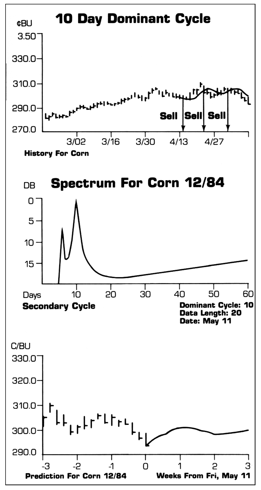
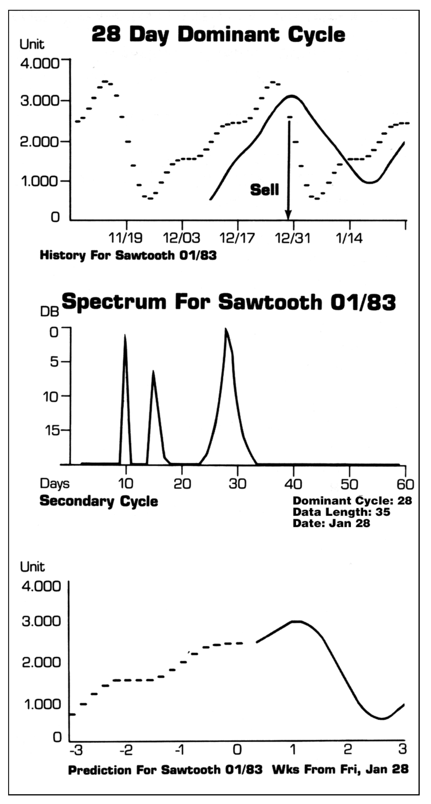

# Cycle Analysis: A Comparison of the Fourier and Maximum Entropy Methods

- **Author:** John F. Ehlers
- **Publication:** Technical Analysis of STOCKS & COMMODITIES, Volume 4, Number 6, pp. 209--214
- **Article URL:** [Article PDF](https://technical.traders.com/archive/article.asp?file=\V04\C06\CYC.pdf)

---

The motivation for reducing price history to a mathematical expression is clear. If we can describe the prices mathematically, we have the means to extend the equation into the future to predict what the prices will be. Cycle analysis is particularly attractive because, if a simple cycle is present and will extend into the future, all we have to do is to wait until the prices reach a valley to buy and then wait again for the price to reach the crest of a cycle before we sell.

One way to represent prices mathematically is to describe the curve in terms of a power series expansion. The price as a function of time is written as the infinite series:

$$P(t) = C_0 + C_1 t + C_2 t^2 + C_3 t^3 + C_4 t^4 + \ldots  \tag{1}$$

where the $C_n$'s are the coefficients of the respective $n$th power term. The first coefficient $C_0$ is just the average value of the price. The second term is linearly related to time, and therefore can be described as the trendline. The remaining terms introduce curves and the coefficients are adjusted to best approximate the price curve when they are summed together.

A power series is only one way to mathematically describe price, but it is perhaps the easiest to understand because one can relate it to the average price and the trendline. For this article, we want to describe the price in terms of sine waves to recover cyclic content.

## Sine Wave Properties

We have seen that we can synthesize waveshapes as combinations of sine waves of different amplitudes ("Understanding Cycles," *Stocks & Commodities*, December 1985). If we can synthesize waveshapes with sine waves, we can also analyze these waveshapes to recover each of the components which comprise the total. More generally, we can analyze any waveshape in terms of sine wave components. To do this, we represent the price as the doubly infinite series:

$$P(t) = a_0 + a_1\cos(x) + a_2\cos(x/2) + a_3\cos(x/3) + a_4\cos(x/4) + \ldots$$
$$+ b_1\sin(x) + b_2\sin(x/2) + b_3\sin(x/3) + b_4\sin(x/4) + \ldots \tag{2}$$

where $x$ is shorthand for $2\pi t$.

The number for each term is its period. For example, if the number of the period is 14 and time ($t$) increases from zero, then one cycle is complete when it reaches 14 because the phase of the sine wave would have reached $2\pi$, or 360 degrees. As $t$ is increased further, the second cycle of this term would begin. The cycles can continue indefinitely. The relative amplitude of the $a$ and $b$ coefficients of the same number in the above equation determine the relative phase of the sine wave.

In the above equation, imagine that all the coefficients were zero except $a_0$ and $a_{14}$. This would be an ideal situation for a trader because the price description would consist only of an average value and a pure 14-day cycle. The purpose of cycle analysis is to recover the cycles when the situation is far more complicated.

> If we can describe prices mathematically, we can extend the equations into the future to predict what the prices will be.

The physical picture of what we are trying to do is to run the data through a 2-day filter and measure the amplitude of the 2-day cycle, run the data through a 3-day filter and measure the amplitude of the 3-day cycle, and so on. We can essentially do this operation mathematically because sine waves are orthonormal functions. The following properties are important for this procedure:

$$\int_0^{2\pi} \sin(mX)\sin(nX)\,dX = 0 \quad \text{for } m \neq n$$

$$\int_0^{2\pi} \cos(mX)\cos(nX)\,dX = 0 \quad \text{for } m \neq n$$

$$\int_0^{2\pi} \sin(mX)\cos(nX)\,dX = 0 \quad \text{for } m + n$$

$$\int_0^{2\pi} \sin(nX)\sin(nX)\,dX = \pi$$

$$\int_0^{2\pi} \cos(nX)\cos(nX)\,dX = \pi$$

These equations express properties which make mathematical analysis easy. For example, all we have to do to recover the amplitude of the 14-day cycle in equation 2 is to multiply both sides of the equation by $\cos(x/14)$ and take the integral. All terms on the right-hand side of the equation go to zero except the $a_{14}$ term which is multiplied by $\pi$. Equation 2 then becomes:

$$\int_0^{2\pi} P(t)\cos(x/14)\,dx = \pi a_{14}$$

Therefore, the amplitude of the 14-day cycle coefficient is calculated by the evaluation of a simple integral.

## Fourier Analysis

Conventional Fourier analysis follows the above procedure to recover the amplitude of the coefficients of the Fourier series expansion of the function. Relative phase is lost in the process of taking the integral and so the power in each component is found by adding the squares of the corresponding $a$ and $b$ coefficients.

The main constraint of Fourier analysis is that the properties of the orthonormal functions require that the integral be taken over an integer number of cycles. This restricts the resolution available by this analysis. For example, assume we use 64 data points for analysis. Then, a 64-day cycle is the longest that can be found because longer cycles cannot complete a full cycle. In addition, the next shortest cycle that can be found is a 32-day cycle because it has two full cycles over the data length. The next shortest cycle available is 64/3=21.3 days. Continuing, the cycles available are 64/4=16 days, 64/5=12.8 days, 64/6=10.7 days, etc. There is no way to find the cycle amplitude for cycles between 16 days and 21.3 days except by increasing the length of the database to something greater than 64 days. This is a distinct disadvantage for short-term trading.

One of the problems with a longer database is that the phase of the shorter cycles can shift over the length of the database, canceling out its amplitude as calculated. However, this calculation can also be in error because the current value of the shorter cycle may be large. Perhaps saying the same thing another way is that the longer databases allow fundamentals to influence the short-term technical analysis. This lack of resolution is the fundamental drawback of conventional Fourier analysis for trading.

It perhaps needs mentioning that the database cannot be adjusted to produce an integer number of cycles for each of the components because the implicit assumption is that the selected length of the data is repeated over and over in both time directions to infinity. If the database is adjusted for calculation, it amounts to changing the data and gross calculation distortions will occur.

## Fast Fourier Transforms

Longer databases are required to produce high resolution. Longer databases introduce a second problem with Fourier analysis. This second problem is that a larger number of calculations is required, and a large amount of computer time is consumed to accomplish the calculations. The problem is particularly acute with the interpreted BASIC language because the SIN and COS operations are performed in slowly accessed ROM lookup tables.

Algorithms have been developed that dramatically reduce the computation time for Fourier analysis. These are called Fast Fourier Transforms, or FFTs for short. One such program, written in Applesoft BASIC and suitable for trading analysis, is given in the listing.

## Maximum Entropy Method

Although the end result of finding the cycle amplitudes is the same, Maximum Entropy analysis is fundamentally different from Fourier analysis. In thermodynamics, entropy is a measure of unavailable energy. More appropriately, in information theory, entropy is the lack of information or the amount of noise. The analysis procedure is to remove cyclic content and then examine the residual for informational content. The process is repeated iteratively until the residual has maximum entropy.

No assumptions are made regarding the data outside the selected analysis period. That is, there is no constraint that the data repeat in either direction to infinity as was assumed with Fourier analysis. For this reason, there are no "end effect" distortions and distortions caused by the observation window are eliminated. Maximum Entropy responds maximally in the least-squared error sense to the data that it is presented and maximally ignores implied data.

The practical advantage of the Maximum Entropy method for trading is that a very high resolution can be obtained from a very short database. Typically, the only data required is about one cycle's worth of information. For example, four weeks of data is entirely adequate to isolate a 17-day cycle with high fidelity. This short data requirement means that the data is fresh and relevant to the current trading picture. Since the data is fresh, there is a higher probability that a measured dominant cycle will extend into the future retaining its current phase.

> Although the end result of finding the cycle amplitudes is the same, Maximum Entropy analysis is fundamentally different from Fourier analysis.

Retention of the phase relationship of the cycles is another advantage of the Maximum Entropy method. When the phase relationships are known, the cycles with their relative amplitudes can be extended into the future to form a complex prediction of the future prices. Under the right conditions this can be so accurate that it is almost scary.

I have written a computer program called MESA (for Maximum Entropy Spectral Analysis). An example of the program outputs is shown in Figure 1 for December 1984 corn. The first panel is the price history with an optimized (half dominant cycle) moving average superimposed on the price. The suggested trading signals are generated by the price crossing the optimized moving average. The second panel shows that the dominant cycle is 10 days for the 20 days of data used in the analysis. (MESA automatically selects the proper data length.) A lower amplitude 6-day cycle has been identified by the program. In the bottom panel, the most recent 3-week price history is shown for continuity with the 3-week prediction of future prices.



**FIGURE 1.** MESA program output for December 1984 Corn showing price history with optimized moving average (top), spectral analysis with dominant 10-day cycle (middle), and 3-week prediction (bottom).

Cycle analysis programs can be evaluated by synthesizing waveshapes from various sine waves and seeing if the program can take the composite wave shape apart to reproduce its components. Figure 2 shows such an analysis for MESA. I have synthesized a sawtooth waveshape from a dominant 30-day cycle, a 15-day cycle (second harmonic) at half amplitude, and a 10-day cycle (third harmonic) at one-third amplitude. Several periods of the sawtooth are shown in the top panel along with the optimized moving average.

The spectral components analyzed by the program are shown in the second panel. The 30-day dominant cycle was identified as a 28-day cycle, a 6.7 percent error. Still, this was done by using only 35 days of data. Moreover, the periods of the 15-day cycle and 10-day cycle were identified exactly. The half amplitude of the 15-day cycle and 10-day cycle was correctly identified at --6 dB, but the amplitude of the 10-day cycle should have been about --10 dB. I think the prediction in the bottom panel is awesome! The timing of the peak and the following valley of the predicted sawtooth is exactly the same as if the sawtooth were really allowed to extend into the future.



**FIGURE 2.** MESA analysis of a synthesized sawtooth waveshape showing price history (top), spectral decomposition with dominant 28-day cycle, 15-day and 10-day harmonics (middle), and prediction (bottom).

## Conclusions

Cycle analysis can be helpful for trading in markets that are non-trending. One can even identify simple cycles by "eyeball," and can use the existence of the cycle to advantage with a variety of technical indicators. Fourier analysis requires a relatively long database to produce results with high resolution (good selectivity). On the other hand, the Maximum Entropy method requires only a very short database to produce high resolution, with the result that the data is current and pertinent to the anticipated trades.

Maximum Entropy does not do an outstanding job on accurately measuring the relative amplitudes of the cycles and can be prone to producing spurious results, particularly if the database is too long. A significant feature of the Maximum Entropy method, complementing the use of current data, is that the relative phases of the cycles are retained so that a composite prediction of the future prices can be formed on the basis of the recent price history.

## Glossary

**(1) Doubly infinite series** — There is an infinite series of cosine terms and an infinite series of sine terms in the expression of equation 2.

**(2) Orthonormal** — A set of real and continuous functions is said to be orthonormal in the range $(a, b)$ if

$$\int_a^b U_m(t) U_n(t)\,dt = \begin{cases} 1 & \text{if } m = n \text{ (normal condition)} \\ 0 & \text{if } m \neq n \text{ (orthogonal condition)} \end{cases}$$

When the functions satisfy the first condition, they are said to be "normal"; when they satisfy the second condition, they are said to be "orthogonal." The normal condition means the amplitude is normalized over a given integration range, and allows the coefficients of the functions to be evaluated. The orthogonal condition means that the solution of an expression can be accomplished by linearly adding the different functions because they do not interact over the integration period for which the coefficients are evaluated. Sine and cosine functions of the Fourier transform are only one kind of orthonormal functions. Other examples include Bessel functions, Laguerre polynomials, Legendre functions, and Hermitian polynomials. These others have little application to trading.

**(3) Power** — I use the word "power" through an analogy to electrical waves. That is, each of the cosine waves and sine waves can be viewed as voltages. Electrical power is proportional to the square of voltage. The evaluation of the two lower equations on page 20 can thus be viewed as the square of the voltage terms (taken over the cycle), and are therefore analogous to power.

## Fast Fourier Transform Program

```basic
10  REM "FAST FOURIER TRANSFORM"
20  REM FOR APPLE II WITH 2 DISKS USING
    6
30  REM DATA IN CSI OR COMPU-TRAC FORMAT
40  REM BY JOHN F, EHLERS
45  REM COPYRIGHT (C) 1986 BY TECHNICA
    L ANALYSIS, INC..
50  HOME
60  DIM DF$(20)
70  HTAB 5:
    INVERSE :
    PRINT "*    FAST FOURIER TRANSFORM
     *":
    NORMAL
71  HTAB 19:
    PRINT "BY"
72  HTAB 14:
    PRINT "JOHN EHLERS"
73  HTAB 16:
    PRINT "BOX 1801"
74  HTAB 12:
    PRINT "GOLETA, CA 93116":
    PRINT
80  LET D$ = CHR$ (4)
90  PRINT D$ + "OPEN MASTER,L40,D2"
100 FOR I = 1 TO 20
110     PRINT D$ + "READ MASTER,R";I
120     INPUT DF$(I)
130     IF LEFT$ (DF$(I),5) = "99999"
        GOTO 150
140 NEXT I
150 PRINT D$ + "CLOSE"
160 FOR J = 1 TO I - 1
170     PRINT "("; CHR$ (J + 64);") ";
        MID$ (DF$(J),4,16)
180 NEXT J
190 PRINT "(V) VIEW NEW DATA DISK"
200 PRINT "(X) EXIT TO MENU":
    PRINT
210 PRINT "    SELECT ( )"; CHR$ (8);
    CHR$ (8);
220 POKE - 16368,0:
    GET X$:
    PRINT X$;")"; CHR$ (8); CHR$ (8);
230 IF X$ = "V" THEN
        HOME :
        VTAB 10:
        PRINT "INSERT NEW DATA DISK IN
         DRIVE 2":
        PRINT :
        PRINT "PRESS ";:
        INVERSE :
        PRINT "RETURN";:
        NORMAL :
        PRINT " TO CONTINUE":
        VTAB 22:
        POKE - 16368,0:
        GET S$:
        GOTO 30
240 IF X$ = "X" THEN
        HOME
250 LET SF = ASC (X$) - 64
260 IF SF ) = 1 AND SF ( = J - 1
    THEN
        290
270 HTAB 13:
    PRINT " "; CHR$ (8);:
    GOTO 220
280 IF K ( 120 OR K ) LR THEN
        PRINT "OOPS -RUN AGAIN":
        END
290 HOME :
    VTAB 10:
    INVERSE :
    PRINT  MID$ (DF$(SF),4,16):
    NORMAL :
    PRINT :
    PRINT
300 PRINT :
    PRINT D$ + "OPEN " + MID$ (DF$(SF
    ),4,16) + ",L40":
    PRINT D$ + "READ " + MID$ (DF$(SF
    ),4,16) + ",R0":
    INPUT X$:
    LET LR = VAL (X$)
310 PRINT D$ + "CLOSE"
320 IF LR ( 32 THEN
        370
330 IF LR ( 1024 THEN
        410
340 PRINT "CONTAINS ";LR;" RECORDS"
350 PRINT "A MAXIMUM 1024 RECORDS ARE
    ALLOWED":
    PRINT
360 PRINT "PRESS ";:
    INVERSE :
    PRINT "RETURN";:
    NORMAL :
    PRINT " TO CONTINUE":
    VTAB 22
370 PRINT "CONTAINS ONLY ";LR;" RECORD
    S"
380 PRINT "AT LEAST 32 RECORDS ARE REQ
    UIRED":
    PRINT
390 PRINT "PRESS ";:
    INVERSE :
    PRINT "RETURN";:
    NORMAL :
    PRINT " TO CONTINUE":
    VTAB 22
400 POKE - 16368,0:
    GET S$:
    HOME :
410 PRINT "CONTAINS ";LR;" RECORDS":
    PRINT
420 PRINT "ENTER ONLY 32, 64, 128, OR
    256"
430 PRINT "FOR ANALYSIS.  THIS NUMBER
    MUST BE"
440 PRINT "LESS THAN THE FILE LENGTH."
    :
    PRINT
450 INPUT "RECORDS FOR ANALYSIS? ";N
460 IF (N = 32 OR N = 64 OR N = 128
    OR N = 256 OR N = 512) AND N ( LR
    THEN
        480
470 PRINT :
    PRINT "OOPS - RUN PROGRAM AGAIN":
    END
480 DIM DA$(1024),F(1024),A(257,8)
490 PRINT :
    PRINT D$ + "OPEN " + MID$ (DF$(SF
    ),4,16) + ",L40"
500 FOR I = 1 TO N:
        PRINT D$ + "READ " + MID$ (DF
        $(SF),4,16) + ",R";(LR - N + I
        ):
        INPUT DA$(I):
    NEXT I
510 PRINT D$ + "CLOSE"
520 REM *** DATA CONVERTER ***
530 IF MID$ (DA$(1),23,5) ( > "99999
    " THEN
        550
540 LET DA$(1) = DA$(2)
550 FOR I = 1 TO N
560     LET F(I) = VAL ( MID$ (DA$(I)
        ,23,5))
570     IF MID$ (DA$(I),23,5) = "9999
        9" THEN
            LET F(I) = F(I - 1)
580 NEXT I
590 REM *** SPECTRUM ANALYSIS ***
600 LET PI = 3.1415926
610 LET R0 = INT (N / 4):
    LET S0 = 8
620 FOR I = 1 TO R0 + 1:
        FOR J = 1 TO 8:
            LET A(I,J) = 0:
        NEXT J:
    NEXT I
630 FOR I = 1 TO R0
640     FOR J = 1 TO S0 STEP 2
650         LET K = 4 * (I - 1) + .5
            * (J + 1)
660         LET A(I,J) = F(K)
670         LET A(I,J + 1) = 0
680     NEXT J
690 NEXT I
700 LET M = LOG (N) / LOG (2):
    LET N2 = N / 2:
    LET N1 = N - 1:
    LET J = 1
710 FOR I = 1 TO N1
720     IF I ) = J THEN
            850
730     LET R = INT ((J - 1) / 4)
740     LET S = 2 * J - 8 * R
750     LET R1 = INT ((I - 1) / 4)
760     LET S1 = 2 * I - 8 * R1
770     LET R1 = R1 + 1
780     LET R = R + 1
790     LET T = A(R,S)
800     LET A(R,S) = A(R1,S1)
810     LET A(R1,S1) = T
820     LET T = A(R,S - 1)
830     LET A(R,S - 1) = A(R1,S1 - 1)
840     LET A(R1,S1 - 1) = T
850     LET K = N2
860     IF K ) = J THEN
            910
870     LET J = J - K
880     LET K = K / 2
890     GOTO 860
900 NEXT I
910 LET J = J + K
920 NEXT I
930 LET L0 = 1
940 FOR L = 1 TO M
950     LET L1 = L0
960     LET L0 = 2 * L0
970     LET V = 1
980     LET W = 0
990     LET Z = PI / L1
1000    LET W1 = COS (Z)
1010    LET W2 = SIN (Z)
1020    FOR J = 1 TO L1
1030        FOR I = J TO N STEP L0
1040            LET K = I + L1
1050            LET R1 = INT ((K - 1)
                / 4)
1060            LET S1 = 2 * K - 8 * R1
1070            LET R1 = R1 + 1
1080            LET A1 = A(R1,S1 - 1)
1090            LET B1 = A(R1,S1)
1100            LET T = A1 * V - B1 * W
1110            LET U = A1 * W + B1 * V
1120            LET R = INT ((I - 1)
                / 4)
1130            LET S = 2 * I - 8 * R
1140            LET R = R + 1
1150            LET A(R1,S1 - 1) = A(R,
                S - 1) - T
1160            LET A(R1,S1) = A(R,S)
                - U
1170            LET A(R,S - 1) = A(R,S
                - 1) + T
1180            LET A(R,S) = A(R,S) + U
1190        NEXT I
1200        LET U = V * W1 - W * W2
1210        LET W = V * W2 + W * W1
1220        LET V = U
1230    NEXT J
1240 NEXT L
1250 LET Z = - 1E6
1260 FOR I = 1 TO R0 / 2
1270    FOR J = 1 TO S0 STEP 2
1280        IF I = 1 AND J = 1 THEN
                1310
1290        LET A(I,J) = SQR (A(I,J)
            * A(I,J) + A(I,J + 1) * A(
            I,J + 1))
1300        IF A(I,J) ) Z THEN
                LET Z = A(I,J)
1310    NEXT J
1320 NEXT I
1330 HOME :
    PRINT "SPECTRUM FOR " + MID$ (DF$(
    SF),4,16)
1340 PRINT
1350 PRINT "PERIOD     RELATIVE AMPLITUD
    E"
1360 PRINT "(DAYS)          (DB)":
    PRINT
1370 LET K = 0
1380 LET P = 1000
1390 FOR I = 1 TO R0 / 2
1400    FOR J = 1 TO S0 STEP 2
1410        IF I = 1 AND J = 1 THEN
                1460
1420        LET L = INT (N / K + .25)
1430        IF L + 1 ) P THEN
                1460
1440        LET P = L
1450        PRINT TAB( 2);L; TAB( 16);
            INT (1000 * LOG (A(I,J)
            / Z) / LOG (10)) / 100
1460        LET K = K + 1
1470    NEXT J
1480 NEXT I
    PROGRAM LENGTH: 152 LINES / 3304 BYTES
```

---

## BibTeX

```bibtex
@article{ehlers_1986_cycle_analysis_comparison,
  author    = {John F. Ehlers},
  title     = {Cycle Analysis: A Comparison of the {Fourier} and Maximum Entropy Methods},
  journal   = {Technical Analysis of STOCKS \& COMMODITIES},
  volume    = {4},
  number    = {6},
  pages     = {209--214},
  year      = {1986},
  url       = {https://technical.traders.com/archive/article.asp?file=\V04\C06\CYC.pdf}
}
```
