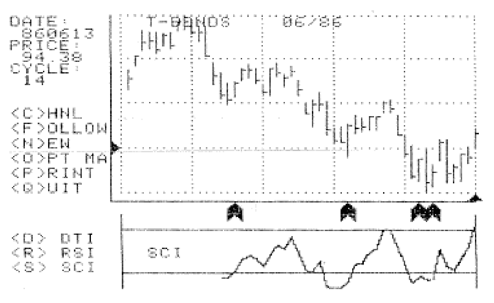
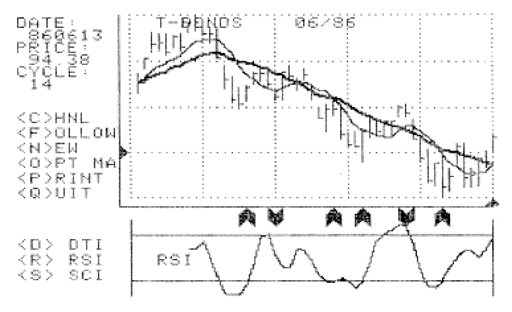
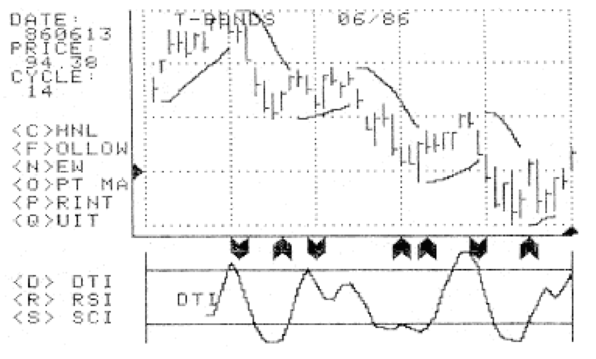

# A Complete Computer Trading Program (Part 1)

- **Author:** John F. Ehlers
- **Publication:** Technical Analysis of STOCKS & COMMODITIES, Volume 5, March 1987, pp. 102--104
- **Article URL:** [Article PDF](https://technical.traders.com/archive/article.asp?file=\V05\C03\ACOMPLE.pdf)

---

This is the first of four articles that give a description and computer listing, enabling you to perform technical analysis with your computer. In the second article I will cover the basics of reading data from a standard format and plotting price history on a graph. The third article will allow you to selectively plot moving averages and J. Welles Wilder's Parabolic System over the price history. The fourth and concluding article will give the computer listings to calculate Commodity Channel Index (CCI), Directional Trend Indicator (DTI), or Relative Strength Index (RSI) below the price history so that they can be compared.

When finished the program will produce charts similar to my Summit program, shown in Figures 1 through 3. Figure 1 shows the price history along with the CCI plot. The arrows are BUY signals produced by the CCI. The date and price are displayed to the left of the chart for the indicated horizontal and vertical cursor positions at the edge of the chart. The dominant cycle was selected as 14 days because I had previously measured the dominant cycle using my MESA program. The selectable options are at the left of the chart. Figure 2 shows the moving averages for the dominant cycle and half dominant cycle as well as the RSI and its BUY/SELL signals. Figure 3 shows the Parabolic System and the DTI plots.

Make no mistake. This is not a one evening project! Hopefully the results will be worth your effort if you embark on writing the complete program. Possibly you can pick up some programming ideas if you already have a plotting program and are interested in different ways to approach the problem.



**FIGURE 1.** T-Bonds price history with Commodity Channel Index (CCI) and BUY signals.



**FIGURE 2.** T-Bonds with moving averages and Relative Strength Index (RSI) with BUY/SELL signals.



**FIGURE 3.** T-Bonds with Parabolic System and Directional Trend Indicator (DTI).

## Computer Compatibility

The program is written in Applesoft BASIC, and will play directly on any of the Apple II computers having at least 48K of memory and one disk drive. I have tried to write the program in generic BASIC statements wherever possible for ease of translation to other machines.

## Shape Table

One of the problems programmers have with the Apple II family of computers is that there is no natural way to mix graphs and text on the high-resolution graphics displays. However, John Rogers of Madison, WI developed a handy machine code program in 1980 that allows you to type text on your high-resolution graphs with the same PRINT, HTAB, VTAB, etc. commands that you use for normal text. The characters are created as shapes and then these shapes are used to produce characters on the high-resolution graphics screen.

Mr. Rogers' program is called "HIGH-RES-TEXT/3" and is now in the public domain. Writing this binary program is quite a bit of work, but it is included here because you may wish to use this approach in other applications where you want to put text on the graphs that you draw. This routine is only required for those of you using an Apple computer.

Listing 1 contains the complete machine language program and shape table for generating both upper and lower case text on an Apple II computer high-resolution graphics screen. The following procedure should be used to enter and save the binary file.

The numbers on the far left of the assembly listing are Hexadecimal addresses, and the numbers immediately to the right are the contents of those addresses. To enter, get into the Monitor (CALL -151) and type `6000:`. Now type the contents `A5 E6 C9 20 F0 05 C9 40 F0 01`. You can enter up to 85 bytes (pairs of numbers) before overflow occurs. Before you have typed this many, hit Return and continue with a colon and more pairs of data bytes.

To save the program, you need the starting address and the length of the file. These are $8000 and $680, respectively. Assuming you are back in BASIC (by pressing CTRL-C Return from the Monitor) and have your disk drive ready, type `BSAVE HIGH-RES-TEXT/3,A$8000,L$680`. To aid in this somewhat laborious procedure, you may wish to refer to your Apple II Reference Manual.

This complete computer program (revised by Jack K. Hutson), along with an explanatory example BASIC program, is available on disk directly from Technical Analysis of Stocks & Commodities magazine for $49.95. Please reference Volume 5 disk. An IBM version of this program is available directly from John Ehlers, P.O. Box 1801, Goleta, CA 93116.

---

## BibTeX

```bibtex
@article{ehlers_1987_complete_trading_program_part1,
  author    = {John F. Ehlers},
  title     = {A Complete Computer Trading Program (Part 1)},
  journal   = {Technical Analysis of STOCKS \& COMMODITIES},
  volume    = {5},
  number    = {3},
  pages     = {102--104},
  year      = {1987},
  url       = {https://technical.traders.com/archive/article.asp?file=\V05\C03\ACOMPLE.pdf}
}
```
