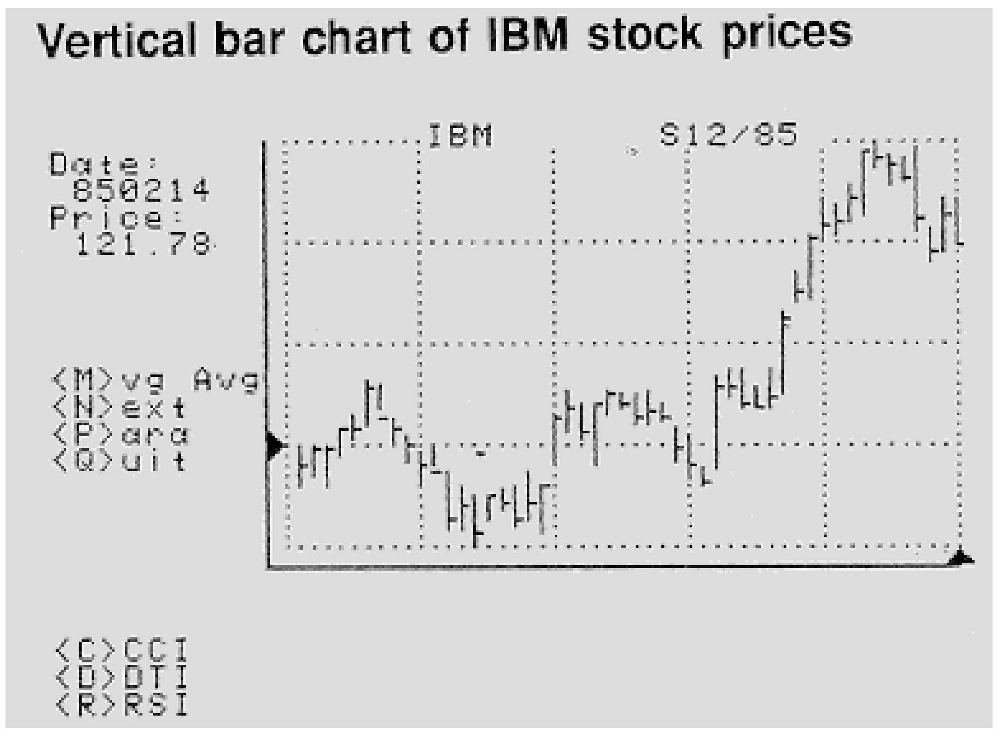

# A Complete Computer Trading Program (Part 2)

- **Author:** John F. Ehlers
- **Publication:** Technical Analysis of STOCKS & COMMODITIES, Volume 5, April 1987, pp. 144--147
- **Article URL:** [Article PDF](https://technical.traders.com/archive/article.asp?file=\V05\C04\ACOMPLE.pdf)

---

This program works with the standard CompuTrac or CSI (Commodity Systems, Inc.) disk data reading format (Table 1). The fundamental idea of this program is to take a 40-character string record for each day's data and break it down into eight columns. You can consider each day's entry as a column. The end result is a matrix that measures eight rows high by "N" columns long. The first row is the day of the week and date as NYYMMDD for the year, month, and day. Thereafter, the rows are: Open, High, Low, Close, Open Interest, Volume, and Study. This program uses only the date, high, low, and close.

Data storage within the memory of a computer is divided into rows and columns to form a matrix or array in which data is held. The matrix can be thought of as a grid system with eight rows (0-7) and "N" columns.

> A program that will allow you to immediately begin to chart the high, low and closing prices of your securities.

All eight rows (0-7) may be used. For example, nine weeks of daily data will fill 45 columns: five trading days per week times nine weeks = 45 days. Data for row 7 (Study) is not stored on disk; Study results are stored in memory only in this row after studies are run. Other rows in the matrix may be overwritten with study data when studies store more than one set of results since the program needs only the price data.

Records in the individual disk data files are interpreted exactly the same whether the file was created as a Commodity or Stock file.

**Record length:** 40 bytes

**Number of records:** One for each weekday from day 1 of starting month to last day of ending month.

**Record layout:** Record #0 = Record # of the last day in the file which contains actual data.

**Table 1: Data Matrix Layout**

|       |   |         | Day 1 | Day 2 | Day 3 | Day 4 | Day 5 | Day 6 | ... | Day "N" |
|-------|---|---------|-------|-------|-------|-------|-------|-------|-----|---------|
| **R** | 0 | Date    | .     | .     | .     | .     | .     | .     | ... | .       |
| **o** | 1 | Open    | .     | .     | .     | .     | .     | .     | ... | .       |
| **w** | 2 | High    | .     | .     | .     | .     | .     | .     | ... | .       |
| **s** | 3 | Low     | .     | .     | .     | .     | .     | .     | ... | .       |
|       | 4 | Close   | .     | .     | .     | .     | .     | .     | ... | .       |
|       | 5 | Volume  | .     | .     | .     | .     | .     | .     | ... | .       |
|       | 6 | Op.Int. | .     | .     | .     | .     | .     | .     | ... | .       |
|       | 7 | Study   | .     | .     | .     | .     | .     | .     | ... | .       |

**Active Records**

| Byte  | Contains                   |
|-------|----------------------------|
| 1     | Day of week (1-5) 9=Holiday |
| 2--7  | Date (YYMMDD)              |
| 8--12 | Open                       |
| 13--17| High                       |
| 18--22| Low                        |
| 23--27| Close                      |
| 28--33| Volume                     |
| 34--39| Open interest              |
| 40    | Carriage return            |

The Open, High, Low, and Close are stored as integers to which a conversion factor must be applied. Dummy records consist of all 9's except for the date which is valid and laid out when the file is created. If Volume and Open Interest contain five figures, then they are stored in the file as the exact five figures; if Volume and/or Open Interest contain six figures (or more), then the last five figures in the record are the first five significant figures, and are multiplied by 10 to the power of X, with X being the first digit in the record. For example, 213456 = 13456 times 10 squared = 1,234,600.

## Plotting Program

For this program, plotting will be done on page 2 graphics with the HGR2 command. The HGR2 can be replaced with SCREEN 1 on an IBM PC. The Apple ][ screen is 280 pixels wide by 192 pixels high. Since SCREEN 1 on a PC measures 320 by 200, you may want to move the charts a little to the right to make more room for text characters on the left of the chart. The Apple HPLOT command is equivalent to the IBM LINE command.

The plotting program starts at line 2000. When you enter this program, use the line numbers as they are given because the programs for the missing line numbers will be supplied in subsequent articles.

Before we begin, I would like to give a little note of advice on typing the program. First, the listing is made directly from a working version of the program and is therefore as error free as possible. If you have difficulty running the program, it is probably because of a typing error. One of the more common errors is to mistake an O (oh) for a 0 (zero). I use the letter I as an integer variable throughout the program and it can be easy to mistake the I (eye) for a 1 (one). So, the caution is to be precise and careful when typing the program to avoid hours of debugging. Computers are notoriously literal, and every little comma or semicolon has a meaning.

Lines 700 through 720 find the highest high (HH) and the lowest low (LL). These scale factors rescale the X(2,I) (high), X(3,I) (low), and X(4,I) (close) for direct plotting on the screen. Plotting starts at five pixels from the very top of the screen to give us a little breathing room for our vertical cursor.

Line 50 loads HIGH-RES-TEXT/3 from disk (see previous issue of *Stocks & Commodities*), turns on page 2 graphics, and does some other graphics housekeeping. We then plot the framework for our graph in lines 2000 through 2010. The framework is 120 pixels high and 200 pixels wide for what I think is a pleasant aspect ratio. Horizontal dots are placed to correspond to each trading day. The vertical dots correspond to the price resolution of the vertical cursor. The messages at the left of the chart are printed with lines 2010-2030 and line 2050 subroutine. PC users can print the data directly at the correct position using the LOCATE command. If any of the characters look funny you probably have an error in typing HIGH-RES-TEXT/3 and you should review it again from the last issue. The entire set of price graphing statements is contained in line 2040.

I have described a complete plotting computer program that will allow you to immediately begin to chart the high, low and closing prices of your securities. You should debug this much of the program because next month we will add the Parabolic System and moving averages to the chart. I suggest that you obtain back issues of *Technical Analysis of Stocks & Commodities*, starting with December 1985 because the concluding article of this series will introduce Commodity Channel Index, Directional Trend Indicator and Relative Strength Index without reference to the rationale of their use except by reference to previous articles.

**Reference:** CompuTrac System Operating Manual, CSI Quicktrieve User Manual

This complete computer program (revised by Jack K. Hutson), along with an explanatory example BASIC program, is available on disk directly from Technical Analysis of Stocks & Commodities magazine for $49.95. Please reference Volume 5 disk. An IBM version of this program is available directly from John Ehlers, P.O. Box 1801, Goleta, CA 93116.



**FIGURE 1.** Vertical bar chart of IBM stock prices.

## Program Listing

```basic
10 REM COMPLETE TECHNICAL ANALYSIS BY JOHN F. EHLERS
   MODIFIED BY JACK K. HUTSON
   (C) 1987 TECHNICAL ANALYSIS, INC.
20 REM ! INTEGER I,J,K,L,N,O,S,X,Y,Z,ST,BG,HO,EP,EL,PL,X1,G1,Y1,YC,XC,DC,HC,QC,LA
30 LOMEM: 24576:
   REM FORCE VARIABLES ABOVE HI-RES PAGE 2 GRAPHICS
40 LET BG = 14720:
   LET HO = BG + 609:
   LET EP = BG + 616:
   LET EL = BG + 623:
   REM MAXIMUM PROGRAM SIZE 12672 BYTES
50 LET D$ = CHR$(4):
   PRINT D$ "PR#0":
   HGR2:
   PRINT D$ "BRUN HIGH-RES-TEXT/3,A"BG:
   DIM X(7,128),Y(2,128),S$(20):
   CALL HO
100 HOME:
    HGR2:
    REM SELECT & LOAD STOCK OR COMMODITY DATA FROM CSI OR COMPUTRAC DISK FORMAT.
500 INPUT "Insert data disk in active drive <RTN> ";A$:
    PRINT D$ "OPEN MASTER,L40":
    LET S$(0) = "Change Disk"
510 FOR I = 1 TO 20:
    PRINT D$ "READ MASTER,R"I:
    INPUT "" A$:
    ON LEFT$(A$,3) = "999" GOTO 520:
    LET S$(I) = MID$(A$,4,17):
    NEXT I
520 LET N = I - 1:
    PRINT D$:
    HOME:
    HGR2:
    FOR I = 0 TO N:
    PRINT I" - "S$(I)
    NEXT I
530 INPUT "Select an Issue <RTN> ";X:
    ON X = 0 GOTO 500:
    ON X < 1 OR X > N GOTO 530:
    PRINT D$ "READ MASTER,R"X
540 REM FIND CONVERSION FACTOR AND DIVISOR IF ANY
550 INPUT A$:
    LET CF = VAL(MID$(A$,21,2)):
    LET A = ABS(CF):
    IF CF < -2 THEN
    LET A = 2
560 LET F = 1 / (10 ^ ABS(A)):
    IF CF < 0 THEN
    LET DV = 2 ^ (2 - CF) * F
570 LET C$ = MID$(A$,4,17):
    REM CONTRACT OR STOCK NAME
580 PRINT D$ "CLOSE MASTER":
    PRINT D$:
    PRINT D$ "OPEN "C$",L40":
    PRINT D$ "READ"C$:
    INPUT LA:
    REM # OF RECORDS IN FILE
590 IF LA < 50 THEN
    HOME:
    HGR2:
    PRINT "File must have at least 50 records.":
    GOTO 500
600 LET K = LA - 49:
    PRINT "Loading data ...":
    LET I = 50:
    FOR J = LA TO 1 STEP -1:
    LET O = PEEK(PEEK(47095) + 49289):
    REM TURN THE DISK MOTOR ON
610 PRINT D$ "READ"C$",R"J:
    INPUT A$:
    ON LEFT$(A$,1) = "9" GOTO 690:
    LET X(0,I) = VAL(MID$(A$,2,6)):
    REM DAY & DATE NYYMMDD
620 LET X(1,I) = VAL(MID$(A$,8,5)) * F:
    REM OPEN
630 LET X(2,I) = VAL(MID$(A$,13,5)) * F:
    REM HIGH
640 LET X(3,I) = VAL(MID$(A$,18,5)) * F:
    REM LOW
650 LET X(4,I) = VAL(MID$(A$,23,5)) * F:
    REM CLOSE
660 ON CF > -1 GOTO 680:
    REM FOR 8THS AND 32NDS
670 FOR K = 1 TO 4:
    LET O = INT(X(K,I)):
    LET U = X(K,I) - O:
    LET X(K,I) = O + U / DV:
    NEXT K
680 LET I = I - 1:
    IF I < 1 THEN
    LET J = 1
690 NEXT J:
    PRINT D$ "CLOSE"C$:
    LET O = PEEK(PEEK(47095) + 49288):
    PRINT D$:
    REM DATA IS NOW IN ARRAY X
700 LET HH = 0:
    LET LL = 1E6:
    FOR I = 1 TO 50:
    IF X(2,I) > HH THEN
    LET HH = X(2,I)
710 IF X(3,I) < LL THEN
    LET LL = X(3,I)
720 NEXT I:
    FOR I = 1 TO 50:
    FOR J = 1 TO 4:
    LET X(J,I) = -120 * (X(J,I) - HH) / (HH - LL) + 5:
    NEXT J:
    NEXT I:
    REM SCALE FOR APPLE HI-RES GRAPHICS
1000 GOSUB 2000
2000 HGR2:
     CALL BG:
     HCOLOR= 3:
     SCALE= 1:
     ROT= 0:
     HPLOT 64,5 TO 64,131 TO 270,131:
     FOR X = 70 TO 270 STEP 40:
     FOR Y = 5 TO 125 STEP 3:
     HPLOT X,Y:
     NEXT Y:
     NEXT X
2010 FOR Y = 5 TO 125 STEP 30:
     FOR X = 70 TO 270 STEP 4:
     HPLOT X,Y:
     NEXT X:
     NEXT Y:
     VTAB 1:
     HTAB 17:
     PRINT C$:
     LET S$ = "Date:":
     LET S = 2:
     GOSUB 2050:
     LET S$ = "Price:":
     LET S = 4:
     GOSUB 2050
2020 LET S$ = "<M>vg Avg":
     LET S = 10:
     GOSUB 2050:
     LET S$ = "<N>ext":
     LET S = 11:
     GOSUB 2050:
     LET S$ = "<P>ara":
     LET S = 12:
     GOSUB 2050
2030 LET S$ = "<Q>uit":
     LET S = 13:
     GOSUB 2050:
     LET S$ = "<C>CCI":
     LET S = 20:
     GOSUB 2050:
     LET S$ = "<D>DTI":
     LET S = 21:
     GOSUB 2050:
     LET S$ = "<R>RSI":
     LET S = 22:
     GOSUB 2050
2040 FOR I = 1 TO 50:
     LET X = 70 + 4 * I:
     HPLOT X,X(2,I) TO X,X(3,I):
     HPLOT X,X(4,I) TO X+2,X(4,I):
     NEXT I:
     RETURN
2050 VTAB S:
     HTAB 1:
     PRINT S$:
     RETURN:
     REM DRAW CHART
```

**PROGRAM LENGTH:** 36 lines / 2199 bytes

---

## BibTeX

```bibtex
@article{ehlers_1987_complete_trading_program_part2,
  author    = {John F. Ehlers},
  title     = {A Complete Computer Trading Program (Part 2)},
  journal   = {Technical Analysis of STOCKS \& COMMODITIES},
  volume    = {5},
  number    = {4},
  pages     = {144--147},
  year      = {1987},
  url       = {https://technical.traders.com/archive/article.asp?file=\V05\C04\ACOMPLE.pdf}
}
```
