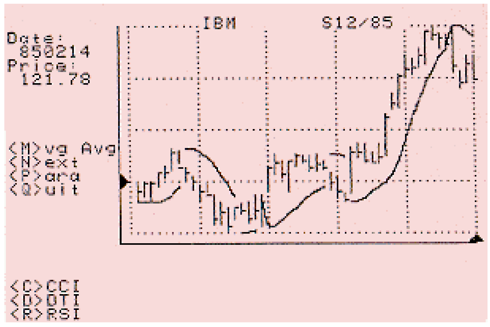
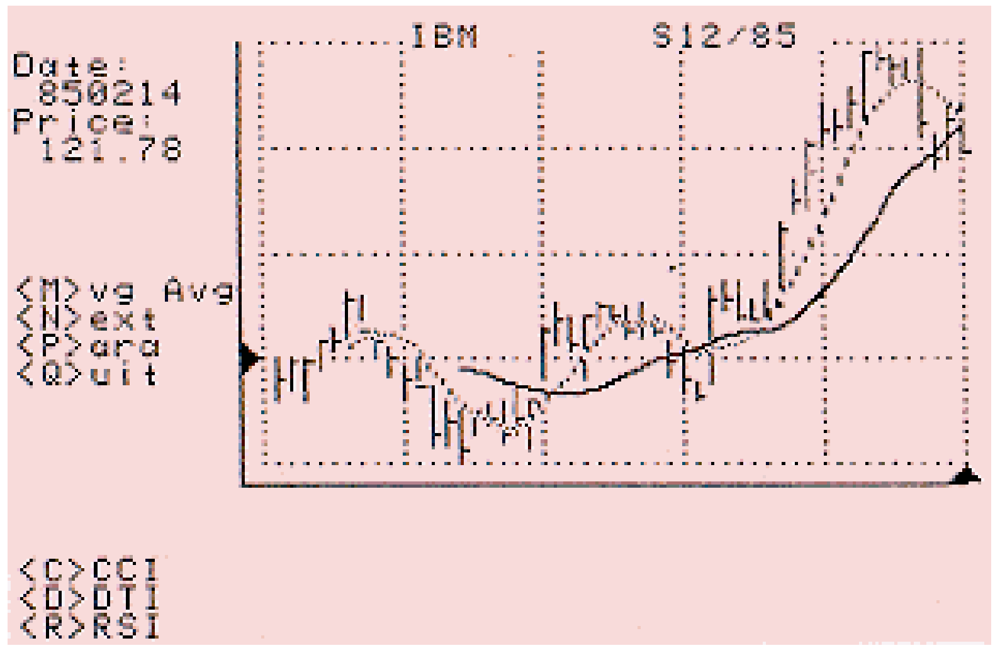

# A Complete Computer Trading Program (Part 3)

- **Author:** John F. Ehlers
- **Publication:** Technical Analysis of STOCKS & COMMODITIES, Volume 5, May 1987, pp. 175--179
- **Article URL:** [Article PDF](https://technical.traders.com/archive/article.asp?file=\V05\C05\ACOMPLE.pdf)

---

This is the third of four articles that give a description and BASIC computer program listing enabling you to perform technical analysis on your Apple ][ computer.

In the first two installments of this series, we started with a data read program and added a plotting program for the high, low and close of prices. This article will add to that program, enabling you to plot and superimpose moving averages and the Parabolic system over the price history.

Adding Listing 1 to your current plotting program is very easy. Simply LOAD the plotting program from the last issue and then type in the line numbers and program as given in Listing 1. When you have completed the typing, just SAVE the program to your disk.

After you have typed the program and saved it, you can immediately begin to use the moving average and Parabolic system functions you have created.

## Parabolic System

Parabolic is a trading system that gives protective stops that get successively tighter to protect an accrued profit. The parabolic gets its name from the shape of the curve it generates, particularly in a trending market. The Parabolic system has nothing to do with cycles, however I think the idea of protecting profits with ever-tightening stops is a good idea.

J. Welles Wilder, Jr. thoroughly discusses the Parabolic Time/Price System in Section II of his book *New Concepts in Technical Trading Systems*. I have taken the liberty of adjusting some of the constants from Mr. Wilder's recommendations. You may experiment with these constants in your program and adjust them to your own preference if you disagree with me.

The parabolic stop follows only a few well-defined rules that are simple to program. Assuming we start with a long position, the stop will be the lowest previous low. Tomorrow's stop will be today's stop plus the difference between today's high and today's stop, the difference being multiplied by a constant called the acceleration factor. A second rule is that the acceleration factor is increased by a constant amount each time a higher high is reached while in the position. The final rule is that if the price touches the stop, then the position is reversed and the initial stop becomes the highest high while you were in the long position. Rules are applied in a similar manner for the short position.

The program listing for the Parabolic system is given in lines 4000-4090 of the listing. In line 4010 we set the first two points of the Parabolic to be equal to the first low. The computer program has already scaled the price data for charting before these calculations are made. We also establish the initial conditions for the acceleration factor (AF) and the highest high (H) and lowest low (L). I place the initial value of the acceleration factor at 0.02, causing the difference between the high and the stop to decrease 2% for each day that does not have a new high. This is one of the constants you may want to adjust. The constants H and L refer only to the immediate highest high or lowest low and are distinctly different from the HH and LL constants used to scale the entire chart.

You may recall that we are always using the last 50 records from your database. If the average of X(2,I) (high) and X(3,I) (low) is greater than X(7,I) (Parabolic), then we have a short position and are therefore directed to line 4060. The reason we define a short position in this manner, rather than as the point where the stop is greater than the average is due to the numbering system used for plotting. Zero is at the top of the screen and the numbers increase toward the bottom of the screen. Since the prices already have been scaled for plotting, the average price will be greater than the stop for a short position.

In line 4020, the next day's Parabolic is adjusted as the difference between the current high and the current stop, multiplied by the acceleration factor. In line 4020, if we get a new high, the acceleration factor is increased by 5%. You may want to adjust this constant because the acceleration factor is increased by 5% each time a new high is reached until limited at 30% in line 4030.

> The Gaussian distribution estimating feature of unknown events has been applied, and misapplied, to trading.

Line 4030 compares the low to the stop to sense whether the position has been stopped out and a reversal should occur. If this is not true, the calculations are accomplished for the next data point due to lines 4040 and 4100. However, if the long position is stopped out, the program is directed to line 4050 where the acceleration factor is reset to 2%, the initial stop for the short position is the highest previous high and the highest high constant H is reset to the bottom of the screen. Then, the calculations proceed for the next data point, but the criteria at line 4060 directs the calculation to the short position line numbers.

The short position calculations are made in lines 4060-4090. Each line is an exact counterpart to a similar calculation for the long positions previously described in lines 4020-4050.

When you plot these stops by running your program you'll quickly see, by the lines they create, why they are called Parabolic. I think a word of caution in the use of the Parabolic system is in order because it tends to create an optical illusion that might be interpreted as the entry and exit points of a position. It would be an extraordinary approach if this were true. Be careful to examine the real prices for the entry and exit points when evaluating the profitability of this approach.



**FIGURE 1.** Parabolic system plotted over IBM stock prices.

## Moving Averages

The famous mathematician Gauss showed that the best estimate of an unknown event with random distribution is the average of the observations. The probability distribution about the average (or mean value) is called the Gaussian distribution. We encounter this situation in many aspects today. For example, the best estimate of IQ is 100, the mean value of observations. The IQs of most people are clustered around the mean. Wide deviations from the mean are uncommon, and we call these people either idiots or geniuses. The Gaussian distribution estimating feature of unknown events has been applied, and misapplied, to trading.

One of the more common trading tools is the moving average. As commonly used, the average can be either uniformly weighted over a fixed number of data points known as a moving window or exponentially weighted. We will be interested here only in the uniformly weighted moving average. In this approach, an average is taken over a fixed number of data points immediately prior to the data point for which the calculation is made. This is the fixed window. As we progress to the next data point, the number of data points over which the average is taken is constant so the window also moves by one data point.

I would like to make our application of moving averages in this program perfectly clear. This use of the moving average applies solely to price functions that have cyclic content. The application of these moving averages are not intended to be applied to trending markets. (See the December 1985 issue of *Technical Analysis of Stocks & Commodities* for a more complete description of the use of moving averages with cycles.)

As it turns out, the moving average taken over a pure cycle will yield the trendline of that cycle. In addition, the most sensitive moving average of that cycle is taken over the half-cycle. One of the characteristics of these two moving averages is that they theoretically cross just as the cyclic price reaches a maximum or minimum. We would like to correlate this with the price action on our graph, and so the object of the computer program is to plot these two moving averages as superpositions over the price history.

With reference to the moving average part of the listing, lines 4500-4530 accomplish the average of the closes, X(4,I). Rather than recalculate the entire moving average each time, the algorithm speeds the calculation by taking the last moving average, discarding the weighted contribution of the "oldest" data point and adding the weighted contribution of the "newest" data point.



**FIGURE 2.** Six and 14-day moving average of IBM closing prices.

## Adding a Menu

I will begin the interactive part of the program at line 1010 by establishing initial conditions for the horizontal cursor (X1) and the vertical cursor (Y1) and call the subroutines to plot them. Line 1000 asks for the dominant cycle input when you run the program and then computes the default half-dominant cycle and quarter-dominant cycle that may be used in subsequent calculations.

Interaction operates by polling the keyboard to see if any of the allowed options are desired. This is done at line 1020 by looking at the keyboard with the PEEK command and proceeding to the next line only if the keyboard status is different from the previous entry. If so, logic branch points are given in lines 1030-1120 for allowable options. Lines 4500-4530 calculate and plot the moving averages. Line 1040 will clear the screen and let you select a new issue or redraw the existing one. Lines 4000-4110 calculate and plot the Parabolic system. Line 1060 allows you to gracefully quit the program and catalog another disk in the active drive.

Movement of the horizontal cursor is produced by line 1100 and movement of the vertical cursor is produced by line 1110. The horizontal cursor keys are the right and left arrows and the vertical cursor keys are the A and Z keys (chosen for universal application to all Apples) or the up and down arrow keys.

The horizontal cursor subroutine is located in lines 1500-1550. The keyboard is read at line 1020. If the left arrow is typed, line 1510 changes the color to black, erasing the current cursor, changes the color back to white and repositions the cursor one resolution cell (four pixels) to the left. Line 1520 is the same except the cursor is moved one cell to the right. Lines 1530 and 1540 test the extremes of the cursor movement and limit the range to the graph area. Line 1550 does an inverse calculation to find the record number for the given horizontal position and then reads and prints the date for that record number in the data matrix at X(0,J). Line 1880 plots the cursor at the new position.

The vertical cursor subroutine in lines 1800-1870 operates essentially the same as the horizontal cursor subroutine. Lines 1810 and 1820 erase the current cursor and position the cursor one resolution cell up or down, respectively. Line 1850 calculates the price for the given cursor position and line 1860 converts and prints the calculated price to a string variable.

The program listing thus adds the Parabolic system and moving average techniques to your plotting program, giving you two more tools with which to help do your technical trading. Next, we will complete the plotting program by adding the Commodity Channel Index, Relative Strength Index and Directional Trend Indicator below the price chart.

This complete computer program (revised by Jack K. Hutson), along with an explanatory example BASIC program, is available on disk directly from Technical Analysis of Stocks & Commodities magazine for $49.95. Please refer to Volume 5 disk. An IBM version of this program is available for $99 directly from John Ehlers, P.O. Box 1801, Goleta, CA 93116.

## Program Listing

```basic
10 REM COMPLETE TECHNICAL ANALYSIS
   BY JOHN F. EHLERS
   MODIFIED BY JACK K. HUTSON
   (C) 1987 TECHNICAL ANALYSIS, INC.
1000 GOSUB 2000:
     LET P$ = "Input Dominant Cycle? <21>:":
     GOSUB 6000:
     LET DC = N:
     LET HC = INT(DC / 2 + .5):
     LET QC = INT(DC / 4)
1010 LET X1 = 270:
     GOSUB 1500:
     LET Y1 = 95:
     GOSUB 1800:
     GOSUB 5000
1020 LET PL = PEEK(49152):
     ON PL = X9 GOTO 1020:
     POKE 49168,0:
     LET X9 = PL
1030 IF PL = 205 THEN
     LET P$ = "Short Average <" + STR$(HC) + ">:":
     GOSUB 6000:
     LET HC = N:
     HCOLOR= 1:
     GOSUB 4500:
     LET P$ = "Long Average <" + STR$(DC) + ">:":
     GOSUB 6000:
     LET HC = N:
     HCOLOR= 3:
     GOSUB 4500:
     REM (M)OVING AVERAGE
1040 IF PL = 206 THEN
     LET P$ = "1. Redraw 2. New:":
     GOSUB 6000:
     ON N = 1 GOTO 1000:
     GOTO 100:
     REM (N)EXT SELECTION
1050 ON PL = 208 GOSUB 4000:
     REM (P)ARABOLIC SYSTEM
1060 IF PL = 209 THEN
     PRINT D$ "PR#0"
     TEXT:
     HOME:
     INPUT "INSERT NEXT DISK IN ACTIVE DRIVE <RTN>";S$:
     PRINT D$ "CATALOG":
     END:
     REM (Q)UIT
1100 ON PL = 136 OR PL = 149 GOSUB 1500:
     REM LEFT (136) OR RIGHT (149) ARROW
1110 ON PL = 193 OR PL = 139 OR PL = 218 OR PL = 138 GOSUB 1800:
     REM A (193) KEY OR UP ARROW (139) OR Z (218) KEY OR DOWN ARROW (138)
1120 GOTO 1020
1500 REM *** HORIZ CURSOR ***
1510 LET XC = PL:
     IF XC = 136 THEN
     HCOLOR= 0:
     GOSUB 1880:
     HCOLOR= 3:
     LET X1 = X1 - 4
1520 IF XC = 149 THEN
     HCOLOR= 0:
     GOSUB 1880:
     HCOLOR= 3:
     LET X1 = X1 + 4
1530 IF X1 < 74 THEN
     LET X1 = 74
1540 IF X1 > 270 THEN
     LET X1 = 270
1550 GOSUB 1880:
     VTAB 3:
     HTAB 2:
     PRINT MID$(STR$(P),1,6):
     LET PL = 0:
     RETURN:
     REM HORIZ CURSOR MOVE
1800 REM *** VERT CURSOR ***
1810 LET YC = PL:
     IF YC = 193 OR YC = 139 THEN
     HCOLOR= 0:
     GOSUB 1870:
     HCOLOR= 3:
     LET Y1 = Y1 - 3
1820 IF YC = 218 OR YC = 138 THEN
     HCOLOR= 0:
     GOSUB 1870:
     HCOLOR= 3:
     LET Y1 = Y1 + 3
1830 IF Y1 < 5 THEN
     LET Y1 = 5
1840 IF Y1 > 125 THEN
     LET Y1 = 125
1850 LET P = (5 - Y1) * (HH - LL) / 120 + HH
1860 GOSUB 1870:
     VTAB 5:
     HTAB 2:
     PRINT MID$(STR$(P),1,6):
     LET PL = 0:
     RETURN
1870 FOR I = 0 TO 4:
     HPLOT 69-I,Y1-I TO 69-I,Y1+I:
     NEXT I:
     RETURN
1880 FOR I = 0 TO 4:
     HPLOT X1-I,126+I TO X1+I,126+I:
     NEXT I:
     RETURN:
     REM VERT CURSOR MOVE
4000 REM *** PARABOLIC SYSTEM ***
4010 LET X(7,1) = X(3,1):
     LET X(7,2) = X(3,1):
     LET AF = .02:
     LET H = 125:
     LET L = 5:
     FOR I = 2 TO 49:
     ON (X(2,I) + X(3,I)) / 2 > X(7,I) GOTO 4060
4020 LET X(7,I+1) = X(7,I) + AF * (X(2,I) - X(7,I)):
     IF H > X(2,I) THEN
     LET H = X(2,I):
     LET AF = AF + .05
4030 ON X(7,I+1) < X(3,I+1) GOTO 4050:
     IF AF > .3 THEN
     LET AF = .3
4040 GOTO 4100
4050 LET AF = .02:
     LET X(7,I+1) = H:
     LET H = 125:
     GOTO 4100
4060 LET X(7,I+1) = X(7,I) + AF * (X(3,I) - X(7,I)):
     IF L < X(3,I) THEN
     LET L = X(3,I):
     LET AF = AF + .05
4070 ON X(7,I+1) > X(2,I+1) GOTO 4090:
     IF AF > .3 THEN
     LET AF = .3
4080 GOTO 4100
4090 LET AF = .02:
     LET X(7,I+1) = L:
     LET L = 5
4100 NEXT I:
     FOR I = 2 TO 50:
     LET X = 70 + 4 * I:
     ON ABS(X(7,I) - X(7,I-1)) > 18 GOTO 4110:
     HPLOT X-4,X(7,I-1) TO X,X(7,I)
4110 NEXT I:
     RETURN:
     REM PLOT PARABOLIC SYSTEM
4500 REM *** MOVING AVERAGES ***
4510 LET X(7,HC) = 0:
     FOR I = 1 TO HC:
     LET X(7,HC) = X(7,HC) + X(4,I):
     NEXT I:
     LET X(7,HC) = X(7,HC) / HC
4520 FOR I = HC + 1 TO 50:
     LET X(7,I) = X(7,I-1) + (X(4,I) - X(4,I-HC)) / HC:
     LET ST = HC + 1
     NEXT I
4530 FOR I = ST TO 50:
     LET X = 70 + 4 * I:
     HPLOT X-4,X(7,I-1) TO X,X(7,I):
     NEXT I:
     GOSUB 5000:
     RETURN:
     REM PLOT 2 MOVING AVERAGES
5000 FOR I = 18 TO 24:
     HTAB 10:
     VTAB I:
     PRINT SPC(30):
     NEXT I:
     RETURN:
     REM CLEAR BOTTOM GRAPH
6000 GOSUB 5000:
     POKE 32,9:
     POKE 33,30:
     POKE 34,18:
     POKE 49168,0:
     HTAB 1:
     VTAB 21:
     PRINT P$;:
     INPUT " ";N:
     LET N = ABS(INT(N)):
     GOSUB 5000:
     PRINT "Working ...":
     POKE 32,0:
     POKE 33,40:
     POKE 34,0:
     RETURN:
     REM NUMBER INPUT ROUTINE
```

**PROGRAM LENGTH:** 44 lines / 2257 bytes

---

## BibTeX

```bibtex
@article{ehlers_1987_complete_trading_program_part3,
  author    = {John F. Ehlers},
  title     = {A Complete Computer Trading Program (Part 3)},
  journal   = {Technical Analysis of STOCKS \& COMMODITIES},
  volume    = {5},
  number    = {5},
  pages     = {175--179},
  year      = {1987},
  url       = {https://technical.traders.com/archive/article.asp?file=\V05\C05\ACOMPLE.pdf}
}
```
