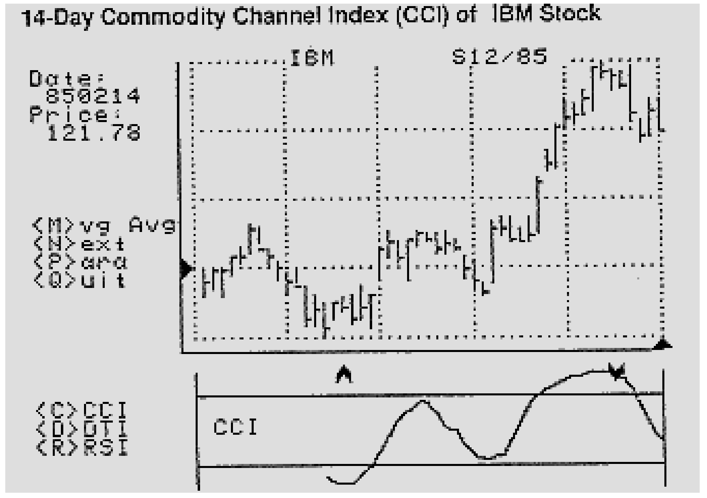
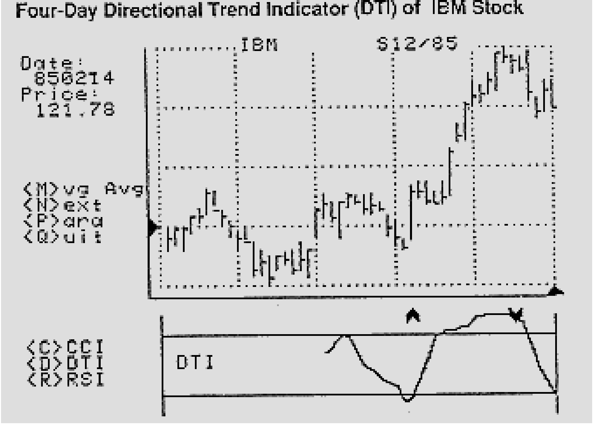
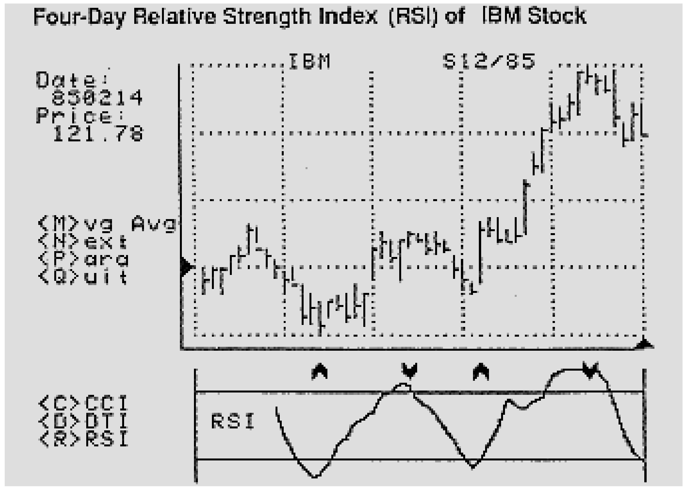

# A Complete Computer Trading Program (Part 4)

- **Author:** John F. Ehlers
- **Publication:** Technical Analysis of STOCKS & COMMODITIES, Volume 5, June 1987, pp. 203--206
- **Article URL:** [Article PDF](https://technical.traders.com/archive/article.asp?file=\V05\C06\ACOMPLE.pdf)

---

This is the conclusion of four articles that give a description and listing of an Apple ][ BASIC computer program, enabling you to perform technical analysis on your computer with 48K of memory and one disk drive. This article adds the Commodity Channel Index, Directional Trend Indicator and Relative Strength Index to the graphical representations of price, moving averages and the Parabolic system.

## Commodity Channel Index

The Commodity Channel Index (CCI) is calculated in lines 2500-2560 of the listing. Channels and the CCI were described more completely in the April 1986 issue of *Technical Analysis of Stocks & Commodities*. In line 2510, the first column of the work matrix Y(0,I) is used to store the average of the high, low and close for each of the data points. Line 2520 computes the dominant cycle moving average of the daily average and stores it in the second column of the work matrix as Y(1,I). If you have a question regarding the moving average algorithm, please review part 3 of this series. Line 2530 computes the dominant cycle moving average of the difference between the daily average and the dominant cycle moving average of the daily average. (This really does make sense even though there are lots of averages involved.) This average of the differences is stored in the working matrix as Y(2,I).

The calculation of the CCI is concluded in line 2560, where the difference between the daily average and the dominant cycle is normalized to the dominant cycle average of their difference. The normalized value is scaled so that the ratio varying between +2 and -2 will be plotted on your computer screen in the vertical region between pixel points 140 and 190. Since these limits can be exceeded by the calculation, lines 2540 and 2550 ensure the graphing limits will not be exceeded by clipping them.



**FIGURE 1.** 14-Day Commodity Channel Index (CCI) of IBM Stock.

## Directional Trend Indicator

The Directional Trend Indicator (DTI) is calculated in lines 3000-3070 of the listing. The Directional Trend Indicator was discussed more completely in the March 1986 issue of *Stocks & Commodities*.

Line 3010 clears the working matrix to avoid using any leftovers from the CCI calculations. If the difference between successive highs is greater than the difference between successive lows, that difference is stored in the first column of the work matrix as Y(0,I). On the other hand, if the difference of successive lows is greater, that difference is stored in the second column of the work matrix at Y(1,I). Otherwise, both values of the work matrix are set to zero.

The positive directional trend (DP) and the minus directional trend (DM) are calculated as the quarter-dominant cycle moving average of the respective successive differences in lines 3040-3060. If the average is zero, then the average is assigned the neutral plotting value of 165 to avoid computational problems. The first average of the Directional Trend Indicator is calculated in line 3050. Since the ratio of the sum and difference of DP and DM can vary between +1 and -1, the program scales Y(2,I) so these values will occur between the 140 and 190 vertical position on your screen. Lines 3060 and 3070 take another quarter-dominant cycle moving average of the DTI to complete the calculation.



**FIGURE 2.** Four-Day Directional Trend Indicator (DTI) of IBM Stock.

## Relative Strength Index

The Relative Strength Index (RSI) is calculated in lines 3500-3570 of the listing. The Relative Strength Index was discussed more completely in the February and December 1986 issues of *Stocks & Commodities*.

Line 3510 clears the work matrix so that any residual calculations will not be used in calculating RSI. Then, it calculates the first column of the work matrix, Y(0,I), as successive difference in closing prices. Positive differences are averaged over the quarter-dominant cycle as the second column of the work matrix, Y(1,I), and negative differences are averaged over the quarter-dominant cycle as the third column of the work matrix, Y(2,I), in lines 3520-3540.

Lines 3540-3560 compute the interim RSI as the ratio of the positive differences to the total differences. If the total differences are zero over the quarter cycle, computational difficulties are avoided by line 3540. Lines 3560 and 3570 complete the calculation of RSI by again taking the quarter-dominant cycle moving average of the interim RSI calculation. Since the RSI ratio can vary between zero and 1, line 3570 scales the value to fall between 140 and 190 on your screen.



**FIGURE 3.** Four-Day Relative Strength Index (RSI) of IBM Stock.

## Conclusion

In conclusion, I hope your effort in entering the program given in these four articles will be of benefit to you in your trading program by placing more technical analysis tools at your disposal.

This complete computer program (revised by Jack K. Hutson), along with an explanatory example BASIC program, is available on disk directly from Technical Analysis of Stocks & Commodities magazine for $49.95. Please refer to Volume 5 disk. An IBM version of this program is available for $99 directly from John Ehlers, P.O. Box 1801, Goleta, CA 93116.

## Program Listing

```basic
10 REM COMPLETE TECHNICAL ANALYSIS
   BY JOHN F. EHLERS
   MODIFIED BY JACK K. HUTSON
   (C) 1987 TECHNICAL ANALYSIS, INC.
1070 IF PL = 195 THEN
     LET P$ = "Database Length <" + STR$(DC) + ">:":
     GOSUB 6000:
     LET DC = N:
     LET S$ = "CCI":
     LET ST = DC + 1:
     GOSUB 2500:
     GOSUB 5500:
     REM (C)OMMODITY CHANNEL INDEX
1080 IF PL = 196 THEN
     LET P$ = "Cycle Length <" + STR$(QC) + ">:":
     GOSUB 6000:
     LET QC = N:
     LET S$ = "DTI":
     LET ST = DC + 1:
     GOSUB 3000:
     GOSUB 5500:
     REM (D)IRECTIONAL TREND INDICATOR
1090 IF PL = 210 THEN
     LET P$ = "Number of Days <" + STR$(QC) + ">:":
     GOSUB 6000:
     LET QC = N:
     LET S$ = "RSI":
     LET ST = 2 * QC + 2:
     GOSUB 3500:
     GOSUB 5500:
     REM (R)ELATIVE STRENGTH INDEX
2500 REM *** CCI ***
2510 FOR I = 1 TO 50:
     LET Y(0,I) = (X(2,I) + X(3,I) + X(4,I)) / 3:
     NEXT I
2520 LET Y(1,DC) = 0:
     FOR I = 1 TO DC:
     LET Y(1,DC) = Y(1,DC) + Y(0,I):
     NEXT I:
     LET Y(1,DC) = Y(1,DC) / DC:
     FOR I = DC + 1 TO 50:
     LET Y(1,I) = Y(1,I-1) + (Y(0,I) - Y(0,I-DC)) / DC:
     NEXT I
2530 FOR I = DC TO 50:
     LET Y(2,I) = 0:
     FOR J = 0 TO DC - 1:
     LET Y(2,I) = Y(2,I) + ABS(Y(0,I-J) - Y(1,I-J)) / DC:
     NEXT J:
     NEXT I
2540 FOR I = DC TO 50:
     LET X(7,I) = 165 + 12.5 * (Y(0,I) - Y(1,I)) / Y(2,I):
     IF X(7,I) < 140 THEN
     LET X(7,I) = 140
2550 IF X(7,I) > 190 THEN
     LET X(7,I) = 190
2560 NEXT I
3000 REM *** DTI ***
3010 FOR I = 1 TO 50:
     FOR J = 0 TO 2:
     LET Y(J,I) = 0:
     NEXT J:
     NEXT I:
     FOR I = 2 TO 50:
     IF X(2,I-1) - X(2,I) > X(3,I) - X(3,I-1) THEN
     LET Y(0,I) = X(2,I-1) - X(2,I)
3020 IF X(3,I) - X(3,I-1) > X(2,I-1) - X(2,I) THEN
     LET Y(1,I) = X(3,I) - X(3,I-1)
3030 IF X(2,I-1) < X(2,I) AND X(3,I-1) > X(3,I) THEN
     LET Y(0,I) = 0:
     LET Y(1,I) = 0
3040 NEXT I:
     FOR I = QC TO 50:
     LET DP = 0:
     LET DM = 0:
     FOR J = 0 TO QC - 1:
     LET DP = DP + Y(0,I-J):
     LET DM = DM + Y(1,I-J):
     NEXT J:
     IF DP = 0 AND DM = 0 THEN
     LET Y(2,I) = 165:
     GOTO 3060
3050 LET Y(2,I) = 165 - 25 * (DP - DM) / (DP + DM)
3060 NEXT I:
     LET X(7,2*QC-1) = 0:
     FOR I = QC TO 2*QC - 1:
     LET X(7,2*QC-1) = X(7,2*QC-1) + Y(2,I):
     NEXT I:
     LET X(7,2*QC-1) = X(7,2*QC-1) / QC
3070 FOR I = 2*QC TO 50:
     LET X(7,I) = X(7,I-1) + (Y(2,I) - Y(2,I-QC)) / QC:
     NEXT I:
     RETURN
3500 REM *** RSI ***
3510 FOR I = 1 TO 50:
     FOR J = 0 TO 2:
     LET Y(J,I) = 0:
     NEXT J:
     NEXT I:
     FOR I = 2 TO 50:
     LET Y(0,I) = X(4,I-1) - X(4,I):
     NEXT I:
     FOR I = QC TO 50:
     FOR J = 0 TO QC - 1
3520 IF Y(0,I-J) > 0 THEN
     LET Y(1,I) = Y(1,I) + Y(0,I-J) / QC
3530 IF Y(0,I-J) < 0 THEN
     LET Y(2,I) = Y(2,I) - Y(0,I-J) / QC
3540 NEXT J:
     NEXT I:
     FOR I = QC TO 50:
     IF Y(1,I) = 0 AND Y(2,I) = 0 THEN
     LET Y(0,I) = .5:
     GOTO 3560
3550 LET Y(0,I) = Y(1,I) / (Y(1,I) + Y(2,I))
3560 NEXT I:
     LET Y(1,2*QC-1) = 0:
     FOR I = QC TO 2*QC - 1:
     LET Y(1,2*QC-1) = Y(1,2*QC-1) + Y(0,I):
     NEXT I:
     LET Y(1,2*QC-1) = Y(1,2*QC-1) / QC
3570 FOR I = 2*QC TO 50:
     LET Y(1,I) = Y(1,I-1) + (Y(0,I) - Y(0,I-QC)) / QC:
     NEXT I:
     FOR I = 2*QC TO 50:
     LET X(7,I) = 190 - 50 * Y(1,I)
     NEXT I:
     RETURN
5500 GOSUB 5000:
     HPLOT 70,140 TO 70,190:
     HPLOT 270,140 TO 270,190:
     HPLOT 70,150 TO 270,150:
     HPLOT 70,180 TO 270,180:
     VTAB 21:
     HTAB 12:
     PRINT S$
5510 FOR I = ST TO 50:
     LET X = 70 + 4 * I:
     HPLOT X-4,X(7,I-1) TO X,X(7,I)
5520 IF X(7,I-1) < 150 AND X(7,I) > X(7,I-1) AND X(7,I-1) <= X(7,I-2) THEN
     FOR K = 0 TO 3:
     HPLOT 70+4*I-K,140-K TO 70+4*I-K,144-K:
     HPLOT 70+4*I+K,140-K TO 70+4*I+K,144-K:
     NEXT K
5530 IF X(7,I-1) > 180 AND X(7,I) < X(7,I-1) AND X(7,I-1) >= X(7,I-2) THEN
     FOR K = 0 TO 3:
     HPLOT 70+4*I-K,137+K TO 70+4*I-K,141+K:
     HPLOT 70+4*I+K,137+K TO 70+4*I+K,141+K:
     NEXT K
5540 NEXT I:
     RETURN:
     REM PLOT CCI DTI RSI
```

**PROGRAM LENGTH:** 32 lines / 2236 bytes

---

## BibTeX

```bibtex
@article{ehlers_1987_complete_trading_program_part4,
  author    = {John F. Ehlers},
  title     = {A Complete Computer Trading Program (Part 4)},
  journal   = {Technical Analysis of STOCKS \& COMMODITIES},
  volume    = {5},
  number    = {6},
  pages     = {203--206},
  year      = {1987},
  url       = {https://technical.traders.com/archive/article.asp?file=\V05\C06\ACOMPLE.pdf}
}
```
