# How to Use Maximum Entropy

- **Author:** John F. Ehlers
- **Publication:** Technical Analysis of STOCKS & COMMODITIES, Volume 5, October 1987, pp. 334--339
- **Article URL:** [Article PDF](https://technical.traders.com/archive/article.asp?file=\V05\C10\HOWTO.pdf)

---

MESA is an acronym for Maximum Entropy Spectrum Analysis, a forecasting method that filters the "noise" from time series data and can uncover useful cycles. The advantages of the maximum entropy method over Fourier analysis is that high-resolution identification of cycles is possible using an extremely short database. This is important for short-term trading because cycles can fade or change before they are recognized by more conventional approaches. Maximum entropy also is not subject to the windowing or end-effect distortions that Fourier transforms suffer because it extracts nearly all the coherent cycle "energy" in a set of data. The noise or useless information ("entropy") that clutters up data and hides cycles is filtered out like so much chaff.

## Cycles Are Related to Random Walk

The reason the short-term cycles appear, fade and alter is that they arise as solutions to a class of random walk problems. Though it may seem so, random walk does not necessarily mean chaos. Mathematicians call the problem class in which we are interested the "drunkard's walk." The problem is formulated by allowing the drunkard to step either to the right or to the left as he steps forward. To ensure randomness, the drunkard must flip a fair coin to determine the direction of his next step. The differential equation that results from this formulation is called the diffusion equation (Figure 1). The diffusion equation is useful for describing physical phenomena like the plume of smoke leaving a smokestack.

We can draw analogies between the smoke plume and trading. For example, assume the smoke plume represents the random distribution of prices. The prevailing wind determines the average drift of the plume just as a trendline can be established for prices. In addition, the widening of the plume is analogous to having less reliable estimates of price the further into the future we attempt to predict.

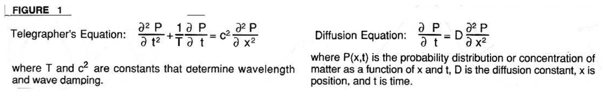

**FIGURE 1.** Telegrapher's Equation: $\frac{\partial^2 P}{\partial t^2} + \frac{1}{T}\frac{\partial P}{\partial t} = c^2 \frac{\partial^2 P}{\partial x^2}$ where $T$ and $c^2$ are constants that determine wavelength and wave damping. Diffusion Equation: $\frac{\partial P}{\partial t} = D \frac{\partial^2 P}{\partial x^2}$ where $P(x,t)$ is the probability distribution or concentration of matter as a function of $x$ and $t$, $D$ is the diffusion constant, $x$ is position, and $t$ is time.

Returning to the formulation of the drunkard's walk, if we now cause the coin flip to determine whether the direction will be changed rather than the direction itself, the random variable becomes momentum rather than direction. This formulation of the problem results in the differential equation known as the telegrapher's equation (Figure 1). The solution to the telegrapher's equation is used, among other things, to describe electronic waves propagating down the wires. In the case of the drunkard, he follows a decidedly cyclic path as he reels back and forth overcorrecting around a general direction and trying to reach an objective. If the paths were repeated a number of times the probability distribution would still be random. However, each path has a cyclic component in the short term.

> In Figure 2A, the optimized moving average is calculated as a half-dominant cycle moving average with the amplitude variation from the trendline multiplied by $\pi/2$

Every river in the world meanders. The rivers are sinuous not because of inhomogeneities in the soil, but because they contain constants applicable to the telegrapher's equation. That is, the momentum of the water is the random variable rather than the direction of flow. Momentum is the random variable because the river is attempting to find the path of least resistance by keeping the rate of drop of the water surface as nearly constant as possible as it flows downstream. In much the same way, markets seek the path of least resistance when they are stressed by realized losses, anticipated profits---in short, fear and greed.

Since short-term cycles arise from the solution of the random walk, the cycles can appear, change periodically and disappear relatively quickly. It is my experience that short-term cycles suitable for trading are present only about 20% of the time. A computerized analysis program is required that will recognize these cycles using a short database if the cycles are to be exploited profitably.

## Graphic Displays of Maximum Entropy

My computer implementation of the maximum entropy method, called MESA, uses three interrelated graphic outputs to display results on either IBM or Apple II computers. The first of these is a 12-week history bar chart overlaid with an "optimized" moving average (Figure 2A). The second graphic output is a spectrum display where the relative amplitudes of the cycles can be compared (Figure 2B). The third synthesizes the prediction of prices in the future by combining all the cycles present in the data in their proper phase and amplitude, and allowing the time variable to extend into the future (Figure 2C).

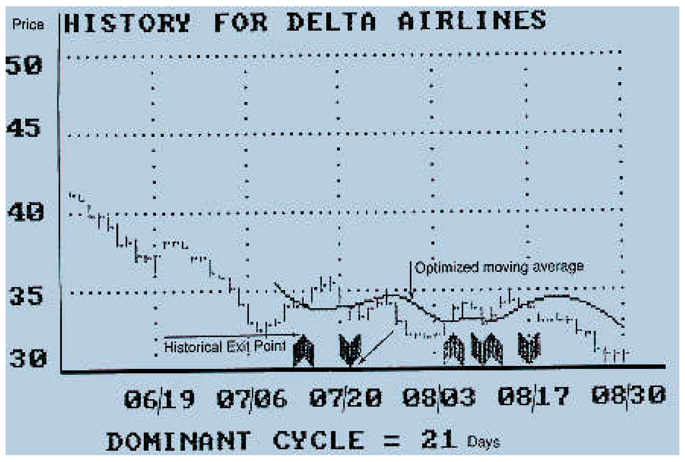

**FIGURE 2A.** History bar chart and optimized moving average.

In Figure 2A, the optimized moving average is calculated as a half-dominant cycle moving average with the amplitude variation from the trendline multiplied by $\pi/2$ (see "Understanding Cycles," *Stocks & Commodities*, December 1985.) The historical entry and exit points occurred when the closing price crossed the optimized moving average.

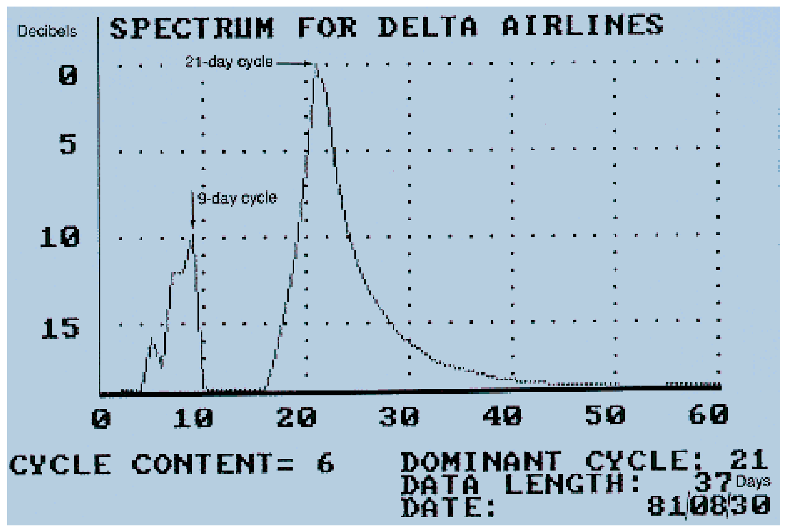

**FIGURE 2B.** Spectrum display.

The characteristics of the spectrum for Delta Airlines are shown in Figure 2B. The vertical scale of this chart is in decibels, a logarithmic measure of relative strength. The chart shows a well-defined 21-day cycle and a less well-defined, lower amplitude 9-day cycle. This 9-day cycle is 10 decibels (dB) down, relative to the dominant cycle. This means its wave amplitude is about one-third that of the dominant cycle. Cycle content is an important measure of the strength of the dominant cycle relative to a noise threshold level.

The cycle content is 6 dB greater than a threshold of zero. This means the cycle strength is four times greater than is necessary to have an absolute cycle content sufficiently great to be useful for trading (a ratio of four is 6 dB on the logarithmic scale). Thirty-seven days of data were used to identify the 21-day dominant cycle. I selected 37 days because this uses all the data after the downtrend (see Figure 2A).

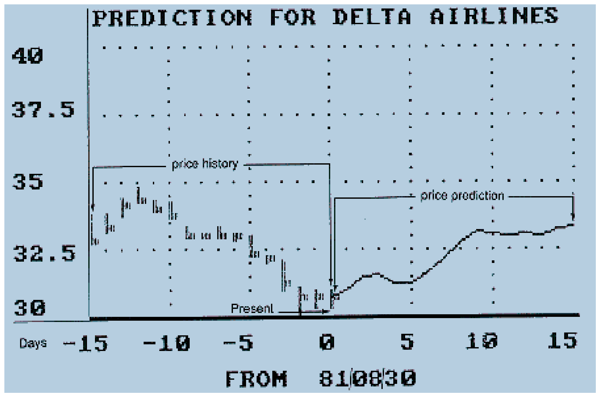

**FIGURE 2C.** Cycle combination price prediction.

Future prices for August 30, 1981 are predicted in Figure 2C. The price chart is automatically scaled. However, the scaling is changed from that of Figure 2A to obtain the most informative picture. Figure 2C shows 15 days of history in the form of a bar chart and 15 days of price predictions as a continuous line extending from the last day of data. The prediction is formed by recombining all of the cycles present in the data in their proper amplitude and phase, and extending the time variable into the future. In this case, the prediction has Delta Airlines at a bottom.

## Daily Use

I use maximum entropy to examine the prediction as a key timing indicator. In general, it is a better predictor of timing rather than of value. Being forewarned, I then carefully watch the history chart for an imminent crossing of the price and the optimized moving average. Actually, I extrapolate the potential crossing by one day to place a stop order. In this case, for example, I would place a stop order to buy Delta Airlines at about 31.75 "tomorrow," if I ran the study tonight. If I didn't get a fill I would repeat the study again tomorrow night. This would probably lower the value of my stop order because the optimized moving average would be continuing its decline. I would continue the procedure until I got a fill or until I got warning messages that cycle analysis was not appropriate.

> MEM works off any historical price data---open, close, high, low---and slips right into the CompuTrac Apple system or trader-designed Apple-based system.

For those who use an Apple-based trading system, especially CompuTrac, another alternative for calculating and graphically displaying maximum entropy forecasts is a series of subroutines known as MEM developed by Dr. Anthony Warren and published by *Stocks & Commodities*. With MEM, a trader can take either a subjective approach to spectral analysis by hand-picking the three parameters on which MEM forecasts are based or take an objective approach by allowing MEM to automatically optimize the forecast based on the number of days of data to be considered.

MEM works off any historical price data---open, close, high, low---and slips right into the CompuTrac Apple system or an Apple-based system designed by a trader. MEM uses the graphics capabilities of CompuTrac or home-grown systems to plot a forecast line (Figure 3) along with upper and lower probability boundaries. These boundaries encompass the entire daily price range from high to low and can represent either a 95% or 99.5% confidence level. The forecast in Figure 3 is based on closing prices for 50 trading days and a 95% confidence level.

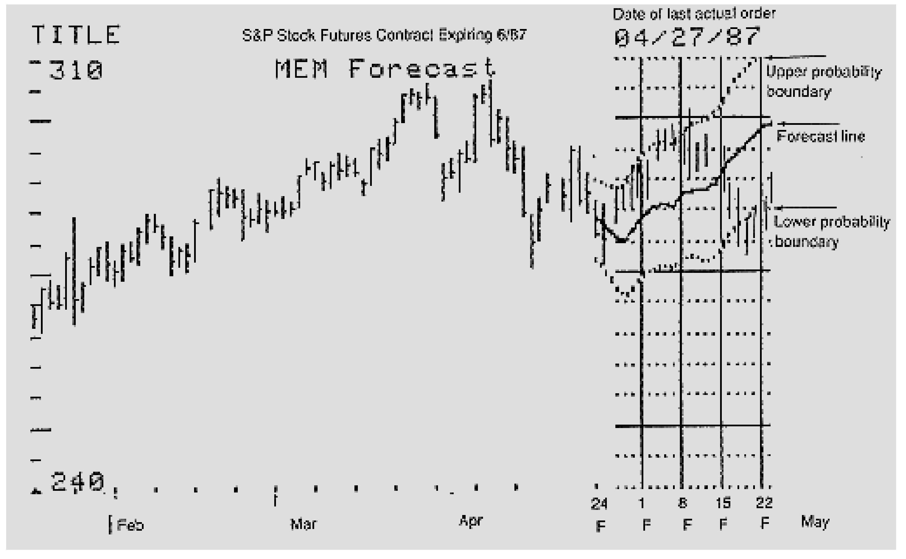

**FIGURE 3.** Maximum entropy method forecast line with 95% confidence interval based on the last 50 trading days closes.

## Resolution with Short Data Lengths

A scientifically designed computer program should be validated theoretically before undergoing real-world tests of effectiveness. In particular, the ability to predict the future can be tested with deterministic waveforms. Just as we can analyze the cycles present in a wave shape, we can synthesize a wave shape by adding component cycles together. If we do this synthesis, we have precise control of the cycle components and can check the effectiveness of a program's analysis against the input components.

> The dominant cycle of this sawtooth waveform is correctly identified in Figure 4A and the entry/exit signals would produce profits.

As an example of the synthesis/analysis approach, we can generate a sawtooth waveform from a fundamental 15-day cycle, subtracting its second harmonic (7.5-day cycle) at half amplitude and subtracting its third harmonic (5-day cycle) at one-third amplitude. Mathematically, the equation looks like:

$$E = 5 + \sin(F) - \frac{\sin(2F)}{2} - \frac{\sin(3F)}{3} - \ldots$$

where

$$F = \frac{2\pi I}{15}$$

15 = period of the fundamental frequency and $I$ = incrementing variable (1, 2, 3 etc.).

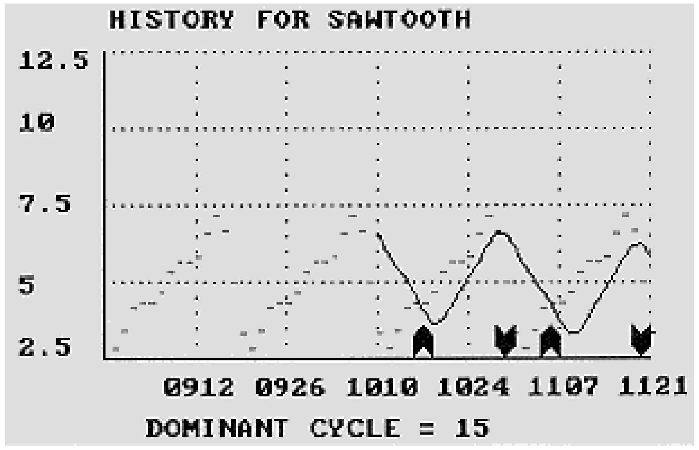

**FIGURE 4A.** History for sawtooth waveform. Dominant cycle = 15 days.

The dominant cycle of this sawtooth waveform is correctly identified in Figure 4A and the entry/exit signals would produce profits. More importantly, all three of the component cycles were correctly identified with high resolution in Figure 4B. Resolution means that you can independently identify the 5- and 7.5-day cycles without them being mushed together in a glob. Moreover, this high-resolution identification was done using only two cycles (30 days) of the dominant cycle as a data length. Resolution performance like this is not available with Fourier analysis. When the analyzed components are added together again in the future, the prediction of Figure 4C results. This prediction of the wave shape is nearly perfect.

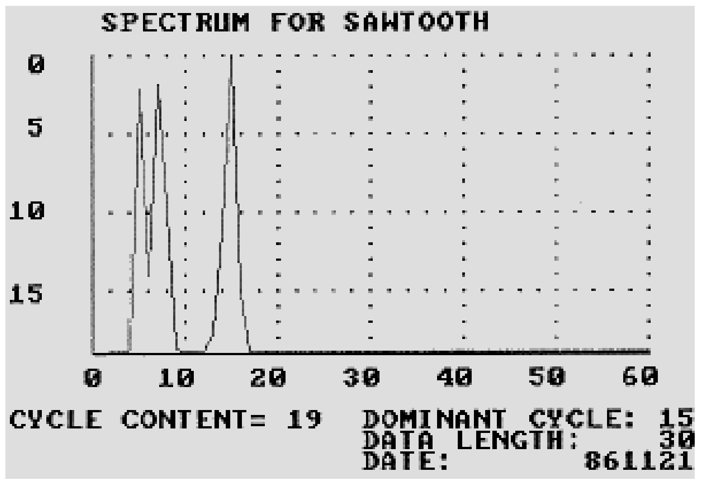

**FIGURE 4B.** Spectrum for sawtooth. Cycle content = 19; dominant cycle = 15 days; data length = 30.

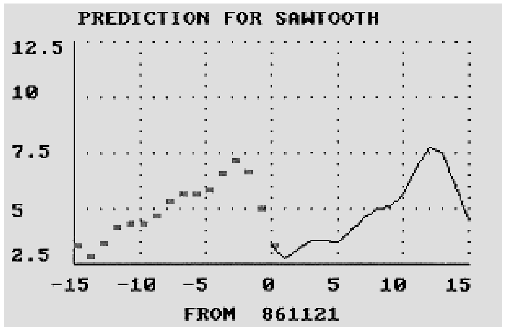

**FIGURE 4C.** Prediction for sawtooth.

The implications of the predictions are clear. If there has been a cycle present for a short period of time and this cycle has sufficient amplitude and can be identified with good resolution, the presumption is that the cycle will continue into the future for a short while. If this is true, the prediction formed by maximum entropy synthesis can aid in making an entry or exit decision.

Although maximum entropy can yield high resolution with very short databases, there is a minimum data requirement. This requirement is that at least one dominant cycle's worth of data must be used for analysis. For example, if a 33-day dominant cycle was calculated using 20 days of data, MESA will deliver a "data too short" error message. I seldom like to use more than two dominant cycles of data for analysis because the older data may not be relevant to current trading. Although a cycle is present, we are dealing with a random variable.

## Real World Operation

One of the most disconcerting aspects of maximum entropy is that it only works about 20% of the time. On the other hand, MESA gives error messages to warn when cycle analysis is not appropriate. If you heed these messages you can save a lot of money by standing aside until the cycles become favorable.

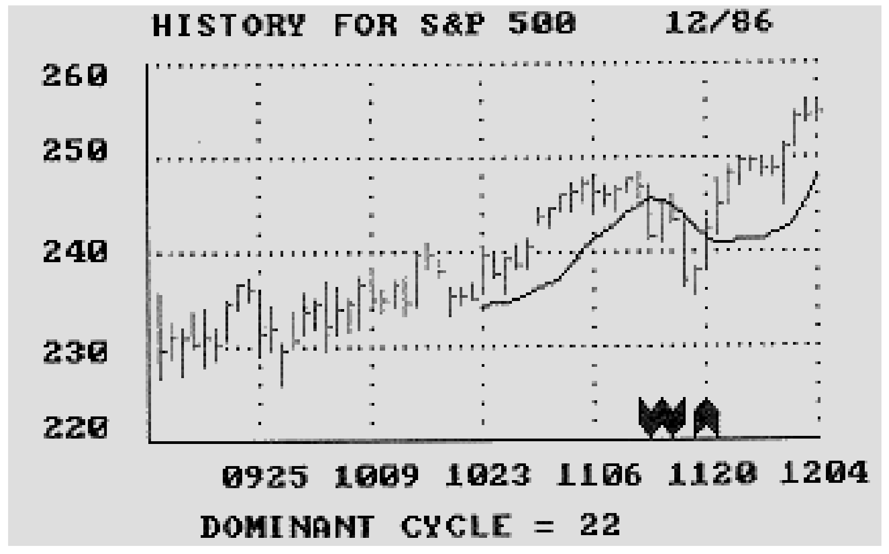

**FIGURE 5A.** History for S&P 500, 12/86. Dominant cycle = 22 days.

A typical example of a MESA chart is shown in Figure 5A, which was current data for the S&P 500 as this article was written. This history chart apparently has given some good advice, but there were no good cycles present at the time those entries were current. The difficulties are apparent in Figure 5B. The cycle content is low, there are three nearly equal amplitude cycles present, and the 22-day dominant cycle is spread very wide without a clear resolution.

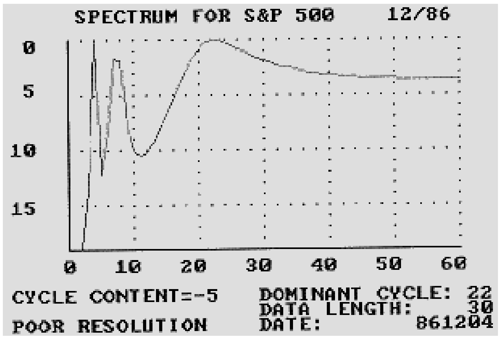

**FIGURE 5B.** Spectrum for S&P 500, 12/86. Cycle content = -5; poor resolution.

The "tail" of the spectrum is trying to tell you that there is a very long cycle present. This is the only way the cycle program can tell you that the trend (the very long cycle) is swamping the cycle content. Since the cycle content is negative and there is poor resolution of the dominant cycle, the price peak in Figure 5C should be all but ignored.

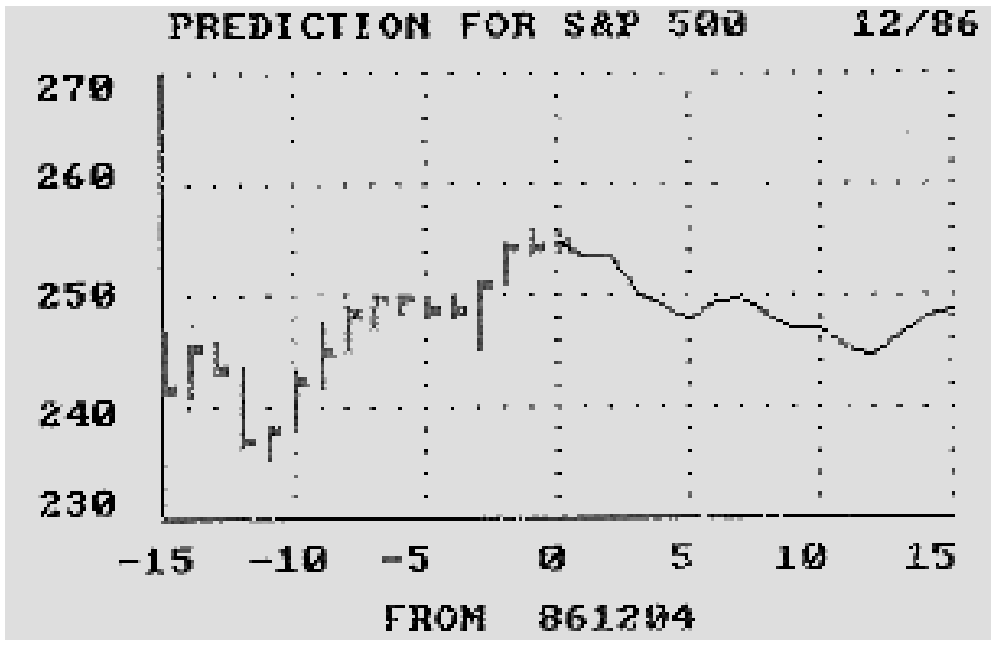

**FIGURE 5C.** Prediction for S&P 500, 12/86.

MESA can be used with different sample periods. Some people run MESA using weekly and daily data simultaneously and correlate the results. The downturn on Nov. 12, 1986 was predicted by several people using weekly data for the S&P 500. MESA can be used for intraday analysis. I have seen a 44 dominant cycle on the 15-minute chart, 22 dominant cycle on the 30-minute chart and 11 dominant cycle on the hourly chart. Intraday operation has given some people the ability to precisely anticipate the highs and lows for the day. Maximum entropy is a scientific approach with a performance that has been proven using theoretical cyclic data. Unlike other cycle analysis approaches, high resolution identification of cycles can be made with very short data lengths. The use of these short data lengths enables the capture of cycles for trading although the cycles are formed from a random variable. That is, the cycle is captured before it changes or disappears.

It is the author's experience that short-term trading using cycles is feasible only about 20% of the time. MESA provides error flags to advise you when cycle analysis is not appropriate, allowing you to save money by standing aside or to shift to another analysis approach.

## About the Author

John F. Ehlers, Box 1801, Goleta, CA 93116, (805) 962-9477, is an electrical engineer working in electronic research and development and has been a private trader for about 10 years. He discovered the Maximum Entropy method in his work and is a pioneer in introducing it to trading analysis by writing the MESA computer program. He has written a variety of other programs to optimize technical analysis methods with the aid of cycles.

---

*Stocks & Commodities'* implementation of the Maximum Entropy method by Dr. Anthony Warren is on Volume 2 ($99.95) of the Apple II disk of technical analysis software and requires S&C's Volume 2 book ($45) for documentation.

---

## BibTeX

```bibtex
@article{ehlers_1987_maximum_entropy,
  author    = {John F. Ehlers},
  title     = {How to Use Maximum Entropy},
  journal   = {Technical Analysis of STOCKS \& COMMODITIES},
  volume    = {5},
  number    = {10},
  pages     = {334--339},
  year      = {1987},
  url       = {https://technical.traders.com/archive/article.asp?file=\V05\C10\HOWTO.pdf}
}
```
