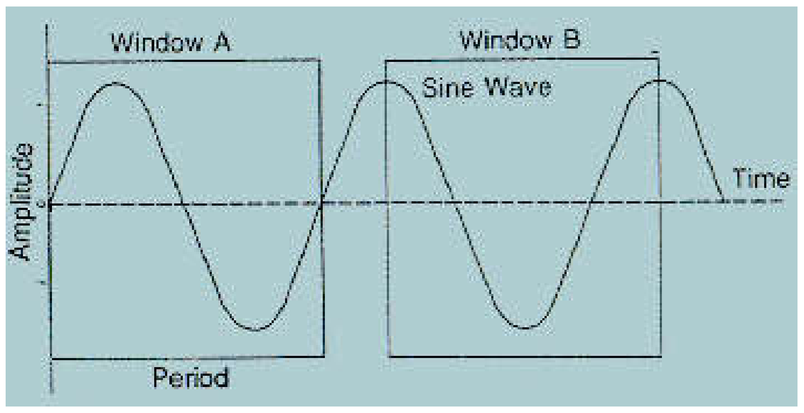
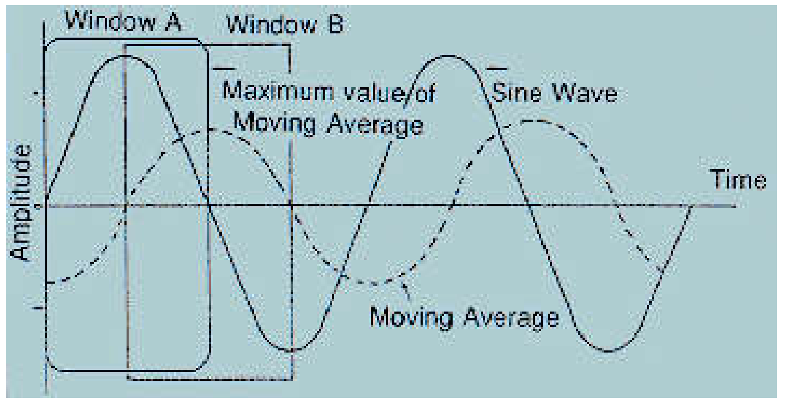
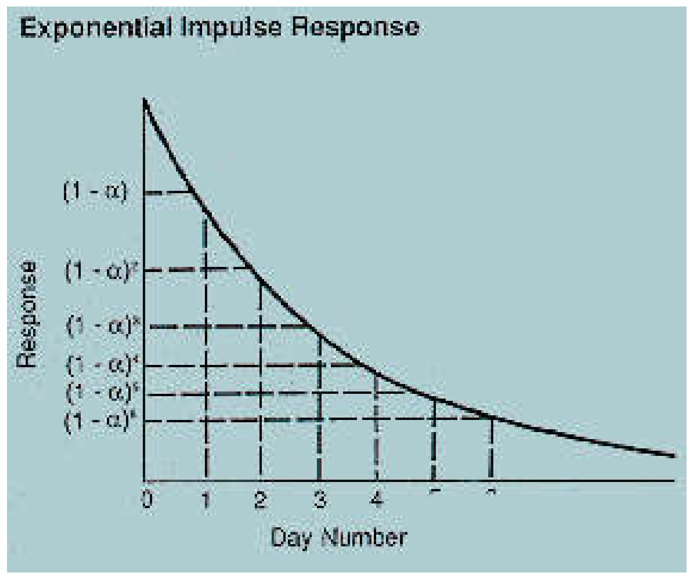
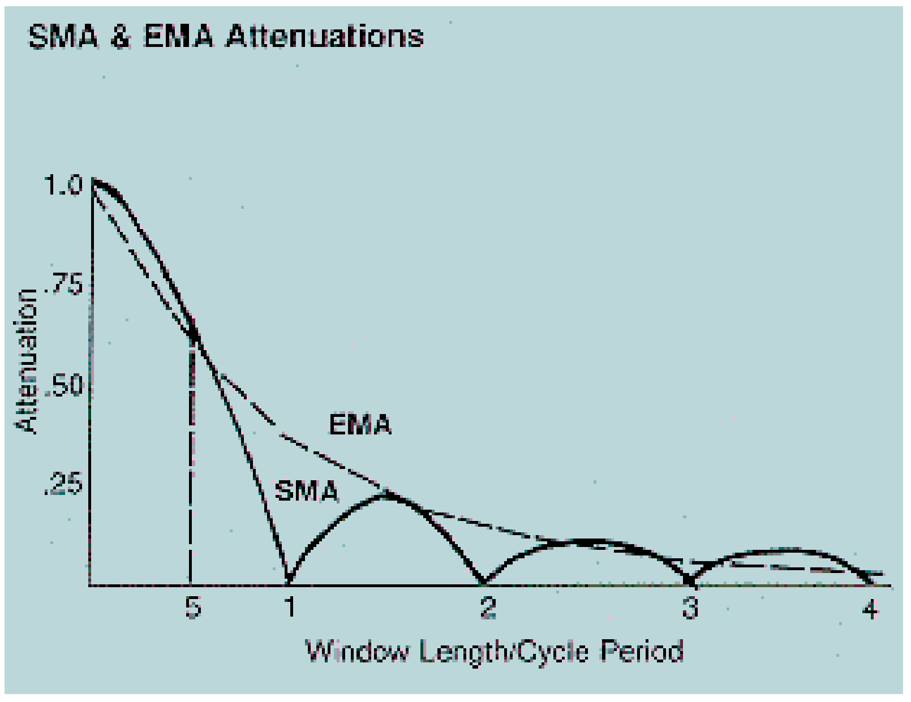
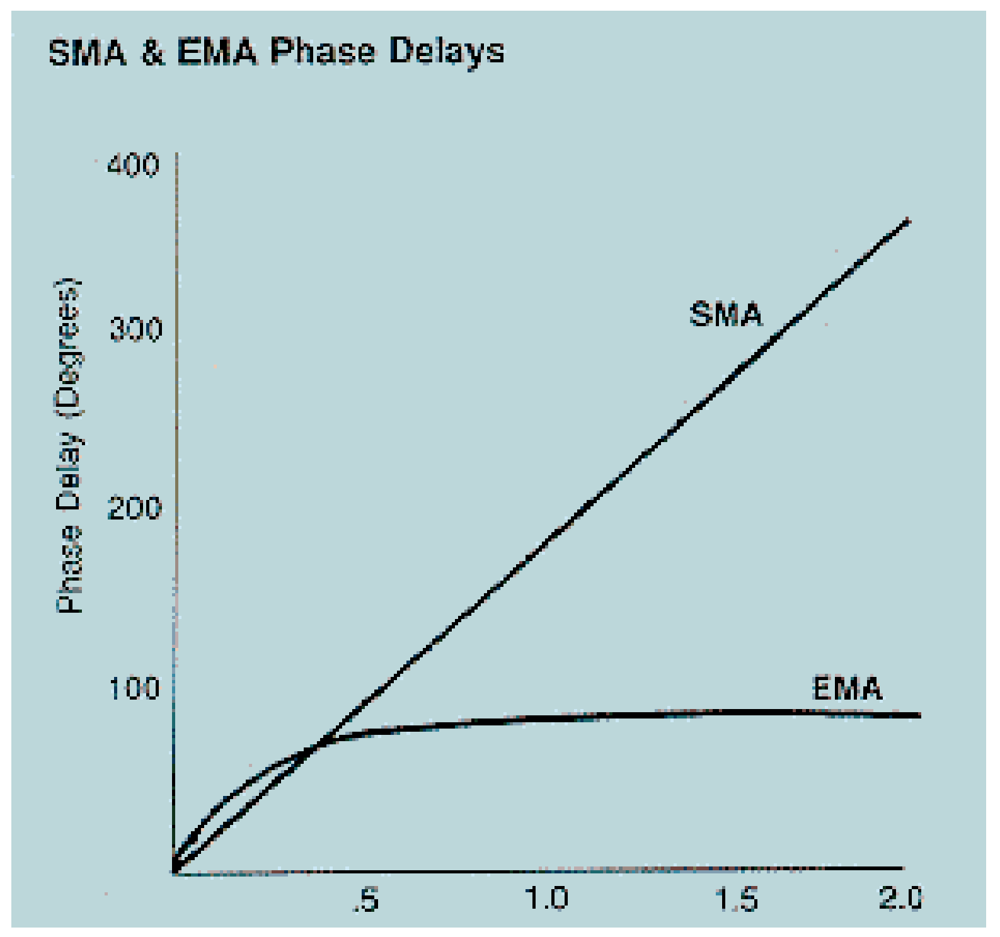

# Moving Averages Part 1

**John Ehlers**

*Technical Analysis of Stocks & Commodities, Volume 6, Issue 6 (June 1988), pp. 220–223*

Article URL: https://technical.traders.com/archive/article.asp?file=\V06\C06\MOVAVG.pdf

---

Averages have long been recognized as the best estimator of a random variable. Traders use moving averages as trading signals or as components of trading systems, but the moving average characteristics are seldom described for them. This is the first of a two-part article on moving averages to help promote a wider understanding. I'll explore some interesting characteristics of several kinds of moving averages and compare them in this article. In part 2, these characteristics will be applied to create a new kind of leading indicator entry system. I modestly call this new system ELI for the Ehlers Leading Indicator.

A moving average is, quite simply, a filter. It provides a means for passing through certain information we wish to see, while withholding (attenuating) data which would obscure or confuse our efforts to see a particular pattern. Just as sunglasses filter out certain wavelengths of light so we can see a scene more clearly, a moving average filters out certain data elements so the pattern we seek can be more readily seen.

The moving average is a type of low-pass frequency filter. The filter removes the high-frequency variations to produce the familiar smoothed line or response, as engineers call it. Such filters are often described in terms of their impulse response. An impulse is a sharp spike (of theoretically zero width) that excites the filter (the moving average). Striking a bell is a simple example of an impulse response. The bell's ringing slowly dies out with time and during this period several overtones may interact to form beat notes. Because the ringing theoretically never completely dies out, this kind of filter is called an Infinite Impulse Response (IIR) filter. All physically realizable filters are of this type.

Computer technology allows us to use filters that are not physically realizable. We can average data that falls within an observable window (that is, in a particular timespan), ignoring data outside the window. These filters are called Finite Impulse Response (FIR) filters because the response to the impulse only occurs during the finite time period in which the impulse is included in the calculation. A simple moving average is this type of filter.

For example, we form a 10-day moving average by averaging 10 data samples. Our observation window has a span of 10 days. If the impulse is just one data sample having a value of 1 with all the other data being zero, then the impulse response (the calculated value) of this filter/average will be 0.1 for any 10-day period that includes the single value of "1." This period is the length of the time during which the input impulse falls in the observation window. The filter response is zero when the input impulse is outside this window, making the response finite in duration.

## Simple Moving Averages

A Simple Moving Average (SMA) is a Finite Impulse Response (FIR) filter where the observation window is stepped forward day-to-day. It can be calculated quickly and easily. The new average is formed by dropping off the oldest data and adding the newest data to the previous average. This is called a recursive process. The added and subtracted data must be weighted by their contribution to the window. The SMA equations are:

$$\text{SMA} = \frac{PR_1 + PR_2 + PR_3 + \ldots + PR_L}{L}$$

where L is the length of the moving average and PR is the price data for a given day. Then, for day D, the moving average becomes:

$$\text{SMA}_D = \text{SMA}_{D-1} + \frac{PR_D - PR_{D-L}}{L}$$

When we apply a SMA to a pure sine wave cycle (as a proxy for a series of prices) we find a maximum sensitivity when the moving average is exactly a half-cycle long.

Picture the moving average positioned over the positive alternation of the sine wave's cycle (Figure 1). A shorter moving average would not include all the positive values of the sinewave and, therefore, its own value would be lower. A longer average would include some negative sine wave values, decreasing its value or "sensitivity." The maximum value of this moving average occurs exactly when the underlying sine wave crosses zero because that is when the average is made up only of all the sine wave's positive values.



**FIGURE 1:** Maximum sensitivity of a simple moving average occurs when the window is exactly a half-cycle long.

As we move the observation window along day by day to form the moving average, the moving average also becomes a sine wave. It always lags the original sine wave by a quarter-cycle (or 90°) and its amplitude or height will be smaller by 2/π (≈0.637).

Some interesting things happen when curves of different frequencies are in the observation window. For example, if we double the frequency of the wave (the "input" frequency), the window will contain a complete sine wave. In that case, there are as many positive points as there are negative points inside the window, and the value of the moving average is zero. This means that the input frequency is perfectly filtered out. It is in this sense that a moving average is a filter.

However, if we increase the input frequency to three times the original, we will have two positive alternations and one negative alternation within the observation window. Whatever the actual value of the moving average of the three cycles, it will not be zero. Thus, the filtering action of the moving average has degenerated from the perfect filtering we had previously. The frequency component of three cycles per period passes through the filter and shows up in the fluctuations of the moving average. The average's amplitude is diminished by approximately three times π/2 because there are three times as many data samples in the window being averaged. The maximum value of the moving average at this frequency lags the maximum of the original sine wave by 270 degrees or three-quarters of a cycle.

As we increase the frequency, we get perfect filtering for even multiples (2, 4, 6, 8 etc. cycles per period) of the maximum sensitivity sine wave. For odd multiples, we get a response bounceback, i.e., a fluctuating moving average. The frequency response of a simple moving average is:

$$H = \frac{\sin(x)}{x}$$

where X is π times a frequency ratio. The frequency ratio is unity (1) when one complete sine wave fills the observation window.

Another characteristic of the SMA is that the phase delay of higher frequencies is a (linear) function of the frequency of the raw data. That is, the shorter the period of the raw data, the more cycles within the observation window, the more delayed the resulting moving average or output filter. This is illustrated in Figures 2 and 3.



**FIGURE 2:** Phase delay of the SMA increases linearly with frequency.



**FIGURE 3:** The EMA impulse response decays exponentially.

## Exponential Moving Averages

Exponential Moving Averages (EMA) are infinite impulse response (IIR) filters because the old data never leaves the calculation as it does in simple moving averages. IIR's are also recursive. That is, the previous EMA is used in conjunction with new data to form the new EMA and the process is repeated for each new data input. Mathematically, an EMA for day D is calculated as:

$$\text{EMA}_D = \alpha \cdot PR_D + (1 - \alpha) \cdot \text{EMA}_{D-1}$$

where α (alpha) is a constant (0–1) and PR_D is price on day D.

The first value of the EMA can be the value of the first data sample. One important characteristic of this filter is that an unchanging price input results in an unchanging EMA value or "output." If all the price functions have a value of one, the factors multiplied by α in the equation cancel so the EMA is also unity.

The EMA gets its name from the shape of its impulse response. Suppose our impulse has a value of 1/α for the original first or "zeroth" data point and is zero at all other points. Following the equation and referring to Figure 3, the beginning value of the EMA is 1. At sample 1, input is zero and so the EMA = (1-α). At sample 2, there again is no new input so the EMA becomes (1-α)². At sample 3 the old EMA is again multiplied by (1-α) and the new EMA becomes (1-α)³. Clearly, the value of the EMA is (1-α) raised to the exponent of the sample number. Hence — exponential!

We can relate the α factor to the length of the moving average (see sidebar). The simplified relationship between α and the length of the moving average, L is:

$$\alpha = \frac{2}{L}$$

This result is substantially the same as that derived by Stocks & Commodities publisher Jack K. Hutson for a single EMA:

$$\alpha = \frac{2}{L - 1}$$

The phase transfer characteristic of an EMA cannot readily be described in a simplified form because it is nonlinear. Since older data samples still have some effect on the output and because this effect diminishes as the data ages, you can see that the delay or lag would not be a simple relationship.

## Other Filter Types

A wide variety of filter transfer responses can be created with your computer. These include filters with sharp frequency cutoffs. They have exotic names like Butterworth and Chebycheff for their transfer characteristics. While these each have unique features, their complexity reduces their application to trading.

> The one characteristic that all low-pass filters, or moving averages, have in common is the delay relative to the generating price series.

Some traders like to use weighted moving averages to obtain sharper cutoff of high-frequency noise inputs. That is, they weight more recent values more heavily to rapidly diminish the impact of large changes or impulses. Although conceptually simple, weighted moving averages have the disadvantage that they cannot be computed recursively. That is, the average must be computed anew with each new sample. This recalculation vastly increases computation time. Even with today's high-speed personal computers, the longer computing time can be bothersome.

The one characteristic that all low-pass filters, or moving averages, have in common is the delay relative to the generating price series. The lagging characteristic results from averaging historical data. Centering the moving average doesn't help traders much because centering fails just when you need it most — to form tomorrow's trade.

## Comparison of Characteristics

The amplitude responses of the SMA and the EMA are compared in Figure 4. Recall that the value of any average will be less at its extreme (i.e., will be attenuated) than that of the underlying data. In Figure 4, the horizontal axis is the normalized window length relative to the input signal's period. The attenuation characteristics of the SMA and the EMA are similar except for the SMA's periodic peaks. Therefore, in terms of the smoothing effects, there is little reason to select one moving average over another. The EMA will produce more consistent smoothing because it doesn't have the periodic peaks that will produce greater or lesser attenuation under the right conditions.



**FIGURE 4:** Amplitude responses of SMA and EMA compared.

You can easily unnormalize Figure 4 for your specific case. Divide the horizontal axis value into your observation window length to find the period of the cycle being attenuated. For example, assume a 16-day moving average. An SMA will be zero (have a zero transfer response) for a 16-day cycle because the window contains one complete cycle of positive and negative values. The maximum sensitivity cycle occurs at a horizontal value of 0.5, or a 32-day cycle [16/0.5 = 32] for our 16-day window. The SMA has perfect attenuation for input cycles of 8, 4 and 2 days.

The phase transfer characteristics of the SMA and EMA are compared in Figure 5. Remember, an SMA's phase delay is linear with increasing frequency and frequency is the reciprocal of a cycle's period. One way of interpreting Figure 5 is that making the SMA observation window long relative to the cycles in the data can introduce a substantial delay in sensing the turn of the cycle or the change in trend. Contrarily, the penalty of increased delay is not realized for higher frequencies when an EMA is used.



**FIGURE 5:** Phase transfer characteristics of SMA and EMA compared.

The main difference between the SMA and EMA lies in the area of phase delay. The EMA phase delay is almost constant for high-frequency signals because the older data contribution is decreased by the α factor of the filtering function.

Filters and averages other than the SMA and EMA can be used, but they quickly lose their charm for traders because of their complexity or increase in computational time. If we must choose between simple averages and exponential averages, we find that exponential averages have better smoothing and less phase delay or lag at higher frequencies.

---

## Sidebar: Deriving α = 2/L

The period of maximum sensitivity cycle is half the window length, L. Attenuation of a Simple Moving Average (SMA) for this period is 2/π. For an equivalent Exponential Moving Average (EMA) attenuation this is expressed as:

$$\frac{2}{\pi} = (1 - \alpha)^{L/2}$$

but:

$$\frac{2}{\pi} = e^{-1}$$

so that:

$$e^{-1} = (1 - \alpha)^{L/2}$$

Taking the logarithm of both sides:

$$-1 = \frac{L}{2} \ln(1 - \alpha)$$

$$\ln(1 - \alpha) = \frac{-2}{L}$$

Using the series expansion $\ln(1 - \alpha) \approx -\alpha$ for small α:

$$-\alpha = \frac{-2}{L}$$

Therefore:

$$\alpha = \frac{2}{L}$$

That is, the EMA α factor is 2 divided by the desired window length.

---

*John F. Ehlers, Box 1801, Goleta, CA 93116, (805) 962-9477, is an electrical engineer working in electronic research and development, and has been a private trader for about 10 years. He is a pioneer in introducing Maximum Entropy to trading analysis through his MESA computer program.*

## References

- Ehlers, John F. *Technical Analysis of Stocks & Commodities: Successful Speculation*, Vol. 3, pp. 242–245. Seattle: Technical Analysis, 1988.
- Hutson, Jack K. *Technical Analysis of Stocks & Commodities: Investment Techniques*, Vol. 2, pp. 102–103. Seattle: Technical Analysis, 1987.
- Warren, Anthony and Jack K. Hutson. *Technical Analysis of Stocks & Commodities: Profitable Trading Methods*, Vol. 1, pp. 74–80. Seattle: Technical Analysis, 1986.

## BibTeX

```bibtex
@article{ehlers1988movavg1,
  author    = {Ehlers, John F.},
  title     = {Moving Averages Part 1},
  journal   = {Technical Analysis of Stocks \& Commodities},
  volume    = {6},
  number    = {6},
  pages     = {220--223},
  year      = {1988},
  month     = jun,
  url       = {https://technical.traders.com/archive/article.asp?file=\V06\C06\MOVAVG.pdf}
}
```
