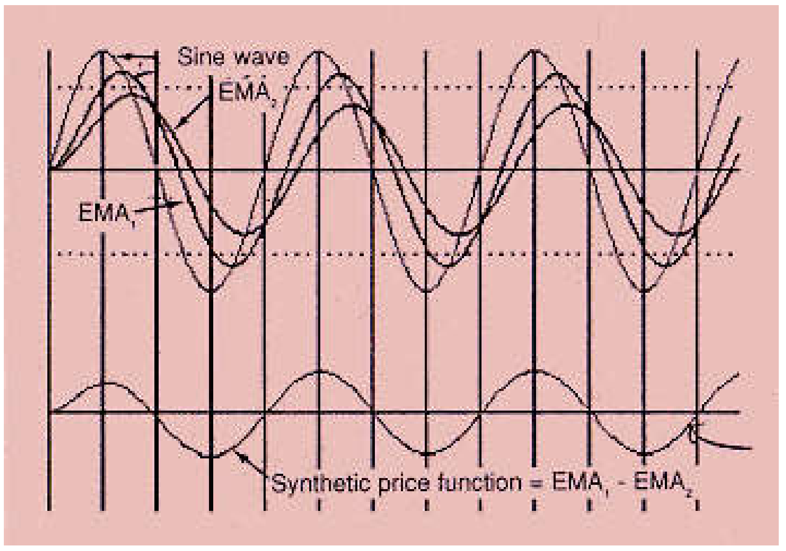
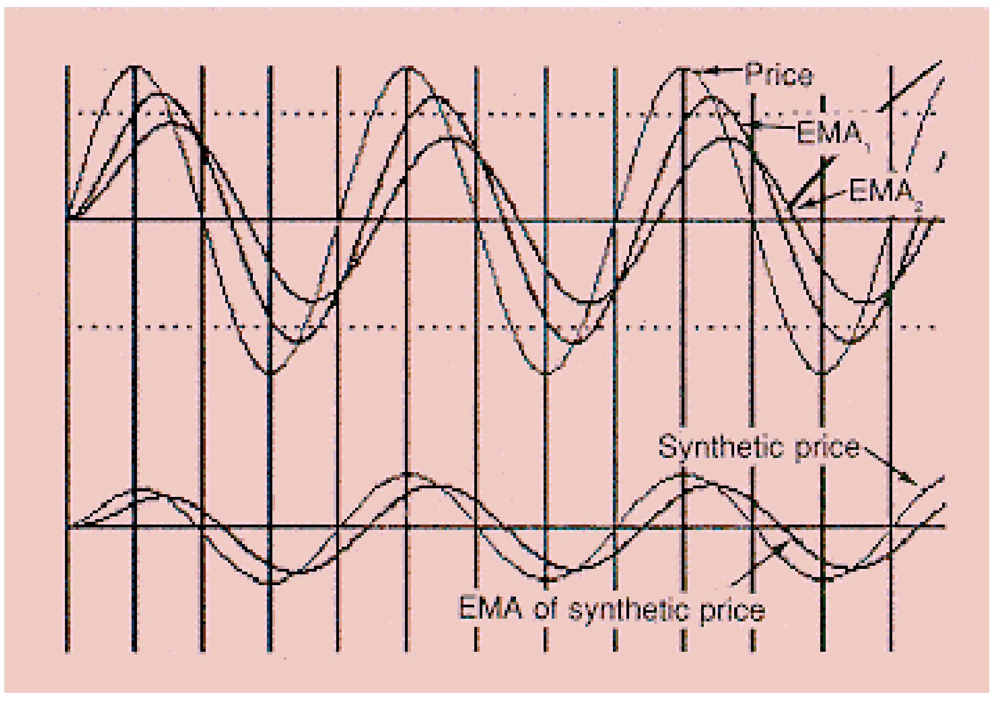
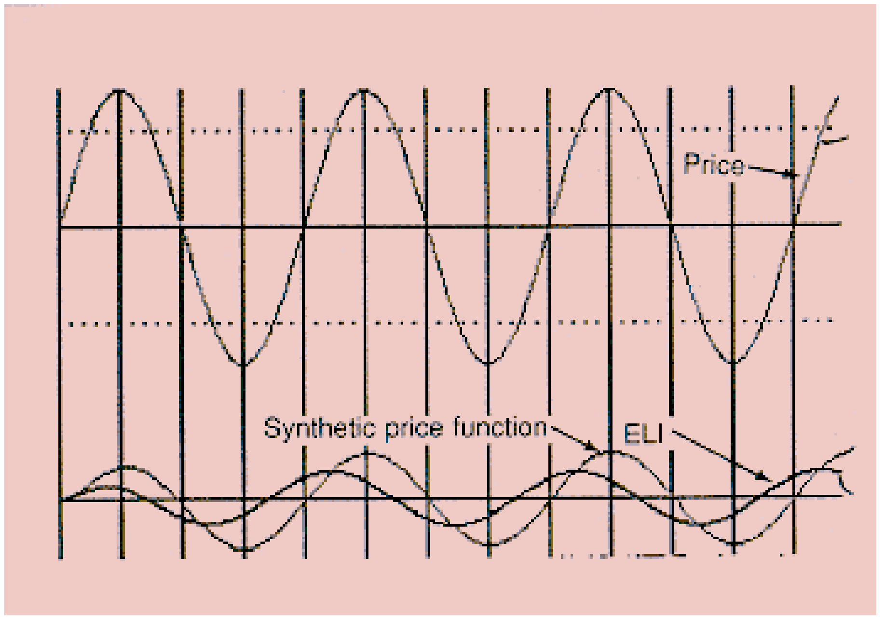
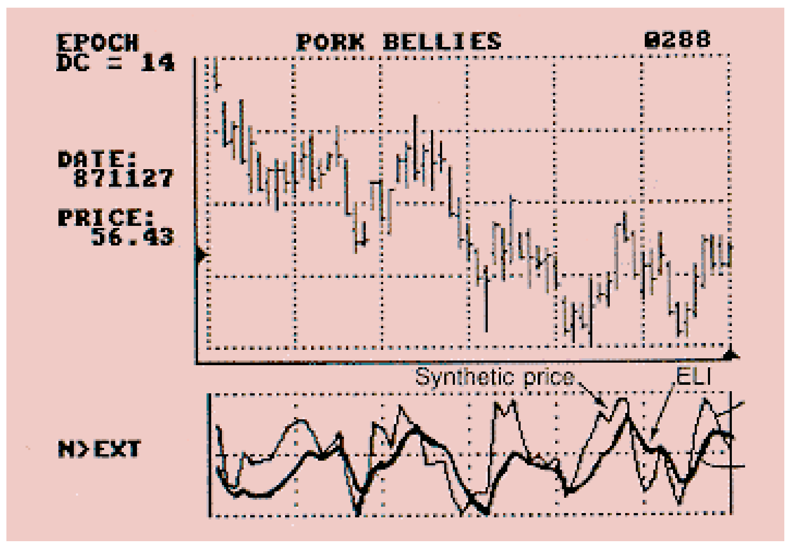
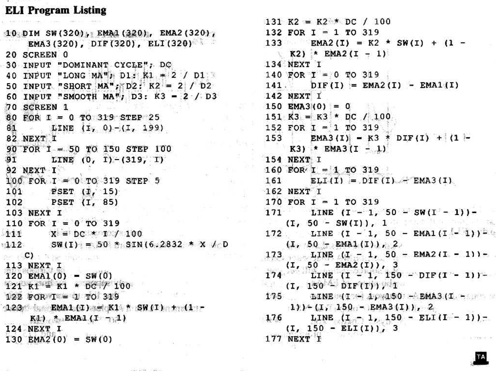

# Moving Averages Part 2: Ehlers Leading Indicator (ELI)

**John Ehlers**

*Technical Analysis of Stocks & Commodities, Volume 6, Issue 7 (July 1988), pp. 250–252*

Article URL: https://technical.traders.com/archive/article.asp?file=\V06\C07\ELI.pdf

---

Most technical indicators use a moving average of some kind, and this usually dooms the indicator to lag price. Some indicators use momentum, or rate of change, to generate a leading function. However, this is similar to taking the derivative of a continuous function, and it results in a very noisy signal. The noise is usually reduced by smoothing or averaging. This averaging delays the indicator so that, at best, it runs even with price, without lag or lead.

I have developed a new indicator that provides leading signals when cycles are present in the data. This indicator uses only exponential moving averages (EMA), which I described and compared to simple moving averages in Part 1 (see *S&C*, June 1988). The indicator's parameters may be optimized so you can use it in a turnkey fashion. If you want to examine these parameters in greater detail, a source listing in PC BASIC is provided in Figure 5.

I modestly refer to this new indicator as ELI, the Ehlers Leading Indicator.

## In a Nutshell

All moving averages produce outputs that are delayed from their inputs. ELI manipulates two EMAs to form a leading function when a dominant cycle is identified. An EMA for day D is calculated as:

$$\text{EMA}_D = \alpha \cdot PR_D + (1 - \alpha) \cdot \text{EMA}_{D-1}$$

where α is a constant between zero and 1, and PR_D is price on day D. The α factor for the first EMA is 4 divided by the dominant cycle duration. This is equivalent to choosing an EMA length that is half the period of the dominant cycle.

The α factor for the second EMA is twice as large as the first. Therefore, its average period is half as long as the first EMA. Figure 1 shows two EMAs in relationship to a sine wave representing price. Clearly, the EMA with the smaller α factor has the larger amplitude attenuation and delay.



**FIGURE 1:** Two EMAs in relationship to a sine wave representing price. The EMA with the smaller α factor has larger amplitude attenuation and delay.

The first step in developing ELI is to take the difference of the two EMAs to create the synthetic price function shown in Figure 1. This synthetic price function is a smoothed version of the original price because it is formed from two EMAs. This tends to detrend the price so the cycle is easier to detect.

Because both of the EMAs lag the synthetic price function itself, this suggested to me the strategy to create ELI: First, taking an EMA of the synthetic price function, create two lagging functions (Figure 2) — the synthetic price is one lagging function and its EMA lags even farther. (The α factor for the third EMA is the same as the α factor for the second EMA.) Then, the difference between the synthetic price and its EMA is the ELI. Figure 3 clearly demonstrates ELI's leading nature in the theoretical case of a sine wave price function.



**FIGURE 2:** The synthetic price function and its EMA — two lagging functions from which ELI is derived.



**FIGURE 3:** ELI clearly demonstrates its leading nature in the theoretical case of a sine wave price function.

## ELI in the Real World

I want to emphasize that ELI is designed to be useful only when cycles are present in the price function. Only then will it show the turning points in real prices. Figure 4 shows pork bellies when a 14-day cycle was prevalent, as measured by maximum entropy spectrum analysis (see *S&C*, November 1987). We formed ELI by first calculating a 7-day EMA and a 3.5-day EMA. The α factor for a 7-day EMA is (2/7) = 0.286 and the α factor for a 3.5-day EMA is (2/3.5) = 0.571. The synthetic price function is formed by taking the difference of the two EMAs. Note in Figure 4 how well the synthetic price function replicates the cycles in the price.

To form ELI, we take a 3.5-day EMA (α = 0.571) of the synthetic price function and subtract this EMA from the synthetic price. Note how ELI in Figure 4 anticipates each cyclic turn in the price function.



**FIGURE 4:** Pork bellies with a 14-day cycle. ELI anticipates each cyclic turn in the price function.

## Optimizing ELI

The EMAs that I have discussed are the ones that work well for me. You may find a combination of EMAs that better suits your style of trading. The ELI source listing will let you experiment with different combinations of EMAs.

Once you find the EMAs that work for you, you can embed ELI in a toolbox program like those of CompuTrac, N Squared Computing, or Technical Analysis Charts. You can even include it in a spreadsheet format. If you are a programmer, you can include the algorithm in your own trading program.

> ELI is a new leading indicator, based on cycles, that you can adapt to your own trading methods.

The source listing starts in line 30 by asking for the dominant cycle. The sine wave display will always be the same regardless of your answer. The display is normalized to show the amount of phase lead ELI will produce.

Next, the program asks (in lines 40 through 60) for the length of the EMAs used to calculate ELI. My suggested values are half the dominant cycle for the first EMA and one-fourth the dominant cycle for the second and third EMAs.

The CGA graphics screen is called in line 70. Lines 80–82 draw vertical lines on your screen every 25 pixels. These vertical lines will be 90 degrees apart for the sine waves produced later in the program. Lines 90–92 draw two horizontal lines as the center references for two traces of sine waves. Lines 100–103 draw dotted lines at the 70% point of the top trace so that you can judge the amount of attenuation that the first two EMAs are providing.

The sine wave "price" function is generated in lines 110–113. Line 110 allows the variable to cover the full 320-pixel horizontal dimension of your screen, and line 111 normalizes the dominant cycle to always be 100 pixels long on the screen. Line 112 actually generates the sine wave.

Lines 120–124 accomplish the first EMA. The EMA α factor also is normalized to 100 units in line 121. Similarly, the second EMA is calculated in lines 130–134. The synthetic price function is called DIF, and is computed in lines 140–142. Lines 150–154 calculate the third EMA. Finally, ELI is computed in lines 160–162.

Lines 170–177 accomplish the plotting of the various functions. If you want to temporarily suppress any line, you can add REM to the beginning of that line to convert it into a REMARK statement. Line 171 plots the original "price" function, vertically centered at 50. The first two EMAs also are centered at 50 and are plotted by lines 172 and 173. Line 174 plots the synthetic price function, centered 150 pixels from the top of the screen. Line 175 plots the EMA of the synthetic price function. Finally, ELI is plotted in line 176.

## The Bottom Line

ELI is a new leading indicator, based on cycles, that you can adapt to your own trading methods. It is novel because the leading indicator is formed using only exponential moving averages and their differences. Momentum functions are not used, so the indicator will be smoother than the generating price function. The same concepts can be employed using simple moving averages and adaptations of momentum functions if additional detrending is desired.

---

### BASIC Program Listing

```basic
10 DIM SW(320), EMA1(320), EMA2(320), EMA3(320), DIF(320), ELI(320)
20 SCREEN 0
30 INPUT "DOMINANT CYCLE"; DC
40 INPUT "LONG MA"; D1: K1 = 2 / D1
50 INPUT "SHORT MA"; D2: K2 = 2 / D2
60 INPUT "SMOOTH MA"; D3: K3 = 2 / D3
70 SCREEN 1
80 FOR I = 0 TO 319 STEP 25
81   LINE (I, 0)-(I, 199)
82 NEXT I
90 FOR I = 50 TO 150 STEP 100
91   LINE (0, I)-(319, I)
92 NEXT I
100 FOR I = 0 TO 319 STEP 5
101   PSET (I, 15)
102   PSET (I, 85)
103 NEXT I
110 FOR I = 0 TO 319
111   X = I * DC / 100
112   SW(I) = 50 * SIN(6.2832 * X / DC)
113 NEXT I
120 EMA1(0) = SW(0)
121 K1 = K1 * DC / 100
122 FOR I = 1 TO 319
123   EMA1(I) = K1 * SW(I) + (1 - K1) * EMA1(I - 1)
124 NEXT I
130 EMA2(0) = SW(0)
131 K2 = K2 * DC / 100
132 FOR I = 1 TO 319
133   EMA2(I) = K2 * SW(I) + (1 - K2) * EMA2(I - 1)
134 NEXT I
140 FOR I = 0 TO 319
141   DIF(I) = EMA2(I) - EMA1(I)
142 NEXT I
150 EMA3(0) = 0
151 K3 = K3 * DC / 100
152 FOR I = 1 TO 319
153   EMA3(I) = K3 * DIF(I) + (1 - K3) * EMA3(I - 1)
154 NEXT I
160 FOR I = 1 TO 319
161   ELI(I) = DIF(I) - EMA3(I)
162 NEXT I
170 FOR I = 1 TO 319
171   LINE (I - 1, 50 - SW(I - 1))-(I, 50 - SW(I)), 1
172   LINE (I - 1, 50 - EMA1(I - 1))-(I, 50 - EMA1(I)), 2
173   LINE (I - 1, 50 - EMA2(I - 1))-(I, 50 - EMA2(I)), 3
174   LINE (I - 1, 150 - DIF(I - 1))-(I, 150 - DIF(I)), 1
175   LINE (I - 1, 150 - EMA3(I - 1))-(I, 150 - EMA3(I)), 2
176   LINE (I - 1, 150 - ELI(I - 1))-(I, 150 - ELI(I)), 3
177 NEXT I
```



**FIGURE 5:** ELI program listing in PC BASIC.

---

*John F. Ehlers, Box 1801, Goleta, CA 93116, (805) 962-9477, is an electrical engineer working in electronic research and development, and has been a private trader for about 10 years. He is a pioneer in introducing maximum entropy spectrum analysis to trading analysis through his MESA computer program.*

## BibTeX

```bibtex
@article{ehlers1988eli,
  author    = {Ehlers, John F.},
  title     = {Moving Averages Part 2: {Ehlers} Leading Indicator ({ELI})},
  journal   = {Technical Analysis of Stocks \& Commodities},
  volume    = {6},
  number    = {7},
  pages     = {250--252},
  year      = {1988},
  month     = jul,
  url       = {https://technical.traders.com/archive/article.asp?file=\V06\C07\ELI.pdf}
}
```
