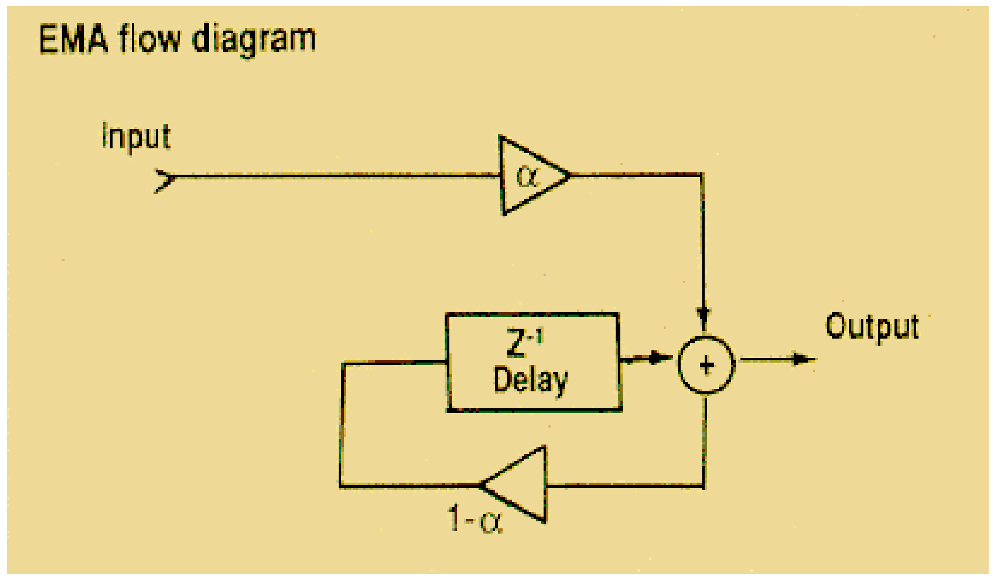
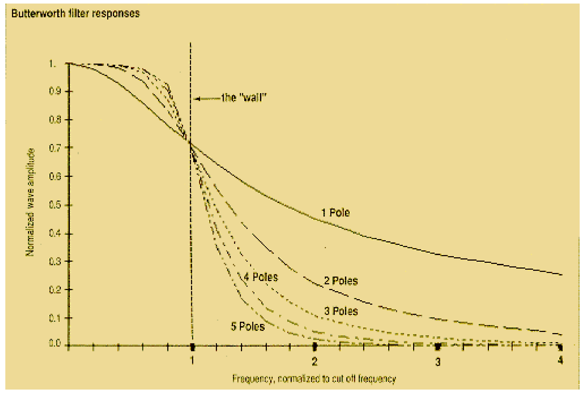
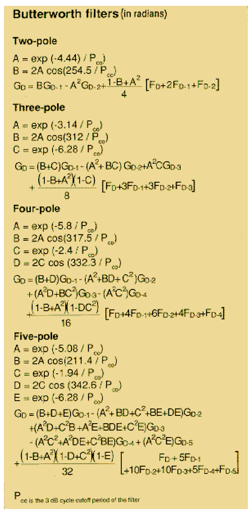
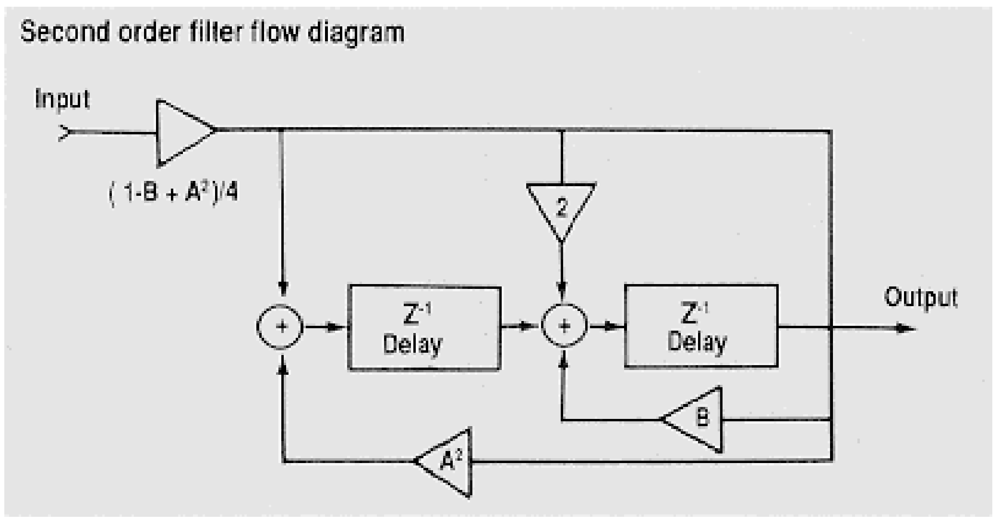
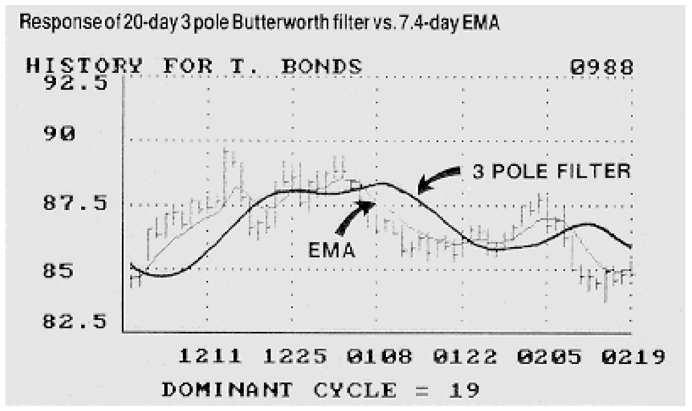

# Moving Averages and Smoothing Filters

**John Ehlers**

*Technical Analysis of Stocks & Commodities, Volume 7, Issue 3 (March 1989), pp. 87–90*

Article URL: https://technical.traders.com/archive/article.asp?file=\V07\C03\MOVAVGS.pdf

---

Moving averages are perhaps the single most widely used technical trading tool. While averages are important tools, let's face it — we don't need computers to calculate them. Traders were using moving averages long before simple calculators were commonly available. Traders simply computed the averages by hand. Since we have the awesome power of sophisticated computers now at our fingertips, it's logical to imagine that we can harness this power to create a better smoothing filter than the averages we now use. I'll show that may not be so.

The object of a smoothing filter is to pass desired frequencies (like price cycles) and to reject the undesired frequencies such as "noise" or "jitter" in everyday market action. An exponential moving average (EMA) is a filter in this sense because it attenuates (that is, diminishes) the high frequency variations while retaining the desired lower frequency variations.

Exploiting the computer's power, we can increase the complexity of a filter's transfer response to create a "stonewall" filter that has a sharp cutoff response. Such a filter passes all signals below the cutoff frequency almost without attenuation and rejects nearly all signals above the selected frequency. Thus, low frequency waves, like cycles, are extracted from a series of prices while high frequency noise is cut out.

## Transfer Response Formulas

Using the function G as the output, F as the input, and D as the incrementing variable for time, an EMA is calculated as:

$$G_D = \alpha F_D + (1 - \alpha) G_{D-1} \tag{1}$$

This expression states that the current output is a fraction of the current input (i.e., F, today's price) plus one minus that fraction times the previous output (i.e., yesterday's EMA). An EMA is recursive because the current output depends on a previous output and thus it is very efficient computationally. Using electronic symbology, Figure 1 is a flow diagram describing the EMA.



**FIGURE 1:** EMA flow diagram.

In trading we typically increment an EMA one day (or one week or month) at a time. If we let Z⁻¹ stand for the one unit delay (D-1), we can rewrite equation 1 as:

$$G = \alpha F + (1 - \alpha)(G/Z) \tag{2}$$

If we let the unit delay K = -(1-α), then α = (1+K). A little algebra then gives us:

$$G/F = (1+K) \cdot Z / (Z+K) \tag{3}$$

G/F is the EMA output divided by its input. This is the transfer response of the filter, and is usually noted as H. The Z in the numerator represents a time advance and may be ignored. So the filter transfer response is:

$$H = (1+K) / (Z+K) \tag{4}$$

The filter transfer response has some interesting properties. If we let Z (time delay) equal one, this means there is no delay. In this case, the transfer response is unity. In other words, the output is exactly equal to the input. For example, a constant input passes through the filter without attenuation. The filter passes very low frequencies, a constant input being the lowest possible frequency.

On the other hand, if we let Z = -K the denominator of the transfer response is zero. This causes the filter transfer response to go to infinity. We call this a "pole" of the filter.

You can picture the transfer response of the filter as a surface like a circus tent. The pole in the surface of the transfer response is analogous to the tentpole. Since Z is the unit delay, its amplitude can only be 1. This means that real frequencies for our filter only occur on the circle Z=1 in the Z plane. The pole can be anywhere inside the Z=1 circle.

## Filter Delays

Using a somewhat incorrect analogy, think of the rate of attenuation of the filter as the speed of a marble as it rolls down the surface away from a pole. The EMA is a single-pole filter. If we add more poles to the tent we can increase the tent slope and cause the speed of the marble to increase. Adding more poles to the filter will increase the rate of attenuation of the filter. A two-pole filter is of the form:

$$H = (1+A+B) / (Z^2 + AZ + B) \tag{5}$$

The two poles arise from the fundamental theorem of algebra that states that an Nth order polynomial will have N roots. Thus, there are two solutions to Z that are zero in the denominator of equation 5. These zeros in the denominator produce the two poles in the transfer response. Although the marble analogy is inexact, the fact is that the stonewall filter we seek can nearly be accomplished with a large number of poles.



**FIGURE 2:** Butterworth filter responses for 1 through 5 poles, normalized to cutoff frequency.

Figure 2 shows how we approach the stonewall characteristic as we increase the number of poles. To make the lines comparable, the filter characteristics are normalized to the cutoff frequency (half power bandwidth equals 0.707 wave amplitude).

## Frequency

In trading, we normally talk about the period of a cycle rather than frequency. Frequency is the reciprocal of period. That is, a 10-day cycle has a frequency of 0.1 cycles per day.

To convert normalized frequencies to real frequencies, multiply the frequency scale of Figure 2 by the selected cutoff frequency. For example, if the cutoff frequency of a two-pole filter is selected to be 0.1 cycles per day, the attenuation of this filter will produce 0.707 wave amplitude at the 0.1 cycle-per-day cutoff frequency. At twice the normalized frequency (2 on the normalized scale), the real frequency is 0.2 cycles per day and this two-pole filter will produce about a 0.25 wave amplitude at 0.2 cycles per day.

It also is convenient to think in terms of a cutoff period P_co instead of a cutoff frequency. However linear scaling of the filter frequency response requires that we use frequency in filter characteristic charts like Figure 2.

As a point of reference, a 10-day, single-pole filter roughly corresponds to a 2.1-day EMA. By scaling, a 20-day, single-pole filter corresponds to a 4.2-day EMA. The equations to calculate two-pole through five-pole Butterworth filters are in Figure 3. You can imbed these equations in your computer program when you need a higher-order filter.



**FIGURE 3:** Equations to calculate two-pole through five-pole Butterworth filters.

## Tradeoffs

Is all this math giving us better filters? Well, as with Mother Nature, we must pay a price beyond programming complexity to use higher-order filters. Higher-order filters induce a correspondingly higher number of delays (Figure 4). To have two poles we must have two delays. In a sense, pushing data through a filter is like putting water through a hose. The longer the hose, the longer it takes for water to come out the end.



**FIGURE 4:** Second-order filter flow diagram.

In trading, each day corresponds to one delay in the filter. There are five delay periods in a five-pole filter. Therefore, a rule of thumb gives about five days' delay for moderate cutoff frequency filters to rise to nearly full amplitude.

The actual delay depends on the kind of transfer response and the cutoff period (P_co) of the filter. The low frequency delay of one common filter, a Butterworth transfer response, is about N × P_co/π/π, where PI = 3.14159, or almost exactly five days for a five-pole filter having a 10-day cutoff period. The delay nearly doubles for frequencies near cutoff. Of course, this delay is devastating for trading. We can cut the delay approximately in half by selecting other transfer responses, such as a Bessel response.

A Bessel transfer response has a delay of approximately N × P_co/2/π/π. Therefore, a three-pole Bessel filter with a 20-day frequency cutoff will have about a 3-day delay. On the other hand, a 7-day EMA will have a delay of only slightly greater than one day and its amplitude response is not substantially different from the amplitude response of the three-pole Bessel filter.



**FIGURE 5:** Response of 20-day 3-pole Butterworth filter vs. 7.4-day EMA.

Figure 5 shows a comparison of the smoothing produced by a 20-day, three-pole Butterworth filter and a 7.44-day EMA. The Butterworth response is smoother, but at the expense of substantial delay.

> I feel the added complexity of programming higher-order filters simply is not justified to get satisfactory smoothing.

I feel that the added complexity of programming higher order filters simply is not justified to get satisfactory smoothing. The higher-order filters introduce additional time delays that work against traders. It also makes very little difference whether a simple moving average (SMA) or an EMA is used for smoothing. These two moving averages, by definition, have similar amplitude responses although the EMA will generally have slightly less delay than an SMA because the older data in an EMA is attenuated and has less effect on the average.

One interesting possibility is the design of several filters having the same cutoff frequency, but different numbers of poles. The outputs of these filters would have differential delays that could be exploited to create a leading indicator like the Ehlers Leading Indicator (see *Stocks & Commodities*, June and July 1988). I doubt, however, if the extra complexity is worth the effort.

> I conclude that using a moving average is adequate for smoothing data.

I conclude that using a moving average is adequate for smoothing data. Averages are the simplest approach. The simple approach minimizes programming and calculation errors. Averages also introduce the smallest amount of filter delay. It is designer's choice to use SMA or EMA because they are roughly equivalent.

---

*John Ehlers, Box 1801, Goleta, CA 93116, (805) 962-9477, is an electrical engineer working in electronic research and development and has been a private trader for 10 years. He is a pioneer in introducing maximum entropy spectrum analysis to technical trading through his MESA computer program.*

## References

- Ehlers, John [1988]. "Moving averages, part 1," *Stocks & Commodities*, June, p. 37.
- Ehlers, John [1988]. "Moving averages, part 2," *Stocks & Commodities*, July, p. 25.
- Hutson, Jack K. [1983]. "Triple exponential smoothing oscillator: Good Trix," in *Stocks & Commodities, Profitable Trading Methods, Volume 1*, p. 105.
- Hutson, Jack K. [1984]. "Filtered price data: Moving averages vs. exponential moving averages," in *Stocks & Commodities, Investment Techniques, Volume 2*, p. 102.
- Lambert, Donald K. [1984]. "Exponentially smoothed moving averages," in *Stocks & Commodities, Investment Techniques, Volume 2*, p. 182.
- Schmidt, Heidi [1988]. "Moving averages made simple," *Stocks & Commodities*, March, p. 20.
- Technical Analysis Staff [1983]. "A technical review: Moving averages," in *Stocks & Commodities, Profitable Trading Methods, Volume 1*, p. 36.
- Warren, Dr. Anthony [1983]. "Data filtering methods for technical analysis," in *Stocks & Commodities, Profitable Trading Methods, Volume 1*, p. 74.
- Warren, Dr. Anthony [1983]. "Optimizing TRIX," in *Stocks & Commodities, Profitable Trading Methods, Volume 1*, p. 137.

## BibTeX

```bibtex
@article{ehlers1989movavgs,
  author    = {Ehlers, John F.},
  title     = {Moving Averages and Smoothing Filters},
  journal   = {Technical Analysis of Stocks \& Commodities},
  volume    = {7},
  number    = {3},
  pages     = {87--90},
  year      = {1989},
  month     = mar,
  url       = {https://technical.traders.com/archive/article.asp?file=\V07\C03\MOVAVGS.pdf}
}
```
