# Cyclic Personalities

**John Ehlers**

*Technical Analysis of Stocks & Commodities, Volume 7, Issue 4 (April 1989), pp. 132–134*

Article URL: https://technical.traders.com/archive/article.asp?file=\V07\C04\CYCLICP.pdf

---

Are there basic differences in the cyclic behavior of various commodities? Although theory predicts short-term cycles will come and go, there is no theory predicting different cyclic "personalities" for different commodities. My experience has been that cyclic trading is successful for some commodities but not for others. My curiosity about the cyclic behavior of different commodities was aroused during the development of a Maximum Entry Spectral Analysis program (MESA) that provided backtesting. Using the program, I measured the cycles of 12 commodities over the past two years. I found that each commodity does have its own cyclic personality. Moreover, commodities within the same category (meats, grains, metals) do not necessarily have similar cyclic personalities.

## Cycle Measurements

I used perpetual daily contracts containing 500 records, and the average of the high and low for each day determined the price from which the cycle was measured. The program then measured the short-term cycles for each 50-day period, starting with record number 50. (The program needed the first 50 records to make the first measurement.) The dominant cycle and cyclic content were measured daily for records 50–500, a total of 451 measurements.

"Cyclic content" is a signal-to-noise ratio over 6 decibels. Noise is all of the non-cyclic energy with periods of less than 5 days and greater than 40 days. (Noise by this definition includes trendlines as well as the random day-to-day fluctuations of price.) My experience is that a cyclic content of at least 6 decibels is useful for trading. At lower values, the noise greatly influences any predictions based on cycles, reducing the accuracy of the predictions. Therefore, I discarded measurements having a cyclic content of less than 6 decibels.

The program created a histogram of those cycles with cyclic contents exceeding the 6-decibel threshold. The histogram is a cumulative count of how many times a 5-day cycle occurred, how many times a 6-day cycle occurred, and so on.

The result of this cumulative counting gives us two parameters with which to compare the cyclic behavior of the commodities. The first parameter is how "cyclic" was the overall contract — that is, how many times the threshold exceeded 6 decibels out of the 451 possibilities.

The second parameter is the dominant cycle — the contract's "personality." The dominant cycle is the histogram's peak response (or near-the-peak response in the case of asymmetry). I allowed a margin of ±2 days surrounding the peak to account for error in computing the percentage of days that the contract exhibits its dominant cycle.

## Dominant Cycle

Figure 1 summarizes the measured results. The most cyclic commodities have dominant cycles that exceed the 6-decibel threshold 30%–40% of the time. In general, the most cyclic contracts also have the highest percentage of days exhibiting cyclic behavior — their "personalities" are most pronounced.

### Figure 1: Measured Cyclic Personalities

| Contract | Dominant Cycle (days) | % Days within ±2 days of dominant cycle | % Total above 6 dB threshold |
|---|---|---|---|
| S&P 500 | 9 and 14 | 16.6 and 11.3 | 37.7 |
| T-Bonds | 12 | 16.0 | 36.4 |
| Pork bellies | 16 | 14.9 | 41.0 |
| Deutschemark | 13 | 14.9 | 37.7 |
| Japanese Yen | 11 | 10.0 | 20.4 |
| Cattle | 14 | 8.4 | 30.6 |
| Copper | 16 | 6.6 | 33.0 |
| Cocoa | 12 | 6.0 | 21.7 |
| Wheat | 11 and 19 | 6.0 | 26.2 |
| Sugar | 11 and 12 | — | 20.6 |
| Gold | 12 | — | 15.1 |
| Hogs | 19 | — | 20.4 |

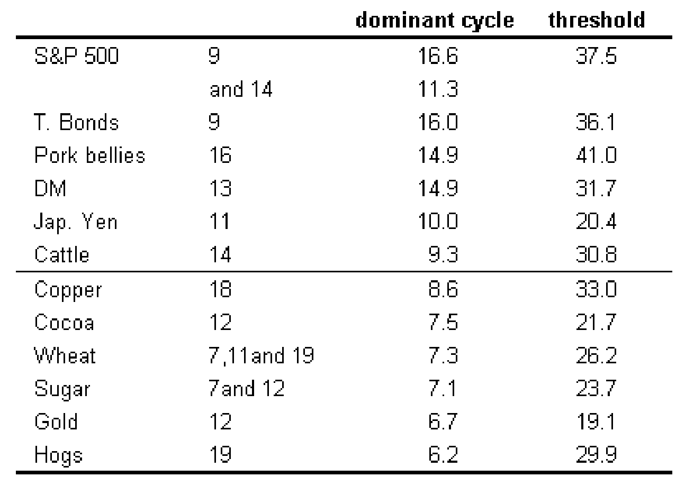

> The measured histograms are shown in Figures 2–13. In speaking of cycle personalities, it is interesting to note that the S&P 500 is "schizophrenic," given its dual personality of 9 and 14 days.

After this experiment, I better understand why I could make cyclic trades in some commodities and not in others. I now focus my trading activity on those contracts that exhibit their dominant cycle the highest percentage of the time.

---

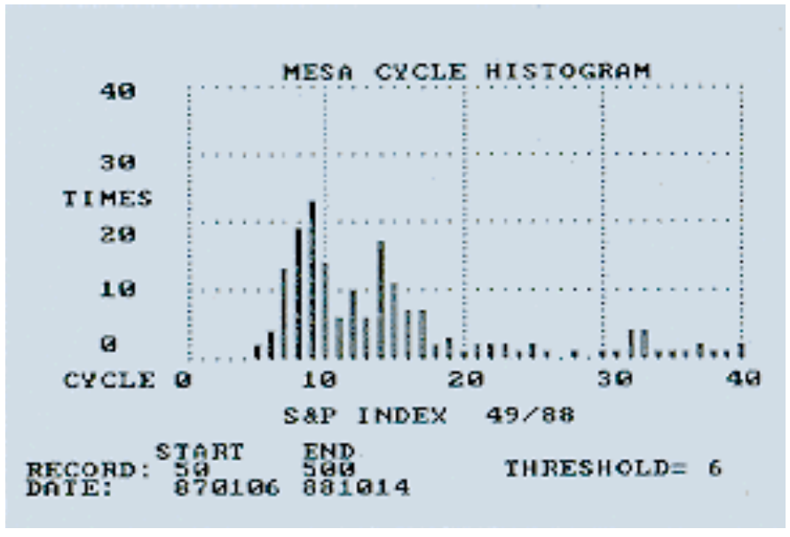

**FIGURE 2:** S&P 500 cycle histogram.

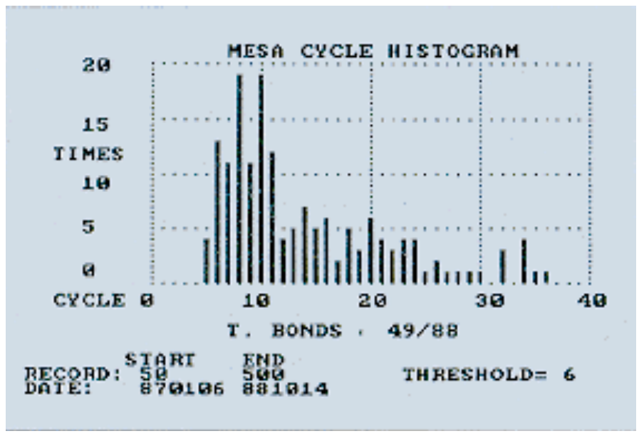

**FIGURE 3:** T-Bonds cycle histogram.

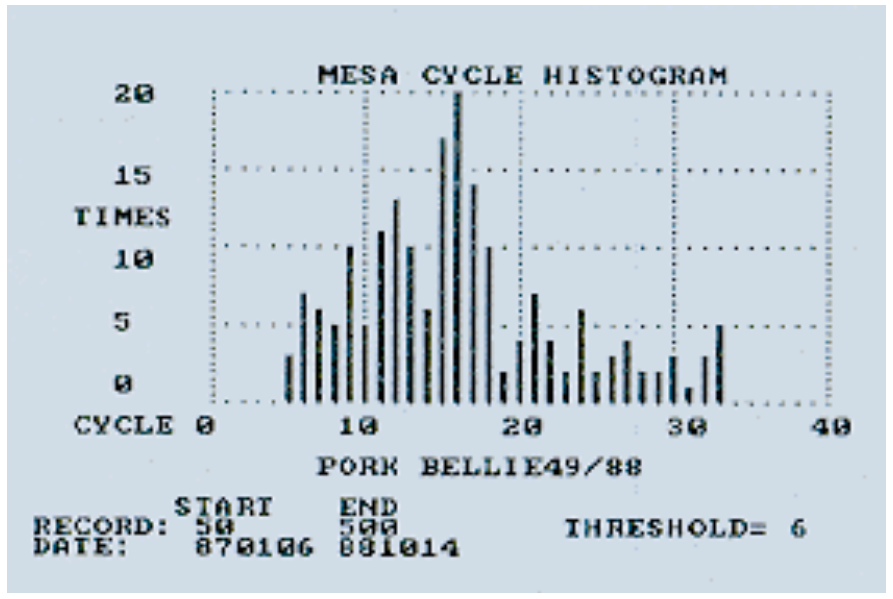

**FIGURE 4:** Pork bellies cycle histogram.

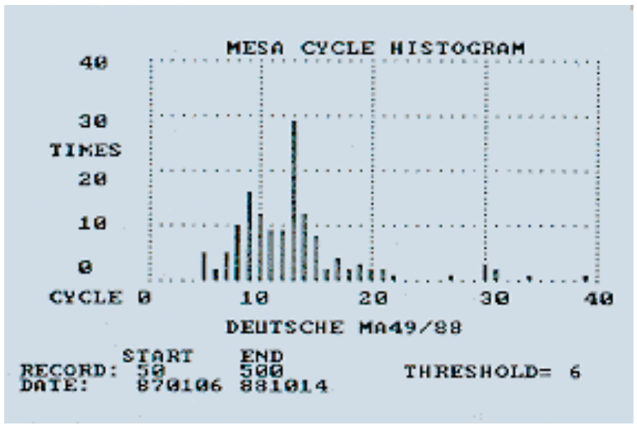

**FIGURE 5:** Deutschemark cycle histogram.

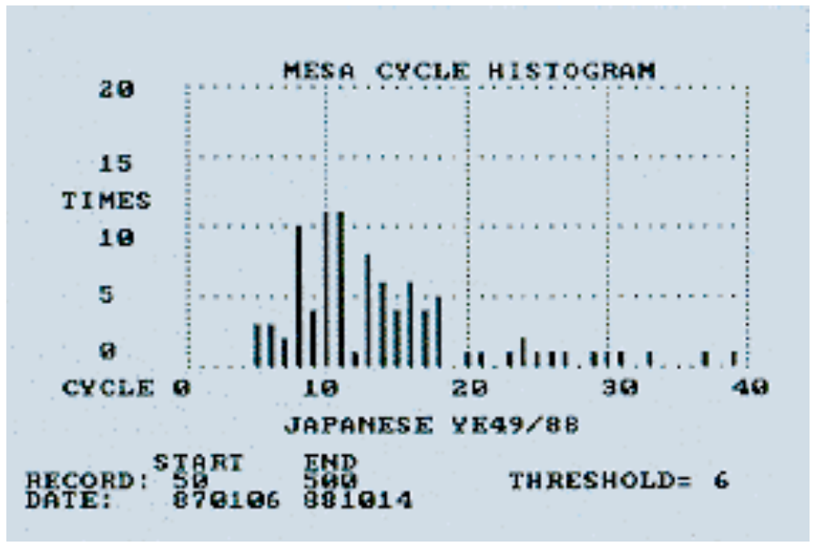

**FIGURE 6:** Japanese Yen cycle histogram.

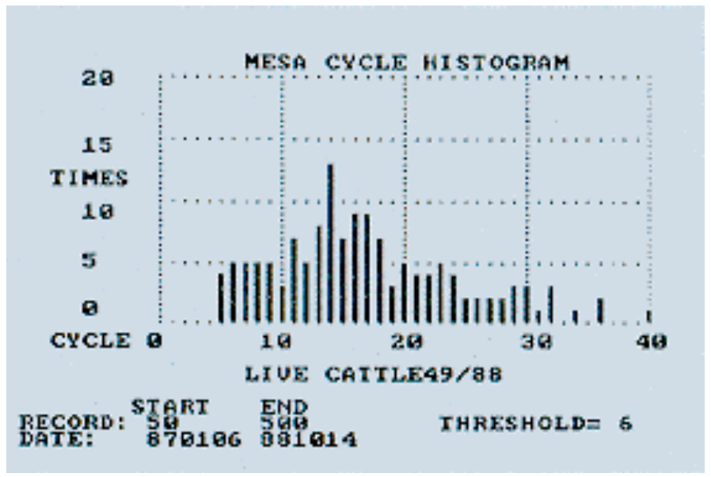

**FIGURE 7:** Cattle cycle histogram.

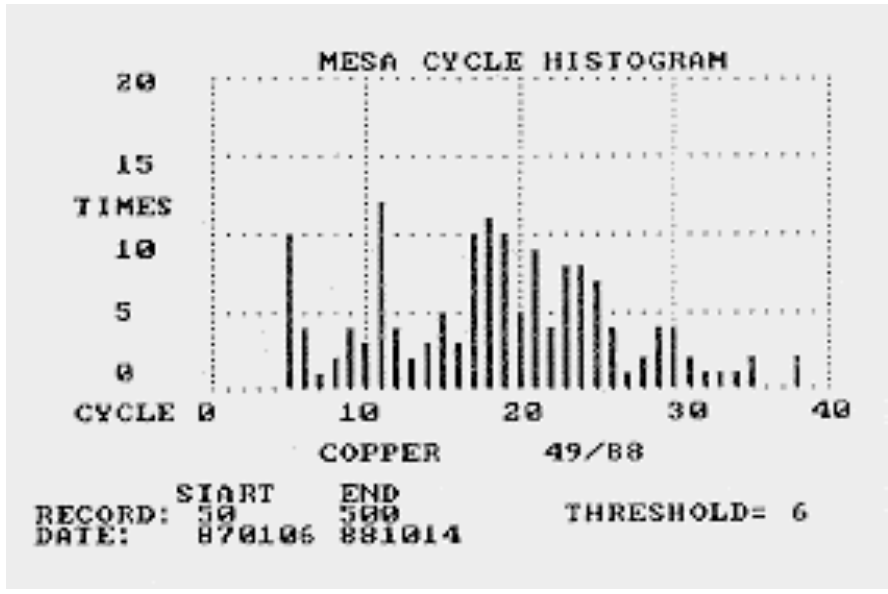

**FIGURE 8:** Copper cycle histogram.

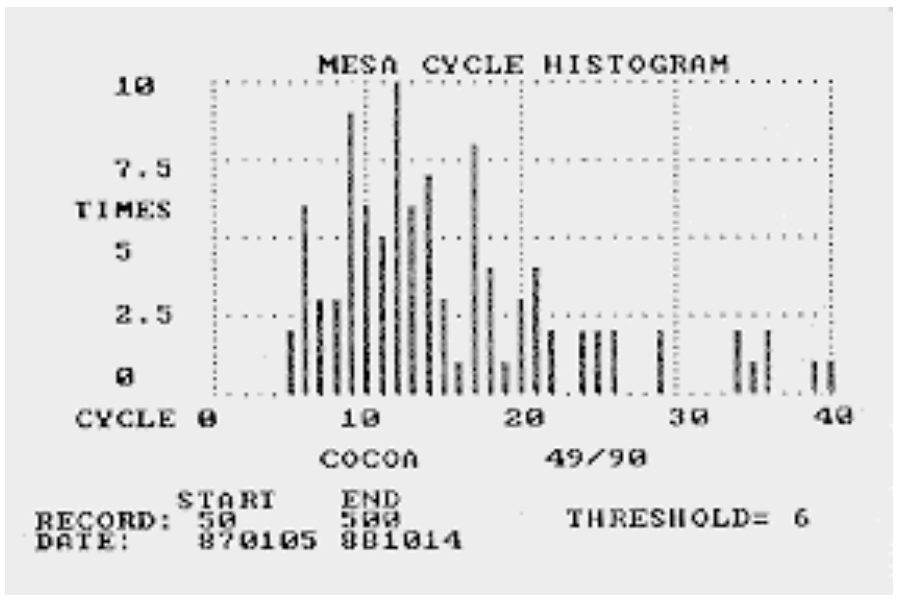

**FIGURE 9:** Cocoa cycle histogram.

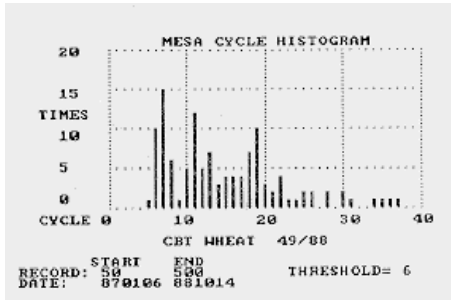

**FIGURE 10:** Wheat cycle histogram.

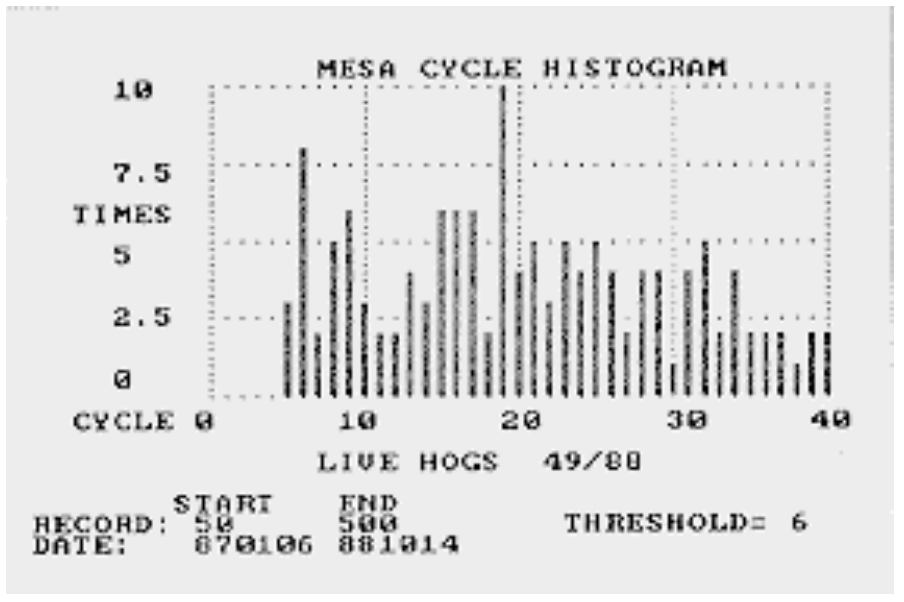

**FIGURE 11:** Hogs cycle histogram.

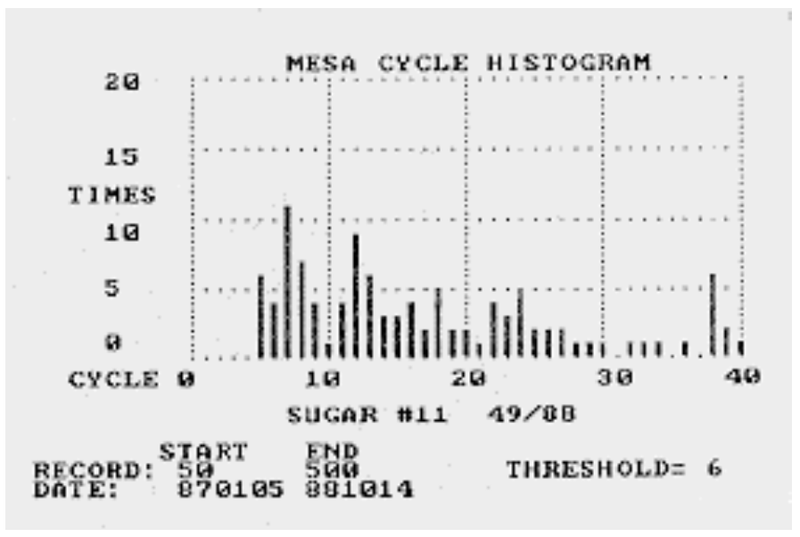

**FIGURE 12:** Sugar cycle histogram.

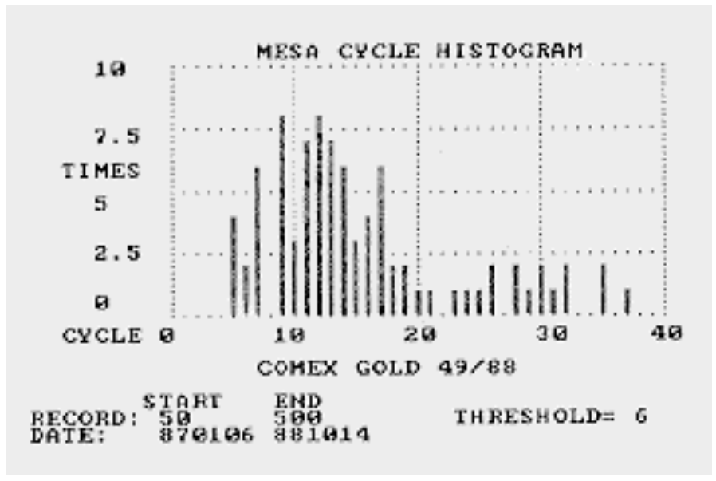

**FIGURE 13:** Gold cycle histogram.

---

*John F. Ehlers, Box 1801, Goleta, CA 93116, (805) 962-9477, is an electrical engineer working in electronic research and development, and has been a private trader for 10 years. He is a pioneer in introducing maximum entropy spectrum analysis to trading analysis through his MESA computer program.*

## BibTeX

```bibtex
@article{ehlers1989cyclic,
  author    = {Ehlers, John F.},
  title     = {Cyclic Personalities},
  journal   = {Technical Analysis of Stocks \& Commodities},
  volume    = {7},
  number    = {4},
  pages     = {132--134},
  year      = {1989},
  month     = apr,
  url       = {https://technical.traders.com/archive/article.asp?file=\V07\C04\CYCLICP.pdf}
}
```
