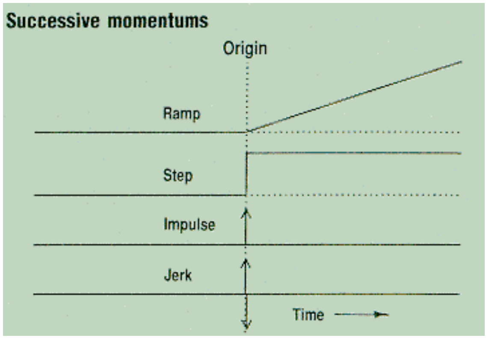
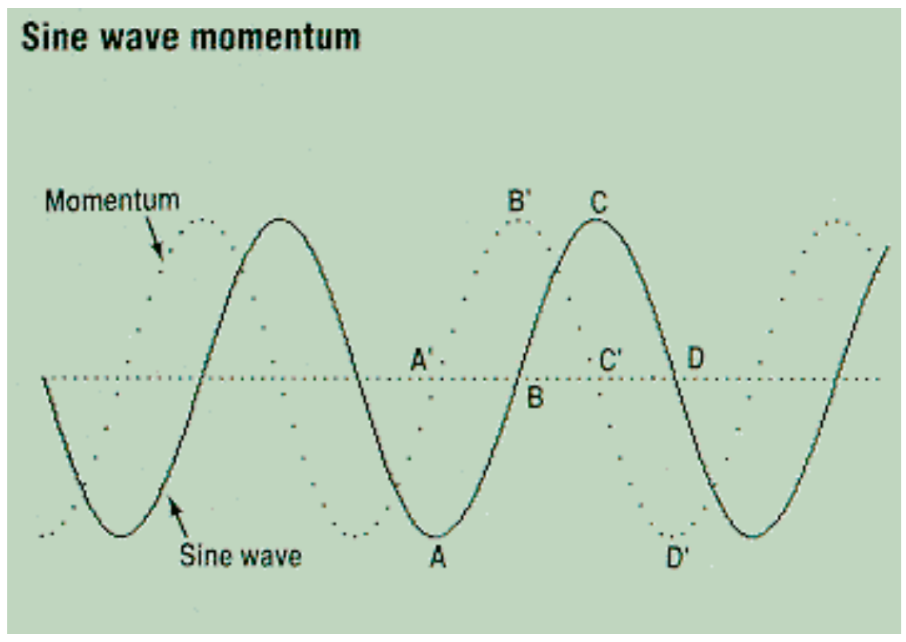
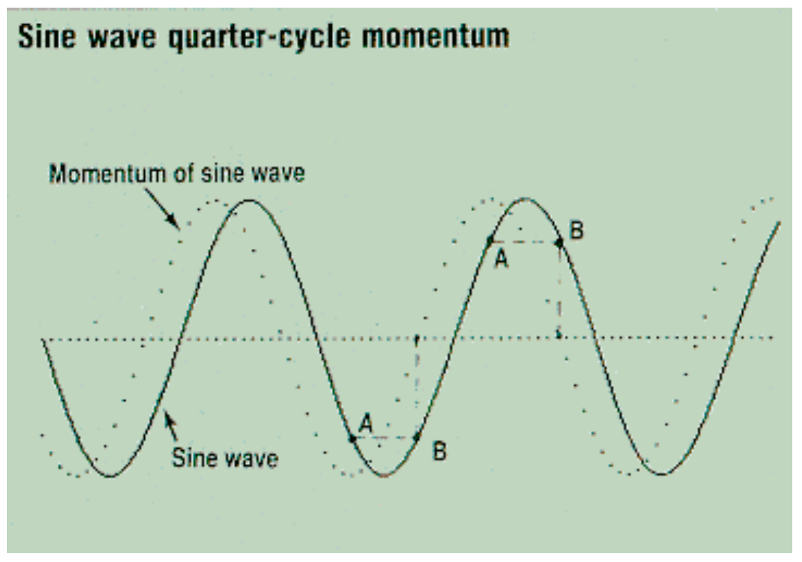

# Leading Indicators with Momentum

**John Ehlers**

*Technical Analysis of Stocks & Commodities, Volume 7, Issue 9 (September 1989), pp. 307–309*

Article URL: https://technical.traders.com/archive/article.asp?file=\V07\C09\LEADING.pdf

---

Newcomers to technical trading are often confused by terminology. Oscillators don't oscillate and stochastics have nothing to do with random variables. Neither does momentum describe the force required to bring a moving body to rest. In the simplest case, momentum is just the difference between two time-related variables. I have found that, when combined with moving averages, momentum can produce some useful indicators.

Because momentum measures the difference of two elements in time, we can consider it a measure of the rate of change. More specifically, momentum can be considered the equivalent of the derivative of a continuous function, the opposite of the integral in calculus. From this we can draw some interesting general conclusions about the properties of momentum, two of which hold the most interest to traders.

The first momentum property is that it detrends the time function. By taking the difference of day-to-day variations, the slower variations of the trend are greatly reduced relative to the shorter variations. As a result, trend is "filtered" out, leaving short-term tactical trading opportunities.

The second useful momentum property is that it creates leading indicators. Because moving averages always introduce a lag and are analogous to calculus integrals and momentum is analogous to the derivative, a combination of the two can yield useful indicators.

## Noise

The undesired side effect of momentum functions is increased noisiness. Sometimes this increase is so severe that the information in the momentum function is completely masked by the noise. The effects of the noise can be mitigated somewhat by averaging. Noise manifests itself as jumps and erratic behavior in the charts that mask the real trend flow.

Figure 1 illustrates how successive momentums contribute to the noise effect. The original function is a ramp that breaks upward at the origin, so that its rate change instantaneously jumps from zero left of the origin to a constant value to the right of the origin. Therefore, the momentum of the ramp is a step function.

The momentum of the step function is the impulse — a rate change that is zero to the left and right of the origin but infinite exactly at the origin. An impulse is a concept where the height is infinite and the width is zero in such a way that the area within the "rectangle" of the impulse is unity. This property allows you to calculate the unit amplitude step function by taking the moving average of the impulse.

When we take the momentum of the impulse, we get a bipolar impulse called a jerk. The momentum is zero to the left and right of the origin. However, exactly at the origin, the momentum is positive infinite up the front "edge" of the impulse rectangle, and becomes negative infinite as it travels down the back side of the impulse rectangle.

The general conclusion from the successive momentums of Figure 1 is that the resulting function (i.e., the momentum of the original impulse) is always more discontinuous than the preceding function. Discontinuities in the time domain lead to broad band energy, or white noise, in the frequency domain.



**FIGURE 1:** Each successive momentum is always more discontinuous than its preceding function.

## Averaged Momentum

Let's consider for clarity that the price varies day-to-day as the letter sequence a, b, c, d, e.... The first 4-day moving average is:

$$A_1 = (a + b + c + d) / 4$$

and the second 4-day moving average is:

$$A_2 = (b + c + d + e) / 4$$

If we take the momentum of these two moving averages, we obtain the first momentum point, M:

$$M = A_2 - A_1 = (e - a) / 4$$

The function (e-a) is called a 4-day momentum. The 4-day momentum is equal (within a constant like 1/4) to the simple momentum of the 4-day moving average. We can extend the result to conclude that an n-day momentum will be smoother than a simple momentum. The degree of smoothing and the resulting lag are proportional to the selection of n.

## Momentum and Cycles

The relationship of leading and lagging functions is perhaps best seen from the perspective of cycles. The leading function produced by the momentum of a sine wave is shown as the dotted line in Figure 2. When the solid line sine wave is at its negative maximum, A, its rate of change, A', is zero. As the sine wave passes through zero, B, the momentum has its maximum positive rate of change, B'. The rate of change is zero, C', at the positive maximum, C, of the sine wave and the rate of change is negative maximum, D', as the sine wave passes downward, D, through zero. The result is that the momentum of a sine wave is a cosine wave, leading the original price function by 90 degrees. Bearing the discontinuities or bumpiness of real prices in mind, we may want to do a moving average to obtain some smoothing.



**FIGURE 2:** Momentum leads original price by 90 degrees.

> The result is that the momentum's output is exactly in phase with the original price function.

The "optimum" moving average for a sine wave is often the half-cycle period. When we take such a half-cycle moving average, the result is delayed (lags) 90 degrees from the original price function. If we take the momentum of the half-cycle average, the momentum introduces a 90-degree phase lead. The result is momentum's output is exactly in phase with the original price function.

Momentum oscillators such as Relative Strength Index (RSI) and stochastics can be optimized for the price cycle by using the half-cycle period in the momentum part of the indicator. The resulting oscillator will be in phase with price.

If we want a leading indicator, the period of the momentum must be shortened. For example, Figure 3 shows the leading indicator formed by the quarter-cycle momentum of the sine wave price function. Points A and B on the price function are one quarter cycle apart and are the same amplitude, causing the momentum at point B to be zero, that is, zero before the sine wave reaches zero.



**FIGURE 3:** Points A and B are one quarter cycle apart. This momentum produces a leading indicator.

With due caution, some interesting leading indicators can be formed. While intriguing to use as leading indicators, always be aware that n-day momentums, where n is less than a half cycle, will result in indicators that are more noisy than the original price function. This added noise can produce false buy and sell signals.

In summary, knowing that momentum is the analog of a calculus derivative, means that it can produce detrended and leading indicators at the expense of increased noise. The effects of noise can be mitigated by using moving averages, but the moving average introduces lag. The judicious use of averaged momentums can produce useful leading indicators when the noise in the price function is not too great.

---

*John Ehlers, Box 1801, Goleta, CA 93116, (805) 962-9477, is an electrical engineer working in electronic research and development and has been a private trader for 10 years. He is a pioneer in introducing maximum entropy spectrum analysis to technical trading through his MESA computer program.*

## References

- Ehlers, John [1985]. "Understanding cycles," *Stocks & Commodities*, December, p. 24.
- Ehlers, John [1986]. "Optimizing RSI with cycles," *Stocks & Commodities*, February, p. 24.
- Ehlers, John [1986]. "Optimizing directional movement with cycles," *Stocks & Commodities*, March, p. 36.

## BibTeX

```bibtex
@article{ehlers1989leading,
  author    = {Ehlers, John F.},
  title     = {Leading Indicators with Momentum},
  journal   = {Technical Analysis of Stocks \& Commodities},
  volume    = {7},
  number    = {9},
  pages     = {307--309},
  year      = {1989},
  month     = sep,
  url       = {https://technical.traders.com/archive/article.asp?file=\V07\C09\LEADING.pdf}
}
```
