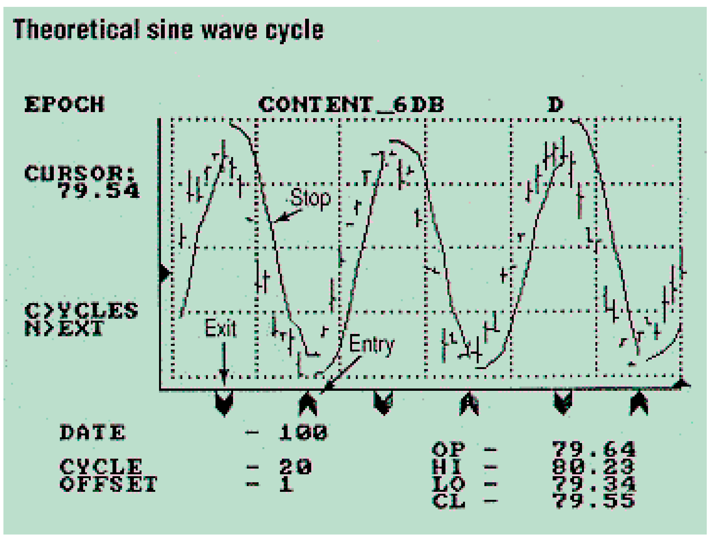
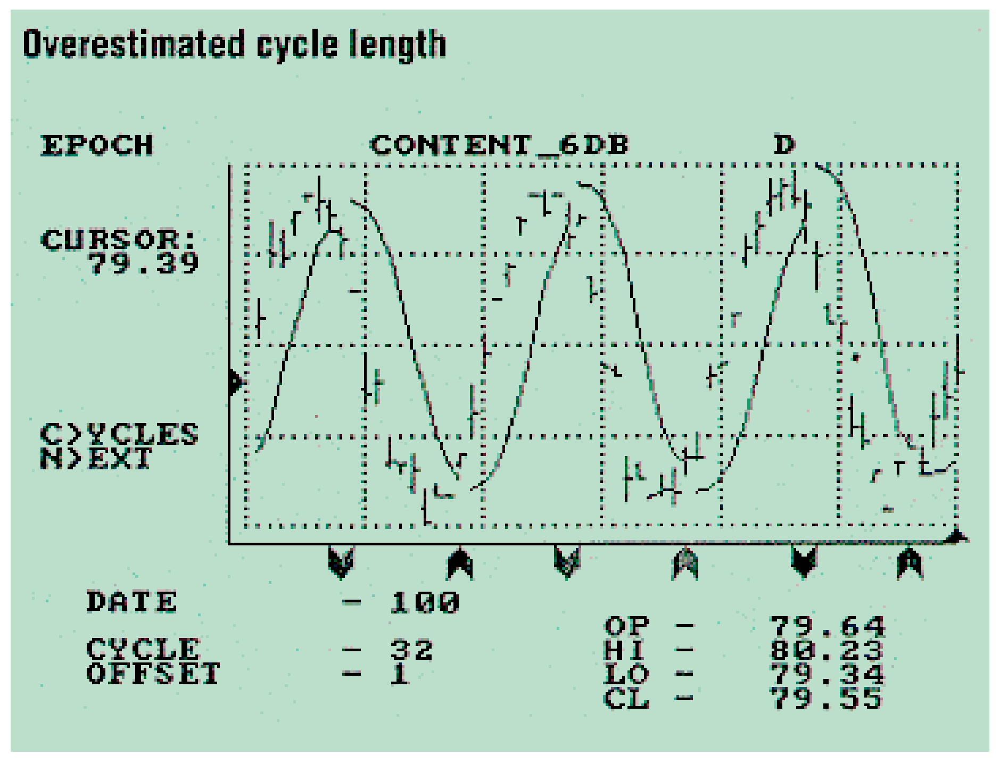
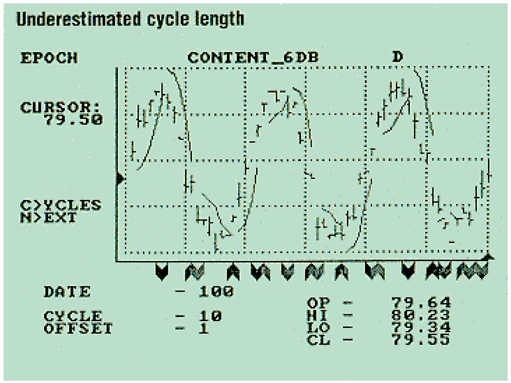
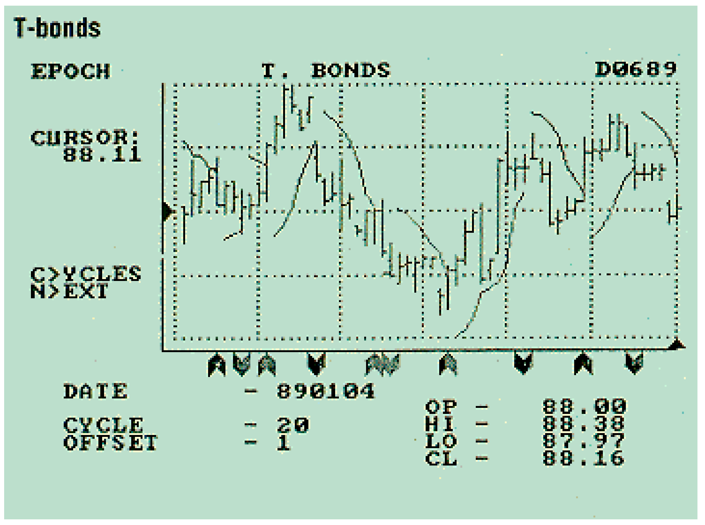

# Setting Stops — A New Approach

**John Ehlers**

*Technical Analysis of Stocks & Commodities, Volume 7, Issue 11 (November 1989), pp. 408–410*

Article URL: https://technical.traders.com/archive/article.asp?file=\V07\C11\SETTING.pdf

---

The cliche in golf is "drive for show, but putt for dough." The analogy in technical trading is that the ability to pick entry points is highly focused, but scant attention is paid to how to exit a trade. This is unfortunate, because skillfully selected exit points can often make a large difference between overall profit and loss.

There are, of course, several exit strategies in common usage. One is to exit with a predefined profit or loss. Another is J. Welles Wilder's parabolic stop-and-reverse or SAR. I use an exit strategy based on a following stop in my EPOCH trading software. The exit point also can be used to establish stop-and-reverse positions if you desire to follow the contract in both long and short positions.

## Key Stop Elements

An effective generalized stop system must allow sufficient risk to give the trade a chance to "breathe." The system also must include features that minimize profit loss when a major movement is expected to occur. I use cycle theory to provide the elements necessary to implement a stop-loss strategy.

The key elements of the stop are placement of the initial position and the way the stop accelerates or "tightens" on price to preserve profits.

## The Initial Position

Price activity can be viewed as a short-term cycle a relatively high percentage of the time. These short-term cycles contain superimposed noise which may be thought of as high-frequency price action that cannot be explained by cycles. For example, the high-to-low daily variation is a component of this "noise." If we want to allow enough risk for our trade to breathe and accommodate the noise variations, we must set the stop so the noise will not erroneously take us out of a desirable trade. The obvious solution is to use the average daily volatility as a key to setting the initial stop.

> If we want to allow enough risk for our trade to breathe and accommodate the noise variations, we must set the stop so noise will not erroneously take us out of a desirable trade.

Using daily volatility is a method of setting the stop in concert with the prevailing market conditions. Daily volatility is just the difference between the high and low for the day. Averaging the daily volatility over the last half cycle of prices provides a reasonable measure of current price activity. This average volatility is then subtracted from the low of the day of entry (for a long position) to establish the stop for the next day's trading. Of course, the average volatility is added to the entry day's high to place the initial stop for a short position.

I don't use a stop on the day of entry mainly because the initial position is unclear. For example, entry into the position could be from a previous stop-and-reverse. It is not possible to place a stop on a position you don't yet have. You often don't know in a timely manner if the stop has been reached. The average volatility almost requires a limit move to trigger the initial stop in many cases. The stop gives no protection against limit moves.

In any event, the first key element of stop placement is that the initial stop is placed a distance equal to the average daily trading range below the low (or above the high) of the day of entry. The average is taken over the most recent half-cycle length of data.

## Acceleration

The purpose of introducing an acceleration factor into stop placement is to successively tighten the stop to preserve accumulated profits when price makes a significant reversal. The operative words are "significant reversal." How do we tell a significant reversal from noise in the real-time activity of our trading? I again turn to cycle theory for my answer.

If we know the length of the short-term price cycle, we know that the optimum duration of the trade is half the cycle. The long position phase of the half cycle takes us from the valley of the price to its peak. The short position phase takes us from the peak to the valley. Knowing this, we want to base the acceleration of our stop on trade duration.

My strategy is to remove a fraction of the difference between the previous day's low and its stop value (for long trades). The fraction increases linearly as the age of the trade increases so that by the time the contract age reaches half cycle length, the difference is removed to set the next stop.

This scheme accelerating the stop allows the trade to mature gracefully. Very little difference between the day's low and its stop are removed in setting the stop for the next day's trading early in the trade. Nonetheless, profits are protected because the next day's stop is raised if today's low is higher than before. When the age of the trade reaches half cycle length, removing the entire difference means the price would have to increase dramatically to avoid touching the stop on the next day.

The equation for setting tomorrow's stop is:

$$\text{STOP}_{D+1} = \text{STOP}_D + (2 \cdot \text{Age} / \text{DC}) \cdot (\text{LOW}_D - \text{STOP}_D)$$

where D is the incrementing variable, and DC is the dominant cycle.

The rate of the acceleration easily can be made to be much faster. For example, we could square the (2·Age/DC) term, but practical experience shows that the additional complexity yields little, if any, additional payoff.



**FIGURE 1:** In this theoretical 20-day cycle, the stop-and-reverse quickly converges to nearly a consistent optimum pattern.

Figure 1 shows how the stop performs using a theoretical sine wave short-term cycle with randomized daily variations. In the case of this theoretical 20-day cycle, the stop-and-reverse quickly converges to nearly a consistent pattern.

It is interesting to see the effects of incorrect estimates of the cycle. If we estimate the 20-day cycle to be 32 days, Figure 2 results. There is only a small penalty in making the estimate of the cycle too long because the reversing price quickly touches the stop even though the acceleration factor is not large. On the other hand, underestimating the cycle length causes the stop to accelerate rapidly before the price reverses, causing a reversal into a losing position. This impact is demonstrated in Figure 3, where a 10-day cycle was estimated for the real 20-day cycle.



**FIGURE 2:** Overestimating the 20-day cycle to be 32 days creates a smaller profit penalty than underestimating the cycle length.



**FIGURE 3:** Underestimating the cycle length causes the stop to accelerate rapidly before the price reverses, causing a reversal into a losing position. Here, a 20-day cycle was estimated to be a 10-day cycle.

Effective performance of this cycle-based stop strategy is not limited to theoretical waveforms. For example, Figure 4 shows how the stop-and-reverse produced $1,490 gross profit on 10 closed T-bond trades over a 60-day span: 66% of the trades were winners and potential losses were always protected by the stop.



**FIGURE 4:** The cycle-based stop strategy is effective in normal trading such as T-bonds, where 66% of the trades over 60 days produced $1,490 gross profit.

## Conclusions

An effective stop system can turn your overall trading activity from losing to winning. Two key elements are involved in positioning a market-adaptive stop system: the initial offset and the acceleration factor. The initial offset can be set as a factor times the average daily volatility. It is not uncommon for that factor to be between one and two.

The acceleration factor decreases the previous difference between the low price and the stop to establish the new stop relative to the old low. The acceleration increases linearly until the entire difference is removed when the age of the trade reaches the length of the half-dominant cycle.

The key to making this stop system work effectively is making the proper estimate or measurement of the price cycle. You can assume a nominal cycle length of, say, 20 days and use this length universally. Such an assumption will not yield optimum profits, but the estimate is longer than most commodity short-term cycles so the risk of being whipsawed is reduced.

A better approach is to estimate the short-term cycle by counting the period from low-to-low or high-to-high by eye or with one of the cycle-finding tools. I prefer to accurately measure the cycle with my MESA program, naturally, but you could use Stocks & Commodities' MESA subroutine or those implemented in a number of software packages.

---

*John Ehlers, Box 1801, Goleta, CA 93116, (805) 962-9477, is an electrical engineer working in electronic research and development and has been a private trader for 10 years. He is a pioneer in introducing maximum entropy spectrum analysis to technical trading through his MESA program.*

## References

- Sweeney, John [1989]. "EPOCH," *Stocks & Commodities*, June, p. 69.
- Ehlers, John [1989]. "Leading indicators with momentum," *Stocks & Commodities*, September, p. 78.

## BibTeX

```bibtex
@article{ehlers1989stops,
  author    = {Ehlers, John F.},
  title     = {Setting Stops --- A New Approach},
  journal   = {Technical Analysis of Stocks \& Commodities},
  volume    = {7},
  number    = {11},
  pages     = {408--410},
  year      = {1989},
  month     = nov,
  url       = {https://technical.traders.com/archive/article.asp?file=\V07\C11\SETTING.pdf}
}
```
