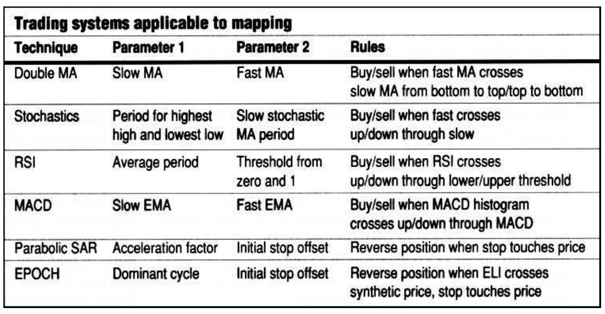
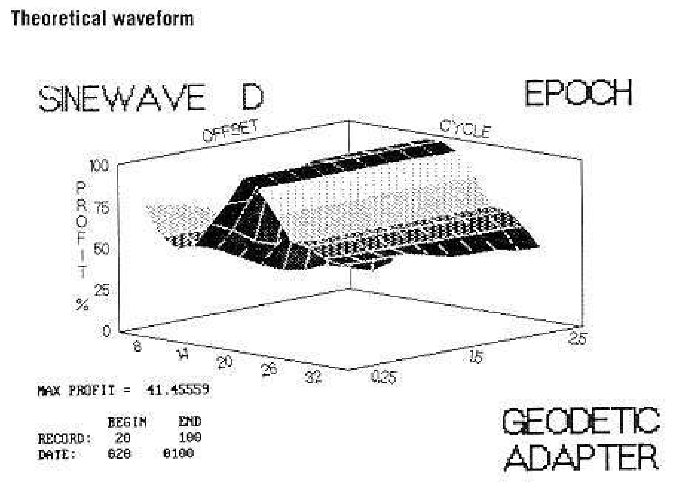
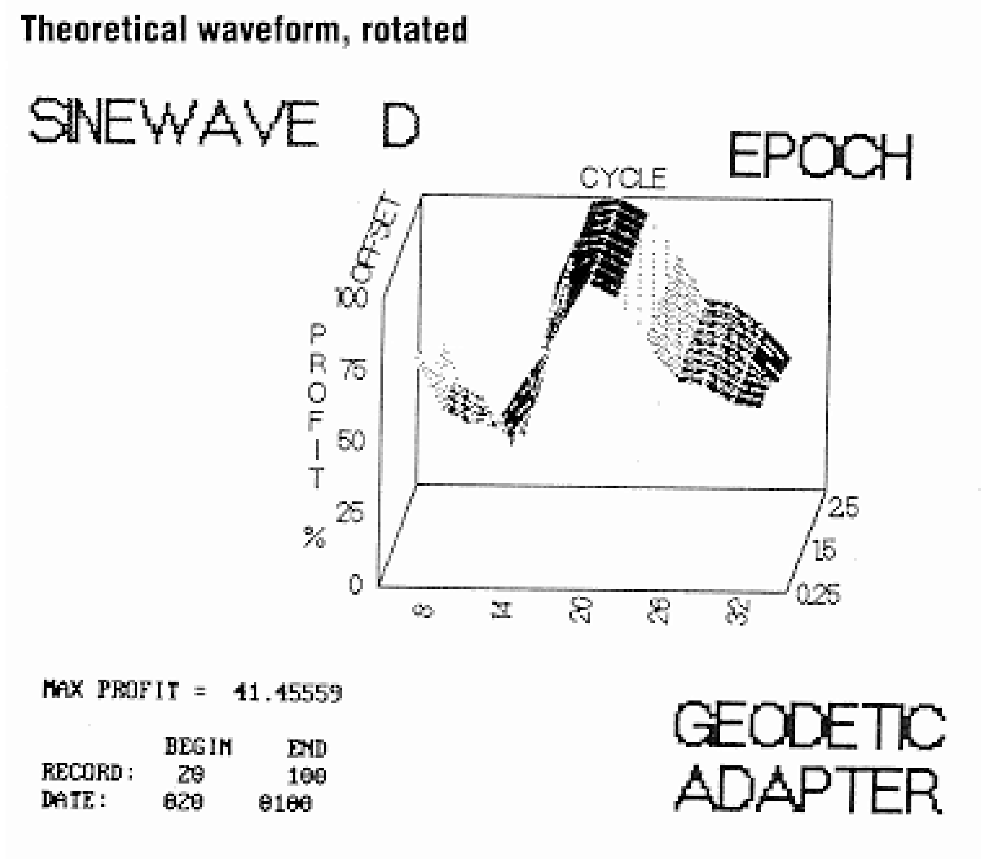
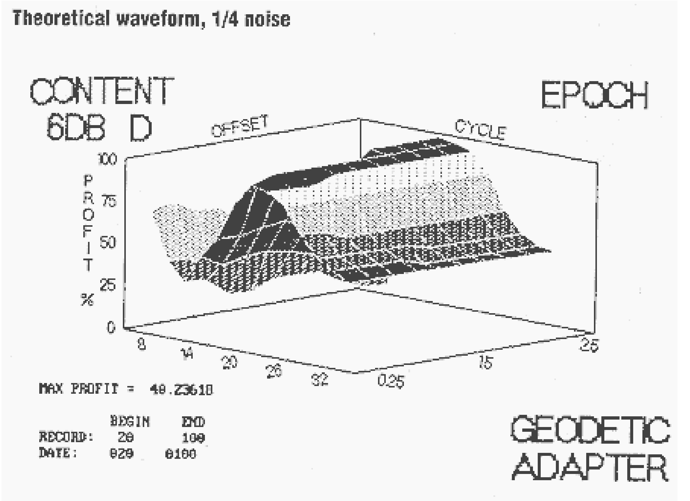
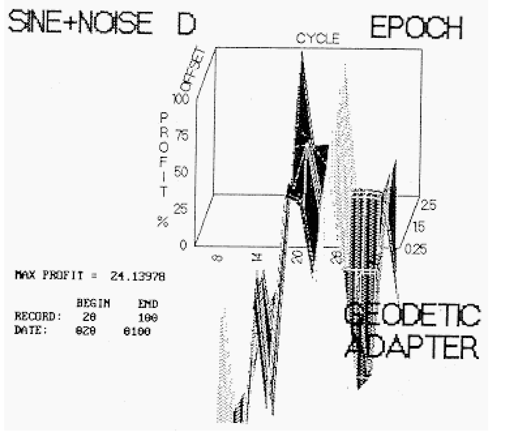
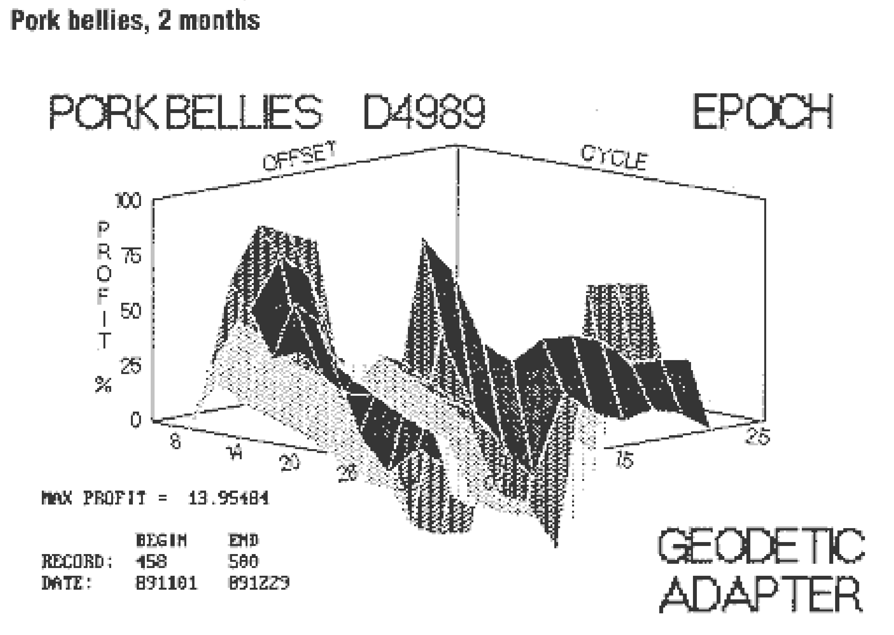
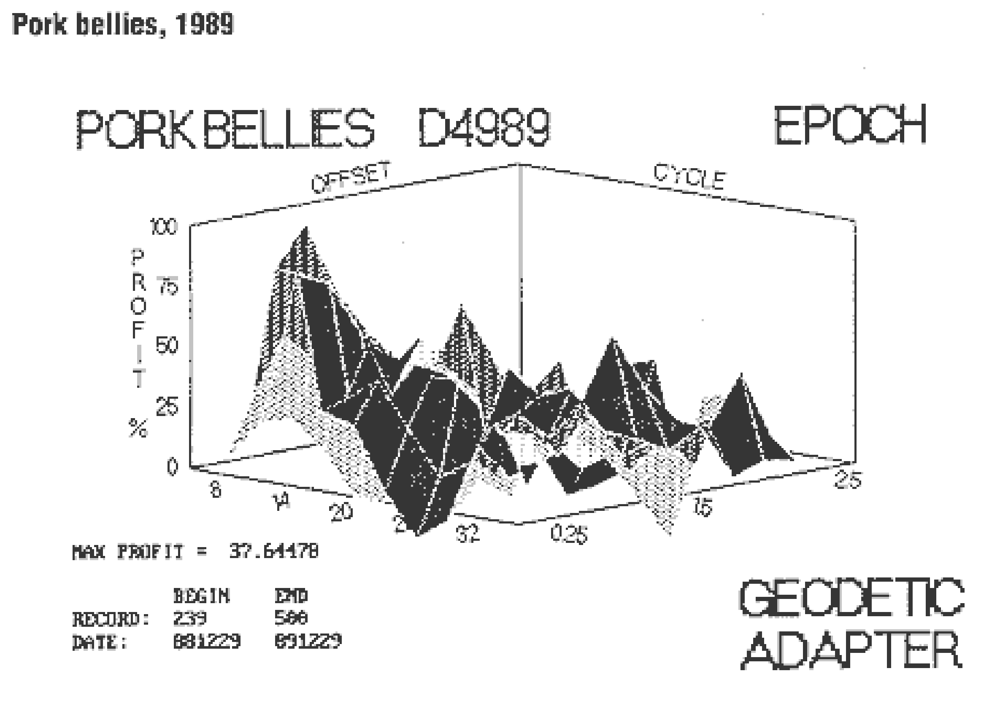

# Profit Mapping

**John Ehlers**

*Technical Analysis of Stocks & Commodities, Volume 8, Issue 4 (April 1990), pp. 163–166*

Article URL: https://technical.traders.com/archive/article.asp?file=\V08\C04\PROFIT.pdf

---

Optimization has been attacked by many technicians — and rightfully so — because peaking profit is virtually the same as curve fitting to back data. Used in this fashion, optimization can produce startling track records and still be useless for future trading. Market characteristics do change, however, and technical traders need a tool to help them adjust their preferred techniques to the changing market to improve profitability. Calculating the profit at any combination of parameters and making a three-dimensional map of the result is such a tool.

Common technical trading techniques use combinations of parameters to model market activity. The parameters are constructed so their variation has some meaning to the trader. An example of a trading technique is based on the crossing of two moving averages with different periods. The trading rule for this technique might be "Buy when the shorter moving average crosses the longer moving average from bottom to top and sell when it crosses from top to bottom." In this case, the parameters describing the market are the periods of the two moving averages.

If the markets are changing, it makes sense that the parameters of the models also change. The dual moving average technique would produce higher profits if the two parameters were continuously adjusted. Conventional optimization would make an exhaustive search of all parameter combinations to find those that return maximum profits — exactly the curve fitting to avoid.

## A Better Way

A superior approach over maximizing historical profitability is to reduce the sensitivity of profits to parameter variation. This can be visualized as a three-dimensional plot, with one parameter scaled along the x-axis and the second parameter scaled along the y-axis. The profit at each x-y intersection is plotted as height along the z-axis. Using this topographic map, we can find the region where variations in both the x and y dimensions have a small impact on profitability. This is the region we seek because historical low-parameter sensitivity implies continued low sensitivity. The regions of low-parameter sensitivity are often far removed from the parameter values producing maximum profits. This map allows the trading model to adapt to the market and, thus, avoid the pitfalls of conventional optimization.

The adaptation process can be applied to a wide variety of trading systems. Most trading systems are either already described by two parameters or can be altered to fit the two-parameter method. Figure 1 lists some systems that are candidates for adaptation. Standard definitions of the trading systems are found in many good technical trading books.

### Figure 1: Trading Systems Applicable to Mapping

| Technique | Parameter 1 | Parameter 2 | Rules |
|---|---|---|---|
| Double MA | Slow MA | Fast MA | Buy/sell when fast MA crosses slow MA from bottom to top/top to bottom |
| Stochastics | Period for highest high and lowest low | Slow stochastic MA period | Buy/sell when fast crosses up/down through slow |
| RSI | Average period | Threshold from zero and 1 | Buy/sell when RSI crosses up/down through lower/upper threshold |
| MACD | Slow EMA | Fast EMA | Buy/sell when MACD histogram crosses up/down through MACD |
| Parabolic SAR | Acceleration factor | Initial stop offset | Reverse position when stop touches price |
| EPOCH | Dominant cycle | Initial stop offset | Reverse position when ELI crosses synthetic price, stop touches price |



The double moving average system is perhaps the most easily understood, while adaptation can be extended to triple moving average systems if two of the three averages are held in a constant relationship. Stochastics and the Relative Strength Index (RSI) show how the systems can be altered to accomplish three-dimensional adaptation, while the parabolic SAR is a natural two-parameter, stop-and-reverse technique.

EPOCH, a combination of the Ehlers Leading Indicator (ELI) for cycle-based entry points and an accelerating stop for profit management, is included in Figure 1 because I use the trading program to produce the graphics. The independent parameter for both ELI and the stop is the dominant cycle. The second EPOCH independent parameter is the initial offset of the stop at the beginning of the trade. The "offset" is the separation between the price extreme for the day of entry and the value of the first stop. This initial offset is a number multiplied by the average daily range over the most recent half-cycle period. This number, which can vary from 0.25 to 2.5, is the x-dimension on the charts. The dominant cycle is plotted in the y-dimension.

## Profit Mapping

The features resulting from a three-dimensional map are similar to earthly features, which is why profit mapping may also be called "geodetic adaptation." A price "peak" can be compared to a mountain, but the "peak" should be avoided because it may be near a "cliff." You could even fall into a "ravine" or "gully." The ideal location is to find a smooth "hill" where the profits are satisfactory, but change of profitability is small if the market shifts away from the selected parameters.

> The ideal profit mapping is to find a smooth hill where the profits are satisfactory but the change of profitability is small if the market shifts away from the selected parameters.



**FIGURE 2:** A noise-free theoretical waveform, a 20-day cycle over an 80-day period, indicates no sensitivity exists in relation to the offset parameter.

Figure 2 shows EPOCH's results with a theoretical 20-day cycle over an 80-day period. The dominant cycle is plotted in two-day increments and each increment has a constant color. Figure 2 indicates no sensitivity exists in relation to the offset parameter, as expected from a noise-free theoretical waveform. When we rotate the observation of the 20-day cycle adaptation (Figure 3), profitability is a ridge centered on the 20-day dominant cycle. This comes as no surprise because 20 days is exactly the period of the theoretical waveform. It is better to err in overestimating the cycle length because the impact on profit is less.



**FIGURE 3:** Rotating Figure 2 shows profitability is a ridge centered on the 20-day dominant cycle.



**FIGURE 4:** Adding 1/4 noise to a theoretical waveform has little impact on profitable parameters.

Figure 4 shows the same 20-day cycle as Figure 2 with the addition of noise that is one-fourth the strength of the sine wave. This noise level has a minimum impact on parameter selection or trading philosophy. However, when noise is equal to the sine wave strength there is a dramatic change in the adaptation (Figure 5). The peak still occurs at a 20-day dominant cycle, but only at the largest offset to avoid the whipsaws caused by the additive noise. I would not want to trade using the parameters at the peak because the peak is next to a cliff that falls off to large losses. Actually, when the sensitivity to parameter variation is such that the signal-to-noise ratio is poor, trading would not be advisable.



**FIGURE 5:** When noise equals sine wave strength, the 20-day dominant cycle still peaks, but only at the largest offset.

Pork bellies during the past two months of 1989 (Figure 6) is a real-world example of profit mapping. Peak profitability occurs at a 32-day dominant cycle with a 0.25 initial stop offset. At these parameters, however, profitability drops precipitously with small changes in both the dominant cycle and initial stop. If the market shifts just a little, the 32-day dominant cycle parameter could easily produce losses for future trading. A far better selection would be a 12-day dominant cycle and an initial stop offset of 0.5. That is, the initial stop gap is half the average daily trading range of the previous six days. These parameters are in the center of a mound where profitability variation is small. Profits are slightly lower than the peak of 12.37 ($4,948 before commissions) but accomplished with five wins in eight trades — a 62% win probability and a profit of $618 per trade.



**FIGURE 6:** The best parameters are a 12-day dominant cycle and an initial stop offset of 0.5 for pork bellies during November and December 1989.

Another test for consistency is a map of the pork bellies' perpetual contract during 1989 (Figure 7). The selected parameters produced $15,056 profits in 35 out of 59 trades. Most important, the two-month parameters were consistent with profitable parameters for the entire year.



**FIGURE 7:** Profitable parameters for the entire year were consistent with the two-month pork bellies parameters.

## In Summary

Traders can use their computers to reduce the sensitivity of their trading system parameters and, specifically, profit mapping, or "geodetic adaptation," avoids the pitfalls of conventional optimization, since peak profit records are not necessarily a good indication of future performance.

To improve the probability of winning trades or the probability of realizing a profit is the whole objective of technical analysis. Traders sometimes enhance favorable probabilities by correlating several indicators, so the filtered result has less chance of losing. Mapping also enhances the probability of profits by reducing the parameter sensitivity of a single approach. It is not a magic solution to all trading problems, but it is a unique new tool for technical traders.

---

*John Ehlers, Box 1801, Goleta, CA 93116, (805) 962-9477, is an electrical engineer working in electronic research and development and has been a private trader for 10 years. He is a pioneer in introducing maximum entropy spectrum analysis to technical trading through his MESA computer program.*

## References

- Ehlers, John [1988]. "Moving averages: ELI," *Technical Analysis of Stocks & Commodities*, Volume 6.
- Ehlers, John [1989]. "Setting stops — a new approach," *Technical Analysis of Stocks & Commodities*, Volume 7.

## BibTeX

```bibtex
@article{ehlers1990profit,
  author    = {Ehlers, John F.},
  title     = {Profit Mapping},
  journal   = {Technical Analysis of Stocks \& Commodities},
  volume    = {8},
  number    = {4},
  pages     = {163--166},
  year      = {1990},
  month     = apr,
  url       = {https://technical.traders.com/archive/article.asp?file=\V08\C04\PROFIT.pdf}
}
```
