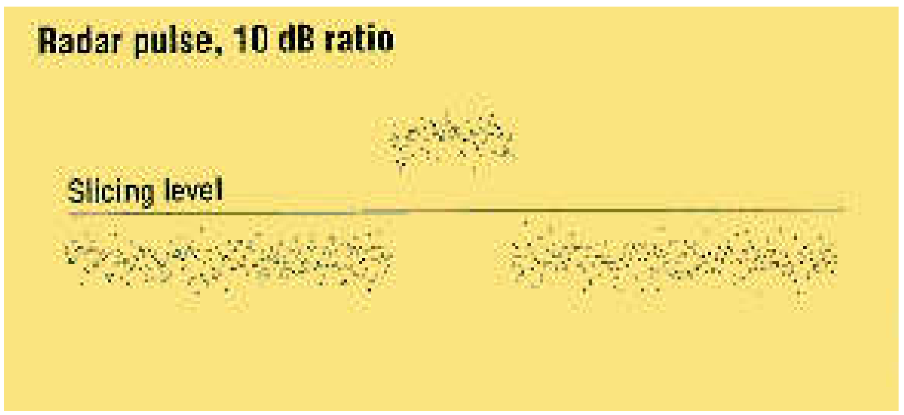
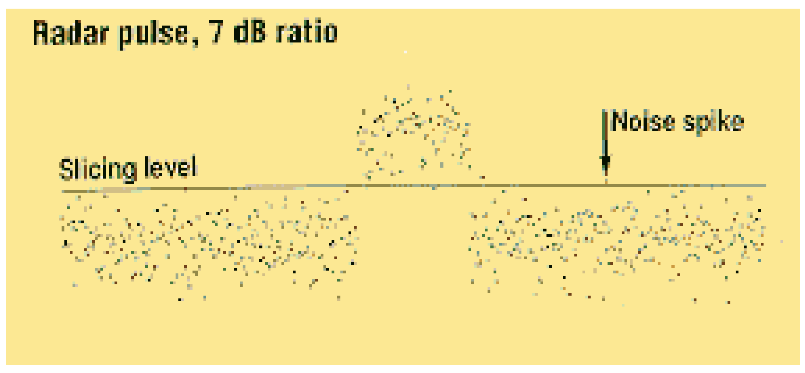
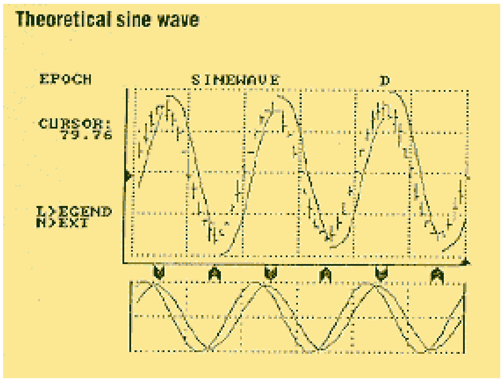
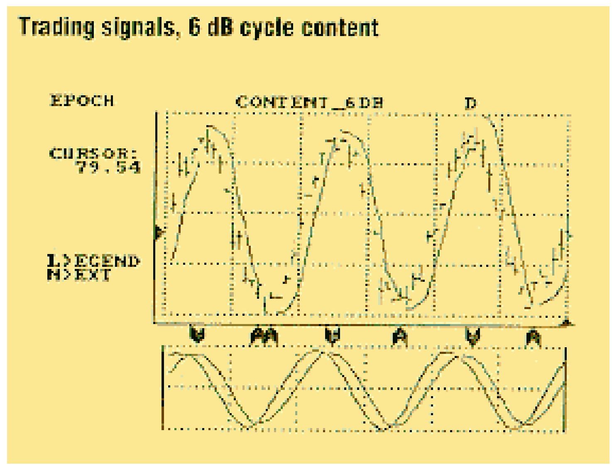
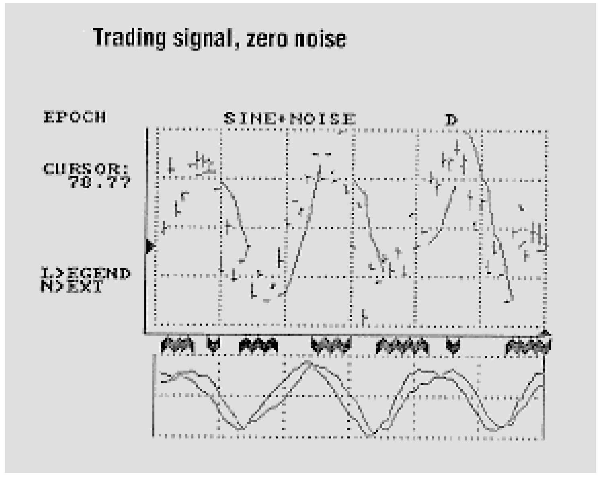
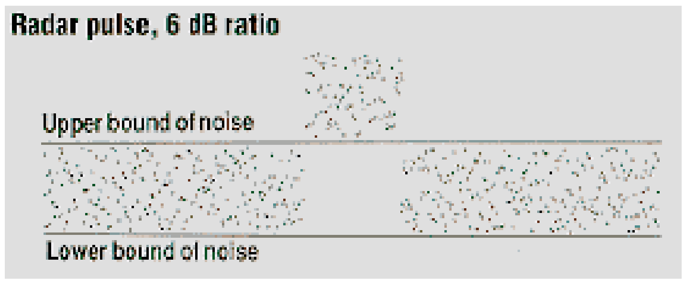
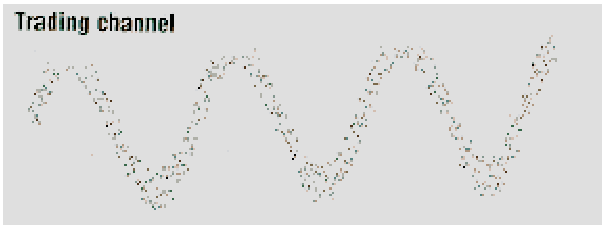
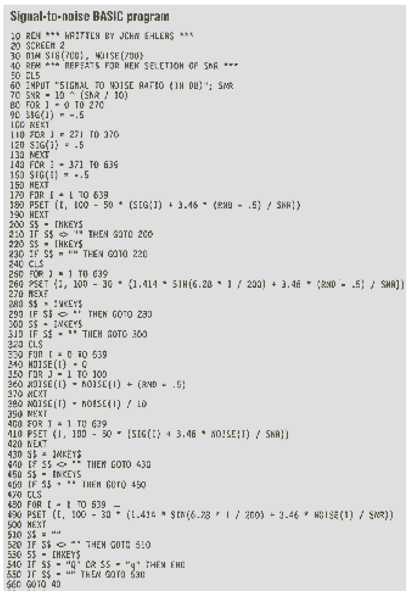
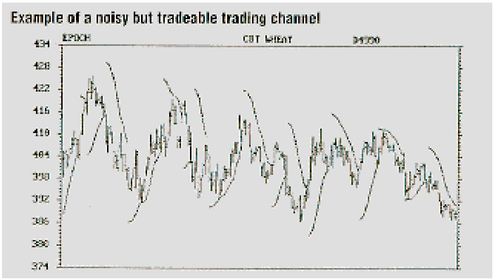

# Trading Threshold

**John Ehlers**

*Technical Analysis of Stocks & Commodities, Volume 8, Issue 5 (May 1990), pp. 174–177*

Article URL: https://technical.traders.com/archive/article.asp?file=\V08\C05\TRADTH.pdf

---

In radar, signal-to-noise ratio is used to measure the quality of target detection. In trading, this simple concept can be used to hit our profit targets better. We can improve our trading profitability if trading decisions are deferred until the signal-to-noise ratio is high. The charts can be viewed as noisy channels in which the daily range and very short-term day-to-day variations are the "noise." The longer-term variations mark the channel envelope.

The trader's profitability can be enhanced if he waits for conditions in which the peak-to-peak variation of the channel envelope exceeds four times the width of the "noise band." Noise as classically defined is energy (in our case, price activity) that carries no information. Complete randomness has no information and, therefore, random events are noisy. When noise is completely random, all frequencies are present. This is called "white noise" because the picture of the uniform frequency distribution resembles snow.

White noise has a Gaussian, or normal, amplitude probability distribution, which is the familiar bell-shaped curve that describes many statistical cases, such as a given population's IQ distribution. In the same way very few people have exceptionally high IQs, the amplitude of white noise can be very large but occur very seldom.

The power of signals and noise are most conveniently measured in decibels (dB). "Deci-" means one-tenth, while "bel" is a logarithm of the ratio of two power values. Since the logarithm of 2 is 0.3, each doubling of the power ratio results in a 3 dB increase (log₁₀2 = 0.3, so 10·log₁₀2 = 3). For example, 6 dB is the value of a power ratio of 4 (log₁₀4 = 0.6 or 10⁰·⁶ = 4). The logarithm of 10 is 1, so the power ratio of 10 is also expressed as 10 dB. Power ratios can be halved as well as doubled. For example, 7 dB is 3 dB less than a power ratio of 10, and thus, the 7 dB power ratio is half, or 5-to-1.

Note how radar signals are detected. Figure 1 shows a simulated radar pulse imbedded in white noise with a 10 dB signal-to-noise ratio. To detect this pulse, simply establish a "slicing level" so the signal plus noise is always above this level and noise alone is always below it.



**FIGURE 1:** A radar pulse with a 10 dB signal-to-noise ratio is easily detected by the sharp separation between noise and the pulse.

The problem becomes more severe when the signal-to-noise ratio is reduced to 7 dB, as shown in Figure 2. The 7 dB signal-to-noise case is commonly called the "tangential sensitivity" of the radar. When the slicing level is set, the presence of the pulse can be correctly identified most of the time. The most common errors are classifying a noise spike as a pulse or missing the pulse identification when the noise of the pulse falls below the given threshold. The ability to properly identify the pulse deteriorates rapidly as the signal-to-noise ratio falls below 7 dB.



**FIGURE 2:** A radar pulse with a 7 dB signal-to-noise ratio is not as sharply defined as a 10 dB pulse so the slicing level must be more carefully chosen.

The decision to trade is also influenced by the signal-to-noise ratio. In my cycle-based trading programs this ratio is referred to as "cycle content." A noise-free trading example using a theoretical sine wave is shown in Figure 3. The trade entry points are indicated at the bottom of the graph, and the stop is the smooth line discontinuous only with the trade reversal. The trade is not severely hampered when the cycle content is reduced to 6 dB, as shown in Figure 4. But when cycle content is zero (when noise power is equal to the cycle power), noise whipsaws the trades for losses as in Figure 5.



**FIGURE 3:** Trading signals for a theoretical sine wave with no noise are virtually perfect.



**FIGURE 4:** Trading signals with a 6 dB signal-to-noise ratio are still fairly good.



**FIGURE 5:** Trading signals without noise are confused and unprofitable.

> Why is a 6 dB cycle content useful in trading when a 7 dB signal-to-noise ratio is required for good radar pulse detection?

Why is a 6 dB cycle content useful in trading when a 7 dB signal-to-noise ratio is required for good radar pulse detection? Not all noise is white noise with a Gaussian distribution. Intraday and daily trading limits place restrictions on the peak excursions for noise spikes, which make the probability distributions more like a uniform probability between two bounds. When uniform probability noise is superimposed on a simulated radar pulse with a 6 dB signal-to-noise ratio, we have the result shown in Figure 6. Note the edges of the noise are less fuzzy, allowing tangential sensitivity to be about 1 dB lower than it would be with white noise.



**FIGURE 6:** A radar pulse with a 6 dB signal-to-noise ratio — a uniform, bounded probability of noise distribution — allows identification of a radar pulse.

A sine wave with uniform probability density noise superimposed at a 6 dB signal-to-noise ratio is shown in Figure 7. The sine wave can be viewed as a trading channel or cycle.



**FIGURE 7:** A 6 dB signal-to-noise trading channel is a bounded, uniform distribution.

The signal-to-noise ratios of real signals can be estimated using Figure 7 as a guide. We know the power ratio is 4-to-1 (log₁₀4 = 0.6) — that is, the signal strength is four times the strength of the noise. Take the noise strength as the width of the channel, preferably near a minimum or maximum signal, and that is the standard amplitude. Next, measure the signal plus noise amplitude from the approximate lowest low to the approximate highest high. The signal amplitude is this measurement, less the channel width, because we have half a channel width extra excursion at both the peak and the valley. Therefore, the ratio of the signal amplitude (peak-to-peak less channel width) divided by the channel width is our signal-to-noise ratio.

The trading rule is simple using the following threshold: **Don't trade when the signal-to-noise ratio is less than 6 dB (a 4-to-1 ratio).**

## Basic Programming

You can experiment with the impact of various signal-to-noise ratios using the BASIC computer program in Figure 8. The program is written in generic syntax but requires a CGA monitor to observe the graphic response.



**FIGURE 8:** You can experiment with the impact of various signal-to-noise ratios using the BASIC computer program.

Lines 80 to 190 calculate and display signal-plus-noise for a simulated radar pulse for uniform probability noise. The BASIC random number generator is the noise source. The generator outputs a random number between zero and 1. This random number is offset by -0.5 so the noise has a zero mean value. Lines 250 to 270 calculate and display the shape of a sine wave plus the uniform probability noise.

Invoked in lines 330 through 390 is the central limit theorem, which states that the (large) sum of random events will produce a Gaussian probability distribution of the resulting random function. The sum is normalized to a constant reference amplitude by the square root of the number of events summed in line 380.

The approximated white noise is added to a radar pulse in lines 400 to 420. White noise is also added to the sine wave and displayed in lines 480 to 500. The program will terminate if you press "Q" for quit after display of the fourth screen. Pressing any other key will take you back to the beginning of the program. Computing the Gaussian noise can take quite a while, particularly if you are using interpreted BASIC on an older personal computer. Patience!



**FIGURE 9:** These data contain a fair amount of noise but remain tradeable, nevertheless.

The "thresholding" logic for the detection of a radar pulse in the presence of noise generates a simple rule for knowing when to trade. The rule is to avoid trading when the signal-to-noise ratio is less than 6 dB. The 6 dB threshold is measured as the peak-to-peak variation less the noise channel width, divided by the noise channel width.

---

*John Ehlers, Box 1801, Goleta, CA 93116, (805) 969-6478, is an electrical engineer working in electronic research and development and has been a private trader for 10 years. He is a pioneer in introducing maximum entropy spectrum analysis to technical trading through his MESA computer program.*

## Reference

- Ehlers, John [1989]. "Cyclic personalities," *Technical Analysis of Stocks & Commodities*, Volume 7.

## BibTeX

```bibtex
@article{ehlers1990threshold,
  author    = {Ehlers, John F.},
  title     = {Trading Threshold},
  journal   = {Technical Analysis of Stocks \& Commodities},
  volume    = {8},
  number    = {5},
  pages     = {174--177},
  year      = {1990},
  month     = may,
  url       = {https://technical.traders.com/archive/article.asp?file=\V08\C05\TRADTH.pdf}
}
```
