# 1989 Cycles

**John F. Ehlers**

*Technical Analysis of Stocks & Commodities, Volume 8, Issue 6 (June 1990), pp. 212–215*

Article URL: https://technical.traders.com/archive/article.asp?file=\V08\C06\CYC89.pdf

---

Cyclic activity in 1989 was substantially higher than in 1988, and some role reversals in cycle personalities appear to have occurred relative to the previous year. To measure and examine 1989 cycle activity, I used 12 perpetual futures contracts as data for the cycle measurements. These 12 contracts were continuations of the same perpetual contracts used for comparisons to 1988 cycle performance. The short-term cycles were measured using the MESA computer program. Valid cycles are reported when the "cycle content" (signal-to-noise ratio) exceeds a 6 deciBel (dB) threshold. A deciBel is a logarithmic measure of power, where the ratio doubles for each 3 dB increase. Thus, the 6 dB threshold is placed where the measured cycle power is four times the power of the noise in the data. Research and experience have shown that cycle strengths of this magnitude and stronger are suitable for trading.

The data measured over the year are shown in histograms for each of the 12 contracts. Each histogram displays how many times a 12-day cycle occurred over the year, how many times a 13-day cycle appeared, and so on. The cycle personality revealed by such a display should have an envelope shaped like the conventional Gaussian (bell-shaped) distribution curve, which would therefore have its peak at the predominant cycle personality. This is the statistical mean. The width of the bell would be a measure of the departure from the dominant cycle personality. Statisticians call the half-width (one side of the distribution) of the bell curve the variance.

There was hardly enough output data to get a valid statistical mean and variance. The total number of useful cycles was inadequate to obtain statistically valid mean and variance of the cycle-length measurements (nominally useful cycles appear about one-third of the 260 trading days, or 86 times). Therefore, the peak of the data is a subjective judgment and a measure of departure from the peak is the weighted average of all occurrences of the short-term cycles. The weighted average can be viewed as a center of gravity (CG), similar to the center of gravity of physical structures.

## Cyclic Surprises

The 1989 cycle measurements had several surprises. First, cyclic activity was substantially higher than in 1988. Second, contracts that were the most cyclic in 1988 were among the least cyclic in 1989, not because they became less cyclic but because all other contracts became more cyclic. The most notable change came from the sugar contracts. In 1988 sugar trailed the field, having cycles exceeding the threshold only 13% of the time. Yet sugar was the most cyclic contract in 1989, having useful cycles 45% of the time. The overall average percentage of time having cycles above threshold increased from 22.7% in 1988 to 32.5% in 1989.

Figure 1 lists the measured results for the 12 contracts for both 1988 and 1989. The contracts are ordered by their percentage of cycle activity during 1989. There are certain general similarities between the two years. In 1989 there were four contracts clustered near 40%, while in 1988 there were also four clustered leading percentages, but clustered near 30%. However, only Comex gold was common to both leading clusters. The remaining three contracts among the 1988 leaders held their percentage of cycle activity but dropped in the ranking because the other contracts became more cyclic. Most contracts were clustered near the 20% cycle activity level in 1988 and near the 30% level in 1989.

Note the 1988 average CG was 127% of the average peak, while the relationship was at 126% in 1989 — virtually constant. Measured histograms for 1989 are shown in Figures 2 through 13. The cycle personalities speak for themselves, varying from a well-behaved statistical pattern such as gold to pork bellies, which had no discernible cycle personality at all. In reviewing the data, it appears there was less tendency to have harmonic relationships in the cycle personalities. That is, there was less of a tendency to have a dual peak (at 12 days and 24 days, for example) than there had been in previous years.

The 1989 cycle measurements indicate that cycle activity increased over 1988, primarily because the less cyclically active contracts in 1988 became more active. The most cyclically active contracts in 1988 retained their activity level in 1989. In all, the changes of activity point out that traders must continuously adapt to the market.

---

### Figure 1: 1988 and 1989 Results for 12 Contracts

| Contract | 1989 Cycle Activity | 1989 Peak Cycle | 1989 CG | 1988 Cycle Activity | 1988 Peak Cycle | 1988 CG |
|---|---|---|---|---|---|---|
| Sugar | 45% | 13 | 20 | 13% | 15 | 17 |
| Copper | 41 | 9 | 18 | 18 | 19 | 20 |
| Gold | 40 | 10 | 12 | 31 | 12 | 16 |
| Cocoa | 40 | 10 | 16 | 15 | 12 | 14 |
| Deutschemark | 33 | 15 | 18 | 18 | 11 | 11 |
| Wheat | 30 | 11 | 16 | 30 | 13 | 15 |
| Cattle | 30 | 15 | 18 | 21 | 11 | 13 |
| Hogs | 30 | 24 | 21 | 22 | - | 21 |
| Yen | 24 | 15 | 17 | 14 | 10 | 15 |
| S&P 500 | 20 | 15 | 14 | 24 | 15 | 16 |
| T-bonds | 20 | 17 | 15 | 33 | 12 | 17 |
| Pork bellies | 20 | - | 16 | 20 | 7 | 16 |

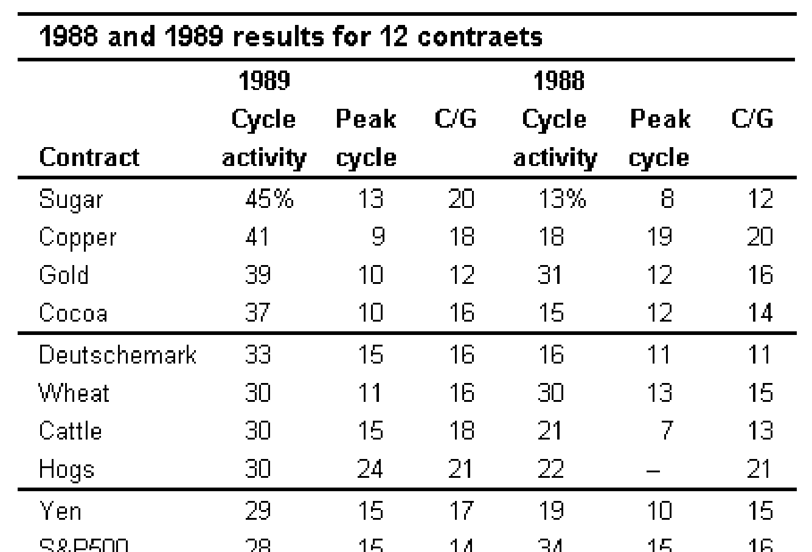

---

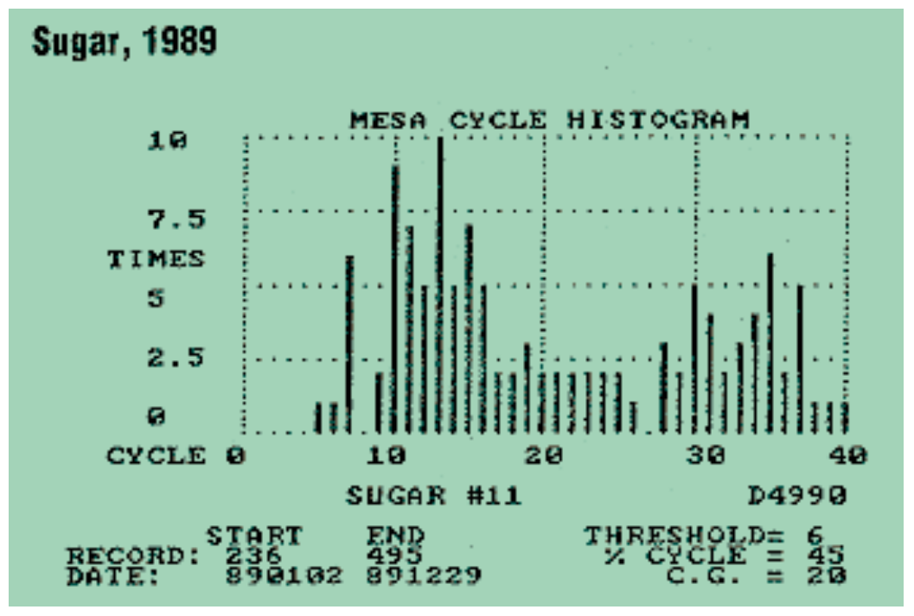

**FIGURE 2:** Sugar was the most cyclic contract in 1989 in contrast to its 1988 performance, when it was the least.

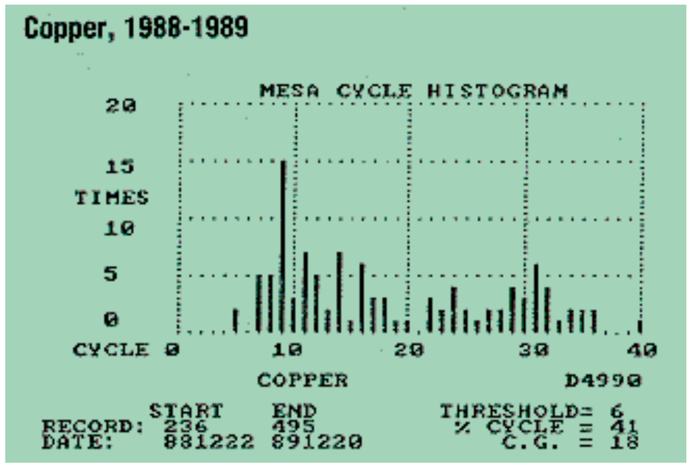

**FIGURE 3:** Copper was the second-most cyclic in 1989 as opposed to 1988, when it displayed far less cyclic activity.

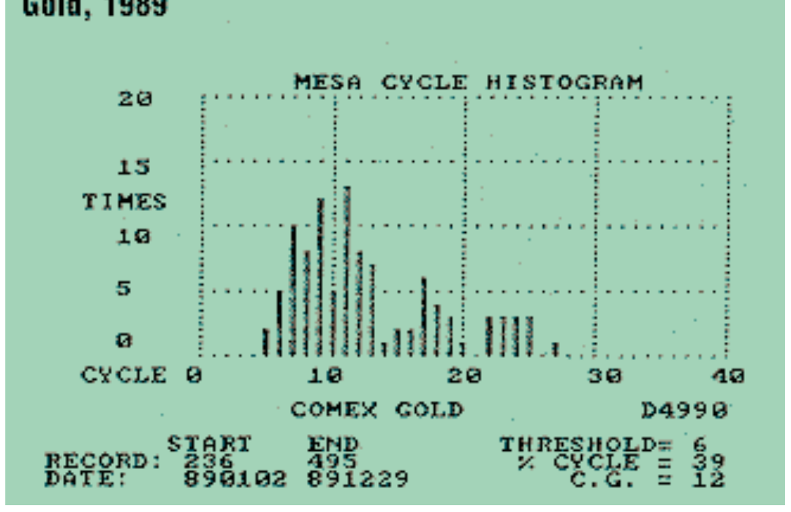

**FIGURE 4:** Comex gold displayed relatively consistent cycle activity from 1988 to 1989.

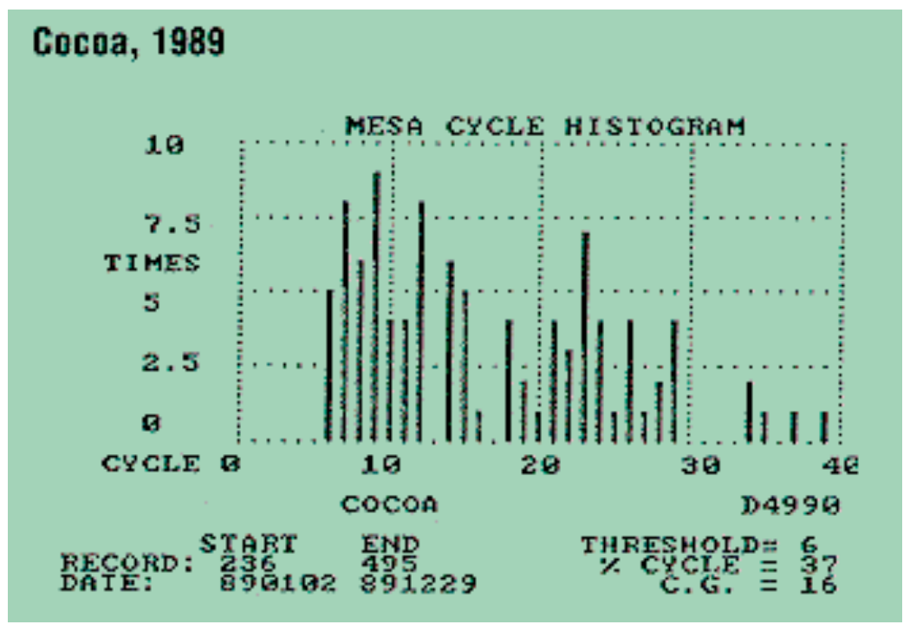

**FIGURE 5:** Cocoa displayed extremes in cyclic activity in 1988 and 1989, although the peak cycles did not vary substantially.

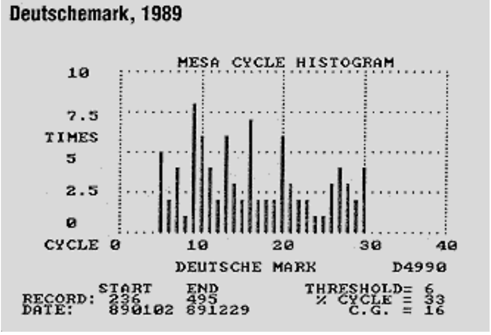

**FIGURE 6:** The Deutschemark contracts also showed some extreme variation in cyclic activity from 1988 to 1989.

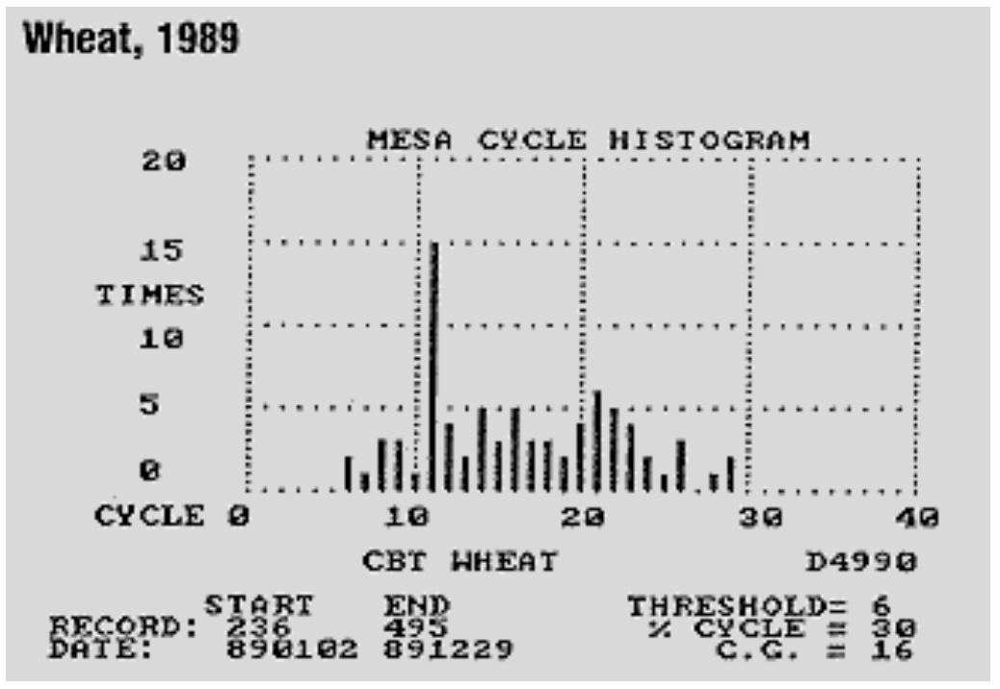

**FIGURE 7:** CBT wheat, however, showed the same percentage of cyclic activity for the two years.

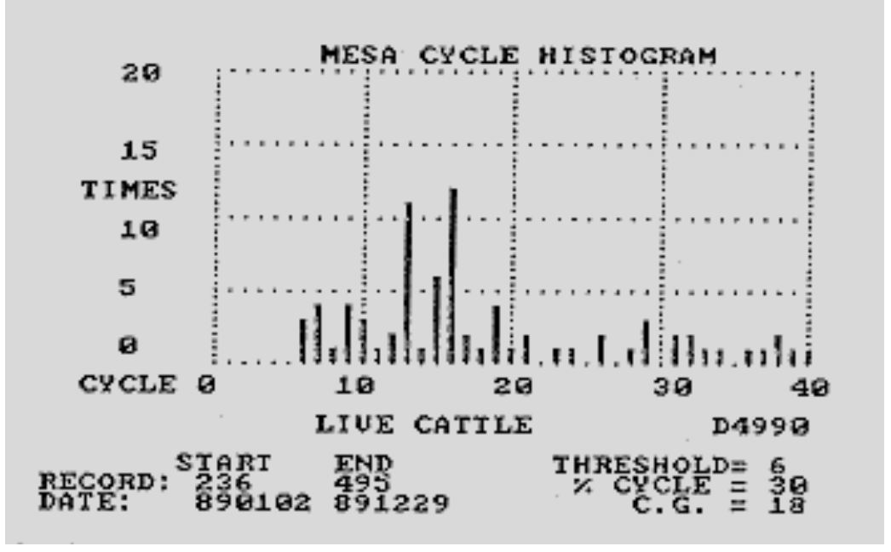

**FIGURE 8:** Cattle contracts varied some, but not to the extremes that other contracts did.

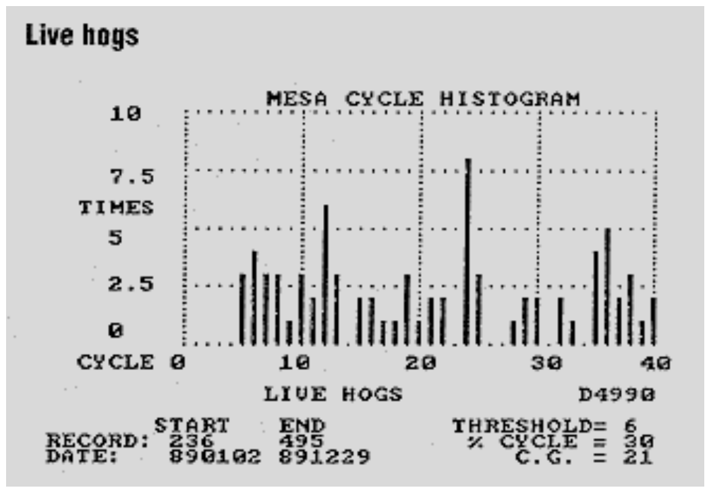

**FIGURE 9:** Hog contracts varied as much — that is, not at extremes — as cattle contracts.

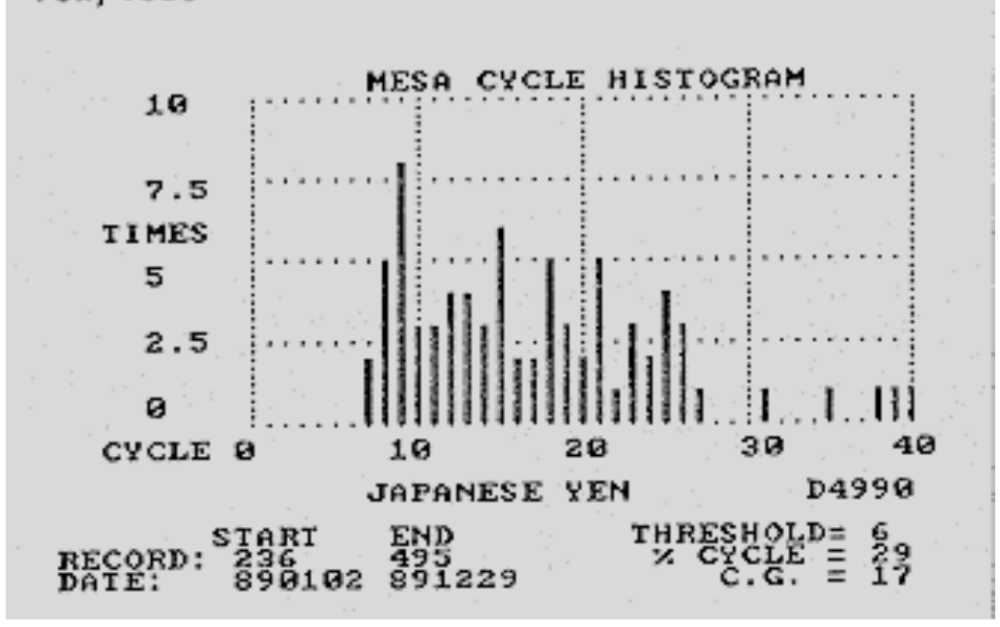

**FIGURE 10:** The yen contracts were also in the median range of cyclic activity changes.

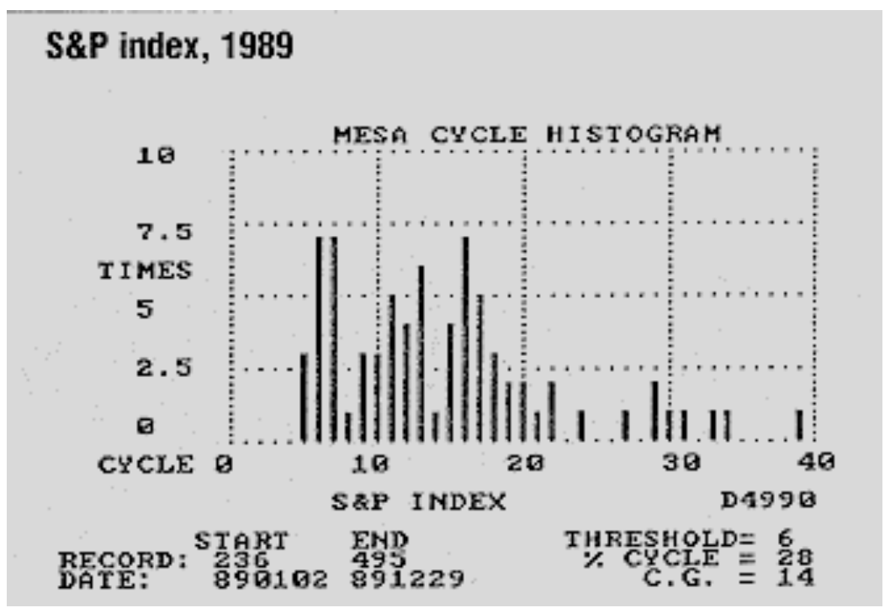

**FIGURE 11:** The S&P index remained relatively stable from 1988 to 1989.

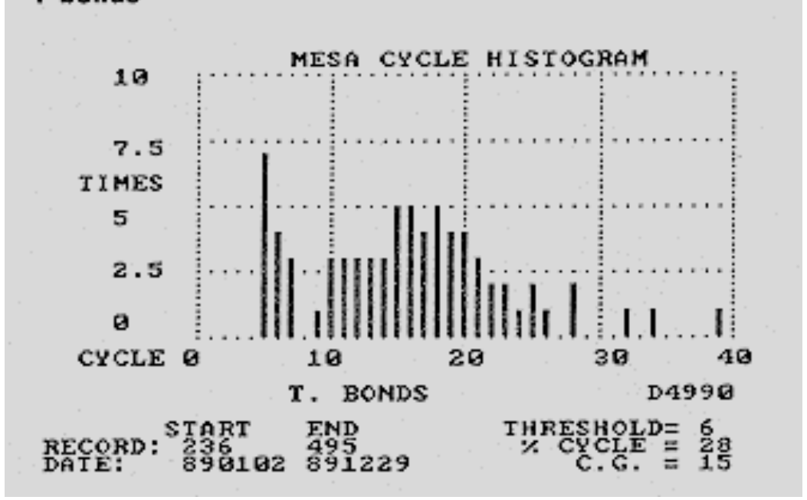

**FIGURE 12:** Treasury bond contracts also remained relatively stable.

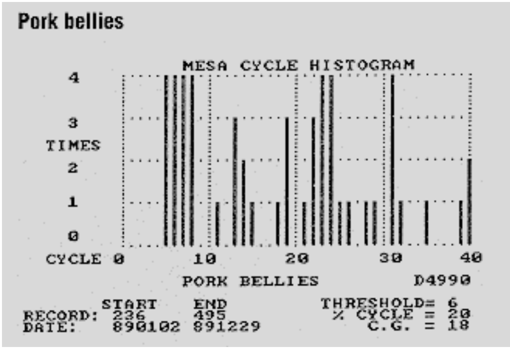

**FIGURE 13:** Pork bellies showed no discernible cycle personality at all.

---

*John Ehlers, Box 1801, Goleta, CA 93116, (805) 969-6478, is an electrical engineer working in electronic research and development and has been a private trader since 1978. He is a pioneer in introducing maximum entropy spectrum analysis to technical trading through his MESA computer program.*

## BibTeX

```bibtex
@article{ehlers19901989cycles,
  author    = {Ehlers, John F.},
  title     = {1989 Cycles},
  journal   = {Technical Analysis of Stocks \& Commodities},
  volume    = {8},
  number    = {6},
  pages     = {212--215},
  year      = {1990},
  month     = jun,
  url       = {https://technical.traders.com/archive/article.asp?file=\V08\C06\CYC89.pdf}
}
```
