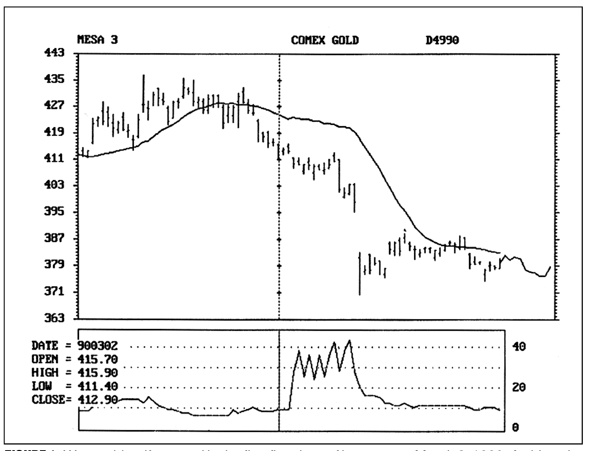
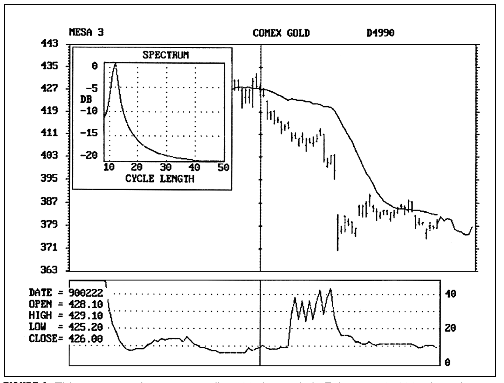
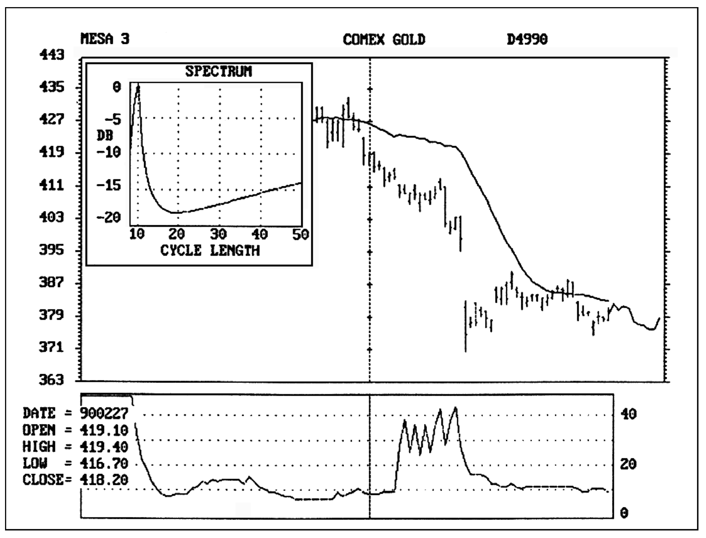
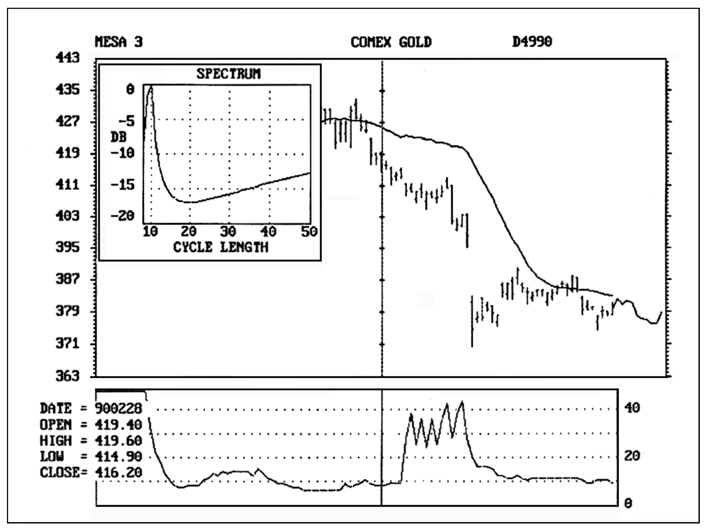
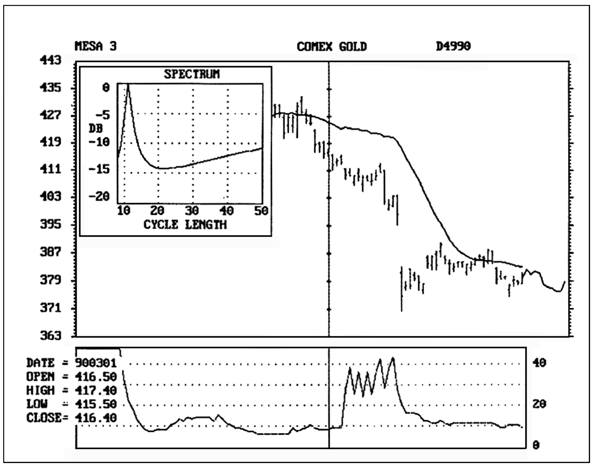
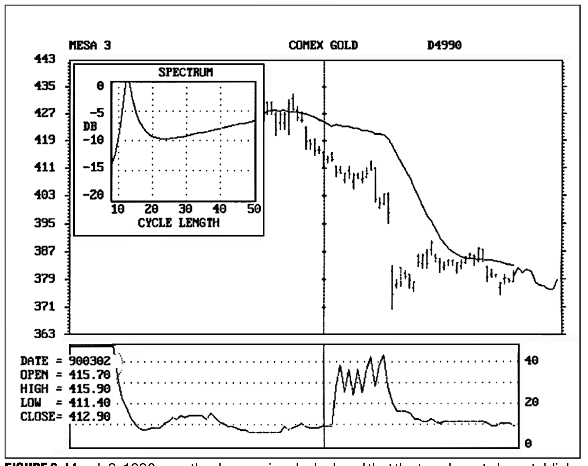
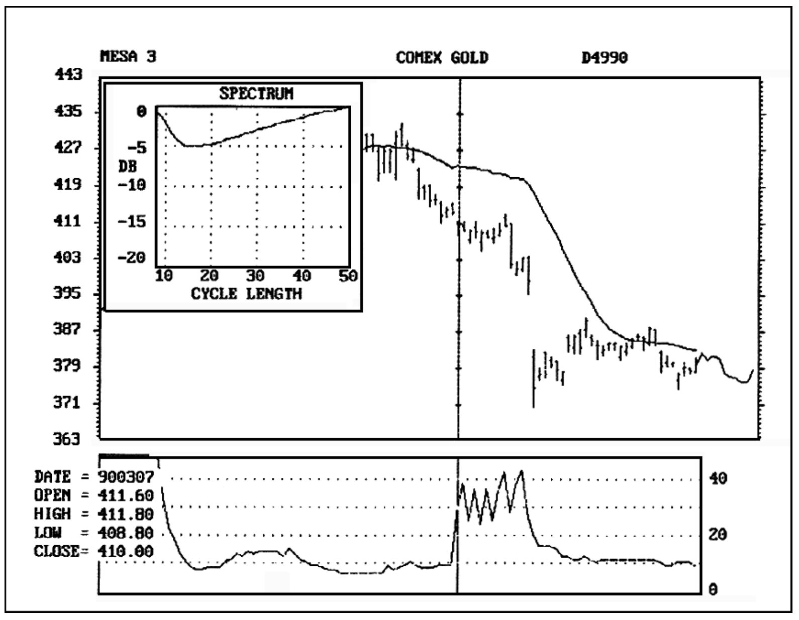
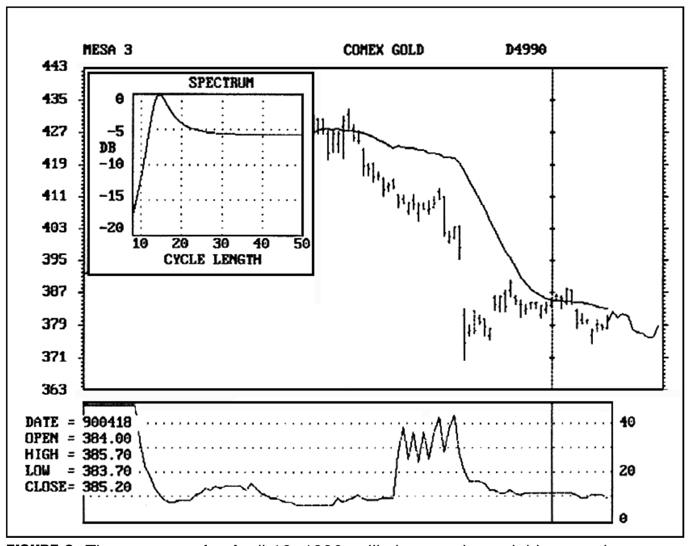

# Early Trend Identification

**John F. Ehlers**

*Technical Analysis of Stocks & Commodities, Volume 8, Issue 10 (October 1990), pp. 377–381*

Article URL: https://technical.traders.com/archive/article.asp?file=\V08\C10\EARLY.pdf

---

Impressive profits can be accumulated just by staying with a position during a trend. We would all be millionaires if only we could identify the trend early in its onset. While the trends are obvious in retrospect, it's another matter altogether to identify the trend in the heat of battle. Not only that, there may not be a trend at all at the time we expect one.

If we make a reasonable mathematical model of the market we can examine it parametrically. The conclusions we draw from this model can help us establish our entry points and strategies for trading the trends. We will view the market as a random walk problem to create our model.

## Random Walk for the Market

In the same way that water can only flow downstream, time cannot be reversed in trading. In addition, prices can only be higher or lower in the same way that the river can only bend to the right or left. These elements constrain the random walk problem to a special form that mathematicians call "drunkard's walk." In the simplest form of this walk, the "drunk" steps only into a square diagonally to the right or into a square diagonally to the left as he steps forward. He must make a new decision with each step. To make the decision random, he flips a coin to determine the direction he will take. Repeated many times, the overlay of paths that he follows will look like a smoke plume. The question of the drunkard's destination can be answered through a well-known partial differential equation called the Diffusion Equation. The density of the smoke particles in the plume is analogous to the probability of the drunkard's location. A multiple-exposure photograph of the drunkard's walk repeated over and over would show its randomness. This photograph would show the composite paths to have a uniform density, widening from the initial position. The uniform density would make the sum of the paths look like a smoke plume.

Further, random walk does not necessarily mean chaos. A minor variation of the drunkard's walk problem is to allow the random coin-flip decision to control the change of direction rather than the direction itself — that is, the random variable becomes momentum instead of direction. The partial differential equation describing this condition is known as the Telegrapher's Equation. The equation describes electric waves along telegraph wires, among other subjects. You can picture the result as the drunk reeling back and forth. He overcorrects around a general direction trying to reach an objective. This formulation of the problem, expressed in terms of physics, accurately portrays the river and explains why the river meanders. In a multiple-exposure photograph the paths are still randomly distributed. Nevertheless, the cycles are apparent in the shorter case of a single path. By analogy, the market has short-term cycles when the appropriate conditions prevail.

If enough traders ask themselves whether the market will go up today, the random variable is direction. Thus, conditions are established for the solution of the Diffusion Equation. On the other hand, if enough traders ask themselves whether the trend will continue, the random variable now becomes momentum. You could then expect the conditions to be established for the solution of the Telegrapher's Equation. The market is ripe for short-term cycle activity.

## Identifying Trends with Reverse Logic

As formed by the random walk, our market model is either cyclic or trending. A moving average is about the only means we have to measure the trend directly. Moving averages are not very helpful because they are always lagging functions. However, we can measure the cycles and know when the market is cyclic. By reverse logic, if the market is not short-term cyclic, it must be trending. We can identify whether the market is cyclic in a period as short as a half cycle. Cycle analysis, therefore, can be used to spot a trend early in its formulation.

The early identification of a trend then depends on a valid measurement of short-term cyclic activity. There are two ways to do so, either by cycle elimination or by spectrum analysis. Of the two, cycle elimination is by far the easier.

Let's approach the question of cycle elimination using synthesis and then reverse the procedure to establish what we must do to perform the analysis. We can synthesize a theoretical price curve by adding a pure sinewave to a straight trendline. We then examine these two components independently. The average over the period of a theoretical sinewave is always zero, regardless of where we started the average. If we used a moving average with a length the period of the sinewave, then the sinewave is completely removed and we are left with only the straight line trend.

The identification of the trend is that easy. We eliminate the cyclic component when we use the average over the cycle length. We could adjust the average as the cycle length varies and plot the results day-by-day. I call the result an "instantaneous trendline." A fixed-length moving average can suffice during periods when the cycle length is not changing. We expect the price to alternate across our instantaneous trendline because the price has the cyclic component. We expect to see the crossing occur approximately every half cycle. If the price fails to cross the instantaneous trendline, we get a clear signal that the price has moved into a trend mode — that is, the movement in the direction of the trend swamps the cyclic movement so the expected crossing does not occur. When this happens, the price parallels our instantaneous trendline without crossing it. The instantaneous trendline is a lagging function like a normal moving average. Using the instantaneous trendline method, a trend is identified when the price does not cross or even appear likely to cross the trendline within a half cycle.



**FIGURE 1:** We can identify a trend in the first five days of its move on March 2, 1990. At this point we have a 10-day cycle, and the price has not crossed the instantaneous trendline within the last five days.

Figure 1 is an example of where we identify a trend in the first five days of its move on March 2, 1990 (900302, the cursor location). At this point we have a 10-day cycle, and the price has not crossed the instantaneous trendline within the last five days. The price shows no tendency of trying to cross the instantaneous trendline. Early identification allows us to capture about a 30-point profit, the majority of the move.

We can use this technique to simply trade the trends. However, the profits are even better if we use the trend identification to shift from a cyclic trading strategy to a trend trading strategy. Suppose in our example we had been trading on the basis of cycles. Trading every five days (each half cycle), we would have gone long on 900131, a short-term low. From there we would go short on 900207 (short-term high), long on 900214 (a little early for a short-term low), and short on 900221. Our last short entry would be at about 431, substantially above the 415 price where we first identified the downtrend. We would already have been in a short position on the basis of cycle trading and therefore would exploit the full extent of the trend movement. Shifting between cycle trading strategy and trend trading strategy therefore enhances overall profitability.

## Verifying Trend Identification

A spectrum display shows amplitude on the Y axis vs. cycle length on the X axis. This display allows you to see the relative strength of several cycles, a benefit beyond merely picking out the dominant cycle. The spectrum display also allows you to identify the quality, or resolution of the cycle measurement. Ideally, a cycle measurement is a single spike on the display. This ideal picture tells you that there is only one well-defined spectrum component — the dominant cycle. But what if the spectrum display is a broad bell-shaped curve? In this case, the energy is spread over a range of possible dominant cycles, with no cycle length being clearly dominant. The spectrum display indicates that the lack of resolution is reason enough not to trade the market on the basis of cycles. For trend identification we are most interested in the capability of the spectrum display to show the formation of two or more cycles.

J.M. Hurst, in *The Profit Magic of Stock Transaction Timing*, advances the principle of proportionality. Simplified, the principle states that longer cycles have larger amplitudes. This principle is obvious to the most casual chart reader.

We can use this principle to identify trends with the spectrum display of short-term cycles. From our example for gold, Figure 2 shows an excellent 12-day cycle on 900222, just after we entered our short position. Figure 3 shows the spectrum taken on 900227. The very long cycle, longer than 50 days, is starting to appear. Figures 4, 5 and 6 show the progression of the spectrum for the next three trading days. Figure 6 is the spectrum for 900302, the day we previously declared the trend to be established. Figure 7 shows the spectrum three trading days later on 900307. Figure 7 shows that the short-term cycle has been swamped by the trend, which is interpreted as a long cycle outside the calculation range. Used this way, the spectrum confirms that the trend has been established.



**FIGURE 2:** This spectrum shows an excellent 12-day cycle on February 22, 1990, just after we entered our short position.



**FIGURE 3:** Here, the spectrum is taken on February 27, 1990. Note the subtle change. The very long cycle is starting to appear.



**FIGURE 4:** Figures 4, 5 and 6 show the progression of the spectrum for the next three trading days.



**FIGURE 5:** The progression of the spectrum continues.



**FIGURE 6:** March 2, 1990, was the day previously declared that the trend was to be established.

> Figures 4, 5 and 6 show the progression of the spectrum for the next three trading days. Figure 6 is the spectrum for 900302, the day we previously declared the trend to be established.



**FIGURE 7:** Three trading days later on March 7, 1990, the spectrum shows the short-term cycle to be swamped by the trend, interpreted as a long cycle outside the calculation range.

The spectrum can also confirm that the trend movement has ended. The price first crosses the instantaneous trendline from the bottom on 900418. (We could have exited then at about 385 for a total profit of $4,600 on a single contract.) Figure 8 is the spectrum for 900418, and shows long cycle energy. Figure 9 is the spectrum for 900425, five trading days later. Absence of long cycle energy confirms the trend has ended.



**FIGURE 8:** The spectrum for April 18, 1990, still shows substantial long cycle energy.


**FIGURE 9:** The absence of long cycle energy for April 25, 1990, confirms the trend has ended.

## Helpful Cycles and Trading Strategy

Our example is not an uncommon event. This approach can be used to repeatedly alter your trading strategy as the market shifts from the cycle mode to the trend mode. All you need to do is estimate or measure the current short-term cycle and then take a simple average over the period of the cycle length and plot it as a point on your bar chart. Repeat this daily. Connecting the averages with a line creates your "instantaneous trendline." Then watch the price action relative to this trendline to identify the onset of the trend when the price has not crossed within the last half cycle.

> I'm trying to automate the entire trading strategy. One of the early dreams for computers, you may recall, was to create robots to serve mankind.

I'm trying to automate the entire trading strategy. One of the early dreams for computers, you may recall, was to create robots to serve mankind. By recognizing when we are in a trend mode (Diffusion Equation) or cycle mode (Telegrapher's Equation), our computers should know when to apply the proper trading strategy. I guess that would make our computer a "know-bot"!

---

*John Ehlers, Box 1801, Goleta, CA 93116, (805) 969-6478, is an electrical engineer working in electronic research and development and has been a private trader since 1978. He is a pioneer in introducing maximum entropy spectrum analysis to technical trading through his MESA computer program.*

## References

- Hurst, J.M. [1970]. *The Profit Magic of Stock Transaction Timing*, Prentice-Hall.
- Ehlers, John [1990]. "1989 cycles," *Technical Analysis of Stocks & Commodities*, June.

## BibTeX

```bibtex
@article{ehlers1990early,
  author    = {Ehlers, John F.},
  title     = {Early Trend Identification},
  journal   = {Technical Analysis of Stocks \& Commodities},
  volume    = {8},
  number    = {10},
  pages     = {377--381},
  year      = {1990},
  month     = oct,
  url       = {https://technical.traders.com/archive/article.asp?file=\V08\C10\EARLY.pdf}
}
```
