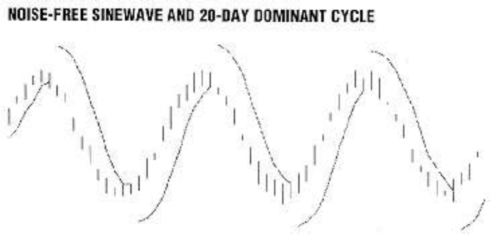
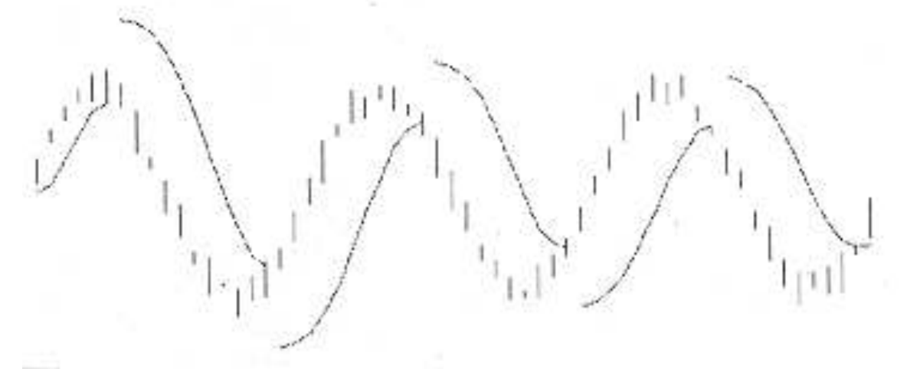
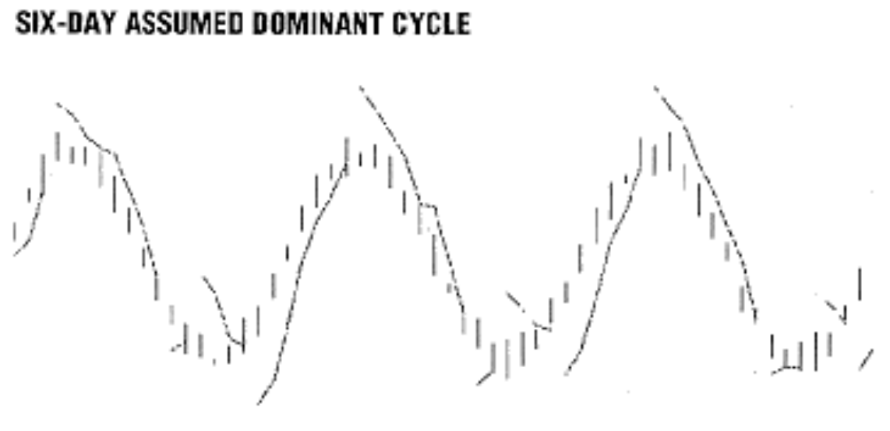
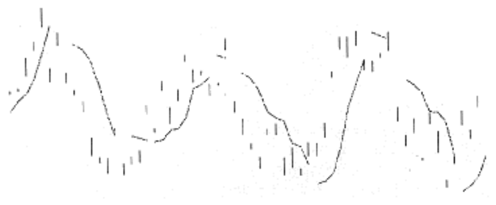
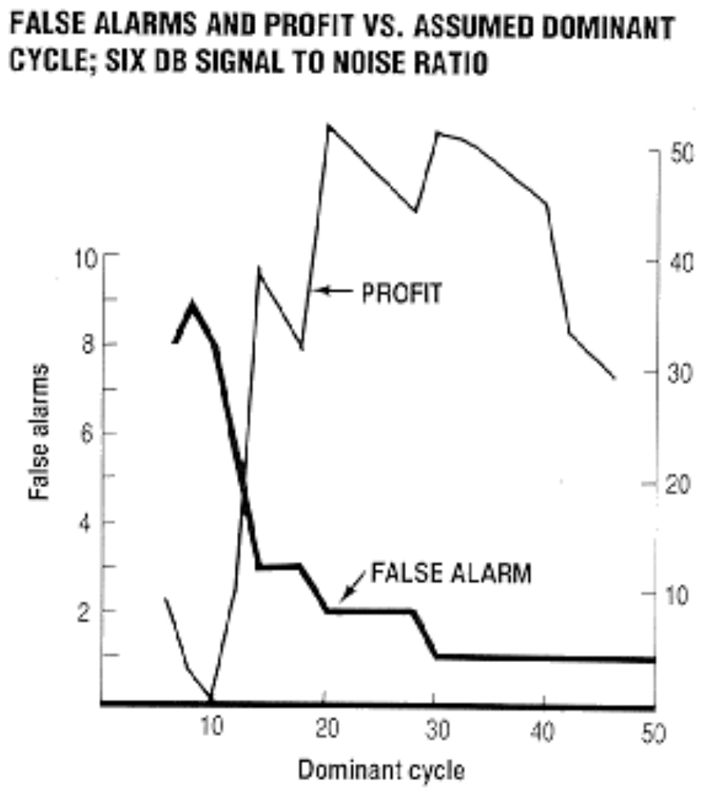

# Using A Constant False Alarm Rate In Trading

**John Ehlers**

*Technical Analysis of Stocks & Commodities, Volume 9, Issue 4 (April 1991), pp. 152–155*

Article URL: https://technical.traders.com/archive/article.asp?file=\V09\C04\CONSTAN.pdf

---

Modern information theory has existed for the last half century or so. This theory has been responsible for many significant scientific advances, including recovery of photographs taken in deep space, pinpoint accuracy of missile guidance and speech synthesis. With such a track record, why couldn't technical traders apply some principles of information theory to trading methodology? Let's examine a trading decision method using some of information theory's fundamental concepts.

First of all, trading involves value judgments. One example of value judgment involves a quarter lying in the street. If you were penniless, you would promptly scoop up that quarter. On the other hand, if you had just made a killing on 25 contracts of the Standard & Poor's, you would probably just step over the quarter and go on your way. That quarter would have little value to you. To describe the value function in a more continuous form, imagine the value of William Tell's arrow as a function of elevation in the mythical incident in which he had to shoot an arrow through an apple on his son's head. There is a negative value if the arrow flies too high; there is a large positive value if it flies a few inches above his son's head into the apple; and there is a large negative value if the arrow flies too low. There is no doubt the value function will influence decisions. You can bet Tell's aim was biased upward. It is difficult to separate the value function and pure information theory, but let's try.

## Decision Probabilities

Assume there is a signal containing information, say a radar echo pulse, that is present some of the time. The radar also receives noise that contains no information. The problem is to make a decision at each increment of range whether or not the echo pulse is present, and we can vote yes or no at each increment. Four outcomes are possible:

1. Vote yes correctly — **success**
2. Vote no correctly — **success**
3. Vote yes incorrectly — **false alarm**
4. Vote no incorrectly — **missed detection**

If you don't think that a false alarm is possible, try the following experiment. Turn your TV to an unused channel. The picture on the screen will be pure static noise because no information is present. Now stare at the screen for several minutes. You will start to see dots floating across the screen — patterns where there is none. Using this example, it is easy to see why some trading decisions are made on the basis of false alarms.

The objective of information theory is to minimize the false alarms and missed detections, which can be done several ways, using different kinds of "observers," using radar terminology. (The "observer" is a concept used in radar research in how often and in what manner detection or radar contact is achieved.) The Neyman-Pearson Observer, for example, maximizes the probability of detection by using a fixed probability of false alarm. In simple radar systems, the fixed probability of false alarm is established by setting a fixed-detection threshold. The threshold is lowered, sometimes experimentally, until an acceptable probability of false alarm is achieved. In radar there is a high negative value for missed detection. (History buffs may recall that radar contact with the Japanese forces was ignored just before Pearl Harbor was attacked.) On the other hand, the negative value for a false alarm is small — the only costs are fuel and using interceptors. The result? Simple radars have detection thresholds set at a fixed level that provide for a moderate number of false alarms.

> Figure 1 shows the relationship between the price and the stop, where no noise is present in the price and the dominant cycle is correctly assumed.

When it comes to trading, however, a missed detection is only a missed opportunity. The negative value is almost vanishingly small; but there is a high negative value for a false alarm in trading. With any luck you could enter a trade on a false alarm and still make a profit, but the odds are such a trade will go against you. If a Neyman-Pearson Observer is used for trading decisions the threshold will be set so high that useful trades will be made only rarely.

The "ideal observer," however, simultaneously minimizes the probability of false alarm while maximizing the probability of detection. Because this observer requires prior knowledge of the probability of noise and the probability of signal plus noise, and these probabilities are difficult to assess, we can dismiss its use for trading.

The "sequential observer" provides an adjustable threshold based on experience, resulting in the adjustment of the decision threshold to provide a constant false alarm rate (CFAR). Since the value on false alarms are highly negative and risk aversion is the goal, CFAR seems to be well suited to be the basis for an adaptive trading strategy.

## For Instance

Our trading example uses theoretical waveforms so we can control the conditions to illustrate our points. The price is a perfect 20-day sinewave. The mathematical expression is:

$$\text{Price} = \sin(2\pi \cdot D / \text{Period})$$

where D is the daily incrementing variable. Any of a number of trading systems could be used here, but let's use a stop-and-reverse (SAR) procedure for entry and exit of trades. The SAR has a fixed initial stop and accelerates — that is, narrows the gap — in proportion to the age of the trade relative to the half-cycle length of an assumed dominant cycle. The equation for the stop can be written as:

$$\text{NextStop} = \text{OldStop} + (2 \times \text{Age} / \text{DominantCycle}) \times \text{PreviousGap}$$



**FIGURE 1:** The solid line represents the order price to reverse the trade. The initial placement of the order to reverse is fixed and then accelerates in proportion to the age of the trade. The acceleration rate is proportional to the assumed dominant cycle.

Figure 1 shows the relationship between the price and the stop, where no noise is present in the price and the dominant cycle is correctly assumed. The problem with this perfect system?

We don't have prior knowledge of the dominant cycle period. If we overestimate the cycle period, we give up some profits because the trading picture looks like Figure 2. Even worse, if we underestimate the cycle period, the trading system produces whipsaws as depicted in Figure 3.



**FIGURE 2:** If the assumed cycle is too long, then the lag reduces the profits.



**FIGURE 3:** When the cycle period is underestimated, the price of the order to reverse accelerates too quickly and produces whipsaws.

The action of the trading system is relatively clear when no noise is present. However, when we approximate the real world by adding noise to the price, the proper trades are not so clear. We don't want to add so much noise that the signal is completely swamped, because our trading system would then be similar to watching the noise on the empty TV channel. Figure 4 shows the price when the signal is twice the amplitude of the noise (a six-decibel signal-to-noise ratio). The SAR trading system still has respectable performance when the estimate of the cycle length is correct.



**FIGURE 4:** To approximate the real world, noise is added.

## Getting FAR-Sighted

To get CFAR, the next step is to assume various cycle lengths for the SAR system and count both the losing and winning trades. Assume every winning trade was made by correctly identifying the signal and every losing trade was made by incorrectly identifying noise as signal. When we plot the number of false alarms and the total profits (Figure 5), we note that the profits are maximized when the false alarms are maintained at a low, but finite, level. The results will change somewhat from run to run because of the randomness of the noise. The way to use this trading system with no knowledge of the cycle period is to scan the stop-acceleration parameter (the assumed cycle length) over a range of values and use the value that produces an acceptable false alarm rate.



**FIGURE 5:** Profits are maximized when the false alarms are maintained at a low, but finite level.

> You can use the CFAR principle to adapt your own system to current market conditions.

Test the results for yourself using the QuickBASIC listing in Figure 6. Change the Signal to Noise Ratio (SNR) in line 1. A large number approximates the noise-free case. You can see a plot of the response on a VGA screen if you remove the remarks leading lines 4 through 8 and insert remarks ahead of lines 3, 9 and 10. Also, alter the assumed dominant cycle for the graphic display in line 2.

## Adapt Your Own System

You can use the CFAR principle to adapt your own system to current market conditions. All you have to do is describe the technique in question parametrically, vary that parameter over a range of values and measure the false alarms over a recent span of time. For example, you can vary the number of periods in the stochastic, select the best value of the parameter using the CFAR principle and use that parameter for your current trading. Since the market is always changing, you should periodically rerun the CFAR test and update the parameter value as required. A message comes up if there is no clear CFAR value; the message will be either that the market is too noisy for the technique to be useful or the technique itself is not a good one for that market at that time. This message is a good one to be aware of when you want to avoid risk, because you can avoid the loss by refusing to make an indicated trade. In the world of trading, after all, it's far better to miss an opportunity than it is to trade a false alarm and lose money.

---

*John Ehlers is an electrical engineer working in electronic research and development and has been a private trader since 1978.*

---

## QuickBASIC Source Code

```basic
DIM F(64), HI(64), LO(64), Trade(64), StopLoss(64)
RANDOMIZE TIMER
CLS
CycleLength = 20
1 SNR = 2

FOR D = 1 TO 64
  F(D) = 14.14 * SIN(6.28 * D / CycleLength) + 34.6 * (RND - .5) / SNR
  HI(D) = F(D) + 3 * RND
  LO(D) = F(D) - 3 * RND
NEXT D

2 DominantCycle = 20
3 FOR DominantCycle = 6 TO 50 STEP 2

Trade(1) = 1
StopLoss(1) = 0
Age = DominantCycle / 4
Entry = 0
Profit = 0
Winners = 0
Losers = 0

'4 SCREEN 12

FOR D = 1 TO 63
  IF Trade(D) = -1 THEN GOSUB ShortTrade
  IF Trade(D) = 1 THEN GOSUB LongTrade
  '5 LINE ((10 * D), 240 - 5 * HI(D))-(10 * D, 240 - 5 * LO(D)), 15
  '6 IF Trade(D) <> Trade(D - 1) THEN GOTO SkipStopPlot
  '7 LINE (10 * (D - 1), 240 - 5 * StopLoss(D - 1))-(10 * D, 240 - 5 * StopLoss(D)), 12
  '8 SkipStopPlot:
NEXT D

9 PRINT DominantCycle, Profit, Winners, Losers
10 NEXT DominantCycle

END

LongTrade:
  Trade(D + 1) = 1
  Age = Age + 1
  StopLoss(D + 1) = LO(D) - (1 - 2 * Age / DominantCycle) * (LO(D) - StopLoss(D))
  IF StopLoss(D) >= LO(D) THEN
    Profit = Profit + (LO(D) - Entry)
    IF StopLoss(D) > Entry THEN Winners = Winners + 1 ELSE Losers = Losers + 1
    Trade(D + 1) = -1
    Age = 0
    Mult = 0
    StopLoss(D + 1) = HI(D) + 7
  END IF
RETURN

ShortTrade:
  Trade(D + 1) = -1
  Age = Age + 1
  StopLoss(D + 1) = HI(D) + (1 - 2 * Age / DominantCycle) * (StopLoss(D) - HI(D))
  IF StopLoss(D) <= HI(D) THEN
    Profit = Profit + (Entry - StopLoss(D))
    IF StopLoss(D) < Entry THEN Winners = Winners + 1 ELSE Losers = Losers + 1
    Trade(D + 1) = 1
    Age = 0
    Mult = 0
    StopLoss(D + 1) = LO(D) - 7
  END IF
RETURN
```

**FIGURE 6:** QuickBASIC source code for the CFAR trading simulation.

## BibTeX

```bibtex
@article{ehlers1991cfar,
  author    = {Ehlers, John F.},
  title     = {Using A Constant False Alarm Rate In Trading},
  journal   = {Technical Analysis of Stocks \& Commodities},
  volume    = {9},
  number    = {4},
  pages     = {152--155},
  year      = {1991},
  month     = apr,
  url       = {https://technical.traders.com/archive/article.asp?file=\V09\C04\CONSTAN.pdf}
}
```
