# Computing Cyclic Entries

**John F. Ehlers**

*Technical Analysis of Stocks & Commodities, Volume 9, Issue 7 (July 1991), pp. 270–275*

Article URL: https://technical.traders.com/archive/article.asp?file=\V09\C07\CYCLIC.pdf

---

Knowing how to compute entry points for your trades exactly at price crests and valleys when the market is in the cyclic mode can be advantageous. In fact, the procedure can be adjusted to anticipate price extremes so you can make your entry precisely at the extreme. Alternatively, the procedure can also be adjusted to delay the signals slightly as insurance against whipsaws.

The market has several identifiable modes, among which are trends, seasonals, pure randomness and short-term cycles. The procedure I am proposing is intended for use only when the market is in the cycle mode. Experience has shown me that cycles that can be used for trading exist only between 15% and 30% of the time, and so, determining if the market is in the cyclic mode should be the first task. This can be done with software such as MESA (which stands for "maximum entropy spectrum analysis"), or simply by observing recent price history. After that, the procedure becomes simple: you only need to know the length of the dominant cycle during recent price history. If you lack software to measure the cycle period, you can measure the length between successive lows or highs and interpolate the cycle length between these spot estimates.

## Procedural Contrasts

This procedure's ease is in sharp contrast with many cyclic approaches in which the period, amplitude and phase of the cycle must be fully characterized. Because the characterization parameters involves a multitude of combinations, this can give rise to some difficulty.

The outline of the procedure reads thus: Frequency is estimated or measured. First correlate the price with a sine wave by multiplying them and summing the result over one full cycle of the sine wave. Then change the phase of the sine wave slightly and repeat the correlation. This is repeated for each discrete step of phase throughout the cycle. The correlation trial with the largest amplitude must be the best-fit phase of the price to the cycle. The price will be maximum when the sine wave is at π/2 radians (90 degrees) and minimum when the sine wave is at 3π/2 radians (270 degrees). The desired entry point for a short trade is when the highest correlation occurs at the 90-degree phase of the sine wave, while the desired entry point for a long trade is when the highest correlation occurs at the 270-degree phase of the sine wave. The entry on either side of the 90- and 270-degree points can be shaded to anticipate or lag the extremes.

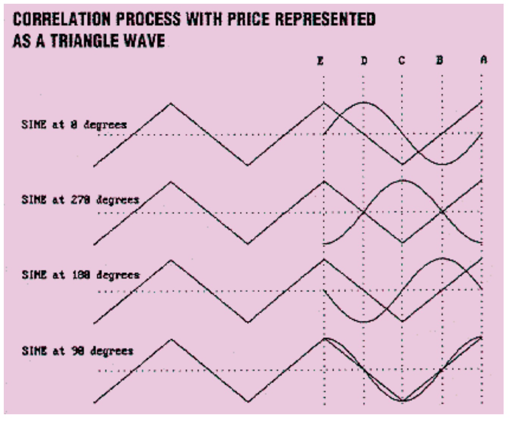

**FIGURE 1:** The sine wave has the best correlation to the triangle wave when the sine wave is positioned at 90 degrees. Point A is the last record; think of it as the current day. Point E is the same point in the cycle, one cycle length back in history. If you multiply sine by the price and sum these results, you will find that beginning with sine at 90 degrees returns the largest number, compared with sine at 180 degrees, 270 degrees or 0 degrees.

Figure 1 is a simplified example of how the correlation process works when the price is represented as a triangle wave. Without cycle correlation, you have no idea when the slope of the price will break up or down. The sine wave to which the price is correlated is at the same frequency (cycle length) as the triangle wave. Visually, it is apparent that the best correlation to a sine wave occurs when the sine is positioned at 90 degrees. Let's see why. Point A is the last record; think of it as the current day. Point E is the same point in the cycle, one cycle length back in history. Points B, C and D are the quarter wavelength points along the cycle history. When we correlate the triangle wave price with the sine wave at zero degrees, we find they are not correlated because the correlation value is zero. The correlation process can be performed by using symmetry. The product of the triangle and the sine wave between points A and B is always negative because the triangle wave is positively valued, while the sine wave is negatively valued. Therefore, the sum of all the incremental products will be negative. Between points B and C, however, both the triangle and sine wave are negative so their product is positive. With symmetry, the sum of all products between B and C cancel the sum of all products between A and B. Similarly, the sum of products between D and E cancel the sum of products between C and D. The result? The correlation between the triangle and the sine wave at zero degrees is zero.

> The acceleration of sine wave price cycles decreases at the price extremes, but this is not necessarily true for sharp reversals in real-world price movements.

When we shift the sine wave 90 degrees to the right, it is at a 270-degree phase angle on the last day of the record. Examining this second case shows that the product of the triangle and sine wave at each increment is always negative across the entire cycle. This case cannot have maximum correlation because the correlation value is less than when the sine wave was at zero degrees. Next, we shift the sine wave to the right another 90 degrees, so that it has a phase angle of 180 degrees on the last day. Now, similar to the first case, the sum of products in the increments between A and B cancels the sum of products in the increments between B and C because the sine wave is positive from A to C, the triangle reverses sign, and the wave shapes are symmetrical. Thus, the correlation between the triangle and sine wave at 180 is zero.

## Auld Lang Sine

Maximum correlation is achieved when we shift the sine wave another 90 degrees to the right so that it is at the 90-degree phase on the last day. In this case, the product of the triangle and sine wave at each increment is positive throughout the entire cycle to achieve the maximum correlation value. If the sine wave were shifted slightly from this position, a negative product would result at one or more increments, establishing that the maximum correlation between the triangle price and the sine wave occurs when the sine wave is at 90 degrees. Now, knowing the phase of the cycle is at 90 degrees you could have predicted the turning point of the triangle wave without a clue from factors other than phase, such as acceleration. The acceleration of sine wave price cycles decreases at the price extremes, but this is not necessarily true for sharp reversals in real-world price movements. The phase angle gives you an independent parameter to examine cyclic price activity.

It's that simple. Cycle amplitude is not required. The cycle period is measured or estimated and the phase is obtained by correlation. A BASIC computer code is included for you to program your own cyclic entry points (Figure 13).

Not only that, the output of the procedure has another interesting application. By using a simple lookup table, you can transform the correlated phase to a value of a sine wave. When you plot all the sine wave values you recreate a detrended replica of the price; the detrending occurs because the sine wave has a zero average.

A cycle is any process in which an observed point returns to its original starting point. Think of the automobile engine crankshaft. Each complete rotation is a cycle. (A four-cycle engine is one in which the crankshaft must complete two cycles before the firing sequence on a given piston is repeated.) Now picture an arrow connected to the crankshaft. The arrow is called a "phasor," which forms an angle relative to its starting position as the engine turns. The angle is called the phase angle and varies from zero to 360 degrees. The tip of the arrow points to the fraction of the cycle completed along the circumference of a circle.

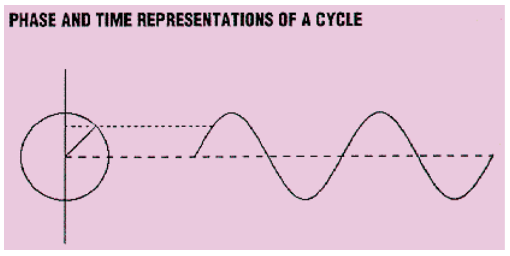

**FIGURE 2:** Imagine a point on a circle tracing out a line as the point travels around the circle. When the point has completed one full trip around the circle, a completed cycle (sine wave) will be traced.

There is a definite relationship between the phase angle and a sine wave in the time domain. Referring to Figure 2, picture a flashlight shining on the arrow from the side so that the arrow casts a shadow in the vertical plane. The length of the shadow traces out the sine wave amplitude as time progresses. A cycle is completed when the arrow has made one full rotation and the sine wave returns to its original zero value and rate of change.

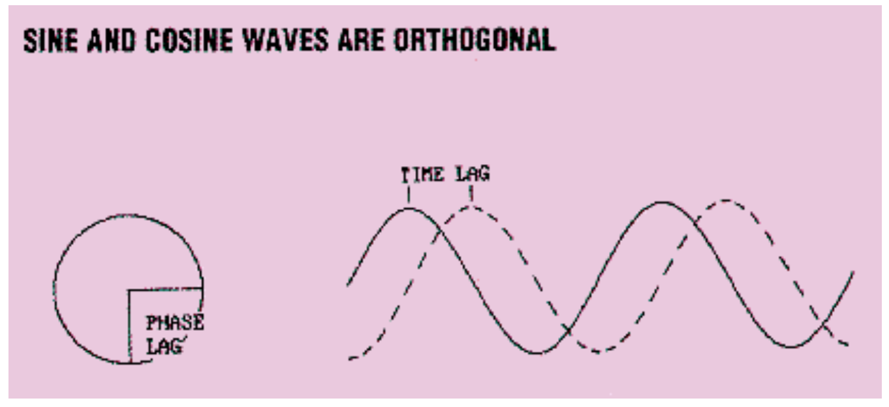

**FIGURE 3:** Two phasors that have a 90-degree phase relationship are synonymous with the sine wave and cosine wave. If we take the product of the sine wave and cosine wave and sum this product over one full cycle, the result is zero.

Figure 3 shows that the 90-degree phase relationship between two phasors is synonymous with the sine wave and cosine waves in the time domain. The sine wave and cosine wave, with their phases at right angles, are "orthogonal." If we take the product of the sine wave and cosine wave and sum this product over one full cycle, the result is zero. This is called orthogonality, an important characteristic of sine waves. In other words, a sine wave is completely uncorrelated with a cosine wave. We can almost see the result by inspecting Figure 3. When the sine wave is zero the cosine wave is maximum and vice versa, several zero products are produced. From the symmetry between these zero products, the amplitude of the sum of the positive products is equal to the amplitude of the sum of the negative products. A net zero sum is the result.

On the other hand, if we multiply the sine wave by itself, we are correlating two in-phase cyclic signals. When we sum this product over a full cycle, the amplitude of the resulting sum is π. Correlation between two cycles at the same frequency decreases from maximum for the in-phase case to zero when the phase difference is 90 degrees. If the cycles are exactly out of phase, the correlation amplitude is π but with a negative sign. Despite the risk of being redundant, there is maximum correlation between two cycles of the same frequency when they are in phase.

In addition, when the sine wave at one frequency is correlated with the sine wave at a different frequency over an integer number of cycles, the correlation is zero. This is called the "normal" property of sine waves and is why Fourier Transforms successfully detect frequencies. In correlating a sine wave at the estimated dominant cycle with the real price data, which can contain many cycles, there is no guarantee that all the components in the data will have an integer number of cycles over the correlation period. Thus, frequencies other than the estimated dominant cycles probably will not be rejected, although there is a tendency to reduce them in the correlation process.

## From Zero to 360

We can display the phase angle we get from correlation on the same time axis as the bar chart. The vertical scale for the phase angle ranges from zero to 360 degrees (or zero to 2π, if you prefer). When a cycle is completed, the phase "snaps back" to zero from the 360-degree maximum. In this kind of plot, the phase angle is plotted as a sawtooth wave shape for a perfect 20-day sine wave, as shown in Figure 4. The 90-degree and 270-degree points are marked as the dotted lines on the phase plot. Figure 5 shows the phase plot of a continuously varied frequency sine wave (also known as "CHIRP"). The continuous frequency had been measured by the computer program MESA. Figure 5 illustrates that another definition of frequency is the phase rate-change because the slope of the phase plot decreases as the period of the sine wave increases.

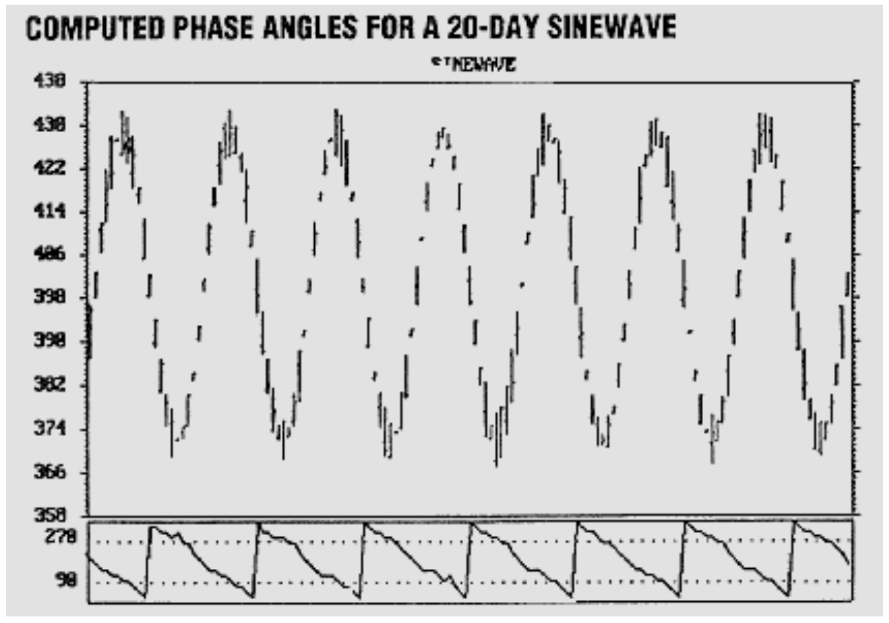

**FIGURE 4:** The vertical scale for the phase angle (lower chart) ranges from zero to 360 degrees (or zero to 2π). When a cycle is completed, the phase "snaps back" to zero from the 360-degree maximum. In this kind of plot, the phase angle is plotted as a sawtooth wave shape for a perfect 20-day sine wave.

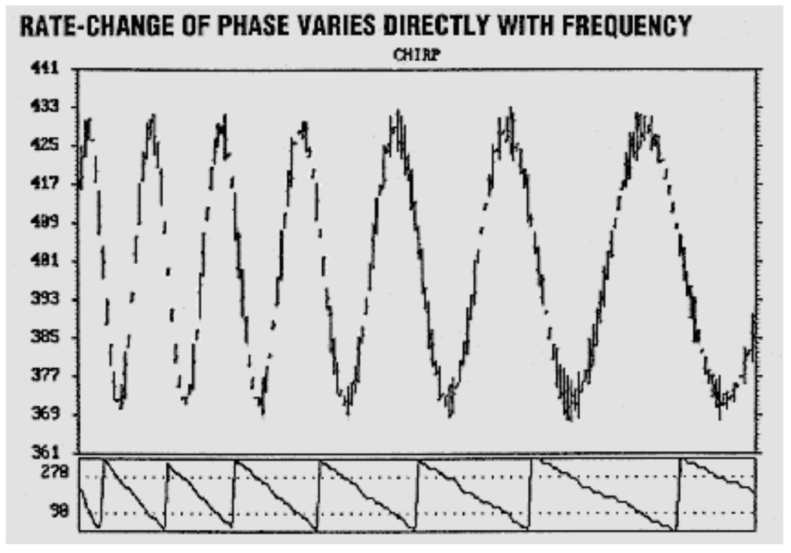

**FIGURE 5:** A continuously varied frequency sine wave has been measured and the resultant slope of the phase plot decreases as the period of the sine wave increases.

Returning to the perfect 20-day sine wave, Figure 6 shows the accuracy of the long entry points at the 270-degree phase. The vertical lines drawn from the places where the phase is 270 degrees indicate that the long entry points are almost perfect. Similarly, Figure 7 shows the entry points for short positions at the 90-degree phase. The short position entries appear to lag the actual price peaks a little, so we can adjust the entry point to enter at the very peaks on the average. All we have to do is change the rule to enter the short position when the phase is a little larger than 90 degrees.

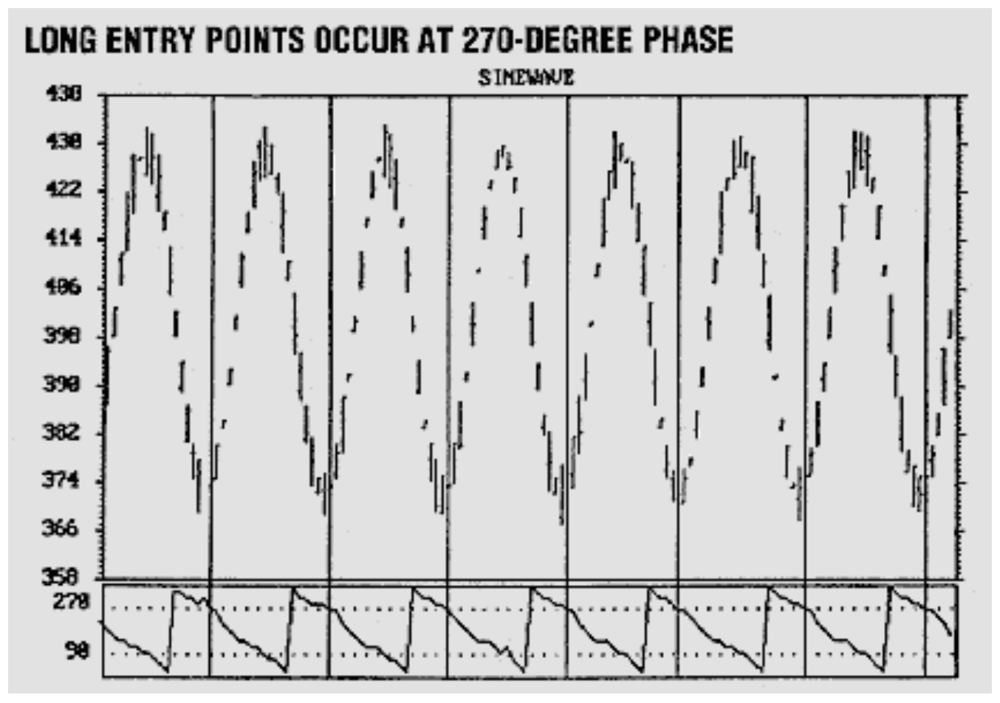

**FIGURE 6:** A perfect 20-day sine wave illustrates the accuracy of buy entry points (vertical lines) at the 270-degree phase.

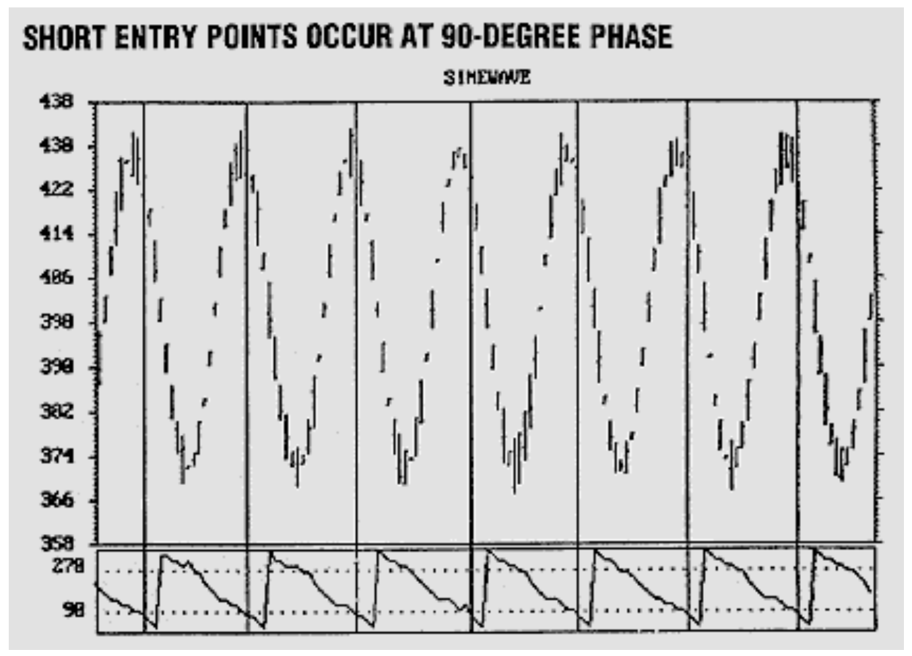

**FIGURE 7:** The entry points for sell points (vertical lines) occur at the 90-degree phase for our perfect 20-day sine wave.

> Theoretical waveforms are all well and nice, but does the procedure work in the real world? Figure 8 shows the correlated phase response for a typical stock in which the dominant cycle has previously been measured with MESA.

Theoretical waveforms are all well and nice, but does the procedure work in the real world? Figure 8 shows the correlated phase response for a typical stock in which the dominant cycle has previously been measured with MESA. Perfection is seldom attained in the real world, but the cyclical rate-change of phase is certainly discernible. Long entry points and short entry points are shown separately in Figures 9 and 10 to avoid confusion regarding the buy/sell signals. Not all the signals are winners. On the other hand, the entry points are not altogether sloppy when compared with other entry techniques over the span of the chart.

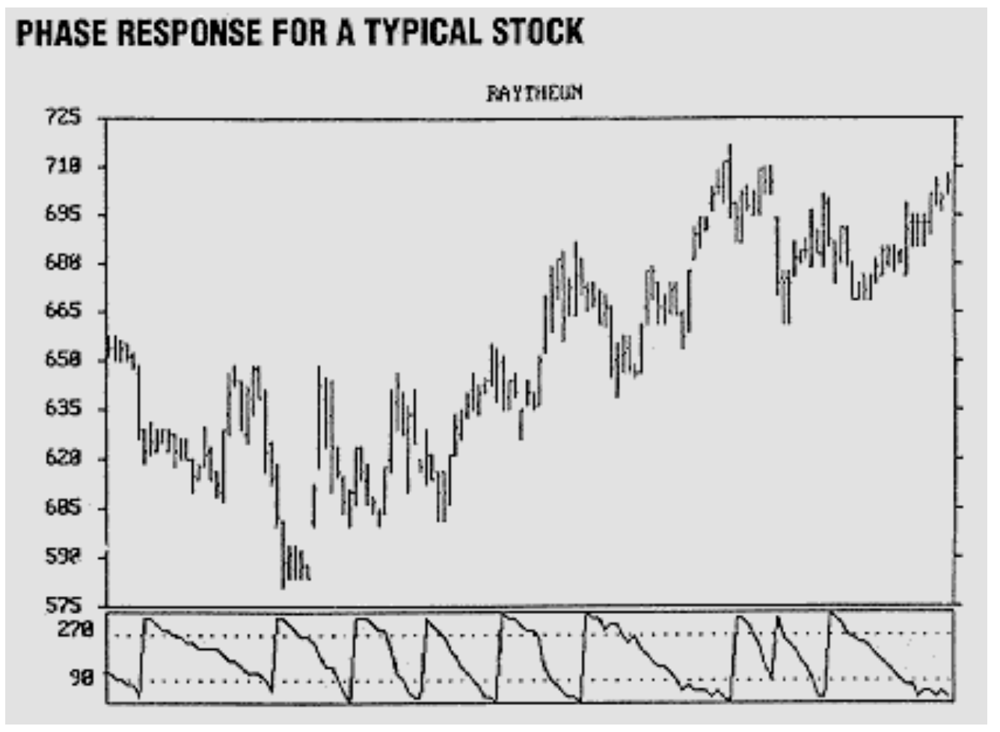

**FIGURE 8:** The correlated phase response for a stock in which the dominant cycle has been measured by the MESA program. Perfection is seldom attained in the real world, but the cyclical rate-change of phase is certainly discernible.

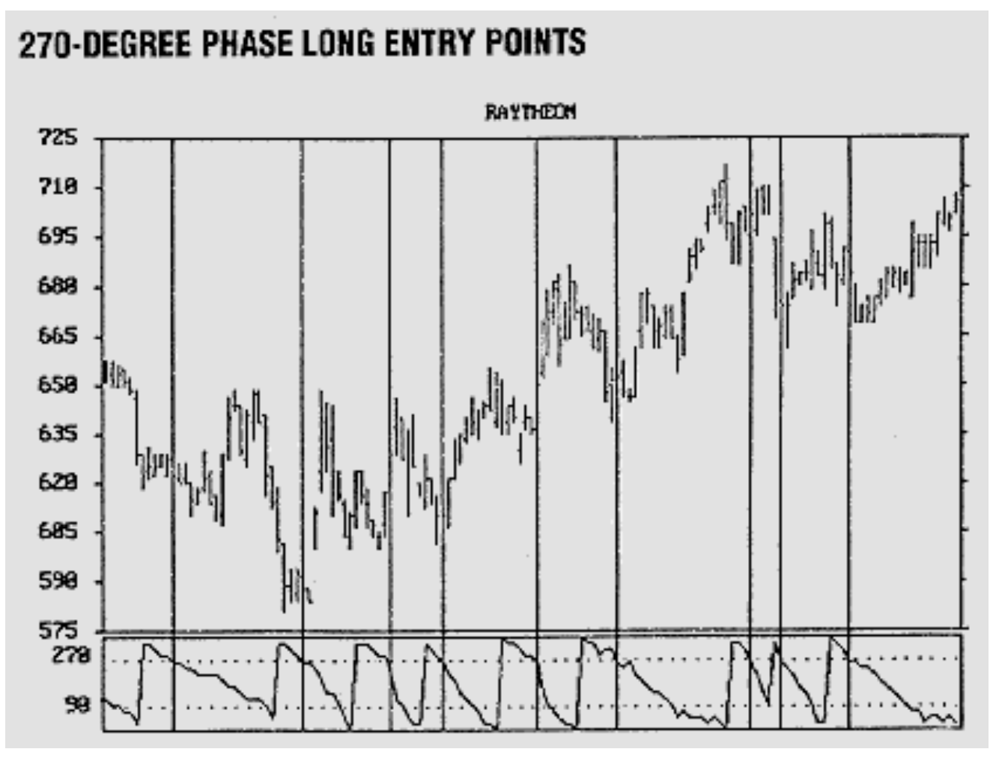

**FIGURE 9:** Buy levels (vertical lines) are indicated at the 270-degree phase. Not all signals are winners.

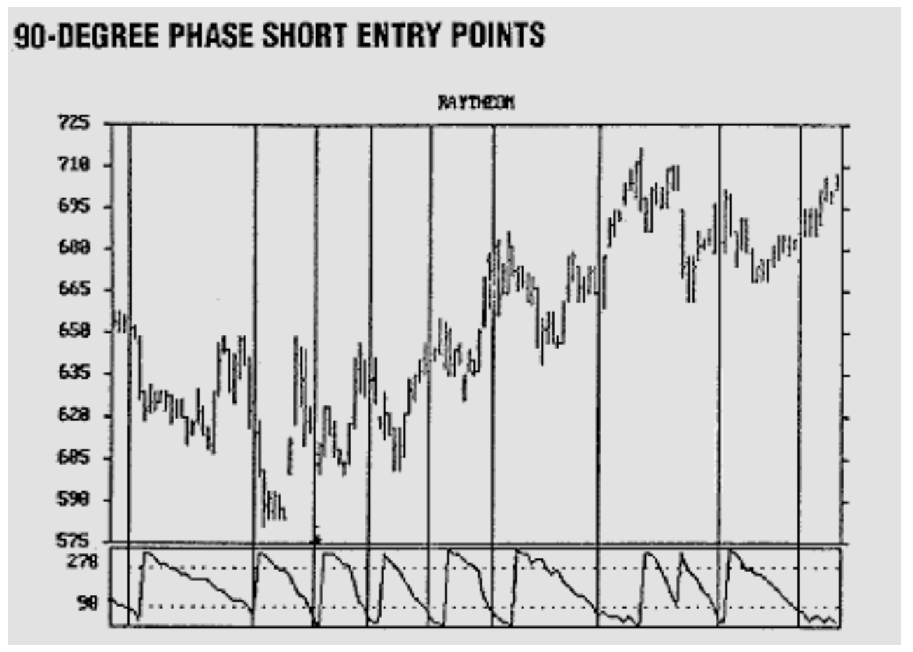

**FIGURE 10:** The same stock, only the sell signals (vertical lines) are highlighted (at the 90-degree phase plot).

As a matter of interest, the detrended cycles (Figure 11) are shown below the phase plot to illustrate the effectiveness of this new way of detrending. The reconstituted cycles are in phase with the cyclic components of the real price. These detrended cycles were generated by assigning a sine wave amplitude to each phase value. As you can see from Figure 11, the detrended cycle reaches a maximum at 90 degrees phase and a minimum at 270 degrees phase. Figure 12 illustrates one of the original premises of cycle analysis — that useful cycles are not always present. When the two trends are in force, as in Figure 12, both the phase response and the detrended cycles are erratic. Cyclic analysis should not be used for trading during these periods. However, tidy profits can be captured during the cycle preceding each trend mode. Both MESA and the erratic phase response help you identify trends early in their onset. Such indications allow you to shift trading strategies, using moving averages or parabolics instead of cycles to pick your entry and exit points. You can adapt your strategy to what the market gives you by using such techniques.

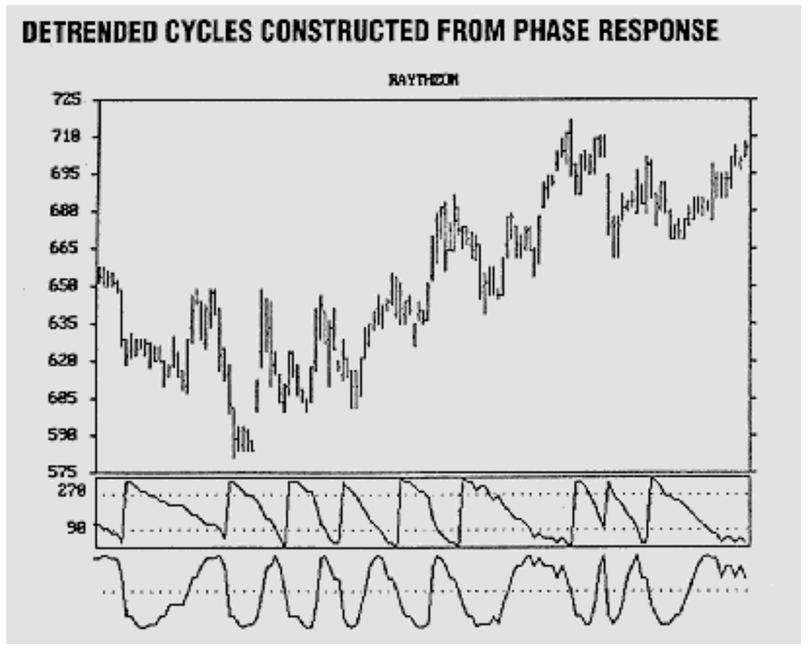

**FIGURE 11:** Detrended cycles are shown below the phase plot. The reconstituted cycles are in phase with the cyclic components of the real price.

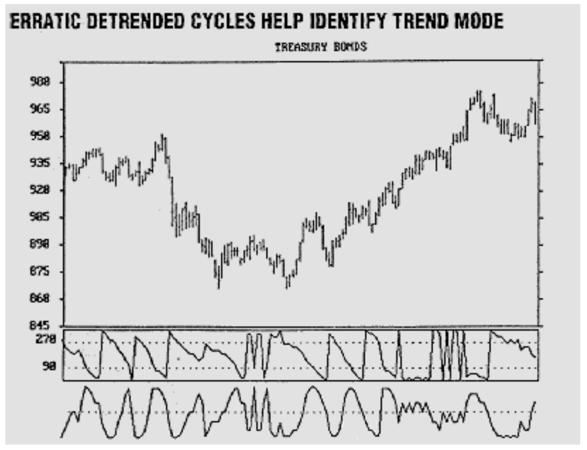

**FIGURE 12:** When two trends are in force, both the phase response and the detrended cycles are erratic. Cycle analysis should not be used during these periods.

## Doing the Job

Perhaps the best way to explain how the phase correlation method works is to describe the BASIC computer program that does the job (Figure 13). It is assumed for our purposes that the dominant cycle for each record in the file has already been estimated and exists as the data vector DominantCycle(D), where D is the daily incremental variable.

In line 100, we are conducting the calculation for each day (D) in the file starting with the 50th record. Since the longest possible dominant cycle is 50 days, we must start with the 50th record because we correlate back over the full dominant cycle length. In line 110 the phase incremental variable (P) is varied in 16 steps from 0 to 15. Since there are 360 degrees in one rotation, each phase increment corresponds to 22.5 degrees. The correlation value is initialized at zero in line 120 for each new phase increment.

The actual correlation is done in lines 130 through 160. In line 130 we step backward through each day in the data from the present day (D) over the full period of the dominant cycle. In line 140 we take the product of the price and a pure sine wave for each day during this dominant cycle period. (Line 140, sine 6.28, is 2π.) The frequency of the sine wave is exactly the dominant cycle because the ratio of the (I) incremental variable to the DominantCycle(D) is unity at the end of the FOR-NEXT loop. Each time through the FOR-NEXT loop, the product is added to the correlation value Corr(P) to sum all the products. As a result, there is a correlation value for each of the phase increments (P).

The FOR-NEXT loop over the length of the DominantCycle(D) is repeated 16 times, once for each phase increment (P) by virtue of lines 110 and 170. Once we have the correlation value for each phase increment, we need to find which correlation value is the largest. So first, we initialize the maximum correlation value in line 180. We then exhaustively search for the largest correlation value in lines 190 through 240. If the current correlation value exceeds the current maximum, then the maximum is updated to the current correlation value.

These operations produce the phase increment (P) with the largest correlation value for one record in the file. The entire calculation is repeated for each record in the file by virtue of lines 100 and 250.

With the phase number for each day in the file, you can write plotting routines to display either the phase or the detrended cycles relative to your bar chart, as I have done in Figures 4 through 12. These plots should give you new insights into market activity.

### BASIC Program

```basic
100 FOR D = FirstRecord + 50 To LastRecord
110 FOR P = 0 To 15
120 Corr(P) = 0
130 FOR I = 0 TO DominantCycle(D) - 1
140 Product = Price(D - I) * SIN(6.28 * (I / DominantCycle(D) + P / 16))
150 Corr(P) = Corr(P) + Product
160 NEXT I
170 NEXT P
180 Max = 0
190 For P = 0 To 15
200 IF Corr(P) > Max THEN
210 Max = Corr(P)
220 Phase(D) = P
230 END IF
240 NEXT P
250 NEXT D
```

**FIGURE 13:** The above BASIC computer program requires that a dominant cycle has already been estimated.

## Miscellaneous Conclusions

Accurate entry points can be established when the market is in a cycle mode where the only required a priori knowledge is an estimate or measurement of the dominant cycle length for each record in your data file. The entry points are based on the 90-degree or 270-degree points of the sine wave cycle. The exact entry points can be adjusted to anticipate or lag cyclic turns as insurance against whipsaws. The phase measurements are accomplished by correlating the price data with sine waves at the dominant cycle frequency at various phase angles. More than 16 phase increments can be used to provide finer phase resolution at the expense of increased computation time. Although not demonstrated, the correlation process has noise immunity to provide relatively reliable entry signals, even in high-noise conditions. The phase and detrended cycles offer you a new perspective from which to view the market and thereby enable you to adjust your strategy to fit current market conditions.

---

*John Ehlers, Box 1801, Goleta, CA 93116, (805) 969-6478, has been a private trader since 1978. He is a pioneer in introducing maximum entropy spectrum analysis to technical trading through his MESA computer program.*

## References

- Ehlers, John F. [1990]. "1989 cycles," *Technical Analysis of Stocks & Commodities*, Volume 8: June.
- Ehlers, John F. [1989]. "Cyclic personalities," *Technical Analysis of Stocks & Commodities*, Volume 7: April.

## BibTeX

```bibtex
@article{ehlers1991cyclic,
  author    = {Ehlers, John F.},
  title     = {Computing Cyclic Entries},
  journal   = {Technical Analysis of Stocks \& Commodities},
  volume    = {9},
  number    = {7},
  pages     = {270--275},
  year      = {1991},
  month     = jul,
  url       = {https://technical.traders.com/archive/article.asp?file=\V09\C07\CYCLIC.pdf}
}
```
