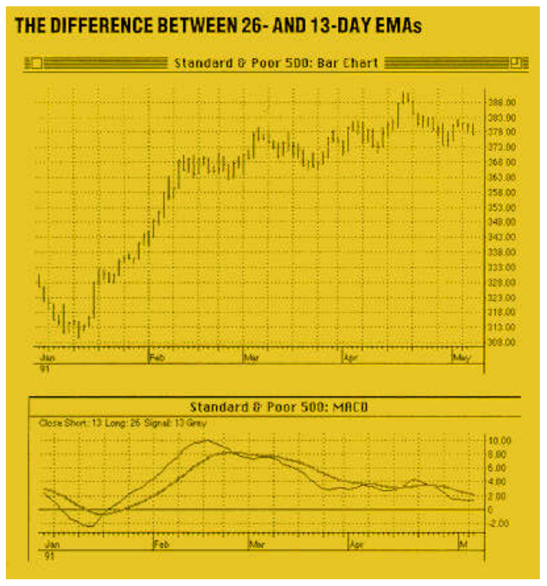
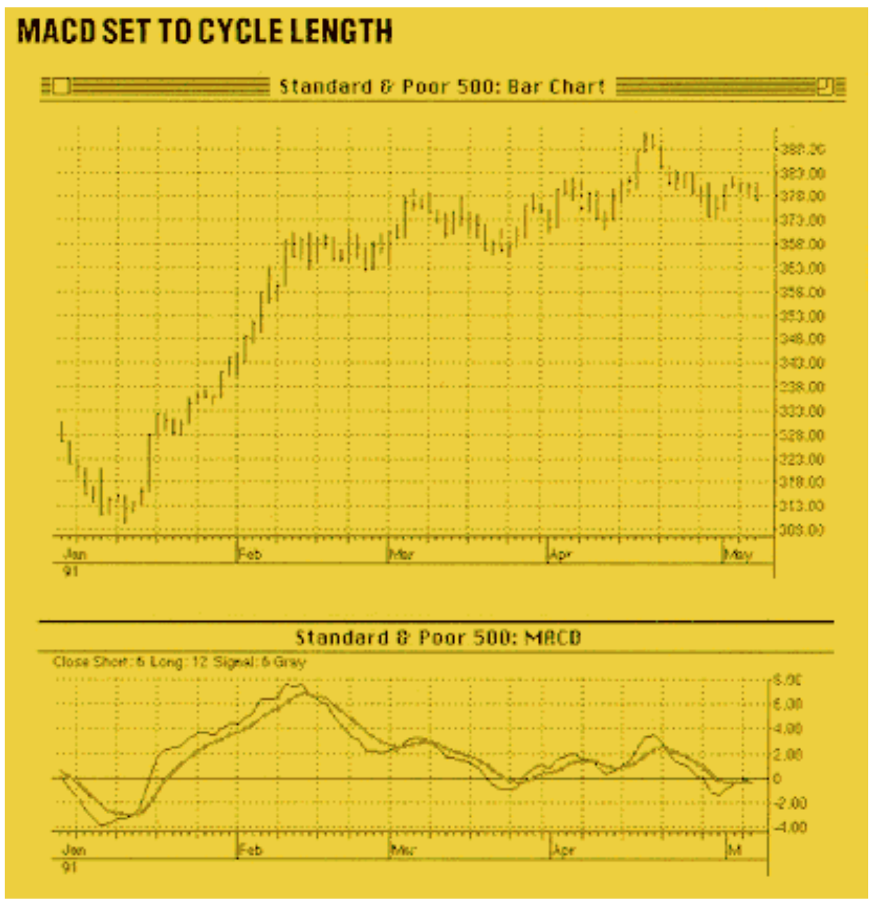
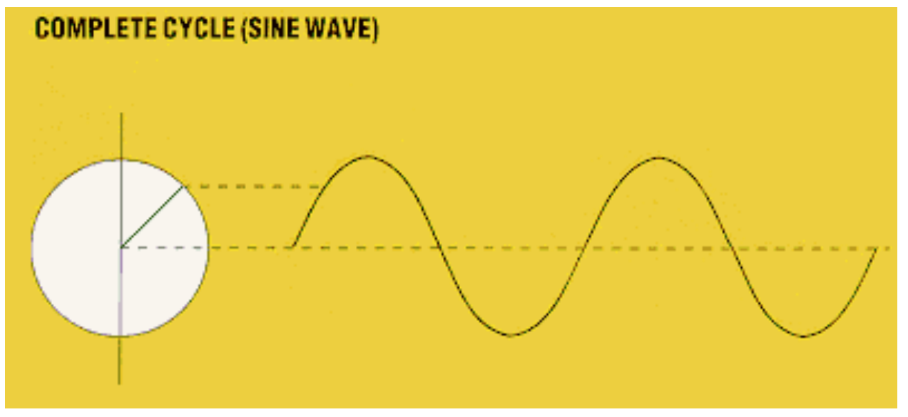
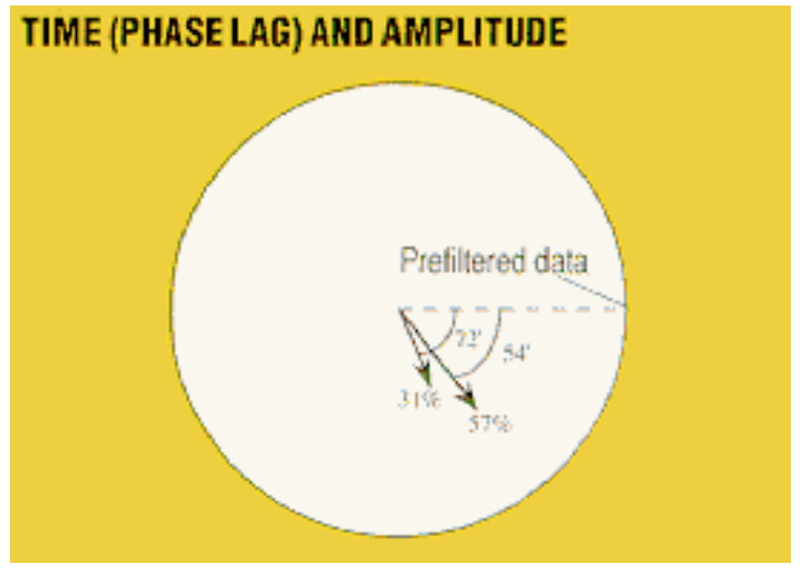
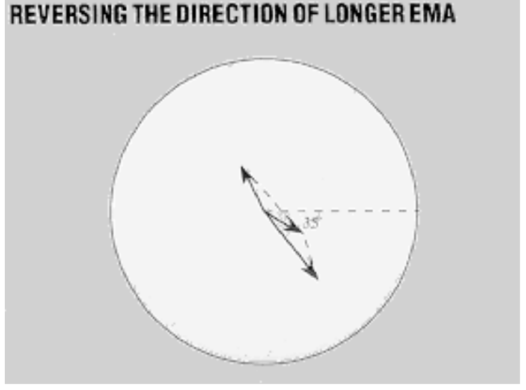
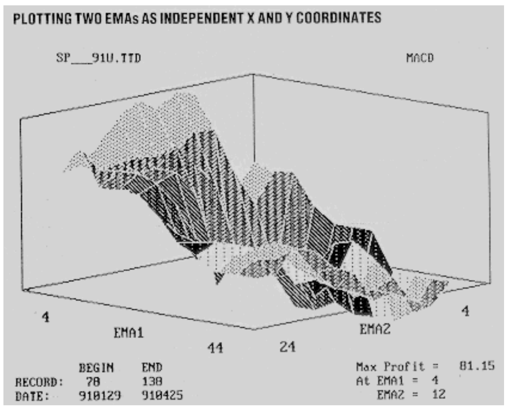
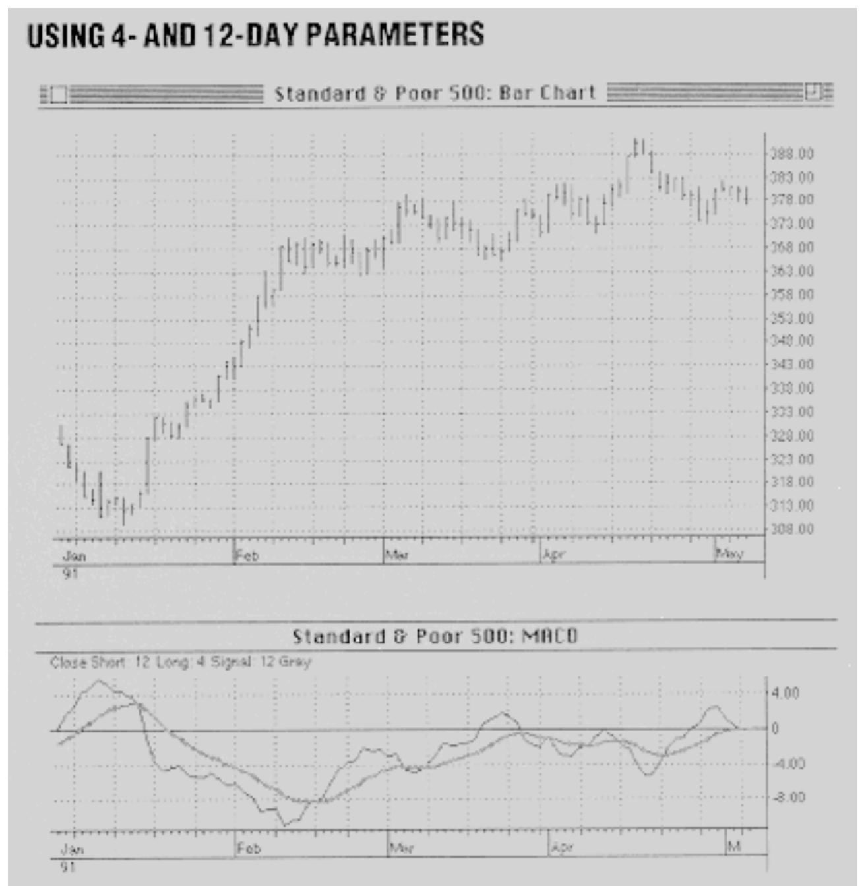
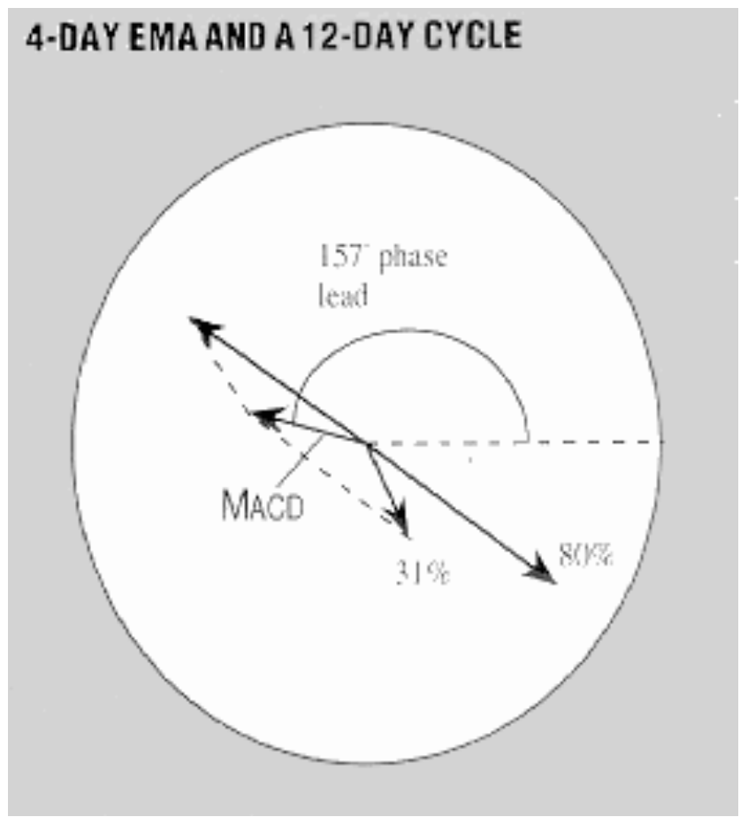
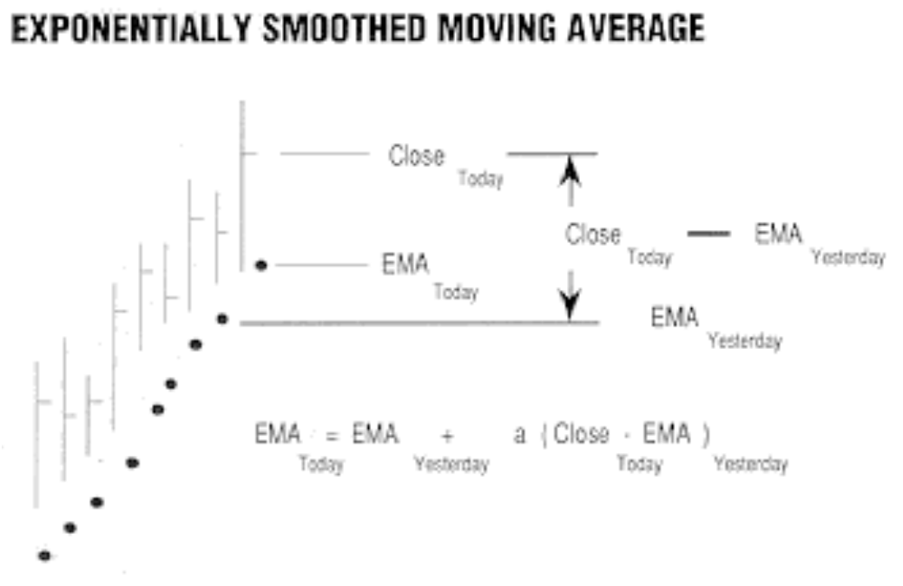

# The MACD Indicator Revisited

**John F. Ehlers**

*Technical Analysis of Stocks & Commodities, Volume 9, Issue 10 (October 1991), pp. 391–395*

Article URL: https://technical.traders.com/archive/article.asp?file=\V09\C10\MACDREV.pdf

---

The moving average convergence-divergence (or MACD, as it is familiarly known), one of the more popular technical indicators, was invented by technician Gerald Appel to trade the 26-week and 13-week cycles of the stock market. Commodity traders often use daily data with MACD but still use 26-period and 13-period exponential moving averages (EMA) in the analysis. The implication is that there are 26- and 13-day cycles in commodity markets. Beliefs such as this (for example, that only a 14-day relative strength index is correct) incite my curiosity enough to make me do some research. The basic premise by which I work is that the market is always changing and your trading strategy and indicator parameters must change to fit the current market conditions. Specifically, I have studied the Standard & Poor's 500 and have found an unusual combination of MACD parameters that produces good profits a surprisingly high percentage of the time. This unique use of the MACD indicator can be applied to almost any market at one time or another.

## The Traditional MACD

A 26-day EMA is the first moving average and a 13-day EMA is the second moving average in a traditional MACD. The MACD line is formed by subtracting the long (first) moving average from the short (second) moving average. A signal line is formed by smoothing the MACD line with a third EMA. The third moving average is usually a 10-day EMA. For the sake of simplicity, causing only a small amount of distortion, I use the third EMA to be equal in length to the second EMA.

> I studied the Standard & Poor's 500 and found an unusual combination of MACD parameters that produces good profits a surprisingly high percentage of the time.

The classic MACD of the Standard & Poor's 500 index shown in Figure 1 is for about the first four months of 1991. MACD and its signal are shown below the bar chart. The signal is the smoother of the two lines. It's clear that MACD goes up when prices rise and MACD goes down when prices fall. Some time lag exists between the peak of the prices and the peak of the MACD; buy/sell signals are formed when the MACD crosses its signal and are indicated by the up and down arrows at the bottom of the bar chart. Used in this way, the MACD nicely caught the uptrend in the January/February time frame.

MACD can also be used as an overbought/oversold indicator. Successive highest highs (or lowest lows) of price are compared with successive highest highs (or lowest lows) of MACD. In Figure 1 the successive highest highs of price trend up in the February–April time frame while the successive highest highs of MACD trend down. This is a divergence. This divergence is often interpreted as an overbought condition.



**FIGURE 1:** The MACD line is the difference between the 26- and the 13-day EMAs. The result is smoothed a second time with a 13-day EMA. This second smoothing is the signal line. With this, it becomes clear that the MACD line rises and falls with the market. Buy and sell signals occur when the MACD line crosses the signal line.

## Cruel Abandonment

The first thing I do when modifying MACD is to abandon the convergence/divergence concept. Divergence is difficult to program on a computer without fuzzy logic or neural networks. Second, I adapt the moving average parameters to the measured or assumed cycles in the data. With reference to Figure 1, the period between successive highs or successive lows is approximately 12 days for the period between mid-February and the end of April.

> The first thing I do when modifying MACD is to abandon the convergence/divergence concept.

When we set the first MACD EMA to the length of the cycle and the second EMA to the length of the half cycle, the buy/sell signals of Figure 2 result. Recall that the signal line uses the same parameters as the second EMA of the MACD line. In general, this combination of parameters gives an entry signal slightly after the crest or valley of each cycle. We can use cycle theory to see why.



**FIGURE 2:** Between each successive high and low during mid-February and the end of April, there are approximately 12 trading days. Using 12 and six (the half cycle) as the constants for the EMA smoothing produces signals that occur slightly after the crest and valley of each cycle.

A cycle is a process in which a point under observation moves through a given pattern and eventually returns to its original starting place. Think, if you will, of the automobile engine crankshaft. Now picture an arrow connected to the crankshaft. The arrow is called a "phasor," which forms an angle relative to its starting position as the engine turns. The angle is known as the phase angle and varies from zero to 360 degrees. The tip of the arrow points to the fraction of the cycle completed along the circumference of a circle.

A definite relationship exists between the phase angle and a sine wave in the time domain. Picture a flashlight shining on the arrow from the side in Figure 3 so the arrow casts a shadow in the vertical plane. The length of the shadow traces out the sine wave amplitude as time progresses. A cycle is complete when the arrow has made one full rotation and the sine wave returns to its original zero value and rate of change. The amplitude of the sine wave is proportional to the length of the arrow.



**FIGURE 3:** Imagine a point on a circle tracing out a line as the point travels around the circle. When the point has completed one full trip around the circle, a completed cycle (sine wave) will be traced in the time domain.

Moving averages have two effects on cycles. Moving averages introduce time (and therefore, phase) lag and they attenuate (that is, reduce amplitude) of the higher-frequency components. My research shows a full-cycle EMA introduces about 72 degrees of phase lag and attenuates the cycle to approximately 31% of its unaveraged amplitude. A half-cycle EMA introduces about 54 degrees of phase lag and attenuates the cycle to approximately 57% of its unaveraged amplitude. The phasors for these two EMAs are shown in Figure 4. (See sidebar, "Exponential Moving Averages.")



**FIGURE 4:** Moving averages introduce time (phase) lag and reduce amplitude of higher-frequency components. Full-cycle EMAs introduce about 72 degrees of phase lag and compress cycle to about 31% of unaveraged amplitude; a half-cycle introduces about 54 degrees of lag and reduces cycles about 57% of the unaveraged amplitude.

When we calculate MACD, we subtract the longer EMA from the shorter EMA. This is done on the phasor diagram by reversing the direction of the longer EMA (thus changing its sign) and then performing a vector addition. The resulting vector lags the original price function about 35 degrees, as shown in Figure 5. I call this the result of the detrended synthetic price because taking the difference of the two EMAs removes the very low frequency trend components, and the outcome is closely related to the price in phase. Remember, the signal line is delayed another 54 degrees from the MACD because the smoothing is done with the second EMA. The MACD crosses the signal approximately at half the phase lag, or 27 degrees. As a result, the buy/sell indication occurs at 35+27=62 degrees after the price crests and bottoms at the cycle. Of the 12-day cycle, 62 degrees corresponds to about two days' lag. Since we can't actually buy or sell until the day after we get the signal, the actual entry is delayed about 90 degrees from the price crest or valley.



**FIGURE 5:** By reversing the direction of the longer EMA and then performing vector addition, the resulting vector lags the original price function about 35 degrees. This vector can be thought of as the detrended synthetic price because it is near the price in phase.

We're in trouble with this approach. If we have a 90-degree lag in entry of the position, we necessarily will have a 90-degree lag in exiting the position. As a result, the best we can do theoretically (before commission) is to break even. Such methodology invalidates technical analysis and throws us into the arms of lady luck. Personally, I'm not very lucky. There has to be a better way.

## Inverse Perversions

One way to adapt to the market is to obtain an overview of market conditions in recent history. I do this for MACD in my 3D program by plotting the two EMAs as the independent X and Y coordinates and profit in the Z dimension as the dependent variable. When profit is calculated for all combinations of the independent EMAs, a three-dimensional surface of profitability results (Figure 6).



**FIGURE 6:** Plotting the two EMAs as the independent X and Y coordinates and the profit in the Z dimension as the dependent variable produces this three-dimensional graph. The maximum profit occurs when the first EMA is shorter than the second EMA.

Figure 6 is interesting from several perspectives. First, the surface is relatively smooth, so this means the profitability is relatively insensitive to variations in the EMA parameters. The implication is that MACD is robust, and minor variations in market conditions will not severely affect profitability for trading in the immediate future for the selected EMAs. The second interesting aspect of Figure 6 is that the maximum profit occurs in the "inverse" domain where the first EMA is smaller than the second EMA.

> Cycle analysis has helped provide a rationale as to why inverse MACD parameters produce profitable trading results in some market conditions.

Figure 7 shows the trades formed in the February through April time frame using the inverse parameter combination. In this case, the buy/sell signals are almost always early relative to the cyclic highs and lows. The early signals allow us to accommodate the necessary one-day lag in making an entry after the signal has been received. However, MACD cannot be applied universally this way. For example, note the January sell signal (second bar from the left edge of the chart) is dead wrong. As calculated, this 4/12-day EMA parameter set is valid only in the immediate past relative to the right-hand side of the bar chart.



**FIGURE 7:** Using the four- and 12-day parameters produce early signals relative to the cyclic highs and lows. Note that in early January the sell signal was dead wrong. This underscores the important point that this particular set of parameters is only valid in the near past.

Note, also, that the MACD is somewhat out of phase with the cyclic component of price (Figure 7). When the price reaches a peak, the MACD is at a valley, and vice versa. The signal is relatively smooth because it is now being calculated using the longer EMA. We need to return to phasor analysis to fully understand why this set of MACD parameters has given good entry signals.

The first four-day EMA attenuates a 12-day cycle to about 80% of its unaveraged amplitude and introduces a phase lag of about 40 degrees. The second 12-day EMA attenuates the 12-day cycle to about 31% of full amplitude and introduces a 72-degree phase lag (Figure 8). When we invert the first (four-day) EMA and perform the vector addition, we see that the resulting MACD lags the price function by 203 degrees. Viewed another way, the resulting MACD leads the next cycle by 157 degrees (203+157=360 degrees). The MACD signal is attenuated to 31% of the MACD value and is delayed by 72 degrees. Thus, the buy/sell signals lag the MACD by about 90 degrees; so the buy/sell signals lead the next cycle by about 67 degrees (157-90=67). This extra lead is just about right to compensate for the one-day lag in making the entry after we get the signal.



**FIGURE 8:** The four-day EMA attenuates a 12-day cycle to about 80% of its unaveraged amplitude and introduces a phase lag of about 40 degrees. The 12-day EMA attenuates the 12-day cycle to about 31% of the full amplitude and introduces a 72-degree phase lag. Performing vector addition after inverting the four-day EMA results in the new vector (MACD line) that lags the price by 203 degrees. Viewed another way, the resulting MACD leads the next cycle by 157 degrees.

## Overall, We Conclude

Although somewhat complex, cycle analysis has helped provide a rationale as to why inverse MACD parameters can produce profitable trading results in some market conditions.

When an overview perspective is taken, new twists on such old familiar indicators as MACD can be found. More important to your trading, you can look at several indicators in the same market to find the one that is the most robust and least sensitive to market variations. You can formulate your trading strategy in such a manner. You will tend to use trend-following indicators such as MACD and double moving averages in trending markets and oscillators such as RSI and stochastics in sideways markets. Parabolic stop and reverse (SAR) is applicable to many market conditions, depending on the value of acceleration factor you use. You can find unusual parameter combinations for all these indicators when you view the profits from an overview perspective in three dimensions.

---

*John Ehlers, Box 1801, Goleta, CA 93116, (805) 969-6478, is an electrical engineer working in electronic research and development and has been a private trader since 1978. He is a pioneer in introducing maximum entropy spectrum analysis to technical trading through his MESA computer program.*

---

## Sidebar: Exponential Moving Averages

Defining exponentially smoothed moving averages — which, for most traders, would be a series of closing prices — is simply another form of a moving average. An exponentially smoothed moving average utilizes a smoothing constant (α) that approximates the number of days for a simple moving average. This constant is multiplied times the difference between today's closing price and yesterday's moving average value. This new value is then added to yesterday's moving average value:

$$\text{EMA}_{\text{today}} = \text{EMA}_{\text{yesterday}} + \alpha \cdot (P_{\text{today}} - \text{EMA}_{\text{yesterday}})$$

The mathematically reduced formula for a geometrically (exponentially) weighted moving average is:

$$\text{EMA}_D = \alpha \cdot P_D + (1 - \alpha) \cdot \text{EMA}_{D-1}$$

where $P_D$ is the price on day $D$ and $\alpha$ (alpha) is a smoothing constant (0–1). Alpha may be estimated as $2/(n+1)$, where $n$ is the simple moving average length.

For example, an approximation for a 10-day moving average would use α = 2/(10+1) = 0.18.



**FIGURE 1 (Sidebar):** Exponentially smoothed moving average.

---

## References

- Appel, Gerald. *The Major Trend Power Index*, Scientific Investment Systems, Inc., 62 Wellesley Street West, Toronto, Ontario, Canada.
- Ehlers, John F. [1991]. "Computing cycle entries," *Stocks & Commodities*, July.
- Ehlers, John F. [1990]. "Early trend identification," *Technical Analysis of Stocks & Commodities*, Volume 8: October.
- Ehlers, John F. [1988]. "Moving averages, part 2: ELI," *Technical Analysis of Stocks & Commodities*, Volume 6: July.
- Ehlers, John F. [1991]. "Using a constant false alarm rate in trading," *Stocks & Commodities*, April.
- Hartle, Thom [1991]. "Exponential moving averages," page 46, *Stocks & Commodities*, January.
- Granger, C.W.J., and Paul Newbold [1986]. *Forecasting Economic Time Series*, second edition, Academic Press, Inc.
- Hutson, Jack K. [1984]. "Filter price data: moving averages vs. exponential moving averages," *Technical Analysis of Stocks & Commodities*, Volume 2: May/June.

## BibTeX

```bibtex
@article{ehlers1991macd,
  author    = {Ehlers, John F.},
  title     = {The {MACD} Indicator Revisited},
  journal   = {Technical Analysis of Stocks \& Commodities},
  volume    = {9},
  number    = {10},
  pages     = {391--395},
  year      = {1991},
  month     = oct,
  url       = {https://technical.traders.com/archive/article.asp?file=\V09\C10\MACDREV.pdf}
}
```
