# 1991 Cycles

**John F. Ehlers**

*Technical Analysis of Stocks & Commodities, Volume 10, Issue 4 (April 1992), pp. 155–159*

Article URL: https://technical.traders.com/archive/article.asp?file=\V10\C04\CYCLES.pdf

---

If you've always suspected that contracts have definite personalities, you would have your suspicions confirmed this way. Here's an overview of various cycles that appeared in some futures markets during 1991, the way only John Ehlers could explain it.

In years past I have reported on the cyclic character of various commodity contracts, concluding that tradeable cycles were present from 15% to 30% of the time and that some contracts tend to have definite cyclic personalities. These conclusions were reached by making spectral estimates on a daily basis and then gathering and displaying the results in a histogram over the full year. The histogram allowed observation of how many times a 12-day cycle occurred, for example. This approach still makes the spectral estimate on a daily basis, but the display has been changed to view the continuity of the cycle content. This display shows the tradeable cycles, multiple simultaneous cycles and even failure of cyclic activity. The display allows you to pick entry points even when the market is in the trend mode by knowing the position of the superimposed cyclic extremes.

## But First, a Little Theory

Imagine a white light shining at a prism. The prism separates the white light, allowing the component colors or wavelengths to be seen. Sir Isaac Newton invented the word "spectrum" to describe the separation into components. Any band of wavelengths can have a spectrum, even the cycle lengths that appear in the market. The spectral estimates in Figures 1 through 12 were made using the MESA algorithm. MESA computations are the functional equivalent of applying the price data to a bank of filters, which spans cycle periods from eight to 50 days, with each filter in the bank only allowing its tuned cycle length to pass. The amplitudes of the filter outputs are sensed, and these amplitudes are compared to form the spectrum display. Figure 1 shows a theoretical 20-day sinewave cycle. The spectrum window in the upper-left-hand corner of the bar chart shows that the 20-day cycle is the only cycle present.

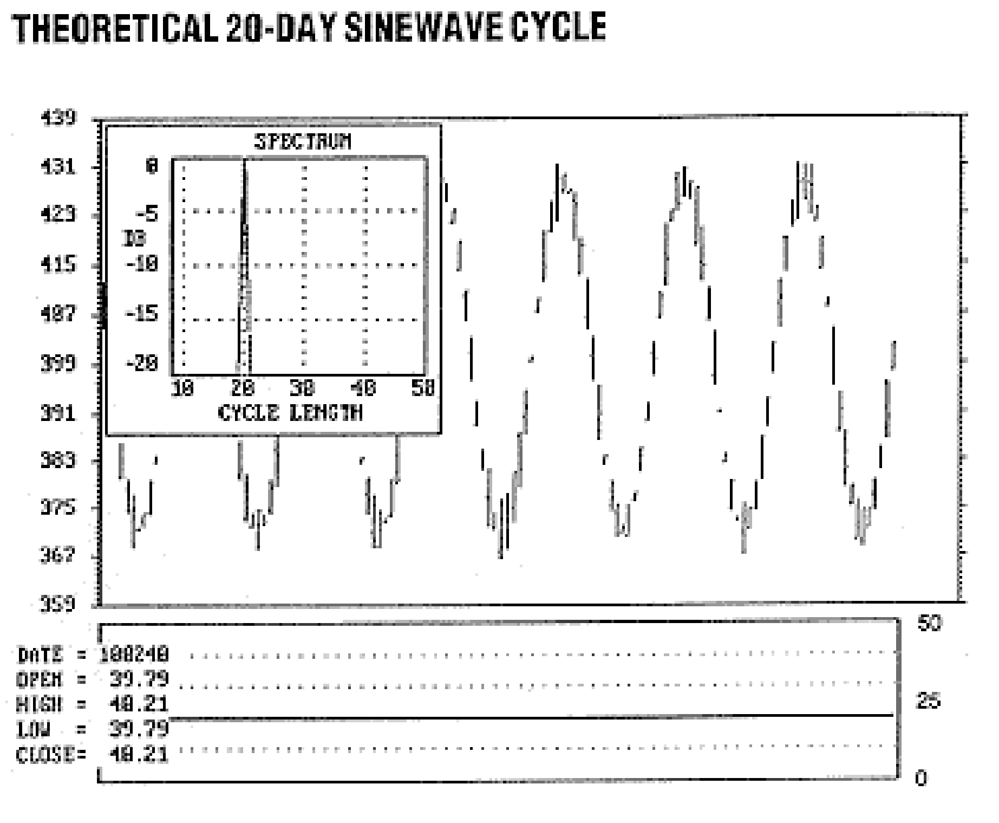

**FIGURE 1:** The solid line is positioned at the 20-day cycle length (right-hand scale of the chart), as this is the only cycle present.

The new color-coded display is the equivalent of a contour plot of the spectrum and is located below the bar chart. The color-coded spectral sequence is plotted directly below the price bar for each day so the spectrum and price are synchronized. The scale of the spectral contour plot ranges from 0 to 50 days, in harmony with the span of the spectrum filter bank. Spectral component amplitudes are displayed relative to the largest component on a decibel scale. Since decibels are logarithmic ratios, the smaller components have negative values. For example, a power ratio of 1/2 equals -3 dB, a power ratio of 1/10 equals -10 dB, and a power ratio of 1/100 equals -20 dB. Spectral amplitudes in the range between 0 and -5 decibels are yellow, between -5 and -10 dB are red, between -10 and -15 dB cyan, and between -15 and -20 dB are blue. The colors were selected to translate to decreasing print density when printed in black and white. The spectral contour plot of Figure 1 is not very interesting because the only cycle present is the pure 20-day cycle.

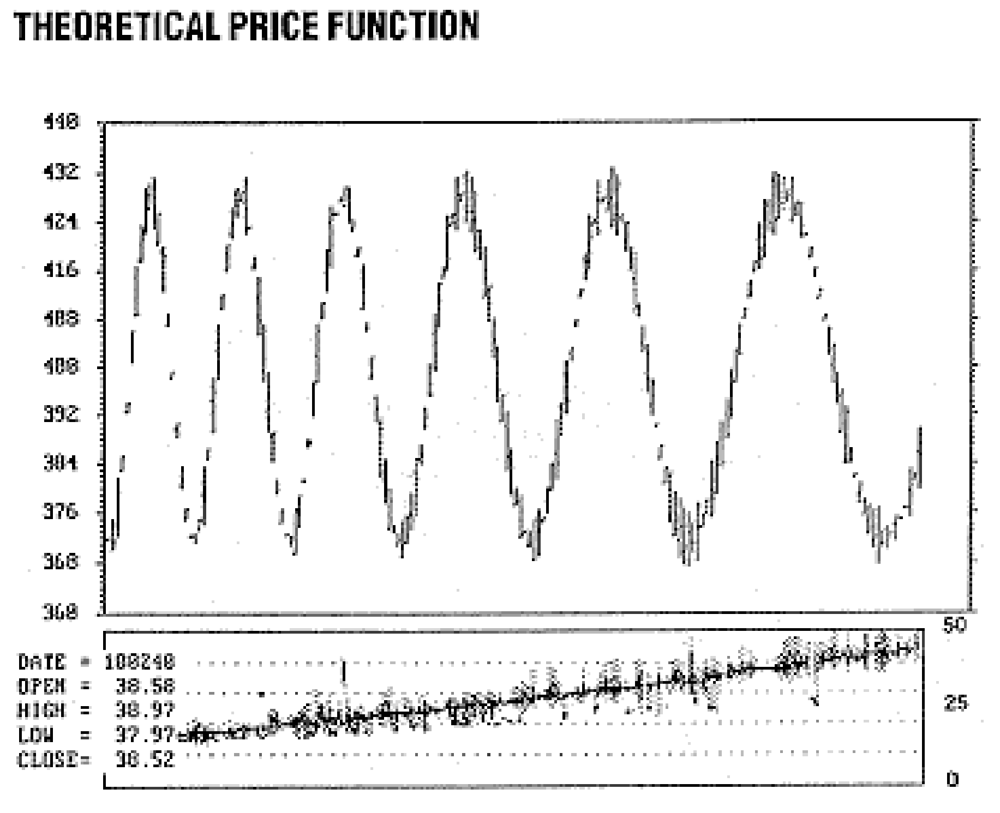

**FIGURE 2:** The cycle length is increasing in the simulated price data, indicated by the rising line. The line is becoming fuzzy because the cycle length is expanding slowly. You can observe the accuracy of the cycle estimate by counting the number of bars between the successive lowest lows or highest highs.

Figure 2 is a slightly more interesting display because the theoretical price function has a slowly increasing period as time increases. The spectral contour now becomes "fuzzier" because the data are not completely stationary over the measured period. Nonetheless, the changing frequency is easy to recognize. The accuracy of the spectral estimate can be checked by counting bars between successive lowest lows (or highest highs). One big difference measuring from a price extreme is that MESA makes continuous measurements and does not rely on discrete points along the cycle.

If a slowly varying cycle period causes the spectral display to be fuzzy, what happens when the frequency changes sharply? The answer can be found in Figure 3, where the theoretical price cycle period switches instantly from 40 days to 20 days and then back to 40 days again four cycles later. Simply, cyclic analysis is invalid for approximately half a cycle period at each transition. Cycle analysis is invalid because the data are not stationary over the analysis period. In the transition zone, a mixture of 20-day cycle data and 40-day cycle data is used for the analysis. All cycle analysis algorithms require stationary data. One major difference between fast Fourier transforms (FFTs) and MESA is that FFTs require a much longer datastream for the analysis. As a result, market data are seldom stationary long enough for a valid FFT analysis. The shift in cycle length can be recognized by a relatively rapid change in the cycle length of the spectral estimate, accompanied by a decrease in resolution (increased fuzziness) in the contour width.

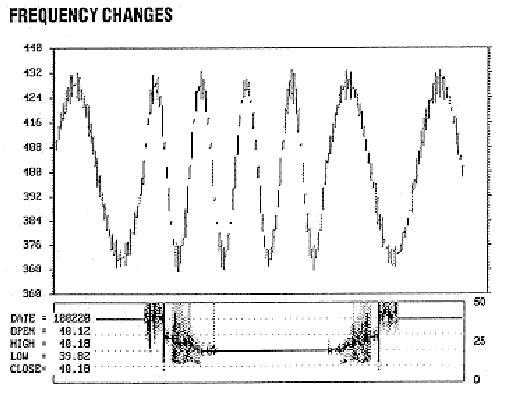

**FIGURE 3:** A slowly varying cycle will cause the spectral display to become fuzzy, while a sudden sharp change in the cycle frequency is accompanied by a decrease in resolution. Cyclical analysis is invalid for approximately half a cycle period at each transition.

Now, understanding the display and some constraints of cycle analysis, we can look back at 1991 from a cycles perspective for several commodity contracts.

## Real-World Cycle Examples

All the real-world cycle examples use the December contract, ending at respective termination dates. Each chart has a span of about eight months, so the left-hand side of each chart is the beginning of April and the beginning of August is approximately at the center of the chart.

The U.S. Treasury bond contract is one of my favorites to trade on the basis of cycles. Traditionally, bonds seem to have a 10- to 12-day cycle personality. The spectral contour of bonds in Figure 4 confirms the previous observations. The eight- to 12-day cycle was present for most of the year, starting about June 28, 1991. Prior to the onset of the short cycles, the dominant cycle length slowly increased from about 16 to 20 days over a two-month period. Excellent predictions of the turning points resulted, as shown, knowing the dominant cycle length and the last occurrence of the lowest low or highest high. The MESA program is more subtle in providing the predictions by displaying the phase of the dominant cycle as well as the computed prediction based on the recently measured cycles.

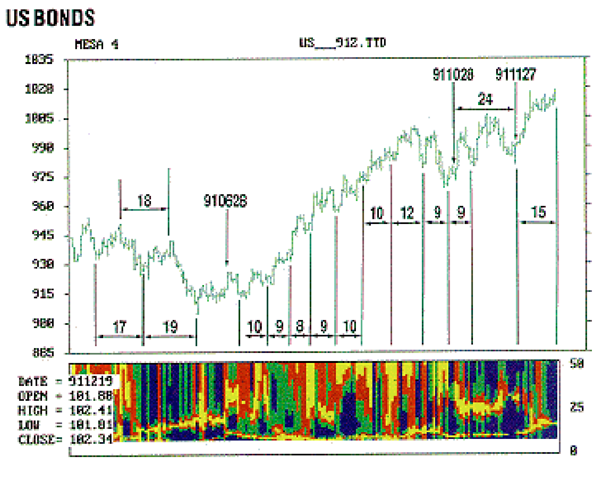

**FIGURE 4:** The 20-day cycle ended on June 28 and was replaced by a combination of a long cycle (greater than 50 days) and a shorter cycle (eight to 12 days). This can be observed by the combination of the yellow line along the bottom of the chart, with the yellow appearing along the top of the chart.

The 20-day cycle ended abruptly on June 28, 1991, and was replaced by the eight- to 12-day shorter cycles. These short cycles occurred simultaneously with the lower amplitude long cycles while bonds were in the long uptrend. One way of identifying an uptrend with spectral analysis is to have energy in the very long cycles. During a long span of the uptrend, the spectrum display showed the dominant cycle to be much longer than 50 days. Excellent entry points during the uptrend were predicted by knowing the last short-term lowest low and that the eight- to 12-day cycle persisted. Various entry points along the trend are indicated, computed as the current cycle length from the previous entry point.

The uptrend was arrested when a relatively strong 24-day cycle appeared on October 25, 1991. The 24-day cycle coexisted with the nine-day cycle for a while. The 24-day cycle also gave some good predictive entries: for example, between October 25 and November 27, 1991, as shown. After November 27, 1991, the 24-day cycle almost disappeared and the length of the vestigial remains decreased rapidly. Simultaneously, the length of the 10-day cycle increased to about 15 days. The two cycle lengths almost appear to coalesce to form a single solid dominant cycle. In any case, the dominant cycle length at the end of the contract is approximately 15 days after the previous cyclic low, implying that it is time to go long by measuring from the last lowest low. To do this you must roll over to the March 1992 contract. As it turned out, this was immediately prior to the Fed action and a long position would have turned out to be profitable.

> Traditionally, bonds seem to have a 10- to 12-day cycle personality.

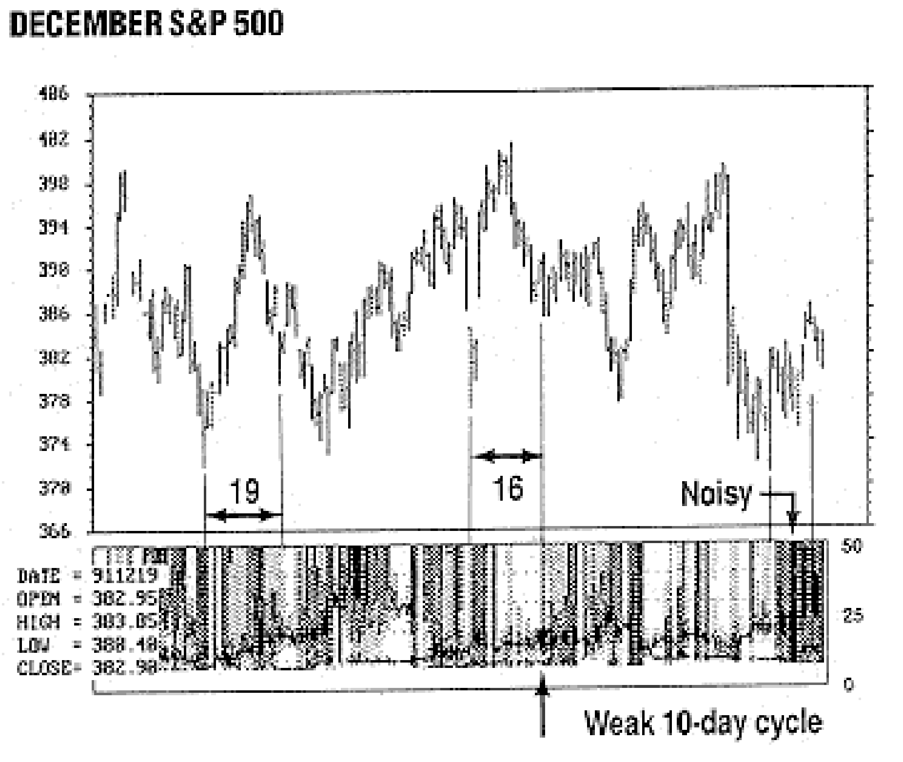

**FIGURE 5:** The stronger cycle varied from 16 to 30 days over the year for the S&P 500 December futures contract. During the latter part of the year, a multitude of cycles was present.

Figure 5 displays the December Standard & Poor's 500 contract. The S&P 500 has a cyclic personality clearly different from Treasury bonds. The stronger cycle varied from 16 to 30 days over the year. Although the 10-day cycle was present much of the time, its amplitude was relatively small. One of the more striking aspects of the S&P 500 cyclic contour is that high energy is spread across the spectrum for the last 13 days. One definition of noise is having energy at all frequencies. Therefore, the cyclic analysis is noisy for the last 13 days and so we can glean no predictive insight on the basis of cycle analysis. The situation was similar but less severe in July when the major turning point was reached.

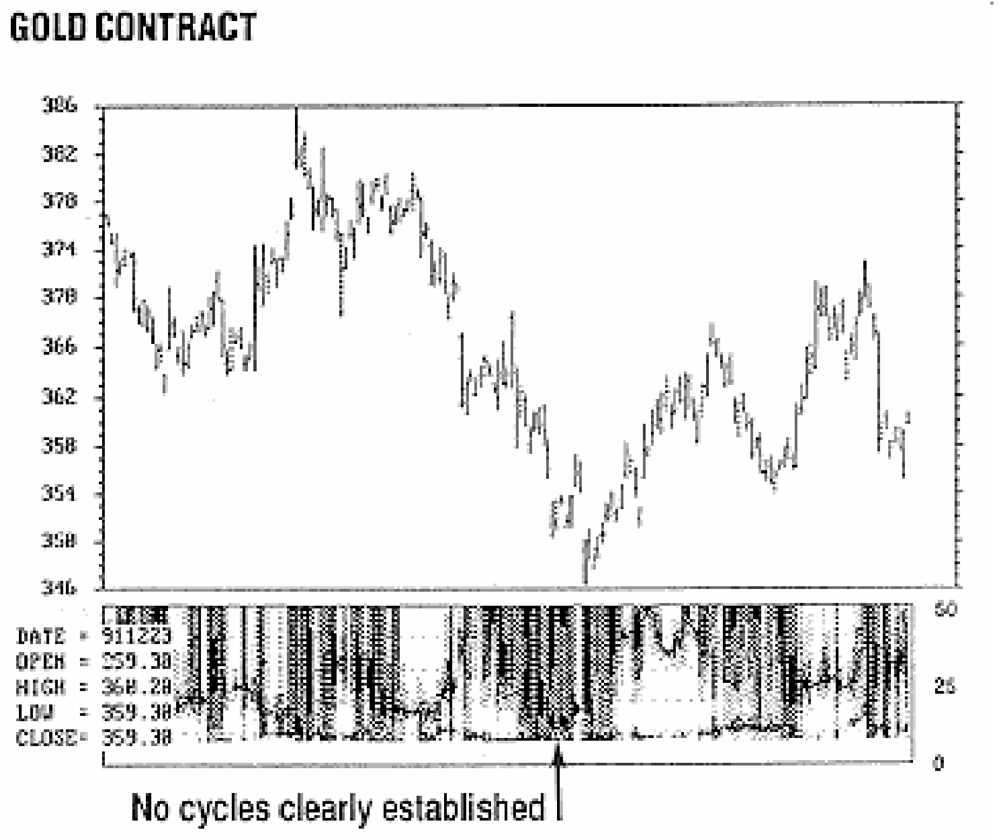

**FIGURE 6:** Gold did not show any clearly established cycles present.

Figure 6 suggests that gold contracts were difficult to trade on the basis of cycles during the year. The dominant cycle length seemed to be constantly in transition, so that the data were rarely stationary.

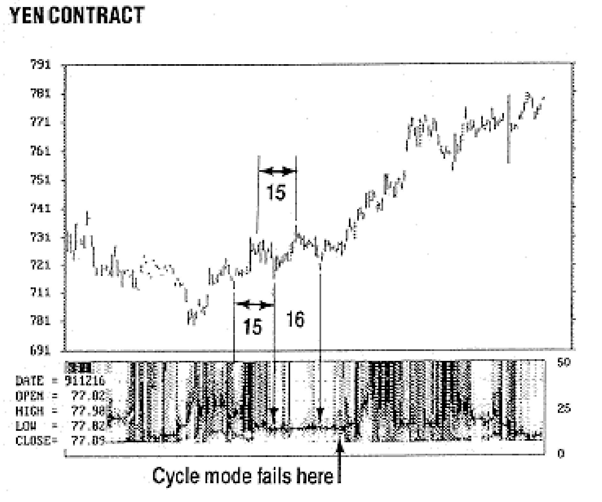

**FIGURE 7:** The yen had a 15-day cycle present during August, as indicated by the single line. However, this appearance of the cycle did not last very long.

Figure 7 shows that the 15-day cycle for the yen contract in August 1991 gave some excellent buy and sell signals by referencing previous lowest lows and highest highs. In contrast, curiously, the Deutschemark, shown in Figure 8, would have been nearly impossible to trade on the basis of cycles during the same time span. The Deutschemark also had a consistent 12-day cycle that could have provided excellent entry points along the trend. It is possible the actions of all contracts in a group, such as currencies, do not necessarily behave in a correlated way.

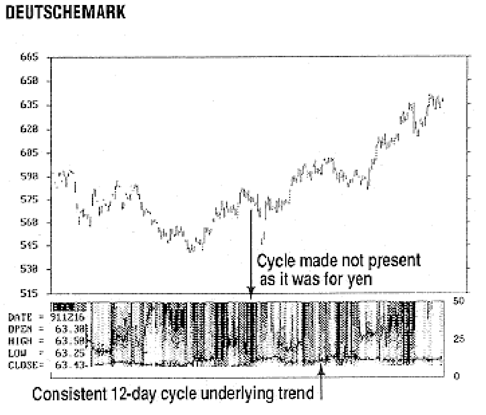

**FIGURE 8:** The Deutschemark did not have the same cycle during August that the yen had. There was a fairly consistent 12-day cycle underlying the trend.

On the other hand, the meat group is difficult to trade on the basis of cycles. Figure 9 shows the cycles pertaining to live cattle. A distinctive cycle appears to occur only rarely, and broad-band noise dominates the spectral contour display. From the cycle perspective, live hogs, shown in Figure 10, is even worse. A cyclic personality doesn't seem to exist.

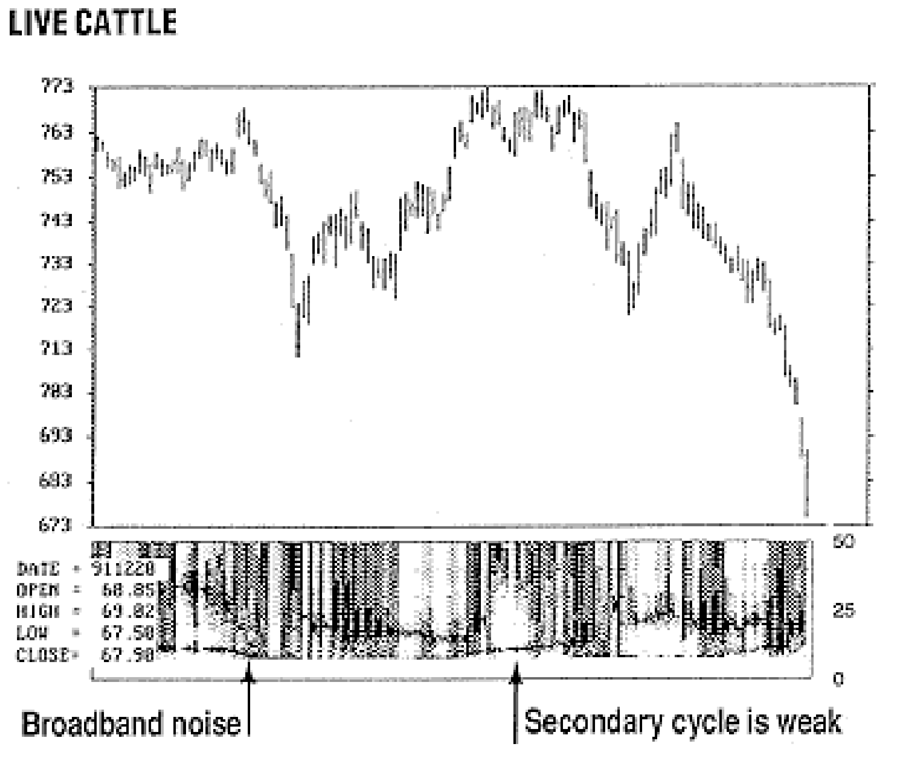

**FIGURE 9:** Live cattle rarely has a distinctive cycle. Broadband noise dominates the display.

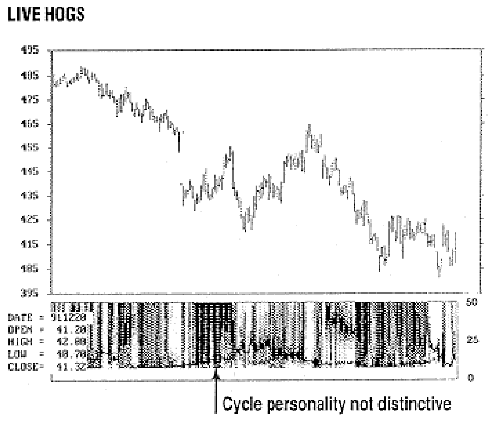

**FIGURE 10:** The live hog contract does not appear to have any cyclical personality of less than 50 days.

Cocoa, shown in Figure 11, appears to have a schizophrenic cyclic personality. In April through July, during the downtrend, the cocoa contract had a relatively consistent 12- to 14-day cycle. The consistent cycle enabled profitable short selling between the successive highest highs. When the trend turned up, the cycle length approximately doubled. The doubled cycle length was relatively noisy and faded to a very noisy spectrum. Over the last several months, the longer cycle was discernable but its exact cycle length was poorly defined.

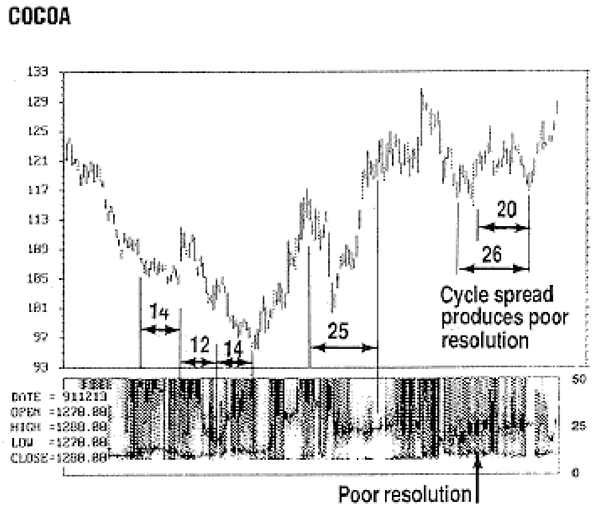

**FIGURE 11:** Cocoa had a 12- to 14-day cycle in April through July, but when the trend turned up the cycle length approximately doubled.

> Wheat, shown in Figure 12, had a relatively strong 12-day cyclic component over the last four months during the uptrend.

Wheat, shown in Figure 12, had a relatively strong 12-day cyclic component over the last four months during the uptrend. Knowing the 12-day cycle existed, a trader could find and enter a good trend-following long position by counting from the last lowest low. The 12-day cycle faded in December, so the best strategy would have been to stand aside at that point unless you already had a long position and could let your profits run.

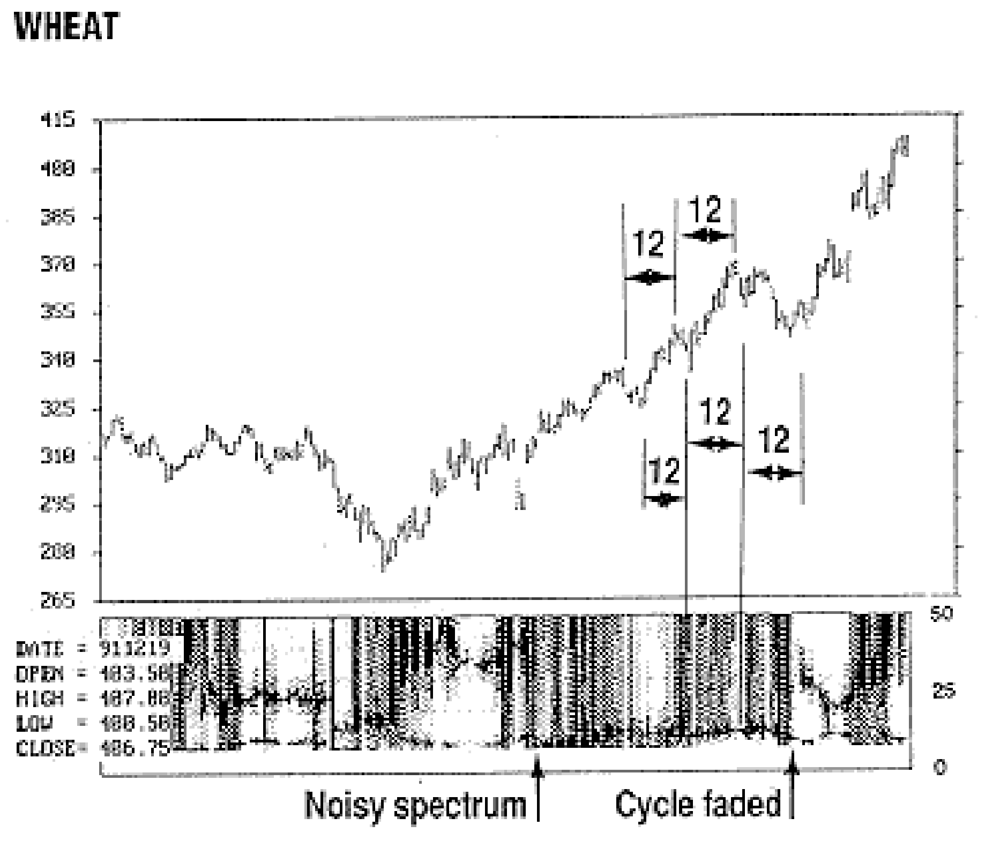

**FIGURE 12:** Wheat had a relatively strong 12-day cyclic component over the last four months of the uptrend.

## Conclusion

The measured 1991 cycle action and personalities are consistent with measurements made in previous years. The newest contribution to technical analysis is viewing cycle activity in a contour plot in synchronous time with the bar chart, allowing us to view the broad picture at a glance. We can then see the occurrence of a single, well-defined cycle; two cycles being present simultaneously; or when to make the best entry when the market is in a trend mode.

---

*John Ehlers, Box 1801, Goleta, CA 93116, (805) 969-6478, is an electrical engineer working in electronic research and development and has been a private trader since 1978. He is a pioneer in introducing maximum entropy spectrum analysis to technical trading through his MESA computer program.*

## Further Reading

- Ehlers, John F. [1989]. "Cyclic personalities," *Technical Analysis of Stocks & Commodities*, Volume 7: April.
- Ehlers, John F. [1990]. "1989 cycles," *Technical Analysis of Stocks & Commodities*, Volume 8: June.
- Ehlers, John F. [1991]. "Computing cyclic entries," *Technical Analysis of Stocks & Commodities*, Volume 9: July.

## BibTeX

```bibtex
@article{ehlers1992cycles,
  author    = {Ehlers, John F.},
  title     = {1991 Cycles},
  journal   = {Technical Analysis of Stocks \& Commodities},
  volume    = {10},
  number    = {4},
  pages     = {155--159},
  year      = {1992},
  month     = apr,
  url       = {https://technical.traders.com/archive/article.asp?file=\V10\C04\CYCLES.pdf}
}
```
