# Optimum Detrending

- **Author:** John F. Ehlers
- **Publication:** Technical Analysis of STOCKS & COMMODITIES, Volume 10, May 1992, pp. 201--207
- **Article URL:** [Article PDF](https://technical.traders.com/archive/article.asp?file=\V10\C05\OPTIMUM.pdf)

---

*Look at any price chart, and you'll find that markets move up and down even while in a trend. Removing the trend can help identify short-term turning points. Frequent STOCKS & COMMODITIES contributor John Ehlers presents different techniques for detrending prices and his optimized detrending method as well.*

We want to detrend data because we want to remove the longer-term variations so short-term turning points are easier to discern, enabling us to better pinpoint the best entry and exit points for short-term trades. Since the goal of detrending is separation of time variables, it is logical that we can optimize the calculation for our approach to the market. Short-term and long-term variations are synonymous with high frequency and low-frequency components, respectively. This is important because optimization is accomplished using modern digital filter theory. Using filters, we can readily separate the desired frequency components and discard the undesired frequency components. Short term and long term are relative to trading style. A 26-week cycle used by a stock trader is long term for a commodity trader using daily data, for example. Similarly, an intraday trader considers anything longer than several hours to be long term. The optimization we derive considers daily data, but the principles can be expanded for any trading situation.

Before we optimize detrending, let us review conventional detrending techniques for their comparative strengths and weaknesses.

## Conventional Detrending

At least three different detrending techniques can be commonly found: First, calculating the best-fitting straight line as the trendline and subtracting the trendline from the raw data; second, calculating a moving average as a trendline and subtracting that trendline from the raw data; and third, taking the difference of two data points separated in time.

The easiest way to calculate the best-fitting trendline is to draw a straight line between successive highest highs or lowest lows and then translate this line to the center of the data spread. The best-fitting straight line can also be calculated by linear regression, often desirable because nearby successive maxima cannot be clearly identified. But this calculation can have accuracy problems. The trendline of a perfect sine wave taken over one full cycle is exactly horizontal because the sine wave has as many points above zero as it does below zero. When we calculate the best-fitting straight line to a single sine wave cycle by linear regression, we get the result as seen in Figure 1. We would get the correct result if we took the span between successive peaks or valleys and would get the incorrect slope in the opposite direction if we took the span over the cycle with a 180-degree phase shift (Figure 2).

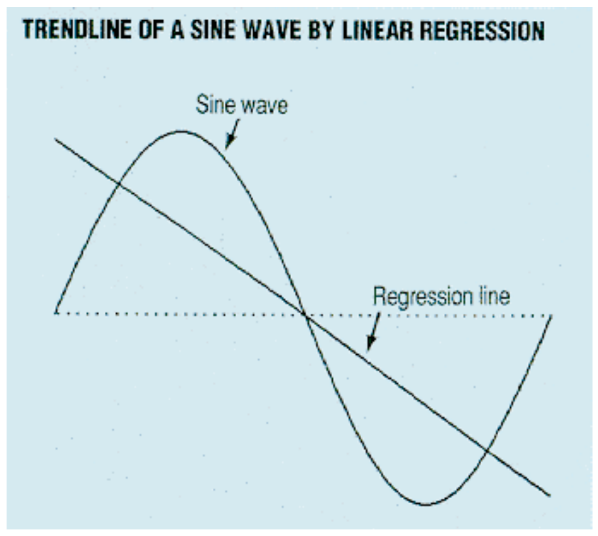
**FIGURE 1:** Calculating the best-fitting straight line to a sine wave using linear regression produces this trendline. The trend appears to be down because the peak was first and the trough second.

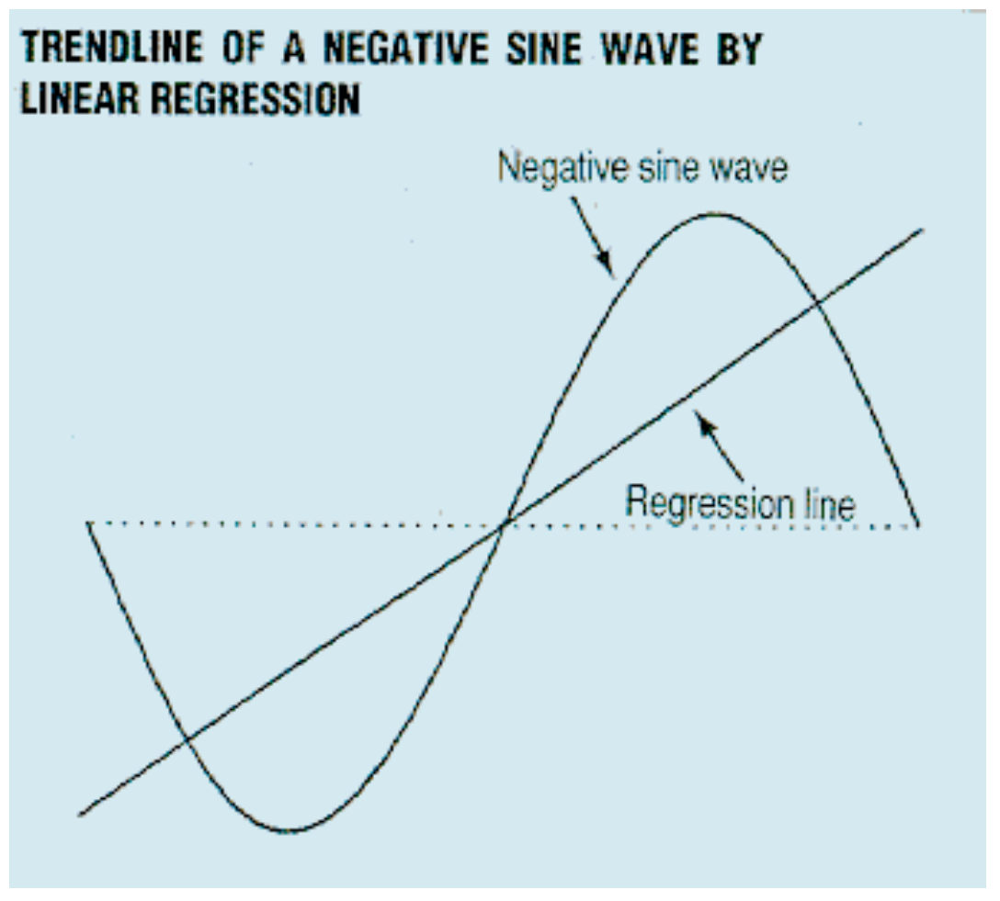
**FIGURE 2:** The slope of the trendline is up if the sine wave is shifted 180 degrees.

Linear regression calculations for the trendline are therefore subject to errors, depending on the phase of the cycle forming the short-term variation. The error can be reduced by performing the linear regression calculation over several cycles, but this has a unique set of problems because market data are seldom stationary over a span of several cycles. After all, if cycles were persistent, all traders could recognize their existence and trade them. This fact guarantees that cycles must ebb and flow as traders exploit the cycles when they recognize them. The net result is that the linear regression calculation of trendlines is flawed because the correct span of time is ambiguous. There is perhaps a better way.

The second way to calculate a trendline is to compute a moving average. The moving average smoothes the data, removing the short-term variations. In a sense, the moving average is a low-pass filter that allows the low-frequency (slowly varying) components to be retained but attenuates the high-frequency (faster-varying) components. The resulting trendline has only the low-frequency components of the data. The length of the moving average for the trendline calculation should be just the period of the dominant cycle in the data because a moving average of this length removes this cycle completely. Taken over the full period of a cycle, the average has as many points above zero as it does below zero so the full cycle average is zero, regardless of the starting phase angle of the full cycle average. Frequencies higher than the dominant cycle are also attenuated but not necessarily eliminated.

I often use averages taken over the dominant cycle without centering to represent the trendline, being fully aware of the impact of the time lag.

The moving average method of generating the trendline adapts to the current market conditions and attenuates the high frequency components. The data are detrended by subtracting the trendline from the total data to remove the low-frequency components in the detrended result. In equation form, this is:

$$\text{HighFrequency} = (\text{HighFrequency} + \text{LowFrequency}) - \text{LowFrequency}$$

This approach has a problem in that the moving average necessarily has a lag relative to the original price, which can be compensated for by centering the moving average value in the span over which it was calculated. Centering the moving average, while helpful for historical analysis, doesn't help with real trading because there is no trendline for the last half cycle if the moving average value is centered.

## Now Try This

The third way to detrend data is to take the difference of two data points separated in time. Figure 3 shows a sine wave superimposed on a trend and the resulting detrended sine wave when the difference is taken between successive samples. (This would be successive days, using daily data.) Note that the trend is not only eliminated but the detrended sine wave leads the original sine wave by 90 degrees; that is, the detrended sine wave is a momentum function. When the original sine wave is near its peak or valley, the rate of change is near zero. On the other hand, when the original sine wave is near the midpoint, the rate of change is maximum both in the positive and negative direction. The phase lead of the momentum function has some fascinating possibilities for the generation of "anticipate functions." In the real world, the high-frequency components are enhanced so much that the detrended data can appear to be "noisy" and intermediate-term turning points are lost. This problem can be alleviated by widening the spread between the data points. The noisiness can be reduced by smoothing (low-pass filtering), but the smoothing introduces a time lag that can eliminate the phase lead of the momentum function.

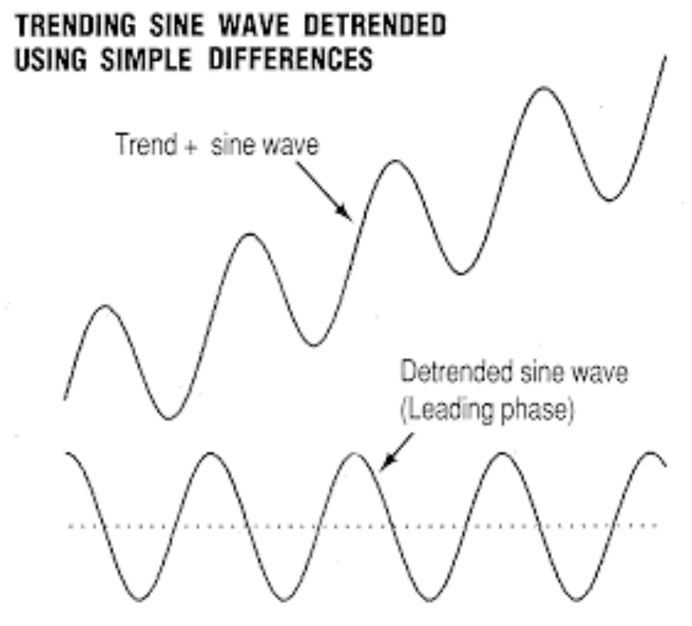
**FIGURE 3:** The top chart is a sine wave superimposed on a trend. The bottom chart is the detrended sine wave when the difference between successive samples is taken.

The mathematical equivalent of smoothing is to separate the differencing points in time. The trending price with the samples taken exactly a half cycle apart (lettered pairs) can be seen in Figure 4. The difference between points A at the midpoint of the cycle is the value of the trend slope. The difference between points B is the same trend slope value plus the peak-to-peak swing of the sine wave. The resulting detrended sine wave has a constant offset from zero equal to the trend slope. Although the slope of the detrended sine wave is zero, the offset can introduce problems for further analysis. For one, the slope isn't exactly constant in the real world; a slowly varying trendline appears as a low frequency in the detrended price, and we have not fully attained our goal of eliminating the low-frequency components.

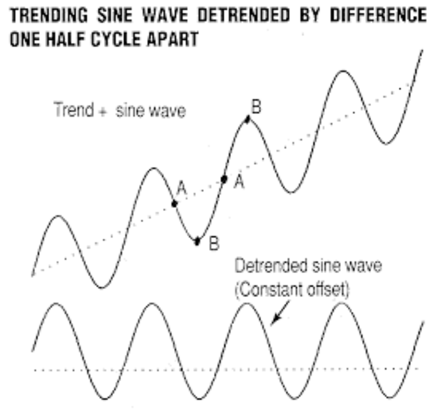
**FIGURE 4:** A sine wave superimposed upon a trend is smoothed by taking samples a half cycle apart. The difference between the two As is the slope of the trend. The difference between the two Bs is the same trend slope plus the peak-to-peak swing of the sine wave.

Another problem that arises from separating the differencing points is that the high-frequency components are also not eliminated. Consider Figure 5, where a frequency and its third harmonic are overlaid. The difference between the peak and valley is the same for both sine waves, so the conclusion is that extraneous high-frequency components are not attenuated by the differencing. Of the three conventional detrending methods, differencing has the most potential for optimization. Little can be done to change either method for computing the trendline, but more complex differences can be combined with low-pass filtering to optimize the detrending calculation.

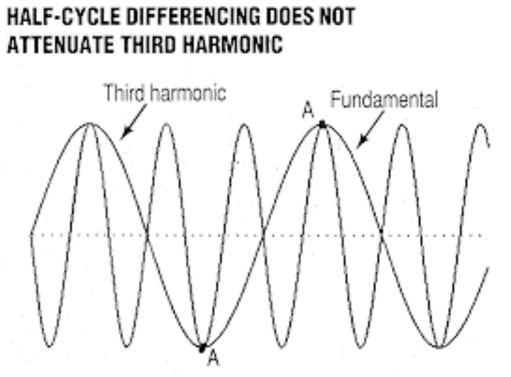
**FIGURE 5:** Two sine waves are overlaid. The second sine wave is the third harmonic of the first. The difference between the peak and valley is the same for both sine waves, and consequently, the extraneous high-frequency components are not attenuated by differencing.

## Optimum Detrending

The basic idea of optimum detrending is to take the difference of one group of data points from another group. Weighting factors are given to each data point in both groups, with the result being similar to a low-pass filter. This eliminates the undesired high-frequency components. The difference function itself eliminates the very low-frequency components. The constant offset caused by the separation of the data groups is minimal if the separation between the two data groups is less than a half cycle. Finally, the phase lead produced by the differencing momentum is balanced by the phase lag of the low-pass filter, with the result that the detrended function is substantially in phase with the original price function. For the more mathematically inclined, R.W. Hamming describes differencing filters in detail in *Digital Filters*.

Meanwhile, sampling theory states that we must have at least two samples of the highest frequencies we wish to analyze. There is no restriction on the lower frequencies or the maximum number of samples per cycle. Using daily data, our sampling rate is once per day. Therefore, the shortest cycle we can analyze is a two-day cycle, one having a frequency of 0.5 cycles per day. Frequency is the reciprocal of the cycle period. For example, the frequency of an eight-day cycle is 0.125 cycles per day.

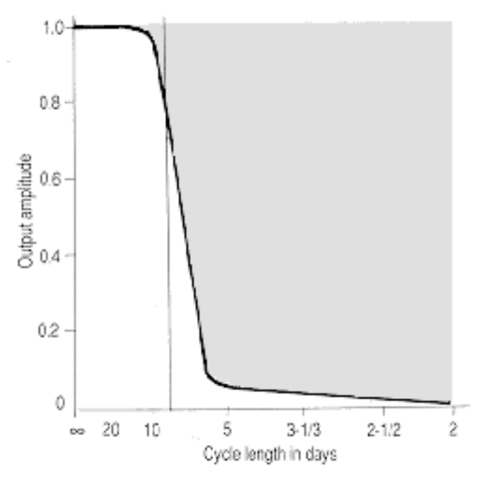
**FIGURE 6:** A low-pass filter with an eight-day cycle cutoff will have little if any effect on cycles greater than eight days. Cycles shorter than eight days are blocked from passing.

Figure 6 shows the transfer response of an ideal low-pass filter. Frequencies below 0.125 cycles per day (longer than an eight-day cycle) are allowed to pass through the filter with very little, if any, attenuation. However, frequencies above 0.125 cycles per day are blocked from passing. Experience suggests that cycles having periods ranging between eight and 32 days are useful for trading with daily data. Weekly data can be used to trade longer cycles, enabling the same filtering theory to be used without modification for cycle lengths varying from eight weeks to 32 weeks. Similarly, intraday traders can use the theory unmodified to trade cycles between eight hours and 32 hours using hourly data.

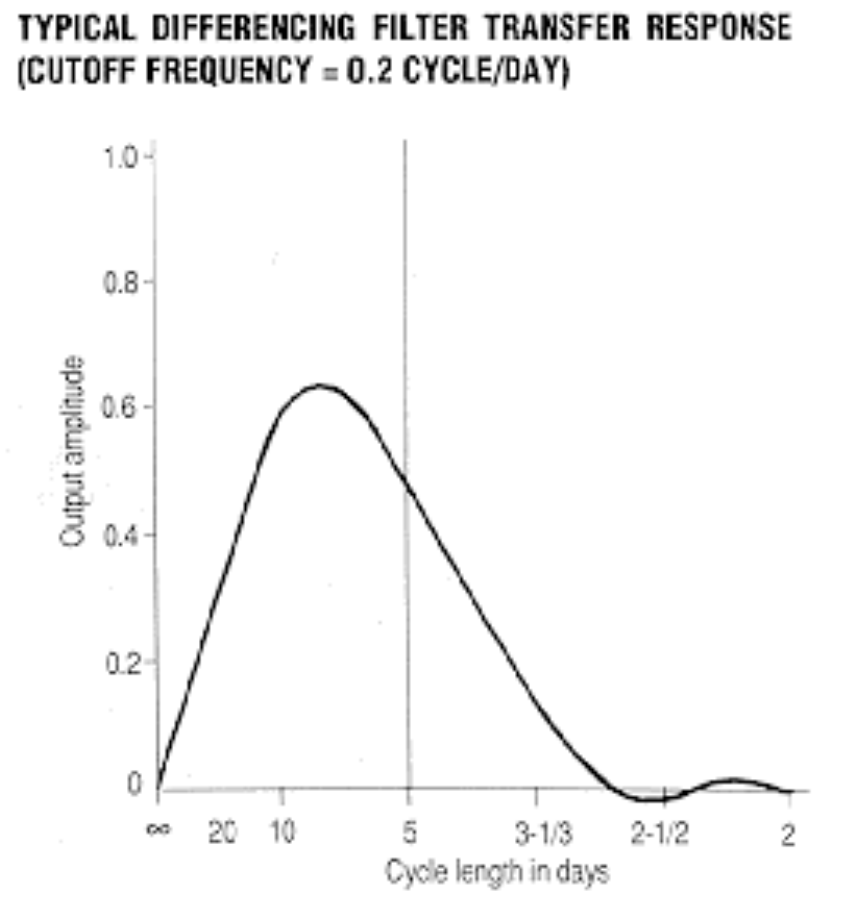
**FIGURE 7:** An optimized detrender (differencing filter) using a cutoff frequency of 0.2 cycles per day will eliminate low-frequency trending components while attenuating the very high frequency, often noisy, components.

Figure 7 is the transfer response of a typical optimized detrender (differencing filter). Zero frequency is just a constant value in the original price data. This constant value is completely eliminated when the difference between two balanced groups of data points is taken. The amplitude of the transfer response increases almost linearly as the input data frequency increases because of the imbalance of the value between the two weighted groups of data. The transfer response increases until a cutoff frequency, a frequency we can select, is reached. I choose the cutoff frequency to be the dominant cycle present in the data. Above the cutoff frequency, the weighted data values perform as a low-pass filter, attenuating the higher-frequency components in the data.

The optimized detrender differencing filter fully accomplishes our goals. It eliminates the very low frequency trending components. It attenuates the very high frequency, often noisy, components. Those frequency components that pass through the differencing filter are just those that have the tradable short-term variations that we wanted to isolate. By careful selection of the filter parameters, the detrended data will be almost exactly in phase with its unfiltered counterpart.

## Design Particulars

The filter cutoff frequency, $F_c$, should be the reciprocal of the dominant cycle period to be traded. The number of data points in each group, $N$, is the integer number of points in a half cycle of the dominant cycle, so $N=8$ for a 16-day dominant cycle. I round downward, so $N=7$ for a 15-day dominant cycle.

The formula for calculating the weighting factors is a function of $k$ and is written $B(k)$. The weighting factors, $B(k)$, are symmetrical relative to the center point; $k$ is the counting number, starting from the center. The weighting factor of the center point is always zero. The filter weighting factors are calculated as:

$$B(k) = \left(\frac{\sin(2\pi k F_c)}{k^2} - \frac{2\pi F_c}{k} \cos(2\pi k F_c)\right) \cdot \frac{\sin(\pi k / N)}{\pi k / N}$$

where:
- SIN and COS functions are computed in radians
- $\pi = 3.1415926$
- $F_c$ = cutoff frequency
- $N = \text{INT}(\text{DominantCycle} / 2)$
- $k$ = counting number

The last data point in the group, $B(N)$, is always zero. The $B(k)$ to the right of center (the most recent data points) have positive values and the $B(k)$ to the left of center (more distant data points) have negative values. The difference filter output is calculated by multiplying each successive data point by its associated weighting factor, $B(k)$. All the weighted data points are summed to get the detrended value.

Due to symmetry, it is easiest to calculate the $B(k)$ weighting factors relative to the center of the filter. However, for traders, the most significant data point is the most recent data. I locate the last $B(k)$ having a finite value as the multiplier for the most recent data point and map the $B(k)$ weighting values backward. (See sidebar, "Optimum detrending spreadsheet example.") When we do this, the filter output is skewed from the center of the filter. This is approximately what we desire, because the leading property of the momentum function just about compensates for the skew-induced lag. As a result, the optimum detrended price is just about in phase with the short-term price variation in the unfiltered data.

## Proof Is In The Pudding

One of the best ways to demonstrate the benefits of optimum detrending is with an example using data. Figure 8 indicates that December 1991 Treasury bonds had a decided uptrend between June 7, 1991, and October 1, 1991. This range is expanded to the full span of Figures 9 through 11 to show the detrended signals better. The detrended signals in Figures 9 through 11 are displayed using a normalized amplitude (equal scales) and are superimposed on the bar chart data for visual correlation. Further, during the time span of interest, Treasury bonds had a nominal 10-day dominant cycle.

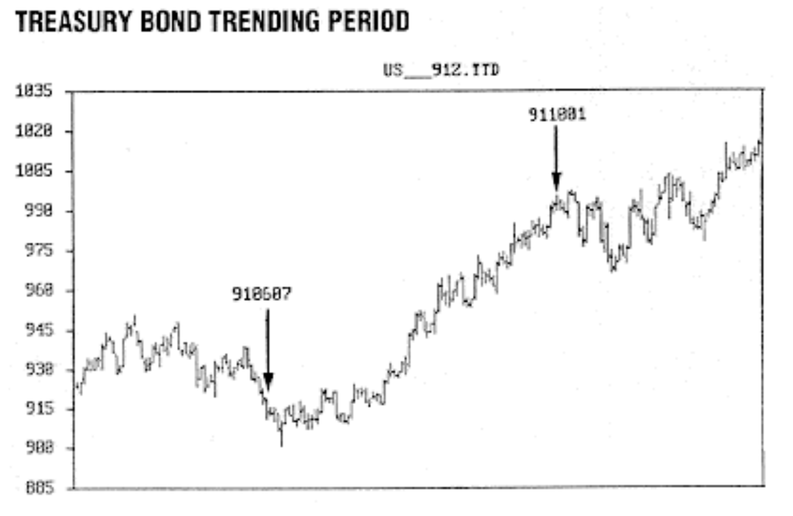
**FIGURE 8:** The December T-bond futures contract had a clear uptrend from June to October 1991.

Since the nominal dominant cycle was 10 days, the cutoff frequency was selected to be 0.1 cycles per day and $N$ was selected to be 5 for the calculation of the $B(k)$ filter weighting factors to compute the optimum detrended signal. The optimum detrended signal is shown on the bar chart in Figure 9. It was computed using the average of the high and low for each day as the price data. Note that the detrended signal is almost perfectly in sync with the cyclic component of the price. It would have been very profitable to make a long entry or increase your long position at each lowest turning point of the detrended signal. While you also could have traded short at each highest turning point, it may not be a good idea to trade against a strong trend. But these points can be used to reassess the value of your stop.

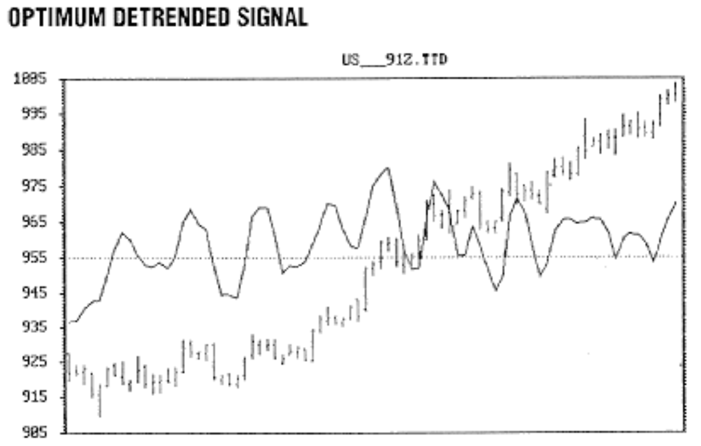
**FIGURE 9:** The optimum detrended signal using a 10-day cycle is overlaid on the chart of the bond contract. The detrended signal is in close sync with the cyclic component of the market.

Figure 10 shows the detrended signal computed as a simple difference (momentum) of the price. As we predicted, the turning point of the detrended signal often precedes the price turning point. The problem is that the high-frequency components have been accentuated to the point that it is difficult to discern the difference between the real turning points and the noise.

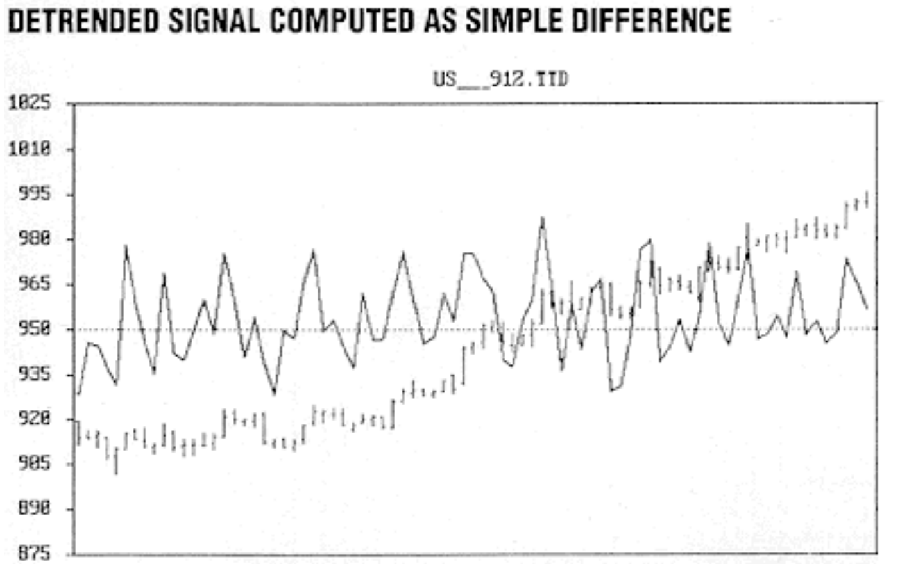
**FIGURE 10:** The detrended signal is computed as a simple difference of price. The high-frequency components are accentuated, which makes identifying real turning points and noise difficult.

The detrended signal of Figure 11 is found by computing the 10-day simple moving average (SMA) and subtracting the SMA from the price on a day-by-day basis. The moving average is not centered because if it were, we would have no quantitative way to find the detrended signal for the last five days. As a result, the moving average lag causes the detrended signal to have a constant offset from the center line. Also note that the detrended signal has much more high-frequency content (jaggedness) in comparison to the optimum detrended signal in Figure 9.

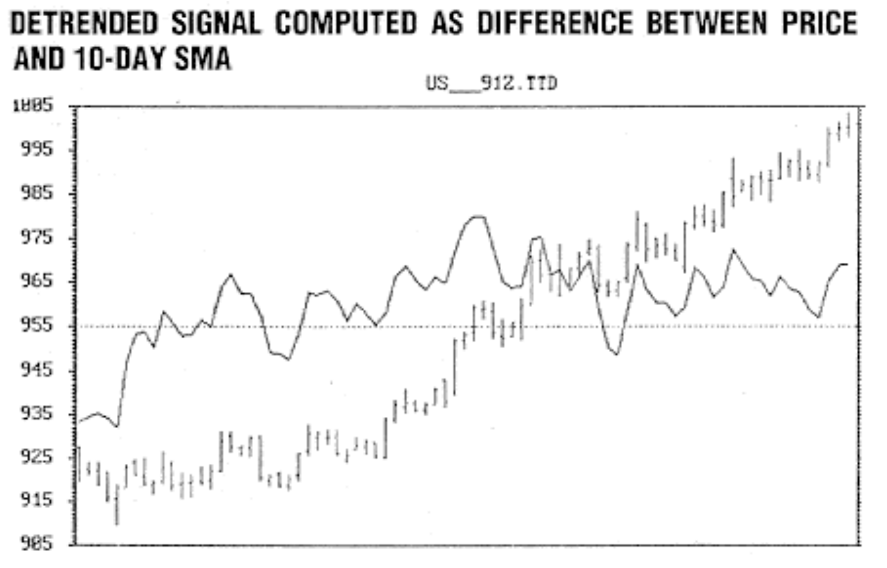
**FIGURE 11:** Plotting the difference between a 10-day SMA and the price on a day-by-day basis still has high-frequency content (jaggedness) complicating the task of identifying real turning points.

The benefits of using an optimum detrended signal are clear. More important, by knowing the mechanism of computing the optimized detrended signal, you can adapt the procedure in an intelligent way to improve your trading. You can use a cutoff frequency higher than the dominant cycle in the data. This will produce a leading signal, but at the cost of increased high frequency components producing potential false alarms. Since you recognize the trade-off, you can best fit the procedures to your trading style.

## Summary

An optimum detrending filter rejects the slowly varying trend, or low-frequency, components and the high-frequency noise-like data components. The resulting output emphasizes the cycle we desire to trade, making turning points more discernible.

The sample basis of the signal can be hourly, daily, weekly, and so forth with equal validity. All you need to know is the length of the dominant cycle to be traded. The dominant cycle can be determined by measuring the distance between successive lowest lows or highest highs by using a cycle finder in the popular toolbox computer programs or by directly measuring the dominant cycle in a more sophisticated program such as MESA. Knowing the dominant cycle, optimum detrending is mechanical, computing the weighting factors and summing the product of the weighting factors and the data points.

---

*John Ehlers, Box 1801, Goleta, CA 93116, (805) 969-6478, is an electrical engineer working in electronic research and development and has been a private trader since 1978. He is a pioneer in introducing maximum entropy spectrum analysis to technical trading through his MESA computer program.*

## Sidebar: Optimum Detrending Spreadsheet Example

The following is a spreadsheet example and QuickBasic source code for optimum detrending. The spreadsheet example is for detrending the price data of the bond market example used in Figure 9. The variables used are:

- $N = 10/2 = 5$
- $F_c = 0.1$
- $k$ ranges from $-4$ to $+4$
- $\pi = 3.1415926$

The weighting factors are set to be symmetrical about the center point, which is zero. The counter $k$ only ranges from $-4$ to $+4$, even though the nominal cycle in our example is 10 days because if $k = 5$ or $-5$ then $B(k) = 0$ because $\sin(\pi)/\pi = 0$. An additional weighting factor of 0 is unnecessary because multiplying by 0 results in 0 and does not contribute to the smoothing of the data.

In the Excel spreadsheet, column D lists the values for $k$ that are used in column E to calculate the weighting factors. The formula for cell E2 using $k = -4$:

```
=((SIN(2*PI()*-4*0.1)/16)-(2*PI()*0.1)*COS(2*PI()*-4*0.1)/-4)*(SIN(PI()*-4/5)/(PI()*-4/5))
```

Column C represents the detrended data. The original price data (column B) is multiplied by the weighting factors and then summed. The formula for cell C10 is:

```
=$E$10*B10+$E$9*B9+$E$8*B8+$E$7*B7+$E$6*B6+$E$5*B5+$E$4*B4+$E$3*B3+$E$2*B2
```

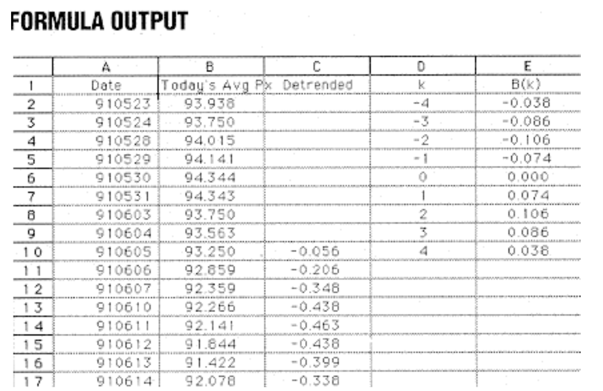
**SIDEBAR FIGURE 1:** This spreadsheet shows the output of the formulas for optimum detrending of the bond market. Column E is the weighting factors used to smooth and difference the price data in column B. Column C is detrended data.

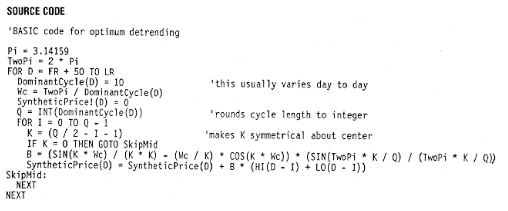
**SIDEBAR FIGURE 2:** Source code listing for optimum detrending.

```basic
'BASIC code for optimum detrending
Pi = 3.14159
TwoPi = 2 * Pi

FOR D = FR + 1 TO LR
    DominantCycle(D) = 10  'this usually varies day to day
    Wc = TwoPi / DominantCycle(D)
    SyntheticPrice(D) = 0
    Q = INT(DominantCycle(D))  'rounds cycle length to integer
    FOR I = 0 TO Q - 1
        K = (Q / 2 - 1 - I)  'makes K symmetrical about center
        IF K <> 0 THEN
            B = (SIN(K * Wc) / (K * K) - (Wc / K) * COS(K * Wc)) * (SIN(TwoPi * K / Q) / (TwoPi * K / Q))
            SyntheticPrice(D) = SyntheticPrice(D) + B * (HI(D - I) + LO(D - I)) / 2
        END IF
    NEXT
NEXT
```

## References

- Ehlers, John F. [1992]. "1991 cycles," STOCKS & COMMODITIES, April.
- Ehlers, John F. [1989]. "Leading indicators with momentum," Technical Analysis of STOCKS & COMMODITIES, Volume 7: September.
- Hamming, R.W. [1989]. *Digital Filters*, 3d ed., Prentice-Hall.
- Kaufman, Perry J. [1987]. *The New Commodity Trading Systems and Methods*, John Wiley & Sons.
- Murphy, John J. [1986]. *Technical Analysis of the Futures Markets*, New York Institute of Finance.

---

## BibTeX

```bibtex
@article{ehlers1992detrending,
  author  = {Ehlers, John F.},
  title   = {Optimum Detrending},
  journal = {Technical Analysis of STOCKS \& COMMODITIES},
  year    = {1992},
  volume  = {10},
  number  = {5},
  pages   = {201--207},
  url     = {https://technical.traders.com/archive/article.asp?file=\V10\C05\OPTIMUM.pdf}
}
```
