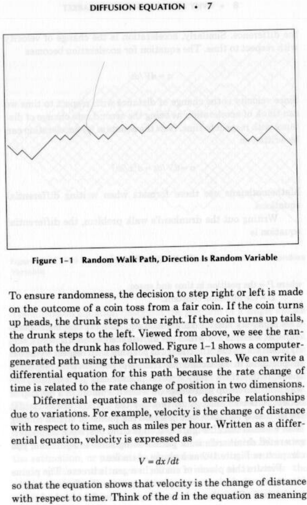
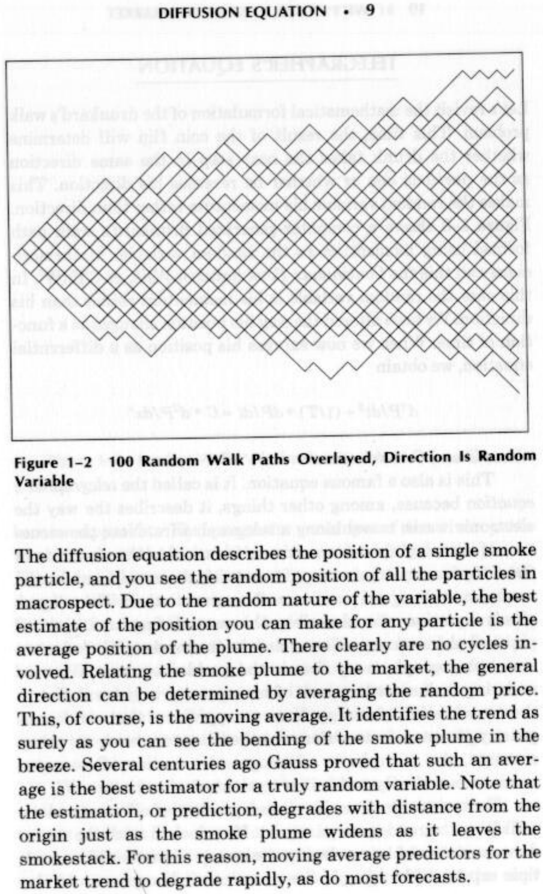
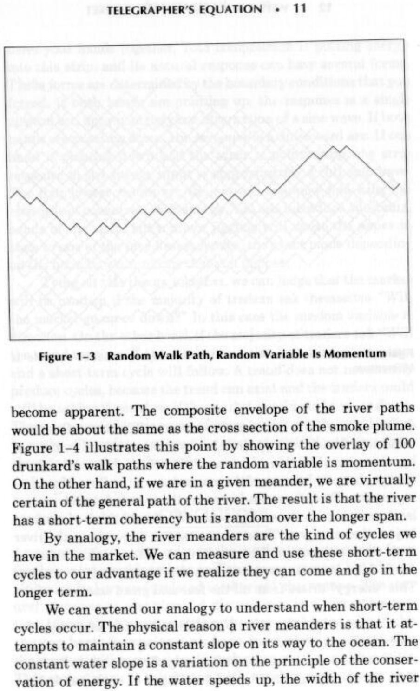
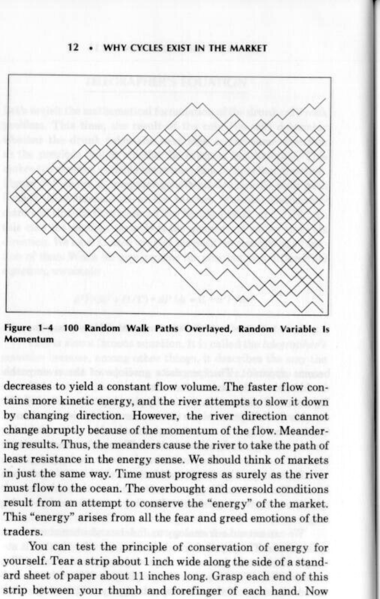

# WHY CYCLES EXIST IN THE MARKET

Technical analysis of the market is successful because the mar-
ket is not always efficient. Discernible events that occur in
chart patterns, such as double tops and Elliott waves, enable
trading to be guided by technical analysis. Cycles are one of
these discernible events that occur and are identifiable by di-
rect measurement. Identification of cycles does not take a life-
time of experience or an expert system. Cycles can be measured
directly, either by a simple system such as measuring the dis-
tance between successive lows or by a sophisticated computer
software program such as MESA.

The fact that cycles exist does not imply that they exist
all the time. Cycles come and go. External events sometimes
dominate and obscure existing cycles. Experience shows that
cycles useful for trading are present only about 15 to 30 percent
of the time. This corresponds remarkably with J. M. Hurst’s
statement that “23% of all price motion is oscillatory in nature
and semi-predictable.”' It is analogous to the problems of the

2 « WHY CYCLES EXIST IN THE MARKET

trend-follower, who finds that the markets “trend” only a
small percentage of the time.

HISTORICAL PERSPECTIVE

Cyclic recurring processes observed in natural phenomena by
humans since the earliest times have embedded the basic con-
cepts used in modern spectral estimation. Ancient civiliza-
tions were able to design calendars and time measures from
their observations of the periodicities in the length of day, the
length of the year, the seasonal changes, the phases of the
moon, and the motion of the planets and stars. Pythagoras
developed a relationship between the periodicity of musical
notes produced by a fixed tension string and a number repre-
senting the length of the string in the sixth century B.c. He
believed that the essence of harmony was inherent in the num-
bers. Pythagoras extended the relationship to describe the har-
monic motion of heavenly bodies, describing the motion as the
“music of the spheres.”

Sir Isaac Newton provided the mathematical basis for mod-
ern spectral analysis. In the seventeenth century, he discovered
that sunlight passing through a glass prism expanded into a band
of many colors. He determined that each color represented a
particular wavelength of light and that the white light of the sun
contained all wavelengths. He invented the word spectrum as a
scientific term to describe the band of light colors.

Daniel Bournoulli developed the solution to the wave
equation for the vibrating musical string in 1738. Later, in
1822, the French Engineer Jean Baptiste Joseph Fourier ex-
tended the wave equation results by asserting that any function
could be represented as an infinite summation of sine and
cosine terms. The mathematics of such representation has be-
come known as harmonic analysis due to the harmonic rela-
tionship between the sine and cosine terms. Fourier transforms,

the frequency description of time domain events (and vice
versa) have been named in his honor.

Norbert Wiener provided the major turning point for the
theory of spectral analysis in 1930, when he published his clas-
sic paper “Generalized Harmonic Analysis.” Among his contri-
butions were precise statistical definitions of autocorrelation
and power spectral density for stationary random processes. The
use of Fourier transforms, rather than the Fourier series of tra-
ditional harmonic analysis, enabled Wiener to define spectra in
terms of a continuum of frequencies rather than as discrete
harmonic frequencies.

John Tukey is the pioneer of modern empirical spectral
analysis. In 1949 he provided the foundation for spectral esti-
mation using correlation estimates produced from finite time
sequences. Many of the terms of modern spectral estimation
(such as aliasing, windowing, prewhitening, tapering, smooth-
ing, and decimation) are attributed to Tukey. In 1965 he collab-
orated with Jim Cooley to describe an efficient algorithm for
digital computation of the Fourier transform. This fast Fourier
transform (FFT) unfortunately is not suitable for analysis of
market data, as we will develop in later chapters.

The work of John Burg was the prime impetus for the cur-
rent interest in high-resolution spectral estimation from limited
time sequences. He described his high-resolution spectral esti-
mate in terms of a maximum entropy formalism in his 1975
doctoral thesis and has been instrumental in the development of
modeling approaches to high-resolution spectral estimation,
Burg’s approach was initially applied to the geophysical explo-
ration for oil and gas through the analysis of seismic waves. The
approach is also applicable for technical market analysis because
it produces high-resolution spectral estimates using minimal
data. This is important because the short-term market cycles
are always shifting. Another benefit of the approach is that is
maximally responsive to the selected data length and is not sub-
ject to distortions due to end effects at the ends of the data. The

trading program, MESA, is an acronym for maximum entropy
spectral analysis.

WHAT IS A CYCLE?

The dictionary definition of a cycle is that it is “an interval or
space of time in which is completed one round of events or
phenomena that recur regularly and in the same sequence.”
In the market, we consider a classic cycle exists when the price
starts low, rises smoothly to a high over a length of time, and
then smoothly falls back to the original price over the same
length of time. The time required to complete the cycle is called
the period of the cycle or the cycle length.

Cycles certainly exist in the market. Many times they
are justified on the basis of fundamental considerations. The
clearest is the seasonal change for agricultural prices (lowest at
harvest), or the decline in real estate prices in the winter. Tele-
vision analysts are always talking about the rate of inflation
being “seasonally adjusted” by the government. But the sea-
sonal is a specific case of the cycle, always being 12 months.
Other fundamentals-related cycles can originate from the 18-
month cattle-breeding cycle or the monthly cold-storage report
on pork bellies.

Business cycles are not as clear, but they exist. Business
cycles vary with interest rates. The government sets objectives
for economic growth based on its ability to hold inflation to rea-
sonable levels. This growth is increased or decreased by adding or
withdrawing funds from the economy and by changing the rate at
which government lends money to banks. Easing of rates encour-
ages business; tightening of rates inhibits it. Inevitably this proc-
ess alternates, causing what we see as a business cycle. Although
in practice this cycle may repeat in the same number of years,
the exact repetition of the period is not necessary. The business
cycle is limited on the upside by the amount of growth the govern-
ment will allow (usually 3%) and on the downside by moderate

negative growth (about —-1%), which indicates a recession. The
range of the cycle from +3% to —1% is called its amplitude.

COMPONENTS OF THE MARKET

Statisticians and economists have identified four important
characteristics of price movement. All price forecasts and analy-
ses deal with each of these elements:

1. A trend, or a tendency to move in one direction for a speci-
fied time period.

2. A seasonal factor, a pattern related to the calendar.

3. Acycle (other than seasonal) that may exist due to govern-
ment action, the lag in starting up and winding down of
business, or crop estimate announcements.

4. Other unaccountable price movement, often called noise.

Since points 2 and 3 are both cycles, it is clear that cycles
are a significant and accepted part of all price movement.

When trading using cycles, one key question is the desired
time span of the trade. At one extreme, the 54-year Kondratieff
economic cycle (not without its critics) could be considered.
A cattle rancher might prefer the 18-month breeding cycle,
while a grain farmer probably hedges on the basis of the annual
harvest. Speculators often work over a short (sometimes very
short) time span.

Behavioral cycles in prices have been most popular in
Elliotts’ wave theory and more recently in the works of Gann.
But these methods have a large element of interpretation and
subjectivity.

Short-term cycles can exist even within the definition of
point 4, “noise.” A casual glance at almost any bar chart shows,
in retrospect, that short-term cycles ebb and flow. The ability to
isolate and use market phenomena, such as cycles, is related

to the awareness of its existence and the tools available. Many
forecasting methods were not practical until the computer be-
came popular. Now these methods can be used by nearly every-
one. The philosophical foundation for these short-term cycles is
derived from random walk theory and is developed so you will
feel more comfortable dealing with cycles within the constraints
of point 4.

RANDOM WALK

Randomness in the market results from a large number of
traders exercising their prerogatives with different motivations
of profit, loss, greed, fear, and entertainment; it is complicated
by different perspectives of time. Market movement can there-
fore be analyzed in terms of random variables. One such analy-
sis is the random walk. Imagine an atom of oxygen in a plastic
box containing nothing but air. The path of this atom is erratic
as it bounces from one molecule to another. Brownian motion is
used to describe the way the atom moves. Its path is described as
a three-dimensional random walk. Following such a random
walk, the position of that atom is just as likely to be at any one
location in that box as at any other.

Another form of the random walk is more appropriate for
describing the motion of the market. This form is a two-dimen-
sional random walk, called the “drunkard’s walk.” The two-
dimensional structure is appropriate for the market because the
prices can only go up or down in one dimension. The other
dimension, time, can only move forward. These are similar to
the way a drunkard’s walk is described.

DIFFUSION EQUATION

The drunkard’s walk is formulated by allowing the drunkard to
step to either the right or left randomly with each step forward.

*Figure 1-1 Random Walk Path, Direction Is Random Variable*

To ensure randomness, the decision to step right or left is made
on the outcome of a coin toss from a fair coin. If the coin turns
up heads, the drunk steps to the right. If the coin turns up tails,
the drunk steps to the left. Viewed from above, we see the ran-
dom path the drunk has followed. Figure 1-1 shows a computer-
generated path using the drunkard’s walk rules. We can write a
differential equation for this path because the rate change of
time is related to the rate change of position in two dimensions.

Differential equations are used to describe relationships
due to variations. For example, velocity is the change of distance
with respect to time, such as miles per hour. Written as a differ-
ential equation, velocity is expressed as

$$V =\frac{dx}{dt}$$

so that the equation shows that velocity is the change of distance
with respect to time. Think of the d in the equation as meaning

the difference. Similarly, acceleration is the change of velocity
with respect to time. The equation for acceleration becomes

$$a=\frac{dV}{dt}$$

Since velocity is the change of distance with respect to time we
can think of acceleration as being the second rate change of dis-
tance with respect to time. Now the equation for acceleration can
be written as

$$a =\frac{dV}{dt} =d \cdot \frac{x}{dt}®$$

Mathematicians use these formats when writing differential
equations.

Writing out the drunkard’s walk problem, the differential
equation is

$$\frac{dP}{dt} = D + d \cdot \frac{P}{dx} \cdot $$

where P = the position in time and space
D =the diffusion constant.

This relatively famous differential equation (among mathemati-
cians, at least) is known as the diffusion equation. In words, this
equation states that the change of position with respect to time is
proportional to the second rate change of position with respect to
space. It describes many natural phenomena; for example, the
way heat travels up a silver spoon when it’s placed in a hot cup of
coffee. A better analogy to the way the market works is that
the diffusion equation can describe the plume of smoke coming
from a smokestack’. Figure 1-2 shows 100 overlayed computer-
generated drunkard’s walk paths. Using some imagination, you
can picture Figure 1-2 as a plume of smoke.

Picture this plume of smoke in a gentle breeze. The plume
is roughly conical, widening with greater distance from the
smokestack. The plume is bent in the direction of the breeze.

*Figure 1-2 100 Random Walk Paths Overlayed, Direction Is Random*

6
SSS
o2505
0505
sectetats
255
ne

Variable

The diffusion equation describes the position of a single smoke
particle, and you see the random position of all the particles in
macrospect. Due to the random nature of the variable, the best
estimate of the position you can make for any particle is the
average position of the plume. There clearly are no cycles in-
volved. Relating the smoke plume to the market, the general
direction can be determined by averaging the random price.
This, of course, is the moving average. It identifies the trend as
surely as you can see the bending of the smoke plume in the
breeze. Several centuries ago Gauss proved that such an aver-
age is the best estimator for a truly random variable. Note that
the estimation, or prediction, degrades with distance from the
origin just as the smoke plume widens as it leaves the
smokestack. For this reason, moving average predictors for the
market trend to degrade rapidly, as do most forecasts.

*Figure 1-3 shows a computer-generated drunkard’s walk path*

10 +» WHY CYCLES EXIST IN THE MARKET

TELEGRAPHER’S EQUATION

Let’s revisit the mathematical formulation of the drunkard’s walk
problem. This time, the result of the coin flip will determine
whether the drunk takes the next step in the same direction
as the previous one or whether he reverses his direction. This
makes the random variable his momentum rather than direction.
formed using momentum as the random variable. Mathemati-
cians call this the Continuous Time Random Walk, or CTRW°. In
this case the random variable is his momentum rather than his
direction. We have altered the way his position changes as a func-
tion of time. When we now express his position as a differential
equation, we obtain

$$d \cdot \frac{P}{dt} \cdot  + (\frac{1}{T})  \cdot  \frac{dP}{dt} =C  \cdot  d?\frac{P}{dx} \cdot $$

where 7' and C are constants.

This is also a famous equation. It is called the telegrapher’s
equation because, among other things, it describes the way the
electronic waves travel along a telegraph wire. Note the struc-
ture of the telegrapher’s equation is identical to the structure of
the diffusion equation except it contains the extra term for the
second rate change of position with respect to time. The telegra-
pher’s equation also describes the meandering of a river, a
physical phenomenon we can relate to the market. Viewed as an
aerial photograph, every river in the world meanders. This me-
andering is due not to a lack of homogeneity in the soil, but to
the conservation of energy. You can appreciate that soil homo-
geneity is not a factor because other streams, such as ocean
currents, also meander in a homogeneous medium. Ocean cur-
rents are not nearly as familiar to most of us as rivers.

Every meander in a river is independent of other meanders,
satisfying the random requirement. If we looked at all the mean-
ders as an ensemble, overlaying one on top of another like a mul-
tiple exposure photograph, the meander randomness would also

*Figure 1-3 Random Walk Path, Random Variable Is Momentum*

TELEGRAPHER’S EQUATION + 11

become apparent. The composite envelope of the river paths
would be about the same as the cross section of the smoke plume.
drunkard’s walk paths where the random variable is momentum.
On the other hand, if we are in a given meander, we are virtually
certain of the general path of the river. The result is that the river
has a short-term coherency but is random over the longer span.

By analogy, the river meanders are the kind of cycles we
have in the market. We can measure and use these short-term
cycles to our advantage if we realize they can come and go in the
longer term.

We can extend our analogy to understand when short-term
cycles occur. The physical reason a river meanders is that it at-
tempts to maintain a constant slope on its way to the ocean. The
constant water slope is a variation on the principle of the conser-
vation of energy. If the water speeds up, the width of the river

*Figure 1-4 100 Random Walk Paths Overlayed, Random Variable ts*

Momentum

decreases to yield a constant flow volume. The faster flow con-
tains more kinetic energy, and the river attempts to slow it down
by changing direction. However, the river direction cannot
change abruptly because of the momentum of the flow. Meander-
ing results. Thus, the meanders cause the river to take the path of
least resistance in the energy sense. We should think of markets
in just the same way. Time must progress as surely as the river
must flow to the ocean. The overbought and oversold conditions
result from an attempt to conserve the “energy” of the market.
This “energy” arises from all the fear and greed emotions of the
traders.

You can test the principle of conservation of energy for
yourself, Tear a strip about 1 inch wide along the side of a stand-
ard sheet of paper about 11 inches long. Grasp each end of this
strip between your thumb and forefinger of each hand. Now

move your hands together. Your compression is putting energy
into this strip, and its natural response can have several forms.
These forms are determined by the boundary conditions that you
forced. If both hands are pointing up, the response is a single
upward arc, approximately one alternation of a sine wave. If both
hands are pointing down, the response is a downward arc. If one
hand is pointing down and the other is pointing up, the strip
response to the energy input is approximately a full sine wave.
The four lowest modes are the natural response following the
principle of conservation of energy. You can introduce additional
bends in the strip, but a minor jiggling will cause the paper to
snap to one of the four lowest modes, the exact mode depending
on the boundary conditions that you impose.

Tying all this theory together, we can judge that the market
will be random if the majority of traders ask themselves “Will
the market go up or down?” In this case the random variable is
direction. On the other hand, if the majority of traders ask “Will
the trend continue?” the random variable is market momentum
and a short-term cycle will follow. A trend does not necessarily
produce cycles, because the trend can exist and the traders could
still be asking themselves if the market is going to be up or down.
There is no reliable measure of mass trader psychology leading
to cycles. Therefore, we must be content with identifying these
short-term cycles as they arise.

CONCLUSIONS

Arguments that cycles exist in the market arise not only from
fundamental considerations or direct measurement but also on
philosophical grounds related to physical phenomena. The nat-
ural response to any physical disturbance is a corrective mo-
tion. If you pluck a guitar string, the string vibrates with cycles
you can hear. By analogy, we have every right to expect that
the market will respond to disturbances with a cyclic motion.
This expectation is reinforced with random walk theory that

suggests there are times the market prices can be described by
the diffusion equation and other times when the market prices
can be described by the telegrapher’s equation.

The challenge for technical traders is to recognize when the
short-term cycles are present and to trade them in a logical and
consistent manner so these cycles can contribute profitably to
the bottom line.

In the chapters that follow I will define the basics of cycles
and how to manipulate them to tune the momentum and moving
average functions—components of every technical trading indi-
cator. Cycle primitives will even be related to traditional chart-
ing patterns, perhaps giving these patterns a whole new meaning
to you. Perhaps most importantly, I will discuss when to use
cycles for trading and when to avoid their use.

2

CYCLE BASICS

The one thing on which market technicians agree is that the
market varies. Precisely how it varies is the matter of the con-
tinuous debate. Each of the technical trading techniques, from
classical chart patterns to Elliott’s wave, construct a simplified
model of the market. Each technique describes the market in
terms of the model parameters. The parameters are then ad-
justed to describe the current market conditions and further
used to extrapolate and predict future market activity. Cycle
analysis is no different.

Cycles are a simplified technical model of the market. The
model is at least as complex as most other models because sev-
eral cycles can coexist; cycles are often mixed with noise, and
all the cycles ebb and flow with time. The primitive component
of complex cycles is the sine wave. The sine wave is the natural
cycle primitive for several reasons:

1. The sine wave is the mathematically smoothest waveform
describing a cycle and harmonic motion.
