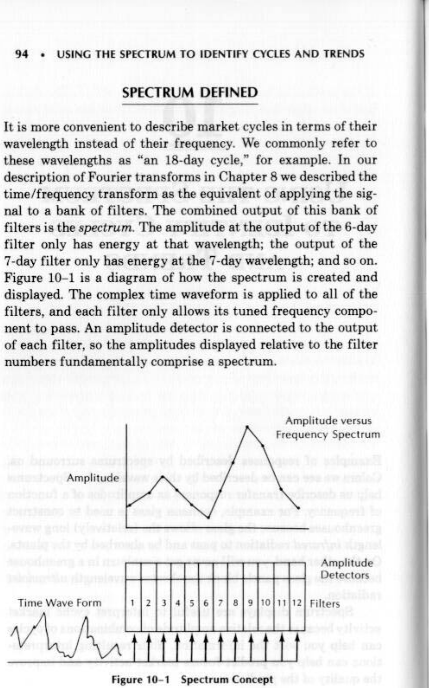
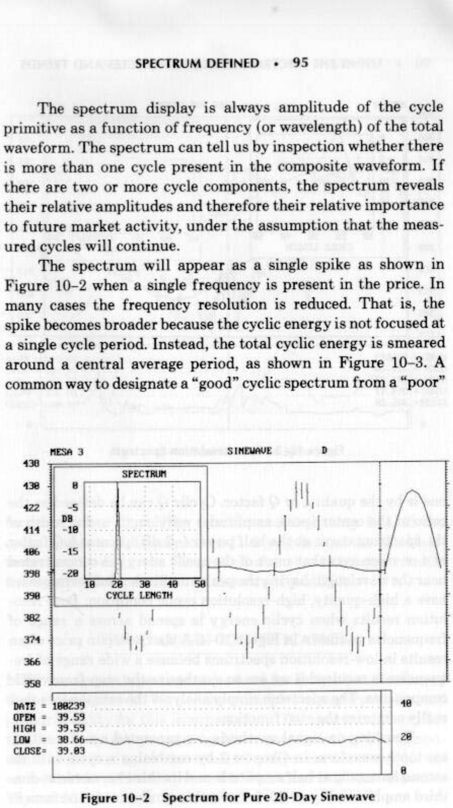
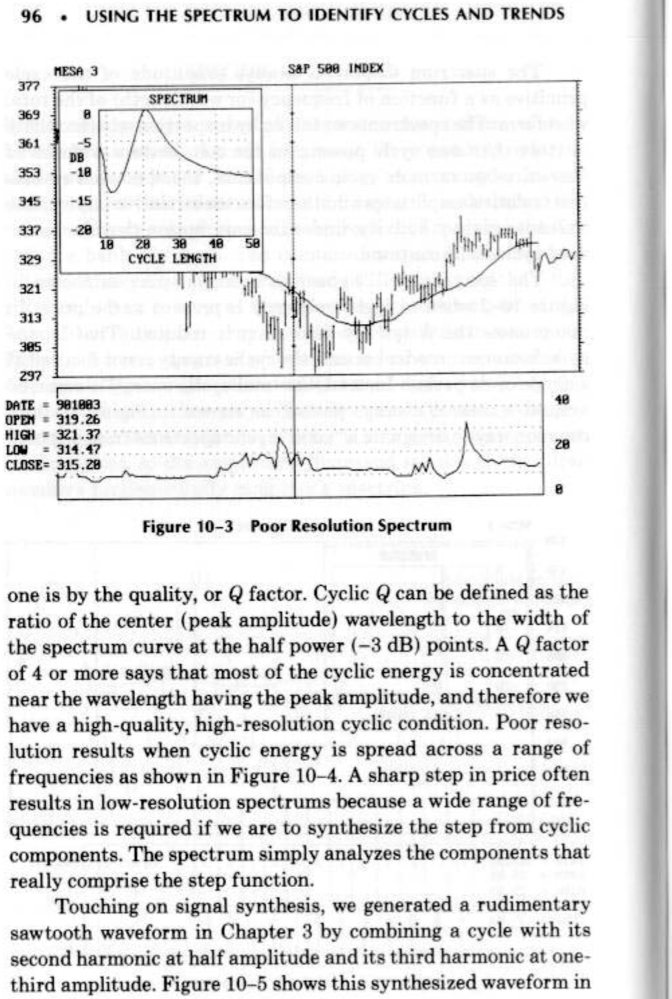
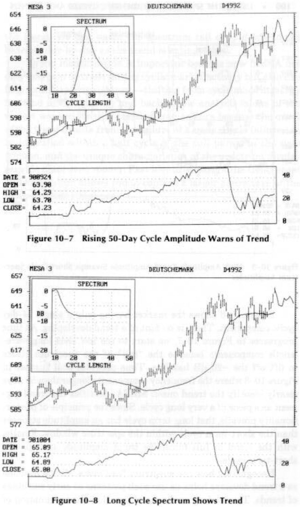
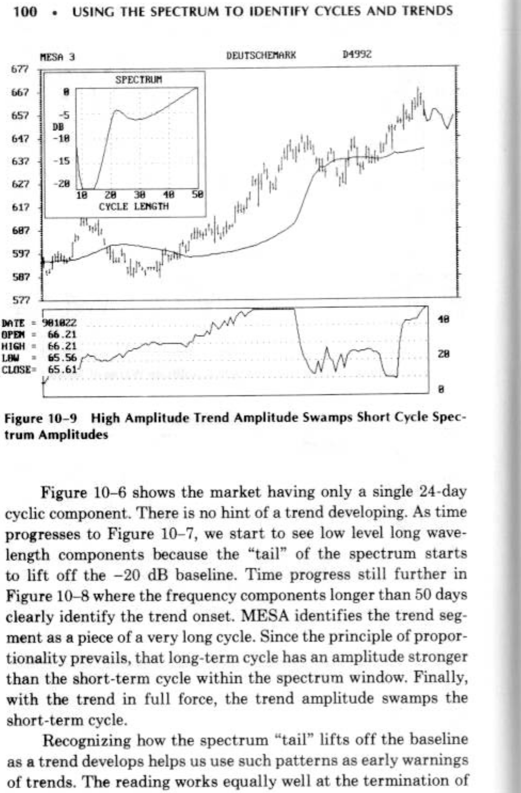

# USING THE SPECTRUM TO IDENTIFY CYCLES AND TRENDS

Examples of responses described by spectrums surround us.
Colors we see can be described by their wavelengths. Spectrums
help us describe transfer responses as amplitudes of a function
of frequency. For example, common glass is used to construct
greenhouses because the glass allows the (relatively) long wave-
length infrared radiation to pass and be absorbed by the plants.
On the other hand, you will never get a sunburn in a greenhouse
because the glass panels block the shorter wavelength ultraviolet
radiation.

Spectrum displays are useful to interpret cyclic market
activity because the relative amplitude of combinations of cycles
can help you sort the information. Your resulting interpreta-
tions can help you predict future market activity and improve
the quality of the predictions.

*Figure 10-1 is a diagram of how the spectrum is created and*

SPECTRUM DEFINED

It is more convenient to describe market cycles in terms of their
wavelength instead of their frequency. We commonly refer to
these wavelengths as “an 18-day cycle,” for example. In our
description of Fourier transforms in Chapter 8 we described the
time/frequency transform as the equivalent of applying the sig-
nal to a bank of filters. The combined output of this bank of
filters is the spectrum. The amplitude at the output of the 6-day
filter only has energy at that wavelength; the output of the
7-day filter only has energy at the 7-day wavelength; and so on.
displayed. The complex time waveform is applied to all of the
filters, and each filter only allows its tuned frequency compo-
nent to pass. An amplitude detector is connected to the output
of each filter, so the amplitudes displayed relative to the filter
numbers fundamentally comprise a spectrum.

Amplitude versus
Frequency Spectrum

Amplitude

Amplitude
i ud ink Sh Lal Ppt bv fa Detectors
Time Wave Form PPE PE Pepe Filters

VAM,

*Figure 10-2 when a single frequency is present in the price. In*

The spectrum display is always amplitude of the cycle
primitive as a function of frequency (or wavelength) of the total
waveform. The spectrum can tell us by inspection whether there
is more than one cycle present in the composite waveform. If
there are two or more cycle components, the spectrum reveals
their relative amplitudes and therefore their relative importance
to future market activity, under the assumption that the meas-
ured cycles will continue.

The spectrum will appear as a single spike as shown in
many cases the frequency resolution is reduced. That is, the
spike becomes broader because the cyclic energy is not focused at
a single cycle period. Instead, the total cyclic energy is smeared
around a central average period, as shown in Figure 10-3. A
common way to designate a “good” cyclic spectrum from a “poor”

8 8 8

7
=

a

486

398

398

382

a4

366

358

DATE = 188239 48
OPEN = 39.59
HIGH = 39.59

low = ee 28
CLOSE= 39.83
rae a

*Figure 10-3 Poor Resolution Spectrum*

96 «+ USING THE SPECTRUM TO IDENTIFY CYCLES AND TRENDS

one is by the quality, or Q factor. Cyclic Q can be defined as the
ratio of the center (peak amplitude) wavelength to the width of
the spectrum curve at the half power (—3 dB) points. A Q factor
of 4 or more says that most of the cyclic energy is concentrated
near the wavelength having the peak amplitude, and therefore we
have a high-quality, high-resolution cyclic condition. Poor reso-
lution results when cyclic energy is spread across a range of
frequencies as shown in Figure 10-4. A sharp step in price often
results in low-resolution spectrums because a wide range of fre-
quencies is required if we are to synthesize the step from cyclic
components. The spectrum simply analyzes the components that
really comprise the step function.

Touching on signal synthesis, we generated a rudimentary
sawtooth waveform in Chapter 3 by combining a cycle with its
second harmonic at half amplitude and its third harmonic at one-
third amplitude. Figure 10-5 shows this synthesized waveform in

*Figure 10-4 Bad Resolution Spectrum*

MESA 3 S&P SB INDEX

press y REE RE REEES

terms of a bar chart. The fundamental frequency is a 42-day
cycle. The second harmonic is a 21-day cycle, and the third har-
monic is a 14-day cycle. Figure 10-5 also shows the spectrum for
this synthesized waveform, as measured by MESA.

TREND ONSET IDENTIFICATION

MESA-measured spectra can be used for early identification of
the onset of a trend. We use the principles of superposition and
proportionality for this interpretation. The spectrum identifies
the frequency components in the price, isolating the compo-
nents contributing to the trend. Perhaps the best way to de-
scribe the identification process is with an example, as shown in
Figures 10-6 through 10-9.

*Figure 10-6 Spetrum of 24-Day Cycle Before Trend Onset*

=
~
2

Sg gggRERGGES

B=
=
gee
“we

*Figure 10-8 Long Cycle Spectrum Shows Trend*

REG & &

3

tr ar

*Figure 10-9 High Amplitude Trend Amplitude Swamps Short Cycle Spec-*

MESA 3 DEUTSCHEMARK pags2

dil
A aa

hi

Ke

iiss"
4

trum Amplitudes

cyclic component. There is no hint of a trend developing. As time
progresses to Figure 10-7, we start to see low level long wave-
length components because the “tail” of the spectrum starts
to lift off the —20 dB baseline. Time progress still further in
clearly identify the trend onset. MESA identifies the trend seg-
ment as a piece of a very long cycle. Since the principle of propor-
tionality prevails, that long-term cycle has an amplitude stronger
than the short-term cycle within the spectrum window. Finally,
with the trend in full force, the trend amplitude swamps the
short-term cycle.

Recognizing how the spectrum “tail” lifts off the baseline
as a trend develops helps us use such patterns as early warnings
of trends. The reading works equally well at the termination of

the trend. We can watch the spectrum tail drop down to the
baseline day-by-day as the trend is extinguished.

Trend identification is important because now MESA not
only can help us trade during cyclic market activity but also can
help us set trading strategy—shifting from cycle mode strategy
to trend mode strategy and back. Cycle analysis is one of the
fastest ways to identify trend characteristics because the onset
of the trend results from the failure of a cycle. Cycle failure can
be identified within a half cycle of the full period in the time
domain, and the unique characteristics of the spectrum display
provide clues even sooner. Fast identification of the trend onset
and exhaustion allows you to capture a larger percentage of the
move without whipsaws.
