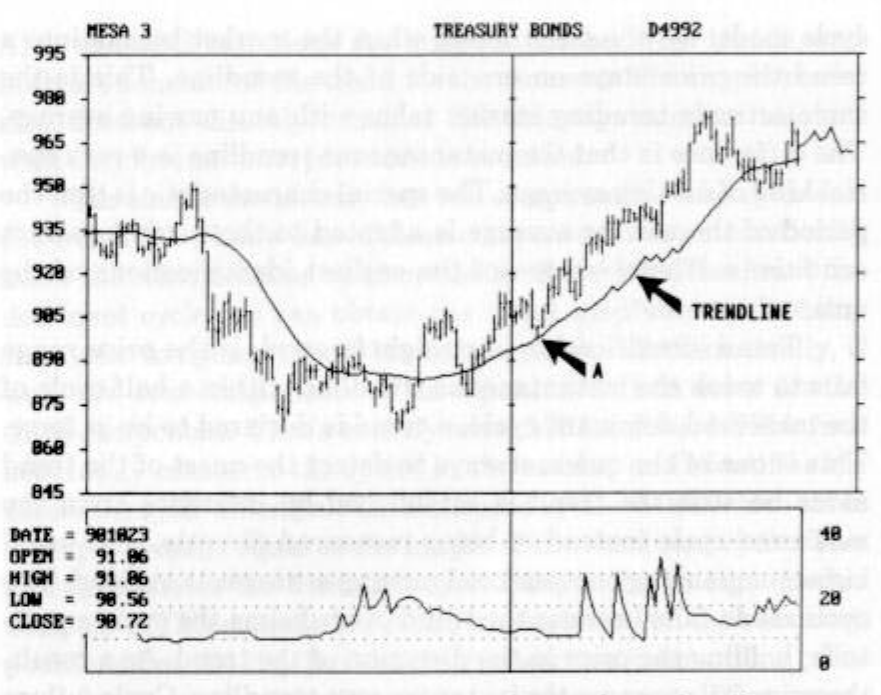
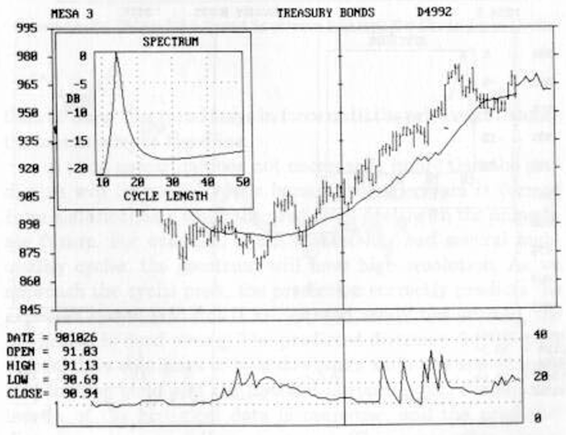
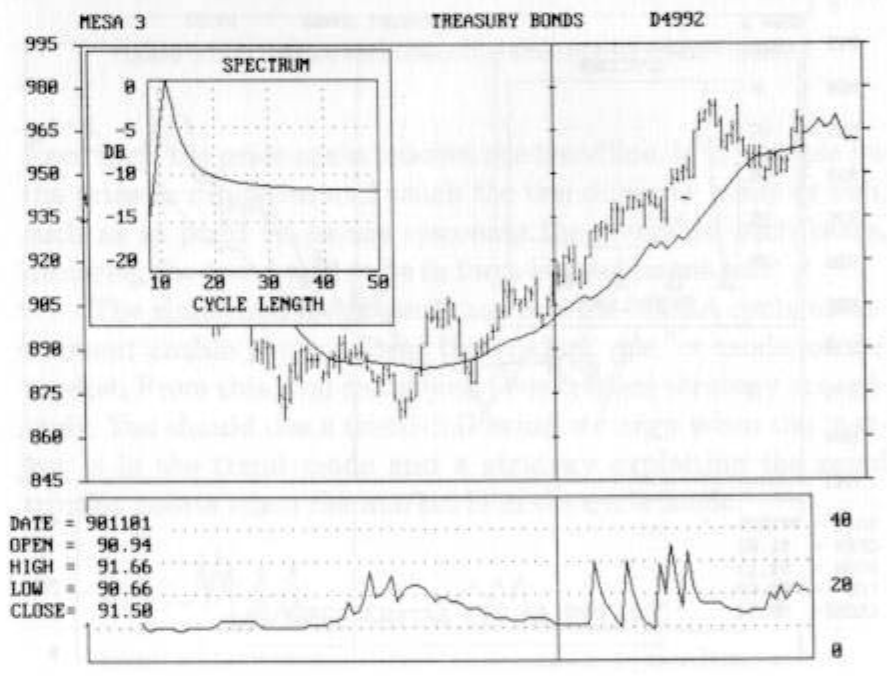
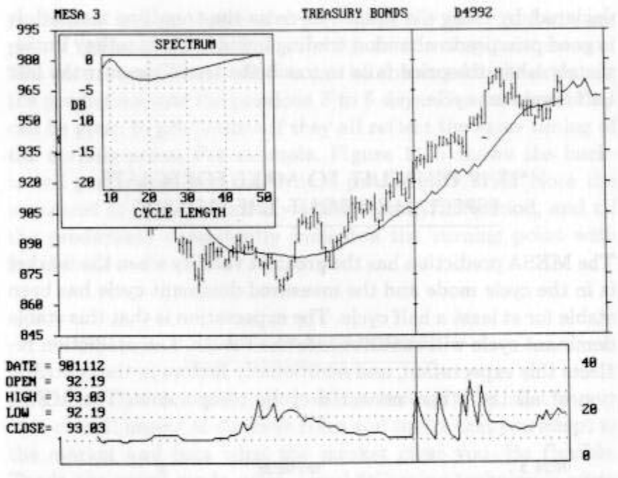
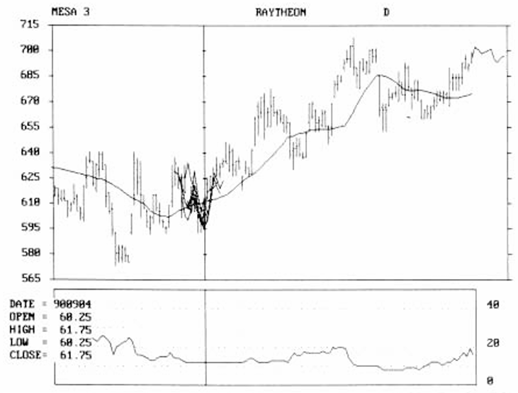

# Chapter 11: Putting It All Together

Previous chapters have addressed various concepts and theories without particular attention for application to trading. All the theories in the world are of no benefit unless they have a practical application. That’s the purpose of this chapter. We will tie the concepts together in a coordinated way to create a trading methodology. In the next chapter we show how this methodology is used in a practical example.

## MODELS SUIT MORE THAN CLOTHES

Since the market consists of several distinctive modes such as trends, seasonals, random, and short-term cycles, the first goal is to identify the current market mode. We do this by first creating a simple model of the market. This model consists of a trend plus a dominant cycle. The model is a first-order model because complex combinations of cycles are not considered. Also, seasonal variations are lumped together with trends, and both are considered the trend for the moment. The simple model also does not directly consider the sideways random market, where additional interpretation is required.

The simple model only has two components—the cycle and the trend. If we know one of these components, we automatically know the other because we know the total market. If we know the dominant cycle, we can obtain the trend simply by subtracting the cyclic component from the total market. Mathematically, if we know two components of an equation we can solve for the third component. That’s exactly what MESA does. MESA first accurately measures the cycles in the market and identifies the dominant cycle among all the measured cycles. MESA also takes a simple average equal to the length of the dominant cycle. This average removes the dominant cycle component, as explained in Chapter 4. This average is a point, when plotted on the bar chart, positioned at the day the simple average was taken. This point has been stripped of the dominant cycle component. If we repeat this each day, taking different averages as the dominant cycle changes, we can connect the points to form an “instantaneous trendline.” Quotation marks are used for the instantaneous trendline because a trendline is recovered only for the simplistic model. In actual practice the instantaneous trendline contains seasonals, secondary cycles, and other components that are ignored by the model.

Although imperfect, the mathematical model puts the market on display in a way that we traders can understand.

## ROLE MODELS SHOW THE WAY

We next examine the price action of the market relative to the instantaneous trendline. When the market is in a cycle mode, the price alternates back and forth across the trendline every half cycle. This alternation was schematically shown in Figures 2-1 and 3-9, for example. This is the fundamental definition of the cycle mode. On the other hand, when the market breaks into a trend the price stays on one side of the trendline, This is the same action a trending market takes with any moving average. The difference is that the instantaneous trendline is a very special kind of moving average. The special characteristic is that the period of the moving average is adapted to the current market conditions. It enables one of the earliest identifications of the onset of a trend.

Trend identification is straightforward. If the price range fails to touch the instantaneous trendline within a half cycle of the measured dominant cycle, a trend is declared to be in force. This is one of the quickest ways to detect the onset of the trend mode because the trend is established by inference from the measured cycle instead of being measured directly. The usual lag accompanying conventional moving averages is avoided. The cycle mode fails because the trend overwhelms the cycle amplitude, holding the price in the direction of the trend. As a result, the price fails to cross the instantaneous trendline. Cycle failure in the time domain can be reinforced with observations regarding the spectrum shape, as we discussed in Chapter 10.

**Figure 11-1** *MESA Identifies Trend Onset by Cycle Failure*

The instantaneous trendline can be curved. This is a natural result of including the seasonals and secondary cycles in the definition of a trend. A typical MESA trendline is shown in Figure 11-1 as the solid line. MESA indicates the concurrent measure dominant cycle, recalculated daily, below the bar chart on the same time scale, with the vertical scale running from zero to 50 days. On any given day, the onset of the trend is determined by counting backward half the number of days, as indicated on the dominant cycle display. The cursor location in Figure 11-1 is at the onset of a trend on 10/23/90. (The date is in the YYMMDD format in the tabular data on the chart). On this date the measured dominant cycle was 14 days as shown on the cycle display. Counting backward, and including the current day, the price has not touched the instantaneous trendline in the past 7 days (half the measured dominant cycle). Therefore, we declare the onset of the trend to have occurred on this date. The trend continues in force until the price again touches the trendline. It is possible for the price to dip down and touch the trendline for a day or two, such as at point A, before resuming the trend. In such cases, declaring the trend still to be in force is a judgment call.

The simplified model and the accurate MESA cycle measurement enable you to assess the current role, or mode, of the market. From this, you can adjust your trading strategy accordingly. You should use a trend-following strategy when the market is in the trend mode and a strategy exploiting the rapid turning points when the market is in the cycle mode.

## A SPECTRUM OF SUPPORT

The quality and resolution of the cycle measurement can be determined from the spectrum display. A simple spike in the spectrum window indicates that only a single, well-defined dominant cycle is present. If the display is a mushy bell-shaped curve, the cyclic energy is spread over a range of cycle periods. You should be less inclined to trade on the basis of cycles if the spectrum indicates this poor resolution of a dominant cycle. The poor resolution means that there is a low confidence that a single useful cycle exists. The spectrum also indicates the existence of several simultaneous cycles when they occur. The relative amplitudes and phasing of multiple cycles can make interpretations of market action more difficult. Multiple cycles can add together in a complicated way, like biorhythms, to make forecasting more problematical.

**Figure 11-2** *Spectrum Display Lifts Off the Baseline Near the Beginning of a Trend*

**Figure 11-3** *Further Lifting of the Spectrum from the Baseline Confirms Trend Development*

The spectrum can be used to anticipate the onset of a trend using the principle of proportionality. MESA considers a trend as a segment of a very long cycle. The principle of proportionality asserts that the longer cycles have a much larger amplitude than short-term cycles. MESA displays cycle periods up to 50 days on its spectrum display. Longer cycles are out of scale, so the display only catches a piece of the skirt of the bell-shaped spectrum. With reference to Figure 11-2, when the trend begins we only see the short-term cycle in the spectrum. Figure 11-3 shows the spectrum further into the trend. In this case, we start to see the skirt of the long-term cycle (trend) as the spectrum display lifts off the baseline near the right-hand side. Progressing in time, on the spectrum display. The spectrum is still further off the baseline, showing the trend is gaining strength. Finally, Figure 11-4 shows the trend well in force and the spectrum implying there is a very strong dominant cycle with a period much longer than 50 days. The trend stays in force until the price next touches the instantaneous trendline.

**Figure 11-4** *Skirt of the Trend Spectrum Swamps the Short-Term Cycle*

A good spectrum does not necessarily imply that the prediction will be good. This is because the spectrum is formed from historical data while the prediction deals with the immediate future. For example, if the market has had several high-quality cycles, the spectrum will have high resolution. As we approach the cyclic peak, the prediction correctly predicts the expected downturn. But if an uptrend really has started, the prediction is dead wrong. The predicted direction for the next several days continues to be a downturn while the spectrum is still looking good and the uptrend is roaring off. Finally, the inertia of the historical data is overcome, and the predicted direction snaps to follow the trend. This snap often comes too late, on the order of three days after the trend has been declared, by using the failure-to-cross-the-trendline method. It is good practice to abandon trading using cyclic strategy immediately when the price fails to touch the trendline over the last half dominant cycle.

## “IT IS DIFFICULT TO MAKE FORECASTS, ESPECIALLY ABOUT THE FUTURE”

The MESA prediction has the greatest validity when the market is in the cycle mode and the measured dominant cycle has been stable for at least a half cycle. The expectation is that this stable dominant cycle will continue into the future. The prediction reflects this expectation, and additionally factors in the contribution of all the other measured cyclic components, The MESA prediction is more successful predicting the timing of turning points rather than the level at which the turning points occur. The accuracy of the prediction can be enhanced by backtesting the prediction over the previous 3 to 5 days. Greater credibility can be given to predictions if they all reflect the same timing of the turning point. For example, Figure 11-5 shows the back-tested predictions for the 9 days preceding 9/4/90. Note the measured cycle was relatively stable during this period, and all the predictions consistently indicated the turning point with precision.

**Figure 11-5** *Successive Correlated Predictions Indicate a Cyclic Turning Point on 9/4/90*

## ADAPT AND SURVIVE!

Don’t be a dinosaur with your trading strategy. The most important overall aspect of all these rules and tips is that you adapt to the market and take what the market gives you. Be flexible. Trade the trend mode using trend-following techniques when you have identified this mode is in force. You should be able to switch strategy back to cycle mode trading with equal facility. Chapter 12 provides an example of how this switching is done.
